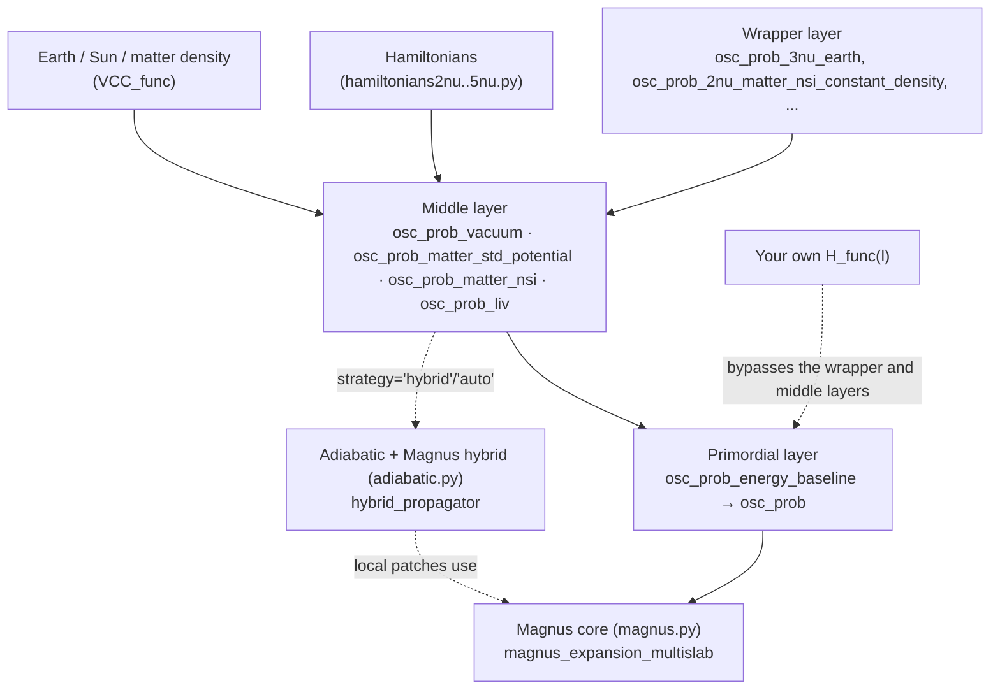

# Mag$`\nu`$s

[](https://github.com/mbustama/Magnus/actions/workflows/tests.yml)
[](https://github.com/mbustama/Magnus/actions/workflows/lint.yml)
[](https://mbustama.github.io/Magnus/)
[](https://www.gnu.org/licenses/gpl-3.0)
[](https://www.python.org/downloads/)
[](https://github.com/astral-sh/ruff)

Code to compute neutrino oscillation probabilities between an arbitrary number
of flavors, for any given Hamiltonian, time-dependent or -independent.

> **How do I say that?** Just like the name **Magnus** — the Greek letter
> **ν** (nu), the neutrino's symbol, simply stands in for the "nu" syllable.
> (And since most of this package was written while the author was based in
> Denmark, you are equally welcome to say it
> [the Danish way](https://translate.google.com/?sl=da&tl=en&text=Magnus&op=translate).)

Mag$`\nu`$s computes the neutrino evolution operator via the **Magnus
expansion**: instead of integrating the Schrödinger equation step by step, it
exponentiates truncated time-ordered integrals of the Hamiltonian over a chain
of position slabs.  Any truncation of the Magnus series lives in the Lie
algebra, so the resulting evolution operator is **exactly unitary by
construction** — probabilities are non-negative and sum to one at machine
precision, at any accuracy setting.  See
[Mathematical method](#mathematical-method) below for the full derivation.

## Table of Contents

- [When is Magνs a win?](#when-is-magnus-a-win)
- [Adiabatic + Magnus hybrid strategy for extreme accumulated phases](#adiabatic--magnus-hybrid-strategy-for-extreme-accumulated-phases)
- [When is Magνs not the right tool?](#when-is-magnus-not-the-right-tool)
- [File Tree](#file-tree)
- [Two ways to use Magνs](#two-ways-to-use-magnus)
  - [As a Python module](#as-a-python-module)
  - [As a command-line calculator](#as-a-command-line-calculator)
- [What Magνs computes](#what-magnus-computes)
- [Available oscillation-probability functions](#available-oscillation-probability-functions)
- [Code architecture](#code-architecture)
- [Mathematical method](#mathematical-method)
- [Numerical engine](#numerical-engine)
- [Performance](#performance)
- [Accuracy and validation](#accuracy-and-validation)
- [Continuous Integration](#continuous-integration)
- [Requirements](#requirements)
- [Changelog](#changelog)
- [How to Cite](#how-to-cite)
- [License](#license)
- [Author](#author)

## When is Mag$`\nu`$s a win?

Compared to solving the propagation ODE directly (e.g., with an adaptive
Runge–Kutta solver), Mag$`\nu`$s wins when one or more of these apply:

1. **The matter profile varies slowly compared to the oscillation length.**
   A Magnus slab is *exact* for a constant Hamiltonian no matter how many
   oscillation cycles it spans, so the slab size is set by how fast the
   *profile* changes, not by how fast the phase winds.  An ODE solver must
   resolve every oscillation.  For a 1-GeV neutrino crossing the Earth
   (PREM profile), Mag$`\nu`$s needs ~10 slabs plus the ~16 layer crossings,
   versus thousands of right-hand-side evaluations for `solve_ivp` — measured:
   **~2 ms vs ~360–700 ms per probability at comparable accuracy**.

2. **You scan over energy and/or direction** (spectra, oscillograms,
   sensitivity studies).  The Magnus kernel is built from fixed, data-independent
   matrix operations, so slabs — and, for the standard/NSI/LIV Hamiltonians,
   the *entire energy axis* — evaluate as batched NumPy/BLAS calls.  Adaptive
   ODE integration is inherently sequential and cannot share steps across
   energies.  Measured: a 200-energy Earth-crossing scan takes **76 ms**
   (0.4 ms per energy); a 100×100 oscillogram takes **~2 s**.

3. **Unitarity matters more than raw local error** — long baselines, small
   probabilities, CP/T asymmetries.  Runge–Kutta iterates drift off the
   unitary manifold (probability leaks of ~10⁻⁶ at typical tolerances, growing
   with baseline); the Magnus route has no leakage to leak, ever
   (rows sum to 1 to ~10⁻¹⁴).

4. **You want arbitrary physics with no per-model work**: any number of
   flavors, any Hermitian Hamiltonian — sterile neutrinos, NSI,
   Lorentz-invariance violation, or your own matrix function of energy and
   position.

When is it *not* the best tool?  For a single probability at a single energy,
any method is fast enough.  For **extreme accumulated phases** — e.g.,
~10-MeV neutrinos crossing most of the Sun (~10⁴ rad of matter-dominated
phase) — the plain Magnus slab-refinement method can need a very large slab
count, and warns (`ToleranceNotAchievedWarning`) instead of failing silently
if it hits its caps first.  This regime is now handled automatically:
`osc_prob_matter_std_potential`,
`osc_prob_matter_nsi`, `osc_prob_liv`, and every wrapper built on them
(including all `osc_prob_*_sun*` functions) handle exactly this regime
automatically, via `strategy='auto'` (the default): see [Adiabatic + Magnus
hybrid strategy](#adiabatic--magnus-hybrid-strategy-for-extreme-accumulated-phases)
below.  A tight-tolerance ODE solver remains the best *reference* for
validation regardless — Mag$`\nu`$s's own test suite uses
`scipy.integrate.solve_ivp` at `rtol=1e-12` as ground truth.

## Adiabatic + Magnus hybrid strategy for extreme accumulated phases

For a position-dependent Hamiltonian with no user-supplied slab edges, every
matter/NSI/LIV oscillation-probability function accepts a `strategy` keyword:
`'auto'` (default), `'hybrid'`, or `'magnus'`.

- **`'magnus'`** uses only the Magnus-expansion machinery described above —
  the exact behavior of Mag$`\nu`$s as it was before the adiabatic strategy
  was added.
- **`'hybrid'`** additionally tries an adiabatic-transport-plus-Magnus-patch
  propagator (`magnus.adiabatic.hybrid_propagator`): away from an eigenvalue
  crossing of the instantaneous Hamiltonian, the evolution operator is
  computed via the *instantaneous eigenbasis* (a dynamical + geometric phase,
  cheap regardless of how large the accumulated phase is); near a genuine MSW
  resonance, a short, exact Magnus patch is stitched in via the exact
  composition law of quantum evolution.  The result is exactly unitary
  regardless of the approximation's accuracy, and the whole computation is
  self-certified by tightening every internal tolerance knob until two
  successive results agree.  Works for **any number of flavors** and **any
  number of simultaneous or sequential resonances** — not just the
  two-flavor case.
- **`'auto'`** tries `'hybrid'` first, silently falling back to `'magnus'`
  for any point where it does not apply or fails to self-certify.

```python
import magnus.oscprob as oscprob
import magnus.globaldefs as gd

# 8 MeV, most of the way through the Sun: deep in the regime that used to
# need a very large slab count under strategy='magnus'.
P = oscprob.osc_prob_3nu_sun(8.0*gd.UNIT_MEV, 0.9*gd.SUN_RADIUS*gd.UNIT_KM, 0.0)
# strategy='auto' by default: warning-free, and matches solve_ivp to ~1e-4.
```

See the [full derivation, validation, and worked examples](https://mbustama.github.io/Magnus/adiabatic_strategy.html)
in the docs.

## When is Mag$`\nu`$s not the right tool?

Mag$`\nu`$s solves the **unitary** Schrödinger equation for a Hermitian
Hamiltonian: any truncation of the Magnus series lives in the Lie algebra, so
the package is architecturally committed to norm-preserving, reversible
evolution.  That rules out several classes of problems that show up in
neutrino phenomenology:

1. **Quantum decoherence.**  Wave-packet separation, quantum-gravity-induced
   decoherence, or any model where coherence between mass eigenstates is
   damped over the baseline requires evolving a density matrix under a
   non-unitary master equation (e.g., Lindblad/GKSL), not a state vector
   under a Hamiltonian.  Mag$`\nu`$s has no dissipative term and cannot
   represent one.

2. **Open-system coupling to a bath.**  Any scenario where the neutrino
   exchanges energy or phase information with an environment — collisional
   decoherence, thermal baths, stochastic scattering beyond the mean-field
   matter potential — needs a reduced density matrix with dissipators,
   which is again outside a Hermitian-Hamiltonian, pure-state framework.

3. **Neutrino decay.**  Invisible or visible decay into lighter states
   removes probability from the system, so the evolution is no longer
   norm-preserving.  A Hermitian effective Hamiltonian cannot encode a decay
   width — that requires an anti-Hermitian term, which breaks the unitarity
   the whole method relies on.

4. **Self-consistent collective oscillations.**  Dense-environment (e.g.,
   supernova) neutrino self-interactions, where the effective Hamiltonian
   depends on the (unknown, evolving) neutrino/antineutrino flavor content
   itself, are a nonlinear, self-consistent problem.  Mag$`\nu`$s assumes the
   Hamiltonian is a *known* function of energy and position supplied by the
   caller, not a functional of the solution.

If your problem needs any of the above, look instead at packages built
around density-matrix/Lindblad evolution (for decoherence or decay) or
dedicated collective-oscillation codes (for self-interaction problems).

---

## File Tree

The project structure separates the Magnus-expansion numerical core from the
oscillation-probability API, the physics modules (Hamiltonians, Earth/Sun
environments), documentation, and tests (file tree generated by running
`git ls-files`):

```text
Magnus/
├── .github/
│   └── workflows/
│       ├── lint.yml                 # Ruff lint (blocking) + CLI-reference drift check
│       ├── pages.yml                # GitHub Pages deployment for the Sphinx documentation
│       ├── publish.yml              # PyPI (OIDC) automated publishing workflow, on GitHub Release
│       └── tests.yml                # GitHub Actions CI testing pipeline (Python 3.10-3.12) + coverage
├── docs/                            # Sphinx documentation configuration and source
│   ├── source/
│   │   ├── conf.py                  # Sphinx build configuration (autoapi + napoleon + bibtex + mermaid + myst)
│   │   ├── index.rst                # Master documentation page: overview, features, when Magnus wins
│   │   ├── installation.rst         # Requirements, install instructions, file tree
│   │   ├── quickstart.rst           # Worked Python-API code examples for every entry point
│   │   ├── cli.rst                  # Command-line calculator: flag reference and examples
│   │   ├── functions.rst            # Full osc_prob_{2,3,4,5}nu_* listing, grouped by environment/scenario
│   │   ├── architecture.rst         # The wrapper/middle/primordial layering, with diagrams
│   │   ├── methodology.rst          # The Magnus expansion, integrators, and performance engineering
│   │   ├── adiabatic_strategy.rst   # The adiabatic + Magnus hybrid strategy: derivation, diagrams, validation
│   │   ├── tutorials.rst            # Guide to the numbered example notebooks in notebooks/
│   │   ├── references.rst           # Bibliography page rendering
│   │   ├── refs.bib                 # BibTeX citations for the Magnus-expansion and PREM literature
│   │   └── changelog.rst            # Renders the root CHANGELOG.md via myst-parser
│   ├── requirements.txt             # Sphinx + theme + extensions needed to build the docs
│   ├── make_figures.py              # Regenerates the data-driven SVG in source/_static/
│   ├── regen_cli_help.py            # Regenerates the --help block quoted in source/cli.rst
│   ├── Makefile                     # Build commands for Unix
│   └── make.bat                     # Build commands for Windows
├── fig/                             # Plots produced by the example notebooks
├── notebooks/                       # Numbered Jupyter notebooks -- see docs/source/tutorials.rst
│   ├── 01_magnus_introduction.ipynb
│   ├── 02_magnus_2nu_vacuum_matter.ipynb
│   ├── 03_magnus_3nu_vacuum_matter.ipynb
│   ├── 04_magnus_long_baseline.ipynb
│   ├── 05_magnus_biprobability.ipynb
│   ├── 06_magnus_oscillograms.ipynb
│   ├── 07_magnus_bsm_sterile_nu.ipynb
│   ├── 08_magnus_bsm_nsi.ipynb
│   ├── 09_magnus_bsm_liv.ipynb
│   ├── 10_magnus_matrix_exponential.ipynb
│   ├── 11_magnus_adiabatic_hybrid_strategy.ipynb
│   ├── matplotlibrc                 # Shared plot styling for the notebooks
│   └── README.md                    # Per-notebook description and suggested reading order
├── src/
│   └── magnus/                      # Main Python package
│       ├── __init__.py              # Explicitly imports/exposes the 8 modules below
│       ├── magnus.py                # Magnus-expansion numerical core: term recursion, GL integrators, batched kernel
│       ├── adiabatic.py             # Adiabatic transport + Magnus-patch hybrid strategy (strategy='hybrid'/'auto')
│       ├── oscprob.py                # osc_prob and every physics-scenario wrapper (main API)
│       ├── oscprobstd.py            # Closed-form 2nu/3nu probabilities (used to validate the wrapper API)
│       ├── hamiltonians/            # 2nu-5nu Hamiltonians: vacuum, matter, NSI, LIV (the one true subpackage)
│       │   ├── __init__.py          # Explicit named imports from the four hamiltonians{2,3,4,5}nu.py modules
│       │   ├── hamiltonians2nu.py
│       │   ├── hamiltonians3nu.py
│       │   ├── hamiltonians4nu.py
│       │   └── hamiltonians5nu.py
│       ├── earth.py                 # PREM density profile, chord/zenith-angle geometry
│       ├── matter.py                # Density profiles, electron number density, CC potential
│       ├── globaldefs.py            # Units, physical constants, NuFit parameter sets
│       ├── cli.py                   # `magnus` command-line calculator (also `python -m magnus`)
│       ├── __main__.py              # Entry point for `python -m magnus`
│       ├── authors.py               # Package author string (internal; not part of the public API)
│       └── version.py               # Resolves the version from pyproject.toml (internal)
├── tests/                           # Test suite (pytest; runs in CI)
│   ├── conftest.py                  # Path setup so magnus is importable without installation
│   ├── test_magnus_expansion.py     # Magnus-core correctness (terms, orders, GL rates, unitarity)
│   ├── test_adiabatic.py            # Adiabatic + Magnus hybrid strategy: detection, merging, ODE cross-checks
│   ├── test_oscprob.py              # Oscillation-probability engine, closed-form and ODE cross-checks
│   ├── test_earth_matter.py         # PREM profile, chord geometry, electron density
│   ├── test_hamiltonians.py         # Hamiltonian/mixing-matrix builders
│   ├── test_cli.py                  # magnus command-line calculator
│   ├── test_globaldefs.py           # NuFit historical parameter dict/loader
│   ├── test_validation.py           # Input-validation guards and their error messages
│   └── test_version.py              # Version resolution from pyproject.toml / installed metadata
├── .gitignore
├── CHANGELOG.md                     # Version history (Keep a Changelog format)
├── LICENSE                          # GNU GPL v3 (GPL-3.0-only), the full license text
├── pyproject.toml                   # Build system, dependencies, and the `magnus` console-script entry point
└── README.md                        # This file
```

---

## Two ways to use Mag$`\nu`$s

Mag$`\nu`$s works both as an **importable Python module** (the full API —
arbitrary Hamiltonians, energy/direction scans, NSI, LIV, steriles) and as a
**command-line calculator** (`magnus prob ...` — one probability, no Python
required). Use the module for anything programmatic (scans, plots, fitting);
use the CLI for a quick one-off number, a shell script, or to sanity-check a
parameter choice.

Install it with `pip install --pre magnuspy` (the `--pre` is needed while the
current release is a release candidate; drop it once 1.0.0 final is out), or
`pip install -e .` from a checkout. The distribution is called **magnuspy** on
PyPI because plain `magnus` was already taken by an unrelated project, but the
import package is `magnus`, as below.

### As a Python module

```python
import numpy as np
import magnus.oscprob as oscprob
import magnus.globaldefs as gd

# --- Three-flavor vacuum probability at 1 GeV over 1000 km ---
energy = 1.0*gd.UNIT_GEV      # [eV]
L = 1000.0*gd.UNIT_KM         # [eV^-1]
P = oscprob.osc_prob_3nu_vacuum(energy, L)   # 3x3 matrix, P[i][j] = P(nu_i -> nu_j)

# --- Energy scan through the Earth (PREM), nu_e -> nu_mu ---
energies = np.logspace(-0.3, 1.3, 200)*gd.UNIT_GEV
# integration_method defaults to 'gl' (Gauss-Legendre): fastest and most accurate
P_scan = oscprob.osc_prob_3nu_earth(
    energies, costhz=-0.8, L=2.0*6371.0*0.8*gd.UNIT_KM,
    nu_i=gd.NUE, nu_f=gd.NUMU)

# --- Your own Hamiltonian through the Earth ---
# H(energy, l, VCC): VCC is the PREM charged-current potential at position l
h_vac = ...  # your energy-independent vacuum term [eV^2]
def H(energy, l, VCC):
    return (1.0/energy)*h_vac + np.asarray(VCC)[..., None, None]*np.diag([1.0, 0.0, 0.0])

P = oscprob.osc_prob_earth(H, energy, loc_ini='fermilab', loc_fin='homestake')

# --- Fully generic: any Hamiltonian function of position ---
P = oscprob.osc_prob(H_func, t_ini=0.0, t_fin=L)   # H_func(l) -> (d, d) array
```

Oscillation parameters default to the NuFit 6.0 best fit (normal ordering);
pass `s12`, `D31`, `dCP`, ..., or `nubar=True`, to change them.  Find many
worked examples — vacuum, matter, Earth, Sun, oscillograms, biprobability
plots, steriles, NSI, LIV — in the [Jupyter notebooks](notebooks/).

### As a command-line calculator

Installing the package also installs a `magnus` command
(equivalently, `python -m magnus`), for computing a single probability
without writing any Python. `magnus prob --help` lists every flag; the
[full CLI reference](https://mbustama.github.io/Magnus/cli.html) documents
all of them. A few real examples (verified output, this version):

```bash
$ magnus prob --flavors 3 --environment vacuum \
    --energy 1 --energy-unit GeV --baseline 1300 --baseline-unit km
Magνs 1.0.0rc1 -- osc_prob_3nu_vacuum
E = 1 GeV, L = 1300 km

            nu_e   nu_mu  nu_tau
nu_e      0.9297  0.0085  0.0618
nu_mu     0.0311  0.3885  0.5804
nu_tau    0.0393  0.6029  0.3578
```

```bash
$ magnus prob --flavors 3 --environment earth \
    --energy 1 --energy-unit GeV --costhz -0.8 --baseline 10193.6 --baseline-unit km
Magνs 1.0.0rc1 -- osc_prob_3nu_earth
E = 1 GeV, L = 10193.6 km

            nu_e   nu_mu  nu_tau
nu_e      0.9128  0.0863  0.0009
nu_mu     0.0629  0.6681  0.2690
nu_tau    0.0243  0.2456  0.7301
```

A single channel (rather than the full matrix), and NSI/LIV/sterile flags,
work the same way:

```bash
$ magnus prob --flavors 3 --environment vacuum --energy 1 --energy-unit GeV \
    --baseline 1300 --baseline-unit km --nu-i e --nu-f mu
Magνs 1.0.0rc1 -- osc_prob_3nu_vacuum
E = 1 GeV, L = 1300 km

P = 0.0085

$ magnus prob --flavors 3 --environment matter --scenario nsi --rho 2.7 \
    --eps-ee 0.06 --eps-em -0.06 \
    --energy 1 --energy-unit GeV --baseline 1000 --baseline-unit km
Magνs 1.0.0rc1 -- osc_prob_3nu_matter_nsi_constant_density
E = 1 GeV, L = 1000 km

            nu_e   nu_mu  nu_tau
nu_e      0.9898  0.0093  0.0009
nu_mu     0.0093  0.9906  0.0001
nu_tau    0.0009  0.0001  0.9990
```

Pass `--json` for machine-readable output (e.g., to pipe into `jq` or another
script) instead of the table.

## What Mag$`\nu`$s computes

- **Flavors:** 2ν, 3ν, 4ν (3+1), 5ν (3+2) via dedicated wrappers; any number
  of flavors via the generic `osc_prob`.
- **Environments:** vacuum, constant-density matter, exponentially falling
  density, the Earth (PREM, including chords between named detector sites),
  the Sun; or any density profile you supply.
- **Beyond the Standard Model:** non-standard interactions (NSI),
  CPT-odd Lorentz-invariance violation (LIV), and — via `osc_prob`,
  `osc_prob_earth`, `osc_prob_sun` — arbitrary user Hamiltonians.
- **Neutrinos and antineutrinos**, single energies or arrays, full probability
  matrices or single channels.

## Available oscillation-probability functions

Every combination of environment and scenario below has a dedicated,
explicitly-named `osc_prob_{N}nu_...` function for `N` in `{2, 3, 4, 5}`
(e.g. `osc_prob_3nu_matter_nsi_constant_density`) — see
[the full listing with signatures](https://mbustama.github.io/Magnus/functions.html)
in the docs. For anything not covered here — any other number of flavors,
or a Hamiltonian this table doesn't anticipate — use the generic
`osc_prob`/`osc_prob_earth`/`osc_prob_sun` entry points directly (see
[Quick start](#two-ways-to-use-magnus) above).

| Environment | Scenario | Function pattern (`{N}` = 2, 3, 4, 5) |
|---|---|---|
| Vacuum | Standard | `osc_prob_{N}nu_vacuum` |
| Vacuum | LIV | `osc_prob_{N}nu_vacuum_liv` |
| Matter, constant density | Standard | `osc_prob_{N}nu_matter_constant_density` |
| Matter, constant density | NSI | `osc_prob_{N}nu_matter_nsi_constant_density` |
| Matter, constant density | LIV | `osc_prob_{N}nu_matter_liv_constant_density` |
| Matter, exponential density | Standard | `osc_prob_{N}nu_matter_exp_density` |
| Matter, exponential density | NSI | `osc_prob_{N}nu_matter_nsi_exp_density` |
| Matter, exponential density | LIV | `osc_prob_{N}nu_matter_liv_exp_density` |
| Earth (PREM) | Standard | `osc_prob_{N}nu_earth` |
| Earth (PREM) | NSI | `osc_prob_{N}nu_earth_nsi` |
| Earth (PREM) | LIV | `osc_prob_{N}nu_earth_liv` |
| Sun | Standard | `osc_prob_{N}nu_sun` |
| Sun | NSI | `osc_prob_{N}nu_sun_nsi` |
| Sun | LIV | `osc_prob_{N}nu_sun_liv` |

The [command-line calculator](#as-a-command-line-calculator) exposes this
same table via `--environment`/`--scenario`/`--flavors`.

## Code architecture

Mag$`\nu`$s's oscillation-probability API (`src/magnus/oscprob.py`) is
organized as three layers, so that adding a new default or fixing a bug in
one place fixes it everywhere instead of needing to be copy-pasted across
dozens of functions:

1. **Wrapper layer** (~60 functions, e.g. `osc_prob_3nu_earth`,
   `osc_prob_2nu_matter_nsi_constant_density`) — one function per
   (flavor count) × (environment) × (BSM scenario) combination. Each just
   names its physics parameters explicitly (for a good IDE/autocomplete and
   docs experience) and repackages them for the layer below.
2. **Middle layer** (`osc_prob_vacuum`, `osc_prob_matter_std_potential`,
   `osc_prob_matter_nsi`, `osc_prob_liv`) — one function per physics
   scenario, generic in the number of flavors. Builds the right Hamiltonian
   (from `hamiltonians{2,3,4,5}nu.py`) and the matter potential (from
   `magnus.earth` / `magnus.matter`), then calls down.
3. **Primordial layer** (`osc_prob_energy_baseline`, `osc_prob`) — owns the
   adaptive slab refinement and the single call into the Magnus core
   (`magnus.magnus`). `osc_prob` is also a fully public, generic entry point:
   pass it *any* Hamiltonian function of position and it works, no wrapper
   required.



`magnus.adiabatic` is a self-contained sibling of `magnus.magnus` (it depends
only on the Magnus core, never on `oscprob.py`): the middle layer calls into
it directly, at the same point where it would otherwise hand off to the
primordial layer, whenever `strategy` allows it and the Hamiltonian is
position-dependent. See [Adiabatic + Magnus hybrid
strategy](#adiabatic--magnus-hybrid-strategy-for-extreme-accumulated-phases)
above and the [dedicated docs
page](https://mbustama.github.io/Magnus/adiabatic_strategy.html) for the
full derivation.

See [Code architecture](https://mbustama.github.io/Magnus/architecture.html)
in the full documentation for the naming conventions, the `**kwargs`
forwarding contract between layers, and a walkthrough of how to add your own
wrapper.

## Mathematical method

This section derives, in full, how Mag$`\nu`$s computes the neutrino
time-evolution operator and the oscillation probability from it.

### 1. The physical problem

A neutrino created in a flavor eigenstate $|\nu(l_0)\rangle$ propagates
according to a Schrödinger-like equation in position $l$ (equivalently,
time, since ultrarelativistic neutrinos travel at $\approx c$):

```math
i\,\frac{d}{dl}\,|\nu(l)\rangle = H(l)\,|\nu(l)\rangle ,
```

where $H(l)$ is the $d\times d$ Hermitian flavor Hamiltonian ($d$ = number of
flavors), generally position-dependent through a matter potential term. The
**evolution operator** $U(l,l_0)$ is defined by $|\nu(l)\rangle =
U(l,l_0)\,|\nu(l_0)\rangle$ for every initial condition, so it obeys the same
equation,

```math
i\,\frac{d}{dl}\,U(l,l_0) = H(l)\,U(l,l_0) , \qquad U(l_0,l_0)=\mathbb{1} ,
```

and, because $H$ is Hermitian, $U$ is unitary: $U^\dagger(l,l_0)\,U(l,l_0) =
\mathbb{1}$ for all $l$. Unitarity here is exactly probability conservation:
whatever superposition of flavors the neutrino is found in, the flavor
probabilities must sum to 1.

### 2. Why not just exponentiate the Hamiltonian?

If $H(l)$ commuted with itself at every pair of positions — true only in
vacuum or in matter of constant density — the solution would simply be

```math
U(l,l_0) = \exp\!\left[-i\!\int_{l_0}^{l}\! H(l')\,dl'\right] .
```

In general, though, $[H(l_1),H(l_2)]\neq 0$ for $l_1\neq l_2$ (a
position-dependent matter potential does not commute with the vacuum term),
and the equation above is then simply **wrong**: it silently drops all the
operator-ordering information. The mathematically correct object is the
*position-ordered* exponential (a Dyson series),

```math
U(l,l_0) = \mathcal{P}\exp\!\left[-i\!\int_{l_0}^{l}\! H(l')\,dl'\right]
= \sum_{n=0}^{\infty} (-i)^n \!\int_{l_0}^{l}\!\!dl_1\!\int_{l_0}^{l_1}\!\!dl_2 \cdots \!\int_{l_0}^{l_{n-1}}\!\!dl_n\; H(l_1)H(l_2)\cdots H(l_n) ,
```

which is exact but numerically awkward: each term is a nested,
time-ordered multi-dimensional integral, the series converges slowly, and,
more importantly, truncating it at any finite order does **not** in general
give a unitary operator, so naive truncation leaks probability.

### 3. The Magnus expansion

The Magnus expansion resolves this by writing the *exact* solution as a
**single, ordinary (non-ordered) exponential** of an operator $\Omega(l)$:

```math
U(l,l_0) = \exp\!\big[\Omega(l)\big] , \qquad \Omega(l) = \sum_{k=1}^{\infty} \Omega_k(l) .
```

Define $A(l) \equiv -i\,H(l)$ (anti-Hermitian, since $H$ is Hermitian). The
terms $\Omega_k$ are generated by a recursion built from nested commutators
of $A$, weighted by the Bernoulli numbers $B_j$ (in the convention
$B_0=1,\,B_1=-\tfrac12,\,B_2=\tfrac16,\,B_3=0,\,B_4=-\tfrac1{30},\,B_5=0,\dots$):

```math
\Omega_1(l) = \int_{l_0}^{l} A(s)\,ds ,
```

```math
\Omega_n(l) = \sum_{j=1}^{n-1} \frac{B_j}{j!} \int_{l_0}^{l} S_n^{(j)}(s)\,ds \qquad (n\geq 2) ,
```

with $S_n^{(j)}$ a sum of $j$-fold nested commutators of lower-order terms
with $A$, generated recursively by $S_n^{(1)} = [\Omega_{n-1},A]$ and
$S_n^{(j)} = \sum_{i=1}^{n-j}\big[\Omega_i,\,S_{n-i}^{(j-1)}\big]$ for
$2\leq j\leq n-1$. Because the odd Bernoulli numbers $B_3=B_5=\cdots=0$
vanish, whole commutator groups drop out; Mag$`\nu`$s implements this
recursion through $n=6$, using only $B_1$ (coefficient $-\tfrac12$), $B_2$
(coefficient $\tfrac{1}{12}$), and $B_4$ (coefficient $-\tfrac{1}{720}$).
Written out explicitly, with $[\cdot,\cdot]$ the matrix commutator:

```math
\Omega_1 = \int_{l_0}^{l} A \; ds
```

```math
\Omega_2 = \int_{l_0}^{l} \left(-\tfrac12\,[\Omega_1,A]\right) ds
```

```math
\Omega_3 = \int_{l_0}^{l} \left(-\tfrac12\,[\Omega_2,A] \;+\; \tfrac{1}{12}\,[\Omega_1,[\Omega_1,A]]\right) ds
```

```math
\Omega_4 = \int_{l_0}^{l} \left(-\tfrac12\,[\Omega_3,A] \;+\; \tfrac{1}{12}\Big([\Omega_1,[\Omega_2,A]] + [\Omega_2,[\Omega_1,A]]\Big)\right) ds
```

and similarly for $\Omega_5$ and $\Omega_6$, which additionally involve the
$B_4$-weighted quadruple commutators (see
[`src/magnus/magnus.py`](src/magnus/magnus.py) for the full,
tested expressions). This is not an approximation scheme in the usual sense
of a truncated Taylor series in a small parameter — it is an exact identity
order by order in the *number of nested commutators*, and it is this
structure, not the truncation itself, that guarantees unitarity (next
section).

### 4. Truncation is exactly unitary, at any order

This is the central practical guarantee of the method. Every $\Omega_k$
above is built purely from **real**-coefficient, nested **commutators** of
the anti-Hermitian matrix $A$. The commutator of two anti-Hermitian matrices
is itself anti-Hermitian: if $X^\dagger=-X$ and $Y^\dagger=-Y$, then

```math
[X,Y]^\dagger = (XY-YX)^\dagger = Y^\dagger X^\dagger - X^\dagger Y^\dagger = YX-XY = -[X,Y] .
```

By induction on the nesting depth, and since a real linear combination of
anti-Hermitian matrices is anti-Hermitian, every $\Omega_k$ — and therefore
any partial sum $\Omega^{(N)} = \sum_{k=1}^{N}\Omega_k$, for *any* truncation
order $N$ — is anti-Hermitian. Consequently

```math
U^{(N)} \equiv \exp\!\big[\Omega^{(N)}\big]
```

is **exactly unitary**: $\big(U^{(N)}\big)^\dagger U^{(N)} =
\exp\!\big[(\Omega^{(N)})^\dagger\big]\exp\!\big[\Omega^{(N)}\big] =
\exp\!\big[-\Omega^{(N)}\big]\exp\!\big[\Omega^{(N)}\big] = \mathbb{1}$,
independent of $N$ and independent of any numerical error made evaluating
the integrals that define $\Omega_1,\ldots,\Omega_N$. Truncating the
expansion, or evaluating its integrals only approximately, can make $U^{(N)}$
inaccurate (a wrong phase, a wrong mixing angle) — but it can **never** make
it non-unitary. Probabilities computed from $U^{(N)}$ are therefore
automatically non-negative and automatically sum to 1, at machine precision,
regardless of accuracy settings.

This is qualitatively different from directly integrating the Schrödinger
equation with a generic ODE solver (e.g., Runge–Kutta): the local truncation
error of a generic step is *not* anti-Hermitian, so the numerically
propagated operator slowly drifts off the unitary manifold, and probability
visibly "leaks" (typically at the $10^{-6}$ level per step for standard
tolerances, accumulating over many steps).

### 5. Convergence of the series

The Magnus series converges absolutely whenever

```math
\int_{l_0}^{l} \big\lVert A(s) \big\rVert_2 \, ds < \pi ,
```

a sufficient (not necessary) condition, with $\lVert\cdot\rVert_2$ the
spectral (operator) norm. Because of this, Mag$`\nu`$s never applies the
series over an entire long trajectory at once. Instead, it partitions
$[l_0,l_f]$ into a chain of **slabs**,

```math
l_0 < l_1 < l_2 < \cdots < l_N = l_f ,
```

and applies the truncated series independently inside each slab, choosing
enough slabs that the accumulated phase per slab stays comfortably under the
bound above (Mag$`\nu`$s estimates this automatically to seed the slab count,
and emits `MagnusConvergenceWarning` if a slab is not comfortably inside the
guaranteed regime — raising the expansion order does not help there; more,
narrower slabs are needed instead).

### 6. Chaining slabs: the position-ordered product

Within slab $k$ (from $l_{k-1}$ to $l_k$), the truncated Magnus series gives
$U_k \equiv U(l_k,l_{k-1})$. The full evolution operator across the chain is
the operator-ordered product of the per-slab operators, with the operator of
the **last** slab traversed appearing **leftmost**:

```math
U(l_f,l_0) = U_N\,U_{N-1}\cdots U_2\,U_1 .
```

This ordering matters physically whenever consecutive slabs' Hamiltonians do
not commute — e.g., an asymmetric matter-density profile together with a
nonzero CP-violating phase — exactly as position-ordering mattered in the
Dyson series of Section 2; it is the discrete, slab-wise realization of the
same physical requirement.

### 7. Evaluating $\Omega$ inside a slab: two integration methods

Computing the nested integrals of Section 3 requires sampling $A(l)$ inside
each slab. Mag$`\nu`$s offers two families:

**(a) Gauss–Legendre commutator-free integrators** (`'gl'`, the default). Following
Blanes, Casas & Ros (2000), orders 2, 4, and 6 can each be reached from only
1, 2, or 3 evaluations of $A$ *per slab*, sampled at the Gauss–Legendre
nodes, with the quadrature order matched exactly to the truncation order —
no cumulative integration and no separate commutator bookkeeping needed.
With $h$ the slab width and $A_i \equiv A(l_i)$ the Hamiltonian sampled at
node $i$:

```math
\Omega^{(2)} = h\,A_1 \qquad \text{(1 node, midpoint)}
```

```math
\Omega^{(4)} = \frac{h}{2}\big(A_1+A_2\big) \;+\; \frac{\sqrt{3}}{12}\,h^2\,[A_2,A_1] \qquad \text{(2 nodes)}
```

and, with 3 nodes, defining the intermediate combinations $a_1=hA_2$,
$a_2=\tfrac{\sqrt{15}}{3}h(A_3-A_1)$, $a_3=\tfrac{10}{3}h(A_3-2A_2+A_1)$,
$C_1=[a_1,a_2]$, and $C_2=-\tfrac{1}{60}[a_1,2a_3+C_1]$:

```math
\Omega^{(6)} = a_1 + \frac{a_3}{12} + \frac{1}{240}\Big[-20\,a_1-a_3+C_1,\; a_2+C_2\Big] \qquad \text{(3 nodes)} .
```

Because it needs far fewer Hamiltonian evaluations for the same accuracy,
`'gl'` is simultaneously the fastest and the most accurate method whenever
the Hamiltonian is smooth within a slab — which slab edges aligned to
density discontinuities, e.g. at the PREM layer boundaries inside the Earth,
make the common case. That is why it is the default.

Note that `'gl'` uses a fixed 1, 2, or 3 nodes per slab, so
`n_tpts_per_slab` plays no role for it: accuracy is set by the slab count
alone, and the adaptive refinement grows only `n_slabs`.

**(b) Cumulative quadrature** (`'trapezoid'`, `'simpson'`). Sample $A$ on a
uniform grid of `n_tpts_per_slab` points spanning the slab and evaluate the
nested integrals via cumulative trapezoid or Simpson quadrature. Slower for
the same accuracy on a smooth profile, but fully general, and so the safer
choice if $A(l)$ has a kink or a discontinuity *inside* a slab, where
Gauss–Legendre loses its order advantage. The quadrature error ($O(h^2)$ or
$O(h^4)$ in the grid spacing $h$) can dominate the Magnus truncation error at
high expansion orders unless the number of grid points grows accordingly.

### 8. From $\Omega$ to $U$: an exactly unitary matrix exponential

Since the truncated $\Omega$ used in each slab is anti-Hermitian (Section
4), Mag$`\nu`$s computes its exponential from the eigendecomposition of the
Hermitian matrix $K \equiv i\,\Omega$:

```math
K = V \, \mathrm{diag}(\lambda) \, V^\dagger , \qquad \lambda\in\mathbb{R}^d ,\ V^\dagger V = \mathbb{1} ,
```

```math
U = \exp(\Omega) = \exp(-iK) = V \, \mathrm{diag}\!\big(e^{-i\lambda}\big) \, V^\dagger .
```

Besides being faster than a general (Padé-based) matrix exponential for
stacks of small matrices — it batches over slabs and, for scans, over
neutrino energies — this construction is unitary *by definition*: $V$ is
unitary and every eigenvalue phase $e^{-i\lambda}$ has modulus exactly 1, so
there is no residual non-unitarity to track, reinforcing Section 4 at the
level of the actual floating-point computation.

### 9. From the evolution operator to the oscillation probability

A neutrino produced with flavor $\alpha$ at $l_0$ starts in the flavor basis
vector $|\nu_\alpha(l_0)\rangle = |\alpha\rangle$. At position $l$, its state
is $|\nu(l)\rangle = U(l,l_0)\,|\alpha\rangle$ — the $\alpha$-th column of
$U$. The amplitude to detect flavor $\beta$ is $\langle\beta|\nu(l)\rangle =
U_{\beta\alpha}$, so, by the Born rule, the oscillation probability is

```math
P(\nu_\alpha \to \nu_\beta;\, l_0 \to l) = \big|\langle\beta|\,U(l,l_0)\,|\alpha\rangle\big|^2 = \big|U_{\beta\alpha}\big|^2 .
```

In code, this is the convention `P[i][j] = |U[j][i]|**2`, i.e. the returned
probability matrix is $P = \big(|U|^2\big)^{T}$ (elementwise squared modulus,
then transpose), with array indices $[i][j]$ corresponding to $(\alpha,
\beta)$. Because $U$ is exactly unitary (Sections 4 and 8),

```math
\sum_{\beta} \big|U_{\beta\alpha}\big|^2 = \sum_{\beta} \big(U^\dagger\big)_{\alpha\beta} U_{\beta\alpha} = \big(U^\dagger U\big)_{\alpha\alpha} = 1 ,
```

so every row of $P$ sums to exactly 1 — probability conservation — for any
truncation order and any slab count.

For antineutrinos, Mag$`\nu`$s builds the antineutrino Hamiltonian
$H_{\bar\nu}(l)$ from $H(l)$ by (i) flipping the sign of the coherent
forward-scattering matter potential, $V_{CC}\to -V_{CC}$ (electrons couple
to $\nu_e$ and $\bar\nu_e$ with opposite-sign weak charge), and (ii)
complex-conjugating the vacuum and NSI mixing matrices (equivalent to
$\delta_{CP}\to-\delta_{CP}$ in the standard parametrization) — the same
Magnus machinery above then applies unchanged.

## Numerical engine

- Magnus expansion to **order 6**, with the term recursion verified
  term-by-term against Blanes, Casas, Oteo & Ros,
  [Phys. Rep. 470, 151 (2009)](https://doi.org/10.1016/j.physrep.2008.11.001).
- Three integration methods.  The default, `'gl'` — **Gauss–Legendre
  commutator-free integrators** of orders 2/4/6 that need only 1/2/3
  Hamiltonian evaluations per slab (Blanes, Casas & Ros, BIT 40, 434
  (2000)) — is both the fastest and the most accurate for a
  smooth-per-slab profile, which layer-aligned slabs make the common case.
  `'trapezoid'` and `'simpson'` (cumulative quadrature over
  `n_tpts_per_slab` points) remain available, and are the safer choice if
  the Hamiltonian has a kink or a discontinuity *inside* a slab.
- **Exactly unitary exponentials** from the eigendecomposition of the
  (anti-Hermitian) Magnus operator, batched over slabs and energies.
- **Magnus expansion terms at any order**: `magnus.expansionterms` derives
  them from the Bernoulli recursion symbolically, in exact rational
  arithmetic, which is what verifies the hard-coded coefficients rather than
  taking them on trust. Orders 1–6 are written out inline, 7–10 generated.
- **Method-aware refinement caps**: `max_n_slabs` defaults to the cap that
  suits the integration method (20000 for `'gl'`, 2000 for the quadrature
  methods), since `'gl'` costs 1–3 Hamiltonian evaluations per slab against
  the others' `n_tpts_per_slab`. A shared cap made `'gl'` report
  non-convergence on problems it had in fact resolved more accurately than
  the quadrature methods managed within the same cap.
- **Adaptive refinement** to a requested tolerance (`rtol`, `atol`), with a
  phase-based starting slab count, warm starts across scan points, and an
  always-on warning if the refinement caps are hit before convergence.
- **Slab edges aligned with the PREM layer boundaries**, so the high-order
  quadrature never integrates across a density discontinuity.
- **Silent vectorization:** Hamiltonian and density-profile functions that
  accept position arrays are detected and used automatically (with a safe
  scalar fallback); profile evaluations are cached across repeated grids; for
  standard/NSI/LIV scans, the whole energy axis is batched through the kernel.

## Performance

Measured on a laptop, 3ν through the Earth (PREM), default tolerance 10⁻³:

| Workload | Time |
|---|---|
| Single probability (1 GeV, cos θz = −0.8) | ~2 ms |
| 200-energy scan, one direction | 76 ms (0.4 ms/energy) |
| 100 × 100 oscillogram (energy × direction) | ~2 s |
| Reference: `solve_ivp` DOP853, single probability, rtol 10⁻⁶ | ~360 ms |

## Accuracy and validation

The [test suite](tests/) (running in CI on Python 3.10–3.12) validates:

- Magnus terms against an independently coded Bernoulli-number recursion
  (orders 1–6, machine precision) and Gauss–Legendre convergence rates
  (measured error ratios 4/16/64 under slab halving);
- probabilities against closed-form expressions (2ν/3ν vacuum, 2ν
  constant-density matter, for neutrinos and antineutrinos) and against
  high-accuracy `solve_ivp` integrations (asymmetric profiles with complex
  Hamiltonians, full PREM Earth crossings);
- unitarity, slab-ordering, channel conventions, vectorized-vs-scalar
  consistency, and the energy-batched scan against the per-point path.

Requested tolerances are targets for the difference between successive
refinements — the standard adaptive heuristic — not strict global error
bounds; in practice the default 10⁻³ setting delivers ~5 × 10⁻⁴ on Earth
crossings (verified against 10⁻⁷-tolerance references).

## Continuous Integration

Four GitHub Actions workflows run under [`.github/workflows/`](.github/workflows/):

- **[`tests.yml`](.github/workflows/tests.yml)** — runs on every push, to any
  branch, and so on every commit whether or not it belongs to a pull request:
  GitHub attaches check runs to the commit, so a pull request displays the run
  its branch already triggered. (`pull_request` is kept as a trigger, but its
  jobs run only for forks, whose branches never push here. Without that, a
  commit on a branch with an open PR was built twice, identically.) Runs
  `pytest tests/ -v` on a
  matrix of Python 3.10, 3.11, and 3.12. The suite (see
  [`tests/`](tests/)) covers:
  - [`test_magnus_expansion.py`](tests/test_magnus_expansion.py) — the
    Magnus term recursion against an independently coded Bernoulli-number
    implementation (orders 1–6), Gauss–Legendre convergence rates,
    exact unitarity of the resulting evolution operators, and the
    single-slab/multi-slab chaining logic.
  - [`test_oscprob.py`](tests/test_oscprob.py) — the oscillation-probability
    engine: every `osc_prob_{2,3,4,5}nu_*` wrapper runs and returns
    unitary probabilities (rows sum to 1) across vacuum, constant- and
    exponential-density matter, Earth, and Sun, in the standard, NSI and
    LIV scenarios alike — the standard wrappers and the BSM ones are swept
    by two companion tests, the second of which discovers its own list from
    the module, so a wrapper added later cannot quietly go unexercised;
    probabilities are
    cross-checked against closed-form expressions and against
    `scipy.integrate.solve_ivp`; NSI/LIV parameters and `nubar` are checked
    to have a real, non-degenerate effect where physically expected; and
    two permanent structural guards ensure no wrapper re-declares the
    shared refinement kwargs in its own signature and that `nubar` stays
    consistently exposed across all four flavor counts.
  - [`test_earth_matter.py`](tests/test_earth_matter.py) — the PREM density
    profile, chord/zenith-angle geometry through the Earth, and the
    matter-density-to-electron-number-density conversion.
  - [`test_hamiltonians.py`](tests/test_hamiltonians.py) — the Hamiltonian
    and mixing-matrix builders: unitarity and fast/slow-path agreement of
    the 4×4 and 5×5 mixing matrices, exact reduction to the 3ν PMNS matrix
    when sterile mixing is off, NSI/LIV convention checks, the
    position-dependent `_td` convenience wrappers, and a sweep over every
    `hamiltonian_*` name the package exports, each built once with
    complex off-diagonal couplings and checked for Hermiticity — the one
    invariant all of them share, and the one a dropped conjugation breaks.
  - [`test_cli.py`](tests/test_cli.py) — the `magnus` command-line
    calculator: dispatch to the right `osc_prob_*` function for every
    environment/scenario/flavor-count combination, JSON output matching
    the equivalent direct Python call, and the CLI's own input-validation
    error paths (e.g. rejecting `--scenario nsi` with `--environment vacuum`).
  - [`test_globaldefs.py`](tests/test_globaldefs.py) — the historical NuFit
    parameter data: every release in `NUFIT_GLOBAL_FITS` has finite,
    physically sensible values with the correct `D31` sign per ordering,
    `load_nufit_params`'s version/ordering/category validation and default
    selection, that its output feeds directly into `osc_prob_3nu_vacuum`
    to produce a unitary probability matrix, and that `set_color_output`
    round-trips so ANSI escapes can be kept out of logs and rendered docs.
  - [`test_adiabatic.py`](tests/test_adiabatic.py) — the adiabatic +
    Magnus-patch hybrid strategy: resonance detection, window merging,
    unitarity, agreement with `scipy.integrate.solve_ivp` on real 3ν solar
    Hamiltonians, and the four ways the propagator can refuse to certify
    its own answer (saturated knobs, exhausted iterations, and a
    non-converged patch on either the first or a later evaluation).
  - [`test_expansionterms.py`](tests/test_expansionterms.py) — the symbolic
    generation of Magnus expansion terms in exact rational arithmetic,
    checked against the numerical core's hand-written coefficients.
  - [`test_version.py`](tests/test_version.py) — version resolution by both
    routes, the installed distribution's metadata and a direct read of
    `pyproject.toml`, which must agree; the distribution is `magnuspy` while
    the import package is `magnus`, and querying the wrong one reports
    `0.0.0+unknown` to installed users while a source checkout looks fine.
  - [`test_validation.py`](tests/test_validation.py) — the input-validation
    guards: incomplete or malformed parameter dictionaries per flavor count,
    out-of-range flavor indices and expansion orders, mismatched
    energy/baseline arrays, negative densities and composition ratios, and
    the Earth entry point's location/zenith-angle/baseline combinations.
    Each asserts that bad input is refused as a `ValueError` naming the
    parameter at fault, rather than as whatever the interpreter happened to
    raise further downstream.

  The same workflow also has a separate **Coverage** job: it runs the suite
  once more under `pytest --cov`, prints the per-module statement and branch
  coverage on the run's summary page, and uploads `coverage.xml` as a build
  artifact. It fails below **90%** — a floor rather than a target, two points
  under the current 92% so that it catches a regression (an untested module
  added, a test file deleted) without tripping on the fraction of a percent
  that moves between interpreters. The floor lives in `pyproject.toml`, so a
  local `pytest --cov` gates identically; raise it as coverage climbs, and
  never lower it to turn a red build green. The job is its own rather than a
  fourth entry in the matrix because coverage does not depend on the
  interpreter, so measuring it three times would only pay the instrumentation
  cost three times.

  It also carries a Codecov upload step that is **dormant**: it is skipped
  unless a `CODECOV_TOKEN` repository secret exists, so nothing is sent
  anywhere today. Creating that secret is the whole act of switching public
  coverage reporting on, which is deferred until the repository goes public.
- **[`lint.yml`](.github/workflows/lint.yml)** (named "Code Quality") — three
  jobs, on the same triggers as `tests.yml` above.
  `ruff check` is **blocking**: a new finding fails the build rather than
  being reported into a green checkmark, and the rule selection is pinned in
  `[tool.ruff.lint]` rather than left to whichever ruff version CI installs.
  `ruff format --check` stays informational (`continue-on-error: true`), since
  the codebase predates `ruff format` and reformatting it wholesale would bury
  real changes in diff noise. The other two jobs check that
  [`docs/source/cli.rst`](docs/source/cli.rst) still matches the actual
  argument parser, and that the documentation builds with `-W`, so a broken
  cross-reference or a page dropped from the toctree fails the PR.
- **[`pages.yml`](.github/workflows/pages.yml)** — on every push to `main`,
  builds the Sphinx documentation (`docs/`) and deploys it to GitHub Pages.
  Several API docstrings (e.g. `osc_prob_3nu_vacuum`, `osc_prob_earth`)
  contain live `jupyter-execute` code examples: the build actually runs
  them and embeds the real output, so the docs build itself fails if an
  example ever stops working, instead of silently shipping stale output.
- **[`publish.yml`](.github/workflows/publish.yml)** — on every published
  GitHub Release, builds the sdist/wheel and publishes to PyPI via trusted
  (OIDC) publishing.

## Requirements

`numpy`, `scipy (>= 1.9)`, `joblib` — see
[src/requirements.txt](src/requirements.txt).  Run the tests with:

```bash
pip install -e '.[test]' && pytest tests/
```

(`tests/conftest.py` puts `src/` on the path, so `pip install -r
src/requirements.txt pytest` works too; installing the package is what CI does,
and it additionally exercises the `magnus` console script.)

The `test` extra also pulls in `pytest-cov`, so the same suite can report what
it covers:

```bash
pytest tests/ --cov --cov-report=term-missing
```

Branch coverage, the measured source tree and the omitted files are configured
in `[tool.coverage.run]` in `pyproject.toml`, so a bare `--cov` measures the
same thing locally and in CI. Branch coverage is on deliberately: line coverage
alone flatters this package, because `oscprob.py` is mostly thin wrappers that a
single parametrized test sweeps in one pass, and the interesting question is
whether the dispatch chain, the refinement caps and the warning paths are each
taken in both directions. Expect the suite to run measurably slower under
instrumentation.

## Changelog

See [CHANGELOG.md](CHANGELOG.md) (also rendered in the
[docs](https://mbustama.github.io/Magnus/changelog.html)) for a
version-by-version history of what changed and why.

## How to Cite

If you use Mag$`\nu`$s in your academic work or scientific publications,
please cite it and link to the source repository:

Mauricio Bustamante (2026). *Mag$`\nu`$s: neutrino oscillation probabilities
via the Magnus expansion*. GitHub Repository:
https://github.com/mbustama/Magnus.

**Methodology References:**
* Sergio Blanes, Fernando Casas, José A. Oteo & José Ros (2009). The Magnus
  expansion and some of its applications. *Physics Reports, 470*(5-6),
  151-238. [doi:10.1016/j.physrep.2008.11.001](https://doi.org/10.1016/j.physrep.2008.11.001).
* Sergio Blanes, Fernando Casas & Javier Ros (2000). Improved high order
  integrators based on the Magnus expansion. *BIT Numerical Mathematics,
  40*(3), 434-450. [doi:10.1023/A:1022311628317](https://doi.org/10.1023/A:1022311628317).
* Adam M. Dziewonski & Don L. Anderson (1981). Preliminary reference Earth
  model. *Physics of the Earth and Planetary Interiors, 25*(4), 297-356.
  [doi:10.1016/0031-9201(81)90046-7](https://doi.org/10.1016/0031-9201(81)90046-7).

## License

Mag$`\nu`$s is released under the **GNU General Public License v3.0 only**
(`GPL-3.0-only`). The full text is in [LICENSE](LICENSE).

In short: you are free to use, study, modify, and redistribute it, including
for commercial purposes, provided that derivative works are distributed under
the same license and with source available. If you are unsure whether your
intended use is compatible, read the license itself rather than this summary.

## Author

Mauricio Bustamante
