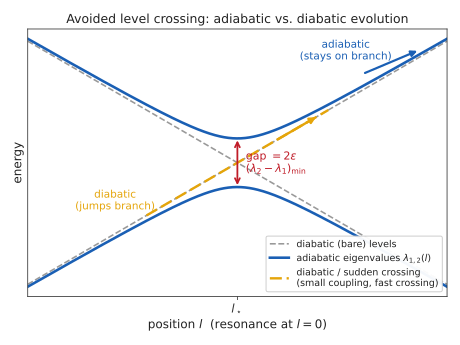
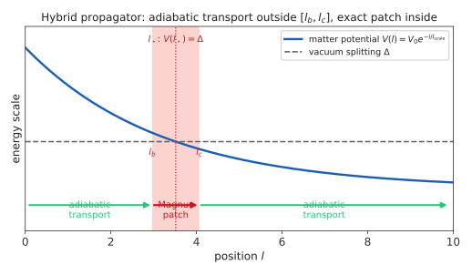
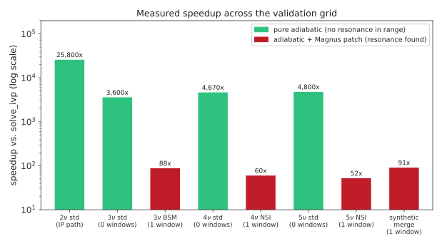

Adiabatic + Magnus Hybrid Strategy
=====================================

This page documents the ``strategy`` parameter accepted by
:func:`magnus.oscprob.osc_prob_matter_std_potential`,
:func:`magnus.oscprob.osc_prob_matter_nsi`, :func:`magnus.oscprob.osc_prob_liv`,
and every wrapper built on them (every ``osc_prob_*_sun``,
``osc_prob_*_sun_nsi``, and ``osc_prob_*_sun_liv`` function, and every
``osc_prob_*_matter_exp_density`` function), as well as the fully generic,
arbitrary-Hamiltonian entry points :func:`magnus.oscprob.osc_prob_sun` and
:func:`magnus.oscprob.osc_prob_earth`: what problem it solves, the
numerical method behind it (:mod:`magnus.adiabatic`), and the evidence used
to validate it. See :ref:`when-is-magnus-a-win` and :doc:`methodology` for
the plain Magnus-expansion machinery this strategy sits alongside.

The problem: extreme accumulated phase
------------------------------------------

The plain Magnus engine (:doc:`methodology`) partitions a trajectory into
slabs and is exact, to any desired order, within each one -- but it must
still *resolve* however many radians of phase accumulate inside a slab. For
an :math:`\rm MeV`-scale solar neutrino crossing most of the Sun's radius,
the vacuum term alone (:math:`\Delta m^2/2E`, growing as :math:`1/E`)
accumulates :math:`\mathcal{O}(10^3\text{--}10^6)` radians. Reaching a
requested tolerance then requires a very large number of slabs; if a
refinement cap is hit first, ``osc_prob`` returns its best estimate but
raises ``ToleranceNotAchievedWarning`` -- correctly signaling that the
result may be inaccurate, but not, by itself, a solution.

Physically, however, nothing is actually happening quickly here: away from
a level crossing, the flavor content evolves *adiabatically*, tracking the
instantaneous eigenstates of the Hamiltonian smoothly as the matter
potential falls off. This is precisely the regime the Mikheyev-Smirnov-Wolfenstein
(MSW) effect describes for solar neutrinos :cite:p:`GiuntiKim`: away from
the resonance, the evolution is adiabatic and computable from the
instantaneous eigenbasis alone, with no need to resolve the fast oscillation
phase at all. The hybrid strategy in :mod:`magnus.adiabatic` automates
exactly this: use adiabatic transport where it is valid, and reserve an
exact (Magnus) computation for the narrow region, if any, where it is not.

Adiabatic transport
------------------------

Let :math:`H(l)` be diagonalized at each position, :math:`H(l) = W(l)\,
\mathrm{diag}(\lambda_1(l), \ldots, \lambda_d(l))\, W(l)^\dagger`. The
adiabatic theorem says that, as long as no two eigenvalues become
(nearly) degenerate along the trajectory, a state that starts as the
:math:`k`-th eigenstate stays the :math:`k`-th eigenstate, up to a phase:

.. math::

   |\psi_k(l)\rangle \approx e^{-i\Phi_k(l)}\, e^{i\gamma_k(l)}\, |v_k(l)\rangle ,
   \qquad
   \Phi_k(l) = \int_{l_0}^{l} \lambda_k(s)\, ds ,

with :math:`\Phi_k` the ordinary **dynamical phase** and :math:`\gamma_k`
the **geometric (Berry) phase**, generated by how the eigenvector itself
turns as :math:`l` varies. Assembled into an evolution operator in the
original (flavor) basis, this is

.. math::

   U_{\rm adiabatic}(l_1, l_0) = W(l_1)\, \mathrm{diag}\!\left(e^{-i\Phi_k(l_1)}\right)\, W(l_0)^\dagger .

:func:`magnus.adiabatic.adiabatic_propagator` computes exactly this,
integrating :math:`\Phi_k` with Simpson's rule over a grid of diagonalized
Hamiltonians. It never has to resolve the accumulated phase step by step
the way a Magnus slab or an ODE solver does -- :math:`\Phi_k` is a smooth,
slowly-varying integral regardless of how large it eventually gets -- so its
cost is essentially independent of how many e-folds of the density profile
the trajectory spans. The geometric phase needs no separate formula: at each
grid step, :math:`W`'s columns are phase-fixed by maximizing the (real,
positive) overlap with the previous step's eigenvectors -- a discrete
realization of parallel transport that captures :math:`\gamma_k` implicitly,
for genuinely complex Hamiltonians (nonzero CP-violating phases) exactly as
well as real ones. The result is exactly unitary by construction (a diagonal
phase conjugated by unitary matrices), independent of how fine the grid is;
grid density only controls how well the discretized integral and parallel
transport approximate the continuum adiabatic limit.

         eigenvalue branches versus the diabatic (bare) levels, with the
         adiabatic path staying on its branch and the diabatic path
         jumping across the gap.

   Two levels approach each other as a function of position :math:`l` and
   avoid crossing, with minimum gap :math:`2\varepsilon` at :math:`l_\star`.
   An adiabatic trajectory (blue) stays on its eigenvalue branch through the
   crossing; a diabatic trajectory (gold) instead follows the original
   (bare, dashed) levels straight through -- the sudden, non-adiabatic
   transition the local Magnus patch exists to capture.

Detecting resonances without differentiating eigenvectors
----------------------------------------------------------------

Adiabatic transport breaks down where two eigenvalues nearly cross: the
gap in the denominator above becomes small, and the state can no longer
"keep up" with how fast the instantaneous eigenbasis rotates. Locating
these points, and quantifying how badly adiabaticity is violated there,
needs the derivative of the eigenvalues and eigenvectors along the
trajectory -- but eigenvectors are only defined up to a phase (and, at a
near-degeneracy, up to an arbitrary rotation within the near-degenerate
subspace), so differentiating them directly by finite differences is
numerically fragile. The **Hellmann-Feynman theorem** avoids this
entirely: for a normalized eigenvector :math:`|v_k(l)\rangle` of
:math:`H(l)`,

.. math::

   \frac{d\lambda_k}{dl} = \left\langle v_k(l) \right| \frac{dH}{dl} \left| v_k(l) \right\rangle ,
   \qquad
   \left\langle v_j(l) \right| \frac{dH}{dl} \left| v_k(l) \right\rangle
   = (\lambda_k - \lambda_j)\left\langle v_j \left| \frac{dv_k}{dl} \right.\right\rangle
   \ \ (j\neq k) ,

exact identities that need only :math:`dH/dl` -- an ordinary derivative of
the (smooth, gauge-independent) Hamiltonian itself, not of its eigenvectors.
:func:`magnus.adiabatic.find_resonance_candidates` uses the first identity
to locate every position where some pair of levels' gap is stationary
(:math:`d(\lambda_j-\lambda_k)/dl = 0`, an exact critical point, refined to
machine precision by bisection), scanning *every* pair :math:`(j,k)`, for a
Hamiltonian of any dimension. Because every pair is scanned, no number of
*simultaneous* resonances defeats the search: a crossing between one pair is
never masked by a window belonging to another (verified at 2, 3, 4 and 5
flavors against a dense per-pair :math:`\gamma` scan). What bounds the search
is instead the **probe grid**: candidates are bracketed on ``n_probe`` linear
samples, so a feature much narrower than :math:`(l_1-l_0)/n_\text{probe}` can
be stepped over entirely and reported as no resonance at all. Supply
``t_breakpoints`` at a known narrow feature, or raise ``n_probe``. The second
identity then gives an exact,
gauge-independent **adiabaticity parameter**, the Landau-Zener-like

.. math::

   \gamma_{jk}(l) = \frac{\left|\left\langle v_j(l)\right| dH/dl \left|v_k(l)\right\rangle\right|}{\left(\lambda_k(l) - \lambda_j(l)\right)^2} ,

with :math:`\gamma_{jk} \gg 1` signaling a genuinely non-adiabatic
(sharp/diabatic) crossing and :math:`\gamma_{jk} \ll 1` a safely adiabatic
one. Both quantities are evaluated from :math:`H(l)` and its
eigendecomposition alone, so they apply identically to a hand-built toy
Hamiltonian, a real 3-flavor standard-oscillation Hamiltonian, or a 5-flavor
(3+2 sterile) Hamiltonian with NSI and LIV terms -- nothing about the
detector assumes any particular structure.

.. important::

   :math:`dH/dl` is computed with an **ordinary real finite difference**,
   not complex-step differentiation (:math:`\mathrm{Im}[H(l+ih)]/h`).
   Complex-step differentiation is only valid for functions that are
   *real-valued at real input*; :math:`H(l)` here is routinely
   complex-valued even at real :math:`l` (any nonzero CP-violating phase),
   and applying complex-step differentiation to it divides an
   :math:`l`-independent complex Hamiltonian entry by the (tiny)
   differentiation step, producing derivatives wrong by many orders of
   magnitude. This was an early implementation bug, caught by comparing
   against a real-valued toy Hamiltonian (where the same complex-step
   formula happened to work by coincidence, since the function actually
   was real-valued there) -- a cautionary example of why this module never
   uses it, on any Hamiltonian, real or complex.

Growing and merging non-adiabatic windows
----------------------------------------------

A candidate with :math:`\gamma_{jk}` above a threshold marks a position
that needs an exact patch, but not, by itself, a *window*: the region over
which adiabaticity is violated has a physical width that has nothing to do
with the arbitrary spacing of the search grid used to locate the
candidate in the first place. :func:`magnus.adiabatic` grows a window
outward from each candidate by doubling the step size until
:math:`\gamma_{jk}` drops back below threshold, then pads it by a safety
factor -- a physical width, not a search-grid artifact (verified directly:
the same physical case gives the same window regardless of how fine or
coarse the initial search grid was). Windows from different candidates
that end up overlapping or touching are merged into one, so that two
resonances close enough together (or a resonance revisited from the
"other side" by level repulsion near another crossing) are patched as a
single contiguous region rather than double-counted, under-patched, or
silently dropped.

Patching, and composing the pieces exactly
------------------------------------------------

Inside a non-adiabatic window :math:`[l_b, l_c]`, adiabatic transport is
simply not trusted; instead, the package's own Magnus kernel
(:func:`magnus.magnus.magnus_expansion_multislab`) computes the evolution
operator there directly, doubling the number of slabs until two successive
levels agree. Since :math:`[l_b, l_c]` is narrow by construction (that is
exactly what "window" means here), this exact computation is cheap even
though the plain Magnus method would be slow over the *whole* trajectory.

The full hybrid propagator over :math:`[l_0, l_1]` with windows
:math:`[l_b^{(1)}, l_c^{(1)}], \ldots, [l_b^{(n)}, l_c^{(n)}]` is then
assembled by the **exact composition law** of quantum evolution,

.. math::

   U(l_1, l_0) = U_{\rm ad}(l_1, l_c^{(n)}) \cdots
   U_{\rm patch}(l_c^{(1)}, l_b^{(1)})\, U_{\rm ad}(l_b^{(1)}, l_0) ,

which holds regardless of which method computed each factor -- the same
principle the plain Magnus engine already relies on to chain ordinary
slabs (:doc:`methodology`). Every factor here (:math:`U_{\rm ad}` from
:func:`~magnus.adiabatic.adiabatic_propagator`, :math:`U_{\rm patch}` from the Magnus kernel)
is exactly unitary by construction, so the composed :math:`U` is exactly
unitary too, regardless of how accurate the adiabatic approximation
actually is anywhere along the way.

         vacuum splitting at one point, with a shaded window around the
         crossing labeled "Magnus patch" and adiabatic transport labeled
         on either side.

   The hybrid propagator's segmentation along a trajectory with one
   resonance: adiabatic transport everywhere except the narrow window
   :math:`[l_b, l_c]` bracketing the crossing :math:`l_\star`, patched
   with an exact local Magnus computation.

Self-certification
------------------------

None of the tolerances above -- the adiabaticity threshold, the density of
the grid used to integrate the dynamical phase, or the density of the
probe grid used to *locate* candidates -- has a single value that is safe
for an arbitrary Hamiltonian. A fixed threshold that is comfortably
conservative for one case can under-patch another (this was checked
directly during development: a fixed ``threshold=0.1`` gave a 2% error on
one engineered case, needing ``0.01`` for better than :math:`10^{-4}`).
:func:`magnus.adiabatic.hybrid_propagator` therefore never trusts a single
evaluation: it repeats the entire computation with the threshold tightened
(divided by 3) and the two grid densities doubled, together, comparing
successive results, and only reports the result as certified once two
successive levels agree within the requested ``rtol``/``atol`` -- the same
successive-refinement discipline :func:`magnus.oscprob.osc_prob` already
uses for its own slab count. If a local patch itself fails to converge
within its own slab cap, or the refinement loop exhausts its iteration
budget without two levels agreeing, the propagator returns its best
estimate (still exactly unitary) but reports it as **not** certified.

The ``strategy`` parameter
--------------------------------

``osc_prob_matter_std_potential``, ``osc_prob_matter_nsi``, and
``osc_prob_liv`` (and, transitively, every wrapper built on them), as well
as ``osc_prob_sun`` and ``osc_prob_earth`` (via ``_osc_prob_with_potential``,
for a fully arbitrary user-supplied Hamiltonian), accept a ``strategy``
keyword, checked in this order for every requested (energy, baseline)
point:

``'magnus'``
   Use only the traditional Magnus-expansion machinery: the closed-form
   two-flavor interaction-picture integrator when it applies (still
   restricted to genuinely two-level Hamiltonians and a tagged exponential
   profile -- see :doc:`methodology`), the energy-batched scan engine, or
   the general adaptive slab-refinement method. This reproduces the exact
   behavior of Magνs as it was before the adiabatic strategy was added,
   unconditionally. It therefore opts out of the cumulative baseline scan
   as well, which postdates that behavior and builds a different slab grid:
   ``strategy='magnus'`` is the way to reproduce older numbers exactly, on
   a baseline scan as much as at a single point.

``'hybrid'``
   Additionally try :func:`magnus.adiabatic.hybrid_propagator` for any
   point where the matter potential is position-dependent and no
   ``t_slab_edges``/breakpoints were supplied (a piecewise-discontinuous
   profile such as PREM breaks the finite-difference diagnostics this
   method relies on) and a target tolerance was requested (the method is
   fundamentally adaptive; it has no "run once, fixed" mode). If the
   result fails to self-certify for at least one requested point, the
   best-effort result is still returned, together with
   ``HybridCertificationWarning`` (a subclass of
   ``ToleranceNotAchievedWarning``, so existing code filtering on the
   parent class also catches it).

``'auto'`` (default)
   Try ``'hybrid'`` first, under the same conditions, but fall back
   silently to the ``'magnus'`` strategies above -- no warning about the
   hybrid attempt itself -- for any point where it does not apply or
   fails to self-certify.

   It also stands aside for a **baseline scan at a single energy** with at
   least ``HYBRID_YIELDS_TO_CUMULATIVE_MIN_POINTS`` points. The hybrid
   strategy handles such a scan one point at a time, whereas the cumulative
   scan (see the ``cumulative`` parameter of
   :func:`magnus.oscprob.osc_prob_energy_baseline`) answers every baseline
   from a single traversal: measured on solar profiles, tens of times faster
   at equal or better accuracy. Below that number of points the hybrid
   strategy is the cheaper of the two and keeps the scan.

Unlike the two-flavor interaction-picture fast path, the hybrid strategy
has **no restriction on the number of flavors**: the resonance detector and
adiabatic propagator make no assumption about the Hamiltonian's dimension
or structure. It composes correctly with any number of simultaneous or
sequential resonances, of any kind (standard MSW, NSI-induced, or
otherwise), between any pair of levels, **provided each is visible on the
probe grid** -- see the two limits below.

.. warning::

   Two things this strategy cannot see, both of which make it return
   ``certified=False`` or, in the second case, a wrong answer:

   * **A profile that is not smooth at the probe scale.** Every diagnostic
     here finite-differences :math:`H(l)` between probe points. On a density
     step, a kink, or any feature sharp compared with the probe spacing,
     those derivatives are meaningless. ``hybrid_propagator`` now measures
     this directly (``magnus.adiabatic._profile_is_resolved``) and declines
     to certify, so :func:`magnus.oscprob.osc_prob` falls through to the
     general Magnus path, which handles such profiles correctly. Passing
     ``t_breakpoints`` at the discontinuities is better still.
   * **A feature narrower than the probe spacing**, which no fixed grid can
     detect: neither the probe nor its refinement samples it, so
     :math:`\gamma` looks small and no window opens. Measured on a Gaussian
     resonance of width :math:`10^{-5}(l_1-l_0)`, the returned probability was
     wrong by 2.9e-02 while reporting ``certified=True``. The general Magnus
     path is no better here (it misses the feature too, though it does warn).
     If a narrow feature's position is known, pass ``t_breakpoints``.

.. note::

   That last sentence was, until version 1.0.0, true only of resonances
   that sit at an extremum of the level gap.  The detector locates
   candidates as gap extrema and evaluated the adiabaticity parameter
   :math:`\gamma` only there -- but a gap extremum is where the *gap* is
   stationary, which is not where
   :math:`\gamma = |\langle v_j|\,dH/dl\,|v_k\rangle| / (\lambda_k - \lambda_j)^2`
   peaks.  On a rapidly varying profile the two differ sharply: measured on
   a solar exponential modulated by a strong sine with an NSI coupling,
   :math:`\gamma` reached 3.6e-04 at the extrema against 7.0e-02 along the
   path, a factor of 196.

   The consequence was worse than a loose estimate.  No window opened, so
   successive refinements differed only in the adiabatic-transport grid,
   converged to the same wrong adiabatic limit, agreed with each other, and
   the result was reported as **certified** while being wrong by 4.3e-02
   against ``solve_ivp``.  :func:`magnus.adiabatic.find_nonadiabatic_windows`
   now also sweeps :math:`\gamma` along the probe grid, opening one window
   per contiguous stretch that exceeds the threshold, which brings that case
   to 2.2e-04 and leaves well-behaved profiles bit-for-bit unchanged.

.. code-block:: python

   import magnus.oscprob as oscprob
   import magnus.globaldefs as gd

   # 8 MeV, 90% of the way through the Sun: deep in the regime that used to
   # need a very large slab count (and could hit ToleranceNotAchievedWarning)
   # under strategy='magnus'.
   P = oscprob.osc_prob_3nu_sun(
       8.0 * gd.UNIT_MEV, 0.9 * gd.SUN_RADIUS * gd.UNIT_KM, 0.0,
       strategy='auto',  # the default; shown explicitly here for clarity
   )

Validation
--------------

Every claim above is checked directly against a tight-tolerance
``scipy.integrate.solve_ivp`` (``DOP853``) solution of the same
Schrödinger equation, across a validation grid designed to exercise every
qualitatively different case: zero resonances (purely adiabatic), one
resonance, two well-separated resonances, and two resonances close enough
together that their windows must merge; real 3-, 4-, and 5-flavor
Hamiltonians (standard oscillations and BSM/NSI-induced resonances); and
both real and genuinely complex (CP-violating) Hamiltonians.

.. list-table::
   :header-rows: 1
   :widths: 30 15 20 15 20

   * - Case
     - Windows
     - Speedup vs. ``solve_ivp``
     - Unitarity
     - Max abs. error
   * - Standard 3ν (18 MeV, 0.9 :math:`R_\odot`-scale baseline)
     - 0
     - ~3,600x
     - :math:`6.7\times10^{-16}`
     - :math:`2.3\times10^{-4}`
   * - BSM (NSI) 3ν, engineered resonance
     - 1
     - ~88x
     - :math:`1.8\times10^{-12}`
     - :math:`9.0\times10^{-4}`
   * - Standard 4ν (3+1 sterile)
     - 0
     - ~4,670x
     - :math:`8.9\times10^{-16}`
     - :math:`2.0\times10^{-4}`
   * - BSM (NSI) 4ν, engineered resonance
     - 1
     - ~60x
     - :math:`1.6\times10^{-13}`
     - :math:`1.4\times10^{-4}`
   * - Standard 5ν (3+2 sterile)
     - 0
     - ~4,800x
     - :math:`1.1\times10^{-15}`
     - :math:`2.0\times10^{-4}`
   * - BSM (NSI) 5ν, engineered resonance
     - 1
     - ~52x
     - :math:`1.7\times10^{-13}`
     - :math:`1.4\times10^{-4}`
   * - Synthetic, two independent resonances (kept separate)
     - 2
     - ~30x
     - :math:`4.5\times10^{-13}`
     - :math:`3.2\times10^{-4}`
   * - Synthetic, two nearby resonances (merged into one window)
     - 1
     - ~91x
     - :math:`1.3\times10^{-13}`
     - :math:`2.9\times10^{-3}`

         validation grid, log scale, ranging from about 4,800x for the
         fastest case down to about 30x for the slowest.

   Measured speedup versus a tight-tolerance ``solve_ivp`` ground truth
   across the validation grid (log scale), plotting exactly the numbers in
   the table above -- both come from ``VALIDATION_GRID`` in
   ``docs/make_figures.py``, so they cannot drift apart. Purely adiabatic
   cases (green) are fastest, since no exact patch is ever computed; cases
   needing one or more Magnus patches (red) are still 30-90x faster than
   direct integration, dominated by the (still cheap, since the window is
   narrow) patch computation and the self-certification refinement loop.

Speedups for the patched cases are smaller than the purely adiabatic ones
for a simple reason: a patch means ``solve_ivp`` itself is being compared
against on a shorter, more tractable sub-problem (the same reason the
purely-adiabatic 2ν case reaches the largest speedup of all -- it is also
the case where ``solve_ivp`` is slowest, since nothing shortens its own
work). What stays constant across every case is the two things that
matter: exact unitarity, at every accuracy setting, and agreement with
direct integration well within the package's standard :math:`10^{-3}`
target tolerance.

Limitations and scope
--------------------------

- The hybrid strategy requires a genuinely **smooth** Hamiltonian: the
  finite-difference Hellmann-Feynman diagnostics assume :math:`dH/dl` is
  well-defined everywhere on the trajectory. A piecewise profile with
  genuine discontinuities (the Earth's PREM layers) is out of scope for
  now; requesting ``t_slab_edges`` or density-discontinuity breakpoints
  disables the hybrid dispatch and falls back to the general method,
  unconditionally.
- The strategy is fundamentally adaptive (self-certifying): it does not
  apply when no target tolerance is requested at all (``rtol`` and
  ``atol`` both ``None``), since there is no hybrid analogue of "run once
  with a fixed slab count."

:func:`magnus.oscprob.osc_prob_sun` and :func:`magnus.oscprob.osc_prob_earth`
(the fully generic entry points, which accept an arbitrary user-supplied
``H_func`` without assuming the separable vacuum-plus-matter-potential
structure) also accept ``strategy``, via ``_osc_prob_hybrid_dispatch_generic``
-- nothing about :func:`magnus.adiabatic.hybrid_propagator` requires the
separable structure the other wrappers build (it operates on any callable
``H_func(l)``), so the same gating logic (smooth profile, requested
tolerance) applies here too, evaluated directly on the user's own
Hamiltonian. In practice this means:

- ``osc_prob_sun`` engages the hybrid strategy exactly as readily as the
  standard/NSI/LIV Sun wrappers, since its density profile has no
  breakpoints.
- ``osc_prob_earth`` almost always falls back to the ``'magnus'``
  strategies regardless of what is requested, since ``t_breakpoints`` (the
  PREM layer-boundary crossings) is essentially always non-empty for a
  real Earth-crossing trajectory -- this is the correct, principled
  consequence of the smoothness requirement above, not a special case
  written in for ``osc_prob_earth`` specifically.

See :doc:`methodology` for the plain Magnus-expansion machinery this
strategy sits alongside, and :doc:`architecture` for where
:mod:`magnus.adiabatic` fits into the package's module layout.
