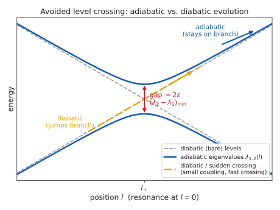
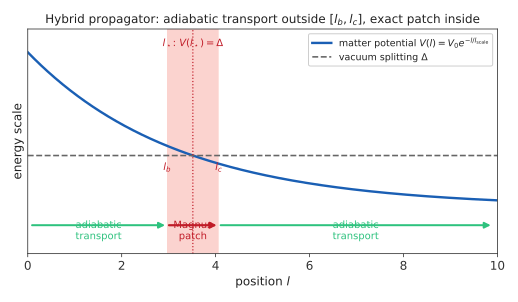
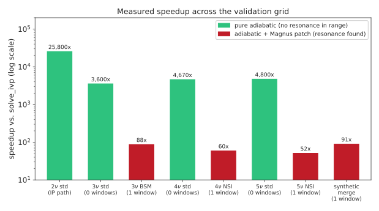

Adiabatic + Magnus hybrid strategy
==================================

.. contents::
   :local:
   :depth: 2

This page documents the ``strategy`` parameter: the problem it solves, the
method behind it (:mod:`magnus.adiabatic`), and the evidence that validates it.
The parameter is accepted by the matter scenario functions
(:func:`~magnus.oscprob.osc_prob_matter_std_potential`,
:func:`~magnus.oscprob.osc_prob_matter_nsi` and :func:`~magnus.oscprob.osc_prob_liv`),
by every wrapper built on them, and by the generic entry points
:func:`~magnus.oscprob.osc_prob_sun` and :func:`~magnus.oscprob.osc_prob_earth`.
:doc:`methodology` describes the plain Magnus expansion that this strategy
complements.

The problem: extreme accumulated phase
------------------------------------------

The plain Magnus engine (:doc:`methodology`) partitions a trajectory into
slabs and is exact, to any desired order, within each one — but it must
still *resolve* however many radians of phase accumulate inside a slab. For
an :math:`\rm MeV`-scale solar neutrino crossing most of the Sun's radius,
the vacuum term alone (:math:`\Delta m^2/2E`, growing as :math:`1/E`)
accumulates :math:`\mathcal{O}(10^3\text{--}10^6)` radians.  Reaching a
requested tolerance then requires a very large number of slabs.  If a
refinement cap is reached first, ``osc_prob`` returns its best estimate and
raises ``ToleranceNotAchievedWarning``: the warning is correct, but the answer
remains unverified.

Physically, however, the state changes slowly.  Away from a level crossing,
it evolves *adiabatically*, following the instantaneous eigenstates of the
Hamiltonian as the matter potential falls.  This is the regime of the
Mikheyev-Smirnov-Wolfenstein (MSW) effect for solar neutrinos
:cite:p:`GiuntiKim`: away from the resonance, the evolution follows from the
instantaneous eigenbasis alone, with no need to resolve the oscillation phase.
The hybrid strategy of :mod:`magnus.adiabatic` uses adiabatic transport where it
is valid, and a Magnus computation in the narrow regions, if any, where it is
not.

Adiabatic transport
------------------------

Let :math:`\mathbb{H}(l)` be diagonalized at each position, :math:`\mathbb{H}(l) = \mathbb{V}(l)\,
\mathrm{diag}(\lambda_1(l), \ldots, \lambda_d(l))\, \mathbb{V}(l)^\dagger`. The
adiabatic theorem says that, as long as no two eigenvalues become
(nearly) degenerate along the trajectory, a state that starts as the
:math:`k`-th eigenstate stays the :math:`k`-th eigenstate, up to a phase:

.. math::

   |\psi_k(l)\rangle \approx e^{-i\Phi_k(l)}\, e^{i\gamma_k(l)}\, |v_k(l)\rangle ,
   \qquad
   \Phi_k(l) = \int_{l_0}^{l} \lambda_k(s)\, ds ,

with :math:`\Phi_k` the ordinary **dynamical phase** and :math:`\gamma_k`
the **geometric (Berry) phase**, generated by how the eigenvector itself
turns as :math:`l` varies. Assembled into an evolution operator in the
original (flavor) basis, this is

.. math::

   \mathbb{U}_{\rm adiabatic}(l_1, l_0) = \mathbb{V}(l_1)\, \mathrm{diag}\!\left(e^{-i\Phi_k(l_1)}\right)\, \mathbb{V}(l_0)^\dagger .

:func:`magnus.adiabatic.adiabatic_propagator` computes this, integrating
:math:`\Phi_k` with Simpson's rule over a grid of diagonalized Hamiltonians.
:math:`\Phi_k` is a smooth integral however large it grows, so the propagator
does not resolve the phase step by step, as a Magnus slab or an ODE solver
must, and its cost barely depends on the length of the trajectory.

The geometric phase needs no separate formula.  At each grid step, the phase
of every column of :math:`\mathbb{V}` is fixed by making its overlap with the
previous step's eigenvector real and positive.  This is a discrete form of
parallel transport, and it captures :math:`\gamma_k` for complex Hamiltonians,
with CP-violating phases, as well as for real ones.

The result is unitary, being a diagonal phase between unitary matrices,
however coarse the grid.  The grid sets only how closely the discretized
integral and transport approach the adiabatic limit.

         eigenvalue branches versus the diabatic (bare) levels, with the
         adiabatic path staying on its branch and the diabatic path
         jumping across the gap.

   Two levels approach each other as a function of position :math:`l` and
   avoid crossing, with minimum gap :math:`2\varepsilon` at :math:`l_\star`.
   An adiabatic trajectory (blue) stays on its eigenvalue branch through the
   crossing; a diabatic trajectory (gold) instead follows the original
   (bare, dashed) levels straight through — the sudden, non-adiabatic
   transition the local Magnus patch exists to capture.

Detecting resonances without differentiating eigenvectors
----------------------------------------------------------------

Adiabatic transport breaks down where two eigenvalues nearly cross: the gap
between them becomes small, and the state cannot follow the rotation of the
instantaneous eigenbasis.  Locating these points, and measuring how far from
adiabatic they are, needs the derivatives of the eigenvalues and eigenvectors
along the trajectory.  Eigenvectors, however, are defined only up to a phase,
and near a degeneracy only up to a rotation, so differentiating them by finite
differences is unreliable.  The **Hellmann-Feynman theorem** avoids this: for a
normalized eigenvector :math:`|v_k(l)\rangle` of
:math:`\mathbb{H}(l)`,

.. math::

   \frac{d\lambda_k}{dl} = \left\langle v_k(l) \right| \frac{d\mathbb{H}}{dl} \left| v_k(l) \right\rangle ,
   \qquad
   \left\langle v_j(l) \right| \frac{d\mathbb{H}}{dl} \left| v_k(l) \right\rangle
   = (\lambda_k - \lambda_j)\left\langle v_j \left| \frac{dv_k}{dl} \right.\right\rangle
   \ \ (j\neq k) .

These are exact identities that need only :math:`d\mathbb{H}/dl`, the derivative of
the Hamiltonian, which is smooth and gauge-independent, and not the derivative of
its eigenvectors.

:func:`magnus.adiabatic.find_resonance_candidates` uses the first identity to
locate every position where the gap between a pair of levels is stationary,
:math:`d(\lambda_j-\lambda_k)/dl = 0`, refined to machine precision by bisection.
It scans *every* pair :math:`(j,k)`, at any dimension, so simultaneous resonances
do not hide one another; this was verified at 2, 3, 4 and 5 flavors against a
dense per-pair :math:`\gamma` scan.

The search is limited instead by the **probe grid**.  Candidates are bracketed on
``n_probe`` evenly spaced samples, so a feature much narrower than
:math:`(l_1-l_0)/n_\text{probe}` can fall between two samples and go unseen.  For a
known narrow feature, supply ``t_breakpoints`` there, or raise ``n_probe``.

The second identity gives an exact, gauge-independent **adiabaticity parameter**,
similar to the Landau-Zener one:

.. math::

   \gamma_{jk}(l) = \frac{\left|\left\langle v_j(l)\right| d\mathbb{H}/dl \left|v_k(l)\right\rangle\right|}{\left(\lambda_k(l) - \lambda_j(l)\right)^2} .

A crossing with :math:`\gamma_{jk} \gg 1` is non-adiabatic, and one with
:math:`\gamma_{jk} \ll 1` is adiabatic.  Both quantities come from
:math:`\mathbb{H}(l)` and its eigendecomposition alone, so they apply to any
Hamiltonian, from a two-level model to five flavors with NSI and LIV terms.

A gap extremum is where the *gap* is stationary, which need not be where
:math:`\gamma_{jk}` peaks, so :func:`magnus.adiabatic.find_nonadiabatic_windows`
also sweeps :math:`\gamma_{jk}` along the probe grid and opens a window over every
contiguous stretch above the threshold.

.. important::

   :math:`d\mathbb{H}/dl` is computed with an **ordinary real finite difference**,
   not complex-step differentiation (:math:`\mathrm{Im}[\mathbb{H}(l+ih)]/h`), which is
   valid only for functions that are real at real input: :math:`\mathbb{H}(l)` is
   complex whenever a CP-violating phase is nonzero.

Growing and merging non-adiabatic windows
----------------------------------------------

A candidate with :math:`\gamma_{jk}` above a threshold marks a position that
needs a Magnus patch, but it does not fix the *window* the patch must cover.  The
region where adiabaticity fails has a physical width, unrelated to the spacing
of the search grid.  To find it, :func:`magnus.adiabatic.find_nonadiabatic_windows`
grows a window outward from each candidate, doubling the step, until
:math:`\gamma_{jk}` falls below the threshold, and then pads it by a safety
factor.  The same physical case gives the same window whatever the search grid,
which was verified directly.

Windows that overlap or touch are merged.  Two nearby resonances are then
patched as one region, rather than counted twice or left partly uncovered.

Patching, and composing the pieces exactly
------------------------------------------------

Inside a non-adiabatic window :math:`[l_b, l_c]`, adiabatic transport is not
used.  Instead, the Magnus kernel (:func:`magnus.magnus.magnus_expansion_multislab`)
computes the evolution operator directly, at order 6 by default, doubling the
number of slabs until two successive levels agree to
:math:`\min(10^{-7}, (\text{atol} + \text{rtol})/10)`.  The window is narrow, so
this computation is cheap, although the same method would be slow over the whole
trajectory.

The full hybrid propagator over :math:`[l_0, l_1]` with windows
:math:`[l_b^{(1)}, l_c^{(1)}], \ldots, [l_b^{(n)}, l_c^{(n)}]` is then
assembled by the **exact composition law** of quantum evolution,

.. math::

   \mathbb{U}(l_1, l_0) = \mathbb{U}_{\rm ad}(l_1, l_c^{(n)}) \cdots
   \mathbb{U}_{\rm patch}(l_c^{(1)}, l_b^{(1)})\, \mathbb{U}_{\rm ad}(l_b^{(1)}, l_0) ,

which holds whichever method computed each factor; the plain Magnus engine
chains its slabs the same way (:doc:`methodology`).  Every factor is unitary,
so the product is unitary too, however accurate the adiabatic approximation is
along the way.

         vacuum splitting at one point, with a shaded window around the
         crossing labeled "Magnus patch" and adiabatic transport labeled
         on either side.

   The hybrid propagator's segmentation along a trajectory with one
   resonance: adiabatic transport everywhere except the narrow window
   :math:`[l_b, l_c]` bracketing the crossing :math:`l_\star`, patched
   with an exact local Magnus computation.

Self-certification
------------------------

Three settings control the strategy: the adiabaticity threshold, the grid that
integrates the dynamical phase, and the probe grid that locates candidates.  No
single value of any of them is safe for every Hamiltonian: a threshold that is
conservative for one case can leave a crossing unpatched in another.  Instead of
relying on one value, :func:`magnus.adiabatic.hybrid_propagator` repeats the
whole computation, each time dividing the threshold by 3 and doubling both
grids.  It certifies the result only once two successive levels agree within the
requested ``rtol`` and ``atol``, as :func:`magnus.oscprob.osc_prob` does for its
slab count.

A window that does not move between levels holds the same patch in both, so
this comparison cannot see a patch's own error.  Each patch is instead
converged separately, to the tolerance above.  If a patch fails to converge
within its slab cap, or the levels never agree, the propagator returns its best
estimate, still unitary, and reports it as **not** certified.  The limits are
``min_threshold``, ``max_n_probe`` and ``max_n_points``, for the threshold and
the two grids, and ``max_iters``, twelve passes.  They are arguments of
:func:`magnus.adiabatic.hybrid_propagator`, and ``osc_prob`` uses their defaults.

The ``strategy`` parameter
--------------------------------

``osc_prob_matter_std_potential``, ``osc_prob_matter_nsi``, and
``osc_prob_liv`` (and, transitively, every wrapper built on them), as well
as ``osc_prob_sun`` and ``osc_prob_earth`` (for a fully arbitrary
user-supplied Hamiltonian), accept a ``strategy`` keyword with three values:

``'magnus'``
   Use only the Magnus-expansion engines, never the adiabatic one: the
   two-flavor interaction picture where it applies (two-level Hamiltonians on
   an exponential profile; see :doc:`engines`), the energy-batched scan, or the
   general adaptive slab refinement.  It also turns off the cumulative baseline
   scan; see :ref:`strategy='magnus' <strategy-magnus>`.

``'hybrid'``
   Also try :func:`magnus.adiabatic.hybrid_propagator`, at every point where
   the matter potential depends on position, provided that no slab edges or
   breakpoints were supplied and that a tolerance was requested.  Breakpoints
   mark a discontinuous profile, such as PREM, on which the finite-difference
   diagnostics fail; and the method refines adaptively, so it needs a
   tolerance.  If any point fails to certify, the result is still returned,
   with ``HybridCertificationWarning``, a subclass of
   ``ToleranceNotAchievedWarning``.

``'auto'`` (default)
   Try ``'hybrid'`` under the same conditions; if it does not apply, or if
   any requested point fails to self-certify, the whole request falls back to
   the ``'magnus'`` engines.  The fallback raises no warning, except when the hybrid declines because of an
   undeclared density jump, which raises ``UnmarkedDiscontinuityWarning``.

   Two rules can route a request elsewhere before the hybrid is tried.  A
   moderate accumulated phase goes to the Magnus ladder (the
   :ref:`ladder route <auto-ladder-route>`), and a baseline scan at one energy of at
   least ``HYBRID_YIELDS_TO_CUMULATIVE_MIN_POINTS`` points (at least
   ``HYBRID_YIELDS_TO_CUMULATIVE_MIN_POINTS_TIGHT`` below a tolerance of 1e-6)
   goes to the cumulative scan, which answers every baseline from a single
   traversal.  :ref:`dispatch-order` gives both rules and the constants behind
   them.

Unlike the two-flavor interaction-picture fast path, the hybrid strategy
has **no restriction on the number of flavors**: the resonance detector and
adiabatic propagator make no assumption about the Hamiltonian's dimension
or structure. It composes correctly with any number of simultaneous or
sequential resonances, of any kind (standard MSW, NSI-induced, or
otherwise), between any pair of levels, **provided each is visible on the
probe grid** — see the two limits below.

.. warning::

   Two things this strategy cannot see.  The first makes it decline to
   certify; the second can return a wrong answer reported as certified:

   * **A profile that is not smooth at the probe scale.** Every diagnostic
     here finite-differences :math:`\mathbb{H}(l)` between probe points. On a density
     step, a kink, or any feature sharp compared with the probe spacing,
     those derivatives are meaningless. ``hybrid_propagator`` measures
     this directly and declines to certify, so
     :func:`magnus.oscprob.osc_prob` falls through to the
     general Magnus path, which handles such profiles correctly. Passing
     ``t_breakpoints`` at the discontinuities is better still.
   * **A bump narrower than the probe spacing**, which rises and falls between
     two probe points: neither the probe nor its refinement samples it, so
     :math:`\gamma` looks small and no window opens. Measured on a Gaussian
     resonance of width :math:`10^{-5}(l_1-l_0)`, the returned probability was
     wrong by 2.9e-02 while reporting ``certified=True``. The general Magnus
     path is no better here (it misses the feature too, though it does warn).
     If a narrow feature's position is known, pass ``t_breakpoints``.

     A **step** narrower than the probe spacing is detected.  Its full height
     lies between two probe points, so the change of :math:`\mathbb{H}` across that
     interval is much larger than the derivatives at its ends predict.  Before
     certifying, ``hybrid_propagator`` compares the two on every probe interval.
     Where the change is more than twice the prediction, it evaluates
     :math:`\gamma` at the steepest point; if that point could move the answer by
     the tolerance, it repeats the refinement with the point included from the
     first level.  Later passes check again, so a profile with many such steps is
     covered over several passes.  On a shock of width 0.8 (in units of the
     inverse vacuum splitting) on a path of :math:`3\times10^5`, this raised the
     certified result from 0.153 to 0.4921, against a true 0.4922.  Where no step
     is found, the result is unchanged, bit for bit.

.. code-block:: python

   import magnus.oscprob as oscprob
   import magnus.globaldefs as gd

   # 8 MeV, 90% of the way through the Sun: under strategy='magnus' this
   # needs a very large slab count, and can raise ToleranceNotAchievedWarning.
   P = oscprob.osc_prob_3nu_sun(
       8.0 * gd.UNIT_MEV, 0.9 * gd.SUN_RADIUS * gd.UNIT_KM, 0.0,
       strategy='auto',  # the default; shown explicitly here for clarity
   )

Validation
--------------

Every claim above is checked against a tight-tolerance
``scipy.integrate.solve_ivp`` (``DOP853``) solution of the same Schrödinger
equation.  The validation grid covers each qualitatively different case:

* zero resonances (purely adiabatic), one resonance, two well-separated
  resonances, and two resonances close enough that their windows merge;
* 3-, 4- and 5-flavor Hamiltonians, with standard and NSI-induced resonances;
* real and complex (CP-violating) Hamiltonians.

.. list-table::
   :header-rows: 1
   :widths: 30 15 20 15 20

   * - Case
     - Windows
     - Speedup vs. ``solve_ivp``
     - Unitarity
     - Max abs. error
   * - Standard 3ν (18 MeV, 0.9 :math:`R_\odot`-scale baseline)
     - 0
     - ~3,600x
     - :math:`6.7\times10^{-16}`
     - :math:`2.3\times10^{-4}`
   * - BSM (NSI) 3ν, engineered resonance
     - 1
     - ~88x
     - :math:`1.8\times10^{-12}`
     - :math:`9.0\times10^{-4}`
   * - Standard 4ν (3+1 sterile)
     - 0
     - ~4,670x
     - :math:`8.9\times10^{-16}`
     - :math:`2.0\times10^{-4}`
   * - BSM (NSI) 4ν, engineered resonance
     - 1
     - ~60x
     - :math:`1.6\times10^{-13}`
     - :math:`1.4\times10^{-4}`
   * - Standard 5ν (3+2 sterile)
     - 0
     - ~4,800x
     - :math:`1.1\times10^{-15}`
     - :math:`2.0\times10^{-4}`
   * - BSM (NSI) 5ν, engineered resonance
     - 1
     - ~52x
     - :math:`1.7\times10^{-13}`
     - :math:`1.4\times10^{-4}`
   * - Synthetic, two independent resonances (kept separate)
     - 2
     - ~30x
     - :math:`4.5\times10^{-13}`
     - :math:`3.2\times10^{-4}`
   * - Synthetic, two nearby resonances (merged into one window)
     - 1
     - ~91x
     - :math:`1.3\times10^{-13}`
     - :math:`2.9\times10^{-3}`

         validation grid, log scale, ranging from about 4,800x for the
         fastest case down to about 30x for the slowest.

   Measured speedup versus a tight-tolerance ``solve_ivp`` ground truth
   across the validation grid (log scale), plotting exactly the numbers in
   the table above — ``tests/test_adiabatic_validation_table.py`` holds the
   two against each other, so they cannot drift apart. Purely adiabatic
   cases (green) are fastest, since no exact patch is ever computed; cases
   needing one or more Magnus patches (red) are still 30-90x faster than
   direct integration, dominated by the (still cheap, since the window is
   narrow) patch computation and the self-certification refinement loop.

Speedups for the patched cases are smaller because a patch, and the
certification loop around it, is real Magnus work, while a purely adiabatic
case computes no patch at all.  The purely adiabatic 5ν case has the largest
speedup because it is also where ``solve_ivp`` is slowest: a larger Hamiltonian
does nothing to shorten its work.  Across every case the unitarity is exact, and
the agreement with direct integration is at the :math:`10^{-4}` level, reaching
:math:`2.9\times10^{-3}` only for the two merged resonances.

Limitations and scope
--------------------------

- The hybrid strategy requires a **smooth** Hamiltonian: the finite-difference
  Hellmann-Feynman diagnostics assume that :math:`d\mathbb{H}/dl` exists
  everywhere on the trajectory.  It does not handle a profile with
  discontinuities, such as the layers of PREM; supplying ``t_slab_edges`` or
  breakpoints sends the request to the general method.
- The strategy certifies its result by refinement, so it does not apply when
  no tolerance is requested (``rtol`` and ``atol`` both ``None``).

:func:`magnus.oscprob.osc_prob_sun` and :func:`magnus.oscprob.osc_prob_earth`,
which take a Hamiltonian of the user's own, also accept ``strategy``.
:func:`magnus.adiabatic.hybrid_propagator` works on any callable ``H_func(l)``,
so the same conditions apply, a smooth profile and a requested tolerance,
evaluated on the user's Hamiltonian.  In practice:

- ``osc_prob_sun`` uses the hybrid strategy as readily as the Sun wrappers,
  since its density profile has no breakpoints.
- ``osc_prob_earth`` almost always uses the ``'magnus'`` engines, whatever is
  requested, because a chord through the Earth crosses PREM layer boundaries,
  which become breakpoints.

See :doc:`methodology` for the plain Magnus-expansion machinery this
strategy sits alongside, and :doc:`architecture` for where
:mod:`magnus.adiabatic` fits into the package's module layout.
