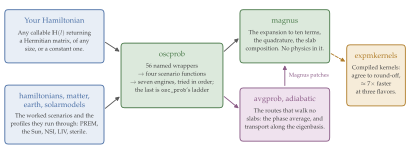
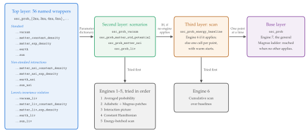

Code architecture
=================

.. contents::
   :local:
   :depth: 2

This page describes how the code under ``src/magnus/`` is organized: the modules, the path a
request takes through them, the four layers of ``magnus.oscprob``, and how to add a wrapper or a
scenario of your own.  It follows Sec. 5 of the Magνs paper.
:doc:`engines` covers the engines a request can reach, and :doc:`methodology` the numerical
method; this page is about the *code*.

The path of a request
---------------------

   The modules of Magνs and the path of a request through them.  A Hamiltonian enters from
   the left, either supplied by the user as a function of position or built by
   ``hamiltonians`` for one of the implemented scenarios, with the density profile provided
   by ``matter``, ``earth``, or ``solarmodels``.  The request is handled in ``oscprob``,
   which chooses the engine (:doc:`engines`) and runs the refinement ladder.  From there it
   goes through ``magnus``, which evaluates the expansion slab by slab and contains no
   physics, or through ``avgprob`` and ``adiabatic``, which evaluate no slabs outside the
   non-adiabatic windows and call ``magnus`` back to cross each window.  ``expmkernels``
   affects only the speed: a NumPy implementation of the same exponential exists behind it,
   and the test suite checks that the two agree to round-off.  From the Magνs paper.

A request arrives at ``oscprob`` and leaves it for ``magnus``, which evaluates the expansion
slab by slab; for ``avgprob``, which computes the phase average (:doc:`averaged_probability`);
or for ``adiabatic``, which transports the state along the instantaneous eigenstates
(:doc:`adiabatic_strategy`).  The last two return to ``magnus`` only to cross a non-adiabatic
window with a Magnus patch.  Magνs picks the route from the form of the request; the user does
not.

The numerical core is kept apart from the physics.  ``magnus.magnus`` imports nothing that
concerns neutrinos: its only dependency inside the package is ``expmkernels``, the compiled
matrix exponential.  It is numerical linear algebra on an arbitrary matrix-valued function
:math:`A(l)`, so it is tested against the recursion of :doc:`expansion_terms` without any of
the probability code.  The physics, the environments and the core meet in one module,
``oscprob``.

Modules
-------

Thirteen modules sit directly under ``src/magnus/``, with the ``hamiltonians`` subpackage
beside them (``authors.py`` and ``version.py`` are internal helpers).  ``magnus`` and
``hamiltonians`` can be used independently of the probability functions.

.. list-table::
   :header-rows: 1
   :widths: 22 78

   * - Module
     - Responsibility
   * - ``magnus``
     - The Magnus expansion: collocation integrators, cumulative quadrature, slab
       composition, the unitary exponential
   * - ``expmkernels``
     - Compiled kernels for the exponential: Cayley--Hamilton at 2×2 and 3×3, a batched
       Jacobi solver at 4×4 and 5×5
   * - ``expansionterms``
     - The recursion of the Magnus terms, in exact rational arithmetic, at any order
       (:doc:`expansion_terms`)
   * - ``adiabatic``
     - Adiabatic transport, detection of level crossings, the combined propagator
   * - ``avgprob``
     - The averaged probability
   * - ``earth``
     - The PREM profile, and chord and zenith-angle geometry
   * - ``solarmodels``
     - Tabulated standard solar models: electron density and composition along a radial
       ray (:doc:`solar_models`)
   * - ``matter``
     - Density profiles, :math:`V_{\rm CC}`, the matter-potential projector
   * - ``hamiltonians``
     - Mixing matrices and the vacuum, matter, NSI and LIV Hamiltonians, one module per
       flavor count, plus the pseudo-Dirac builders
   * - ``globaldefs``
     - Constants, unit conversions, NuFIT sets
   * - ``oscprobstd``
     - Closed-form standard probabilities, for validation
   * - ``oscprob``
     - The probability functions a user calls
   * - ``plotting``
     - Pre-packaged figures (:doc:`plotting`)
   * - ``cli``
     - The ``magnus`` console script (:doc:`cli`)

``magnus/__init__.py`` lists twelve of them in ``submodules``/``__all__``, so ``import
magnus`` makes ``magnus.oscprob``, ``magnus.earth`` and the rest available; ``expmkernels``
is left out as an implementation detail of ``magnus.magnus``, and ``cli`` as the entry point
of the console script.  The import graph, generated from the source:

.. figure:: _static/module_layout.svg
   :width: 100%
   :alt: The internal import graph of magnus, by dependency tier

   An arrow points from a module to one that imports it, so the graph reads bottom-up.
   Generated by ``docs/make_figures.py``, which fails if a module in ``src/magnus/`` is
   missing from it.

Three edges in that graph are worth knowing before changing an import:

* ``hamiltonians4nu`` and ``hamiltonians5nu`` import ``magnus.matter`` for
  :func:`~magnus.matter.matter_potential_projector`, so that the sterile entry of the matter
  term has one definition.  A second copy written by hand once gave a wrong answer on the NSI
  route.
* ``globaldefs`` imports ``magnus.hamiltonians`` inside a function, not at module scope.
  Moving it to the top closes the loop ``globaldefs -> hamiltonians -> matter ->
  globaldefs``, and the package no longer imports.
* ``plotting`` imports only ``globaldefs`` at import time; the functions that compute
  through the Earth wrappers import ``earth`` and ``oscprob`` when called, and Matplotlib is
  imported inside the drawing calls, so ``import magnus`` does not pay for it.

The four layers of ``oscprob``
------------------------------

``oscprob`` holds all 56 wrappers, one for each flavor count, environment and scenario.  So
that they do not repeat the same logic, its functions are organized in four layers, each
calling the one below it:

   The four layers of ``oscprob``, and the engines each one tries.  A request enters at a
   wrapper, which turns its named arguments into a parameter dictionary for the scenario
   function of the second layer.  That function builds the Hamiltonian and tries the first
   five engines of :doc:`engines`, in order; if none applies, it passes the Hamiltonian to
   ``osc_prob_energy_baseline``, which tries the cumulative scan over baselines and otherwise
   calls ``osc_prob`` once per point.  ``osc_prob`` is the seventh engine, the general
   Magnus ladder.  The fourteen environment-and-scenario names exist at each of the four
   flavor counts, :math:`4 \times 14 = 56` wrappers.  From the Magνs paper.

#. **Wrappers.**  The named functions, such as ``osc_prob_3nu_matter_constant_density``.
   Each exists so that the parameters have names a reader and an editor can see (``s12``,
   ``rho``, ``eps_em``); it converts them into the parameter dictionary of the second layer
   and calls the scenario function there.
#. **Scenario functions.**  ``osc_prob_vacuum``, ``osc_prob_matter_std_potential``,
   ``osc_prob_matter_nsi`` and ``osc_prob_liv``, one per scenario and each for any number of
   flavors.  Each builds the Hamiltonian for its scenario and tries, in order, the engines
   that exploit its structure: the phase average, the adiabatic transport with Magnus
   patches, the interaction-picture expansion, the constant-Hamiltonian engine, and the
   energy-batched scan.  If none applies, it passes the Hamiltonian to the third layer.
#. **``osc_prob_energy_baseline``.**  It receives the Hamiltonian with the arrays of energies
   and baselines, and tries the cumulative scan over baselines.  If that does not apply, it
   calls ``osc_prob`` once per point, in parallel if ``n_jobs`` asks for it, seeding the
   refinement of each point from the converged slab count of the previous one.
#. **``osc_prob``.**  The general Magnus ladder: one probability matrix, with the refinement
   ladder of :doc:`methodology`, reached only when no engine above it applies.  It can also be
   called directly with any Hamiltonian, as a function of position or a matrix.

``osc_prob_earth`` and ``osc_prob_sun`` take a Hamiltonian of the user's own through the same
Earth and Sun geometry the wrappers use, and pass a curated set of arguments on to an internal
function, ``_osc_prob_with_potential``, rather than through ``**kwargs``.

The refinement keywords (``n_slabs``, ``max_n_slabs``, ``t_breakpoints``,
``magnus_exp_order``, ``integration_method``, ``rtol``, ``atol``, ``strict_convergence``,
``n_jobs`` and the rest) are declared by ``osc_prob`` and the layers between it and the wrappers, but not by the
wrappers, which receive them through ``**kwargs``.  They do not appear in a wrapper's
signature, and ``help()`` on a wrapper does not list them; its docstring names them and
refers to ``osc_prob``.

.. _layer-contract:

The layer contract: what a wrapper must **not** do
------------------------------------------------------

Every wrapper ends in ``**kwargs`` and must **not** redeclare any of the
refinement and logging keywords that the layers below it own:

.. code-block:: text

   magnus_exp_order, n_jobs, integration_method, rtol, atol,
   growth_factor_n_slabs, growth_factor_n_tpts_per_slab, max_num_loops,
   min_n_slabs, max_n_slabs, min_n_tpts_per_slab, max_n_tpts_per_slab,
   new_recursion_limit, return_evolution_operator, average

This is a correctness requirement.  When every wrapper declared its own copy of these
keywords, the copies drifted: one wrapper had a different default tolerance, one lacked
``nubar``, one had a different validation bound.  With one declaration, a default is
changed in one place.

Two permanent tests in ``tests/test_oscprob.py`` enforce this contract in
CI, and will fail if it is ever violated again:

* ``test_no_wrapper_redeclares_standard_refinement_kwargs`` — inspects
  every ``osc_prob_{2,3,4,5}nu_*`` function's signature via
  :func:`inspect.signature` and fails if any of the 15 names above appear
  in it.
* ``test_nubar_present_across_all_flavor_counts_in_matter_families`` —
  fails if a matter/NSI/LIV wrapper family exposes ``nubar`` for some
  flavor counts but not others.

If you are adding a wrapper and find yourself typing
``rtol: Optional[float] = 1.e-3`` in its signature, that is a signal you
are working at the wrong layer: forward it through ``**kwargs`` instead.

``return_evolution_operator`` and ``average`` follow the same rule, and show
why the rule pays: declared by ``osc_prob_energy_baseline`` and the generic
entry points (the operator keyword by the core as well), every one of the 56
``osc_prob_{N}nu_*`` wrappers got them for free through ``**kwargs``. One
consequence to know about: the passthrough guard reads its accepted keywords
off those signatures, so a keyword that only the batching layer declares would
pass the guard on ``osc_prob`` and fail deep inside the engine; ``osc_prob``
therefore refuses ``average`` and ``cumulative`` by name. The keyword is honored by the core and
the batching layer; the specialized engines answer with probabilities only,
so the entry points disable them for the call (through the same
``_engine_probe`` mechanism the cross-check uses) and the general ladder
answers.

Data flow: how the Hamiltonian and potential are built
-----------------------------------------------------------

The matter potential and the Hamiltonian are built once per call (not
once per slab), then passed down as a single callable:

.. figure:: _static/call_sequence.svg
   :width: 100%
   :alt: What is built, in what order, on a single call

   The potential and the Hamiltonian are built **once per call**, not once
   per slab, and everything handed downward stays a plain callable.

Every intermediate object here is a plain Python callable
(``VCC_func: l -> float``, ``H_func: l -> ndarray``); nothing is
precomputed on a grid before reaching ``osc_prob``, which is what lets
:func:`magnus.magnus.probe_eval_mode` decide, once, whether ``H_func``
can be evaluated on a vectorized array of positions (silent
vectorization -- see :doc:`methodology`) or must be called one position
at a time.

How to add your own wrapper
------------------------------

Suppose you want to add support for a new environment, e.g. a
user-supplied radial density profile for 3-flavor NSI oscillations,
``osc_prob_3nu_matter_nsi_custom_density``. The existing
``osc_prob_3nu_matter_nsi_exp_density`` (in ``magnus.oscprob``) is the
closest sibling to copy from. The recipe:

#. **Pick the right scenario function.** You are adding an environment
   (a new ``rho_func``), not a new physics scenario, so you call the
   existing ``osc_prob_matter_nsi`` — you do **not** need to touch
   ``magnus.hamiltonians`` or the Magnus core at all.

#. **Name only the parameters specific to your scenario.** Your
   function's signature should have: the standard positional physics
   inputs (``energy``, ``L``), whatever parametrizes *your* density
   profile (e.g. a ``density_func: Callable`` the user supplies
   directly), the standard oscillation parameters for 3 flavors
   (``s12, s23, s13, dCP, D21, D31``, all ``Optional[float] = None``),
   the standard NSI parameters (``eps_ee, eps_em, ...``), the standard
   trailing parameters every wrapper has
   (``ratio_number_neutrons_to_protons``, ``electron_fraction``,
   ``nubar``, ``nu_i``, ``nu_f``, ``validate_input``, ``save_log``,
   ``filename_log``, ``file_log``, ``close_file_log_upon_exit``,
   ``verbose``), and end with ``**kwargs``.

#. **Do not name any of the 15 refinement/logging kwargs listed in**
   :ref:`layer-contract` **above.** They flow through ``**kwargs``
   automatically. This is what the two permanent guard tests check.

#. **Write the body as a single call down**, packaging your named
   parameters into the ``osc_params``/``nsi_params`` dicts that
   ``osc_prob_matter_nsi`` expects:

   .. code-block:: python

       def osc_prob_3nu_matter_nsi_custom_density(
           energy, L, density_func,
           s12=None, s23=None, s13=None, dCP=None, D21=None, D31=None,
           eps_ee=0.0, eps_em=0.0j, eps_et=0.0j,
           eps_mm=0.0, eps_mt=0.0j, eps_tt=0.0,
           ratio_number_neutrons_to_protons=1.0, electron_fraction=0.5,
           nubar=False, nu_i=None, nu_f=None,
           validate_input=True, save_log=False, filename_log='./out.log',
           file_log=None, close_file_log_upon_exit=True, verbose=0,
           angles='sin',
           **kwargs
       ):
           r"""Compute the 3nu NSI oscillation probability for a
           user-supplied radial matter density profile.

           .. versionadded:: <the next release>
           """
           return osc_prob_matter_nsi(
               num_flavors=3,
               rho_func=density_func,
               energy=energy, L=L,
               osc_params={'s12': s12, 's23': s23, 's13': s13, 'dCP': dCP,
                           'D21': D21, 'D31': D31},
               nsi_params={'eps_ee': eps_ee, 'eps_em': eps_em, 'eps_et': eps_et,
                           'eps_mm': eps_mm, 'eps_mt': eps_mt, 'eps_tt': eps_tt},
               ratio_number_neutrons_to_protons=ratio_number_neutrons_to_protons,
               electron_fraction=electron_fraction,
               nubar=nubar, nu_i=nu_i, nu_f=nu_f,
               validate_input=validate_input, save_log=save_log,
               filename_log=filename_log, file_log=file_log,
               close_file_log_upon_exit=close_file_log_upon_exit,
               verbose=verbose,
               angles=angles,
               **kwargs
           )

   ``angles`` is worth a word: it is a pure pass-through, and every wrapper in the
   package forwards it unexamined to the layer below, which is where the four
   conventions are interpreted.  A wrapper that accepts it and forgets to forward it
   compiles, documents itself correctly and silently ignores the caller -- four
   functions in this package did exactly that before a check was written for it, so
   the family-consistency tests below now assert that anything taking ``angles``
   also reads it.

#. **Add it to the family-consistency tests.** ``test_oscprob.py``
   parametrizes several checks over "every osc_prob wrapper family" by
   name pattern; add your new function's family prefix alongside its
   3 siblings (2nu/4nu/5nu, if you are adding all four) so the same
   unitarity/``nubar``-sensitivity/API-shape checks cover it
   automatically instead of needing bespoke tests.

#. **Run the two guard tests** described in :ref:`layer-contract` before
   opening a pull request:

   .. code-block:: bash

      pytest tests/test_oscprob.py -k "redeclares_standard or nubar_present" -v

.. _new-scenario:

How to add your own scenario
----------------------------

If your new function needs genuinely new *physics* (not just a new
environment) -- e.g. a Hamiltonian term that does not fit
vacuum/matter/NSI/LIV -- then the right layer to extend is the second, the scenario functions: a new
``osc_prob_<scenario>`` function, generic in ``num_flavors``, that builds the
Hamiltonian as a function of energy (and of position, in matter) and hands it
to ``osc_prob_energy_baseline``. That call is what gives your function arrays of
energies and baselines, warm starts, the refinement keywords, ``average=True``,
and the cumulative scan over baselines, with no further work.

The example below adds an :math:`L_e - L_\mu` long-range potential: a term
:math:`v_{\rm LRI}\,{\rm diag}(1, -1, 0, \ldots)` that does not depend on
energy and reverses sign for antineutrinos, on top of the standard vacuum and
matter Hamiltonian. Every piece it needs ships with the package: the vacuum
builders of ``magnus.hamiltonians``, and ``matter.matter_potential_projector``
and ``matter.vcc_func_from_rho_func`` for the matter term.

.. jupyter-execute::

    import numpy as np
    import magnus.globaldefs as gd
    import magnus.hamiltonians as hamiltonians
    import magnus.matter as matter
    import magnus.oscprob as oscprob

    def _vacuum_part(num_flavors, osc_params, nubar):
        """The vacuum Hamiltonian times the energy, H_vac * E, from the standard parameters.

        The dictionary carries the parameters of every flavor count, and each builder takes
        only its own, so it is unpacked explicitly for each."""
        p = osc_params
        if num_flavors == 2:
            return hamiltonians.hamiltonian_2nu_vacuum_energy_independent(p['sth'], p['Dm2'])
        if num_flavors == 3:
            return hamiltonians.hamiltonian_3nu_vacuum_energy_independent(
                p['s12'], p['s23'], p['s13'], p['dCP'], p['D21'], p['D31'], nubar=nubar)
        if num_flavors == 4:
            return hamiltonians.hamiltonian_4nu_vacuum_energy_independent(
                p['s12'], p['s23'], p['s13'], p['dCP'], p['s14'], p['d14'], p['s24'], p['d24'],
                p['s34'], p['D21'], p['D31'], p['D41'], nubar=nubar)
        if num_flavors == 5:
            return hamiltonians.hamiltonian_5nu_vacuum_energy_independent(
                p['s12'], p['s23'], p['s13'], p['dCP'], p['s14'], p['d14'], p['s15'], p['d15'],
                p['s24'], p['d24'], p['s25'], p['s34'], p['s35'], p['d35'], p['D21'], p['D31'],
                p['D41'], p['D51'], nubar=nubar)
        raise ValueError('num_flavors must be 2, 3, 4, or 5, not %r.' % (num_flavors,))

    def osc_prob_lri(num_flavors, energy, L, osc_params, v_lri, rho_func=0.0, L0=0.0,
                     nubar=False, nu_i=None, nu_f=None, density_matter_is_in_g_per_cm3=False,
                     **kwargs):
        """Oscillation probabilities with an L_e - L_mu long-range potential, in vacuum or matter.

        The new term is energy-independent and diagonal in flavor, v_lri * diag(1, -1, 0, ...),
        with the sign reversed for antineutrinos.  Everything else is the standard Hamiltonian:
        vacuum, plus the charged-current potential of rho_func.  Refinement keywords (rtol, atol,
        n_slabs, t_breakpoints, ...) and average=True reach osc_prob_energy_baseline through
        **kwargs."""
        h_vac = np.asarray(_vacuum_part(num_flavors, osc_params, nubar), dtype=complex)
        h_lri = np.zeros((num_flavors, num_flavors), dtype=complex)
        h_lri[0, 0], h_lri[1, 1] = 1.0, -1.0
        h_lri *= -v_lri if nubar else v_lri

        if rho_func == 0.0:                         # vacuum: no position dependence
            def htot(enu):
                return h_vac/enu + h_lri
            only_energy = True
        else:
            # The shipped constructors: the potential carries the antineutrino sign itself.
            proj = np.asarray(matter.matter_potential_projector(num_flavors), dtype=complex)
            vcc = matter.vcc_func_from_rho_func(rho_func, L0, nubar=nubar,
                density_matter_is_in_g_per_cm3=density_matter_is_in_g_per_cm3)
            if callable(vcc):
                # An array of positions returns a stack of Hamiltonians, position axis first,
                # which lets the Magnus routines evaluate every node of a slab in one call.
                def htot(enu, l):
                    v = np.asarray(vcc(l))
                    return h_vac/enu + v[..., None, None]*proj + h_lri
                only_energy = False
            else:
                def htot(enu):
                    return h_vac/enu + vcc*proj + h_lri
                only_energy = True

        return oscprob.osc_prob_energy_baseline(htot, energy, L, L0=L0, nu_i=nu_i, nu_f=nu_f,
            H_func_is_function_only_of_energy=only_energy, **kwargs)

Called with the same arguments as the shipped scenario functions, and with the
new term switched off, it returns what ``osc_prob_matter_std_potential`` does:

.. jupyter-execute::

    import warnings
    import numpy as np
    import magnus.globaldefs as gd
    import magnus.oscprob as oscprob
    from magnus.magnus import MagnusConvergenceWarning

    osc = gd.load_nufit_params('NuFIT 6.1')
    E = np.array([0.5, 1.0])*gd.UNIT_GEV
    L = 1300.0*gd.UNIT_KM
    rho = lambda l: 3.0*np.exp(-np.asarray(l)/(2000.0*gd.UNIT_KM))   # g/cm^3

    # The ladder's first, coarse levels raise MagnusConvergenceWarning, which reports a slab
    # width rather than an error (see diagnostics); the comparison below is what checks the answer.
    with warnings.catch_warnings():
        warnings.simplefilter('ignore', MagnusConvergenceWarning)
        P_std = oscprob.osc_prob_matter_std_potential(3, rho, E, L, osc,
            density_matter_is_in_g_per_cm3=True, rtol=1e-9, atol=1e-9)
        P_off = osc_prob_lri(3, E, L, osc, 0.0, rho_func=rho,
            density_matter_is_in_g_per_cm3=True, rtol=1e-9, atol=1e-9)
        P_on = osc_prob_lri(3, E, L, osc, 1.0e-14, rho_func=rho,
            density_matter_is_in_g_per_cm3=True, rtol=1e-9, atol=1e-9)

    print('term off, largest difference from the shipped function: %.0e'
          % np.max(np.abs(np.asarray(P_off) - np.asarray(P_std))))
    print('P(nu_mu -> nu_e), term off:', np.round(np.asarray(P_off)[:, gd.NUMU, gd.NUE], 4))
    print('P(nu_mu -> nu_e), term on: ', np.round(np.asarray(P_on)[:, gd.NUMU, gd.NUE], 4))

What a function written this way does **not** get is the batched engines.
The shipped scenario functions try the phase average, the adiabatic transport
with Magnus patches, the interaction-picture expansion, the constant-Hamiltonian
engine and the energy-batched scan themselves, before calling
``osc_prob_energy_baseline`` (see :doc:`engines`); a new function that goes
straight to ``osc_prob_energy_baseline`` is answered, unless ``average=True``,
by the cumulative scan or, point by point, by the general Magnus ladder. The
answer is the same to the tolerance; the cost is not. On a scan of 200 energies
from 0.3 to 10 GeV over the example profile above, with the term off, the
shipped ``osc_prob_matter_std_potential`` (answered by the energy-batched scan)
took 6 ms and ``osc_prob_lri`` took 88 ms, 15 times longer (warm, best of three,
on one machine). To recover that speed, a scenario function has to dispatch to
the batched engines as the shipped ones do; ``osc_prob_liv`` is the model to
follow.

To make the new scenario part of the package rather than your own code, add a
matching ``hamiltonian_<n>nu_<scenario>`` builder in ``magnus.hamiltonians`` for
each flavor count you support, move the function into ``magnus.oscprob`` next to
``osc_prob_liv``, and only then add wrappers on top of it, as in the previous
section.

Where things live: a quick lookup
-------------------------------------

.. list-table::
   :header-rows: 1
   :widths: 30 70

   * - If you need to change...
     - ...look in
   * - A default tolerance, the refinement/adaptive-slab-growth logic,
       or anything every scenario shares
     - ``osc_prob`` / ``osc_prob_energy_baseline``
       (``src/magnus/oscprob.py``)
   * - How a physics scenario's Hamiltonian is assembled from mixing
       angles/NSI epsilons/LIV coefficients
     - ``osc_prob_vacuum`` / ``osc_prob_matter_std_potential`` /
       ``osc_prob_matter_nsi`` / ``osc_prob_liv``
   * - The actual matrix form of a Hamiltonian (mixing matrix, vacuum
       term, matter term, NSI term, LIV term)
     - ``magnus.hamiltonians.hamiltonians{2,3,4,5}nu``
   * - A named parameter exposed to end users for one (flavor count,
       environment, scenario) combination
     - the matching ``osc_prob_{N}nu_{scenario}`` wrapper
   * - The Magnus term recursion, the Gauss-Legendre integrators, or the
       matrix exponential itself
     - ``magnus.magnus`` (:doc:`methodology`)
   * - The PREM density profile or Earth chord/zenith geometry
     - ``magnus.earth``
   * - A generic density profile, electron number density, or the
       :math:`V_{CC}` potential construction
     - ``magnus.matter``
   * - A physical constant, unit conversion, or a predefined oscillation
       parameter set (e.g. NuFIT 6.0)
     - ``magnus.globaldefs``
