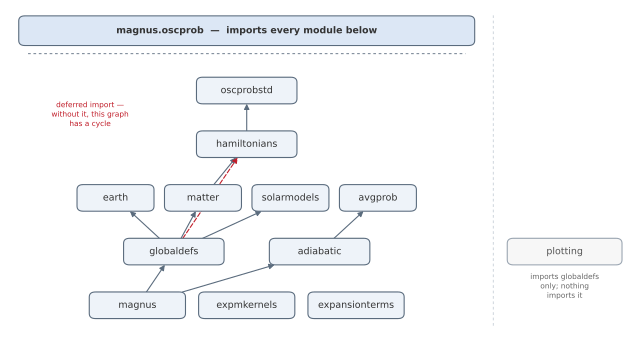
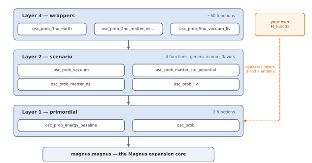
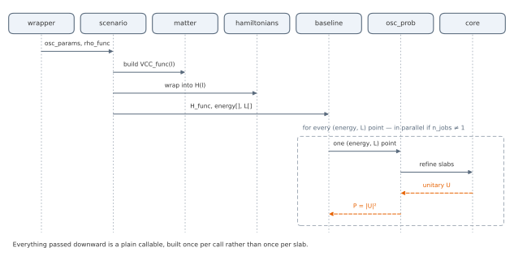

Code Architecture
===================

.. contents::
   :local:
   :depth: 2

This page documents how Magνs's source code (under ``src/magnus/``) is
organized: the module layout, the three-layer call structure of the
oscillation-probability API, the contract between the layers, and a
worked walkthrough of how to add a new physics scenario yourself. See
:doc:`methodology` for the numerical machinery (the Magnus expansion
itself); this page is about the *code*, not the *math*.

Module layout
---------------

Magνs is thirteen modules under ``src/magnus/`` plus the ``hamiltonians``
subpackage, each with a single, non-overlapping responsibility (``authors.py``
and ``version.py`` are internal helpers rather than part of that picture).
``magnus/__init__.py``'s ``submodules``/``__all__`` advertise twelve of them.
``expmkernels`` is imported alongside but left out of the list, being an
implementation detail of ``magnus.magnus``; ``cli`` is not imported at all,
since it is the console script's entry point rather than something a caller
reaches through ``import magnus``. The figure is the **actual** import graph,
top-level imports only, and an arrow points from a module to one that
imports it -- so it reads bottom-up, and nothing at the bottom knows
anything above it:

   Generated by ``docs/make_figures.py``, which fails rather than draw
   this if a module appears in ``src/magnus/`` and not here.

.. list-table::
   :header-rows: 1
   :widths: 22 78

   * - Module
     - Responsibility
   * - ``magnus``
     - The Magnus expansion itself: Gauss--Legendre integrators, slab
       composition, the exactly-unitary matrix exponential
   * - ``expmkernels``
     - Compiled kernels for the matrix exponential: Cayley--Hamilton at 2x2 and
       3x3, a batched Jacobi eigensolver at 4x4 and 5x5
   * - ``expansionterms``
     - The Magnus terms derived from the Bernoulli recursion in exact rational
       arithmetic, at any order (:doc:`expansion_terms`)
   * - ``globaldefs``
     - Physical constants, unit conversions, NuFIT parameter sets
   * - ``adiabatic``
     - Adiabatic transport and the Magnus-patch ``hybrid_propagator``
   * - ``earth``
     - PREM density profile, chord and zenith-angle geometry
   * - ``solarmodels``
     - Tabulated standard solar models, as density and composition profiles
       (:doc:`solar_models`); imports only ``globaldefs``
   * - ``matter``
     - Density profiles, electron number density, :math:`V_{\rm CC}`
       construction, the matter-potential projector
   * - ``avgprob``
     - The phase average over an energy spread, and the decohered limit it reduces to
   * - ``hamiltonians``
     - Mixing matrices and vacuum/matter/NSI/LIV Hamiltonians, two to
       five flavors (``hamiltonians{2,3,4,5}nu.py``)
   * - ``oscprobstd``
     - Closed-form standard-oscillation counterparts, for validation
   * - ``oscprob``
     - The public API, and the only module that imports every other
   * - ``plotting``
     - Pre-packaged figures; imports only ``globaldefs``
   * - ``cli``
     - The ``magnus`` console script

Two consequences of this layout are worth calling out because they are
easy to break by accident when adding code:

* ``magnus.magnus`` (the Magnus-expansion core) imports nothing from the
  rest of the package at all: it is pure numerical linear algebra on an
  arbitrary matrix function :math:`A(t)`, and knows nothing of neutrinos.
  ``magnus.hamiltonians`` is *nearly* as self-contained -- pure algebra on
  mixing angles and potentials -- with one deliberate exception:
  ``hamiltonians4nu``/``hamiltonians5nu`` import ``magnus.matter`` for
  :func:`~magnus.matter.matter_potential_projector`, because the sterile
  states' entry in the matter term has exactly one correct definition and
  writing it out by hand a second time is what produced a wrong-answer bug
  in the NSI route. Both are independently unit tested
  (``tests/test_magnus_expansion.py`` / ``tests/test_hamiltonians.py``)
  without touching ``oscprob`` at all.
* **One edge in that graph is a deferred import, and it is load-bearing.**
  ``globaldefs`` imports ``magnus.hamiltonians`` inside a function rather
  than at module scope. Hoisting it to the top would close the loop
  ``globaldefs -> hamiltonians -> matter -> globaldefs`` and the package
  would stop importing.
  ``magnus.adiabatic`` follows the same rule: it depends only on
  ``magnus.magnus`` (for the local Magnus patch), never on ``oscprob``, so
  it is independently unit tested (``tests/test_adiabatic.py``) and usable
  directly on any Hamiltonian function, entirely outside the
  oscillation-probability API. See :doc:`adiabatic_strategy` for its
  numerical method.
* ``magnus.oscprob`` is the only module that imports everything else. It
  is where physics scenarios (vacuum/matter/NSI/LIV), environments
  (constant density/exponential density/Earth/Sun), and the Magnus core
  are wired together. This is deliberate: it keeps the wiring in one
  place instead of scattering it across the physics and numerical
  modules.

``adiabatic.py``, ``avgprob.py``, ``cli.py``, ``earth.py``,
``expansionterms.py``, ``expmkernels.py``, ``globaldefs.py``, ``magnus.py``,
``matter.py``, ``oscprob.py``, ``oscprobstd.py``, ``plotting.py`` and
``solarmodels.py`` are flat
sibling files directly under ``src/magnus/`` -- there is no subpackage directory
wrapping any of them. Only ``magnus.hamiltonians`` is a genuine
subpackage, since it holds one module per flavor count
(``hamiltonians2nu.py`` through ``hamiltonians5nu.py``) plus
``hamiltonians_pseudodirac.py`` for the paired spectra of
:doc:`averaged_probability`; its ``__init__.py`` explicitly imports and
re-exports each one's public names (no ``from .module import *``).
``magnus/__init__.py`` does the same for the twelve it lists (again, no
wildcard imports) so that ``import magnus`` alone makes ``magnus.earth``,
``magnus.oscprob``, etc. immediately accessible.

``plotting.py`` is the one module outside this dependency picture: it
imports nothing from the rest of the package except
``globaldefs`` (for the flavor constants), and nothing imports it. It is
also the only module needing a dependency beyond NumPy/SciPy/joblib --
Matplotlib, which ships with Magnus and is imported lazily inside the
drawing calls, so ``import magnus`` does not pay for it. See
:doc:`plotting`. ``magnus.oscprob``
additionally imports and re-exports ``oscprobstd.py``'s five names (the
closed-form validation counterpart to the wrapper API), so both
``magnus.oscprob.osc_prob_3nu_vacuum_std`` and
``magnus.oscprobstd.osc_prob_3nu_vacuum_std`` work.

The three-layer structure of ``magnus.oscprob``
----------------------------------------------------

``magnus.oscprob`` is the largest module (~22,000 lines) because it exposes a
dedicated, explicitly-named function for every combination of
(flavor count) :math:`\times` (environment) :math:`\times` (BSM
scenario) — roughly 60 combinations. To keep that size from turning into
60 independent copies of the same logic (which is exactly what caused
several of the bugs this package's test suite now guards against — see
:ref:`layer-contract` below), every one of those 60 functions is a thin
call into a much smaller set of shared functions. There are three layers:

   Each layer names a few representative functions; the full signatures
   are in the API reference, which is where they stay legible.

**Layer 1 -- primordial.** ``osc_prob`` is the only function that calls
into the Magnus core. It owns the adaptive-refinement loop (grow
``n_slabs``/``n_tpts_per_slab`` until two successive levels agree within
``rtol``/``atol``, or a cap is hit -- note that is an agreement, not a
bound on the error; see :ref:`what-rtol-atol-control`), input validation, logging, and the
`~50`-line docstring documenting all of the refinement/logging keyword
arguments (see it directly in
:func:`~magnus.oscprob.osc_prob`). It is also a first-class
public entry point: pass it *any* callable ``H_func(l)`` (or
``H_func(enu, l)``, or a constant matrix) and it works with no wrapper at
all -- this is the escape hatch for Hamiltonians the package does not
already know about. ``osc_prob_energy_baseline`` sits just above it:
given arrays of ``energy`` and ``L``, it builds the right
energy-dependent closure over ``H_func``, decides whether to parallelize
over points (``joblib.Parallel``) or hand a single call straight to
``osc_prob``, and carries the *warm start* logic that seeds each point's
refinement from the previous point's converged (``n_slabs``,
``n_tpts_per_slab``).

**Layer 2 -- scenario.** ``osc_prob_vacuum``, ``osc_prob_matter_std_potential``,
``osc_prob_matter_nsi``, and ``osc_prob_liv`` are each generic in
``num_flavors`` (2, 3, 4, or 5): they unpack the relevant parameter dict
(via ``unpack_oscillation_params_from_dict``, ``unpack_nsi_params_from_dict``,
``unpack_liv_params_from_dict``), dispatch to the matching function in
``magnus.hamiltonians`` (e.g. ``hamiltonian_3nu_matter`` for
``num_flavors=3``), build the position-dependent matter potential where
relevant (via ``magnus.matter.vcc_func_from_rho_func``), and call
``osc_prob_energy_baseline`` with the resulting ``H_func``. This is where
"what physics scenario is this" is decided; it is *not* where "how many
flavors" or "which environment" is decided -- those come from the caller
(layer 3) and from ``rho_func``, respectively.

**Layer 3 -- wrappers.** Every ``osc_prob_{2,3,4,5}nu_{scenario}`` function
(e.g. ``osc_prob_3nu_matter_constant_density``,
``osc_prob_4nu_earth_nsi``, ``osc_prob_2nu_vacuum_liv``) exists purely so
that users get explicit, autocomplete-and-docs-friendly parameter names
(``s12``, ``eps_em``, ``rho``, ...) instead of having to build
``osc_params``/``nsi_params``/``liv_params`` dictionaries by hand. Its
entire job is: validate/repackage its named parameters into the right
dict(s), and forward everything else to the matching layer-2 function.
``osc_prob_earth``/``osc_prob_sun`` are a deliberate, bounded exception:
because they need to build a PREM-based (or solar-density-based)
``VCC_func`` and choose between the 2/3/4/5nu Hamiltonians themselves,
they sit one level below the per-flavor ``osc_prob_{N}nu_earth``/
``osc_prob_{N}nu_sun`` wrappers and forward a curated subset of
parameters *positionally* into ``_osc_prob_with_potential``, rather than
by name through ``**kwargs`` like every other wrapper.

.. _layer-contract:

The layer contract: what a wrapper must **not** do
------------------------------------------------------

Every wrapper function ends in ``**kwargs`` and must **not** redeclare
any of the refinement/logging keyword arguments that layers 1-2 own:

.. code-block:: text

   magnus_exp_order, n_jobs, integration_method, rtol, atol,
   growth_factor_n_slabs, growth_factor_n_tpts_per_slab, max_num_loops,
   min_n_slabs, max_n_slabs, min_n_tpts_per_slab, max_n_tpts_per_slab,
   new_recursion_limit, return_evolution_operator, average

This is not a style preference; it is a correctness requirement, and the
history of this package shows what happens when it is violated. Before
the refactor that introduced this contract (internally referred to as
"G1"), every wrapper declared its own copy of these ~15 parameters with
its own defaults. That duplication is exactly what let several bugs hide
for a long time: a wrapper with a silently different default tolerance
than its siblings, a wrapper missing ``nubar`` entirely, a wrapper with
an inconsistent validation bound. Fixing a default meant remembering to
fix it in ~60 places; inevitably, some were missed.

Two permanent tests in ``tests/test_oscprob.py`` enforce this contract in
CI, and will fail if it is ever violated again:

* ``test_no_wrapper_redeclares_standard_refinement_kwargs`` — inspects
  every ``osc_prob_{2,3,4,5}nu_*`` function's signature via
  :func:`inspect.signature` and fails if any of the 15 names above appear
  in it.
* ``test_nubar_present_across_all_flavor_counts_in_matter_families`` —
  fails if a matter/NSI/LIV wrapper family exposes ``nubar`` for some
  flavor counts but not others.

If you are adding a wrapper and find yourself typing
``rtol: Optional[float] = 1.e-3`` in its signature, that is a signal you
are working at the wrong layer: forward it through ``**kwargs`` instead.

``return_evolution_operator`` and ``average`` follow the same rule, and show
why the rule pays: declared by ``osc_prob_energy_baseline`` and the generic
entry points (the operator keyword by the core as well), every one of the sixty
``osc_prob_{N}nu_*`` wrappers got them for free through ``**kwargs``. One
consequence to know about: the passthrough guard reads its accepted keywords
off those signatures, so a keyword that only the batching layer declares would
pass the guard on ``osc_prob`` and fail deep inside the engine; ``osc_prob``
therefore refuses ``average`` and ``cumulative`` by name. The keyword is honored by the core and
the batching layer; the specialized engines answer with probabilities only,
so the entry points disable them for the call (through the same
``_engine_probe`` mechanism the cross-check uses) and the general ladder
answers.

Data flow: how the Hamiltonian and potential are built
-----------------------------------------------------------

The matter potential and the Hamiltonian are built once per call (not
once per slab), then passed down as a single callable:

   The potential and the Hamiltonian are built **once per call**, not once
   per slab, and everything handed downward stays a plain callable.

Every intermediate object here is a plain Python callable
(``VCC_func: l -> float``, ``H_func: l -> ndarray``); nothing is
precomputed on a grid before reaching ``osc_prob``, which is what lets
:func:`magnus.magnus.probe_eval_mode` decide, once, whether ``H_func``
can be evaluated on a vectorized array of positions (silent
vectorization -- see :doc:`methodology`) or must be called one position
at a time.

How to add your own wrapper
------------------------------

Suppose you want to add support for a new environment, e.g. a
user-supplied radial density profile for 3-flavor NSI oscillations,
``osc_prob_3nu_matter_nsi_custom_density``. The existing
``osc_prob_3nu_matter_nsi_exp_density`` (in ``magnus.oscprob``) is the
closest sibling to copy from. The recipe:

#. **Pick the right layer-2 function.** You are adding an environment
   (a new ``rho_func``), not a new physics scenario, so you call the
   existing ``osc_prob_matter_nsi`` — you do **not** need to touch
   ``magnus.hamiltonians`` or the Magnus core at all.

#. **Name only the parameters specific to your scenario.** Your
   function's signature should have: the standard positional physics
   inputs (``energy``, ``L``), whatever parametrizes *your* density
   profile (e.g. a ``density_func: Callable`` the user supplies
   directly), the standard oscillation parameters for 3 flavors
   (``s12, s23, s13, dCP, D21, D31``, all ``Optional[float] = None``),
   the standard NSI parameters (``eps_ee, eps_em, ...``), the standard
   trailing parameters every wrapper has
   (``ratio_number_neutrons_to_protons``, ``electron_fraction``,
   ``nubar``, ``nu_i``, ``nu_f``, ``validate_input``, ``save_log``,
   ``filename_log``, ``file_log``, ``close_file_log_upon_exit``,
   ``verbose``), and end with ``**kwargs``.

#. **Do not name any of the 15 refinement/logging kwargs listed in**
   :ref:`layer-contract` **above.** They flow through ``**kwargs``
   automatically. This is what the two permanent guard tests check.

#. **Write the body as a single call down**, packaging your named
   parameters into the ``osc_params``/``nsi_params`` dicts that
   ``osc_prob_matter_nsi`` expects:

   .. code-block:: python

       def osc_prob_3nu_matter_nsi_custom_density(
           energy, L, density_func,
           s12=None, s23=None, s13=None, dCP=None, D21=None, D31=None,
           eps_ee=0.0, eps_em=0.0j, eps_et=0.0j,
           eps_mm=0.0, eps_mt=0.0j, eps_tt=0.0,
           ratio_number_neutrons_to_protons=1.0, electron_fraction=0.5,
           nubar=False, nu_i=None, nu_f=None,
           validate_input=True, save_log=False, filename_log='./out.log',
           file_log=None, close_file_log_upon_exit=True, verbose=0,
           angles='sin',
           **kwargs
       ):
           r"""Compute the 3nu NSI oscillation probability for a
           user-supplied radial matter density profile.

           .. versionadded:: <the next release>
           """
           return osc_prob_matter_nsi(
               num_flavors=3,
               rho_func=density_func,
               energy=energy, L=L,
               osc_params={'s12': s12, 's23': s23, 's13': s13, 'dCP': dCP,
                           'D21': D21, 'D31': D31},
               nsi_params={'eps_ee': eps_ee, 'eps_em': eps_em, 'eps_et': eps_et,
                           'eps_mm': eps_mm, 'eps_mt': eps_mt, 'eps_tt': eps_tt},
               ratio_number_neutrons_to_protons=ratio_number_neutrons_to_protons,
               electron_fraction=electron_fraction,
               nubar=nubar, nu_i=nu_i, nu_f=nu_f,
               validate_input=validate_input, save_log=save_log,
               filename_log=filename_log, file_log=file_log,
               close_file_log_upon_exit=close_file_log_upon_exit,
               verbose=verbose,
               angles=angles,
               **kwargs
           )

   ``angles`` is worth a word: it is a pure pass-through, and every wrapper in the
   package forwards it unexamined to the layer below, which is where the four
   conventions are interpreted.  A wrapper that accepts it and forgets to forward it
   compiles, documents itself correctly and silently ignores the caller -- four
   functions in this package did exactly that before a check was written for it, so
   the family-consistency tests below now assert that anything taking ``angles``
   also reads it.

#. **Add it to the family-consistency tests.** ``test_oscprob.py``
   parametrizes several checks over "every osc_prob wrapper family" by
   name pattern; add your new function's family prefix alongside its
   3 siblings (2nu/4nu/5nu, if you are adding all four) so the same
   unitarity/``nubar``-sensitivity/API-shape checks cover it
   automatically instead of needing bespoke tests.

#. **Run the two guard tests** described in :ref:`layer-contract` before
   opening a pull request:

   .. code-block:: bash

      pytest tests/test_oscprob.py -k "redeclares_standard or nubar_present" -v

.. _new-scenario:

How to add your own scenario (layer 2)
----------------------------------------

If your new function needs genuinely new *physics* (not just a new
environment) -- e.g. a Hamiltonian term that does not fit
vacuum/matter/NSI/LIV -- then the right layer to extend is layer 2: a new
``osc_prob_<scenario>`` function, generic in ``num_flavors``, that builds the
Hamiltonian as a function of energy (and of position, in matter) and hands it
to ``osc_prob_energy_baseline``. That call is what gives your function arrays of
energies and baselines, warm starts, the refinement keywords, ``average=True``,
and the cumulative scan over baselines, with no further work.

The example below adds an :math:`L_e - L_\mu` long-range potential: a term
:math:`v_{\rm LRI}\,{\rm diag}(1, -1, 0, \ldots)` that does not depend on
energy and reverses sign for antineutrinos, on top of the standard vacuum and
matter Hamiltonian. Every piece it needs ships with the package: the vacuum
builders of ``magnus.hamiltonians``, and ``matter.matter_potential_projector``
and ``matter.vcc_func_from_rho_func`` for the matter term.

.. jupyter-execute::

    import numpy as np
    import magnus.globaldefs as gd
    import magnus.hamiltonians as hamiltonians
    import magnus.matter as matter
    import magnus.oscprob as oscprob

    def _vacuum_part(num_flavors, osc_params, nubar):
        """The vacuum Hamiltonian times the energy, H_vac * E, from the standard parameters.

        The shipped builders take the parameters positionally, and name the CP phase ``dCP`` at
        three flavors and ``d13`` beyond, so the dictionary is unpacked explicitly."""
        p = osc_params
        if num_flavors == 2:
            return hamiltonians.hamiltonian_2nu_vacuum_energy_independent(p['sth'], p['Dm2'])
        if num_flavors == 3:
            return hamiltonians.hamiltonian_3nu_vacuum_energy_independent(
                p['s12'], p['s23'], p['s13'], p['dCP'], p['D21'], p['D31'], nubar=nubar)
        if num_flavors == 4:
            return hamiltonians.hamiltonian_4nu_vacuum_energy_independent(
                p['s12'], p['s23'], p['s13'], p['dCP'], p['s14'], p['d14'], p['s24'], p['d24'],
                p['s34'], p['D21'], p['D31'], p['D41'], nubar=nubar)
        if num_flavors == 5:
            return hamiltonians.hamiltonian_5nu_vacuum_energy_independent(
                p['s12'], p['s23'], p['s13'], p['dCP'], p['s14'], p['d14'], p['s15'], p['d15'],
                p['s24'], p['d24'], p['s25'], p['s34'], p['s35'], p['d35'], p['D21'], p['D31'],
                p['D41'], p['D51'], nubar=nubar)
        raise ValueError('num_flavors must be 2, 3, 4, or 5, not %r.' % (num_flavors,))

    def osc_prob_lri(num_flavors, energy, L, osc_params, v_lri, rho_func=0.0, L0=0.0,
                     nubar=False, nu_i=None, nu_f=None, density_matter_is_in_g_per_cm3=False,
                     **kwargs):
        """Oscillation probabilities with an L_e - L_mu long-range potential, in vacuum or matter.

        The new term is energy-independent and diagonal in flavor, v_lri * diag(1, -1, 0, ...),
        with the sign reversed for antineutrinos.  Everything else is the standard Hamiltonian:
        vacuum, plus the charged-current potential of rho_func.  Refinement keywords (rtol, atol,
        n_slabs, t_breakpoints, ...) and average=True reach osc_prob_energy_baseline through
        **kwargs."""
        h_vac = np.asarray(_vacuum_part(num_flavors, osc_params, nubar), dtype=complex)
        h_lri = np.zeros((num_flavors, num_flavors), dtype=complex)
        h_lri[0, 0], h_lri[1, 1] = 1.0, -1.0
        h_lri *= -v_lri if nubar else v_lri

        if rho_func == 0.0:                         # vacuum: no position dependence
            def htot(enu):
                return h_vac/enu + h_lri
            only_energy = True
        else:
            # The shipped constructors: the potential carries the antineutrino sign itself.
            proj = np.asarray(matter.matter_potential_projector(num_flavors), dtype=complex)
            vcc = matter.vcc_func_from_rho_func(rho_func, L0, nubar=nubar,
                density_matter_is_in_g_per_cm3=density_matter_is_in_g_per_cm3)
            if callable(vcc):
                # An array of positions returns a stack of Hamiltonians, position axis first,
                # which lets the Magnus routines evaluate every node of a slab in one call.
                def htot(enu, l):
                    v = np.asarray(vcc(l))
                    return h_vac/enu + v[..., None, None]*proj + h_lri
                only_energy = False
            else:
                def htot(enu):
                    return h_vac/enu + vcc*proj + h_lri
                only_energy = True

        return oscprob.osc_prob_energy_baseline(htot, energy, L, L0=L0, nu_i=nu_i, nu_f=nu_f,
            H_func_is_function_only_of_energy=only_energy, **kwargs)

Called with the same arguments as the shipped scenario functions, and with the
new term switched off, it returns what ``osc_prob_matter_std_potential`` does:

.. jupyter-execute::

    import numpy as np
    import magnus.globaldefs as gd
    import magnus.oscprob as oscprob

    osc = gd.load_nufit_params('NuFIT 6.1')
    E = np.array([0.5, 1.0])*gd.UNIT_GEV
    L = 1300.0*gd.UNIT_KM
    rho = lambda l: 3.0*np.exp(-np.asarray(l)/(2000.0*gd.UNIT_KM))   # g/cm^3

    P_std = oscprob.osc_prob_matter_std_potential(3, rho, E, L, osc,
        density_matter_is_in_g_per_cm3=True, rtol=1e-9, atol=1e-9)
    P_off = osc_prob_lri(3, E, L, osc, 0.0, rho_func=rho,
        density_matter_is_in_g_per_cm3=True, rtol=1e-9, atol=1e-9)
    P_on = osc_prob_lri(3, E, L, osc, 1.0e-14, rho_func=rho,
        density_matter_is_in_g_per_cm3=True, rtol=1e-9, atol=1e-9)

    print('term off, largest difference from the shipped function: %.0e'
          % np.max(np.abs(np.asarray(P_off) - np.asarray(P_std))))
    print('P(nu_mu -> nu_e), term off:', np.round(np.asarray(P_off)[:, gd.NUMU, gd.NUE], 4))
    print('P(nu_mu -> nu_e), term on: ', np.round(np.asarray(P_on)[:, gd.NUMU, gd.NUE], 4))

What a function written this way does **not** get is the batched engines.
The shipped scenario functions try the phase average, the adiabatic transport
with Magnus patches, the interaction-picture expansion, the constant-Hamiltonian
engine and the energy-batched scan themselves, before calling
``osc_prob_energy_baseline`` (see :doc:`engines`); a new function that goes
straight to ``osc_prob_energy_baseline`` is answered, unless ``average=True``,
by the cumulative scan or, point by point, by the general Magnus ladder. The
answer is the same to the tolerance; the cost is not. On a scan of 200 energies
from 0.3 to 10 GeV over the example profile above, with the term off, the
shipped ``osc_prob_matter_std_potential`` (answered by the energy-batched scan)
took 6 ms and ``osc_prob_lri`` took 88 ms, 15 times longer (warm, best of three,
on one machine). To recover that speed, a scenario function has to dispatch to
the batched engines as the shipped ones do; ``osc_prob_liv`` is the model to
follow.

To make the new scenario part of the package rather than your own code, add a
matching ``hamiltonian_<n>nu_<scenario>`` builder in ``magnus.hamiltonians`` for
each flavor count you support, move the function into ``magnus.oscprob`` next to
``osc_prob_liv``, and only then add wrappers on top of it, as in the previous
section.

Where things live: a quick lookup
-------------------------------------

.. list-table::
   :header-rows: 1
   :widths: 30 70

   * - If you need to change...
     - ...look in
   * - A default tolerance, the refinement/adaptive-slab-growth logic,
       or anything every scenario shares
     - ``osc_prob`` / ``osc_prob_energy_baseline``
       (``src/magnus/oscprob.py``)
   * - How a physics scenario's Hamiltonian is assembled from mixing
       angles/NSI epsilons/LIV coefficients
     - ``osc_prob_vacuum`` / ``osc_prob_matter_std_potential`` /
       ``osc_prob_matter_nsi`` / ``osc_prob_liv``
   * - The actual matrix form of a Hamiltonian (mixing matrix, vacuum
       term, matter term, NSI term, LIV term)
     - ``magnus.hamiltonians.hamiltonians{2,3,4,5}nu``
   * - A named parameter exposed to end users for one (flavor count,
       environment, scenario) combination
     - the matching ``osc_prob_{N}nu_{scenario}`` wrapper
   * - The Magnus term recursion, the Gauss-Legendre integrators, or the
       matrix exponential itself
     - ``magnus.magnus`` (:doc:`methodology`)
   * - The PREM density profile or Earth chord/zenith geometry
     - ``magnus.earth``
   * - A generic density profile, electron number density, or the
       :math:`V_{CC}` potential construction
     - ``magnus.matter``
   * - A physical constant, unit conversion, or a predefined oscillation
       parameter set (e.g. NuFIT 6.0)
     - ``magnus.globaldefs``
