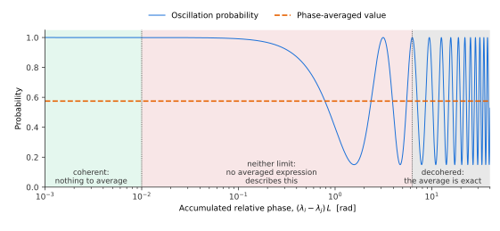

Phase-Averaged (Decohered) Probabilities
==========================================

This page documents the ``average`` keyword accepted by
:func:`magnus.oscprob.osc_prob_vacuum`,
:func:`magnus.oscprob.osc_prob_matter_std_potential`,
:func:`magnus.oscprob.osc_prob_matter_nsi` and
:func:`magnus.oscprob.osc_prob_liv` -- and therefore, through the shared
``**kwargs`` chain, by every ``osc_prob_{2,3,4,5}nu_*`` wrapper built on
them -- together with the module that implements it,
:mod:`magnus.avgprob`. See :doc:`adiabatic_strategy` for the
position-dependent machinery this reuses, and :doc:`methodology` for the
plain Magnus engine both sit alongside.

The problem: a phase nobody can resolve
------------------------------------------

A neutrino from an astrophysical source arrives with an oscillation phase

.. math::

   \Delta \phi = \frac{\Delta m^2 L}{2E}
   \simeq 1.27 \times \frac{\Delta m^2/\text{eV}^2 \times L/\text{km}}
   {E/\text{GeV}}

of order :math:`10^{15}` for a TeV neutrino from 100 Mpc away.  No
ingredient of that number is known to anything close to the precision the
phase would demand: not the source distance, not the size of the
production region, and not the detector's energy resolution.  Whatever
the true phase is, the measurement integrates over many complete cycles
of it.

Computing such a probability by propagation is therefore doubly
unattractive.  It is expensive -- resolving :math:`10^{15}` radians is
exactly the regime that defeats slab refinement -- and it is pointless,
because every oscillatory term is about to be averaged away by the
integration the measurement performs anyway.

The averaged limit
---------------------

Write the amplitude in the basis that diagonalizes the Hamiltonian,
:math:`H = V \,\mathrm{diag}(\lambda_i)\, V^\dagger`:

.. math::

   A(\nu_\alpha \to \nu_\beta) = \sum_i V^*_{\alpha i} V_{\beta i}\,
   e^{-i \lambda_i L} .

The probability :math:`|A|^2` contains a diagonal part and interference
terms carrying :math:`e^{-i(\lambda_i - \lambda_j)L}`.  Averaging over
the phase leaves only the terms whose phase does not vary:

.. math::

   \boxed{\;P(\nu_\alpha \to \nu_\beta) = \sum_i |V_{\alpha i}|^2\,
   |V_{\beta i}|^2\;}

This is not an approximation to be refined: it is the exact
:math:`L/E \to \infty` limit, and it costs one matrix product rather
than an integration.  Three properties follow immediately and are worth
stating, because each surprises someone eventually:

* The result is **symmetric** in :math:`\alpha \leftrightarrow \beta`, so
  the averaged probability is the same in both directions.
* It is **identical for neutrinos and antineutrinos**, since
  :math:`|V^*|^2 = |V|^2`.  CP violation does not survive the average,
  even though :math:`\delta_{\rm CP}` still enters through the
  magnitudes :math:`|V_{\alpha i}|`.
* For **vacuum** oscillations it does not depend on energy or baseline at
  all: scaling :math:`H` by :math:`1/E` leaves its eigenvectors
  untouched, so a single matrix serves an entire flux calculation.

Coherence is a physical question, not a numerical one
--------------------------------------------------------

The boxed expression assumes every *relative* phase has averaged away.
That is a statement about **pairs** of eigenvalues, not about the
spectrum as a whole: the pair :math:`(i,j)` decoheres only once
:math:`(\lambda_i - \lambda_j)L` has swept through many cycles.  Two
eigenvalues close enough to keep their relative phase fixed stay
*coherent*, and their cross term survives.

:mod:`magnus.avgprob` therefore groups the spectrum into blocks of
mutually coherent eigenvalues and sums coherently inside each block,

.. math::

   P(\nu_\alpha \to \nu_\beta) = \sum_{b} \Big|
   \sum_{i \in b} V^*_{\alpha i} V_{\beta i} \Big|^2 ,

which reduces to the boxed expression when every block is a singleton.
The distinction is not academic.  A sterile state with a small
:math:`\Delta m^2_{41}`, or any exactly degenerate spectrum, makes the
naive sum quietly wrong: with *all* eigenvalues equal the correct answer
is the identity -- nothing oscillates at all -- while the naive sum
returns a spurious mixture.

The same per-pair phase decides whether an averaged expression applies at
all.  A pair is in one of three regimes:

|

* far below :data:`magnus.avgprob.COHERENCE_PHASE_THRESHOLD`, the
  relative phase has barely advanced: the pair is coherent and there is
  nothing to average;
* far above :data:`magnus.avgprob.DECOHERENCE_PHASE_THRESHOLD`, the cross
  term has averaged away and the boxed expression is exact;
* **in between, neither statement holds**, and no averaged expression
  describes the result.  The honest quantity there is the oscillation
  probability itself.

:func:`magnus.avgprob.coherence_report` names the pairs in that middle
band, and the callers in :mod:`magnus.oscprob` raise
:class:`magnus.oscprob.PhaseAveragingWarning` rather than return a number
the physics does not support.  Asking for an averaged probability at a
1000 km beamline does exactly this: the solar pair has accumulated about
0.2 radians there, and the averaged expression disagrees with the true
probability by tenths.

Position-dependent Hamiltonians
-----------------------------------

When the Hamiltonian varies along the trajectory there is no single
eigenbasis to decohere in.  A neutrino produced at :math:`l_0` decoheres
in the eigenbasis *there*, is carried along the levels of the
instantaneous Hamiltonian, and is detected in the eigenbasis at
:math:`l_1`:

.. math::

   P(\nu_\alpha \to \nu_\beta) = \sum_{ij} |V_{\alpha i}(l_0)|^2 \,
   P^{\rm cross}_{ij} \, |V_{\beta j}(l_1)|^2 ,

the standard MSW-plus-decoherence result, generalized here to any number
of levels and any number of crossings.  :math:`P^{\rm cross}` is the
probability of ending on level :math:`j` having started on level
:math:`i`.  Adiabatic evolution keeps a neutrino on its level, so
:math:`P^{\rm cross}` is the **identity** wherever the adiabatic
approximation holds, and departs from it only across a non-adiabatic
window.

Those windows are located with the Hellmann-Feynman diagnostic of
:mod:`magnus.adiabatic` (see :doc:`adiabatic_strategy`), and the transfer
across each one is computed with that module's own convergence-checked
Magnus patch -- *not* with a Landau-Zener formula.  The result is an
exact treatment of the crossing rather than an asymptotic approximation
to it.  As a check, the computed hop probability reproduces the analytic
Landau-Zener value :math:`\exp(-2\pi\epsilon^2/|d\Delta/dl|)` to a few
parts in a thousand for a linear crossing, with nothing in the
implementation assuming that formula:

.. list-table::
   :header-rows: 1
   :widths: 20 25 25 15

   * - Coupling :math:`\epsilon`
     - Computed hop probability
     - Landau-Zener
     - Difference
   * - :math:`10^{-4}`
     - 0.9382
     - 0.9391
     - 0.1%
   * - :math:`3\times10^{-4}`
     - 0.5665
     - 0.5680
     - 0.3%

Two conditions have to hold for the expression above to mean anything,
and :func:`magnus.avgprob.averaged_probabilities_adiabatic` checks both
rather than assuming them.  The levels must have decohered from each
other by the time of detection; and if there is more than one crossing,
they must also have decohered *between* crossings, since otherwise
composing the crossings as probabilities -- rather than as amplitudes --
discards interference that is still present.  Both are returned in the
report, naming the stretch and the pair at issue.

When there is no closed form
--------------------------------

A profile with discontinuities -- the PREM layer boundaries an
Earth-crossing trajectory steps through -- has no instantaneous
eigenbasis to decohere in, so neither construction above applies.  There,
``average=True`` propagates the probability for real across an energy
window and averages over it
(:func:`magnus.avgprob.averaged_probabilities_numerically`).

**This returns a different quantity from the other two paths.**  They
return the exact :math:`L/E \to \infty` limit, which needs no window;
this returns the average over one particular window, and the answer
depends on its width.  The default width,
:data:`magnus.avgprob.AVG_DEFAULT_ENERGY_SPREAD`, is 10% -- the order of
a real detector's energy resolution -- and every use of it raises
:class:`magnus.oscprob.PhaseAveragingWarning` naming the width, the
number of samples, and the standard error of the resulting mean, so the
figure is never silently dependent on a constant the caller did not
choose.  Callers with a known resolution should pass their own.

Cost
-------

.. list-table::
   :header-rows: 1
   :widths: 34 30 18 18

   * - Case
     - Method
     - Exact?
     - Cost
   * - Vacuum, constant density (and their NSI/LIV variants)
     - Closed form
     - Yes
     - ~20 :math:`\mu`\ s
   * - Exponential density, Sun (and their NSI/LIV variants)
     - Adiabatic + crossing matrix
     - Yes, in that limit
     - ~0.07 s
   * - Earth (PREM)
     - Sampled over an energy window
     - No -- window-dependent
     - ~0.1 s

For comparison, obtaining the same vacuum number by averaging the engine
numerically over 2001 energies takes about 0.25 s and is an
approximation, against 20 :math:`\mu`\ s for an exact answer.

Usage
--------

.. jupyter-execute::

    import numpy as np

    import magnus.oscprob as oscprob
    import magnus.globaldefs as gd

    # load_nufit_params returns just the six mixing parameters; the
    # OSC_PARAMS_PREDEFINED entries also carry 'name'/'description' strings,
    # which the propagation machinery would reject.
    osc = gd.load_nufit_params('NuFIT 6.1')

    P = oscprob.osc_prob_3nu_vacuum(1.0*gd.UNIT_TEV, 1.0e8*gd.UNIT_KM,
                                    average=True, **osc)
    np.round(np.asarray(P), 4)

The most quoted consequence of averaged astrophysical oscillations
follows in one line: a source producing the pion-decay composition
:math:`(1:2:0)` delivers something close to equipartition at Earth.

.. jupyter-execute::

    at_source = np.array([1.0, 2.0, 0.0])/3.0
    at_earth = at_source @ np.asarray(P)
    np.round(at_earth*3.0, 3)

Am I computing the wrong thing?  ``strategy_info['sampling']``
----------------------------------------------------------------

The hardest part of this page in practice is not the mathematics -- it is
noticing that it applies to you.  A scan of instantaneous probabilities
over a long trajectory returns perfectly correct numbers, and they can
still be the wrong quantity, because the observable is an average over a
phase nobody resolves.

Every ``osc_prob_*`` entry point that accepts ``strategy_info`` now
reports how coarsely the request samples the oscillation it is
computing::

    info = {}
    P = magnus.oscprob.osc_prob_3nu_sun(energy, L, info_kwargs..., strategy_info=info)
    info['sampling']
    # {'oscillation_length': 2.53e+10,   'cycles_over_trajectory': 1.32e+04,
    #  'spacing': 3.82e+13,              'cycles_per_step': 1.51e+03,
    #  'nyquist_points': 26446,          'aliased': True}

``cycles_per_step`` is the number to read.  Above about 0.5 the scan
takes less than two samples per oscillation, so the returned array
**cannot represent the oscillation** and must not be plotted or
interpolated as a curve -- the individual values are right, the curve
through them is an artefact.  ``nyquist_points`` says how many baselines
would be needed to sample it properly.

Those numbers are usually stark.  Measured over the physically-motivated
profile families in ``docs/dev/adversarial_batteries/``:

=========================== ============================ =========================
trajectory                  oscillations across it        baselines for Nyquist
=========================== ============================ =========================
Earth chord                 ~430                          861
Solar, one scale height     ~2200                         4 390
Supernova ray               ~37 000                       73 392
=========================== ============================ =========================

**This is reported and never warned about, deliberately.**  The Nyquist
criterion is objectively correct and would fire on 44 of 45 realistic
scan sizes -- a warning firing on 98 % of calls is noise however right
each firing is, and it would teach users to silence a category that also
carries genuine discontinuity warnings.  The measurement behind that
decision is ``adversarial_batteries/alias_fp.py``.

The report costs eigenvalues at eight points along the trajectory, so it
is computed **only when ``strategy_info`` is supplied**: callers who do
not ask pay nothing, and callers who do pay 5.5 % of the cheapest scan
measured and under 0.1 % of a substantial one.

When ``aliased`` is ``True``, the question worth asking is whether you
wanted the average all along.  If you did, ``average=True`` or
:mod:`magnus.avgprob` gives it exactly, in one matrix product rather than
an integration.  :func:`magnus.avgprob.coherence_report` will say whether
the averaged expression is valid for your spectrum and baseline, or
whether some pair sits in the middle regime where neither limit holds.

How much does the phase actually matter?
-------------------------------------------

It depends on the profile, and the difference is measurable rather than a
matter of taste.  Averaging an instantaneous scan over six oscillation
lengths and comparing against a ``solve_ivp`` reference
(``adversarial_batteries/avg_check.py`` and ``avg_check2.py``).  The solar
row is the log-linear interpolant of the BS05 table, which is the profile
notebook 13 works from; ``avg_check.py`` prints a cubic-spline variant of
the same ray beside it, and that one reads 8.889e-04 and 6.051e-04 for the
two columns --- a different profile, and the same verdict:

=============================== ================== ================== ====================
configuration                   instantaneous      averaged           averaged inside 1e-3
=============================== ================== ================== ====================
Solar model, d = 2, 5 MeV       6.000e-04          7.110e-04          yes
Supernova turbulence, 45 MeV    5.584e-03          **3.843e-04**      yes
Supernova shock, 70 km front    4.917e-04          **2.151e-04**      yes
Supernova shock, 0.07 km front  1.988e-01          **2.222e-01**      **no**, and warned
=============================== ================== ================== ====================

The last row is the one that matters, and it is the only one where the
*observable* is wrong.  A shock front changes the adiabaticity of the level
crossing, so it moves the conversion probability itself rather than the
phase at which it oscillates; that is an **envelope** error and no
averaging operation removes it.  Everywhere else the averaged answer lands
inside the target even where a single baseline does not, because the
instantaneous error is largely **phase** -- the profile perturbs *when* the
oscillation is, and no observable resolves that.

.. warning::

   **Do not read the ratio of these two columns as a diagnostic.**  Both are
   finite-window means, and such a mean is an estimator with a bias of its
   own.  On a profile whose density varies across the averaging window the
   bias does not shrink as the window widens, because a wider window also
   averages over different matter conditions: on the solar ray above, the
   window mean moves from 0.5924 to 0.6023 between six and forty-eight
   oscillation lengths, drifting away from rather than towards a limit.
   Notebook 13 prints that sweep.
   The reduction factor is meaningful only on a controlled comparison at
   fixed matter conditions, as in notebook 23.

   To obtain the averaged probability, ask for it rather than estimating
   it.  ``average=True`` evaluates the decohered limit in closed form, with
   no window to choose: on that same solar ray it reproduces the adiabatic
   MSW expression
   :math:`\langle P_{ee}\rangle = \tfrac12 + \tfrac12\cos2\theta_m(L_0)\cos2\theta_m(L_1)`
   to 3e-16 across 1--20 MeV.

Limitations and scope
-------------------------

* The averaged limit is a statement about a **measurement that integrates
  over phase**.  It is not a model of quantum decoherence: there is no
  dissipative term here, and no density-matrix evolution.  See the
  "When is Magνs not the right tool?" section of :doc:`index`.
* Non-adiabatic crossings are handled, but composing more than one
  assumes the levels dephase between them.  That assumption is checked
  and reported, not silently made.
* The Earth/PREM path is a windowed average rather than a limit, as
  described above.

See :doc:`functions` and the API reference for the full listing of
:mod:`magnus.avgprob`.
