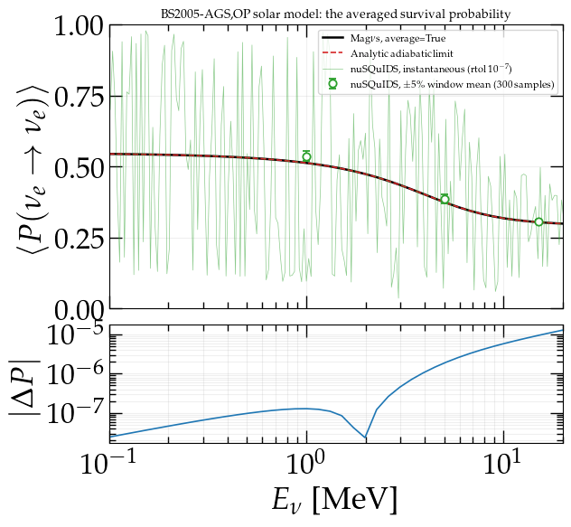

Against other codes
=====================

.. contents::
   :local:
   :depth: 2

Magνs is not the fastest way to compute every oscillation probability, and
this page says where it is not.  Everything below is measured in
:doc:`notebook 25 <tutorials>`, with **every code timed in one process on one
machine** and refereed by a method that is neither code's.  The frozen
datasets it draws on live in ``notebooks/external_*.json``.

Two codes are compared throughout: `NuOscProbExact
<https://github.com/mbustama/NuOscProbExact>`_ :cite:p:`Bustamante:2019ggq`,
which solves each slab of constant density in closed form, and `nuSQuIDS
<https://github.com/arguelles/nuSQuIDS>`_
:cite:p:`Arguelles:2021twb,Delgado:2014lyt`, which integrates the
density-matrix evolution.

.. warning::

   **Absolute timings are a property of the machine and are worth little on
   their own.**  Read the *ratios* within a row, and read a tolerance sweep
   only within one code's own curve.  "Code A is faster than code B" does not
   survive a change of hardware; "tightening this dial costs 20% and buys four
   orders of magnitude" does.

The boundary, stated once
---------------------------

**Where a closed form exists and the accumulated phase is large, use the
closed form.**  An exact algebraic solution beats a truncated series; that is
arithmetic, not a defect in either code.  Constant density, piecewise-constant
PREM and standard three-flavour propagation are precisely what closed forms are
built for, and on those Magνs does not win on cost.

What Magνs buys is everything that is not that: accuracy past the point where
a piecewise-constant discretisation stalls, an arbitrary varying profile, a
Hamiltonian nobody has diagonalised, five flavours, and observables that are
returned rather than reconstructed.

Which one should I use?
-------------------------

Magνs integrates a Hamiltonian *across* each slab, which is what lets it follow
a density that changes as the neutrino moves.  That machinery is wasted — and
slower than the alternative — when the Hamiltonian does not change at all.

Reach for NuOscProbExact when **the Hamiltonian is constant, or piecewise
constant**.  It expands the Hamiltonian and the evolution operator in the SU(2),
SU(3) and SU(4) bases, which gives a closed form rather than a numerical
integration: exact up to floating-point round-off, and with no slab count to
choose.

.. list-table::
   :header-rows: 1
   :widths: 46 27 27

   * - Situation
     - Use this
     - Because
   * - Constant density
     - **NuOscProbExact**
     - One closed form, no integration
   * - Piecewise constant, tens of layers — the Earth through PREM
     - **NuOscProbExact**
     - Each layer solved exactly, operators multiplied
   * - Smoothly varying, slow against the oscillation
     - Either
     - Slabbing converges quickly
   * - Smoothly varying, fast against the oscillation — the Sun, adiabatic MSW
     - **Magνs**
     - Slabbing needs :math:`\sim 10^4` steps per resonance crossing
   * - A front resolved across many slabs — a shock from a simulation snapshot
     - **Magνs**
     - Smooth on the slab scale, so fourth order beats second
   * - A front thin against the oscillation length — a real hydrodynamic shock
     - **NuOscProbExact**
     - To any sampling method that is a jump, which is a closed form's home ground
   * - A kink, a tabulated profile
     - **Magνs**
     - ``t_breakpoints`` puts a slab edge on the discontinuity
   * - More than four flavours
     - **Magνs**
     - The SU(N) expansions stop at SU(4); Magνs has no ceiling
   * - Genuinely open systems: decay, decoherence
     - Neither
     - Needs a Lindblad solver, not a unitary one

The two packages share conventions, units and parameter defaults deliberately,
so a calculation can be moved between them as a cross-check.  That is worth
doing: agreement between two methods with different failure modes is stronger
evidence than either one's internal convergence check.

Constant density
------------------

Both codes are exact here, to round-off:

.. list-table::
   :header-rows: 1
   :widths: 46 18 18 18

   * - Route
     - Total [s]
     - µs/point
     - max \|P − exact\|
   * - Magνs, batched wrapper
     - 0.0006
     - 9.72
     - 9.0e-17
   * - Magνs, one call per energy
     - 0.0057
     - 95.06
     - 9.0e-17
   * - NuOscProbExact, looped
     - 0.0009
     - 14.32
     - 4.9e-16
   * - NuOscProbExact, batched
     - 0.0001
     - 1.34
     - 4.9e-16

1300 km at 2.848 g/cm³, 60 energies from 0.6 to 20 GeV.  The lesson here is
about **batching, not about codes**: either code called one energy at a time
costs about an order of magnitude more than the same physics asked for in one
call.

PREM, three flavours
----------------------

An Earth chord at :math:`\cos\theta_z = -0.85` (10 831 km), refereed by a
Richardson-extrapolated slab product whose own residual discretisation error is
**4.3e-07** — nothing below that line is resolvable by this comparison.

Refined against itself, each code reaches:

.. list-table::
   :header-rows: 1
   :widths: 50 25 25

   * -
     - Magνs
     - NuOscProbExact
   * - Best accuracy reached
     - **3.3e-10**
     - 5.6e-05
   * - Cost per call
     - ~20× more
     - ~20× less

The residual between the two codes is 4.1e-04, which is the same order as the
*looser* of the two curves — so most of it is NuOscProbExact's discretisation
rather than a disagreement about physics.  A residual far above **both** curves
would have meant a convention mismatch instead, and that is the check worth
making before concluding anything from a cross-code difference.

PREM, 3+1
-----------

The most expensive case for Magνs in the whole comparison, and — once the
referee was corrected — not the least accurate one.  The two axes point in
opposite directions, so they are worth separating.

**Cost: NuOscProbExact, by about 400×.**  56 000 µs per probability against
127.  The cost does not fall when the tolerance is loosened, and that flatness
is the diagnosis: the refinement ladder is not converging and stopping, it is
running to its slab ceiling.  An eV-scale :math:`\Delta m^2_{41}` over an
11 000 km chord accumulates a phase whose required slab width is below what
the ladder will reach, which is why a ``MagnusConvergenceWarning`` appears on
every row.

**Accuracy: Magνs, and it reaches the floor of the measurement.**  Its residual
against the referee is 4.5e-08, *below the referee's own discretisation error of
4.1e-07* — so the honest statement is that Magνs agrees with the referee to
within the referee's uncertainty, and this comparison cannot resolve it further.
NuOscProbExact sits at 2.6e-04, some six hundred times above that floor, and its
convergence is **not monotonic**: 32 slabs per segment is worse than 8.
Non-monotonic convergence is the signature of a discretisation whose edges
straddle structure they do not resolve, and it means there is no setting of that
dial to read off as "converged".

.. note::

   **A convergence warning is a statement about evidence, not about error.**
   Magνs warns on every row here and is right to — the answer is not backed by
   a convergence argument.  It is also the most accurate answer on the plot.
   The two come apart exactly here.

A smooth profile: where each method runs out
----------------------------------------------

On a smooth exponential profile the comparison is no longer about cost but
about **reach**.  Composing slabs is second order in the slab width, so halving
it buys a factor of four; the Gauss–Legendre Magnus expansion is fourth order
and buys sixteen.  More importantly the slab product has a *floor*:

.. list-table::
   :header-rows: 1
   :widths: 34 33 33

   * - Exponential profile, 3ν
     - Best error
     - At
   * - NuOscProbExact
     - 2.5e-11, then **rises**
     - 16 384 slabs; 32 768 is worse
   * - Magνs
     - **2.9e-13**
     - tightest tolerance

Past about 16 000 slabs the round-off of composing that many matrix products
costs more than another halving of the width buys.  No setting reaches below
that floor.  At five flavours there is no comparison to draw at all —
NuOscProbExact has no five-flavour route — which is the other half of the same
point.

The Sun: an observable the others do not offer
------------------------------------------------

   The averaged solar survival probability, returned directly.  The
   instantaneous probability another code returns is the trace thrashing
   between 0.15 and 0.9 — it is not the observable.

The model is the tabulated BS2005-AGS,OP solar profile
:cite:p:`Bahcall:2004pz`.  A neutrino leaving the Sun accumulates some 13 000
radians of phase at 5 MeV,
so the instantaneous survival probability at the surface is neither measurable
nor stable: neighbouring energies land anywhere between 0.15 and 0.9.  What a
solar experiment measures is the phase-averaged probability, and ``average=True``
returns it directly — 40 averaged energies in **about 0.7 s**, matching the analytic
adiabatic limit to 1.3e-05.

nuSQuIDS needs about **ten minutes** merely to reach the solver tolerance at
which its output is a probability at all, and then a further factor of *N* to
average the phase away:

.. list-table::
   :header-rows: 1
   :widths: 20 20 30 30

   * - ``rel_error``
     - Seconds
     - P over all flavours
     - A probability?
   * - 1e-04
     - 160.8
     - −1.19 … 3.09
     - **no**
   * - 1e-05
     - 251.3
     - −0.011 … 1.007
     - **no**
   * - 1e-06
     - 568.1
     - 0.0002 … 0.979
     - yes
   * - 1e-07
     - 1078.2
     - 0.0001 … 0.979
     - yes

.. warning::

   **The obvious guard passes on every one of those rows.**  Summing the
   flavour probabilities and checking they come to one holds to 1e-16 even
   where the survival probability reaches 2.83.  That is not a bug in the
   guard: nuSQuIDS evolves the density matrix in an SU(3) basis whose identity
   component is the trace, so the flavour sum is conserved *by construction*
   however badly the traceless components are integrated.  **A structural
   invariant cannot test the thing it is built into.**  The check that does
   bite is each probability lying in :math:`[0, 1]`.

Neither of the other codes offers an averaging flag.  This is a different
algorithm for the question a solar experiment actually asks, not the same
algorithm run faster.

A supernova shock: the width of the front decides
----------------------------------------------------

The same physics, the same codes, and the winner changes with one parameter —
how sharp the front is:

.. list-table::
   :header-rows: 1
   :widths: 30 35 35

   * - Front width
     - Magνs
     - NuOscProbExact
   * - 0.07 km (sharp)
     - 2.4e-09
     - 1.4e-09
   * - 70 km (smooth)
     - **9.6e-10**
     - 5.6e-06

On a sharp front the profile *is* piecewise constant, which is the closed
form's home ground and it matches Magνs there at a fraction of the cost.  Widen
the front and the same closed form stalls four orders of magnitude higher,
because it is now approximating a smooth function with steps.  Neither result
is about implementation quality; both are about which method the problem
belongs to.

Summary
---------

.. list-table::
   :header-rows: 1
   :widths: 42 58

   * - Case
     - Outcome
   * - Constant density, exactness
     - Both ~1e-16
   * - Constant density, speed
     - Comparable batched; both ~10× slower called one energy at a time
   * - PREM 3ν, cost
     - NuOscProbExact by ~20×
   * - PREM 3ν, accuracy reachable
     - Magνs to 3e-10; the closed form stalls near 6e-05
   * - PREM 3+1, cost
     - NuOscProbExact by ~400×, and Magνs *warns*
   * - PREM 3+1, accuracy reachable
     - Magνs, to the referee's own floor (4e-07); the closed form stalls near
       3e-04, non-monotonically
   * - Smooth profile, reach
     - Slab product floors at 2.5e-11 and then rises; Magνs continues to 2.9e-13
   * - Five flavours
     - Magνs only — NuOscProbExact has no route
   * - Solar averaged observable
     - Magνs returns it directly; nothing else here offers it
   * - Supernova shock
     - The width of the front decides, not the flavour content

The table has no winner in it.  It has a **boundary**.

Before comparing any two codes' numbers
------------------------------------------

**Check that they agree in vacuum first.**  If they do not, the disagreement is
in the solvers.  If they agree in vacuum and disagree in matter, it is in the
conventions — a matter-potential factor, an electron fraction, a channel index
— and no amount of tolerance will close it.  Notebook 25 spends a whole section
on a conventions trap for this reason: a 1% difference in :math:`V_{\rm CC}`
reads exactly like an accuracy difference until you look.

.. seealso::

   :doc:`notebook 25 <tutorials>` runs all of it, including the sections not
   summarised here: the six-code speed/accuracy sweep, what batching and the
   compiled kernel are each worth, and the same shock at 3+1 and with NSI.
