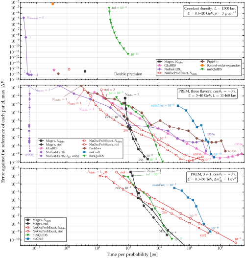
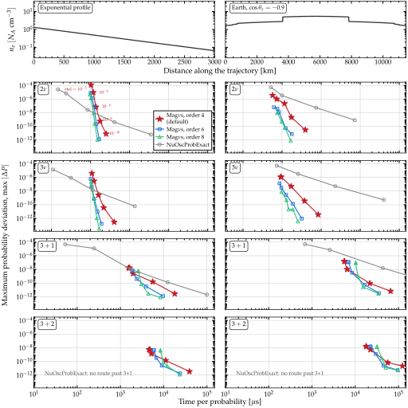
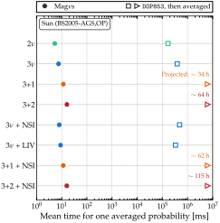

Against other codes
=====================

.. contents::
   :local:
   :depth: 2

Magνs is not the fastest way to compute every oscillation probability, and this page
says where it is not.  It follows the cross-code comparison of the Magνs paper (not yet
published; its source is in ``resources/paper/`` of the `repository
<https://github.com/mbustama/Magnus/tree/main/resources/paper>`_): eight codes on three setups,
NuOscProbExact at two to five flavors, and the cost of an averaged solar probability, all
computed in notebook 28, and then which code to reach for.  Every code is timed in one
process on one machine.

.. warning::

   **Absolute timings are a property of the machine and are worth little on
   their own.**  Read the *ratios* within a row, and read a tolerance sweep
   only within one code's own curve.  "Code A is faster than code B" does not
   survive a change of hardware; "tightening this dial costs 20% and buys four
   orders of magnitude" does.

Eight codes, three setups
---------------------------

   Error against time per probability, for eight codes: constant density (top), a
   core-crossing Earth chord at :math:`\cos\theta_z = -0.9` at three flavors
   (middle), and the same chord with one sterile state (bottom).  Magνs and
   NuOscProbExact appear twice on the Earth panels because each has two dials, a
   slab count and a tolerance.

The codes are GLoBES, Prob3++, nuCraft, NuFast-LBL, NuFast-Earth, NuOscProbExact,
nuSQuIDS and Magνs, with a second-order analytic expansion for reference.  Each is
scored against a 50-digit reference built in **its own** constants and conventions,
chiefly the constant that fixes :math:`V_{\rm CC}`, so two codes can both reach
:math:`10^{-14}` here and still disagree with each other at :math:`10^{-4}`.

* **Constant density.**  Most codes land near round-off and differ only in cost,
  from about 0.07 µs per probability for NuFast-LBL to about 100 µs for nuSQuIDS.  Magνs
  sits at :math:`3 \times 10^{-15}` and 3.9 µs.
* **Earth, three flavors.**  To reach about :math:`3 \times 10^{-10}`, Magνs needs
  0.43 ms (256 slabs), nuSQuIDS 1.3 ms, NuOscProbExact 26 ms, nuCraft 62 ms and
  GLoBES 0.5 s.  NuOscProbExact starts twenty times cheaper, and the two cross near
  :math:`10^{-6}`: its error falls as the square of the slab width, Magνs's as the
  fourth power.  Asking Magνs for ``rtol=1e-8`` instead of 256 slabs costs about
  three times as much, for the same accuracy; that is the price of the
  convergence check.  NuFast-Earth is by far the cheapest when a scan varies only
  :math:`\delta_{\rm CP}`.
* **Earth, 3+1 flavors.**  NuFast-Earth, GLoBES and Prob3++ drop out.  The
  crossing with NuOscProbExact moves up to about :math:`10^{-5}`, because its slab
  cost grows eightfold at four flavors against under threefold for Magνs.

Against NuOscProbExact, two to five flavors
---------------------------------------------

   Deviation from an extended-precision reference against time per probability, at
   two to five flavors, on a smooth exponential profile (left) and a core-crossing
   Earth chord (right).  Magνs at orders 4, 6 and 8; NuOscProbExact through its own
   adaptive refinement.  Both use :math:`Y_e = 0.5` electrons per atomic mass unit
   (:ref:`quickstart-conventions`).  NuOscProbExact stops at four
   flavors.

The closed form is the cheaper code at loose tolerances.  At tight tolerances it
runs into an accuracy floor that more slabs cannot lower, and Magνs reaches past it.

The averaged solar probability
--------------------------------

   Time for one averaged :math:`\nu_e` survival probability at 5 MeV through the
   tabulated BS2005-AGS,OP model, two to five flavors, with and without NSI and LIV:
   Magνs against a DOP853 integration followed by an average over the last 1% of
   the path.

Magνs computes the average directly, from one eigendecomposition at production and
one at detection, and is four or more orders of magnitude faster than integrating
the :math:`10^5` oscillations and averaging them away.  The call is

.. code-block:: python

    import magnus.globaldefs as gd
    import magnus.oscprob as oscprob
    from magnus import solarmodels

    P = oscprob.osc_prob_3nu_sun(
        5.0*gd.UNIT_MEV, solarmodels.table_edge('BS05-AGS-OP'), 0.0,
        density_profile='BS05-AGS-OP', average=True, nu_i=gd.NUE, nu_f=gd.NUE)

.. _when-to-use-magnus:

When to use Magνs, and when not
---------------------------------

Structurally, Magνs sits between NuOscProbExact and nuSQuIDS: it composes slab exponentials
as the first does, while resolving the variation of the Hamiltonian inside each slab, as the
second does by other means.  It is the code to reach for when the profile, the accuracy, the
flavor count or the Hamiltonian takes a problem outside what a composition of
constant-density slabs does well:

* **The density varies continuously and fast against the oscillation length.**  A
  composition of constant-density slabs needs some :math:`10^4` steps per resonance crossing
  in the Sun, where Magνs integrates across the slab.
* **The profile has structure at a known place.**  A shock front, a layer boundary or a kink
  is passed as ``t_breakpoints``, which puts a slab edge on it at every refinement level.
* **The problem has more than three flavors.**  At 3+1 NuOscProbExact finds its eigenvalues
  numerically, at eight times the cost per slab; past four flavors the SU(N) closed forms stop.
* **The Hamiltonian has no closed form of its own.**  Nothing in Magνs assumes a form for
  :math:`H(l)` beyond Hermiticity, so a non-standard interaction, a Lorentz-violating
  background or a new Hamiltonian is passed as a matrix, with no change to the solver.
* **The observable is an average.**  Phase-averaged probabilities and flavor compositions
  are returned directly rather than reconstructed from a scan (:doc:`averaged_probability`).
* **The accuracy lies below where a slab composition floors.**  On a core-crossing PREM chord
  NuOscProbExact stops near :math:`2 \times 10^{-10}`; Magνs reaches further.  Both are far
  below the per-cent level that matters in a data analysis.

Elsewhere another code may be cheaper:

.. list-table::
   :header-rows: 1
   :widths: 46 27 27

   * - Situation
     - Cheapest
     - Because
   * - Constant density
     - NuFast-LBL (three flavors); closed-form codes
     - Every code reaches round-off; NuFast-LBL does it in about 0.07 µs, some sixty times
       faster than Magνs
   * - Earth chord, three flavors, a fit that moves only :math:`\delta_{\rm CP}`
     - NuFast-Earth
     - It reuses its layer solve across :math:`\delta_{\rm CP}`
   * - Earth chord, accuracy no better than about :math:`10^{-6}`
     - NuOscProbExact
     - Twenty times cheaper per slab; Magνs overtakes it below about :math:`10^{-6}`
       (:math:`10^{-5}` at 3+1), because its error falls as the fourth power of the slab
       width against the second
   * - Decay, decoherence, collective effects
     - nuSQuIDS
     - They need a density matrix; no unitary solver here, Magνs included, represents them

Before comparing any two codes' numbers
------------------------------------------

**Check that they agree in vacuum first.**  If they do not, the disagreement is
in the solvers.  If they agree in vacuum and disagree in matter, it is in the
conventions — a matter-potential factor, a :math:`Y_e`, a channel index
— and no amount of tolerance will close it.  Notebook 25 spends a whole section
on a conventions trap for this reason: a 1% difference in :math:`V_{\rm CC}`
reads exactly like an accuracy difference until you look.

.. seealso::

   Notebook 28 computes every figure on this page.  `Notebook 25
   <https://github.com/mbustama/Magnus/blob/main/notebooks/25_magnus_against_other_codes.ipynb>`_
   compares Magνs with NuOscProbExact and nuSQuIDS in more detail, from the frozen
   datasets in ``notebooks/external_*.json``: batching, the compiled kernel, the solar
   average in nuSQuIDS, and a supernova shock at 3+1 and with NSI.
