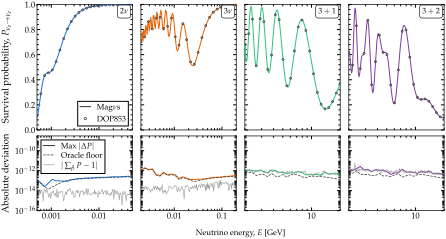

Accuracy and diagnostics
========================

.. contents::
   :local:
   :depth: 2

This page explains what ``rtol`` and ``atol`` control, what each safeguard can and cannot
catch, and what every warning means.

Accuracy
--------

   The survival probability :math:`P_{\nu_e \to \nu_e}` at two to five flavors along an
   exponentially falling profile, computed with Magνs and with a DOP853 integration of the
   same Hamiltonian (top); below, the largest deviation between the two, the departure of
   each row from summing to one, and the *oracle floor*, how much DOP853 itself moves when
   its tolerance is tightened.  Deviations below the floor cannot be resolved by this
   comparison.  From the Magνs paper.

Precision, accuracy and tolerance
~~~~~~~~~~~~~~~~~~~~~~~~~~~~~~~~~

These are three different things that are often confused.  **Precision** is
limited by rounding, **accuracy** by the refinement's stopping rule, and the **tolerance** is
the user's setting for that rule.

*Precision* is how closely Magνs agrees with itself.  Two calls with the same inputs return the
same number bit for bit, and the tests require exact equality there, so a change that let one
call affect the next, through a cache for instance, would fail them.  A parallel run agrees with
a serial one only to the requested tolerance, since each starts its refinement from a different
point.  With the slab grid fixed, a batched scan and the same points one at a time agree to
1e-14; left to refine, they stop at different slab counts and differ at the level of the
tolerance.  The two matrix-exponential backends agree to about 1e-15 for one exponential and to
3e-12 on a solar chain of about 34 000 exponentials, within the
:math:`N\varepsilon = 7.4 \times 10^{-12}` that rounding allows over that many products.

*Accuracy* is how close Magνs comes to the true probability, measured below against external
references.  It is already far better than a typical oscillation analysis needs: an analysis
evaluates probabilities on a grid, interpolates, and folds them with a flux, a cross section
and a detector response, and the error of that grid is orders of magnitude larger than anything
the oscillation code contributes.  Higher accuracy is still useful:

* it makes Magνs a reference against which another code, or a coarser setting of Magνs, can
  be checked, and often the only reference where no closed form exists;
* it matters for quantities computed once rather than averaged over bins;
* it separates the error of a method from the error of a model.

*The tolerance* is a stopping rule, not a guarantee; the next section says what it controls.
To judge whether an answer can be trusted, check the warnings.  They are standard Python
warnings, so Python's default filter shows each distinct message once per place it is raised,
and ``warnings.simplefilter('always')`` shows every occurrence.

Filtering on :class:`~magnus.oscprob.ToleranceNotAchievedWarning` also catches its subclasses:

* :class:`~magnus.oscprob.HybridCertificationWarning`
* :class:`~magnus.oscprob.UnmarkedDiscontinuityWarning`
* :class:`~magnus.oscprob.HiddenFeatureWarning`

It does not catch the other warnings that can mean a wrong answer, which derive from
:class:`UserWarning` directly (:ref:`warning-catalogue`):

* :class:`~magnus.magnus.MagnusConvergenceWarning`
* the unit warnings, :class:`~magnus.globaldefs.BaselineUnitWarning`,
  :class:`~magnus.globaldefs.EnergyUnitWarning` and :class:`~magnus.matter.DensityUnitWarning`
* :class:`~magnus.globaldefs.MixingAngleConventionWarning`
* :class:`~magnus.globaldefs.SterileMatterCompositionWarning`
* :class:`~magnus.oscprob.PhaseAveragingWarning`

The warnings err on the side of caution: most flag a property of the input rather than
predict the error, so they often fire on answers that prove accurate.  Less often, an answer is
inaccurate and none fires; the measured rates are in
:ref:`the table below <measured-distributions>`.

.. _what-rtol-atol-control:

What ``rtol`` and ``atol`` control
~~~~~~~~~~~~~~~~~~~~~~~~~~~~~~~~~~

They are a **stopping rule, not an accuracy guarantee**, and the difference is worth
stating because the names invite the other reading.

The refinement ladder computes the probability matrix, grows ``n_slabs`` (and, for the
quadrature methods, ``n_tpts_per_slab``), recomputes, and stops when two successive levels
agree within ``atol + rtol*|P|``.  Nothing in that loop estimates the error of the answer
it returns.  A stepping ODE integrator's ``rtol`` is a different quantity: it bounds an
*estimated* local error per step, formed by comparing against an embedded lower-order
formula.  Magνs forms no such estimate; it infers convergence from agreement.

Usually that is conservative.  For a sequence converging as :math:`C n^{-p}` the
level-to-level gap overstates the error of the finer level, so an answer that stopped at
``rtol=1e-3`` is typically better than 1e-3.  The measurement covered two PREM chords at 3 GeV
under ``strategy='magnus'`` (``costhz`` = -0.8 and -1; ``'gl'``, ``'trapezoid'`` and
``'simpson'``; ``magnus_exp_order`` 2–8; ``rtol = atol`` set to 1e-4 and 1e-8).  Against the
DOP853 oracle described below, none of the 48 answers was outside the tolerance.  The worst was
0.85 times it (``'gl'`` at order 2 and 1e-8), and the median 0.014 times it
(``docs/dev/measurements/issue161_rtol_gap/``).

**But agreement is evidence, not proof.**  On a sequence that is still oscillating, two
levels can agree by coincidence while both are far from the truth: measured on a sawtooth
density, the 3- and 4-slab levels agreed and the returned answer was wrong by **0.855** in
probability.  ``strict_convergence`` (off by default) requires two *consecutive* agreements for
that reason.

**The energy-batched scan** (``strategy='magnus'`` scans, and ``'auto'`` energy scans) meets the
same coincidence on smooth profiles, where two coarse levels agree while each slab still spans
several radians of phase.  On ``'gl'``, the default, it refuses such an agreement for any energy
whose own slabs still span :math:`2\pi` or more
(:data:`magnus.oscprob.BATCHED_GL_MAX_SLAB_NORM`), and over a measurement pool of 477 scans it
returns no silent miss.  ``'trapezoid'`` and ``'simpson'`` carry
no such refusal, because the same test flags far more correct answers than wrong ones there.
On the same pool they return 43 of 2580 energies outside the tolerance without a warning:
33 on grids with breakpoints, the worst **163 times** outside it (``'simpson'``, a PREM chord
at two flavors, ``rtol = atol = 1e-3``), and 10 on smooth profiles, the worst 11 times.
Where that matters, keep ``'gl'``.

**The adiabatic hybrid certifies the same way**, by two successive levels agreeing, together
with a bound on the non-adiabaticity of the stretch it transports without a window, so
``certified=True`` carries the same meaning and the same limit.  Measured on the
``B16-GS98`` solar model at 0.7 MeV: at ``rtol = atol = 1e-5`` and ``rtol = atol = 1e-6``, the
hybrid certified an answer 1.8e-5 from a 2e6-slab reference, with no warning; at 1e-7 it did
not certify, and the answer was 1.1e-6 off.  Its non-adiabaticity bound there was 1.9e-6.

**A ladder that starts at its cap checks nothing.**  When the slab count a scan needs is
already at ``max_n_slabs``, one level is computed, there is no second level to compare it
with, and :class:`~magnus.oscprob.ToleranceNotAchievedWarning` says so.  Across the Sun this
is every energy up to about 20 MeV once ``rtol = atol`` is 1e-4 or tighter: over
0.5–20 MeV the returned level was up to 2.0e-3 off on the default exponential profile, where
``strategy='hybrid'`` was within 6.3e-5, and 1e-6–8e-6 off on ``B16-GS98``.  A solar energy
scan can verify only a tolerance looser than about 1e-4; at 1e-4 or tighter, compare with
``strategy='hybrid'``, or raise ``max_n_slabs`` (about 2e6 slabs verify 1e-8 at 1 MeV).

Unlike NuOscProbExact, Magνs does not convert the gap into an error estimate by Richardson
extrapolation.  For a refinement ratio :math:`r` and order :math:`p`, that estimate is
:math:`\text{gap}/(r^p - 1)`, and the required :math:`p` is not reliably known.  Fitting the
observed order on the Earth chord against a 4096-slab reference gives :math:`p` = 3.84, 5.62
and 4.06 at 1, 2 and 10 GeV for ``magnus_exp_order=4`` (nominal 4), but **1.15, 2.66 and 1.59**
for ``magnus_exp_order=2`` (nominal 2).  The second set is scattered by more than a factor of
two, and one of its sequences is not even monotone.  On solar configurations under
``strategy='magnus'``, the error does not decrease monotonically at the slab counts the ladder
visits, so no power law holds.  Taking :math:`p` as the requested Magnus order would divide the
gap by too large a denominator wherever the true order is lower, and so report an error
*smaller* than the true one.

**The oracle discipline.** ``solve_ivp``/DOP853 at ``rtol=1e-12, atol=1e-14`` is the only
accuracy oracle, and its convergence is verified per configuration by tightening to
``rtol=1e-13`` and confirming the movement is far below the error being quoted. Where the
profile makes ``scipy.linalg.expm`` exact — a constant or declared-piecewise-constant ``H`` —
``expm`` is used instead.  **No Magnus path is ever scored against another**: agreement between
two paths is reported as agreement, never as accuracy.

.. _measured-distributions:

The distributions below were measured against those oracles, with an ``'auto'`` baseline scan
leaving the adiabatic hybrid for the cumulative scan at 25 baselines.  The threshold in the
package is 8 baselines, and 2 below a tolerance of 1e-6
(:data:`magnus.oscprob.HYBRID_YIELDS_TO_CUMULATIVE_MIN_POINTS`).  The cumulative scan had no
silent misses in this population (the row for N ≥ 30 below).

.. list-table::
   :header-rows: 1
   :widths: 40 20 20 20

   * - Population
     - Median error
     - p90
     - Silent misses
   * - 145 random smooth profiles, d ∈ {2,3,4,5}, N ∈ {1,3,12,30,80}
     - 6.08e-08
     - 7.14e-04
     - 6 (4.1%)
   * - the same, restricted to N ≥ 30 (cumulative scan)
     - ~8e-09
     - --
     - **0**
   * - 150 random piecewise-constant profiles, edges declared
     - 1.34e-12
     - 1.40e-11
     - **0**
   * - the same, edges **not** declared
     - 7.76e-04
     - 2.96e-03
     - 2
   * - 164 Earth/solar configurations (not adversarial)
     - --
     - --
     - **0**

A *silent miss* is an answer outside the requested tolerance with no warning of any kind.
It is the failure that matters most, because an inaccurate answer that warns can be caught.
Every silent miss on a random smooth profile was a single point or a short scan, outside a
requested 1e-3 by a factor of one to three.  The other two silent misses were on
piecewise-constant profiles whose edges were not declared.

**Unitarity** holds by construction, since every engine composes unitary factors.  In floating
point, the deviation of the probabilities from unitarity grows only from about 3e-12 to 1.6e-11
across four decades of N, at d = 2–5.

``tests/test_fuzz_statistics.py`` runs a CI-sized version of the fuzzing above and asserts on
the **distribution** — silent-miss rate, median, worst case — rather than on individual
cases.  A per-case assertion on random input is brittle, while an aggregate one still catches a
regression that moves the distribution.

.. _safeguard-limits:

Robustness, and what each safeguard cannot do
---------------------------------------------

Each safeguard below is stated with its limit.

**The probe-scale resolution test** (``magnus.adiabatic._profile_is_resolved``). It decides
whether ``H`` is continuous at the scale this package samples it on, by comparing how much of
the variation inside a probe interval falls in one half. *What it cannot do:* a jump smaller
than **1.33×** the local smooth variation is indistinguishable from steep smooth
behavior at that sampling density; see :data:`magnus.adiabatic.RESOLUTION_RATIO` for the
derivation of that factor from the threshold.

**γ-aware certification** (:data:`magnus.adiabatic.GAMMA_TO_ERROR`). When no non-adiabatic
window opens, successive refinements differ only in the transport grid, so they converge to
the same adiabatic limit and agree with each other whether or not that limit is right.
For this reason, certifying an empty window list also requires γ itself to be small enough
for the requested tolerance. *What it cannot do:* the constant converts γ into an error
estimate good to about a factor of two, so certification near the bound is a closer call than
it looks.

**The patch budget** (``max_n_slabs`` in ``_local_evolution_operator``; its value and the
population behind it are in :ref:`how-constants-were-set`). A patch is meant to be a short,
local repair; one needing more slabs than a plain Magnus integration of the whole trajectory
means the non-adiabatic region is not narrow and the hybrid strategy offers no advantage for
that request.  The hybrid then declines, and the general path is 70× faster there.

**Cross-method agreement** (:func:`magnus.oscprob.cross_check_strategies`). It runs whichever
engines apply and reports the pairwise spread.  On eight constructions where a method had
been silently wrong, it reported the disagreement on **seven**, each at least four times the
requested tolerance. *What it cannot do:* see engines that are
:ref:`wrong together <wrong-together>`.

**The sampling report** (:func:`magnus.adiabatic.oscillation_sampling`). It answers a question
no engine asks itself: how coarsely does this request sample the oscillation it is computing?  A
solar trajectory is a few thousand oscillations long and a supernova ray tens of thousands, so a
scan of any ordinary size returns correct values that must not be read as a curve.  The report
appears as ``strategy_info['sampling']`` and **never raises a warning**: the Nyquist criterion
would fire on 44 of 45 realistic scan sizes, and a warning at that rate is noise.  It is computed
only when ``strategy_info`` was supplied, so the default path pays nothing.  See
:doc:`averaged_probability` for what to do when it says ``aliased``.

**The sub-probe feature scan** (:func:`magnus.adiabatic.find_hidden_features`). It looks at the
*profile* rather than at the answers, which lets it reach the one class no cross-check can.
Within each interval of the refinement-ceiling grid, it compares the total variation a denser
grid sees inside that interval with the change its endpoints show, and reports the largest
excess as a fraction of the total. **Concentration, not size** — an aliased sinusoid hides
variation in every interval; a narrow bump hides all of it in one. It was measured at **0 false
positives over 67 smooth and resolvable profiles**; it detects 68–90% of features in the
unresolvable band and costs 0.37 ms once per call. *What it cannot do:* detection falls to ~0.73
for features far below the dense sampling.  It also **reports rather than cures**: it names the
position and the exact ``t_breakpoints`` to pass.  On the width-3e-5 calibration case, passing
the printed edges back and re-running reduced the error from 3.0e-02 to 1.0e-04.

**The scan is sized to the request.**  It runs once per call, whatever the number of points,
so its share of the work falls as the request grows.  It uses 8 sub-steps (0.37 ms) for up to
three points, 16 for four to fifteen, and 32 (2.85 ms) for sixteen or more, which keeps it
under about 7% of the call at every size.
A single point keeps the cheapest scan by design — the extra reach that finer sampling buys is
at widths of :math:`3\times10^{-6}` of the trajectory and below, narrower than anything
physically plausible in a density profile.

.. _wrong-together:

**The first irreducible limit: a feature narrower than the probe spacing.** A Gaussian
resonance of width :math:`3\times10^{-5}` of the trajectory is not sampled by the probe grid
(spacing :math:`5\times10^{-3}`), nor by its refinement ceiling
(:math:`1.6\times10^{-4}`), nor by the cumulative scan's grid. Every engine reports a smooth
profile, small γ, and a resolved Hamiltonian — correctly, given what any of them can see —
and all of them are wrong together by **2.9e-02 against a requested 1e-3**. Because they are
wrong *together*, the cross-check sees nothing either: it detects disagreement, so it finds a
wrong engine exactly when some other engine got it right.  This limit belongs to any fixed
grid, not to a particular test.

The remedy, verified on this case, is to supply ``t_breakpoints`` at the feature.  With edges
placed by hand at the feature's own width, the same case improves to 8.8e-04 at a single point
and 8.9e-04 over a 60-point scan.  With the edges that the warning prints, which it finds by
re-sampling the flagged interval, it improves to 1.0e-04.  The condition is usually **detected
and reported** rather than silent — see the feature scan above.

**The second irreducible limit: broadband roughness.** The sub-probe scan is a
*concentration* statistic, and that is exactly what makes it blind to structure spread over
every scale rather than piled into one place.  It was measured on Kolmogorov density
fluctuations built as in the supernova literature: a :math:`k^{-5/3}` spectrum with a 40–50 dB
dynamic range, which puts power below every grid this package uses.  The finest reachable grid
sees only a third of the profile's total variation, and **neither structural test notices**:
:func:`magnus.adiabatic.find_hidden_features` returns a concentration of 0.002 against its 0.30
threshold, and ``_profile_is_resolved`` declares the profile resolved on 144 of 144
configurations. A power law spreads its sub-grid variation evenly over all 6400 reference
intervals, so each carries about :math:`1/6400` of it however large the total is.  No threshold
reaches that, in the same way that no threshold reaches a feature that was never sampled.

What saves the answer is unrelated machinery: the errors such a profile produces (up to 1.4e-02
instantaneous at 45 MeV) are caught by the **convergence** checks, which watch the refinement
ladder rather than the profile, and the user is warned.  For a turbulent or noisy medium, do not
rely on the structural diagnostics: rely on the convergence checks, or supply ``t_breakpoints``.

**A cross-check cannot close the rest.** Checking ``strategy='auto'``'s window-free results
against the general Magnus ladder was measured and caught nothing: **what is left in that band
is not engines disagreeing — it is engines being wrong together**, which a cross-check cannot
see.

.. _input-checks:

Input checks: what is refused, and where
----------------------------------------

Every argument of a public function is checked once per call, before any engine is chosen,
so whether a value is refused does not depend on which engine would have answered.  The
rules:

* **Numbers** are Python or NumPy reals (``np.float32``, ``np.int64`` and 0-d arrays
  included), never ``bool`` and never complex, and finite.  Energy and ``L`` are checked
  entry by entry, and every ``L`` must be at least ``L0``.  The off-diagonal NSI couplings
  are the one exception to "real": they may be complex.
* **Integers** are ``int`` or ``np.integer``, never ``bool`` and never a float such as 2.5.
  **Flags** are ``True`` or ``False``: they are not truth-tested, so ``'False'`` is refused
  rather than read as true.  **Strings** come from their documented set, even where the
  argument does not apply to the call.
* **Tolerances** ``rtol`` and ``atol`` are ``None`` or above zero.  **Slab and point counts**
  are positive integers, growth factors are above 1, and ``n_jobs`` is -1 or a positive
  integer.
* **Parameter dictionaries** (``osc_params``, ``nsi_params``, ``liv_params``) refuse unknown
  keys, naming the nearest valid one.
* **Slab edges** chain without gap or overlap over the whole path; a **Hamiltonian** you pass
  must be (or return) a finite, square, Hermitian array.

A wrong type raises ``InputTypeError`` (from ``magnus._validate``), which is both a
:class:`TypeError` and a :class:`ValueError`; a wrong value raises :class:`ValueError`.  The
message names the function you called and the argument you passed.

The functions that run at every quadrature node — the density profiles, the ``*_td``
builders, ``hamiltonian_Nnu_matter`` — are not checked, since a check there would be paid
millions of times.  Their parameters are checked where they are set, by the wrappers and the
factories.  ``validate_input=False`` skips the scenario-level checks.

.. _warning-catalogue:

Warnings: what each one means and what to do about it
-----------------------------------------------------

Each warning below states what was detected, what it means for the answer (including *by how
much*, where the code knows), what to change, and when it is safe to ignore.

.. list-table::
   :header-rows: 1
   :widths: 24 30 22 24

   * - Warning
     - Condition
     - Is the answer affected?
     - What to change
   * - :class:`magnus.magnus.ScalarHamiltonianWarning`
     - ``H_func`` accepts only one position at a time.
     - No — output is bit-identical.
     - Make ``H_func`` array-capable (``VCC[..., None, None]*e00``): about 5× faster on a
       call with hundreds of slabs, less on a short one (:ref:`write-h-func-vectorized`).
   * - :class:`magnus.matter.DensityUnitWarning` (over-declared)
     - A density declared in g cm⁻³ is denser than a neutron star.
     - Yes — catastrophically. The potential is inflated by a factor of 4.3e18, about 19
       orders of magnitude; the symptom is :math:`P_{ee} = 1`.
     - The density is already in natural units: leave
       ``density_matter_is_in_g_per_cm3`` at False.
   * - :class:`magnus.matter.DensityUnitWarning` (under-declared)
     - A density declared in natural units is far too small to be one: below 1e10, where a
       density of 1 g cm⁻³ is already 4.3e18.
     - Yes, and this is the dangerous direction. The potential comes out a factor of 4.3e18,
       about 19 orders of magnitude, too small, effectively zero, so the call returns
       **exactly the vacuum probability**.  It looks like an ordinary answer rather than a
       missing one, and nothing in the numbers reveals the error.
     - Pass ``density_matter_is_in_g_per_cm3=True``, or convert yourself (multiply by
       ``gd.UNIT_G_PER_CM3``).
   * - :class:`magnus.globaldefs.BaselineUnitWarning`
     - A baseline is small enough to have been read in kilometers and left unconverted.
     - Yes, entirely. One eV⁻¹ is about 2e-7 m, so an Earth chord left in kilometers is a
       few millimeters long (the warning's threshold is about 2 m), and the call returns a
       converged, unitary probability for it.
     - Multiply by ``gd.UNIT_KM`` (or ``gd.CONV_KM_TO_INV_EV``).
       The same warning covers ``t_breakpoints`` given in kilometers.
   * - :class:`magnus.globaldefs.EnergyUnitWarning`
     - An energy is below 1 keV, small enough to have been read in MeV or GeV and left
       unconverted.
     - Yes, entirely. The call computes at that energy in eV and returns a plausible
       probability for it.
     - Multiply by ``gd.UNIT_MEV`` or ``gd.UNIT_GEV``.
   * - :class:`magnus.globaldefs.MixingAngleConventionWarning`
     - ``angles='deg'`` was declared, but the values are the size of sines — every
       measured angle read as degrees would be about fifty times too small.
     - Yes. A converged, unitary and entirely wrong probability rather than an error.
     - Drop ``angles='deg'``; its default ``'sin'`` is what
       :func:`~magnus.globaldefs.load_nufit_params` returns.
   * - :class:`magnus.globaldefs.SterileMatterCompositionWarning`
     - On an Earth wrapper at four or five flavors, a scalar
       ``ratio_number_neutrons_to_protons`` was passed over the layered :math:`Y_e` of a
       chord, or one that contradicts a uniform ``electron_fraction`` override.
     - Yes, for the sterile states' entry in the matter projector. Three flavors are
       unaffected.
     - Omit the ratio and let it be derived from :math:`Y_e`.  That is the default (``None``)
       on the Earth and Sun wrappers; the constant- and exponential-density wrappers default
       to 1.0 and never raise this warning.
   * - :class:`magnus.oscprob.UnmarkedDiscontinuityWarning`
     - Issued in any of these cases:

       * The Hamiltonian is discontinuous at the grid scale and no ``t_breakpoints`` were
         given, on a cumulative scan, on the hybrid strategy, or with ``average=True``
         where the jump could move probability between levels.
       * :func:`magnus.magnus.magnus_expansion_multislab` was given a declared breakpoint
         that lies strictly inside one of its slabs.
       * On the per-point path of :func:`~magnus.oscprob.osc_prob_energy_baseline`, which
         every wrapper reaches for a single point, the jumps were located and declared; the
         message names them.
     - Yes, and refinement cannot help — a straddling slab only gets narrower, and the
       averaged route treats the jump as smooth.  On the per-point path, no: the answer was
       computed with the jumps declared (a three-layer step profile: 4.1e-2 → 4.5e-13).
     - ``t_breakpoints`` at the jumps; on the per-point path, those the message prints, to
       skip the search. Measured: median 7.8e-04 → 1.3e-12 on a scan; with
       ``average=True`` on a supernova shock, 0.04 → 0.56 against a reference of 0.59.
   * - :class:`magnus.oscprob.PhaseAveragingWarning`
     - ``average=True`` where the phase average depends on its spread: some interference
       has partly survived it, and :math:`|\sigma\,\partial P/\partial\sigma|` exceeds
       1e-3.  Also on every energy-window average across declared discontinuities, and, for
       a Hamiltonian without energy dependence, where the limit does not apply.
     - The number is the average over the spread asked for, not over another.
     - ``average_spread`` set to the resolution of the measurement; the standard error
       of the mean is reported for the window average, and ``average_n_samples`` lowers it.
   * - :class:`magnus.hamiltonians.hamiltonians_pseudodirac.PseudoDiracSplittingWarning`
     - The pseudo-Dirac splitting is not small against the standard mass-squared ones.
     - The number is what was asked for; the *model* is the wrong one. At that size the
       two scales overlap and the pair is an ordinary sterile state.
     - The four- and five-flavor routines, which describe that spectrum properly.
   * - :class:`magnus.oscprob.IgnoredQuadratureSettingWarning`
     - A points-per-slab setting (``n_tpts_per_slab``, ``min_``/``max_n_tpts_per_slab``,
       ``growth_factor_n_tpts_per_slab``) was passed with ``integration_method='gl'``.
     - No. ``'gl'`` evaluates the Hamiltonian at its own nodes, so the setting was not used
       and the result is what it would be without it.
     - Drop the setting, or pass ``integration_method='trapezoid'`` or ``'simpson'`` to use it.
   * - :class:`magnus.magnus.MagnusHighOrderCostWarning`
     - ``magnus_exp_order`` above 6 on ``'trapezoid'``/``'simpson'``.
     - No — it is a cost trade-off, not an error.
     - Usually narrower slabs at order 4 or 6 instead.
   * - :class:`magnus.oscprob.ToleranceNotAchievedWarning`
     - A refinement cap was reached with the last two levels still disagreeing; or, in the
       energy-batched scan, energies were accepted at the slab cap on levels that refined only
       the points per slab (``'trapezoid'``/``'simpson'``), which verifies the quadrature but
       not the slab count.
     - Unverified. The message reports **how far** from converged it stopped, as a multiple
       of the tolerance.
     - Raise the named cap; or loosen ``rtol``/``atol``; or add ``t_breakpoints``.  At the
       slab cap, ``integration_method='gl'`` (default cap 20 000) is the other way out.
   * - :class:`magnus.oscprob.HybridCertificationWarning`
     - ``strategy='hybrid'`` was forced and a point did not self-certify; or, with
       ``average=True``, the crossing probabilities on the adiabatic route could not be
       certified.
     - **Unverified, which is not the same as wrong.** The result is still unitary.
     - ``strategy='auto'`` (falls back automatically); or ``t_breakpoints`` at known
       structure; or a looser tolerance.
   * - :class:`magnus.oscprob.HiddenFeatureWarning`
     - The profile has structure too narrow for **any** grid here to sample.
     - Possibly wrong, and no strategy or tolerance helps — every engine misses it together.
     - ``t_breakpoints`` at the position named in the message.  This does not always remove
       the error.
   * - :class:`magnus.magnus.MagnusConvergenceWarning`
     - :math:`\lVert\Omega\rVert_2 \geq \pi` on some slab.
     - **Unknown.** This reports a slab width, not an error.
     - Narrower slabs: a larger ``n_slabs``, or ``min_n_slabs`` to start the refinement finer;
       ``t_breakpoints`` at any jump. A smaller ``rtol``/``atol`` adds finer levels but a coarse
       first level is still reported. Raising the order does not help. The norm excludes the
       trace of :math:`\Omega`, a global phase.
   * - :class:`magnus.oscprob.CrossCheckInconclusiveWarning`
     - :func:`~magnus.oscprob.cross_check_strategies` compared nothing, so its spread is
       0.0 for want of a second opinion rather than because two engines agreed.
     - No — but the *diagnostic* is empty, which reads like a clean bill of health.
     - Pass an entry point that takes ``strategy`` (``osc_prob`` itself does not), and
       check ``out['ran']`` before reading any spread.
   * - :class:`magnus.oscprob.SolarModelRangeWarning`
     - ``stop_at_table_edge=True`` on a Sun entry point, and a baseline ends past the
       solar model's last tabulated radius.
     - Yes, as asked: those points come back as NaN.  The others are computed as usual.
     - Nothing, if NaN is what you wanted.  Otherwise leave ``stop_at_table_edge`` False
       to continue the profile past the table, or use a model tabulated to the surface
       (B16, B23); see :doc:`solar_models`.

**Measured false-positive rates.**  The population is the 160 of the 168 configurations of
``docs/dev/adversarial_batteries/warn_fp.py`` that are valid input (the other 8 are refused),
across the profile families this package serves, at d = 2–3.  Each answer was scored against
``solve_ivp``, or against ``expm`` for piecewise-constant profiles, where it is exact.

.. list-table::
   :header-rows: 1
   :widths: 40 12 12 12 24

   * - Warning
     - Fired
     - TP
     - FP
     - FP rate
   * - :class:`magnus.magnus.MagnusConvergenceWarning`
     - 19
     - 7
     - 12
     - **63%**
   * - :class:`magnus.oscprob.UnmarkedDiscontinuityWarning`
     - 56
     - 33
     - 23
     - 41%
   * - :class:`magnus.oscprob.ToleranceNotAchievedWarning`
     - 42
     - 29
     - 13
     - 31%

Silent misses across that whole population: **none of 160**; all 33 answers outside the
tolerance carry at least one warning.

``UnmarkedDiscontinuityWarning`` reports a *condition about the input*, not a prediction about
the error: when it fires there is an undeclared discontinuity, and a false positive means only
that the answer survived it.  Declaring the edges is still the advice worth taking.

``MagnusConvergenceWarning`` measures the traceless part of :math:`\Omega`, since the trace is
a global phase.  Of 69 single-point calls, some refinement level exceeded :math:`\pi` in 19,
but **the level whose answer was returned did so in only 4**, so most of its firings describe
an intermediate grid.  Keying it to the returned level instead was measured to lose far more
true positives than false ones, because a ladder that started far from convergence predicts a
bad answer better than a coarse final grid does.

``MagnusConvergenceWarning`` **reports slab width, not accuracy.**  The convergence bound it
checks is sufficient, not necessary, so exceeding it does not imply a wrong answer.  It fires
on results accurate to 1.6e-06 and on results seven times outside a requested 1e-3, and
nothing available to it distinguishes the two.  Do not assume that a requested tolerance
makes it safe to ignore: on a sawtooth density with ``rtol=atol=1e-3`` requested, under both
``strategy='auto'`` and ``strategy='magnus'``, the refinement ran and the answer was still
wrong by 7.5e-03.

``HybridCertificationWarning`` **means unverified, not wrong.** Every piece of the hybrid
propagator is unitary by construction, so the returned probabilities are a valid probability
matrix regardless; what is missing is the evidence that they are accurate to the tolerance
requested.
