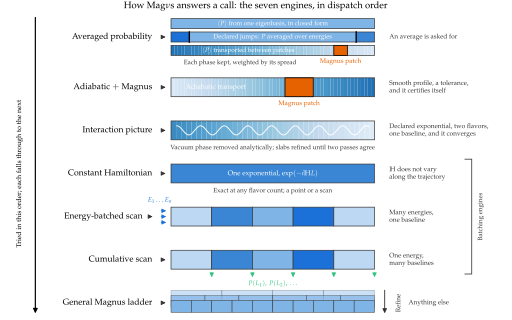

Engines and dispatch
======================

.. contents::
   :local:
   :depth: 2

Which engine answers a call, how the choice is made, and why each one
exists.  See :doc:`performance` for what they cost and :doc:`diagnostics`
for what to do when one warns.

.. _the-engines:

The engines
-------------

   The seven engines, in the order they are tried.  A request that does not meet an
   engine's conditions (right) passes to the next, so the general Magnus ladder answers
   whatever no other engine takes.  Each row sketches what its engine does along the
   trajectory; shading is the matter density.  From the Magνs paper.

Seven engines can answer a request.  They are tried in a fixed order, from the most
specialized to the most general, and the first whose conditions the request meets answers
it; an engine whose conditions are not met declines, and the request passes to the next.
The general Magnus ladder, last, accepts every request.  Several engines share machinery,
which is why `Independence, and why it matters`_ follows the table.

.. list-table::
   :header-rows: 1
   :widths: 4 18 30 24 24

   * -
     - Engine (name in ``strategy_info``)
     - What it does
     - When it applies
     - When it declines
   * - 1
     - **Averaged probability** (``'average'``; :mod:`magnus.avgprob`)
     - The phase average, by one of three routes: in closed form from one eigenbasis when
       ``H`` does not depend on position; transported along the instantaneous eigenstates,
       with a Magnus patch across each non-adiabatic crossing, when ``H`` varies smoothly;
       the mean over an energy window across declared discontinuities
       (:doc:`averaged_probability`).
     - ``average=True``, on every entry point that takes the keyword.
     - Never; it warns where the result depends on the spread, and where the profile has a
       feature narrower than its 200-probe grid that no refinement resolves.
   * - 2
     - **Adiabatic + Magnus** (``'hybrid'``; :func:`magnus.adiabatic.hybrid_propagator`)
     - Transport along the instantaneous eigenstates, with a Magnus patch across each
       non-adiabatic window (:doc:`adiabatic_strategy`).
     - Any smooth position-dependent ``H``, any number of flavors, with a requested tolerance.
     - Breakpoints or slab edges supplied, no requested tolerance, a profile it does not
       resolve on its probe grid; under ``'auto'``, a failed certification and the requests
       the rules below send elsewhere.
   * - 3
     - **Interaction picture** (``'ip_exp'``)
     - Factors out the vacuum phase (and the LIV term, if present) analytically and
       integrates the exponential matter envelope exactly over each slab, to first order.
     - Two flavors, a profile built by :func:`magnus.matter.exp_density_profile`, one
       baseline (a single point or an energy scan).
     - More than two flavors, any other profile (a tabulated solar model included),
       breakpoints or slab edges, and a failure to converge, as near an MSW resonance.
   * - 4
     - **Constant Hamiltonian** (``'constant'``)
     - One exponential, exact: the Magnus series terminates at its first term.
     - ``H`` does not vary along the path; any number of flavors, a single point or a scan,
       with per-point baselines allowed.
     - A position-dependent potential; user slab edges; parallel, logged or verbose runs; a
       refinement value ``osc_prob`` would reject (other refinement keywords are ignored).
   * - 5
     - **Energy-batched scan** (``'separable'``)
     - One set of slabs shared by every energy: the potential is sampled once per refinement
       level, and the energy is a batch dimension.
     - Many energies at one baseline, with ``H`` = energy-dependent part + ``V_CC(l)`` times a
       fixed matrix.
     - Per-point baselines, user slab edges, parallel or logged runs, a constant potential
       (engine 4 takes it).
   * - 6
     - **Cumulative scan** (``'cumulative'``)
     - One pass along the longest baseline, recording the running product at every requested
       baseline: :math:`U(0\to L_2) = U(L_1 \to L_2)\,U(0 \to L_1)`.
     - Many baselines at one energy, with a position-dependent ``H``.
     - Differing energies, ``t_slab_edges``, a baseline behind ``L0``, a constant ``H``.
   * - 7
     - **General Magnus ladder** (``'magnus'``; :func:`magnus.oscprob.osc_prob`)
     - Slabs refined until two successive levels agree (:doc:`methodology`).
     - Always.
     - Never; it is the last engine.

Not every entry point tries every engine.  The matter scenario functions try the first five,
in order; ``osc_prob_energy_baseline`` tries the cumulative scan; ``osc_prob`` is the ladder
itself.  ``osc_prob_vacuum`` needs only the averaged probability and the constant engine.  A
Hamiltonian of your own, through ``osc_prob_earth`` or ``osc_prob_sun``, can reach the
averaged probability, the adiabatic engine, the cumulative scan and the ladder.  A request
for the evolution operator (``return_evolution_operator=True``) goes to the ladder, the only
engine that forms it.

The eighth entry in the registry, ``scipy.linalg.expm``, never answers a request; it is
used as an oracle by
:func:`magnus.oscprob.cross_check_strategies` wherever it is *exact* -- a constant ``H``,
or a piecewise-constant one whose edges are declared.

Independence, and why it matters
~~~~~~~~~~~~~~~~~~~~~~~~~~~~~~~~~~

The engines are **not** all independent of each other, and pretending otherwise would make
any cross-check between them worthless. :data:`magnus.oscprob.ENGINE_FAMILIES` records the
grouping the package will defend:

* ``'magnus-ladder'`` -- the general path, the cumulative scan and the separable scan. All
  three walk slabs with :func:`magnus.magnus.magnus_expansion_multislab`, and the cumulative
  scan additionally *sizes* its grid from an ordinary adaptive :func:`magnus.oscprob.osc_prob`
  probe, so it inherits that path's stopping rule as well.
* ``'interaction-picture'`` -- the two-flavor fast path. Same Magnus core, but the fast
  vacuum phase is factored out analytically first, so what it must resolve is a different
  function.
* ``'adiabatic'`` -- the hybrid strategy. A genuinely different method; its blind spots are
  the resonance detector's, not the quadrature's.
* ``'phase-average'`` -- the phase average. It propagates only across non-adiabatic
  windows, with the hybrid's Magnus patch, and carries every stretch between them
  analytically, so it shares no quadrature with the ladder; what it shares with the others
  is the eigendecomposition of the same ``H``.
* ``'exact'`` -- ``expm`` and the constant-Hamiltonian engine, independent of the rest.

Two engines in the same family can be wrong in the same way at the same time. Their
disagreement is informative; their agreement is not.

.. _dispatch-order:

Dispatch
----------

Each matter scenario function (:func:`magnus.oscprob.osc_prob_matter_std_potential`,
:func:`magnus.oscprob.osc_prob_matter_nsi`, :func:`magnus.oscprob.osc_prob_liv`) tries the
engines in a fixed order, falling through on ``NotImplemented``:

.. list-table::
   :header-rows: 1
   :widths: 40 26 34

   * - Taken when
     - Engine
     - Why it is first
   * - ``average=True`` (on every entry point, ``osc_prob_energy_baseline`` and the
       Earth and Sun routes included)
     - averaged probability, by one of its three routes
     - It answers a different question from the other engines: the average, not the
       probability at one energy
   * - Smooth profile, a tolerance was requested, ``strategy != 'magnus'``,
       the scan is shorter than
       :data:`~magnus.oscprob.HYBRID_YIELDS_TO_CUMULATIVE_MIN_POINTS`,
       and ``'auto'`` did not hand it to the ladder (below) --
       *and it certifies*
     - adiabatic + Magnus patch
     - Transports along the levels instead of resolving every oscillation
   * - Exponential profile, two flavors, not handed to the ladder --
       *and it converges*
     - interaction picture
     - An exact reference solution exists for this one case
   * - ``V_CC`` does not vary along the trajectory
     - constant Hamiltonian
     - The series terminates at its first term, so the answer is one exponential
   * - Many energies at a single baseline
     - energy-batched scan
     - One traversal serves every energy
   * - Baseline scan at one energy, at least
       :data:`~magnus.oscprob.CUMULATIVE_AUTO_MIN_POINTS` points
     - cumulative scan
     - Every baseline is a prefix of the longest one
   * - Otherwise, or whenever ``return_evolution_operator=True``
     - general Magnus ladder
     - Always applicable; the one that is never skipped, and the only one
       that forms the evolution operator

Each row falls through to the next on ``NotImplemented``, so the last row is
reached whenever nothing above it applies.

Two thresholds decide the seams, and both are constants with docstrings of their own:

* :data:`magnus.oscprob.HYBRID_YIELDS_TO_CUMULATIVE_MIN_POINTS` = 8. Under
  ``strategy='auto'`` the hybrid strategy stands aside for a baseline scan of at least this
  many points, because the cumulative scan answers all of them from one traversal.  This was
  25; the constant's own docstring records why it moved, and why a later attempt to lower it
  to 1 was reverted.
* :data:`magnus.oscprob.CUMULATIVE_AUTO_MIN_POINTS` = 2. Below this there is no prefix to
  reuse.

**The ladder route of** ``'auto'`` (issue #70).  On a smooth profile the hybrid strategy's cost
is its window search, which does not follow the tolerance.  At a loose tolerance on a moderate
phase that makes it the slower route.  So, at a tolerance ``min(rtol, atol)`` of
:data:`magnus.oscprob.AUTO_LADDER_MIN_TOLERANCE` = 1e-6 or looser, ``'auto'`` hands a request to
the ladder ahead of the hybrid when both of these hold:

* the estimated accumulated phase (the integral of the spread of ``H``'s eigenvalues up to the
  longest baseline) is at most :data:`magnus.oscprob.AUTO_LADDER_MAX_PHASE` = 1e4 rad;
* the ladder's starting slab count is at most
  :data:`magnus.oscprob.AUTO_LADDER_MAX_FLOOR_FRACTION` = 1/4 of its cap, which keeps every
  solar path on the hybrid.

For an energy scan at one baseline that the energy-batched scan will take, the phase condition
is dropped (issue #84).  That engine shares its slabs across the energies, so the phase limit,
which prices the ladder one point at a time, does not apply: on 100 energies of a three-flavor,
two-resonance profile whose phase estimate sat just above it, the hybrid took 62 s and the
batched scan 0.4 s.

The ladder then runs at a tenth of the tolerance
(:data:`magnus.oscprob.AUTO_LADDER_TOLERANCE_MARGIN`), skips the interaction picture and starts
on slabs over which the Magnus series is guaranteed to converge.  The hybrid's test for an
undeclared density jump still runs, and still warns.  Over 20 smooth workloads with phases from
5 to 1.2e4 rad, the ladder was 2 to 60 times faster than the hybrid on a single point and 12 to
500 times faster per point of a 40-energy scan, within the tolerance on every one.  On the
profile of the paper's Fig. 1, its four scans of 140 energies take 40 ms of computation at the
default tolerance of 1e-3, where the hybrid took 8 s.

**At a tighter tolerance** (issue #120) the route stays open on ``integration_method='gl'`` at a
single baseline, with a phase limit that shrinks with the tolerance and the order:
``AUTO_LADDER_MAX_PHASE*(tol/1e-6)**(1/p)``, with ``p`` the requested ``magnus_exp_order``,
capped at :data:`magnus.oscprob.AUTO_LADDER_TIGHT_MAX_PHASE` = 2 000 rad.  The ladder's slab
count grows as ``tol**(-1/p)``, while the hybrid's window search does not follow the tolerance.
The limit applies to an energy scan as well, and the ladder runs at the tolerance itself: its
rungs are then deep in the asymptotic regime, where the difference between two of them already
overestimates the finer one's error, and a tenth of the tolerance had made it the slower route.
The paper's Listing 1 takes this route at ``rtol = 1e-12``, ``atol = 1e-14`` and
``magnus_exp_order = 8``: the limit there is 1 000 rad, its four curves estimate 10 to 78, and
the ladder answers them in 0.015 to 0.13 of the hybrid's time.  Over the 139 workloads measured
at 1e-7, 1e-9 and 1e-12 against DOP853, the ladder at order 8 missed no tolerance without a
warning and never warned where the hybrid had certified; the cap keeps the partial solar chords
from 2 217 rad on, where it did, on the hybrid.  A baseline scan keeps the hybrid at such
tolerances: the cumulative scan that would answer it was not measured there (issue #125).

**Which engine answers a request.**  Put together, the rules above give the engine that
answers each kind of request under ``strategy='auto'``, by the shape of the request and the
tolerance, ``min(rtol, atol)``.  "Many energies" are at one baseline, and "baselines" are at
one energy.  "Too many slabs" means that the ladder would start with more than a quarter of its
slab cap, as across the Sun.  "The tightened limit" is the phase limit of the paragraph above,
on ``integration_method='gl'``; other quadratures keep the adiabatic engine first below 1e-6.
``strategy_info`` reports the engine that answered.

.. list-table::
   :header-rows: 1
   :widths: 28 36 36

   * - Request
     - Tolerance >= 1e-6 (includes the default, 1e-3)
     - Tolerance < 1e-6
   * - ``average=True``
     - averaged probability
     - averaged probability
   * - Constant ``H``
     - constant Hamiltonian
     - constant Hamiltonian
   * - Smooth ``H``, one point
     - general ladder; adiabatic if the phase exceeds 1e4 or with too many slabs
     - general ladder if the phase is within the tightened limit; otherwise, or with too many
       slabs, adiabatic, and if that cannot certify, the ladder (the interaction picture for
       an exponential profile at two flavors)
   * - Smooth ``H``, many energies
     - energy-batched scan; adiabatic with too many slabs
     - energy-batched scan if the phase is within the tightened limit; otherwise, or with too
       many slabs, adiabatic, and if that cannot certify, the energy-batched scan
   * - Smooth ``H``, 2 to 7 baselines
     - cumulative scan; adiabatic if the phase exceeds 1e4 or with too many slabs
     - adiabatic; if it cannot certify, the cumulative scan
   * - Smooth ``H``, 8 or more baselines
     - cumulative scan
     - cumulative scan
   * - Declared discontinuities (``t_breakpoints`` or ``t_slab_edges``)
     - ladder, energy-batched scan, or cumulative scan, by the shape of the request
     - the same

At a tolerance tighter than 1e-6, a smooth-profile energy scan whose phase exceeds the tightened
limit still goes to the adiabatic engine, which is the slower route for a scan.  Within the limit
it now takes the energy-batched scan (issue #120): on 300 energies from 3 to 100 MeV over 200 km
of an exponential profile (418 rad) at 1e-8, 0.1 s where the adiabatic engine took 11 s.  A
baseline scan of 2 to 7 points keeps the adiabatic engine at such tolerances whatever its phase.
Passing ``strategy='magnus'`` keeps an energy scan on the energy-batched scan; it also turns off
the cumulative scan, so it is not the choice for a baseline scan.  Issue #125 tracks whether the
tolerance condition should apply to scans at all.

**The accuracy steps at the seam rather than varying smoothly, and that is by design.**
Adding one baseline to a scan just below it changes the answer, because it changes the engine.
Measured against ``solve_ivp`` when the seam was at 25 baselines, so that 24 went to the hybrid
and 26 to the cumulative scan (it is now 8, and the same step sits between 7 and 8):

.. list-table::
   :header-rows: 1
   :widths: 34 22 22 22

   * - Profile
     - err(N = 24)
     - err(N = 26)
     - Ratio
   * - solar exponential
     - 3.30e-05
     - 2.13e-08
     - 1 546×
   * - multi-resonance
     - 1.58e-03
     - 2.86e-09
     - 552 945×
   * - noisy
     - 6.27e-04
     - 1.04e-08
     - 60 418×
   * - castle wall + breakpoints
     - 2.80e-11
     - 2.80e-11
     - 1.0× (cumulative from N = 2)

In the cases measured, the step was toward the more accurate answer.  A user who adds one
point to a scan and sees the answer move by more than the tolerance is seeing a change of
engine, not a fault; ``strategy_info`` names it.

**Seeing which engine answered.** The fallbacks are silent by design: they happen on
ordinary calls and warning about them would be noise. Pass ``strategy_info`` to any scenario
function or wrapper, or to :func:`~magnus.oscprob.osc_prob_earth` or
:func:`~magnus.oscprob.osc_prob_sun`, to see the route without changing it::

    info = {}
    P = oscprob.osc_prob_matter_std_potential(..., strategy_info=info)
    info['engine']      # 'hybrid', 'ip_exp', 'separable', 'constant',
                        # 'cumulative', 'magnus' or 'average'
    info['certified']   # for the hybrid strategy
    info['declined']    # [(engine, why it gave up)], for engines that tried

A result that moves when a point is added to a scan, or a call that suddenly costs more, is
often a change of engine, and the dictionary names it.  The one fallback that warns is the
adiabatic engine declining a profile with a jump, or a feature too narrow for its grid, once
per session.
