.. _ex-sec-examples:

Usage and examples
==================

This page walks through the calls to Magνs for the cases a user is most likely to
meet, and then through a set of longer examples.  It follows Section 6 of the Magνs
paper, section by section, with each snippet and figure.  Every figure is computed
in `notebook 28 <https://github.com/mbustama/Magnus/blob/main/notebooks/28_magnus_paper_figures.ipynb>`__,
and each section links the notebook that develops its topic in full.

.. _ex-sec-api:

The full application programming interface (API)
------------------------------------------------

The examples on this page are not a complete description of the interface.  The
complete description is the :doc:`api_reference`, built from the docstrings of the
source code: every function, with its arguments, their defaults, and working
examples.  The notebooks listed in :doc:`tutorials` contain the calls shown here in
full, with their output.

.. contents:: On this page
   :local:
   :depth: 1

.. _ex-sec-minimal:

A minimal example in vacuum, step-by-step
-----------------------------------------

.. _ex-lst-minimal:

**A minimal probability calculation.** The simplest complete calculation: the three-flavor vacuum probabilities for a 1-GeV neutrino over 1 300 km. The oscillation parameters—here and in the rest of :ref:`ex-sec-examples`— take their defaults, the NuFIT 6.1 best fit with Super-Kamiokande atmospheric data in normal ordering  :cite:p:`Esteban:2024eli`. See :ref:`ex-sec-minimal` for details.

.. code-block:: python

   import magnus.oscprob as oscprob
   import magnus.globaldefs as gd

   # Natural units: energies in eV, lengths in eV^-1
   E = 1.0*gd.UNIT_GEV
   L = 1300.0*gd.UNIT_KM

   P = oscprob.osc_prob_3nu_vacuum(E, L)

   print('Pme = %.5f, Pmm = %.5f, Pmt = %.5f'
    % (P[gd.NUMU][gd.NUE],
    P[gd.NUMU][gd.NUMU],
    P[gd.NUMU][gd.NUTAU]))

   # Pme = 0.03127, Pmm = 0.39231, Pmt = 0.57643

Listing :ref:`A minimal probability calculation <ex-lst-minimal>` is a complete calculation, built in four steps.

#. **Import the two modules a typical calculation needs.** ``oscprob`` holds the probability functions; ``globaldefs`` holds the physical constants, the unit conversions, and the flavor indices.

   .. code-block:: python

      import magnus.oscprob as oscprob
      import magnus.globaldefs as gd

#. **Give the energy and the baseline in natural units.** Every energy crossing the interface is in eV and every length in eV\ :math:`^{-1}` (:doc:`conventions`). The factors ``UNIT_GEV`` and ``UNIT_KM`` convert from the units a user thinks in.

   .. code-block:: python

      E = 1.0*gd.UNIT_GEV
      L = 1300.0*gd.UNIT_KM

#. **Call one wrapper.** Its name fixes the flavor count and the environment. The oscillation parameters default to the NuFIT 6.1 best fit in normal ordering; any of them may be overridden by name, e.g., ``dCP=0.0``. Nothing in the call selects an engine or a numerical setting: Magνs chooses the engine and, where the profile varies, the slab count. [They can still be fixed via arguments (:doc:`engines` and :doc:`methodology`).]

   .. code-block:: python

      P = oscprob.osc_prob_3nu_vacuum(E, L)

#. **Read the matrix.** The call returns every flavor pair at once rather than one number, indexed by the constants ``NUE``, ``NUMU``, and ``NUTAU``.

   .. code-block:: python

      P[gd.NUMU][gd.NUE]

The returned matrix is indexed initial flavor first, :math:`P[\alpha][\beta] = P_{\nu_\alpha \to \nu_\beta}`. Each row and each column sums to one, because the evolution is unitary. The corresponding evolution operator element, which the call returns when asked (:ref:`ex-sec-evolution-operator`), is :math:`\mathbb{U}_{\beta\alpha}`, so :math:`\lvert \mathbb{U}\rvert^2` comes out indexed the other way:

.. code-block:: python

   # P is indexed initial flavor first
   P[gd.NUMU][gd.NUE]           # 0.03127

   # The amplitude is indexed the other way
   P, U = oscprob.osc_prob_3nu_vacuum(
       E, L, return_evolution_operator=True)
   abs(U[gd.NUE][gd.NUMU])**2   # 0.03127
   abs(U[gd.NUMU][gd.NUE])**2   # 0.00854

In vacuum, the Hamiltonian does not depend on position, so the Magnus series stops at its first term: the evolution operator is a single exponential, exact to round-off. Therefore, Listing :ref:`A minimal probability calculation <ex-lst-minimal>` exercises none of the method of :doc:`methodology`. Everything else on this page is the same four steps with a different wrapper. Once the profile varies, the refinement of :doc:`methodology` engages, at the default ``rtol`` :math:`=` ``atol`` :math:`= 10^{-3}` unless another tolerance is requested.

.. _ex-sec-params:

Choosing the oscillation parameters
-----------------------------------

Table :ref:`ex-tab-parameters` lists every parameter that the shipped wrappers take, at two to five flavors, together with its default. The subsections below show how they are set.

.. _ex-tab-parameters:

.. table:: **The parameters of the wrapper functions.** Every parameter the wrappers of Table :ref:`ex-tab-wrappers` take, by flavor count, beyond the energy, the baseline, and the description of the medium. The angles are read in the convention set by ``angles`` (:ref:`ex-sec-angle-conventions`); the phases in radians, or in degrees under ``angles=’deg’``. The standard three-flavor parameters left unset are read from the named set ``OSC_PARAMS_DEFAULT``, or from another set named through ``default_osc_params_set_name``; the active-sterile ones default to zero, so that a four- or five-flavor call without them returns the three-flavor probabilities. At two flavors, ``sth`` and ``Dm2`` are required. The non-standard parameters default to zero, so a ``_nsi`` or ``_liv`` wrapper called without them returns the standard result; with :math:`n_{\rm LIV} = 0`, a term switched on through the eigenvalues is energy-independent. See :ref:`ex-sec-params` for details.

   +---------------------------------------------+------------------------+-------------------------------------+--------------------------------------------------------------+---------------------------------------------------------------------+
   |                                             | **Two flavors**        | **Three flavors**                   | **Four flavors (3+1)**                                       | **Five flavors (3+2)**                                              |
   +=============================================+========================+=====================================+==============================================================+=====================================================================+
   | *Standard oscillations, in every wrapper*                                                                                                                                                                                                       |
   +---------------------------------------------+------------------------+-------------------------------------+--------------------------------------------------------------+---------------------------------------------------------------------+
   | Mixing angles                               | ``sth``                | ``s12``, ``s23``, ``s13``           | as 3\ :math:`\nu`, :math:`+` ``s14``, ``s24``, ``s34``       | as 3\ :math:`\nu`, :math:`+` ``s14``, ``s15``, ``s24``,             |
   +---------------------------------------------+------------------------+-------------------------------------+--------------------------------------------------------------+---------------------------------------------------------------------+
   |                                             |                        |                                     |                                                              | ``s25``, ``s34``, ``s35``                                           |
   +---------------------------------------------+------------------------+-------------------------------------+--------------------------------------------------------------+---------------------------------------------------------------------+
   | CP phases                                   | —                      | ``dCP``                             | as 3\ :math:`\nu`, :math:`+` ``d14``, ``d24``                | as 3\ :math:`\nu`, :math:`+` ``d14``, ``d15``, ``d24``, ``d35``     |
   +---------------------------------------------+------------------------+-------------------------------------+--------------------------------------------------------------+---------------------------------------------------------------------+
   | Mass splittings [eV\ :math:`^2`]            | ``Dm2``                | ``D21``, ``D31``                    | as 3\ :math:`\nu`, :math:`+` ``D41``                         | as 3\ :math:`\nu`, :math:`+` ``D41``, ``D51``                       |
   +---------------------------------------------+------------------------+-------------------------------------+--------------------------------------------------------------+---------------------------------------------------------------------+
   | Default                                     | required               | named set                           | 3\ :math:`\nu`: named set; sterile: 0                        | 3\ :math:`\nu`: named set; sterile: 0                               |
   +---------------------------------------------+------------------------+-------------------------------------+--------------------------------------------------------------+---------------------------------------------------------------------+
   | *Non-standard interactions, in the ``_nsi`` wrappers; default 0*                                                                                                                                                                                |
   +---------------------------------------------+------------------------+-------------------------------------+--------------------------------------------------------------+---------------------------------------------------------------------+
   | Couplings :math:`\varepsilon_{\alpha\beta}` | ``eps_aa``, ``eps_ab`` | ``eps_ee``, ``eps_em``, ``eps_et``, | as 3\ :math:`\nu`, :math:`+` ``eps_es``, ``eps_ms``,         | as 3\ :math:`\nu`, :math:`+` ``eps_es1``, ``eps_es2``, ``eps_ms1``, |
   +---------------------------------------------+------------------------+-------------------------------------+--------------------------------------------------------------+---------------------------------------------------------------------+
   |                                             |                        | ``eps_mm``, ``eps_mt``, ``eps_tt``  | ``eps_ts``, ``eps_ss``                                       | ``eps_ms2``, ``eps_ts1``, ``eps_ts2``, ``eps_s1s1``,                |
   +---------------------------------------------+------------------------+-------------------------------------+--------------------------------------------------------------+---------------------------------------------------------------------+
   |                                             |                        |                                     |                                                              | ``eps_s1s2``, ``eps_s2s2``                                          |
   +---------------------------------------------+------------------------+-------------------------------------+--------------------------------------------------------------+---------------------------------------------------------------------+
   | *Lorentz-invariance violation, in the ``_liv`` wrappers; default 0, except :math:`\Lambda = 1`*                                                                                                                                                 |
   +---------------------------------------------+------------------------+-------------------------------------+--------------------------------------------------------------+---------------------------------------------------------------------+
   | Mixing angles :math:`\xi_{ij}`              | ``sxi``                | ``sxi12``, ``sxi23``, ``sxi13``     | as 3\ :math:`\nu`, :math:`+` ``sxi14``, ``sxi24``, ``sxi34`` | as 3\ :math:`\nu`, :math:`+` ``sxi14``, ``sxi15``, ``sxi24``,       |
   +---------------------------------------------+------------------------+-------------------------------------+--------------------------------------------------------------+---------------------------------------------------------------------+
   |                                             |                        |                                     |                                                              | ``sxi25``, ``sxi34``, ``sxi35``                                     |
   +---------------------------------------------+------------------------+-------------------------------------+--------------------------------------------------------------+---------------------------------------------------------------------+
   | CP phases                                   | —                      | ``dxiCP``                           | ``dxi13``, ``dxi14``, ``dxi24``                              | ``dxi13``, ``dxi14``, ``dxi15``,                                    |
   +---------------------------------------------+------------------------+-------------------------------------+--------------------------------------------------------------+---------------------------------------------------------------------+
   |                                             |                        |                                     |                                                              | ``dxi24``, ``dxi35``                                                |
   +---------------------------------------------+------------------------+-------------------------------------+--------------------------------------------------------------+---------------------------------------------------------------------+
   | Eigenvalues [eV]                            | ``b1``, ``b2``         | ``b1``–``b3``                       | ``b1``–``b4``                                                | ``b1``–``b5``                                                       |
   +---------------------------------------------+------------------------+-------------------------------------+--------------------------------------------------------------+---------------------------------------------------------------------+
   | Scale, power                                | ``Lambda``, ``n_liv``  | ``Lambda``, ``n_liv``               | ``Lambda``, ``n_liv``                                        | ``Lambda``, ``n_liv``                                               |
   +---------------------------------------------+------------------------+-------------------------------------+--------------------------------------------------------------+---------------------------------------------------------------------+

Three flavors
~~~~~~~~~~~~~

Every ``osc_prob_3nu_*`` wrapper leaves its six standard parameters unset by default. An unset parameter is read from a named set, ``OSC_PARAMS_DEFAULT``, which is the NuFIT 6.1 best fit with Super-Kamiokande atmospheric data in normal ordering  :cite:p:`Esteban:2024eli`. Naming a different set changes all six at once.

.. code-block:: python

   P = oscprob.osc_prob_3nu_vacuum(E, L,
    default_osc_params_set_name=
     'OSC_PARAMS_NU_FIT_5_2_SK_IO')
   # Pme = 0.05166, against 0.03127 by default

Fifty-two NuFIT global-fit sets of best-fit three-flavor mixing parameters are predefined in ``globaldefs``, together with ``OSC_PARAMS_DEFAULT``. Their names in ``globaldefs`` follow the releases. From NuFIT 4.0 onward, a release splits its fits by whether Super-Kamiokande atmospheric data is included; both are included in ``globaldefs``, e.g., ``OSC_PARAMS_NU_FIT_5_2_SK_IO`` and ``OSC_PARAMS_NU_FIT_5_2_NOSK_IO``. Earlier releases carry no such split, so their names drop that infix, as in ``OSC_PARAMS_NU_FIT_3_0_NO``. Every set can also be loaded by release, ordering, and category through ``load_nufit_params``, e.g.,

.. code-block:: python

   osc = gd.load_nufit_params('NuFIT 5.2',
    ordering='IO', category='without_SK')
   P = oscprob.osc_prob_3nu_vacuum(E, L, **osc)

Earlier releases divide their fits in other ways, by reactor-flux treatment before 2.0 and by MINOS event selection in 2.1. The named sets hold one category of each release; passing ``category`` to the loader reaches the others, e.g.,

.. code-block:: python

   # Additional set categories
   osc = gd.load_nufit_params('NuFIT 2.1',
    category='LID')   # MINOS event selection
   P = oscprob.osc_prob_3nu_vacuum(E, L,
    **osc)
   # Pme = 0.05579; 'LEM' gives 0.05558

   osc = gd.load_nufit_params('NuFIT 1.3',
    category='huber_fluxes_no_rsbl')
   P = oscprob.osc_prob_3nu_vacuum(E, L,
    **osc)
   # Pme = 0.04998; 'free_fluxes_rsbl'
   # gives 0.04552

:doc:`conventions` shows the list of parameter sets in Magνs v1.1.1. They can be printed via :doc:`conventions` shows the list of parameter sets in Magνs v1.1.1. Both lists can also be printed from Python, which keeps them current with the installed version:

.. code-block:: python

   # Every predefined set, with its description
   sets = gd.OSC_PARAMS_PREDEFINED
   for name in sorted(sets):
       desc = sets[name]['description']
       print(name, '|', desc)
   # 53 lines, e.g.,
   # OSC_PARAMS_NU_FIT_1_0_IO | NuFIT 1.0, IO

   # The releases the loader reads, and the
   # categories of each
   fits = gd.NUFIT_GLOBAL_FITS
   for v in fits:
       print(v, list(fits[v]['categories']))
   # 18 lines, e.g., NuFIT 2.1 ['LEM', 'LID']

Individual parameter values are passed by name. Anything left unset still comes from the default set, so one parameter can be moved without restating the other five, e.g.,

.. code-block:: python

   P = oscprob.osc_prob_3nu_vacuum(E, L,
    dCP=0.0)
   # Pme = 0.05098; the other five stay at
   # their defaults

The two mechanisms combine. A named set chooses the base, and a parameter passed alongside it replaces that one entry:

.. code-block:: python

   # A named set, with one value moved
   P = oscprob.osc_prob_3nu_vacuum(E, L,
    default_osc_params_set_name=
     'OSC_PARAMS_NU_FIT_6_1_SK_IO', dCP=0.0)
   # The other five stay at their NuFIT 6.1 IO
   # values.  Pme = 0.01800, against
   # 0.05241 with the set's own dCP

.. _ex-sec-angle-conventions:

Specifying angle conventions
~~~~~~~~~~~~~~~~~~~~~~~~~~~~

The mixing angles can be stated four ways, which the keyword ``angles`` selects: ``'sin'`` by default, ``'sin2'`` for the sines squared that global fits report, ``'rad'`` for the angles themselves, or ``'deg'``. With ``'deg'``, the CP phases are read as degrees as well. The keyword has to be given the same value in two places, on ``load_nufit_params`` and on the probability call, since a set loaded under one convention and read under another usually returns a plausible, wrong answer:

.. code-block:: python

   # The convention travels with the numbers
   for conv in ('sin', 'sin2', 'rad', 'deg'):
       osc = gd.load_nufit_params('NuFIT 6.1',
        angles=conv)
       P = oscprob.osc_prob_3nu_vacuum(E, L,
        angles=conv, **osc)
   # s12 reads 0.5557, 0.3088, 0.5892, 33.759
   # and Pme = 0.03127 in all four cases

.. _ex-sec-two-flavors:

Two flavors
~~~~~~~~~~~

Two flavors take a different route. A two-flavor system has one mixing angle and one splitting, which no global fit reports as such, so ``osc_prob_2nu_*`` has no parameter set to fall back on. It does not accept ``default_osc_params_set_name``. Both ``sth`` and ``Dm2`` are required arguments; omitting either raises an error. The ``angles`` keyword applies as it does at three flavors, so ``sth`` is read as a sine unless another convention is named:

.. code-block:: python

   # Two flavors: both values are required
   P = oscprob.osc_prob_2nu_vacuum(E, L,
    sth=0.5557, Dm2=7.537e-5)
   # P[0][1] = 0.013089

   # The same point, angles in degrees
   P = oscprob.osc_prob_2nu_vacuum(E, L,
    sth=33.759, Dm2=7.537e-5, angles='deg')

.. _ex-sec-four-flavors:

Four flavors
~~~~~~~~~~~~

A fourth, sterile flavor adds three mixing angles, two CP phases, and one mass splitting to the six three-flavor parameters, in the parametrization of Ref. :cite:p:`Kopp:2011qd`. The six three-flavor parameters behave as at three flavors: left unset, they are read from the named set. The six new ones default to zero, so a four-flavor call without them returns the three-flavor probabilities in its upper :math:`3 \times 3` block. All twelve can be given at once:

.. code-block:: python

   # Four flavors (3+1): twelve parameters
   P = oscprob.osc_prob_4nu_vacuum(E, L,
    s12=0.3088, s23=0.4700, s13=0.02248,
    dCP=3.700, D21=7.537e-5, D31=2.511e-3,
    s14=0.10, s24=0.10, s34=0.0,
    d14=0.0, d24=0.0, D41=1.0,
    angles='sin2')
   # Pme = 0.02801, Pmm = 0.39958

Here, the angles are given as their sines squared, as global fits report them; the first six values are the NuFIT 6.1 best fit of the default set, rounded. The call returns a :math:`4 \times 4` matrix, indexed by ``NUE``, ``NUMU``, ``NUTAU``, and ``NUS`` for the sterile flavor; at five flavors, the two sterile flavors are ``NUS1`` and ``NUS2``.

.. _ex-sec-five-flavors:

Five flavors
~~~~~~~~~~~~

A fifth flavor adds three further mixing angles, two further CP phases, and a second splitting, for 18 parameters in all:

.. code-block:: python

   # Five flavors (3+2): 18 parameters
   P = oscprob.osc_prob_5nu_vacuum(E, L,
    s12=0.3088, s23=0.4700, s13=0.02248,
    dCP=3.700, D21=7.537e-5, D31=2.511e-3,
    s14=0.10, s24=0.10, s34=0.0,
    s15=0.06, s25=0.06, s35=0.0,
    d14=0.0, d15=0.0, d24=0.0, d35=0.0,
    D41=1.0, D51=1.7, angles='sin2')
   # Pme = 0.03984, Pmm = 0.40684

As at four flavors, every active-sterile parameter defaults to zero. The mixing matrix has nine angles and five CP phases, ``dCP``, ``d14``, ``d15``, ``d24``, and ``d35``, where a general :math:`5 \times 5` unitary matrix has ten angles and six phases. The missing angle and phase belong to a rotation between the two sterile flavors. Since the two sterile states are indistinguishable, that rotation changes no probability among the active flavors, so it is left out.

Default non-standard parameters
~~~~~~~~~~~~~~~~~~~~~~~~~~~~~~~

Non-standard parameters are zero by default (Table :ref:`ex-tab-parameters`). The couplings of the ``_nsi`` wrappers and the Lorentz-violation parameters of the ``_liv`` wrappers all default to 0, so a non-standard wrapper called without them returns the standard result, which makes it the control for any new-physics scan. The LIV energy scale ``Lambda`` defaults to 1 and the power ``n_liv`` to 0, so a term switched on through the eigenvalues ``b1``, ``b2``, … is energy-independent unless that power is changed.

.. _ex-sec-batched-calls:

Batched calls
-------------

Every wrapper and every scenario function accepts an array for the energy, for the baseline, or for both. The other arguments, such as the mixing parameters and the density, take a single value per call. An array of energies at one baseline returns one probability matrix per energy, stacked along an axis:

.. code-block:: python

   Es = np.logspace(-1, 1, 200)*gd.UNIT_GEV
   P = oscprob.osc_prob_3nu_vacuum(Es, L)
   P.shape                    # (200, 3, 3)

An array of baselines at one energy works the same way. Here, ``E`` is still the 1 GeV of Listing :ref:`A minimal probability calculation <ex-lst-minimal>`:

.. code-block:: python

   Ls = np.linspace(0, 1300, 200)*gd.UNIT_KM
   P = oscprob.osc_prob_3nu_vacuum(E, Ls)
   P.shape                    # (200, 3, 3)
   # P[-1] equals the single call at 1300 km

Arrays for both the energy and the baseline are paired element by element, not crossed into a grid, so they must have the same length; if they do not, Magνs raises a ``ValueError``. The first two pairs below have the same :math:`L/E`, so, in vacuum, they have the same probabilities, e.g., 0.048968 for :math:`\nu_\mu \to \nu_e`:

.. code-block:: python

   Es = np.array([1.0, 2.0, 5.0])*gd.UNIT_GEV
   Ls = np.array([500, 1000, 1300])*gd.UNIT_KM
   P = oscprob.osc_prob_3nu_vacuum(Es, Ls)
   P.shape          # (3, 3, 3): 3 pairs
   P[0, 1, 0], P[1, 1, 0]   # 0.048968 both

To compute a grid of energies and baselines, such as an oscillogram, the user makes one call per baseline, each with the full array of energies.

A batched call is much faster than the same points computed one at a time, because Magνs shares the work across them (:doc:`engines`). Where the Hamiltonian does not vary along the path, as in vacuum or at constant density, the whole scan is one stack of matrix exponentials. Where it varies, the energy-batched engine samples the density profile once for all the energies of a scan, and the cumulative engine computes all the baselines of a scan in a single pass. For scans of 200 points, at two to five flavors, batching is 60–190 times faster than one call per point in vacuum and at constant density, and 11–120 times faster along an Earth chord. The gain is smallest where the energies need the most different refinements, as for an eV-scale sterile neutrino along an Earth chord: :math:`1.7 \times`, for 40 energies at four flavors.

In vacuum and at constant density, batched and point-by-point results agree to within :math:`10^{-13}`, and exactly at two and three flavors. Along a varying profile, each route refines its answer to the requested tolerance on its own, so the two agree to within about that tolerance, but not exactly.

.. _ex-sec-constant-density:

Constant density
----------------

In matter of constant density, the Hamiltonian does not depend on position. Every commutator in the equation in :doc:`expansion_terms` vanishes, the Magnus series stops at its first term, and the evolution operator is a single matrix exponential. Like for vacuum, Magνs computes this without exercising any of the method of :doc:`methodology`.

.. _ex-lst-const-density:

**Constant density at three and two flavors.** The density is swept from vacuum to about the value at the center of the Earth. The last call returns 200 energies at one density, which the constant-Hamiltonian engine of :doc:`engines` answers as a single stack of matrix exponentials. See :ref:`ex-sec-constant-density` for details.

.. code-block:: python

   import numpy as np
   import magnus.globaldefs as gd
   import magnus.oscprob as oscprob

   # 'NuFIT 6.1' is the default; re-loaded for clarity only
   osc = gd.load_nufit_params('NuFIT 6.1')
   E, L = 1.0*gd.UNIT_GEV, 1000.0*gd.UNIT_KM

   # Three flavors, one energy and one baseline
   for rho in (0.0, 3.0, 8.0, 13.0):
       P = oscprob.osc_prob_3nu_matter_constant_density(
           E, L, rho=rho,
           density_matter_is_in_g_per_cm3=True, **osc)
       print('%5.1f g/cm3  Pme = %.6f'
             % (rho, P[gd.NUMU][gd.NUE]))
   #   0.0 g/cm3  Pme = 0.003773
   #   3.0 g/cm3  Pme = 0.013475
   #   8.0 g/cm3  Pme = 0.049843
   #  13.0 g/cm3  Pme = 0.111807

   # Two flavors: one angle and one splitting
   P = oscprob.osc_prob_2nu_matter_constant_density(
       E, L, rho=3.0, sth=osc['s13'], Dm2=osc['D31'],
       density_matter_is_in_g_per_cm3=True)
   # P[0][1] = 0.005651

   # Two hundred energies in one call
   Es = np.logspace(-1, 1, 200)*gd.UNIT_GEV
   P = oscprob.osc_prob_3nu_matter_constant_density(
       Es, L, rho=3.0,
       density_matter_is_in_g_per_cm3=True, **osc)
   # P.shape = (200, 3, 3)

Listing :ref:`Constant density at three and two flavors <ex-lst-const-density>` shows the constant-density wrapper at three and two flavors, over a range of densities, and also the whole calculation as one batched call. The number passed as ``rho`` is read in one of three ways, set by two keywords, both ``False`` by default:

- ``density_matter_is_in_g_per_cm3=True``, as in Listing :ref:`Constant density at three and two flavors <ex-lst-const-density>`, means ``rho`` is mass density in g cm\ :math:`^{-3}`.

- ``density_is_of_number_of_electrons=True`` means ``rho`` is the electron number density itself, in eV\ :math:`^3`.

- With neither, ``rho`` is a mass density in natural units, eV\ :math:`^4`.

A mass density and an electron number density differ by the composition of the medium, which enters through a third keyword, ``electron_fraction``, the number of electrons per nucleon, :math:`Y_e = n_e/(n_p + n_n)`, with :math:`n_e`, :math:`n_p`, and :math:`n_n` the number densities of electrons, protons, and neutrons. It defaults to 1/2 in the constant-density wrappers. (Inside the Earth, the wrappers instead take :math:`Y_e` layer by layer from the PREM, as a function of the distance from the center; see :ref:`ex-sec-prem` and Figure :ref:`The Earth’s density profile <ex-fig-prem>`.) Lowering :math:`Y_e` to 0.2 at 3 g cm\ :math:`^{-3}` takes :math:`P_{\nu_\mu \to \nu_e}` from 0.013475 to 0.006697, so its effect is small, but not insignificant. It is read only when ``rho`` is a mass density; a call that supplies the electron number density directly ignores it, since the conversion it governs has already been done by the user.

Four and five flavors take the same form, with the active-sterile parameters added as further keywords. The call ``osc_prob_4nu_matter_constant_density`` with ``s14`` and ``D41`` returns a :math:`4 \times 4` matrix where the three-flavor call returns a :math:`3 \times 3` one; nothing else about the call changes.

One further keyword, ``ratio_number_neutrons_to_protons``, is the ratio :math:`r = n_n/n_p` that enters the projector of the equation in :doc:`conventions`; since :math:`n_p = n_e`, it is also the number of neutrons per electron, :math:`Y_n`. It defaults to 1, the isoscalar value, which is the medium the default :math:`Y_e = 1/2` already describes. In neutral matter, :math:`Y_e = 1/(1 + r)`. Setting one of the two keywords does not change the other, so both should be set together. The ratio has two effects. First, it sets the sterile entry of the matter projector of the equation in :doc:`conventions`: with :math:`\sin^2\theta_{14} = \sin^2\theta_{24} = 0.1` and :math:`\Delta m^2_{41} = 1` eV\ :math:`^2`, at the energy, baseline, and density of Listing :ref:`Constant density at three and two flavors <ex-lst-const-density>`, raising it to 1.5 moves :math:`P_{\nu_\mu \to \nu_\mu}` from 0.7768 to 0.7592, by 2.3%. Second, it enters the average nucleon mass that converts a mass density into an electron number density, so it shifts the potential at every flavor count, there only in the fourth significant figure. A call that supplies ``rho`` as the electron number density directly bypasses this second effect of ``ratio_number_neutrons_to_protons``.

.. _ex-sec-wrapper-vs-direct:

Using wrappers vs. scenario calls vs. direct calls
--------------------------------------------------

.. _ex-lst-constant:

**Vacuum and constant density, three ways.** The three-flavor probability, computed three ways. The wrappers take the oscillation parameters as keywords, here the NuFIT 6.1 values, and the density in g cm\ :math:`^{-3}`. The scenario function takes the density as a function of position. The hand-built form is the vacuum term divided by the energy plus the potential :math:`V_{\rm CC}` times the projector of the equation in :doc:`conventions`; ``VCC_EARTH_CRUST`` is that potential at 3 g cm\ :math:`^{-3}` and :math:`Y_e = 1/2`. All three return the same probabilities; the times are measured under the protocol of :doc:`performance`. See :ref:`ex-sec-wrapper-vs-direct` for details.

.. code-block:: python

   import numpy as np
   import magnus.globaldefs as gd
   import magnus.hamiltonians as hamiltonians
   import magnus.matter as matter
   import magnus.oscprob as oscprob

   osc = gd.load_nufit_params('NuFIT 6.1')
   E, L = 1.0*gd.UNIT_GEV, 1000.0*gd.UNIT_KM
   Es = np.logspace(-1, 1, 200)*gd.UNIT_GEV

   # --- 1. With the named wrappers
   P_vac = oscprob.osc_prob_3nu_vacuum(E, L, **osc)
   P_mat = oscprob.osc_prob_3nu_matter_constant_density(
       E, L, rho=3.0, density_matter_is_in_g_per_cm3=True, **osc)
   # Pme = 0.00377306 in vacuum, 0.01347547 in
   # matter, in 0.090 ms

   P_scan = oscprob.osc_prob_3nu_matter_constant_density(
       Es, L, rho=3.0, density_matter_is_in_g_per_cm3=True, **osc)
   # P_scan.shape = (200, 3, 3), in 0.123 ms

   # --- 2. With a scenario function
   rho_func = lambda l: 3.0*gd.UNIT_G_PER_CM3
   P_mat = oscprob.osc_prob_matter_std_potential(
       3, rho_func, E, L, osc_params=osc)
   # The same number, to 4e-16, in 31.9 ms

   # --- 3. With a Hamiltonian built by hand
   H_vac = hamiltonians.hamiltonian_3nu_vacuum_energy_independent(
       s12=osc['s12'], s23=osc['s23'], s13=osc['s13'], dCP=osc['dCP'],
       D21=osc['D21'], D31=osc['D31'])
   proj = matter.matter_potential_projector(3)

   P_vac = oscprob.osc_prob(H_vac/E, 0.0, L)
   P_mat = oscprob.osc_prob(
       H_vac/E + gd.VCC_EARTH_CRUST*proj, 0.0, L)
   # The same two numbers, in 0.013 ms

   P_scan = oscprob.osc_prob_energy_baseline(
       lambda e: H_vac/e + gd.VCC_EARTH_CRUST*proj, Es, L,
       H_func_is_function_only_of_energy=True)
   # The same 200 points, in 3.6 ms

Every wrapper function (e.g., ``osc_prob_3nu_vacuum``, ``osc_prob_3nu_matter_constant_density``) builds a Hamiltonian internally and hands it, through a scenario function, to the engines of :doc:`engines`, the last of which is ``osc_prob``, the primitive probability function of Magνs. The wrappers are a convenience; a user can do the same by hand, or enter at the scenario layer between the two. Wrappers also contain the most safeguards and validation particular to the cases they are built for; scenario functions contain fewer; and the direct call to ``osc_prob``, the least. :doc:`architecture` shows the wrappers, scenario functions, and their relation to one another and ``osc_prob``.

Listing :ref:`Vacuum and constant density, three ways <ex-lst-constant>` computes the same three-flavor probability all three ways, at one energy and over a scan of two hundred. The three agree: to round-off in matter, bit-for-bit in vacuum.

.. _ex-sec-wrappers:

Through a wrapper
~~~~~~~~~~~~~~~~~

.. _ex-tab-wrappers:

.. table:: **The probability wrapper functions.** The 56 wrapper functions of Magνs, by environment and by the physics in the Hamiltonian. Each of the fourteen combinations exists at two, three, four and five flavors. There is no wrapper for non-standard interactions in vacuum, since those are interactions with matter. Every function here builds a Hamiltonian and hands it to the engines of :doc:`engines`. (Three others, not shown here, do not: ``osc_prob_2nu_vacuum_std``, ``osc_prob_3nu_vacuum_std`` and ``osc_prob_2nu_matter_std`` evaluate the standard analytic expressions for the probability instead. See :ref:`ex-sec-wrappers` for details.

   .. list-table::
      :header-rows: 1
      :widths: 22 22 56

      * - Environment
        - Physics
        - Wrapper, for N = 2, 3, 4, 5
      * - Vacuum
        - Standard
        - ``osc_prob_Nnu_vacuum``
      * -  
        - Lorentz violation
        - ``osc_prob_Nnu_vacuum_liv``
      * - Constant density
        - Standard
        - ``osc_prob_Nnu_matter_constant_density``
      * -  
        - Non-standard int.
        - ``osc_prob_Nnu_matter_nsi_constant_density``
      * -  
        - Lorentz violation
        - ``osc_prob_Nnu_matter_liv_constant_density``
      * - Exponential density
        - Standard
        - ``osc_prob_Nnu_matter_exp_density``
      * -  
        - Non-standard int.
        - ``osc_prob_Nnu_matter_nsi_exp_density``
      * -  
        - Lorentz violation
        - ``osc_prob_Nnu_matter_liv_exp_density``
      * - Earth (PREM)
        - Standard
        - ``osc_prob_Nnu_earth``
      * -  
        - Non-standard int.
        - ``osc_prob_Nnu_earth_nsi``
      * -  
        - Lorentz violation
        - ``osc_prob_Nnu_earth_liv``
      * - Sun
        - Standard
        - ``osc_prob_Nnu_sun``
      * -  
        - Non-standard int.
        - ``osc_prob_Nnu_sun_nsi``
      * -  
        - Lorentz violation
        - ``osc_prob_Nnu_sun_liv``

Table :ref:`ex-tab-wrappers` lists the 56 wrappers shipped with Magνs. A wrapper is the shortest call whenever the scenario is one Magνs ships with. It takes the oscillation parameters as keywords, fills in any left unset from a named set, converts the density from g cm\ :math:`^{-3}`, and assembles the Hamiltonian. That last step includes the vacuum term: ``osc_prob_3nu_matter_constant_density`` takes the same six oscillation parameters as ``osc_prob_3nu_vacuum`` and internally adds the potential to what it builds from them, which is why ``H_vac`` appears only in the third block of Listing :ref:`Vacuum and constant density, three ways <ex-lst-constant>`.

Every wrapper takes its arguments in the same four groups: the energy, the geometry of the environment, the oscillation parameters, and whatever the scenario adds. For instance, for non-standard interactions (NSI) at three flavors in constant density,

.. code-block:: python

   P = oscprob.\
    osc_prob_3nu_matter_nsi_constant_density(
       E, L,            # 1. Energy, baseline
       rho=3.0,         # 2. Density
       density_matter_is_in_g_per_cm3=True,
       **osc,           # 3. Mixing
       eps_em=0.05)     # 4. New physics
   # Pme = 0.016972.  Dropping eps_em gives
   # 0.013475, the standard wrapper's answer

The fourth group (“new physics”) exists only in the wrappers whose name carries ``_nsi`` or ``_liv``; Table :ref:`ex-tab-parameters` lists its parameters. Every one of them defaults to zero, so one of those wrappers called without them returns the standard result, bit for bit identical to what the standard wrapper of the same environment returns. That makes it the control for any new-physics scan.

Passing ``rho`` as a scalar makes the Hamiltonian independent of position, so the request reaches the constant-Hamiltonian engine of :doc:`engines` and the whole scan becomes one stack of matrix exponentials. Two hundred energies cost 0.123 ms vs. 0.090 ms for one, so the scan is nearly free.

Through a scenario function
~~~~~~~~~~~~~~~~~~~~~~~~~~~

.. _ex-tab-scenarios:

.. table:: **The probability scenario functions.** The scenario functions of Magνs, one per physics scenario. Each takes the flavor count as its first argument, so one function serves every flavor count where Table :ref:`ex-tab-wrappers` needs four wrappers. Magνs ships vacuum Hamiltonians for two through five flavors; past that the user supplies one through ``h_vac_energy_indep``, which the same functions then use. Each of the matter functions takes the density as ``rho_func``, a function of position, which is what makes this the layer for a profile that varies. The optional ``rho_func`` of ``osc_prob_liv`` is why Lorentz violation is the one non-standard scenario that also exists in vacuum. The refinement keywords of :doc:`architecture` reach all of them through ``**kwargs``. The two functions below the rule are not scenario functions: they take a Hamiltonian the user supplies and apply a geometry to it, so they pair either with a scenario function or with a Hamiltonian built by hand.

   +-----------------------------------+----------------------------------------+---------------------------------------------------------------------------+
   | Scenario function                 | Covers                                 | Arguments after ``num_flavors``                                           |
   +===================================+========================================+===========================================================================+
   | ``osc_prob_vacuum``               | Vacuum                                 | ``energy``, ``L``, ``osc_params``                                         |
   +-----------------------------------+----------------------------------------+---------------------------------------------------------------------------+
   | ``osc_prob_matter_std_potential`` | Standard oscillations in matter        | ``rho_func``, ``energy``, ``L``, ``osc_params``                           |
   +-----------------------------------+----------------------------------------+---------------------------------------------------------------------------+
   | ``osc_prob_matter_nsi``           | Non-standard interactions              | ``rho_func``, ``energy``, ``L``, ``osc_params``, ``nsi_params``           |
   +-----------------------------------+----------------------------------------+---------------------------------------------------------------------------+
   | ``osc_prob_liv``                  | Lorentz violation, in vacuum or matter | ``energy``, ``L``, ``osc_params``, ``liv_params``; ``rho_func`` optional  |
   +-----------------------------------+----------------------------------------+---------------------------------------------------------------------------+
   | ``osc_prob_earth``                | A chord through PREM                   | ``H_func``, ``energy``, and ``costhz`` with ``L``, or two named locations |
   +-----------------------------------+----------------------------------------+---------------------------------------------------------------------------+
   | ``osc_prob_sun``                  | A ray out of the Sun                   | ``H_func``, ``energy``, ``L``                                             |
   +-----------------------------------+----------------------------------------+---------------------------------------------------------------------------+

Table :ref:`ex-tab-scenarios` lists the four scenario functions shipped with Magνs (plus two other functions at the same level that handle geometry in the Earth and the Sun). The scenario functions sit one layer below the wrappers, one per physics scenario and each applicable at any flavor count. They take the density as a *function of position*, which is what makes them the entry point for a profile that varies; :doc:`comparison` calls Magνs this way.

Every scenario function takes its arguments in the same groups, with the flavor count first and the physics handed over as dictionaries rather than as keywords. For instance, for NSI at three flavors in constant density,

.. code-block:: python

   rho_func = lambda l: 3.0*gd.UNIT_G_PER_CM3
   nsi = dict(eps_ee=0.0, eps_em=0.05,
              eps_et=0.0, eps_mm=0.0,
              eps_mt=0.0, eps_tt=0.0)

   P = oscprob.osc_prob_matter_nsi(
       3,               # 1. Flavor count
       rho_func,        # 2. The medium
       E, L,            # 3. Energy, baseline
       osc_params=osc,  # 4. Mixing
       nsi_params=nsi)  # 5. New physics
   # Pme = 0.016972, the same number the
   # wrapper above returns

Two features differ from the wrapper. First, the flavor count is an argument, not part of the function’s name, which is why one scenario function covers what Table :ref:`ex-tab-wrappers` needs four wrappers for. Second, the dictionaries have no defaults: every coupling has to be present, so the six entries of ``nsi_params`` are all written out even though five of them are zero. A wrapper fills those in.

In constant density, scenario functions are the wrong tool. A callable ``rho_func`` that returns the same number everywhere is not detected as constant by the scenario function, so the constant-Hamiltonian engine is never reached: a single probability falls through to the general machinery in ``osc_prob``, and a scan to the energy-batched engine. The answer is the same as the wrapper’s to round-off, at a far higher cost.

Through a direct call
~~~~~~~~~~~~~~~~~~~~~

Handing ``osc_prob`` a matrix is the only route on which the user has to assemble the Hamiltonian themselves; the wrappers and the scenario functions build it from the parameters they are given. At the same time, it is the cheapest route per probability, about 0.01 ms, because the parameter resolution, input validation, and assembly have already been paid for by the user.

The wrapper and scenario function above both reach the probability from named parameters, building the Hamiltonian internally on the way. At the base layer, the user must perform that construction themselves. For the same case of NSI at three flavors in constant-density matter, this means computing and summing three matrices, i.e.,

.. code-block:: python

   H_vac = hamiltonians.hamiltonian_3nu_vacuum(
       E,
       s12=osc['s12'], s23=osc['s23'],
       s13=osc['s13'], dCP=osc['dCP'],
       D21=osc['D21'], D31=osc['D31'])

   # proj for three flavors is diag(1, 0, 0)
   proj = matter.matter_potential_projector(3)

   V = gd.VCC_EARTH_CRUST # About 1.14e-13 eV
   H_nsi = hamiltonians.hamiltonian_3nu_nsi(
       V, 0.0, 0.05, 0.0, 0.0, 0.0, 0.0)

   # 1. mixing, 2. matter, 3. new physics
   H = H_vac + V*proj + H_nsi

   P = oscprob.osc_prob(H, 0.0, L)   # 4. path
   # Pme = 0.016972 again

``hamiltonian_3nu_nsi`` returns the non-standard term alone, :math:`V_{\rm CC}` times the matrix of couplings, Eq. :eq:`ex-equ-h-nsi-3nu`, without the standard charged-current term. The standard term is a separate summand, which means that leaving ``V*proj`` out of the sum does not raise an error: it returns a converged, unitary probability of 0.005942 for a medium with no ordinary matter effect in it. However, this would represent a physically impossible scenario, since NSI co-exist with standard interactions. It is the responsibility of the user to prevent this from happening.

Assembling the Hamiltonian rarely means writing a matrix from scratch. Magνs ships forty-two Hamiltonian builders: vacuum, matter, non-standard interactions, and Lorentz violation at two to five flavors, in position-dependent and position-independent forms, and three for a pseudo-Dirac spectrum. Listing :ref:`Vacuum and constant density, three ways <ex-lst-constant>` uses one of them for the vacuum term and takes the projector from ``matter``. :ref:`ex-sec-hamiltonians` lists them all, so a direct call is usually a shipped Hamiltonian with something added to it by the user, e.g., a new non-standard contribution.

The direct route does not batch: ``osc_prob`` takes one Hamiltonian at one energy and one baseline, and returns one matrix of probabilities. To scan energies with a Hamiltonian built by hand, the user passes it to ``osc_prob_energy_baseline``, the third layer of :doc:`architecture`, which calls ``osc_prob`` once per energy. For the 200 energies of Listing :ref:`Vacuum and constant density, three ways <ex-lst-constant>`, that takes 3.6 ms. The wrapper computes the same 200 energies in 0.123 ms, about thirty times faster, because it hands them to the constant-Hamiltonian engine as one batch.

Calling ``osc_prob`` is the most general route: replacing the scalar ``V`` by a function of position gives a varying profile, as in :ref:`ex-sec-hamiltonians`; replacing the whole Hamiltonian matrix is illustrated in :ref:`ex-sec-building-new-hamiltonian` and :ref:`ex-sec-lri-sun`.

Which to use
~~~~~~~~~~~~

In brief, a user should use:

- **A wrapper** (Table :ref:`ex-tab-wrappers`), for any scenario Magνs already implements (vacuum, constant density, exponential density, the Earth, and the Sun, each at two to five flavors, with standard oscillations, non-standard interactions, or Lorentz violation). It is the shortest call and the one with the most safeguards: it fills in the parameters left unset, converts the density, and builds the Hamiltonian in the form the fastest applicable engine of :doc:`engines` expects, e.g., a constant density as a number.

- **A scenario function** (Table :ref:`ex-tab-scenarios`), for a density profile that no wrapper provides, given as any function of position, or for more than five flavors, with a vacuum Hamiltonian supplied through ``h_vac_energy_indep``. Given the same inputs, it reaches the same engines as a wrapper.

- **A direct call** to ``osc_prob``, for a Hamiltonian that no shipped builder produces: a term from new physics beyond non-standard interactions and Lorentz violation, or a matrix that comes from somewhere else entirely.

.. _ex-sec-evolution-operator:

Returning the evolution operator
~~~~~~~~~~~~~~~~~~~~~~~~~~~~~~~~

Every wrapper and scenario function above returns probabilities; for most purposes, that is the output wanted. But some observables are built from the amplitudes instead: the content of each mass eigenstate in the state that leaves a dense source, the factor the source contributes to the equation in :doc:`averaged_probability`; the flavor composition at a detector after an incoherent mixture of mass eigenstates has crossed the Earth; the evolution through two media in sequence. None of them can be recovered from a probability matrix, since the phases are gone at that stage. For those cases, every probability function of Magνs, on any of the three routes above and at any flavor count, returns the evolution operator alongside the probabilities when asked via ``return_evolution_operator``:

.. code-block:: python

   P, U = oscprob.osc_prob_3nu_vacuum(
       E, L, return_evolution_operator=True,
       **osc)
   # P is the matrix the call returns without
   # the keyword; U is complex and unitary.
   # Both of these hold:
   np.allclose(P, abs(U.T)**2)
   np.allclose(U.conj().T @ U, np.eye(3))

The operator is indexed ``U[final, initial]``, so that its moduli squared, transposed, are the probability matrix, indexed the other way. Everything else keeps its meaning: ``nu_i`` and ``nu_f`` still select one channel of ``P`` while ``U`` stays the full operator; arrays of energies or baselines return one operator per point, of shape ``(n, d, d)``. ``return_evolution_operator`` is declared by ``osc_prob`` and forwarded by every wrapper, as ``t_breakpoints`` is.

Inside ``osc_prob``, the request changes two behaviors. First, the refinement ladder compares the operator itself between levels, at the same ``rtol`` and ``atol``, so the operator returned is converged in its phases, not only in its moduli. Second, the specialized engines of :doc:`engines` stand aside for the call, since only the general Magnus ladder forms the evolution operator; a scan over baselines takes the per-point path instead of the cumulative traversal. Two settings are refused if asked together with ``return_evolution_operator``, with an error returned naming why: ``average=True``, since its routes decohere before any operator is formed; ``strategy='hybrid'``, since that engine answers with probabilities only.

The evolution operators returned can be composed. The evolution through two media in sequence is the product of their operators, the later one on the left:

.. code-block:: python

   # Two slabs of constant density in sequence,
   # the second denser than the first
   H1 = H_vac/E + gd.VCC_EARTH_CRUST*proj
   H2 = H_vac/E + 1.5*gd.VCC_EARTH_CRUST*proj
   _, U1 = oscprob.osc_prob(H1, 0.0, L,
       return_evolution_operator=True)
   _, U2 = oscprob.osc_prob(H2, 0.0, L,
       return_evolution_operator=True)
   U = U2 @ U1
   P = abs(U.T)**2       # Over both slabs, 2L

The same probabilities come from one call over a two-slab profile with the edge declared through ``t_breakpoints``, as in :doc:`recipes`; the product above is what that call assembles internally. :ref:`ex-sec-jet` uses the ``return_evolution_operator`` flag and operator composition to first compute the mass-eigenstate content of the neutrino flux that leaves a star, and then its flavor content at a detector on Earth.

.. _ex-sec-average-keyword:

Asking for the averaged probability
~~~~~~~~~~~~~~~~~~~~~~~~~~~~~~~~~~~

Every wrapper, scenario function, and ``osc_prob_energy_baseline``, returns the phase average of :doc:`averaged_probability` when called with ``average=True``. Two more keywords configure it: ``average_spread`` sets the relative energy spread, :math:`\sigma`, which is 10% by default, and ``average_initial_state`` sets the state the neutrino starts in, explained below. ``osc_prob`` itself, which computes a single point, does not accept ``average``. Nor can ``average=True`` be combined with ``return_evolution_operator`` (:ref:`ex-sec-evolution-operator`), since the averaged routes never form an evolution operator. On the wrappers and scenario functions, ``strategy_info['engine']`` reports ``'average'`` when the averaged route answered (:ref:`ex-sec-which-engine`).

The phase average is not the mean of the probability over an energy range: it damps each interference term by the spread of its phase, but keeps the eigenvectors at the central energy (:doc:`averaged_probability`). Wherever the limit, the equation in :doc:`averaged_probability` or the equation in :doc:`averaged_probability`, agrees with the phase average within :math:`10^{-4}`, Magνs returns the limit. How the phase average is computed follows :doc:`averaged_probability`.

*A constant Hamiltonian.—*\ For a Hamiltonian that does not depend on position, the phase average is the equation in :doc:`averaged_probability`. It needs only the eigenvectors of :math:`\mathbb{H}`: one diagonalization per energy, and no propagation. Over an astrophysical baseline, every interference term is damped away, and the result is the equation in :doc:`averaged_probability`. In the context of Listing :ref:`Vacuum and constant density, three ways <ex-lst-constant>`,

.. code-block:: python

   FAR = 1.0e8*gd.UNIT_KM   # Astrophysical L
   P = oscprob.osc_prob_3nu_vacuum(
       E, FAR, average=True, **osc)
   # P[0, 0] = 0.5481, P[1, 0] = 0.2155: the
   # familiar sum_i |U_ei|^2 |U_mi|^2, from the
   # eigenvectors alone

At the 1 000 km of Listing :ref:`Vacuum and constant density, three ways <ex-lst-constant>`, the atmospheric phase is only about 6 rad, and a 10% spread damps its interference only partly. The result then depends on :math:`\sigma`, and Magνs warns about it:

.. code-block:: python

   P = oscprob.osc_prob_3nu_vacuum(
       E, L, average=True, **osc)   # 1000 km
   # PhaseAveragingWarning: the phase-averaged
   # probability depends on the energy spread
   # at 1 of 1 (energy, L) point(s) ...
   # P[0, 0] = 0.9844, P[1, 1] = 0.9088;
   # without the keyword: 0.9924, 0.9955

A pair of eigenstates whose phase stays small over the baseline, as in the coherent blocks of the equation in :doc:`averaged_probability`, keeps its interference almost undamped, because a small phase also changes little across the spread.

*The initial state.—*\ For a Hamiltonian that varies along the path, the result depends on the state the neutrino starts in, the equation in :doc:`averaged_probability`. With ``average_initial_state='flavor'``, the default, the neutrino starts as a flavor state, as one produced in the medium does, e.g., in a beam, in the atmosphere, in the Earth, or in the Sun. With ``'decohered'``, it starts as an incoherent mixture of the eigenstates at production, as one arriving from a distant source does. The two differ only by the interference present at production, so they agree wherever that interference is damped away, as it is for a neutrino made in the solar core:

.. code-block:: python

   for start in ('flavor', 'decohered'):
       P = oscprob.osc_prob_3nu_sun(
           10.0*gd.UNIT_MEV,
           gd.SUN_RADIUS*gd.UNIT_KM, 0.0,
           nu_i=gd.NUE, nu_f=gd.NUE,
           average=True,
           average_initial_state=start)
       print(start, P)    # 0.297082 both times

Where it is not damped away, the two differ; on the chord of :ref:`ex-sec-solar-tomography`, they differ by 0.24. For a constant Hamiltonian, ``'decohered'`` returns the equation in :doc:`averaged_probability`.

*Route 1: a smoothly varying Hamiltonian.—*\ This is the case of the Sun. Magνs carries the initial state along the instantaneous eigenstates of the Hamiltonian, applies the Magnus patch of :doc:`adiabatic_strategy` across every crossing that is not adiabatic, and reads the result out in the flavor basis at detection, as in the equation in :doc:`methodology`. On a path without such a crossing, the result is the equation in :doc:`averaged_probability` for a flavor start and the equation in :doc:`averaged_probability` for a decohered start. As in any other call, ``rtol`` and ``atol`` set the tolerance: the patches, and the propagation along the adiabatic stretches between them, converge to the tighter of the two, :math:`10^{-3}` by default; if it is tighter than :math:`10^{-4}`, it also replaces :math:`10^{-4}` in the choice between the limit and the phase average. Over twenty chords through the solar core, from 30 GeV to 3 TeV, the probability at the default tolerance differs from its value at a tolerance of :math:`10^{-5}` by at most :math:`5 \times 10^{-6}`. A discontinuity that is not declared, but could change the probability, is reported with ``UnmarkedDiscontinuityWarning`` rather than treated as smooth.

*Route 2: a profile with declared discontinuities.—*\ This is the case of the Earth, whose PREM layer boundaries are breakpoints, or of any profile with discontinuities declared through ``t_breakpoints`` or ``t_slab_edges``. Across a jump in the density, the eigenstates change abruptly, so there are none to carry the state along. Magνs instead propagates at energies across a window, averages the resulting probabilities, and warns that the result is the mean of the probability over that window, not the phase average. This route starts from a flavor state only; ``'decohered'`` raises an error.

*A Hamiltonian built by hand.—*\ Because ``osc_prob_energy_baseline`` accepts ``average``, a Hamiltonian built by hand is averaged in the same way as a shipped one:

.. code-block:: python

   H = H_vac/E + gd.VCC_EARTH_CRUST*proj
   P = oscprob.osc_prob_energy_baseline(
       H, E, FAR, average=True)
   # P[0, 0] = 0.8926: the decohered limit,
   # now from the eigenvectors in matter

*Where ``average`` is used.—*\ Three later sections use ``average=True``. In the Sun (:ref:`ex-sec-sun` and Listing :ref:`Averaged solar probabilities <ex-lst-sun>`), a ray from the center to the surface holds about :math:`1.4 \times 10^{5}` oscillation cycles at 5 MeV (:ref:`ex-sec-averaging-is-not-estimating`), far too many to resolve. For the flavor composition of TeV–PeV astrophysical fluxes (:ref:`ex-sec-astro`), the equation in :doc:`averaged_probability` is the whole observable. For a long-range force in the Sun (:ref:`ex-sec-lri-sun`), the Hamiltonian is built by hand. :ref:`ex-sec-jet` does not use ``average=True``. There, the neutrino crosses the star coherently and decoheres only on its way to Earth, so the average is taken after it leaves the star, from the evolution operator across the star.

.. _ex-sec-hamiltonians:

The Hamiltonians
----------------

A direct call to ``osc_prob`` takes the Hamiltonian as a matrix, or as a function of position that returns one (:ref:`ex-sec-wrapper-vs-direct`). Magνs ships builders for its standard and non-standard Hamiltonian terms (:ref:`ex-sec-shipped-hamiltonians`), and any other term can be written by hand (:ref:`ex-sec-building-new-hamiltonian`).

.. _ex-tab-hamiltonians:

.. table:: **The Hamiltonian builders.** The :math:`42` Hamiltonian builders of ``magnus.hamiltonians``, each named with the prefix ``hamiltonian_``. The ten variants above the table break exist at two, three, four, and five flavors. The three below the break build a pseudo-Dirac spectrum from the active one, and take the pairs of states to split, so their names carry no number of flavors.

   .. list-table::
      :header-rows: 1
      :widths: 40 60

      * - Returns
        - ``hamiltonian_`` + (N = 2, 3, 4, 5 where it appears)
      * - Vacuum term
        - ``Nnu_vacuum``
      * - Same, without the :math:`1/E`
        - ``Nnu_vacuum_energy_independent``
      * - Vacuum term at a position
        - ``Nnu_vacuum_td``
      * - Both of the above
        - ``Nnu_vacuum_energy_independent_td``
      * - :math:`V_{\rm CC}` times the projector
        - ``Nnu_matter``
      * - Same, from a potential function
        - ``Nnu_matter_td``
      * - Non-standard term alone
        - ``Nnu_nsi``
      * - Same, from a potential function
        - ``Nnu_nsi_td``
      * - Lorentz-violating term alone
        - ``Nnu_liv``
      * - Same, without the energy factor
        - ``Nnu_liv_energy_independent``
      * - Pseudo-Dirac vacuum term
        - ``pseudo_dirac_vacuum``
      * - Same, without the :math:`1/E`
        - ``pseudo_dirac_vacuum_energy_independent``
      * - Its matter term
        - ``pseudo_dirac_matter``

.. _ex-sec-shipped-hamiltonians:

Shipped Hamiltonians
~~~~~~~~~~~~~~~~~~~~

Table :ref:`ex-tab-hamiltonians` lists the 42 Hamiltonian builders shipped in ``magnus.hamiltonians``: vacuum, matter, non-standard interactions, and Lorentz violation at two to five flavors, plus three for a pseudo-Dirac spectrum.

A Hamiltonian is a sum of terms, as in the equation in :doc:`conventions`. Only the vacuum builders return a complete Hamiltonian; every other builder in Table :ref:`ex-tab-hamiltonians` returns its own term alone. For instance, at three flavors, the matter builder returns :math:`V_{\rm CC}` times the projector, which is zero except in the electron entry, ``[0][0]``. Added to a vacuum term, it gives the equation in :doc:`conventions`. Passed to ``osc_prob`` on its own, it returns the probabilities as the identity matrix, since a diagonal Hamiltonian does not mix flavors.

Every builder returns an :math:`d \times d` ``NumPy`` array, with :math:`d` the number of flavors, so terms add with ``+`` and scale with ``*``. The builders take their parameters under the same names as the wrappers, so a three-flavor set loaded with ``load_nufit_params`` can be passed to them with ``**``. Every physical parameter must be given, since a builder has no default set to fall back on. The one exception is the neutron-to-proton ratio of the four- and five-flavor matter builders, which is 1 by default.

*Vacuum.—*\ At three flavors, the vacuum Hamiltonian is

.. code-block:: python

   H = ham.hamiltonian_3nu_vacuum(E, **osc)
   H.shape                        # (3, 3)

The call returns the equation in :doc:`conventions` at three flavors, i.e.,

.. math::
   :label: ex-equ-h-vacuum-3nu

   \mathbb{H}_{3\nu}^{\rm vac}(E)
   =
   \frac{1}{2E}\,
   \mathbb{R}\,
   {\rm diag}\!\left(0,\, \Delta m^2_{21},\, \Delta m^2_{31}\right)
   \mathbb{R}^\dagger \;,

with :math:`\mathbb{R}` the PMNS matrix of the equation in :doc:`conventions`, built from :math:`\theta_{12}`, :math:`\theta_{23}`, :math:`\theta_{13}`, and :math:`\delta_{\rm CP}`. At two flavors, the builder takes ``sth`` and ``Dm2``, and returns the equation in :doc:`conventions` with :math:`\mathbb{R} = \mathbb{R}_{12}` and :math:`\mathbb{M}^2 = {\rm diag}(0, \Delta m^2)`.

At four and five flavors, the builder also takes the mixing angles, phases, and mass-squared splitting of each sterile state, under the same names as in the wrappers:

.. code-block:: python

   st4 = dict(s14=0.1, s24=0.1, s34=0.1,
              d14=0.0, d24=0.0, D41=1.0)
   H = ham.hamiltonian_4nu_vacuum(
       E, **osc, **st4)
   H.shape                        # (4, 4)

   st5 = dict(st4, s15=0.1, s25=0.1, s35=0.1,
              d15=0.0, d35=0.0, D51=1.7)
   H = ham.hamiltonian_5nu_vacuum(
       E, **osc, **st5)
   H.shape                        # (5, 5)

The two calls return the equation in :doc:`conventions` at four and five flavors, i.e.,

.. math::
   :label: ex-equ-h-vacuum-45nu

   \begin{aligned}
   \mathbb{H}^{\rm vac}(E)
   &=
   \frac{1}{2E}\,
   \mathbb{R}\,
   \mathbb{M}^2\,
   \mathbb{R}^\dagger \;,
   \\
   \mathbb{M}^2_{3+1}
   &=
   {\rm diag}\!\left(0,\, \Delta m^2_{21},\, \Delta m^2_{31},\, \Delta m^2_{41}\right) ,
   \\
   \mathbb{M}^2_{3+2}
   &=
   {\rm diag}\!\left(0,\, \Delta m^2_{21},\, \Delta m^2_{31},\, \Delta m^2_{41},\, \Delta m^2_{51}\right) ,
   \end{aligned}

with :math:`\mathbb{R}` given by the equation in :doc:`conventions` at :math:`n = 4` and 5, respectively.

A builder marked ``_energy_independent`` returns the same matrix without its :math:`1/E` factor. At one energy, the two builders are interchangeable. Across a scan in energy, the energy-independent one is faster, because the mixing rotation does not depend on the energy and is then computed only once. Over the 200 energies ``Es`` of Listing :ref:`Vacuum and constant density, three ways <ex-lst-constant>`, rebuilding the Hamiltonian at each energy takes about 4 ms, and building it once and dividing it by each energy takes 0.2 ms:

.. code-block:: python

   # Interchangeable at one energy
   H1 = ham.hamiltonian_3nu_vacuum(E, **osc)
   H0 = ham.\
    hamiltonian_3nu_vacuum_energy_independent(
       **osc)
   H1 - H0/E                     # All zeros

   # Over 200 energies: 4.1 ms
   Hs = [ham.hamiltonian_3nu_vacuum(e, **osc)
         for e in Es]
   # ... and 0.16 ms
   Hs = [H0/e for e in Es]

*Matter.—*\ At three flavors, the matter term is

.. code-block:: python

   V = gd.VCC_EARTH_CRUST         # 1.14e-13 eV
   H = ham.hamiltonian_3nu_matter(V)
   H.shape                        # (3, 3)

The call returns the matter term of the equation in :doc:`conventions` at three flavors, i.e.,

.. math::
   :label: ex-equ-h-matter-3nu

   V_{\rm CC}\, \mathbb{P}
   =
   V_{\rm CC}\,
   {\rm diag}\!\left(1,\, 0,\, 0\right) \;,

the charged-current potential acting on the electron flavor alone. (``VCC_EARTH_CRUST`` is :math:`V_{\rm CC}` in matter of density 3 g cm\ :math:`^{-3}` with :math:`Y_e = 0.5`.) At two flavors, the call is the same, and the projector is :math:`{\rm diag}(1, 0)`.

At four and five flavors, the projector also has an entry for each sterile flavor, :math:`r/2`, where :math:`r` is the neutron-to-proton ratio of the medium (:doc:`conventions`). The builder takes :math:`r` as a second parameter, 1 by default. In neutral matter, :math:`r = (1 - Y_e)/Y_e` (:ref:`ex-sec-constant-density`), so :math:`r` follows from the electron fraction; for instance, from that of the core of the Earth, which Magνs stores in ``magnus.earth``:

.. code-block:: python

   import magnus.earth as earth

   Ye = earth.Y_E_CORE_PREM       # 0.4656
   r = (1.0 - Ye)/Ye              # 1.15

   H = ham.hamiltonian_4nu_matter(V, r)
   H.shape                        # (4, 4)

   H = ham.hamiltonian_5nu_matter(V, r)
   H.shape                        # (5, 5)

The builder takes the potential and the ratio independently. The two calls return

.. math::
   :label: ex-equ-h-matter-45nu

   \begin{aligned}
   V_{\rm CC}\, \mathbb{P}_{3+1}
   &=
   V_{\rm CC}\,
   {\rm diag}\!\left(1,\, 0,\, 0,\, r/2\right) \;,
   \\
   V_{\rm CC}\, \mathbb{P}_{3+2}
   &=
   V_{\rm CC}\,
   {\rm diag}\!\left(1,\, 0,\, 0,\, r/2,\, r/2\right) \;.
   \end{aligned}

Four of the ten variants in Table :ref:`ex-tab-hamiltonians` end in ``_td`` (for *time-dependent*): the two vacuum forms, ``matter``, and ``nsi``. Each takes the position along the path, :math:`l`, as its first argument, just as the function of position passed to ``osc_prob`` does. The vacuum ones ignore it and return the same matrix at every position. ``matter_td`` and ``nsi_td`` take the potential as a function of position, ``f``, rather than as a number, and evaluate it at :math:`l`; e.g., ``matter_td(l, f)`` returns the same matrix as ``matter(f(l))``.

*Non-standard interactions.—*\ At three flavors, the NSI term is

.. code-block:: python

   H = ham.hamiltonian_3nu_nsi(
       V, eps_ee, eps_em, eps_et,
       eps_mm, eps_mt, eps_tt)
   H.shape                        # (3, 3)

The call returns the charged-current potential times the matrix of NSI couplings, i.e.,

.. math::
   :label: ex-equ-h-nsi-3nu

   V_{\rm CC}
   \begin{pmatrix}
   \varepsilon_{ee} & \varepsilon_{e\mu} & \varepsilon_{e\tau} \\
   \varepsilon_{e\mu}^\ast & \varepsilon_{\mu\mu} & \varepsilon_{\mu\tau} \\
   \varepsilon_{e\tau}^\ast & \varepsilon_{\mu\tau}^\ast & \varepsilon_{\tau\tau}
   \end{pmatrix} \;.

The six couplings passed are the diagonal entries and those above it. The builder fills the entries below the diagonal with their complex conjugates, so the matrix is Hermitian even when the off-diagonal couplings are complex. At two flavors, the builder takes two couplings, ``eps_aa`` and ``eps_ab``, and returns

.. math::
   :label: ex-equ-h-nsi-2nu

   V_{\rm CC}
   \begin{pmatrix}
   \varepsilon_{aa} & \varepsilon_{ab} \\
   \varepsilon_{ab}^\ast & 0
   \end{pmatrix} \;,

where :math:`a` and :math:`b` are the two flavors, :math:`e` and :math:`\mu` by default (:ref:`ex-sec-two-flavors`). The lower diagonal entry is zero because only the difference between the two diagonal entries affects probabilities. Adding the same amount to both shifts every energy level of the Hamiltonian equally, which changes only an overall phase of the evolution, so :math:`\varepsilon_{aa}` stands for the difference :math:`\varepsilon_{aa} - \varepsilon_{bb}`.

At four and five flavors, the matrix of couplings also has rows and columns for the sterile flavors, and the builder takes the entries on and above its diagonal, ten and fifteen of them:

.. code-block:: python

   H = ham.hamiltonian_4nu_nsi(
       V, eps_ee, eps_em, eps_et, eps_es,
       eps_mm, eps_mt, eps_ms, eps_tt,
       eps_ts, eps_ss)
   H.shape                        # (4, 4)

   H = ham.hamiltonian_5nu_nsi(
       V, eps_ee, eps_em, eps_et, eps_es1,
       eps_es2, eps_mm, eps_mt, eps_ms1,
       eps_ms2, eps_tt, eps_ts1, eps_ts2,
       eps_s1s1, eps_s1s2, eps_s2s2)
   H.shape                        # (5, 5)

The two calls return the matrix whose entries are

.. math::
   :label: ex-equ-h-nsi-45nu

   \left[\mathbb{H}^{\rm NSI}\right]_{\alpha\beta}
   =
   V_{\rm CC}\, \varepsilon_{\alpha\beta} \;,
   \qquad
   \varepsilon_{\beta\alpha} = \varepsilon_{\alpha\beta}^\ast \;,

with :math:`\alpha, \beta \in \{e, \mu, \tau, s\}` at four flavors and :math:`\alpha, \beta \in \{e, \mu, \tau, s_1, s_2\}` at five; Eq. :eq:`ex-equ-h-nsi-3nu` is the same expression at three flavors.

*Lorentz-invariance violation.—*\ At three flavors, the Lorentz-invariance-violating (LIV) term is

.. code-block:: python

   H = ham.hamiltonian_3nu_liv(
       E, sxi12, sxi23, sxi13, dxiCP,
       b1, b2, b3, Lambda, n_liv)
   H.shape                        # (3, 3)

The call returns

.. math::
   :label: ex-equ-h-liv-3nu

   \mathbb{H}^{\rm LIV}(E)
   =
   \left(\frac{E}{\Lambda}\right)^{n_{\rm LIV}}
   \mathbb{V}_\xi\,
   {\rm diag}\!\left(b_1,\, b_2,\, b_3\right)
   \mathbb{V}_\xi^\dagger \;.

Here, :math:`b_1`, :math:`b_2`, and :math:`b_3` are the eigenvalues of the LIV operator, in eV. The unitary matrix :math:`\mathbb{V}_\xi` rotates them into the flavor basis; it is built from three angles, :math:`\xi_{12}`, :math:`\xi_{23}`, and :math:`\xi_{13}`, and one phase, :math:`\delta_\xi`, in the same way as the PMNS matrix in the equation in :doc:`conventions`. The prefactor sets how the term grows with energy: :math:`\Lambda` is the energy scale of the operator, in eV, and :math:`n_{\rm LIV}` is its dimension minus three, so that :math:`n_{\rm LIV} = 0` gives a term that does not depend on the energy.

The angles :math:`\xi_{ij}` and the phase :math:`\delta_\xi` are parameters of the LIV operator alone, independent of the PMNS angles and phase. They fix the basis in which the operator is diagonal, which need be neither the flavor basis nor the mass basis. For instance, with every :math:`\xi_{ij}` and :math:`\delta_\xi` set to zero, :math:`\mathbb{V}_\xi` is the identity and the operator is diagonal in the flavor basis; with them set equal to the PMNS values, it is diagonal in the mass basis.

At four and five flavors, the operator has one eigenvalue per flavor, and :math:`\mathbb{V}_\xi` is built as :math:`\mathbb{R}` in the equation in :doc:`conventions` at :math:`n = 4` and :math:`n = 5`, with angles :math:`\xi_{ij}` in place of :math:`\theta_{ij}` and phases :math:`\delta_{\xi, ij}` in place of :math:`\delta_{ij}`:

.. code-block:: python

   H = ham.hamiltonian_4nu_liv(
       E, sxi12, sxi23, sxi13, dxi13,
       sxi14, dxi14, sxi24, dxi24, sxi34,
       b1, b2, b3, b4, Lambda, n_liv)
   H.shape                        # (4, 4)

   H = ham.hamiltonian_5nu_liv(
       E, sxi12, sxi23, sxi13, dxi13,
       sxi14, dxi14, sxi15, dxi15, sxi24,
       dxi24, sxi25, sxi34, sxi35, dxi35,
       b1, b2, b3, b4, b5, Lambda, n_liv)
   H.shape                        # (5, 5)

The two calls return

.. math::
   :label: ex-equ-h-liv-45nu

   \begin{aligned}
   \mathbb{H}_{3+1}^{\rm LIV}(E)
   &=
   \left(\frac{E}{\Lambda}\right)^{n_{\rm LIV}}
   \mathbb{V}_\xi\,
   {\rm diag}\!\left(b_1,\, b_2,\, b_3,\, b_4\right)
   \mathbb{V}_\xi^\dagger \;,
   \\
   \mathbb{H}_{3+2}^{\rm LIV}(E)
   &=
   \left(\frac{E}{\Lambda}\right)^{n_{\rm LIV}}
   \mathbb{V}_\xi\,
   {\rm diag}\!\left(b_1,\, b_2,\, b_3,\, b_4,\, b_5\right)
   \mathbb{V}_\xi^\dagger \;.
   \end{aligned}

At two flavors, :math:`\mathbb{V}_\xi` is a single rotation, by the angle :math:`\xi`, and the operator has two eigenvalues.

The builders marked ``_energy_independent`` return these terms without the factor :math:`E^{n_{\rm LIV}}`, which the user then multiplies back in at each energy, as for the vacuum term.

*Pseudo-Dirac.—*\ A pseudo-Dirac neutrino is a mass state split into a nearly degenerate pair, one member active and the other sterile. The pseudo-Dirac builders take the mixing matrix and the mass-squared values of the active sector, and the mass states to split:

.. code-block:: python

   R = ham.pmns_mixing_matrix(
       osc['s12'], osc['s23'], osc['s13'],
       osc['dCP'])
   H = ham.hamiltonian_pseudo_dirac_vacuum(
       E, R, [0.0, osc['D21'], osc['D31']],
       {1: 1.0e-18})
   H.shape                        # (4, 4)

The last argument lists the mass states to split, each with the mass-squared splitting of its pair, :math:`\delta m^2_j`, in eV\ :math:`^2`. The mass states are counted from 0, so ``{1: 1.0e-18}`` splits :math:`\nu_2` by :math:`\delta m^2_2 = 10^{-18}` eV\ :math:`^2`. States not listed stay unsplit; with an empty mapping, the builder returns the three-flavor vacuum Hamiltonian, to round-off.

The call returns the equation in :doc:`conventions` for the enlarged set of states, i.e.,

.. math::
   :label: ex-equ-h-pseudo-dirac

   \mathbb{H}^{\rm vac}_{\rm PD}(E)
   =
   \frac{1}{2E}\,
   \mathbb{R}_{\rm PD}\,
   \mathbb{M}^2_{\rm PD}\,
   \mathbb{R}_{\rm PD}^\dagger \;.

Each split state :math:`\nu_j` is replaced by two mass states, :math:`(\nu_j \pm s_j)/\sqrt{2}`, where :math:`s_j` is its sterile partner, with masses squared :math:`m_j^2` and :math:`m_j^2 + \delta m^2_j`. For the example above, which splits :math:`\nu_2`, the rows of :math:`\mathbb{R}_{\rm PD}` are the flavors :math:`e`, :math:`\mu`, :math:`\tau`, and :math:`s_2`, and its columns are :math:`\nu_1`, the two members of the pair, and :math:`\nu_3`:

.. math::
   :label: ex-equ-mixing-pseudo-dirac

   \mathbb{R}_{\rm PD}
   =
   \begin{pmatrix}
   \mathbb{R}_{e1} & \mathbb{R}_{e2}/\sqrt{2} & \mathbb{R}_{e2}/\sqrt{2} & \mathbb{R}_{e3} \\
   \mathbb{R}_{\mu 1} & \mathbb{R}_{\mu 2}/\sqrt{2} & \mathbb{R}_{\mu 2}/\sqrt{2} & \mathbb{R}_{\mu 3} \\
   \mathbb{R}_{\tau 1} & \mathbb{R}_{\tau 2}/\sqrt{2} & \mathbb{R}_{\tau 2}/\sqrt{2} & \mathbb{R}_{\tau 3} \\
   0 & 1/\sqrt{2} & -1/\sqrt{2} & 0
   \end{pmatrix} ,

with :math:`\mathbb{R}` the PMNS matrix, and

.. math::
   :label: ex-equ-mass-pseudo-dirac

   \mathbb{M}^2_{\rm PD}
   =
   {\rm diag}\!\left(0,\, \Delta m^2_{21},\, \Delta m^2_{21} + \delta m^2_2,\, \Delta m^2_{31}\right) .

In general, there is one state per active state, plus one per split state. Both matrices are also available on their own, from ``pseudo_dirac_mixing_matrix`` and ``pseudo_dirac_mass_squared``.

The matter builder, ``hamiltonian_pseudo_dirac_matter``, takes the potential, the number of active states, the same mapping of split states, and the neutron-to-proton ratio, :math:`r`, 1 by default. It returns :math:`V_{\rm CC}` times the projector in the same enlarged flavor basis. For the example above, which splits :math:`\nu_2`,

.. math::
   :label: ex-equ-matter-pseudo-dirac

   V_{\rm CC}\, \mathbb{P}_{\rm PD}
   =
   V_{\rm CC}\,
   {\rm diag}\!\left(1,\, 0,\, 0,\, r/2\right) \;,

with rows :math:`e`, :math:`\mu`, :math:`\tau`, and :math:`s_2`. Since each partner :math:`s_j` is sterile, its entry is :math:`r/2`, as for the sterile states of Eq. :eq:`ex-equ-h-matter-45nu`. Split states other than :math:`\nu_2` add one such entry each.

.. _ex-sec-building-new-hamiltonian:

Building a new Hamiltonian from scratch
~~~~~~~~~~~~~~~~~~~~~~~~~~~~~~~~~~~~~~~

There are two ways to build a Hamiltonian that Magνs does not ship. The first is to add shipped terms, as :ref:`ex-sec-wrapper-vs-direct` did with a vacuum, a matter, and a non-standard term. With a ``_td`` builder, a term can also vary along the path. For instance, with ``H_vac`` the vacuum term of that section, a matter potential that grows linearly along the baseline is

.. code-block:: python

   VCC_func = lambda l: V*(1.0 + l/L)

   def H_func(l):
       H_mat = ham.hamiltonian_3nu_matter_td(
           l, VCC_func)
       return H_vac + H_mat

   P = oscprob.osc_prob(H_func, 0.0, L,
                        rtol=1e-8, atol=1e-8)
   # Pme = 0.021084

The second way is to write the matrix directly. ``osc_prob`` requires only a function that returns a Hermitian matrix, of any size, so an entirely new term reaches the solver in the same way as a shipped one. For instance, an off-diagonal term between :math:`\nu_e` and :math:`\nu_\tau` that grows along the path is

.. code-block:: python

   def H_own(l):
       H = H_vac.copy()
       H[0, 2] += 1.0e-13*(l/L)
       H[2, 0] += 1.0e-13*(l/L)
       return H

   P = oscprob.osc_prob(H_own, 0.0, L,
                        rtol=1e-8, atol=1e-8)
   # Pme = 0.004865

The Hermiticity of the matrix is the user’s to guarantee, since it is what keeps the evolution unitary (:doc:`comparison`). Magνs neither checks nor enforces it, and a matrix that is not Hermitian returns probabilities that do not add up to one. Every entry of the matrix is in eV, and every position in eV\ :math:`^{-1}` (:doc:`conventions`). :ref:`ex-sec-lri-sun` shows a complete example.

A custom Hamiltonian may have more than five flavors. The wrappers of Table :ref:`ex-tab-wrappers`, the builders of Table :ref:`ex-tab-hamiltonians`, and the compiled exponential kernels of :doc:`methodology` stop at five. Above five, the user supplies the matrix, either to ``osc_prob`` or, as a vacuum term, to a scenario function through ``h_vac_energy_indep`` (:ref:`ex-sec-wrapper-vs-direct`), and the exponential of each slab goes through a general Hermitian eigendecomposition, ``numpy.linalg.eigh``. Each slab then costs more: on one exponential density profile, at the default tolerance, a probability takes about twice as long at six flavors as at five, and three and a half times as long at eight. The probabilities remain unitary to within :math:`10^{-13}`.

.. _ex-sec-plotting:

Pre-packaged plotting routines
------------------------------

The ``plotting`` module of Magνs draws several of the standard figures of the field, each with a single call; Table :ref:`ex-tab-plotting` lists them, and the sections that follow use them. Drawn directly in ``matplotlib``, the same figure takes 25–40 lines of grid specification, tick locators, legend keywords, and ``savefig`` calls.

.. _ex-tab-plotting:

.. table:: **The plotting functions.** The plotting functions of ``magnus.plotting``, each named with the prefix ``plot_``. Each returns the ``matplotlib`` figure it built and its axes. See :ref:`ex-sec-plotting` for details.

   +------------------------------+---------------------------------------------------+
   | Function (``plot_``)         | Draws                                             |
   +==============================+===================================================+
   | ``probability_vs_energy``    | Probability against energy                        |
   +------------------------------+---------------------------------------------------+
   | ``probability_vs_baseline``  | Probability against baseline                      |
   +------------------------------+---------------------------------------------------+
   | ``curves``                   | Any swept variable, optional error subpanel       |
   +------------------------------+---------------------------------------------------+
   | ``curves_stacked``           | One panel per case, over a shared abscissa        |
   +------------------------------+---------------------------------------------------+
   | ``oscillogram``              | Probability over energy and arrival direction     |
   +------------------------------+---------------------------------------------------+
   | ``biprobability``            | Antineutrino against neutrino probability         |
   +------------------------------+---------------------------------------------------+
   | ``probability_with_average`` | Oscillating probability, with its average         |
   +------------------------------+---------------------------------------------------+
   | ``probability_with_profile`` | Density profile, above the probabilities along it |
   +------------------------------+---------------------------------------------------+

Most of these functions take the abscissa first, then a list of curves, each a dictionary with its data, ``y``, and its ``label``. For instance, the probability of :math:`\nu_\mu \to \nu_e` against energy, in vacuum and at constant density, with ``P_scan`` the 200-energy scan of Listing :ref:`Vacuum and constant density, three ways <ex-lst-constant>`, is drawn by

.. code-block:: python

   import magnus.plotting as plotting

   P_vac = oscprob.osc_prob_3nu_vacuum(Es, L)
   fig, ax = plotting.\
       plot_probability_vs_energy(
       Es/gd.UNIT_GEV,
       [dict(y=P_vac[:, gd.NUMU, gd.NUE],
             label='Vacuum'),
        dict(y=P_scan[:, gd.NUMU, gd.NUE],
             label='Matter')],
       nu_i=gd.NUMU, nu_f=gd.NUE)

The flavor indices ``nu_i`` and ``nu_f`` only label the vertical axis, here :math:`P_{\nu_\mu \to \nu_e}`; the curves are the data passed. The API documentation :cite:p:`MagnusDocs` gives the arguments of every ``plotting`` function.

Each figure comes out in a preset style, so a set of figures is consistent without any styling passed. Since each function returns the ``matplotlib`` figure and its axes, the style can be changed afterwards. For instance, the figure above is resized, given a grid, and saved by

.. code-block:: python

   fig.set_size_inches(6, 3)
   ax.grid(True)
   fig.savefig('numu_to_nue.pdf')

.. _ex-sec-prob-vs:

Probability vs. energy and distance
-----------------------------------

Two plots appear in almost every study of neutrino oscillations: the probability against the distance traveled, at a fixed energy, and against the neutrino energy, at a fixed distance. Magνs computes each with a single call: given a list of distances and one energy, or a list of energies and one distance, it returns the probabilities at every entry of the list.

.. _ex-fig-prob-vs:

.. figure:: ../../img/paper/prob_vs.png
   :width: 95%
   :alt: Probability against distance and against energy

   **Probability against distance and against energy.** Oscillation probabilities of a neutrino that travels through matter, against the distance traveled (*left*) and against the neutrino energy (*right*). Three matter profiles are drawn, plus the vacuum as a reference. *Top left*: the profiles, as the electron number density at each point along the path. The constant profile holds 10 :math:`N_A` electrons per cm\ :math:`^3`, with :math:`N_A` Avogadro’s number. The exponential profile starts at that value and halves every 69 km. The Gaussian profile peaks at 8 :math:`N_A` electrons per cm\ :math:`^3`, 300 km from the start; its width is 100 km. *Rows*: the survival of a :math:`\nu_e`, its conversion into a :math:`\nu_\mu`, the survival of a :math:`\nu_\mu`, and its conversion into a :math:`\nu_\tau`. In the left column the energy is 10 MeV; in the right column the distance is 200 km. In the lower three rows, an inset enlarges a window where the four curves separate. Listing :ref:`Probability against distance and against energy <ex-lst-prob-vs>` computes the curves. See notebook `#28 <https://github.com/mbustama/Magnus/blob/main/notebooks/28_magnus_paper_figures.ipynb>`__ and :ref:`ex-sec-prob-vs` for details.

Figure :ref:`Probability against distance and against energy <ex-fig-prob-vs>` shows both plots at three flavors, in vacuum and for three illustrative electron-density profiles: constant, exponentially falling, and a Gaussian bump near the middle of the path. Of the three, the constant profile moves the probabilities furthest from the vacuum ones. Along the path (left column), the exponential profile stays close to the constant one near the start, where its density is still high, then moves back toward the vacuum curves as its density falls. The Gaussian profile does the reverse: it stays close to the vacuum curves until the bump, then moves away from them.

Listing :ref:`Probability against distance and against energy <ex-lst-prob-vs>` computes the probabilities. A constant profile is passed as a single number, and a varying one as a function of the distance traveled. Each column takes four calls, one per profile and one in vacuum, and each call receives the whole list of distances, or of energies. For constant and exponential profiles, Magνs also has dedicated wrappers—not used in Listing :ref:`Probability against distance and against energy <ex-lst-prob-vs>`—which take the density and, for the exponential, its scale length, instead of a profile function. They return the same probabilities as the listing; e.g., for :math:`\nu_e \to \nu_e` at 500 km, the last distance of the left column:

.. code-block:: python

   P = oscprob.osc_prob_3nu_matter_exp_density(
    10.0*MEV, 500.0*KM, L0=0.0,
    rho_central=10.0*NA_CM3,
    l_scale=100.0*KM, **osc,
    nu_i=gd.NUE, nu_f=gd.NUE, **KW)
   # 0.082635, as in the listing

   P = oscprob.\
    osc_prob_3nu_matter_constant_density(
    10.0*MEV, 500.0*KM, 10.0*NA_CM3, **osc,
    nu_i=gd.NUE, nu_f=gd.NUE, **KW)
   # 0.071325, as in the listing

.. _ex-lst-prob-vs:

**Probability against distance and against energy.** The curves of Figure :ref:`Probability against distance and against energy <ex-fig-prob-vs>`: the probability at 5 000 distances for one energy, then at 3 000 energies for one distance, for three matter profiles and for vacuum. Each scan is a single call. The constant profile is a number; the two varying ones are functions of the distance traveled. See :ref:`ex-sec-prob-vs` for details.

.. code-block:: python

   import numpy as np
   import magnus.oscprob as oscprob
   import magnus.globaldefs as gd

   osc = gd.load_nufit_params('NuFIT 6.1')
   KM, MEV = gd.UNIT_KM, gd.UNIT_MEV
   # One mole of electrons per cubic centimeter, in the
   # natural units that magnus works in
   NA_CM3 = gd.N_AV/gd.CONV_CM_TO_INV_EV**3

   # Give a constant profile as a single number, and
   # a varying one as a function of the distance
   # traveled, returning the electron number density
   # there.  The distance arrives in eV^-1, like
   # every length in magnus
   ne_constant = 10.0*NA_CM3

   def ne_exponential(l):
       return 10.0*NA_CM3*np.exp(-l/(100.0*KM))

   def ne_gaussian(l):
       return 8.0*NA_CM3*np.exp(
        -(l - 300.0*KM)**2/(2*(100.0*KM)**2))

   # The first keyword says that the functions return
   # an electron number density, not a mass density
   KW = dict(density_is_of_number_of_electrons=True,
             rtol=1e-6, atol=1e-6)
   PROFILES = (('constant', ne_constant),
               ('exponential', ne_exponential),
               ('gaussian', ne_gaussian))

   # Left column: 5,000 distances at one energy.  The
   # list of distances goes where a single one would
   L = np.linspace(20.0, 500.0, 5000)*KM
   P_vs_L = {name: oscprob.osc_prob_matter_std_potential(
    3, ne, 10.0*MEV, L, osc, L0=0.0, **KW)
    for name, ne in PROFILES}

   # Right column: 3,000 energies at one distance
   E = np.logspace(np.log10(3.0), 2.0, 3000)*MEV
   P_vs_E = {name: oscprob.osc_prob_matter_std_potential(
    3, ne, E, 200.0*KM, osc, L0=0.0, **KW)
    for name, ne in PROFILES}

   # The vacuum curves, for reference
   P_vac_L = oscprob.osc_prob_3nu_vacuum(
    10.0*MEV, L, **osc)
   P_vac_E = oscprob.osc_prob_3nu_vacuum(
    E, 200.0*KM, **osc)

In Listing :ref:`Probability against distance and against energy <ex-lst-prob-vs>`, Magνs computes the two columns of Figure :ref:`Probability against distance and against energy <ex-fig-prob-vs>` with different engines. The left column is a scan over distance at one energy. Through a varying profile, Magνs walks the profile once and reads off the probability at each distance along the way; this is the cumulative engine of :doc:`engines`, and it computes the whole left column in under half a second. The right column is a scan over energy at one distance, which cannot reuse a single walk, since the Hamiltonian changes with the energy. Instead, the energy-batched engine of :doc:`engines` samples the potential once and evolves all the energies together. It applies to any Hamiltonian made of an energy-dependent part plus the potential times a fixed matrix, such as the standard, non-standard-interaction, and Lorentz-violating Hamiltonians, and it computes the whole right column in under a second. Magνs picks each engine by itself (:doc:`engines`); ``strategy_info`` reports which one answered:

.. code-block:: python

   info = {}
   P = oscprob.osc_prob_matter_std_potential(
    3, ne_exponential, E, 200.0*KM, osc,
    L0=0.0, strategy_info=info, **KW)
   info['engine']   # 'separable'

Both columns agree to within :math:`2 \cdot 10^{-8}` with the same calculation at the tighter tolerances ``rtol=1e-8`` and ``atol=1e-10``.

.. _ex-sec-arrangement:

Layered matter
--------------

.. _ex-fig-arrangement:

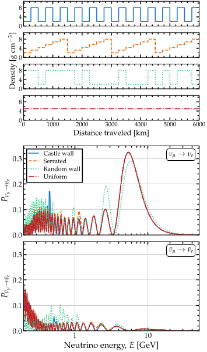

   **Same mean density, different probabilities.** Appearance probability along four piecewise-constant density profiles, for neutrinos (*middle*) and for antineutrinos (*bottom*), computed with Magνs at three flavors. *Top*: the four profiles, each made of twenty-four slabs of 250 km with a mean density of 5 g cm\ :math:`^{-3}`. The castle wall alternates slabs of 2 and 8 g cm\ :math:`^{-3}`; the random wall holds the same slabs in a random order; the serrated profile repeats four times a ramp from 2 to 8 g cm\ :math:`^{-3}` in six steps; the uniform profile is 5 g cm\ :math:`^{-3}` throughout. The slab edges are declared, so each curve is exact: it is the product of the twenty-four slab exponentials. Listing :ref:`Neutrinos and antineutrinos through a castle wall <ex-lst-arrangement>` computes the castle-wall curves. See notebook `#28 <https://github.com/mbustama/Magnus/blob/main/notebooks/28_magnus_paper_figures.ipynb>`__ and :ref:`ex-sec-arrangement` for details.

Figure :ref:`Same mean density, different probabilities <ex-fig-arrangement>` shows the appearance probability along four piecewise-constant density profiles, for neutrinos and for antineutrinos. All four are made of twenty-four slabs of 250 km and have the same mean density, 5 g cm\ :math:`^{-3}`; they differ only in how the density is distributed along the path. Yet the probabilities differ: against the uniform profile, the random wall departs by up to 0.10 in :math:`P_{\nu_\mu \to \nu_e}` and 0.12 in :math:`P_{\bar{\nu}_\mu \to \bar{\nu}_e}`.

The largest feature of the neutrino panel is a broad peak near 5.4 GeV, enhanced by the matter resonance. At these energies, the oscillation length in matter is thousands of kilometers, many slabs long, so the neutrino responds mainly to the mean density: the castle wall, the serrated profile, and the uniform profile peak at the same energy and height, and the random wall only slightly later and lower. Antineutrinos have no such peak: for them the matter potential has the opposite sign, and, in the normal mass ordering used here, there is no resonance.

The castle wall adds a narrow peak at 0.46 GeV, where its :math:`P_{\nu_\mu \to \nu_e} = 0.17`, more than twice that of the uniform profile. Its densities alternate every 250 km, so the profile repeats every 500 km, close to the oscillation lengths in matter at 0.46 GeV, which are 460 to 510 km in slabs of either density. With the period of the profile matched to the oscillation length, the effect of each pair of slabs adds to that of the previous pair instead of averaging away. This is the parametric resonance of :doc:`methodology`  :cite:p:`Akhmedov:1988kd,Krastev:1989ix`, on the castle-wall profile that Ref. :cite:p:`Akhmedov:1998ui` solved in closed form. Antineutrinos show the same peak at 0.52 GeV, a third as tall: the sign of the matter potential changes the oscillation length in matter, and with it the energy at which that length matches the period of the profile.

Listing :ref:`Neutrinos and antineutrinos through a castle wall <ex-lst-arrangement>` computes the castle-wall curves. The two calls differ only in ``nubar``, used here for the first time in a listing: it conjugates the mixing matrix and reverses the sign of the matter potential in one step (:doc:`conventions`). The slab edges are passed through ``t_breakpoints``, so no slab straddles a density jump. The Hamiltonian is constant inside every slab, the Magnus expansion terminates at its first term, and the result is exact: it equals the product of the twenty-four slab exponentials, to round-off. The eight curves of the figure (four profiles, for neutrinos and antineutrinos) take 0.1 s in all, since each call goes to the energy-batched engine of :doc:`engines`, which samples the profile once for all energies.

.. _ex-lst-arrangement:

**Neutrinos and antineutrinos through a castle wall.** The castle-wall curves of Figure :ref:`Same mean density, different probabilities <ex-fig-arrangement>`. The slab edges are passed through ``t_breakpoints``, so that no slab of the expansion straddles a jump; within each slab the Hamiltonian is constant, and the result is the exact product of the slab exponentials. The two calls differ only in ``nubar``. The other three profiles of the figure differ from this one only in the array ``rho``. See :ref:`ex-sec-arrangement` for details.

.. code-block:: python

   import numpy as np
   import magnus.oscprob as oscprob
   import magnus.globaldefs as gd

   osc = gd.load_nufit_params('NuFIT 6.1')
   # 24 slabs of 250 km, alternating 2 and 8 g/cm^3
   n, width = 24, 250.0*gd.UNIT_KM
   rho = np.where(np.arange(n) % 2 == 0, 2.0, 8.0)
   edges = np.arange(n + 1)*width

   def castle_wall(l):
       """The density at position l, in g/cm^3."""
       k = np.searchsorted(edges, l, side='right') - 1
       return rho[np.clip(k, 0, n - 1)]

   E = np.logspace(-0.7, 1.7, 400)*gd.UNIT_GEV
   # The slab edges are declared, so no slab straddles a
   # jump; within each, one term of the expansion is exact
   P, Pbar = [oscprob.osc_prob_matter_std_potential(
       3, castle_wall, E, n*width, osc,
       t_breakpoints=edges[1:-1], nubar=nubar,
       nu_i=gd.NUMU, nu_f=gd.NUE,
       density_matter_is_in_g_per_cm3=True,
       rtol=1.0e-8, atol=1.0e-10)
       for nubar in (False, True)]

.. _ex-sec-biprobability:

Bi-probability plot
-------------------

.. _ex-fig-biprobability:

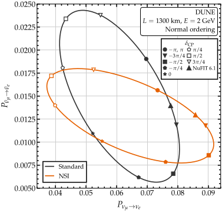

   **Bi-probability plot at the DUNE baseline.** Antineutrino against neutrino appearance probability, as :math:`\delta_{\rm CP}` varies, at 2 GeV, over the 1300-km baseline of DUNE, through matter of constant density 3 g cm\ :math:`^{-3}`. The two curves are for standard oscillations and for oscillations with non-standard interactions (NSI), with the couplings of Figure :ref:`New physics along an Earth chord <ex-fig-bsm>`: :math:`\varepsilon_{ee} = 0.10`, :math:`\varepsilon_{e\mu} = 0.05`, and :math:`\varepsilon_{\mu\tau} = 0.03`. Markers show selected values of :math:`\delta_{\rm CP}` and the NuFIT 6.1 best fit. Listing :ref:`Bi-probability curves at the DUNE baseline <ex-lst-biprobability>` computes the curves. See notebooks `#05 <https://github.com/mbustama/Magnus/blob/main/notebooks/05_magnus_biprobability.ipynb>`__ and `#28 <https://github.com/mbustama/Magnus/blob/main/notebooks/28_magnus_paper_figures.ipynb>`__, and :ref:`ex-sec-biprobability` for details.

Figure :ref:`Bi-probability plot at the DUNE baseline <ex-fig-biprobability>` shows a bi-probability plot  :cite:p:`Minakata:2001qm`: the antineutrino appearance probability against the neutrino one, at one energy and baseline. Each value of :math:`\delta_{\rm CP}` gives one point, so taking the phase through its range traces a closed curve. The figure draws two curves, for standard oscillations and for oscillations with non-standard interactions, and they cross at four points. At each crossing, one measurement of the two probabilities fits both cases; e.g., at :math:`P_{\nu_\mu \to \nu_e} = 0.080` and :math:`P_{\bar{\nu}_\mu \to \bar{\nu}_e} = 0.008`, it fits the standard case with :math:`\delta_{\rm CP} = -0.58\pi` and the non-standard one with :math:`\delta_{\rm CP} = -0.31\pi`. A new interaction can then pass for a shift in the phase. Separating the two takes a second measurement, at another energy or baseline.

Listing :ref:`Bi-probability curves at the DUNE baseline <ex-lst-biprobability>` computes the two curves. Both come from the same loop over :math:`\delta_{\rm CP}`: one calls the standard wrapper, the other the wrapper with non-standard interactions. Any two hypotheses that a measurement might confuse can be compared in the same way, by changing the wrapper or its parameters; notebook `#05 <https://github.com/mbustama/Magnus/blob/main/notebooks/05_magnus_biprobability.ipynb>`__, e.g., compares the two mass orderings.

.. _ex-lst-biprobability:

**Bi-probability curves at the DUNE baseline.** The two curves of Figure :ref:`Bi-probability plot at the DUNE baseline <ex-fig-biprobability>`. The function ``locus`` takes a wrapper once around :math:`\delta_{\rm CP}`, computing the neutrino and the antineutrino probability at each of 181 values. The oscillation parameters are the default set, NuFIT 6.1. No tolerance is passed: the Hamiltonian is constant, so the Magnus expansion ends at its first term, and the result is exact. The curves are drawn twice: first with ``plotting.plot_biprobability``, in the preset style of :ref:`ex-sec-plotting`, then with ``matplotlib`` directly. See notebooks `#05 <https://github.com/mbustama/Magnus/blob/main/notebooks/05_magnus_biprobability.ipynb>`__ and `#28 <https://github.com/mbustama/Magnus/blob/main/notebooks/28_magnus_paper_figures.ipynb>`__, and :ref:`ex-sec-biprobability` for details.

.. code-block:: python

   import numpy as np
   import matplotlib.pyplot as plt
   import magnus.oscprob as oscprob
   import magnus.globaldefs as gd
   import magnus.plotting as plotting

   # DUNE: 2 GeV, 1300 km; a crust-like 3 g/cm^3
   E, L, rho = 2.0*gd.UNIT_GEV, 1300.0*gd.UNIT_KM, 3.0
   kw = dict(nu_i=gd.NUMU, nu_f=gd.NUE,
             density_matter_is_in_g_per_cm3=True)
   eps = dict(eps_ee=0.10, eps_em=0.05, eps_mt=0.03)
   std = oscprob.osc_prob_3nu_matter_constant_density
   nsi = oscprob.osc_prob_3nu_matter_nsi_constant_density

   def locus(wrapper, **couplings):
       """(P_mu e, P_mubar ebar) once around delta_CP."""
       out = []
       for dcp in np.linspace(-np.pi, np.pi, 181):
           P = [wrapper(E, L, rho, nubar=nubar, dCP=dcp,
                        **couplings, **kw)
                for nubar in (False, True)]
           out.append(P)
       return np.array(out)

   P_std = locus(std)
   P_nsi = locus(nsi, **eps)

   # With the shipped plotter
   fig, ax = plotting.plot_biprobability(
       [P_std[:, 0], P_nsi[:, 0]],
       [P_std[:, 1], P_nsi[:, 1]],
       labels=['Standard', 'NSI'])

   # With matplotlib directly
   fig, ax = plt.subplots()
   for P, label in ((P_std, 'Standard'), (P_nsi, 'NSI')):
       ax.plot(P[:, 0], P[:, 1], label=label)
   ax.set_xlabel(r'$P_{\nu_\mu \to \nu_e}$')
   ax.set_ylabel(r'$P_{\bar\nu_\mu \to \bar\nu_e}$')
   ax.legend()

.. _ex-sec-prem:

The Earth
---------

.. _ex-fig-prem:

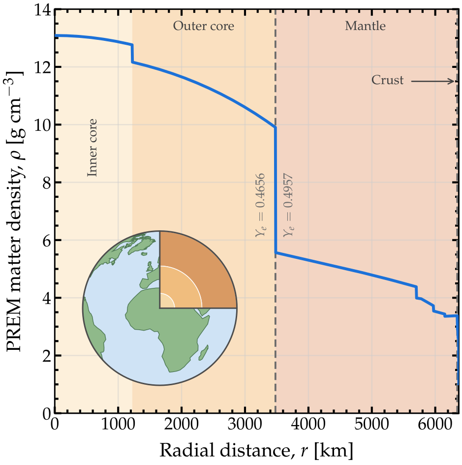

   **The Earth’s density profile.** The PREM density profile  :cite:p:`Dziewonski:1981xy` against radial distance, with a cut-away globe showing the same layers in the same colors. The electron fraction changes at three radii, marked by the dashed lines: from 0.4656 to 0.4957 at the core-mantle boundary, at 3 480 km; to 0.4952 at 6 346.6 km; and to 0.5551 in the ocean, at 6 368 km. The last two are too close together to separate here. Magνs places a slab edge wherever a chord crosses one of the nine boundaries between PREM’s ten shells, so that no slab straddles a density jump. See :ref:`ex-sec-prem` for details.

Figure :ref:`The Earth’s density profile <ex-fig-prem>` shows the density profile Magνs uses for the Earth, the Preliminary Reference Earth Model (PREM)  :cite:p:`Dziewonski:1981xy`, built from seismic data. It treats the Earth as a spherically symmetric body of radius :math:`R_\oplus = 6\,371` km, made of ten concentric shells. The density falls from 13.1 g cm\ :math:`^{-3}` at the center to 1.02 g cm\ :math:`^{-3}` in the ocean at the surface, smoothly inside each shell and in jumps between shells. The largest jump is at the core-mantle boundary, 3 480 km from the center, where the density drops from 9.90 to 5.57 g cm\ :math:`^{-3}`. The electron fraction, :math:`Y_e`, reflects the chemical composition, so it changes with radius too, but only at three of the nine boundaries: Magνs uses 0.4656 in the core, 0.4957 in the mantle, 0.4952 in the crust, and 0.5551 in the ocean. The ``earth`` module stores these as ``Y_E_CORE_PREM``, ``Y_E_MANTLE_PREM``, ``Y_E_CRUST_PREM``, and ``Y_E_OCEAN_PREM``. Every Earth wrapper takes ``electron_fraction_core``, ``electron_fraction_mantle``, ``electron_fraction_crust``, and ``electron_fraction_ocean`` to change them.

The trajectory of a neutrino through the Earth is set by its zenith angle at the detector, :math:`\theta_z`. By default, the detector sits on the surface; :ref:`ex-sec-underground` shows how to place sources and detectors underground. A neutrino arriving from straight below has :math:`\cos\theta_z = -1` and crosses an Earth diameter. One arriving along the horizon has :math:`\cos\theta_z = 0` and does not travel inside the Earth at all. In between, the chord comes closest to the center at a radius of :math:`R_\oplus \sqrt{1 - \cos^2\theta_z}`, so a trajectory closer to horizontal samples only the outer shells.

For a given zenith angle, ``earth`` returns the chord length, i.e., the baseline:

.. code-block:: python

   import magnus.earth as earth

   costhz = -0.9
   L = earth.distance_traveled_inside_earth(
       costhz)                    # 11467.8 km

A chord meets every PREM boundary it reaches twice, once going in and once coming out. For instance, at :math:`\cos\theta_z = -0.9`, the chord comes within 2 777 km of the center, so eight of the nine boundaries lie above that point, and the chord crosses them sixteen times:

.. code-block:: python

   edges = earth.prem_layer_edges_along_chord(
       costhz)
   len(edges)                     # 16

Every ``osc_prob_*_earth`` wrapper computes these positions and passes them on as ``t_breakpoints``, so a slab edge falls on every crossing, at every level of refinement and at any tolerance.

An Earth wrapper takes the trajectory as a zenith angle, ``costhz``, and a baseline, ``L``. From ``costhz``, the wrapper finds the density and the electron fraction at each point of the chord, and the slab edges. ``L`` is in the natural units of Magνs, so the chord length from ``earth``, in kilometers, is converted. At three flavors, for a 10-GeV neutrino, :math:`P_{\nu_\mu \to \nu_e}` is

.. code-block:: python

   import magnus.oscprob as oscprob
   import magnus.globaldefs as gd

   P = oscprob.osc_prob_3nu_earth(
       10.0*gd.UNIT_GEV, costhz=costhz,
       L=L*gd.UNIT_KM)
   P[gd.NUMU][gd.NUE]             # 0.127041

By default, the electron fraction changes from layer to layer, as above. Passing ``electron_fraction`` replaces the four values with a single one for the whole Earth. At 5 GeV along this chord, the two choices differ by 0.08 in :math:`P_{\nu_\mu \to \nu_e}`:

.. code-block:: python

   kw = dict(costhz=costhz, L=L*gd.UNIT_KM,
             nu_i=gd.NUMU, nu_f=gd.NUE)
   E = 5.0*gd.UNIT_GEV

   oscprob.osc_prob_3nu_earth(E, **kw) # 0.1009
   oscprob.osc_prob_3nu_earth(E, **kw, 
       electron_fraction=0.5)          # 0.0207

.. _ex-sec-nu-nubar:

Neutrinos & antineutrinos, 2–5 flavors
~~~~~~~~~~~~~~~~~~~~~~~~~~~~~~~~~~~~~~

.. _ex-fig-nu-nubar:

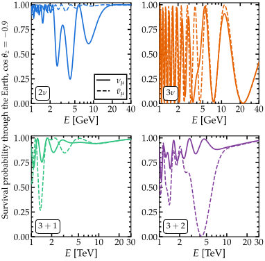

   **Neutrinos and antineutrinos through the Earth.** Survival probability of :math:`\nu_\mu` and :math:`\bar{\nu}_\mu` along a PREM chord at :math:`\cos\theta_z = -0.9`, computed with Magνs. *Top*: two flavors, the :math:`(\nu_e, \nu_\mu)` reduction of the 1–3 sector, and three flavors, both from 1 to 40 GeV. *Bottom*: :math:`3+1` and :math:`3+2` from 1 to 30 TeV, where an eV-scale splitting places its resonance, with :math:`\sin^2\theta_{14} = \sin^2\theta_{24} = 0.10` and :math:`\Delta m^2_{41} = 1` eV\ :math:`^2`, joined in the :math:`3+2` panel by :math:`\sin^2\theta_{15} = \sin^2\theta_{25} = 0.06` and :math:`\Delta m^2_{51} = 1.7` eV\ :math:`^2`. Listing :ref:`Neutrinos and antineutrinos through the Earth <ex-lst-nu-nubar>` computes all four pairs. See notebooks `#15 <https://github.com/mbustama/Magnus/blob/main/notebooks/15_magnus_antineutrinos.ipynb>`__ and `#28 <https://github.com/mbustama/Magnus/blob/main/notebooks/28_magnus_paper_figures.ipynb>`__, and :ref:`ex-sec-nu-nubar` for details.

Figure :ref:`Neutrinos and antineutrinos through the Earth <ex-fig-nu-nubar>` shows :math:`\nu_\mu` and :math:`\bar{\nu}_\mu` survival probabilities along the same chord as before, at :math:`\cos \theta_z = -0.9`, at two to five flavors. Listing :ref:`Neutrinos and antineutrinos through the Earth <ex-lst-nu-nubar>` computes all eight curves. One dictionary carries the chord, the channel, and the tolerances through every call, so the four flavor counts differ only in the wrapper, the energy range, and the sterile mixing that 3+1 and 3+2 add.

.. _ex-lst-nu-nubar:

**Neutrinos and antineutrinos through the Earth.** The :math:`\nu_\mu` and :math:`\bar{\nu}_\mu` curves of Figure :ref:`Neutrinos and antineutrinos through the Earth <ex-fig-nu-nubar>`. ``both_signs`` calls a wrapper twice, with ``nubar=False`` for the neutrino and ``nubar=True`` for the antineutrino. See notebooks `#15 <https://github.com/mbustama/Magnus/blob/main/notebooks/15_magnus_antineutrinos.ipynb>`__ and `#28 <https://github.com/mbustama/Magnus/blob/main/notebooks/28_magnus_paper_figures.ipynb>`__, and :ref:`ex-sec-nu-nubar` for details.

.. code-block:: python

   import numpy as np
   import magnus.oscprob as oscprob
   import magnus.earth as earth
   import magnus.globaldefs as gd

   costhz = -0.9
   L = earth.distance_traveled_inside_earth(costhz) \
    *gd.UNIT_KM
   kw = dict(costhz=costhz, L=L, nu_i=gd.NUMU,
             nu_f=gd.NUMU, rtol=1.0e-8, atol=1.0e-10)

   def both_signs(wrapper, E, **params):
       """Survival probability, for a nu then a nubar."""
       return [wrapper(E, nubar=nubar, **params, **kw)
               for nubar in (False, True)]

   # Two flavors is the (nu_e, nu_mu) reduction of the 1-3
   # sector, so it takes that one angle and splitting by
   # name.  Every wrapper above two flavors defaults to
   # the same NuFIT 6.1 set, so it needs none passed.
   osc = gd.load_nufit_params('NuFIT 6.1')
   E = np.logspace(0, np.log10(40), 260)*gd.UNIT_GEV
   P2, P2bar = both_signs(oscprob.osc_prob_2nu_earth, E,
                          sth=osc['s13'], Dm2=osc['D31'])
   P3, P3bar = both_signs(oscprob.osc_prob_3nu_earth, E)

   # The sterile pairs run three decades higher, where an
   # eV-scale splitting places its resonance
   E_TEV = np.logspace(0, np.log10(30), 200)*gd.UNIT_TEV
   s4 = dict(s14=np.sqrt(0.10), s24=np.sqrt(0.10), s34=0.0,
             D41=1.0)
   s5 = dict(**s4, s15=np.sqrt(0.06), s25=np.sqrt(0.06),
             s35=0.0, D51=1.7)
   P4, P4bar = both_signs(oscprob.osc_prob_4nu_earth,
                          E_TEV, **s4)
   P5, P5bar = both_signs(oscprob.osc_prob_5nu_earth,
                          E_TEV, **s5)

In the top row, the ordinary matter resonance depletes the :math:`\nu_\mu` and leaves the :math:`\bar{\nu}_\mu` almost unaffected, because the matter potential enters their Hamiltonians with opposite signs. The two-flavor panel shows this cleanly. A :math:`(\nu_e, \nu_\mu)` system has no :math:`\theta_{23}` oscillation, so the only structure left is the resonance: the :math:`\nu_\mu` survival probability dips to 0.25 at 4 GeV, while the :math:`\bar{\nu}_\mu` one stays above 0.9. The three-flavor panel restores the :math:`\theta_{23}` oscillation, which is near-maximal. Both curves then swing between zero and one several times, and the resonance is no longer easy to see. It still shows as a difference between the :math:`\nu_\mu` and :math:`\bar{\nu}_\mu` curves, which oscillate out of step: below 5 GeV they differ by up to 0.84, and the difference shrinks as the energy rises, until the two curves coincide above 20 GeV.

In the bottom row, for 3+1 and 3+2, it is the other way around: the resonance depletes the :math:`\bar{\nu}_\mu` and leaves the :math:`\nu_\mu` almost unaffected. A sterile state feels no matter potential at all. The active states all feel the same neutral-current potential, :math:`V_{\rm NC}`, which is common to them and cancels out of their oscillations; the :math:`\nu_e` also feels the charged-current potential, :math:`V_{\rm CC}`, since only it scatters off electrons that way. Measured from the active states, each sterile state therefore carries :math:`-V_{\rm NC}`. A resonance needs a positive potential on the flavor that is mostly the lighter of the two mixing mass states, or a negative one on the flavor that is mostly the heavier. At two and three flavors, :math:`V_{\rm CC}` is positive for neutrinos and acts on the :math:`\nu_e`, which in the normal mass ordering is mostly the lighter state, so the :math:`\nu_\mu` resonates and is depleted. At 3+1 and 3+2, the potential that matters is the one on the sterile state, :math:`-V_{\rm NC}`. For neutrinos, it is positive, but it acts on the heavier state, since :math:`\Delta m^2_{41} > 0` makes the sterile state mostly the heavier one, so there is no resonance. For antineutrinos, the potential changes sign, so the :math:`\bar{\nu}_\mu` resonates instead.

At 3+1, the resonance shows as a dip of the :math:`\bar{\nu}_\mu` survival probability to 0.27 near 1.4 TeV, while the :math:`\nu_\mu` one falls no lower than 0.70. Searches for a sterile state in atmospheric neutrinos look for exactly this dip  :cite:p:`IceCube:2016rnb,IceCube:2020phf`. At 3+2, the second sterile state adds a second dip, at three times the energy, deeper than the first (nearly to zero) and about three times as wide. Above 10 TeV, both curves come back together.

.. _ex-sec-named-baselines:

Probabilities between two locations
~~~~~~~~~~~~~~~~~~~~~~~~~~~~~~~~~~~

.. _ex-fig-named-baselines:

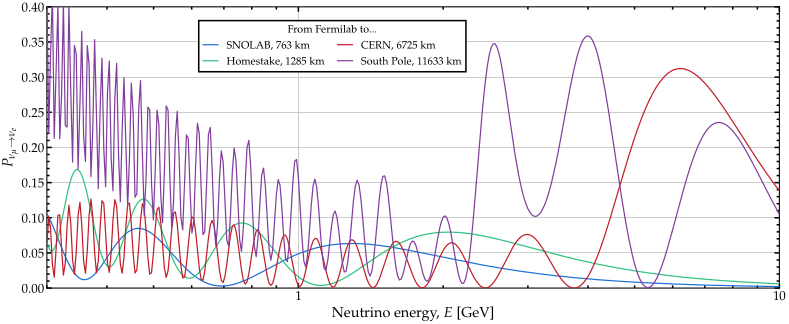

   **Four chords from Fermilab.** Appearance probability :math:`P_{\nu_\mu \to \nu_e}` against energy for a beam sent from Fermilab to four named sites, computed with Magνs along the PREM chord joining each pair of locations, at the layered composition of :ref:`ex-sec-prem`. The legend gives the chord length of each. The two shortest show the pattern of a beam experiment: a first oscillation maximum at 1 to 2 GeV, with faster oscillations below it. The two longest reach the matter resonance, which is why the probability along them is several times larger. Listing :ref:`Baselines between named sites <ex-lst-named>` computes the curves. See notebooks `#04 <https://github.com/mbustama/Magnus/blob/main/notebooks/04_magnus_long_baseline.ipynb>`__ and `#28 <https://github.com/mbustama/Magnus/blob/main/notebooks/28_magnus_paper_figures.ipynb>`__, and :ref:`ex-sec-named-baselines` for details.

.. _ex-tab-sites:

.. table:: **Named locations on the Earth’s surface.** The fifteen locations ``magnus.earth`` carries by name, with the coordinates it stores for each. A name passed as ``loc_ini`` or ``loc_fin`` stands for the pair beside it. Coordinates are in degrees, minutes and seconds, which is the form the module stores and the one ``loc_ini`` and ``loc_fin`` accept; ``earth.dms_to_decimal`` returns the same coordinate in decimal degrees.

   +-----------------+--------------------------------+---------------------------------+
   | Site name       | Latitude                       | Longitude                       |
   +=================+================================+=================================+
   | ``baikal``      | :math:`51^\circ\,45'\,54''`    | :math:`104^\circ\,24'\,54''`    |
   +-----------------+--------------------------------+---------------------------------+
   | ``cern``        | :math:`46^\circ\,14'\,1.8''`   | :math:`6^\circ\,3'\,11.4''`     |
   +-----------------+--------------------------------+---------------------------------+
   | ``desy``        | :math:`53^\circ\,34'\,19.79''` | :math:`9^\circ\,52'\,27.59''`   |
   +-----------------+--------------------------------+---------------------------------+
   | ``ess``         | :math:`55^\circ\,44'\,6''`     | :math:`13^\circ\,15'\,5.04''`   |
   +-----------------+--------------------------------+---------------------------------+
   | ``fermilab``    | :math:`41^\circ\,49'\,55''`    | :math:`-88^\circ\,15'\,26''`    |
   +-----------------+--------------------------------+---------------------------------+
   | ``gran_sasso``  | :math:`42^\circ\,25'\,15.8''`  | :math:`13^\circ\,30'\,58.43''`  |
   +-----------------+--------------------------------+---------------------------------+
   | ``homestake``   | :math:`44^\circ\,21'\,5.76''`  | :math:`-103^\circ\,45'\,4.68''` |
   +-----------------+--------------------------------+---------------------------------+
   | ``kamioka``     | :math:`36^\circ\,25'\,50.05''` | :math:`137^\circ\,18'\,41.15''` |
   +-----------------+--------------------------------+---------------------------------+
   | ``km3net_arca`` | :math:`36^\circ\,16'\,0''`     | :math:`16^\circ\,6'\,0''`       |
   +-----------------+--------------------------------+---------------------------------+
   | ``km3net_orca`` | :math:`42^\circ\,48'\,0''`     | :math:`6^\circ\,2'\,0''`        |
   +-----------------+--------------------------------+---------------------------------+
   | ``north_pole``  | :math:`90^\circ\,0'\,0''`      | :math:`0^\circ\,0'\,0''`        |
   +-----------------+--------------------------------+---------------------------------+
   | ``pyhaasalmi``  | :math:`63^\circ\,39'\,31''`    | :math:`26^\circ\,2'\,28''`      |
   +-----------------+--------------------------------+---------------------------------+
   | ``snolab``      | :math:`46^\circ\,28'\,18''`    | :math:`-81^\circ\,11'\,12''`    |
   +-----------------+--------------------------------+---------------------------------+
   | ``south_pole``  | :math:`-90^\circ\,0'\,0''`     | :math:`0^\circ\,0'\,0''`        |
   +-----------------+--------------------------------+---------------------------------+
   | ``tokai``       | :math:`36^\circ\,27'\,59''`    | :math:`140^\circ\,36'\,24''`    |
   +-----------------+--------------------------------+---------------------------------+

*Locations given as coordinates.—*\ The examples so far set the trajectory by its zenith angle. A long-baseline experiment is described instead by where the beam is made and where it is detected, and the Earth wrappers accept that form too. Passing ``loc_ini`` and ``loc_fin`` replaces ``costhz`` and ``L``: the chord joining the two sites is the baseline, and its direction fixes which PREM shells it crosses. Each location is a (latitude, longitude) pair, each stated in degrees, minutes, and seconds. North and east are positive; south and west are negative, with the sign read from the first non-zero part:

.. code-block:: python

   # (degree, minute, second), north and east
   # positive, south and west negative
   fnal = ((41, 49, 55), (-88, 15, 26))
   hs = ((44, 21, 5.76), (-103, 45, 4.68))
   P = oscprob.osc_prob_3nu_earth(
       2.0*gd.UNIT_GEV, loc_ini=fnal,
       loc_fin=hs, nu_i=gd.NUMU, nu_f=gd.NUE)
   P                              # 0.0794317

Naming two locations fixes the baseline at the chord between them; ``costhz`` or ``L`` passed alongside is ignored. Like any full chord, it reads the same from both ends, since it meets every radius twice, so Magνs evaluates the Hamiltonian over the first half and mirrors the rest. :doc:`performance` quantifies the saving.

*Named sites.—*\ Figure :ref:`Four chords from Fermilab <ex-fig-named-baselines>` shows the appearance probability :math:`P_{\nu_\mu \to \nu_e}` along four chords, each running from Fermilab to a named site, and Listing :ref:`Baselines between named sites <ex-lst-named>` computes them. Table :ref:`ex-tab-sites` lists the fifteen locations the ``earth`` module carries by name. Passing a name is the same as passing the coordinates beside it:

.. code-block:: python

   P = oscprob.osc_prob_3nu_earth(
       2.0*gd.UNIT_GEV,
       loc_ini='fermilab', loc_fin='homestake',
       nu_i=gd.NUMU, nu_f=gd.NUE)
   P                              # 0.0794317

This call and the one with coordinates above return the same probability, 0.0794317; Listing :ref:`Baselines between named sites <ex-lst-named>` uses names. The four chords reach very different depths. The one to SNOLAB stays inside the crust, 11 km down at its deepest. The one to Homestake, the DUNE baseline, reaches 32 km. The one to CERN reaches 960 km, into the lower mantle, and the one to the South Pole reaches 3 770 km, into the outer core.

.. _ex-lst-named:

**Baselines between named sites.** The four curves of Figure :ref:`Four chords from Fermilab <ex-fig-named-baselines>`. Two site names replace ``costhz`` and ``L``: the wrapper takes the chord between them as the baseline and its direction as the trajectory. ``chord_length_inside_earth`` returns the chord length. Site names are in Table :ref:`ex-tab-sites`. See notebooks `#04 <https://github.com/mbustama/Magnus/blob/main/notebooks/04_magnus_long_baseline.ipynb>`__ and `#28 <https://github.com/mbustama/Magnus/blob/main/notebooks/28_magnus_paper_figures.ipynb>`__, and :ref:`ex-sec-named-baselines` for details.

.. code-block:: python

   import numpy as np
   import magnus.oscprob as oscprob
   import magnus.earth as earth
   import magnus.globaldefs as gd

   E = np.logspace(np.log10(0.3), 1.0, 400)*gd.UNIT_GEV
   sites = ('snolab', 'homestake', 'cern', 'south_pole')

   # Two site names replace costhz and L: the chord
   # between them is the baseline
   P = {site: oscprob.osc_prob_3nu_earth(
            E, loc_ini='fermilab', loc_fin=site,
            nu_i=gd.NUMU, nu_f=gd.NUE,
            rtol=1.0e-8, atol=1.0e-10)
        for site in sites}

   # The chord itself, in km, for a legend
   a = earth.loc_coords_dms['fermilab']
   b = earth.loc_coords_dms['homestake']
   L_km = earth.chord_length_inside_earth(
       a['lat'], a['lon'], b['lat'], b['lon'])
   print('%.0f km' % L_km)   # 1285

.. _ex-sec-bsm:

New physics
~~~~~~~~~~~

.. _ex-fig-bsm:

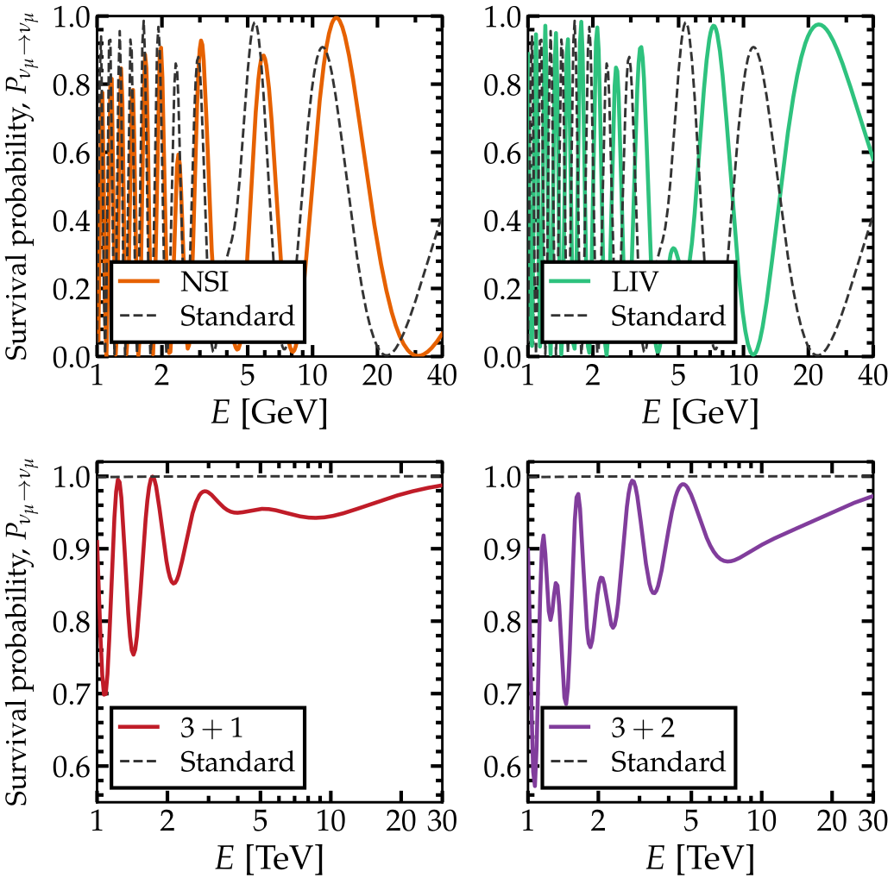

   **New physics along an Earth chord.** Muon-neutrino survival probability :math:`P_{\nu_\mu \to \nu_\mu}` along a PREM chord at :math:`\cos\theta_z = -0.9`, computed with Magνs for four departures from the standard three-flavor case. *Top left*: non-standard interactions with :math:`\varepsilon_{ee} = 0.10`, :math:`\varepsilon_{e\mu} = 0.05` and :math:`\varepsilon_{\mu\tau} = 0.03`. *Top right*: an isotropic, energy-independent Lorentz-violating term, with eigenvalues :math:`b_1 = b_2 = 0` and :math:`b_3 = 5.4 \cdot 10^{-14}` eV, the value that advances the phase by :math:`\pi` over this chord. *Bottom*: the 3+1 and 3+2 systems of Figure :ref:`Neutrinos and antineutrinos through the Earth <ex-fig-nu-nubar>`, where the eV-scale splittings, :math:`\Delta m_{41}^2` and :math:`\Delta m_{51}^2`, place the matter resonance at the TeV scale. Listing :ref:`New physics along an Earth chord <ex-lst-bsm>` computes the curves. See notebooks `#07 <https://github.com/mbustama/Magnus/blob/main/notebooks/07_magnus_bsm_sterile_nu.ipynb>`__, `#08 <https://github.com/mbustama/Magnus/blob/main/notebooks/08_magnus_bsm_nsi.ipynb>`__, `#09 <https://github.com/mbustama/Magnus/blob/main/notebooks/09_magnus_bsm_liv.ipynb>`__, and `#28 <https://github.com/mbustama/Magnus/blob/main/notebooks/28_magnus_paper_figures.ipynb>`__, and :ref:`ex-sec-bsm` for details.

.. _ex-lst-bsm:

**New physics along an Earth chord.** The five scenarios of Figure :ref:`New physics along an Earth chord <ex-fig-bsm>`, in six calls: the standard case is computed twice, once for each energy range. Every call shares the chord, the channel and the tolerances, differing only in the wrapper and in the parameters of the extra term. See notebooks `#07 <https://github.com/mbustama/Magnus/blob/main/notebooks/07_magnus_bsm_sterile_nu.ipynb>`__, `#08 <https://github.com/mbustama/Magnus/blob/main/notebooks/08_magnus_bsm_nsi.ipynb>`__, `#09 <https://github.com/mbustama/Magnus/blob/main/notebooks/09_magnus_bsm_liv.ipynb>`__, and `#28 <https://github.com/mbustama/Magnus/blob/main/notebooks/28_magnus_paper_figures.ipynb>`__, and :ref:`ex-sec-bsm` for details.

.. code-block:: python

   import numpy as np
   import magnus.oscprob as oscprob
   import magnus.earth as earth
   import magnus.globaldefs as gd

   costhz = -0.9
   L = earth.distance_traveled_inside_earth(costhz) \
    *gd.UNIT_KM
   kw = dict(costhz=costhz, L=L, nu_i=gd.NUMU,
             nu_f=gd.NUMU, rtol=1.0e-8, atol=1.0e-10)
   E = np.logspace(0, np.log10(40), 260)*gd.UNIT_GEV
   # Three decades up is where an eV-scale splitting
   # places its matter resonance
   E_TEV = np.logspace(0, np.log10(30), 200)*gd.UNIT_TEV

   eps = dict(eps_ee=0.10, eps_em=0.05, eps_mt=0.03)
   liv = dict(b1=0.0, b2=0.0, b3=np.pi/L, Lambda=1.0,
              sxi12=0.0, sxi23=1.0/np.sqrt(2.0),
              sxi13=0.0, dxiCP=0.0, n_liv=0)
   s4 = dict(s14=np.sqrt(0.10), s24=np.sqrt(0.10),
             s34=0.0, D41=1.0)
   s5 = dict(**s4, s15=np.sqrt(0.06),
             s25=np.sqrt(0.06), s35=0.0, D51=1.7)

   # The same call each time, a different extra term
   P_std = oscprob.osc_prob_3nu_earth(E, **kw)
   P_nsi = oscprob.osc_prob_3nu_earth_nsi(E, **eps, **kw)
   P_liv = oscprob.osc_prob_3nu_earth_liv(E, **liv, **kw)
   P_std_tev = oscprob.osc_prob_3nu_earth(E_TEV, **kw)
   P_3p1 = oscprob.osc_prob_4nu_earth(E_TEV, **s4, **kw)
   P_3p2 = oscprob.osc_prob_5nu_earth(E_TEV, **s5, **kw)

Figure :ref:`New physics along an Earth chord <ex-fig-bsm>` shows four departures from the standard three-flavor case along one deep Earth chord: non-standard interactions  :cite:p:`Farzan:2017xzy`, Lorentz-invariance violation  :cite:p:`Kostelecky:2003xn,Kostelecky:2011gq`, one sterile state  :cite:p:`Gariazzo:2015rra,Dentler:2018sju`, and two sterile states  :cite:p:`Sorel:2003hf`. Each adds a different term to the Hamiltonian. As Listing :ref:`New physics along an Earth chord <ex-lst-bsm>` shows, the calls differ only in the wrapper and in the parameters of the new term.

Figure :ref:`A scan of the sterile-state parameters <ex-fig-sterile-scan>` scans the sterile parameters themselves. The wrapper takes :math:`\Delta m^2_{41}` and :math:`\theta_{14}` like any other argument, so the map is a double loop over the two, and Listing :ref:`A scan of the sterile-state parameters <ex-lst-sterile-scan>` computes all of it. The map shows the reversal of :ref:`ex-sec-nu-nubar` across parameter space. The :math:`\nu_\mu` survival probability changes by at most 0.27. The :math:`\bar{\nu}_\mu` panels carry a resonance band near :math:`\Delta m^2_{41} = 1` eV\ :math:`^2` that removes up to 0.87 of the flux. The band is strongest at small :math:`\theta_{14}` and fades as :math:`\sin^2\theta_{14}` approaches 1, because the :math:`\nu_\mu` reaches the sterile state through :math:`|U_{\mu 4}|^2 = \cos^2\theta_{14} \sin^2\theta_{24}`, with :math:`\theta_{24}` fixed.

.. _ex-fig-sterile-scan:

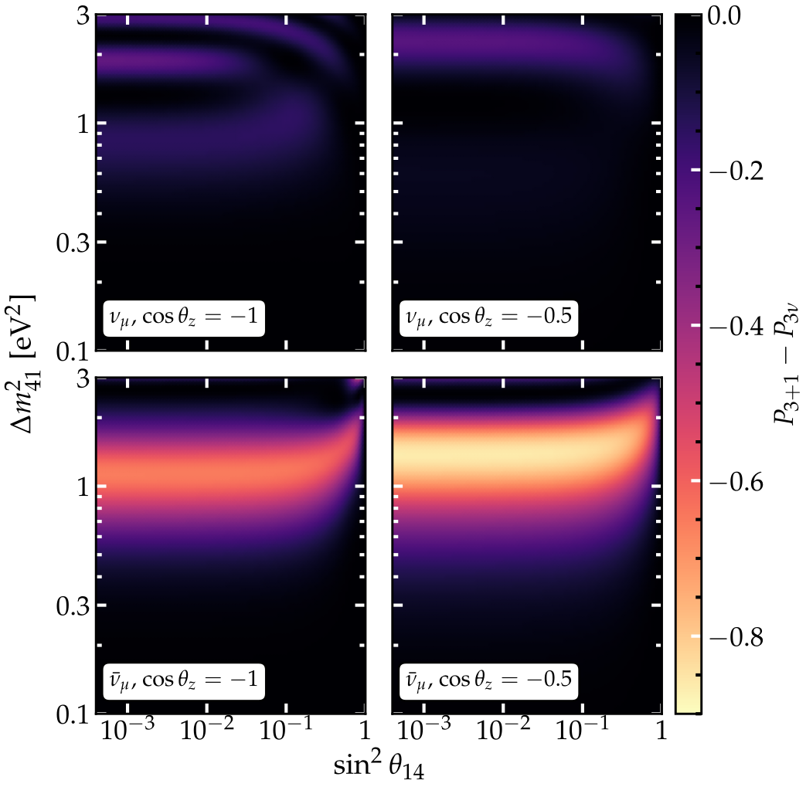

   **A scan of the sterile-state parameters.** Change in the muon-neutrino survival probability when one sterile state is added, :math:`P_{3+1} - P_{3\nu}`, as a function of :math:`\Delta m_{41}^2` and :math:`\sin^2 \theta_{14}`, at a fixed energy of 5 TeV. *Top row*: :math:`\nu_\mu`. *Bottom row*: :math:`\bar{\nu}_\mu`. *Left column*: a core-crossing chord, :math:`\cos\theta_z = -1`. *Right column*: a shallower one, :math:`\cos\theta_z = -0.5`. The other sterile parameters are held at :math:`\sin^2\theta_{24} = 0.10` and :math:`\theta_{34} = 0`. Each panel holds :math:`80 \times 80` probabilities. See notebooks `#07 <https://github.com/mbustama/Magnus/blob/main/notebooks/07_magnus_bsm_sterile_nu.ipynb>`__ and `#28 <https://github.com/mbustama/Magnus/blob/main/notebooks/28_magnus_paper_figures.ipynb>`__, and :ref:`ex-sec-bsm` for details.

.. _ex-lst-sterile-scan:

**A scan of the sterile-state parameters.** The four panels of Figure :ref:`A scan of the sterile-state parameters <ex-fig-sterile-scan>`, one call of ``panel`` each, for one chord (``costhz``) and one sign (``nubar``). In each, the three-flavor probability is computed once and subtracted from the 3+1 one at every point of the grid. ``S14`` holds :math:`\sin\theta_{14}`; the figure plots its square. See notebooks `#07 <https://github.com/mbustama/Magnus/blob/main/notebooks/07_magnus_bsm_sterile_nu.ipynb>`__ and `#28 <https://github.com/mbustama/Magnus/blob/main/notebooks/28_magnus_paper_figures.ipynb>`__, and :ref:`ex-sec-bsm` for details.

.. code-block:: python

   import numpy as np
   import magnus.oscprob as oscprob
   import magnus.earth as earth
   import magnus.globaldefs as gd

   E = 5.0*gd.UNIT_TEV
   D41 = np.logspace(np.log10(0.1), np.log10(3.0), 80)
   S14 = np.logspace(np.log10(0.02), 0.0, 80)
   s24 = np.sqrt(0.10)

   def panel(costhz, nubar):
       """One chord and one sign, over the whole plane."""
       L = earth.distance_traveled_inside_earth(costhz) \
        *gd.UNIT_KM
       kw = dict(costhz=costhz, L=L, nu_i=gd.NUMU,
                 nu_f=gd.NUMU, nubar=nubar,
                 rtol=1.0e-8, atol=1.0e-10)
       # Standard 3nu oscillations
       std = oscprob.osc_prob_3nu_earth(E, **kw)
       return np.array([[oscprob.osc_prob_4nu_earth(
           E, s14=s, s24=s24, s34=0.0, D41=d, **kw)
           - std for s in S14] for d in D41])

   # Change between 3nu and 3+1 survival probability
   dP = {(cz, nb): panel(cz, nb)
         for cz in (-1.0, -0.5) for nb in (False, True)}

.. _ex-sec-earth-oscillograms:

Earth oscillograms
~~~~~~~~~~~~~~~~~~

.. _ex-fig-oscillogram:

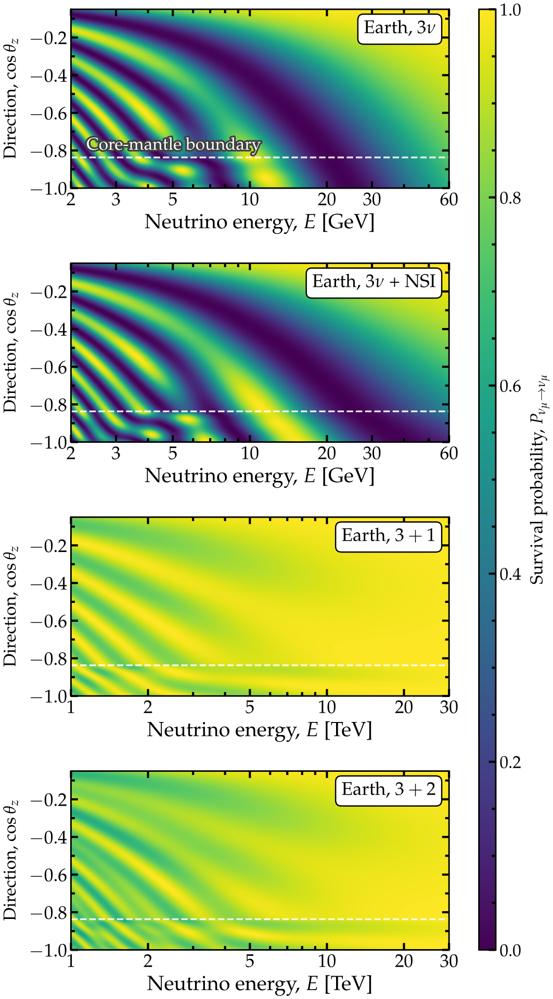

   **Oscillograms through the Earth.** Oscillogram: the :math:`\nu_\mu` survival probability, :math:`P_{\nu_\mu \to \nu_\mu}`, over neutrino energy and arrival direction, computed with Magνs along the PREM profile  :cite:p:`Dziewonski:1981xy`. *Top to bottom*: standard three flavors; three flavors with the non-standard couplings of Figure :ref:`New physics along an Earth chord <ex-fig-bsm>`; 3+1 and 3+2 with the sterile parameters of Figure :ref:`Neutrinos and antineutrinos through the Earth <ex-fig-nu-nubar>`. The dashed line in each panel marks :math:`\cos\theta_z = -0.838`, the direction whose chord just grazes the outer core; steeper trajectories enter the core, where the density nearly doubles. Listing :ref:`Oscillograms through the Earth <ex-lst-oscillogram>` computes the oscillograms. See notebooks `#06 <https://github.com/mbustama/Magnus/blob/main/notebooks/06_magnus_oscillograms.ipynb>`__ and `#28 <https://github.com/mbustama/Magnus/blob/main/notebooks/28_magnus_paper_figures.ipynb>`__, and :ref:`ex-sec-earth-oscillograms` for details.

Figure :ref:`Oscillograms through the Earth <ex-fig-oscillogram>` shows oscillograms of :math:`\nu_\mu` survival through the Earth, i.e., :math:`P_{\nu_\mu \to \nu_\mu}` across energy and arrival direction, for the standard case, with non-standard interactions, and with one and two sterile states. Listing :ref:`Oscillograms through the Earth <ex-lst-oscillogram>` computes them.

.. _ex-lst-oscillogram:

**Oscillograms through the Earth.** The four panels of Figure :ref:`Oscillograms through the Earth <ex-fig-oscillogram>`. One wrapper call per arrival direction returns a whole energy sweep, with the chord length taken from the direction alone. Only the wrapper and its extra parameters change between panels. Each panel is then drawn twice: first by ``plotting.plot_oscillogram``, then by ``matplotlib`` directly. Both put :math:`\cos\theta_z` on the horizontal axis; Figure :ref:`Oscillograms through the Earth <ex-fig-oscillogram>` puts it on the vertical one. See :ref:`ex-sec-earth-oscillograms` for details.

.. code-block:: python

   import numpy as np
   import matplotlib.pyplot as plt
   import magnus.oscprob as oscprob
   import magnus.earth as earth
   import magnus.globaldefs as gd
   import magnus.plotting as plotting

   chord = earth.distance_traveled_inside_earth
   CZ = np.linspace(-1.0, -0.05, 170)
   E_GEV = np.logspace(np.log10(2.0),
                       np.log10(60.0), 200)*gd.UNIT_GEV
   E_TEV = np.logspace(0.0,
                       np.log10(30.0), 200)*gd.UNIT_TEV
   kw = dict(nu_i=gd.NUMU, nu_f=gd.NUMU,
             rtol=1.0e-8, atol=1.0e-10)

   eps = dict(eps_ee=0.10, eps_em=0.05, eps_mt=0.03)
   s4 = dict(s14=np.sqrt(0.10), s24=np.sqrt(0.10),
             s34=0.0, D41=1.0)
   s5 = dict(**s4, s15=np.sqrt(0.06),
             s25=np.sqrt(0.06), s35=0.0, D51=1.7)

   def oscillogram(wrapper, E, **params):
       """One panel: an energy sweep per direction."""
       return np.array([wrapper(E, costhz=c,
           L=chord(c)*gd.UNIT_KM, **params, **kw)
           for c in CZ]).T

   PANELS = [(oscprob.osc_prob_3nu_earth, E_GEV, {}),
             (oscprob.osc_prob_3nu_earth_nsi, E_GEV, eps),
             (oscprob.osc_prob_4nu_earth, E_TEV, s4),
             (oscprob.osc_prob_5nu_earth, E_TEV, s5)]
   P = [oscillogram(w, E, **p) for w, E, p in PANELS]

   # With the shipped plotter, one call per panel
   for (_, E, _), grid in zip(PANELS, P):
       fig, ax = plotting.plot_oscillogram(
           CZ, np.log10(E/gd.UNIT_GEV), grid,
           nu_i=gd.NUMU, nu_f=gd.NUMU)

   # Or with matplotlib directly, one axes per panel
   for (_, E, _), grid in zip(PANELS, P):
       fig, ax = plt.subplots()
       im = ax.pcolormesh(CZ, np.log10(E/gd.UNIT_GEV),
                          grid, shading='gouraud')
       ax.set_xlabel(r'$\cos\theta_z$')
       ax.set_ylabel(r'$\log_{10}(E/{\rm GeV})$')
       fig.colorbar(im, ax=ax,
                    label=r'$P_{\nu_\mu \to \nu_\mu}$')

Figure :ref:`Neutrinos and antineutrinos through the Earth <ex-fig-nu-nubar>` and :ref:`New physics along an Earth chord <ex-fig-bsm>` hold the arrival direction fixed; an oscillogram varies it. The direction sets two things: the length of the chord and the densities along it. From :math:`\cos\theta_z = -0.05` to :math:`-1`, the chord grows twentyfold, from 640 to 12 742 km. The densities along it grow far less, until the chord reaches the core-mantle boundary, at :math:`\cos\theta_z = -0.838`.

The bands in each panel come from two effects, which differ in their tilt. Oscillation bands follow a fixed value of :math:`L/E`: lower in a panel, the chord is longer, so the same band lies at a higher energy, and the band runs diagonally. Resonance bands follow the density instead, which changes little across the mantle, so they run nearly vertically. Below the core-mantle boundary, the chord crosses mantle, core, and mantle again, and the density nearly doubles in the core: a short version of the castle-wall profile of :ref:`ex-sec-arrangement`. Where the length of each crossing matches the oscillation length in matter, the effects of the crossings add up, which gives this strip a pattern of its own.

The two sterile panels in Figure :ref:`Oscillograms through the Earth <ex-fig-oscillogram>` show the :math:`\nu_\mu`, which has no sterile resonance: that resonance is in the :math:`\bar{\nu}_\mu` channel (:ref:`ex-sec-nu-nubar`). Therefore, all the bands in these panels are oscillation bands. For the :math:`\nu_\mu`, matter suppresses the mixing with the sterile state, more so at higher energy, since the vacuum term, :math:`\Delta m^2_{41}/2E`, falls with energy while the potential does not.

.. _ex-sec-underground:

Underground sources and detectors
~~~~~~~~~~~~~~~~~~~~~~~~~~~~~~~~~

By default, both ends of an Earth trajectory sit on the surface. Detectors, and some sources, sit underground, at depths from 100 m to 2–3 km. Passing ``source_depth`` or ``detector_depth`` to a wrapper puts either end underground. The zenith angle keeps its meaning, since it is measured at the detector. The depth then fixes the baseline: with a nonzero depth, passing ``L``, ``loc_ini``, or ``loc_fin`` raises an error. A buried end also breaks the symmetry of the chord, which no longer reads the same from both ends, so Magνs does not mirror it (:doc:`performance`).

How much burying the detector changes the probability depends on the zenith angle. Along a long chord, at :math:`\cos \theta_z = -0.8`, the last 2 km are a small part of the path, and the probability barely changes:

.. code-block:: python

   E, costhz = 10.0*gd.UNIT_GEV, -0.8
   kw = dict(nu_i=gd.NUMU, nu_f=gd.NUMU)

   # On the surface, the baseline is given
   L = earth.distance_traveled_inside_earth(
       costhz)*gd.UNIT_KM
   oscprob.osc_prob_3nu_earth(E, costhz=costhz,
       L=L, **kw)
                                  # 0.905580

   # 2 km down, the depth fixes the baseline
   oscprob.osc_prob_3nu_earth(
       E, costhz=costhz,
       detector_depth=2.0*gd.UNIT_KM, **kw)
                                  # 0.905595

The two differ by :math:`2 \cdot 10^{-5}`. In contrast, a neutrino arriving horizontally, at :math:`\cos \theta_z = 0`, does not cross the Earth to reach a detector on the surface, but it does to reach one 2 km down:

.. code-block:: python

   E, costhz = 10.0*gd.UNIT_GEV, 0.0
   kw = dict(nu_i=gd.NUMU, nu_f=gd.NUMU)

   # Horizontal: no path at all at the surface
   L = earth.distance_traveled_inside_earth(
       costhz)*gd.UNIT_KM
   oscprob.osc_prob_3nu_earth(
       E, costhz=costhz, L=L, **kw)
                                  # 1.000000

   # 2 km down it crosses 160 km of rock
   oscprob.osc_prob_3nu_earth(
       E, costhz=costhz,
       detector_depth=2.0*gd.UNIT_KM, **kw)
                                  # 0.997560

Here the probabilities differ by :math:`2 \cdot 10^{-3}`. A nonzero ``source_depth`` acts in the same way.

PREM puts 3 km of ocean at the top of the Earth. That describes KM3NeT in the Mediterranean and Baikal-GVD in a lake, but not IceCube, under ice, or SNOLAB and Super-Kamiokande, under rock. Two keywords replace that medium: ``density_matter_ocean`` sets the density of the ocean shell, and ``electron_fraction_ocean`` its electron fraction. How much the replacement matters depends on how much of the path lies within 3 km of the surface. A steep trajectory crosses the shell and leaves it behind. A near-horizontal one can stay inside it for its whole length. There, ice instead of water lowers the probability by 0.1%, and rock raises it by 2%. Ice keeps the electron fraction of water, so only its density changes; rock also takes the electron fraction of the crust, 0.4952:

.. code-block:: python

   # PREM puts an ocean in the outer 3 km
   L = earth.distance_traveled_inside_earth(
       -0.02)*gd.UNIT_KM
   kw = dict(costhz=-0.02, L=L, nu_i=gd.NUMU,
             nu_f=gd.NUE)
   E = 1.0*gd.UNIT_GEV
   oscprob.osc_prob_3nu_earth(E, **kw)
                                  # 0.020928
   # Under ice, as at IceCube
   oscprob.osc_prob_3nu_earth(E, **kw,
       density_matter_ocean=0.92) # 0.020898
   # Under rock, as at SNOLAB
   oscprob.osc_prob_3nu_earth(E, **kw,
       density_matter_ocean=2.65,
       electron_fraction_ocean=0.4952)
                                  # 0.021319

.. _ex-sec-custom-earth:

Using a custom Earth density profile
~~~~~~~~~~~~~~~~~~~~~~~~~~~~~~~~~~~~

The Earth wrappers take their density from PREM, and only the density of the outermost shell can be changed by keyword (:ref:`ex-sec-underground`). A profile of one’s own takes a call one layer down, to the scenario function ``osc_prob_matter_std_potential``, which the wrappers themselves call. The profile is passed as a function of position, and the positions where its density jumps as slab edges.

Listing :ref:`A custom Earth profile <ex-lst-coarse-earth>` replaces PREM’s ten shells with four wider ones: the inner core, the outer core, the mantle, and the crust with the ocean. Each holds a constant density, the mass-weighted mean of the PREM region it replaces, and PREM’s electron fraction for that region (for the outermost shell, the crust’s). Along the chord at :math:`\cos \theta_z = -0.9`, at 10 GeV, the four-shell Earth gives :math:`P_{\nu_\mu \to \nu_\mu} = 0.780`, against 0.801 for PREM. The electron fraction matters as much: with :math:`Y_e = 0.5` in every shell, the four-shell Earth gives 0.811.

The four-shell Earth has three boundaries, at radii of 1 221.5, 3 480, and 6 346.6 km. The chord at :math:`\cos \theta_z = -0.9` crosses only the outer two, each twice, which makes four slab edges, against sixteen for PREM. The listing passes those four positions as ``t_breakpoints``, as the Earth wrappers do for PREM.

.. _ex-lst-coarse-earth:

**A custom Earth profile.** A four-shell Earth in place of PREM. The profile is a function of position that returns an electron density; naming the radii where it jumps keeps every slab inside one shell. See :ref:`ex-sec-custom-earth` for details.

.. code-block:: python

   import numpy as np
   import magnus.oscprob as oscprob
   import magnus.earth as earth
   import magnus.matter as matter
   import magnus.globaldefs as gd

   # Four shells for PREM's ten, each at the mass-weighted
   # mean density of the region it replaces
   EDGES = [1221.5, 3480.0, 6346.6]       # km
   RHO = [12.894, 10.901, 4.476, 2.520]   # g/cm^3
   YE = [0.4656, 0.4656, 0.4957, 0.4952]  # PREM's own

   costhz = -0.9
   r_of = earth.earth_radial_distance_from_depth
   L = earth.distance_traveled_inside_earth(costhz) \
    *gd.UNIT_KM
   osc = gd.load_nufit_params('NuFIT 6.1')

   def ne_coarse(l):
       """Electron density [eV^3] at position l."""
       r = r_of(costhz, l/gd.UNIT_KM)
       i = int(np.searchsorted(EDGES, r))
       return matter.num_density_e_func(
           r, lambda _: RHO[i], electron_fraction=YE[i],
           ratio_number_neutrons_to_protons=
               (1.0 - YE[i])/YE[i],
           density_matter_is_in_g_per_cm3=True)

   # Those four edges are PREM boundaries, so their
   # crossings come straight out of the helper
   cross = earth.prem_layer_edges_along_chord(costhz)
   keep = cross[np.isclose(
       r_of(costhz, cross)[:, None], EDGES).any(axis=1)]

   E = 10.0*gd.UNIT_GEV
   kw = dict(nu_i=gd.NUMU, nu_f=gd.NUMU,
             rtol=1.0e-8, atol=1.0e-10)
   P = oscprob.osc_prob_matter_std_potential(
       3, ne_coarse, E, L, osc_params=osc, L0=0.0,
       t_breakpoints=keep*gd.UNIT_KM,
       density_is_of_number_of_electrons=True, **kw)
   P                               # 0.780446

.. _ex-sec-which-engine:

Strategy report after a call
----------------------------

Every wrapper and scenario function takes a dictionary as ``strategy_info`` and fills it in place with a report on how the probability was computed. Three functions do not take it, because they evaluate a closed-form expression and use no engine: ``osc_prob_2nu_vacuum_std``, ``osc_prob_3nu_vacuum_std``, and ``osc_prob_2nu_matter_std``. Nor does the direct call ``osc_prob``, which reports on its refinement ladder through ``convergence_info`` instead (:doc:`methodology`).

The report has seven entries: ``'engine'``, the engine that answered, named as in :doc:`engines`; ``'family'``, the group of engines that share its method, and so can err in the same way (:doc:`engines`); ``'certified'``, whether the hybrid engine certified its answer, or ``None`` if another engine answered; ``'declined'``, the engines that attempted the request and gave up, each with its reason; ``'trace'``, every engine tried, in order, with its details; ``'hidden_feature'``, the result of a scan of the profile for a feature narrower than the grids on which the engines sample it, or ``None`` if the call declares where the profile changes, as on the Earth, or if the density is constant; and ``'sampling'``, described below. For instance,

.. code-block:: python

   L = earth.distance_traveled_inside_earth(
       -0.9)*gd.UNIT_KM
   info = {}
   P = oscprob.osc_prob_3nu_earth(
       10.0*gd.UNIT_GEV, costhz=-0.9, L=L,
       nu_i=gd.NUMU, nu_f=gd.NUMU,
       strategy_info=info)
   sorted(info)
   # ['certified', 'declined', 'engine',
   #  'family', 'hidden_feature', 'sampling',
   #  'trace']
   info['engine']                 # 'magnus'
   info['family']          # 'magnus-ladder'

This single energy went to the general Magnus ladder.

The ``'sampling'`` entry shows how many points a scan along the trajectory needs to resolve the oscillation. It gives the shortest oscillation length along the trajectory, how many oscillations of that length fit in the trajectory, and how many points a scan needs to sample them twice per cycle, as the Nyquist criterion requires. A scan with fewer points is aliased: each value is correct, but a curve drawn through them is not the probability. For this call,

.. code-block:: python

   s = info['sampling']
   s['oscillation_length']/gd.UNIT_KM
                                  # 3253.4
   s['cycles_over_trajectory']    # 3.5
   s['nyquist_points']            # 9

On the same chord, an array of energies, a phase average, and a constant density each go to a different engine:

.. code-block:: python

   kw = dict(costhz=-0.9, L=L, nu_i=gd.NUMU,
             nu_f=gd.NUMU, strategy_info=info)
   E = np.linspace(5.0, 15.0, 3)*gd.UNIT_GEV
   oscprob.osc_prob_3nu_earth(E, **kw)
   info['engine']              # 'separable'

   oscprob.osc_prob_3nu_earth(
       10.0*gd.UNIT_GEV, **kw, average=True)
   info['engine']                # 'average'

   oscprob.osc_prob_3nu_matter_constant_density(
       10.0*gd.UNIT_GEV, L, 4.0,
       density_matter_is_in_g_per_cm3=True,
       nu_i=gd.NUMU, nu_f=gd.NUMU,
       strategy_info=info)
   info['engine']               # 'constant'

When an engine declines a request, ``'declined'`` gives the reason. In this example, along an Earth diameter, the density falls as :math:`3\,e^{-l/(50~{\rm m})}` g cm\ :math:`^{-3}`, with :math:`l` the distance traveled. That is narrower than the spacing of the grid on which the hybrid engine probes the profile, so the hybrid engine declines, with a warning, and the interaction-picture engine answers:

.. code-block:: python

   info = {}
   P = oscprob.osc_prob_2nu_matter_exp_density(
       5.0*gd.UNIT_MEV, 12742.0*gd.UNIT_KM,
       0.0, 3.0, 0.05*gd.UNIT_KM, sth=0.5,
       Dm2=2.5e-3,
       density_matter_is_in_g_per_cm3=True,
       nu_i=0, nu_f=1, strategy_info=info)
   info['declined']
   # [('hybrid', 'the profile is not
   #   resolved at the probe scale')]
   info['engine']                # 'ip_exp'

With a fall-off length of 50 km instead of 50 m, the hybrid engine resolves the profile and certifies its own answer:

.. code-block:: python

   # 50.0*gd.UNIT_KM, not 0.05*gd.UNIT_KM
   info['engine']                # 'hybrid'
   info['certified']             # True
   info['declined']              # []

.. _ex-sec-sun:

The Sun
-------

.. _ex-fig-solar:

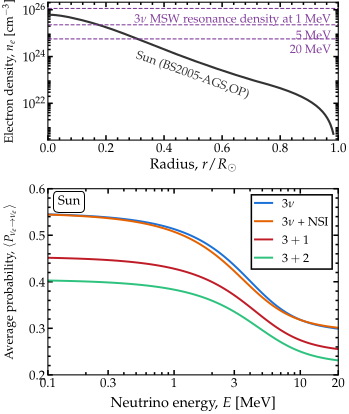

   **The averaged solar survival probability.** *Top*: the electron number density along a radial ray of the BS2005-AGS,OP solar model  :cite:p:`Bahcall:2004pz`. The marked densities are those of the MSW resonance, :math:`\sqrt{2} G_F n_e = \Delta m^2_{21}\cos 2\theta_{12}/2E`, at three energies: a 20-MeV neutrino meets it a third of the way out; a 1-MeV neutrino never does. *Bottom*: the phase-averaged survival probability, the equation in :doc:`averaged_probability`, computed with ``average=True`` for four Hamiltonians on the same profile. The two sterile cases lie lowest, :math:`3+2` below :math:`3+1`, because each extra state takes a share of the flux that does not return. Listing :ref:`Averaged solar probabilities <ex-lst-sun>` generates the data. See notebooks `#10 <https://github.com/mbustama/Magnus/blob/main/notebooks/10_magnus_averaged_probability.ipynb>`__, `#13 <https://github.com/mbustama/Magnus/blob/main/notebooks/13_magnus_tabulated_solar_model.ipynb>`__, and `#28 <https://github.com/mbustama/Magnus/blob/main/notebooks/28_magnus_paper_figures.ipynb>`__, and :ref:`ex-sec-sun` for details.

Figure :ref:`The averaged solar survival probability <ex-fig-solar>` shows the electron density of the BS2005-AGS,OP solar model  :cite:p:`Bahcall:2004pz`, and the averaged survival probability it produces for four Hamiltonians. Along a radial ray, the density falls smoothly by five orders of magnitude, with no discontinuity. On the way out, a 5-MeV neutrino accumulates a phase of :math:`3 \cdot 10^4` radians between the first two eigenstates, and of :math:`9 \cdot 10^5` radians between the first and the third. So the survival probability at the surface runs through a full oscillation each time the production point moves by about 160 km, or the energy by a few parts in :math:`10^4`. Yet, neutrinos are produced over tens of thousands of kilometers, and no detector resolves energy that finely. Therefore, what a solar experiment measures is the phase-averaged probability of :doc:`averaged_probability`.

The energy dependence of the probability in Figure :ref:`The averaged solar survival probability <ex-fig-solar>` is set by where the resonance density sits relative to the density at production. The resonance density falls with energy as :math:`1/E`. At 20 MeV, the profile falls to the resonance density a third of the way out. A neutrino born at the center, at ten times that density, is mostly the matter eigenstate that turns into :math:`\nu_2` on the way out, so it leaves the Sun as :math:`\nu_2`, and its average is :math:`\lvert \mathbb{U}_{e2} \rvert^2 \approx 0.30`. At 1 MeV, the resonance density lies above the central density, so the neutrino is born below it and never crosses it. Matter then only lowers the average a little, to 0.51, from the vacuum value, 0.55, which the curve reaches at 0.1 MeV.

The probability in Figure :ref:`The averaged solar survival probability <ex-fig-solar>` shows the passage between the two regimes, over an energy range that spans the spectrum of neutrinos from :math:`^8`\ B decay. Along the ray, the density changes slowly compared with the local oscillation length, so a neutrino stays in the eigenstate it was born in: :math:`P^{\rm cross}` in the equation in :doc:`averaged_probability` is the identity, at every energy. What remains are the two eigenbases at the ends of the ray. The one at the surface is the vacuum mixing matrix, the same for any profile. The one at the other end is set by the density where the neutrino is born.

Listing :ref:`Averaged solar probabilities <ex-lst-sun>` computes the four curves of Figure :ref:`The averaged solar survival probability <ex-fig-solar>`. The BS2005-AGS,OP table is one of the twelve standard solar models that ship with Magνs (:ref:`ex-sec-solar-model-comparison`); every Sun wrapper takes it by name through ``density_profile``. Without that keyword, a wrapper uses its default, ``'exp'``, an exponential fit to the solar density (:ref:`ex-sec-solar-model-comparison`). The wrapper interpolates the electron number density log-linearly between the tabulated radii. For the sterile states, it also reads the neutron-to-proton ratio from the table, :math:`n_n/n_p = (1 - X)/(1 + X)` at each radius, with :math:`X` the hydrogen mass fraction.

The only difference from an ordinary probability call is ``average=True`` (:ref:`ex-sec-average-keyword`). With it, Magνs does not propagate the phase along the ray. It searches the ray for crossings that are not adiabatic, which it would bridge with the Magnus patch of :doc:`adiabatic_strategy`, and combines the eigenbases at the two ends. On the Sun, it finds no such crossing for any of the four Hamiltonians, so the result depends only on those two eigenbases.The neutrino starts in a flavor state, the default of ``average_initial_state``, so the result is the equation in :doc:`averaged_probability`. Its interference terms carry the phases above, which damp them to nothing, so the result equals the equation in :doc:`averaged_probability` to within :math:`5 \cdot 10^{-15}`.

In Listing :ref:`Averaged solar probabilities <ex-lst-sun>`, only the wrapper changes between the four probability calls, and with it the Hamiltonian. The cost of a call follows the number of pairs of levels that the engine tests for adiabaticity along the ray, not the content of the Hamiltonian: three pairs at three flavors, six at :math:`3+1`, and ten at :math:`3+2`. The non-standard interactions change the matter term but add no levels, so they cost the same as the standard case. Sterile states add levels, and so do pseudo-Dirac partners, one per split pair (:ref:`ex-sec-shipped-hamiltonians`). The four curves take about 0.5 s, 0.5 s, 0.8 s, and 1.2 s, respectively, over ninety energies.

.. _ex-lst-sun:

**Averaged solar probabilities.** The four averaged solar probabilities of Figure :ref:`The averaged solar survival probability <ex-fig-solar>`, complete and runnable as it stands: the BS2005-AGS,OP table  :cite:p:`Bahcall:2004pz` ships with Magνs, and every Sun wrapper takes it by name through ``density_profile``. The same keywords serve the four wrappers. The keyword ``average=True`` is the only difference from an instantaneous call: it returns the equation in :doc:`averaged_probability` from the eigenbases at the two ends of the ray, without propagating the phase. The four curves take about three seconds. Naming ``'B16-GS98'`` instead gives the B16-GS98 curve of Figure :ref:`Three solar models compared <ex-fig-solar-models>`. See notebooks `#10 <https://github.com/mbustama/Magnus/blob/main/notebooks/10_magnus_averaged_probability.ipynb>`__, `#13 <https://github.com/mbustama/Magnus/blob/main/notebooks/13_magnus_tabulated_solar_model.ipynb>`__, and `#28 <https://github.com/mbustama/Magnus/blob/main/notebooks/28_magnus_paper_figures.ipynb>`__, and :ref:`ex-sec-sun` for details.

.. code-block:: python

   import numpy as np
   import magnus.oscprob as oscprob
   import magnus.globaldefs as gd
   import magnus.solarmodels as solarmodels

   # The table ships with Magnus. Its columns are read
   # only to plot the density (top panel of the figure)
   model = 'BS05-AGS-OP'
   r = solarmodels.load_solar_model(model)['r_over_r_sun']
   ne_sun = solarmodels.electron_density_profile(model)
   ne = ne_sun(r*gd.SUN_RADIUS*gd.UNIT_KM)

   # The solar spectrum, 0.1 to 20 MeV
   E = np.logspace(-1.0, np.log10(20.0), 90)*gd.UNIT_MEV
   osc = gd.load_nufit_params('NuFIT 6.1')

   # Shared by the four calls: the model by name, from
   # the center to its last row, nu_e to nu_e, the average
   R = solarmodels.table_edge(model)
   run = dict(nu_i=gd.NUE, nu_f=gd.NUE, average=True,
    density_profile=model)

   # Standard three-flavor oscillations
   P3 = oscprob.osc_prob_3nu_sun(E, R, 0.0, **osc, **run)

   # The same, with non-standard interactions
   eps = dict(eps_ee=0.10, eps_em=0.05, eps_mt=0.03)
   P3_nsi = oscprob.osc_prob_3nu_sun_nsi(
    E, R, 0.0, **osc, **eps, **run)

   # One and two sterile states.  n_n/n_p is read from
   # the table; passing ratio_number_neutrons_to_protons
   # overrides it
   ster = dict(s14=0.10**0.5, s24=0.10**0.5, D41=1.0)
   P4 = oscprob.osc_prob_4nu_sun(
    E, R, 0.0, **osc, **ster, **run)
   P5 = oscprob.osc_prob_5nu_sun(
    E, R, 0.0, **osc, **ster, s15=0.06**0.5,
    s25=0.06**0.5, D51=1.7, **run)

   # P3 = 0.5449 at 0.1 MeV, 0.2993 at 20 MeV

Without the ``average`` keyword, the same call returns the instantaneous probability at the surface. That answer is correct, even if it is not what Figure :ref:`The averaged solar survival probability <ex-fig-solar>` shows. With an oscillation length of about 160 km, the probability swings across most of the interval [0,1] within a hundred kilometers of the surface:

.. code-block:: python

   dL = np.array([0, 50, 100])*gd.UNIT_KM
   P = oscprob.osc_prob_3nu_sun(
    5.0*gd.UNIT_MEV, R - dL, 0.0, **osc,
    nu_i=gd.NUE, nu_f=gd.NUE,
    density_profile=model)
   # P = 0.208, 0.773, 0.349 in about 7 s

These values are not numerical noise. The hybrid engine of :doc:`adiabatic_strategy` computes and certifies them: two successive passes, on finer grids, agree to the requested tolerance, :math:`10^{-3}` by default.

.. _ex-sec-sun-production-point:

Varying the production point
~~~~~~~~~~~~~~~~~~~~~~~~~~~~

.. _ex-fig-solar-production:

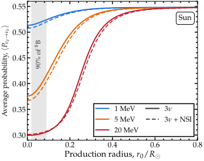

   **Dependence on the production point in the Sun.** Phase-averaged survival probability of a solar neutrino as a function of where it is produced, along the radial ray of Figure :ref:`The averaged solar survival probability <ex-fig-solar>`, at three energies, with and without the non-standard interactions (NSI) of Figure :ref:`The averaged solar survival probability <ex-fig-solar>`. The density is from the BS2005-AGS,OP solar model :cite:p:`Bahcall:2004pz`. At 5 and 20 MeV, each curve rises from its value at the center to the vacuum value, 0.55, as the production point moves out past the radius where the resonance density of Figure :ref:`The averaged solar survival probability <ex-fig-solar>` meets the profile: a sixth of the way out at 5 MeV, a third at 20 MeV. At 1 MeV, the resonance density lies above the central density, and the curve rises only from 0.51. The band marks where :math:`90\%` of the :math:`^8`\ B neutrinos are made, in the same model. See notebooks `#10 <https://github.com/mbustama/Magnus/blob/main/notebooks/10_magnus_averaged_probability.ipynb>`__, `#13 <https://github.com/mbustama/Magnus/blob/main/notebooks/13_magnus_tabulated_solar_model.ipynb>`__, and `#28 <https://github.com/mbustama/Magnus/blob/main/notebooks/28_magnus_paper_figures.ipynb>`__, and :ref:`ex-sec-sun-production-point` for details.

:ref:`ex-sec-sun` placed the neutrino at the center of the Sun. Figure :ref:`Dependence on the production point in the Sun <ex-fig-solar-production>` moves its production point instead, :math:`r_0`, at fixed energy. At 20 MeV, a neutrino born at the center leaves as :math:`\nu_2`, with an average of 0.30. The farther out it is born, the lower the density at production, and the closer the average comes to the vacuum value, 0.55, which it nearly reaches by :math:`R_\odot/2`. The rise passes through the radius where the resonance density of Figure :ref:`The averaged solar survival probability <ex-fig-solar>` meets the profile, about :math:`R_\odot/3`; a neutrino born there has an average of :math:`\cos^4\theta_{13}/2 \approx 0.48`. As the energy drops, the rise moves inward, to about :math:`R_\odot/6` at 5 MeV. At 1 MeV, the resonance density lies above the central density, and the curve rises only mildly, from 0.51 to 0.55. Each point of the figure is one call with ``average=True``, as in Listing :ref:`Averaged solar probabilities <ex-lst-sun>`, with a different ``L0``:

.. code-block:: python

   P = oscprob.osc_prob_3nu_sun(
    5.0*gd.UNIT_MEV, R,
    0.05*gd.SUN_RADIUS*gd.UNIT_KM,
    **osc, **run)
   # P = 0.390, against 0.375 from the center

At 5 MeV, moving the production point from the center to :math:`0.05\,R_\odot`, in the middle of where the :math:`^8`\ B neutrinos are made, raises the average by 0.014.

The :math:`^8`\ B neutrinos are made between :math:`0.02\,R_\odot` and :math:`0.09\,R_\odot` (the band in Figure :ref:`Dependence on the production point in the Sun <ex-fig-solar-production>`). The density is lowest at the outer edge of the band, and even there it exceeds the resonance density of a neutrino with more than 2.6 MeV. So a :math:`^8`\ B neutrino with more than 2.6 MeV is born at a density above its resonance density, wherever in the band it is made, just like one born at the center. That is why Figure :ref:`The averaged solar survival probability <ex-fig-solar>`, computed for a neutrino born at the center, holds for the :math:`^8`\ B neutrinos at high energy: at 20 MeV, the average is 0.301 from :math:`0.05\,R_\odot`, against 0.299 from the center. The non-standard interactions shift the curves by up to 0.012.

.. _ex-sec-averaging-is-not-estimating:

Probability averaging
~~~~~~~~~~~~~~~~~~~~~

In principle, the averaged probability could be estimated from the instantaneous one, as its mean over a window of baselines at the end of the ray. On the Sun, that estimate is close, but biased. The window must span many oscillation lengths for the mean to wash out the oscillation, yet across such a window the density changes, and so does the averaged probability, which depends on the density at the end of the ray. In notebook `#13 <https://github.com/mbustama/Magnus/blob/main/notebooks/13_magnus_tabulated_solar_model.ipynb>`__, for a 5-MeV neutrino at two flavors, on a ray from the center through the inner tenth of the solar radius, the mean over the last 6, 12, 24, and 48 oscillation lengths lies between 0.599 and 0.601, while the true averaged probability at the end of the ray is 0.595. The bias is small, 0.004 to 0.006, but it does not shrink as the window widens.

A scan of the instantaneous probability along the ray has a second problem: aliasing. A scan needs at least two points per cycle of the oscillation it samples. With fewer, each value is still correct, but a curve drawn through them is not the probability. On the Sun, the fastest oscillation of a 5-MeV neutrino has a length of 4.9 km, so a scan of the last 100 km in steps of 50 km is aliased. Passing ``strategy_info`` reports it:

.. code-block:: python

   dL = np.array([0, 50, 100])*gd.UNIT_KM
   info = {}
   P = oscprob.osc_prob_3nu_sun(
    5.0*gd.UNIT_MEV, R - dL, 0.0, **osc,
    nu_i=gd.NUE, nu_f=gd.NUE,
    density_profile=model,
    strategy_info=info)
   s = info['sampling']
   s['cycles_per_step']          # 10.1
   s['aliased']                  # True
   s['nyquist_points']           # 277028

Ten cycles fit between neighboring points. To resolve every cycle from the center to the surface, a scan would need :math:`2.8 \cdot 10^5` points. Magνs reports aliasing, but does not warn about it, since nearly every realistic scan of a solar ray is aliased.

The keyword ``average=True`` avoids both problems: it takes no window and runs no scan. It evaluates the limit directly from the eigenbases at the two ends of the ray (:doc:`averaged_probability`). At two flavors, on an adiabatic passage, the averaged survival probability of a neutrino started decohered has the textbook form

.. math::
   :label: ex-equ-two-flavor-adiabatic

   \langle P^{2\nu}_{\nu_e \to \nu_e} \rangle_{\rm approx}
   =
   \tfrac12 + \tfrac12\cos2\theta_m(l_0)\cos2\theta_m(l_1) \;,

with :math:`\theta_m` the mixing angle in matter at the two ends of the ray. Notebook #13, with ``average_initial_state='decohered'``, reproduces this expression to within :math:`3 \cdot 10^{-16}` across 1–20 MeV.

.. _ex-sec-solar-model-comparison:

Comparing solar models
~~~~~~~~~~~~~~~~~~~~~~

.. _ex-tab-solar-models:

.. table:: **Solar density profiles.** The solar density profiles that every Sun wrapper takes through ``density_profile``. The tabulated standard solar models ship with Magνs. The B16 and B23 tables reach the surface. Past the last row of the older models, the density continues along the slope of the last tabulated interval, unless ``stop_at_table_edge=True``, which returns ``NaN`` there, with a warning. With sterile states, :math:`n_n/n_p` is read from the same table, unless overridden with ``ratio_number_neutrons_to_protons``. The solar compositions are GS98 :cite:p:`Grevesse:1998bj`, AGS05 :cite:p:`Asplund:2004eu`, AGSS09 :cite:p:`Asplund:2009fu`, C11 :cite:p:`Caffau:2010qc`, AAG21 :cite:p:`Asplund:2021aag`, and MB22 :cite:p:`Magg:2022rxb`. See notebook `#13 <https://github.com/mbustama/Magnus/blob/main/notebooks/13_magnus_tabulated_solar_model.ipynb>`__ and :ref:`ex-sec-solar-model-comparison` for details.

   .. list-table::
      :header-rows: 1
      :widths: 25 75

      * - ``density_profile``
        - Solar density profile
      * - ``'exp'``
        - Exponential fit :cite:p:`Giunti:2007ry`; the default
      * - ``'BP2000'``
        - BP2000 :cite:p:`Bahcall:2000nu`; to :math:`0.95\,R_\odot`
      * - ``'BP04'``
        - BP04 :cite:p:`Bahcall:2004fg`; to :math:`0.95\,R_\odot`
      * - ``'BS05-OP'``
        - BS2005, GS98 composition :cite:p:`Bahcall:2004pz`; to :math:`0.98\,R_\odot`
      * - ``'BS05-AGS-OP'``
        - BS2005, AGS05 composition :cite:p:`Bahcall:2004pz`; to :math:`0.98\,R_\odot`
      * - ``'B16-GS98'``
        - B16, GS98 composition :cite:p:`Vinyoles:2016djt`
      * - ``'B16-AGSS09met'``
        - B16, AGSS09met composition :cite:p:`Vinyoles:2016djt`
      * - ``'B23-GS98'``
        - B23, GS98 composition :cite:p:`Herrera:2023b23`
      * - ``'B23-AGSS09'``
        - B23, AGSS09 composition :cite:p:`Herrera:2023b23`
      * - ``'B23-C11'``
        - B23, C11 composition :cite:p:`Herrera:2023b23`
      * - ``'B23-AAG21'``
        - B23, AAG21 composition :cite:p:`Herrera:2023b23`
      * - ``'B23-MB22m'``
        - B23, MB22 meteoritic composition :cite:p:`Herrera:2023b23`
      * - ``'B23-MB22p'``
        - B23, MB22 photospheric composition :cite:p:`Herrera:2023b23`

.. _ex-fig-solar-models:

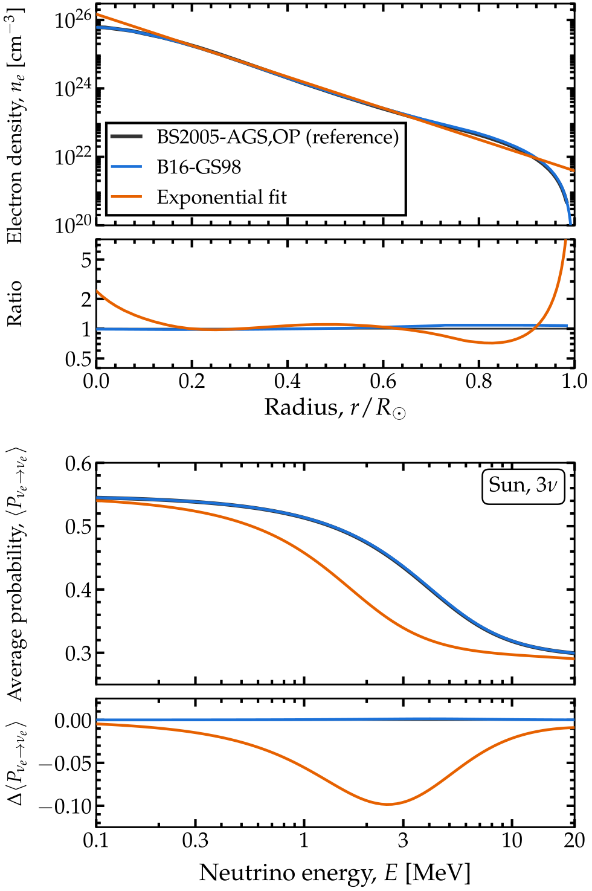

   **Three solar models compared.** *Top*: the tabulated BS2005-AGS,OP  :cite:p:`Bahcall:2004pz` and B16-GS98  :cite:p:`Vinyoles:2016djt` standard solar models, and the exponential fit :math:`n_e = 245\,N_A\,e^{-10.54\,r/R_\odot}` cm\ :math:`^{-3}`  :cite:p:`Giunti:2007ry`, with :math:`N_A` the Avogadro number, that the Sun wrappers use by default; underneath, the ratio of each to BS2005-AGS,OP. The two tables agree to within 2% over the inner half of the Sun and 9% over the outer half. The fit is 2.4 times too dense at the center and several times too dense in the outermost layers. *Bottom*: :math:`\langle P_{\nu_e \to \nu_e}\rangle` at three flavors on each profile; underneath, the difference from the BS2005-AGS,OP result. The two tables give the same probability to within :math:`1.3 \cdot 10^{-3}`; the fit is low by up to 0.1, at 2.5 MeV. See notebooks `#10 <https://github.com/mbustama/Magnus/blob/main/notebooks/10_magnus_averaged_probability.ipynb>`__, `#13 <https://github.com/mbustama/Magnus/blob/main/notebooks/13_magnus_tabulated_solar_model.ipynb>`__, and `#28 <https://github.com/mbustama/Magnus/blob/main/notebooks/28_magnus_paper_figures.ipynb>`__, and :ref:`ex-sec-solar-model-comparison` for details.

Table :ref:`ex-tab-solar-models` lists the solar density profiles that every Sun wrapper accepts through ``density_profile``. Besides the an exponential profile, which is the default, Magνs ships twelve tabulated standard solar models from five series published between 2001 and 2023, several of them in more than one solar composition. Each is selected by name, which is not case-sensitive, e.g., ``density_profile='B16-GS98'``.

From the tabulated mass density, :math:`\rho`, and hydrogen mass fraction, :math:`X`, the wrapper builds the electron number density, :math:`n_e = \rho\,(1 + X)/(2 m_N)`, with :math:`m_N` the mean nucleon mass, and interpolates it log-linearly in radius. Below the first tabulated radius, it holds the density at its first value, since the core is flat. Past the last one, which lies at :math:`0.95\,R_\odot` for BP2000 and BP04 and at :math:`0.98\,R_\odot` for BS2005, it continues the density along the logarithmic slope of the last tabulated interval. Passing ``stop_at_table_edge=True`` returns ``NaN`` there instead, with a warning. With sterile states, the wrapper reads :math:`n_n/n_p = (1 - X)/(1 + X)`, which is read automatically from the same table. In notebook `#13 <https://github.com/mbustama/Magnus/blob/main/notebooks/13_magnus_tabulated_solar_model.ipynb>`__, we compare all twelve models: they give the same averaged :math:`\nu_e` survival probability to within :math:`2.4 \cdot 10^{-3}`. Most of that spread is between series of models; the six compositions of the B23 series differ by at most :math:`2 \cdot 10^{-4}`.

Figure :ref:`Three solar models compared <ex-fig-solar-models>` compares the probabilities computed with three choices of solar density profile. Two are tabulated standard solar models: BS2005-AGS,OP  :cite:p:`Bahcall:2004pz`, used throughout this section, and the newer B16-GS98  :cite:p:`Vinyoles:2016djt`, with updated nuclear rates, equation of state, and opacities. The third is the exponential fit that textbooks quote  :cite:p:`Giunti:2007ry` and that the Sun wrappers use by default. The densities of the two solar models are within 2% of each other over the inner half of the Sun and 9% over the outer half. The exponential fit is 2.4 times too dense at the center, where the real profile flattens, and several times too dense again near the surface, where the real profile plunges.

The two tabulated models give the same averaged probability to within :math:`1.3 \cdot 10^{-3}` at every energy, far below the precision of any solar measurement. The exponential fit gives a probability lower by up to 0.1, at 2.5 MeV. The reason is in :ref:`ex-sec-sun`: on an adiabatic passage, the averaged probability depends only on the eigenbases at the two ends of the ray. At the surface, the eigenbasis is that of vacuum, whatever the profile. At the center, it is set by the central density, where the fit is 2.4 times too dense. The probability falls from 0.55 at low energy to 0.30 at high energy, and the fall happens near the resonance energy, which is inversely proportional to the density. With the fit, the fall therefore happens at energies about 2.4 times lower. The values at low and high energy are nearly the same for every profile, so the difference is largest in between, at a few MeV.

.. _ex-sec-sun-compare-approx:

Comparing against approximations
~~~~~~~~~~~~~~~~~~~~~~~~~~~~~~~~

.. _ex-fig-solar-approx:

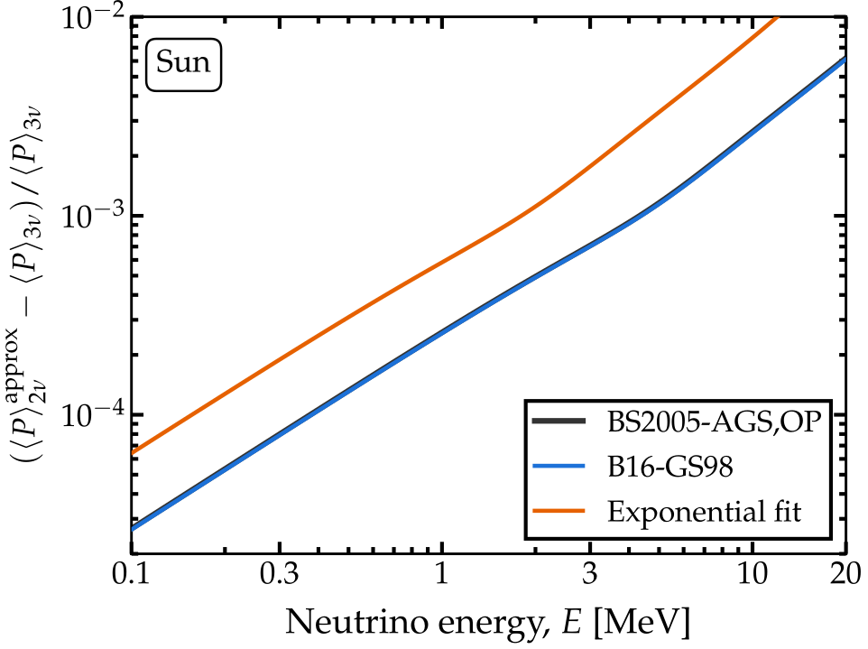

   **Error of the two-flavor solar approximation.** Relative error of the two-flavor approximation, :math:`\langle P^{3\nu}_{\nu_e \to \nu_e} \rangle_{\rm approx}` of Eq. :eq:`ex-equ-two-flavor-reduction`, to the averaged solar survival probability :math:`\langle P^{3\nu}_{\nu_e \to \nu_e} \rangle` computed with Magνs, on the three solar density profiles of Figure :ref:`Three solar models compared <ex-fig-solar-models>`. The approximation overestimates the probability at every energy, by an amount that grows in proportion to the energy. On the two tabulated models, it reaches 0.6% at 20 MeV. On the exponential fit, whose central density is 2.4 times higher, it is 2.3 to 3.4 times larger, and its curve leaves the panel above 12 MeV. See notebook `#28 <https://github.com/mbustama/Magnus/blob/main/notebooks/28_magnus_paper_figures.ipynb>`__ and :ref:`ex-sec-sun-compare-approx` for details.

Solar analyses rarely solve the three-flavor problem. The standard approximation  :cite:p:`Kuo:1989qe` reduces it to two flavors in two steps. First, the 1–2 sector is solved on its own, as a two-flavor problem with :math:`\theta_{12}` and :math:`\Delta m^2_{21}`, on the electron density multiplied by :math:`\cos^2\theta_{13}`. Second, :math:`\theta_{13}` is folded back in through

.. math::
   :label: ex-equ-two-flavor-reduction

   \langle P^{3\nu}_{\nu_e \to \nu_e} \rangle_{\rm approx}
   =
   \sin^4\theta_{13} + \cos^4\theta_{13}\,\langle P^{2\nu}_{\nu_e \to \nu_e} \rangle_{\rm approx} \;.

Here, :math:`\langle P^{2\nu}_{\nu_e \to \nu_e} \rangle_{\rm approx}` is Eq. :eq:`ex-equ-two-flavor-adiabatic`, with :math:`\theta_m` computed from :math:`\theta_{12}`, :math:`\Delta m^2_{21}`, and the electron density multiplied by :math:`\cos^2\theta_{13}`. The approximation rests on :math:`\Delta m^2_{31}` being large compared with :math:`\Delta m^2_{21}` and with the matter potential, so that the third mass state decouples. In vacuum, the approximation is exact. In matter, it drops terms of relative size :math:`2 E V_{\rm CC}/\Delta m^2_{31}`, about 0.1 at the center of the Sun for a 20-MeV neutrino, multiplied by the admixture of the decoupled state, :math:`\sin^2\theta_{13} \approx 0.02`. Analyses that use the approximation state that these terms are negligible; few evaluate them.

Figure :ref:`Error of the two-flavor solar approximation <ex-fig-solar-approx>` evaluates them on the three density profiles of Figure :ref:`Three solar models compared <ex-fig-solar-models>`. The three-flavor result, :math:`\langle P^{3\nu}_{\nu_e \to \nu_e} \rangle`, is computed with Magνs: ``P3`` of Listing :ref:`Averaged solar probabilities <ex-lst-sun>` for the BS2005-AGS,OP table, and the same call on the other two profiles. The two-flavor result needs the density multiplied by :math:`\cos^2\theta_{13}`, which a wrapper cannot provide, since it takes the solar model by name. So it goes through the scenario function, which accepts any profile, here ``ne_sun`` of Listing :ref:`Averaged solar probabilities <ex-lst-sun>` multiplied by :math:`\cos^2\theta_{13}`:

.. code-block:: python

   # The 1-2 sector on cos^2 th13 * n_e
   c13sq = 1.0 - osc['s13']**2   # cos^2 th13
   P2 = oscprob.osc_prob_matter_std_potential(
    2, lambda l: c13sq*ne_sun(l), E, R,
    dict(sth=osc['s12'], Dm2=osc['D21']),
    L0=0.0, nu_i=gd.NUE, nu_f=gd.NUE, average=True,
    density_is_of_number_of_electrons=True)
   # Fold theta_13 back in
   P_approx = osc['s13']**4 + c13sq**2*P2
   (P_approx - P3)/P3   # 6e-3 at 20 MeV

The ``P2`` returned equals Eq. :eq:`ex-equ-two-flavor-adiabatic` to within :math:`10^{-16}` at every energy.

The approximation overestimates the probability at every energy, on every profile, and its relative error grows in proportion to the energy, as the size of the dropped terms does. On the two tabulated models, which give nearly the same probability (:ref:`ex-sec-solar-model-comparison`), the error is about :math:`10^{-5}` at 0.1 MeV, :math:`10^{-4}` at 1 MeV, and 0.6% at 20 MeV. On the exponential fit, it is 2.3 to 3.4 times larger, 2% at 20 MeV, because the fit’s central density is 2.4 times higher and the dropped terms grow with it.

.. _ex-sec-shock:

A supernova shock front
-----------------------

.. _ex-fig-shock:

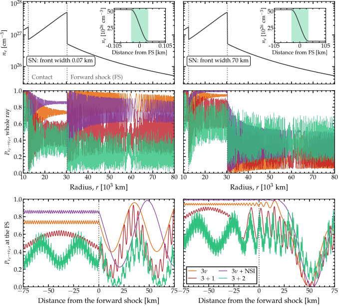

   **A supernova shock front.** Electron number density along a supernova ray, and the survival probability of a 15-MeV :math:`\nu_e` along it. *Top*: the density from :math:`10^{4}` to :math:`8 \cdot 10^{4}` km. Two fronts sit on the ray: the forward shock at 30 323 km, where the density jumps by a factor of ten, and the contact discontinuity at 12 348 km, where it jumps by a factor of 2.5. The two columns differ in one thing only, the width of both fronts: 0.07 km on the left, 70 km on the right. Neither width is visible on the scale of the ray, so the insets show the forward shock, with its extent shaded. *Center*: the probability along the whole ray, computed with Magνs at :math:`{\tt rtol} = 10^{-8}` for four Hamiltonians. The ray holds thousands of oscillation lengths of the pair of eigenstates split by :math:`\Delta m^2_{31}`, so the panel resolves the envelope of the oscillation and not the oscillation itself. The two columns agree bitwise up to the contact discontinuity and part there. *Bottom*: the same probability in a window of :math:`\pm`\ 75 km around the forward shock, where the oscillation is resolved. Two flavors are not drawn: with :math:`\Delta m^2_{21}` alone, the probability stays above 0.95 along the whole ray at this energy. The profile follows  :cite:p:`Schirato:2002tg,Fogli:2003dw`, with the radii of a simulation snapshot  :cite:p:`Kneller:2014oea`. Listing :ref:`Through a supernova shock front <ex-lst-shock>` generates the curves of the left column. See notebooks `#14 <https://github.com/mbustama/Magnus/blob/main/notebooks/14_magnus_supernova_shock.ipynb>`__ and `#28 <https://github.com/mbustama/Magnus/blob/main/notebooks/28_magnus_paper_figures.ipynb>`__, and :ref:`ex-sec-shock` for details.

Figure :ref:`A supernova shock front <ex-fig-shock>` shows the survival probability of a 15-MeV :math:`\nu_e` along a supernova ray crossed by a shock, for two widths of the shock fronts, 0.07 and 70 km. The forward shock is the blast wave of the explosion. It propagates outward through an envelope whose density falls as :math:`r^{-2.4}`, and compresses the matter behind it tenfold. Behind it lies the contact discontinuity, which separates the shocked envelope from the ejecta; across it, the density drops by a factor of 2.5, while the pressure is continuous. An outgoing neutrino therefore crosses two density jumps: first the contact discontinuity, then, after the shocked shell, thinned by a rarefaction, the forward shock. Because a shock alters the adiabaticity of the level crossings, it leaves a signature in the neutrino signal  :cite:p:`Schirato:2002tg,Fogli:2003dw`.

At three flavors, only the pair of eigenstates split by :math:`\Delta m^2_{31}` is affected. The resonance density of the pair split by :math:`\Delta m^2_{21}` is 7 times lower than the lowest density on the ray, so that pair never reaches resonance; accordingly, the two-flavor survival probability stays above 0.95. At 15 MeV, the resonance density of the pair split by :math:`\Delta m^2_{31}` lies between the densities on either side of the forward shock, so the resonance is crossed at the front, where the oscillation length is about 50 km.

The 0.07-km front is crossed suddenly, before the state can follow the eigenstates. Across the 70-km front, which is comparable to the oscillation length, the state partly follows them. Beyond the forward shock, the mean survival probability at three flavors is therefore 0.84 for the sharp fronts and 0.20 for the wide ones. The other Hamiltonians shift by different amounts; for 3+2, the shift is reversed, from 0.22 to 0.38.

Listing :ref:`Through a supernova shock front <ex-lst-shock>` computes the curves of the left column. It declares both fronts through ``t_breakpoints``, as the positions where each begins and ends, so that every level of the refinement places slab edges there. Without the breakpoints, a 0.07-km front falls inside a slab at every level, and a slab that contains a jump degrades the quadrature regardless of the number of slabs. The three-flavor scan is then wrong beyond the forward shock by up to 0.25, and Magνs warns:

.. code-block:: python

   P = oscprob.osc_prob_matter_std_potential(
    3, ne_shock, 15.0*gd.UNIT_MEV, Ls, osc,
    L0=10000.0*gd.UNIT_KM, rtol=1.0e-8,
    atol=1.0e-10, nu_i=gd.NUE, nu_f=gd.NUE,
    density_is_of_number_of_electrons=True)
   # UnmarkedDiscontinuityWarning: the
   # Hamiltonian is discontinuous at the scale
   # of the grid this scan builds, and no
   # t_breakpoints were given.  A slab
   # straddling a density jump degrades the
   # quadrature no matter how many slabs are
   # used; pass t_breakpoints at the
   # discontinuities.

With or without breakpoints, the scan also raises two tolerance warnings, because at :math:`{\tt rtol} = 10^{-8}` the refinement reaches its cap of 20 000 slabs before certifying the result. With the fronts declared, the cap is immaterial: raising it tenfold changes the curve by less than :math:`10^{-5}`, well below the resolution of Figure :ref:`A supernova shock front <ex-fig-shock>`. The scans go to the cumulative engine, as the last line of the three-flavor call confirms; declared breakpoints would keep the hybrid engine of :doc:`adiabatic_strategy` out in any case. Notebook #14 checks the result against an independent integration, and :doc:`comparison` measures the cost of the front width.

.. _ex-lst-shock:

**Through a supernova shock front.** The four curves of the left column of Figure :ref:`A supernova shock front <ex-fig-shock>`: for each Hamiltonian, a scan of 4 000 baselines along the ray at one energy, with both fronts declared. ``t_breakpoints`` names the positions where each front begins and ends, and the refinement puts slab edges there at every level. ``ne_shock`` is the electron density of Figure :ref:`A supernova shock front <ex-fig-shock>` as a function of position and ``osc`` the oscillation parameters. See notebook `#14 <https://github.com/mbustama/Magnus/blob/main/notebooks/14_magnus_supernova_shock.ipynb>`__ and :ref:`ex-sec-shock` for details.

.. code-block:: python

   import numpy as np
   import magnus.oscprob as oscprob
   import magnus.globaldefs as gd

   # Both fronts, 0.07 km wide, centered on the contact
   # discontinuity and on the forward shock: declare
   # where each begins and ends
   w = 0.07*gd.UNIT_KM
   edges = [r + s*w/2 for r in (12348.0*gd.UNIT_KM,
    30323.0*gd.UNIT_KM) for s in (-1.0, 1.0)]

   # 4000 baselines from 10,200 to 80,000 km, at one
   # energy: the cumulative engine answers
   Ls = np.linspace(10200.0, 80000.0, 4000)*gd.UNIT_KM
   run = dict(L0=10000.0*gd.UNIT_KM, t_breakpoints=edges,
    rtol=1.0e-8, atol=1.0e-10, nu_i=gd.NUE, nu_f=gd.NUE,
    density_is_of_number_of_electrons=True)
   E = 15.0*gd.UNIT_MEV

   # Standard three-flavor oscillations
   info = {}
   P3 = oscprob.osc_prob_matter_std_potential(
    3, ne_shock, E, Ls, osc, strategy_info=info, **run)
   info['engine']   # 'cumulative'

   # The same, with non-standard interactions
   eps = dict(eps_ee=0.10, eps_em=0.05, eps_et=0.0,
    eps_mm=0.0, eps_mt=0.03, eps_tt=0.0)
   P3_nsi = oscprob.osc_prob_matter_nsi(
    3, ne_shock, E, Ls, osc, eps, **run)

   # One and two sterile states
   osc4 = dict(osc, s14=0.10**0.5, s24=0.10**0.5,
    s34=0.0, D41=1.0, d14=0.0, d24=0.0)
   P4 = oscprob.osc_prob_matter_std_potential(
    4, ne_shock, E, Ls, osc4, **run)
   osc5 = dict(osc4, s15=0.06**0.5, s25=0.06**0.5,
    s35=0.0, D51=1.7, d15=0.0, d25=0.0, d35=0.0)
   P5 = oscprob.osc_prob_matter_std_potential(
    5, ne_shock, E, Ls, osc5, **run)

A detector measures the survival probability averaged over its energy resolution. The average washes out two phases: the one accumulated after the forward shock, thousands of cycles by the end of the ray at 15 MeV and far more on the way to Earth, and the one accumulated between the two fronts. The latter arises because the neutrino can change eigenstate at either front, so the paths through the shocked shell interfere; the interference completes a cycle every 15 keV. On the Sun, the equation in :doc:`averaged_probability` required only the eigenbases at the ends of the ray, because the passage was adiabatic and :math:`P^{\rm cross}` was the identity. Here, the fronts are crossed suddenly, :math:`P^{\rm cross}` depends on their width, and the amplitudes of the two paths add before the modulus is taken.

Without declared fronts, ``average=True`` resolves the 70-km fronts: it returns 0.37, against :math:`0.35 \pm 0.04` with the fronts declared. It cannot resolve the 0.07-km fronts: it treats them as smooth, returns 0.04, close to the few percent obtained without a shock (Figure :ref:`The shock signature against energy <ex-fig-shock-energy>`), instead of 0.56, and raises ``UnmarkedDiscontinuityWarning``. With the fronts declared, the call returns the correct average:

.. code-block:: python

   P = oscprob.osc_prob_matter_std_potential(
    3, ne_shock, 15.0*gd.UNIT_MEV, Ls[-1], osc,
    L0=10000.0*gd.UNIT_KM, t_breakpoints=edges,
    average=True, nu_i=gd.NUE, nu_f=gd.NUE,
    density_is_of_number_of_electrons=True)
   # PhaseAveragingWarning: average=True on a
   # profile with discontinuities has no closed
   # form, so the probability was propagated
   # across an energy window of +/-10.0\% and
   # averaged over 41 samples.  This is the
   # average over that window, not the L/E ->
   # infinity limit, and it depends on the
   # window: the largest standard error of the
   # mean here is 4.47e-02.
   # Pass average_spread to set the half-width
   # of the window to the resolution of the
   # measurement, and average_n_samples to
   # reduce the error, which falls as the
   # inverse square root of the number of
   # samples.
   # P = 0.56

The warning reports the two defaults of this route, named constants of ``magnus.avgprob``: a window of :math:`\pm`\ 10% around the energy, typical of the energy resolution of a detector, and 41 samples, spaced evenly in :math:`1/E`, and hence in phase.

The keywords ``average_spread`` and ``average_n_samples`` change these values:

.. code-block:: python

   P = oscprob.osc_prob_matter_std_potential(
    3, ne_shock, 15.0*gd.UNIT_MEV, Ls[-1], osc,
    L0=10000.0*gd.UNIT_KM, t_breakpoints=edges,
    average=True, average_spread=0.05,
    average_n_samples=161, nu_i=gd.NUE,
    nu_f=gd.NUE,
    density_is_of_number_of_electrons=True)
   # P = 0.584

Unlike the limit returned on a smooth profile, this average depends on the width of the window, because the averaged probability itself varies with energy across it (Figure :ref:`The shock signature against energy <ex-fig-shock-energy>`); the width is therefore best set to the energy resolution of the detector being modeled. The number of samples sets the statistical error of the average, which falls as the inverse square root of that number, while each sample costs a full propagation. The warning reports that error, so the number of samples needed for a target error :math:`\delta` follows directly: :math:`N\,(\sigma/\delta)^2`, with :math:`N` the samples used and :math:`\sigma` the reported error. Here, 161 samples halve the error of the default, from 0.04 to 0.02, and take four times as long; an error of 0.01 needs about 600 samples. As in Listing :ref:`Through a supernova shock front <ex-lst-shock>`, each propagation reaches the slab cap and raises the tolerance warnings.

.. _ex-fig-shock-energy:

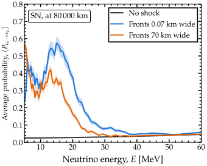

   **The shock signature against energy.** Averaged survival probability of a :math:`\nu_e` at the end of the supernova ray of Figure :ref:`A supernova shock front <ex-fig-shock>`, at 80 000 km, against energy, with no shock and with the two front widths of that figure. Each point with a shock is the mean over an energy window of :math:`\pm`\ 10%, the average that ``average=True`` returns on a profile with declared fronts; the bands are the standard errors of those means. Without a shock, the passage is adiabatic and the survival probability stays at a few percent. With the fronts, it rises between 5 and about 25 MeV, where the neutrino crosses the resonance of the pair of eigenstates split by :math:`\Delta m^2_{31}` at the forward shock or close to it, and it falls back toward the no-shock value above 30 MeV, where the resonance lies farther out, in undisturbed matter. See notebooks `#14 <https://github.com/mbustama/Magnus/blob/main/notebooks/14_magnus_supernova_shock.ipynb>`__ and `#28 <https://github.com/mbustama/Magnus/blob/main/notebooks/28_magnus_paper_figures.ipynb>`__, and :ref:`ex-sec-shock` for details.

Figure :ref:`The shock signature against energy <ex-fig-shock-energy>` shows the effect of the shock on the energy spectrum. Without a shock, the profile is smooth, the passage is adiabatic, a :math:`\nu_e` leaves as :math:`\nu_3`, and the survival probability is a few percent at all energies. With a shock, it rises to tens of percent between 5 and about 25 MeV and falls back toward the no-shock value above 30 MeV. This window follows from the position of the resonance density, which scales as :math:`1/E`, on the profile. Between 1.8 and 18 MeV, the resonance density lies between the densities on either side of the forward shock, and the resonance is crossed at the front. Above 18 MeV, it lies in the undisturbed matter beyond the front and is crossed adiabatically; the jump still changes the mixing angle abruptly, but less so at higher energies, and the effect fades. Within the window, the sharp fronts yield the larger survival probability, because the oscillation length at the resonance, 20 to 60 km between 6 and 18 MeV, is comparable to the 70-km ramp, which the state partly follows. Between 5.3 and 13 MeV, the resonance density also lies between the densities on either side of the contact discontinuity; the resonance is then crossed at both fronts, and the result depends on the phase accumulated between them. Near 5 MeV, the wide fronts yield the larger survival probability.

.. _ex-sec-astro:

High-energy astrophysical neutrinos
-----------------------------------

.. _ex-fig-astro:

.. figure:: ../../img/paper/astro_composition.png
   :width: 95%
   :alt: Flavor composition of an astrophysical flux

   **Flavor composition of an astrophysical flux.** Flavor composition of an astrophysical neutrino flux at Earth and the survival probabilities behind it, for five Hamiltonians. Such a flux arrives decohered, so these panels carry the phase-averaged limit of the equation in :doc:`averaged_probability`, not a propagated probability. *Top*: :math:`\langle P_{\nu_\alpha \to \nu_\alpha}\rangle` against energy. *Bottom*: the flavor fractions reaching Earth from a pion-decay source, :math:`1:2:0`, with the standard case repeated beneath each panel so that a departure from it is legible. The parameters of the four departures are as follows. Lorentz-invariance violation: the operator of Eq. :eq:`ex-equ-h-liv-3nu` with :math:`n_{\rm LIV} = 1`, :math:`\Lambda = 1` eV, eigenvalues :math:`b_1 = b_2 = 0` and :math:`b_3 = 1.26 \cdot 10^{-31}` eV, and :math:`\mathbb{V}_\xi` the PMNS matrix with :math:`\delta_\xi = 0`; the eigenvalue is fixed by asking the new term to equal the vacuum one at 100 TeV; the vertical line marks that energy. Non-standard interactions: :math:`\varepsilon_{ee} = 0.10`, :math:`\varepsilon_{e\mu} = 0.05` and :math:`\varepsilon_{\mu\tau} = 0.03`, on a chord through the core, :math:`\cos\theta_z = -1`. Sterile state: :math:`\sin^2\theta_{14} = \sin^2\theta_{24} = 0.1`, :math:`\theta_{34} = 0` and :math:`\Delta m^2_{41} = 1` eV\ :math:`^2`. Pseudo-Dirac: the mass eigenstate state :math:`\nu_2` alone carries a partner, split from it by :math:`\delta m^2 = 10^{-13}` eV\ :math:`^2`, at a distance of 100 Mpc. We renormalize the :math:`3+1` and pseudo-Dirac fractions to the three active flavors, past the 13.3% and 19.3% of the flux their sterile states remove, since that share is not observed. Pairing all three mass states would halve every active-active probability by the same factor and leave the fractions untouched, so it is the uneven suppression that moves them. Listing :ref:`Flavor composition of astrophysical neutrinos <ex-lst-astro>` computes the five cases. See notebooks `#10 <https://github.com/mbustama/Magnus/blob/main/notebooks/10_magnus_averaged_probability.ipynb>`__, `#13 <https://github.com/mbustama/Magnus/blob/main/notebooks/13_magnus_tabulated_solar_model.ipynb>`__, and `#28 <https://github.com/mbustama/Magnus/blob/main/notebooks/28_magnus_paper_figures.ipynb>`__ for details, and :ref:`ex-sec-astro` for details.

Figure :ref:`Flavor composition of an astrophysical flux <ex-fig-astro>` shows the flavor composition of a TeV–PeV astrophysical flux at Earth and the average flavor-transition probabilities behind it, for five Hamiltonians: standard three-flavor, Lorentz-invariance violation (LIV), non-standard interactions (NSI) through the Earth, :math:`3+1` flavors, and pseudo-Dirac neutrinos with the :math:`\nu_2` mass eigenstate split. The top row carries the survival probabilities :math:`\langle P_{\nu_\alpha \to \nu_\alpha}\rangle`; the bottom row, the flavor fractions reaching Earth from a source that produces neutrinos through the full pion decay chain, described next.

*Producing them.*—In cosmic accelerators—active galaxies, gamma-ray bursts, superluminous supernovae—protons may interact with ambient matter and radiation to produce pions  :cite:p:`Margolis:1977wt,Stecker:1978ah,Kelner:2006tc`. The pions decay via :math:`\pi^+ \to \mu^+ + \nu_\mu`, followed by :math:`\mu^+ \to \bar{\nu}_\mu + \nu_e + e^+`, and their charge conjugates, so that the flux leaving the source carries flavor ratios :math:`(f_e, f_\mu, f_\tau)_{\rm S} = \left(\frac{1}{3}, \frac{2}{3}, 0\right)`, with :math:`f_{\alpha, {\rm S}}` the fraction of :math:`\nu_\alpha + \bar{\nu}_\alpha` in the total. Neutrino telescopes cannot ordinarily tell :math:`\nu` from :math:`\bar\nu`, so :math:`\nu_\alpha` below means :math:`\nu_\alpha + \bar{\nu}_\alpha`. For illustration, we adopt that full pion-decay composition—the nominal expectation—though other there are other possibilities (see, e.g., Ref. :cite:p:`Bustamante:2015waa`).

*What is observable.*—Over Mpc–Gpc baselines, the oscillation length is minute against the distance; neither the distance, the size of the production region, nor the energy resolution of a detector is known to anything approaching the precision the phase would demand for the oscillations to be resolved. Therefore, a neutrino telescope is sensitive only to the average flavor-transition probabilities :math:`\langle P_{\nu_\alpha \to \nu_\beta}\rangle` of the equation in :doc:`averaged_probability`.

Magνs returns the probability in closed form from the eigenvectors of :math:`\mathbb{H}`, with no phase propagated. In vacuum and under standard oscillations, :math:`\mathbb{V}` in the equation in :doc:`averaged_probability` is the PMNS matrix, :math:`\mathbb{U}`, and the probability becomes the familiar :math:`\sum_i \lvert U_{\alpha i}\rvert^2 \lvert U_{\beta i}\rvert^2`. In either case, the flavor ratio at Earth is :math:`f_{\alpha, \oplus} = \sum_\beta \langle P_{\nu_\beta \to \nu_\alpha}\rangle f_{\beta, {\rm S}}`. The flavor composition is a rich probe of astrophysics and fundamental physics; see, e.g., Refs. :cite:p:`Esmaili:2009dz,Barenboim:2003jm,Beacom:2003nh,Kachelriess:2006ksy,Lipari:2007su,Hummer:2010ai,Bustamante:2015waa,Arguelles:2015dca,Rasmussen:2017ert,Bustamante:2019sdb,Ackermann:2019cxh,Ackermann:2019ows,Arguelles:2019rbn,Bustamante:2020bxp,Song:2020nfh,Liu:2023flr`.

Evaluating :math:`\mathbb{U}` at the NuFIT 6.1 best-fit values of the mixing parameters yields about equal proportion of each flavor at Earth, i.e., :math:`(0.33, 0.34, 0.33)_\oplus`. Oscillation over astrophysical distances populates a :math:`\nu_\tau` component that the sources do not make. Run backward, the measured flavor composition can be turned into a constraint on the sources  :cite:p:`Bustamante:2019sdb,Song:2020nfh,Liu:2023flr,IceCube:2025ole`.

In the presence of mixing with sterile states of or new, non-matter terms added to the *vacuum* Hamiltonian (like Lorentz-invariance violation, which holds in vacuum and in matter), the probability is the same expression as above, but evaluated in the eigenbasis of the total Hamiltonian, i.e., :math:`\sum_i \lvert V_{\alpha i}\rvert^2 \lvert V_{\beta i}\rvert^2`.

Matter is different: the flux decoheres in the vacuum mass basis long before it arrives, then crosses the Earth *coherently*. Thus, the two legs compose as probability matrices rather than as amplitudes, yielding a flavor ratio at Earth of :math:`f_{\beta,\oplus} = \sum_{\alpha,\gamma} f_{\alpha, {\rm S}} \langle P_{\nu_\alpha \to \nu_\gamma}\rangle P^{\oplus}_{\nu_\gamma \to \nu_\beta}`, with the second factor an ordinary propagation through the Earth’s density profile.

Listing :ref:`Flavor composition of astrophysical neutrinos <ex-lst-astro>` computes the five cases of Figure :ref:`Flavor composition of an astrophysical flux <ex-fig-astro>`. Three of them are one wrapper call each with ``average=True``, over all energies at once: the standard case, the Lorentz-violating case, and the :math:`3+1` case. The wrappers decide from the baseline and the eigenvalue gaps which pairs have decohered, so the baseline passed must be astrophysical in fact. At 100 Mpc every pair has decohered at every energy of the figure; over :math:`10^8` km, less than an astronomical unit, the pair split by :math:`\Delta m^2_{21}` has not completed a cycle above a few TeV, so the wrapper warns and returns the coherent expression instead. The pseudo-Dirac case has no wrapper: its Hamiltonian is built and handed to the direct route with the baseline, from which the average decides which pairs of eigenvalues have decohered.

Only the Earth leg with non-standard interactions propagates a probability; the other four cases are closed-form averages. That call passes ``n_slabs=32``: on the default first grid a slab spans thousands of km, across which the matter term alone accumulates a phase above :math:`\pi`, the bound below which the expansion is guaranteed to converge. Magνs warns about that and refines anyway; starting at 32 slabs removes the warning, with a change in the answer below the tolerance.

.. _ex-lst-astro:

**Flavor composition of astrophysical neutrinos.** The five cases of Figure :ref:`Flavor composition of an astrophysical flux <ex-fig-astro>`: the phase-averaged matrix :math:`\langle P_{\nu_\alpha \to \nu_\beta}\rangle` of the equation in :doc:`averaged_probability` for each Hamiltonian, over the sixty energies of the figure, contracted with the pion-decay source fractions. The standard, Lorentz-violating and :math:`3+1` cases are one wrapper call each with ``average=True``; the Earth case composes the decohered matrix with one propagation through the core; the pseudo-Dirac case builds its Hamiltonian and takes the direct route with the baseline, from which the average groups the spectrum into coherent blocks. ``f_earth`` holds the five compositions. See :ref:`ex-sec-astro` for details.

.. code-block:: python

   import numpy as np
   import magnus.oscprob as oscprob
   import magnus.hamiltonians as ham
   import magnus.earth as earth
   import magnus.globaldefs as gd

   osc = gd.load_nufit_params('NuFIT 6.1')
   E = np.logspace(3, 7, 60)*gd.UNIT_GEV   # 1 TeV-10 PeV
   f_src = np.array([1/3, 2/3, 0.0])       # pion decay
   # A source 100 Mpc away: far enough for every pair
   # of eigenvalues to have decohered at every energy,
   # which the wrappers decide from the baseline
   L_src = 100.0*3.0857e19*gd.UNIT_KM

   def at_earth(P):
       # The source fractions, zero for a sterile state,
       # contracted with the averaged matrix; the active
       # fractions renormalized to one
       f = np.zeros(len(P)); f[:3] = f_src
       f = (f @ P)[:3]
       return f/f.sum()

   # Standard: the averaged matrix at each energy
   P_std = oscprob.osc_prob_3nu_vacuum(E, L_src,
    average=True, **osc)                   # (60, 3, 3)

   # LIV: the n = 1 operator, aligned with the PMNS
   # angles, sized to equal the vacuum term at 100 TeV
   b3 = osc['D31']/(2*(100.0*gd.UNIT_TEV)**2)
   P_liv = oscprob.osc_prob_3nu_vacuum_liv(E, L_src,
    average=True, sxi12=osc['s12'], sxi23=osc['s23'],
    sxi13=osc['s13'], dxiCP=0.0, b1=0.0, b2=0.0,
    b3=b3, Lambda=1.0, n_liv=1, **osc)

   # NSI through the Earth: the flux arrives decohered,
   # then crosses the Earth coherently, so the two legs
   # compose as probability matrices.  The ladder starts
   # at 32 slabs: the matter term alone winds more than
   # pi across a coarser one
   eps = dict(eps_ee=0.10, eps_em=0.05, eps_mt=0.03)
   L_in = earth.distance_traveled_inside_earth(-1.0)
   P_in = oscprob.osc_prob_3nu_earth_nsi(E, costhz=-1.0,
    L=L_in*gd.UNIT_KM, n_slabs=32, rtol=1e-6, atol=1e-8,
    **osc, **eps)
   P_nsi = np.asarray(P_std) @ np.asarray(P_in)

   # 3+1: one sterile state, sin^2 of both active-
   # sterile angles 0.1, Dm41^2 = 1 eV^2
   P_4 = oscprob.osc_prob_4nu_vacuum(E, L_src,
    average=True, s14=np.sqrt(0.1), s24=np.sqrt(0.1),
    D41=1.0, **osc)

   # Pseudo-Dirac: no wrapper, so the Hamiltonian is
   # built and handed to the direct route.  The second
   # mass state is paired with a partner split by
   # 1e-13 eV^2; the baseline decides which pairs have
   # decohered
   U = ham.pmns_mixing_matrix(osc['s12'], osc['s23'],
    osc['s13'], osc['dCP'])
   m2 = np.array([0.0, osc['D21'], osc['D31']])
   def H_pd(e):
       return ham.hamiltonian_pseudo_dirac_vacuum(
        e, U, m2, {1: 1.0e-13})
   P_pd = np.array([oscprob.osc_prob_energy_baseline(
    H_pd(e), e, L_src, average=True) for e in E])

   cases = dict(std=P_std, liv=P_liv, nsi=P_nsi,
                four=P_4, pd=P_pd)
   f_earth = {k: np.array([at_earth(P) for P in v])
              for k, v in cases.items()}

*What varies with energy, and what does not.*—For standard oscillations the composition does not depend on the energy at all. Equation (:doc:`averaged_probability`) is built from :math:`\lvert \mathbb{V}_{\alpha i}\rvert^2` alone; in vacuum no energy enters them. Three of the four departures from standard oscillations are flat in energy:

- In the :math:`3+1` case, a sterile state moves the composition at Earth from :math:`(0.326, 0.343, 0.330)_\oplus` to :math:`(0.330, 0.325, 0.346)_\oplus`. (Sterile states take away 13.3% of the originally purely active flux; these triplets are the three active fractions rescaled to add to one.)

- In NSI through the Earth, the fractions move by less than 0.005 and also do not vary, because above a TeV the matter term dominates the Hamiltonian inside the Earth and carries no energy dependence. (Towards the low energy end, the energy dependence starts becoming visible.)

- In the pseudo-Dirac case, expanded below, the composition is flat in energy for the same reason as for sterile neutrinos: it is a vacuum Hamiltonian, just with more states.

The three cases induce different shifts in :math:`f_{\alpha, \oplus}`, independent of energy within the range shown. Above about 100 TeV, a neutrino crossing the core is likely to interact on the way and never reach the detector, an effect Magνs does not account for.

What separates the Lorentz-violating case from the others is that its term keeps growing with energy (:math:`\propto E`) relative to the vacuum one (:math:`\propto 1/E`), so the eigenvectors never settle; the other three cases reach a regime in which one term dominates and the composition stops moving. The Lorentz-violating case moves :math:`f_{e, \oplus}` from about 0.33 up to 0.35 and down again to 0.32 across the crossover, with :math:`f_{\mu, \oplus}` dipping to 0.33 and recovering; the survival probability driving it reaches 0.89. That is what a flavor measurement could distinguish; Magνs evaluates the equation in :doc:`averaged_probability` for it in the same call as for the standard case.

.. _ex-fig-astro-ternary:

.. figure:: ../../img/paper/astro_ternary.png
   :width: 95%
   :alt: The flavor triangle of high-energy astrophysical neutrinos

   **The flavor triangle of high-energy astrophysical neutrinos.** Flavor composition at Earth of a pion-decay flux of TeV–PeV astrophysical neutrinos. The flavor composition at the source is :math:`\left(\frac{1}{3}:\frac{2}{3}:0\right)_{\rm S}`. Results are for standard, three-flavor oscillations in vacuum, for Lorentz-invariance violation (LIV), and for active-sterile mixing under 3+1 flavors. The standard expectation is :math:`(0.326, 0.343, 0.330)_\oplus`. Along the LIV curve, the eigenvalue :math:`b_3` of the :math:`n = 1` LIV operator of Figure :ref:`Flavor composition of an astrophysical flux <ex-fig-astro>` grows from zero at :math:`E = 100` TeV; the marks are where the new term is 0.1, 1, and 10 times the vacuum one, the energies 32, 100, and 316 TeV. Along the 3+1 curve, the two active-sterile mixing angles grow together from zero; the marks are :math:`\sin^2\theta_{14} = \sin^2\theta_{24} = 0.1`, 0.2 and 0.3, with flavor fractions renormalized to the active flavors. See notebooks `#10 <https://github.com/mbustama/Magnus/blob/main/notebooks/10_magnus_averaged_probability.ipynb>`__, `#13 <https://github.com/mbustama/Magnus/blob/main/notebooks/13_magnus_tabulated_solar_model.ipynb>`__, and `#28 <https://github.com/mbustama/Magnus/blob/main/notebooks/28_magnus_paper_figures.ipynb>`__ for details, and :ref:`ex-sec-astro` for details.

Figure :ref:`The flavor triangle of high-energy astrophysical neutrinos <ex-fig-astro-ternary>` shows two of these flavor compositions on the flavor triangle, as their new-physics parameter is varied. Along the LIV curve, the eigenvalue of the Lorentz-violating operator grows from zero at 100 TeV: the composition leaves the standard point, swings out through the crossover and settles where the new term alone puts it, close to where it started. Along the 3+1 curve, the two active-sterile mixing angles grow together from zero; the composition moves the other way. Given the ranges over the model parameters are varied in Figure :ref:`Flavor composition of an astrophysical flux <ex-fig-astro>`, every point lies within a few hundredths of the standard one, so the triangle is drawn over 0.30 to 0.40 on each axis.

*Pseudo-Dirac neutrinos.*—The fifth panel in Figure :ref:`Flavor composition of an astrophysical flux <ex-fig-astro>` splits the mass eigenstate :math:`\nu_2` into a pair separated by :math:`\delta m^2 = 10^{-13}` eV\ :math:`^2`, its partner sterile  :cite:p:`Wolfenstein:1981kw,Petcov:1982ya` (see :ref:`ex-sec-shipped-hamiltonians`). Only one of the mass eigenstates is split: splitting all three sends half the flux to the sterile partners and divides every probability between active flavors by 2, so the three flavor fractions a detector sees come out standard. Splitting :math:`\nu_2` only sends 19.3% of the flux to its partner and moves the fractions.

Which averaged expression applies to the probability depends on the phase the pair itself accumulates, :math:`\delta m^2 L / 2E`. At 100 Mpc and 100 TeV, below about :math:`10^{-19}` eV\ :math:`^2`, that phase is a small fraction of a radian: the pair stays coherent and the equation in :doc:`averaged_probability` returns exactly what an unsplit spectrum gives. Above about :math:`10^{-16}` eV\ :math:`^2` the phase turns through more than a cycle: the pair has averaged away and the equation in :doc:`averaged_probability` counts the two members separately, halving the channels they carry. The figure sits above that band, at :math:`10^{-13}` eV\ :math:`^2`. Magνs decides which regime a spectrum is in from the eigenvalues and the baseline:

.. code-block:: python

   import magnus.avgprob as avgprob

   E1 = 100.0*gd.UNIT_TEV
   for dm2 in (1.0e-13, 1.0e-19):
       H = ham.hamiltonian_pseudo_dirac_vacuum(
        E1, U, m2, {1: dm2})
       lam = np.linalg.eigvalsh(H)
       b = avgprob.coherence_blocks(lam, L_src)
       print(b)
   # [[0], [1], [2], [3]]   The pair decohered
   # [[0], [1, 2], [3]]     The pair coherent

Between the two regimes neither expression describes the situation accurately; passing ``average=True`` says so instead of returning a number. The signature such a spectrum leaves at a neutrino telescope is the one identified in Ref. :cite:p:`Beacom:2003eu`.

Assorted long examples
----------------------

.. _ex-sec-cavity:

A cavity in the Earth’s crust
~~~~~~~~~~~~~~~~~~~~~~~~~~~~~

.. _ex-fig-cavity:

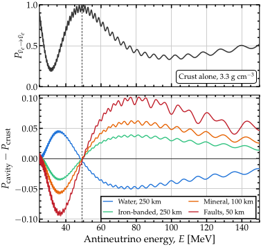

   **A cavity in the Earth’s crust.** Effect of a cavity in the Earth’s crust on the :math:`\bar{\nu}_e` survival probability over a baseline of :math:`1\,500` km, computed with Magνs, after Ref.  :cite:p:`Arguelles:2012nw`. *Top*: the crust alone, uniform at 3.3 g cm\ :math:`^{-3}` with :math:`Y_e = 0.5`. *Bottom*: the change that four cavities make to it, each centered on the baseline, with the density and width its label gives. The water cavity carries :math:`Y_e = 0.555`, the other three 0.5. The dashed line marks 49 MeV, where the crust curve peaks. The beam of Ref.  :cite:p:`Arguelles:2012nw` spans 5–150 MeV; below 25 MeV, the oscillation is too rapid to draw. Listing :ref:`A cavity in the Earth's crust <ex-lst-cavity>` computes every curve. See notebook `#28 <https://github.com/mbustama/Magnus/blob/main/notebooks/28_magnus_paper_figures.ipynb>`__ and :ref:`ex-sec-cavity` for details.

.. _ex-lst-cavity:

**A cavity in the Earth’s crust.** A cavity search in the Earth’s crust, after Ref.  :cite:p:`Arguelles:2012nw`: the :math:`\bar{\nu}_e` survival probability over :math:`1\,500` km of Earth’s crust, with and without a cavity of different density centered on the baseline. A cavity is a density profile with two walls, whose positions are declared as breakpoints so that the refinement ladder runs inside the cavity. See notebook `#28 <https://github.com/mbustama/Magnus/blob/main/notebooks/28_magnus_paper_figures.ipynb>`__ and :ref:`ex-sec-cavity` for details.

.. code-block:: python

   import numpy as np
   import magnus.oscprob as oscprob
   import magnus.matter as matter
   import magnus.globaldefs as gd

   L0 = 1500.0                     # km, source to detector
   RHO_CRUST, YE_CRUST = 3.3, 0.5  # PREM crust
   E = np.linspace(25.0, 150.0, 2500)*gd.UNIT_MEV
   osc = gd.load_nufit_params('NuFIT 6.1')
   kw = dict(osc_params=osc, L0=0.0, nu_i=gd.NUE,
             nu_f=gd.NUE, nubar=True, rtol=1.0e-8,
             atol=1.0e-10,
             density_is_of_number_of_electrons=True)

   def n_e(rho, ye):
       """Electron density [eV^3] of uniform matter."""
       return matter.num_density_e_func(
           0.0, lambda _: rho, electron_fraction=ye,
           ratio_number_neutrons_to_protons=(1.0-ye)/ye,
           density_matter_is_in_g_per_cm3=True)

   NE_CRUST = n_e(RHO_CRUST, YE_CRUST)

   def cavity(rho, ye, w):
       """Crust holding a cavity of width w, centered."""
       d = (L0 - w)/2.0
       ne_in = n_e(rho, ye)

       def profile(l):
           x = np.asarray(l, dtype=float)/gd.UNIT_KM
           return NE_CRUST + (ne_in - NE_CRUST) \
               *((x >= d) & (x <= d + w))

       return profile, np.array([d, d + w])*gd.UNIT_KM

   # An empty crust needs no profile, only a number
   P0 = oscprob.osc_prob_matter_std_potential(
       3, NE_CRUST, E, L0*gd.UNIT_KM, **kw)

   # Water, iron, a mineral deposit, a zone of faults:
   # (rho, Y_e, w) for each
   CASES = [(1.0, 0.555, 250.0), (5.0, 0.5, 250.0),
            (10.0, 0.5, 100.0), (25.0, 0.5, 50.0)]
   dP = []
   for rho, ye, w in CASES:
       profile, walls = cavity(rho, ye, w)
       # The two walls are density jumps: declare them
       P = oscprob.osc_prob_matter_std_potential(
           3, profile, E, L0*gd.UNIT_KM,
           t_breakpoints=walls, **kw)
       dP.append(P - P0)

A region of anomalous density along the trajectory of a neutrino moving in an otherwise uniform medium changes the oscillation probability measured at the far end. This observation has motivated proposals for using neutrinos to search for underground cavities in the Earth’s crust. We use Magνs to implement the prescription of Ref. :cite:p:`Arguelles:2012nw`: a low-energy :math:`\bar{\nu}_e` beam crossing :math:`1\,500` km of crust, with the survival probability measured from 5 to 150 MeV. Our goal is primarily illustrative; we point out the doubtful feasibility of such an experimental setup.

Listing :ref:`A cavity in the Earth's crust <ex-lst-cavity>` sets this up in Magνs. The crust is uniform at 3.3 g cm\ :math:`^{-3}` with :math:`Y_e = 0.5`, the average of the outermost PREM layers. The cavity is a slab of different density centered on the baseline. We show cavities of four densities :cite:p:`Arguelles:2012nw`: water at 1 g cm\ :math:`^{-3}` and :math:`Y_e = 0.555`, an iron-banded formation at 5 g cm\ :math:`^{-3}`, a mineral deposit at 10 g cm\ :math:`^{-3}`, a zone of seismic faults at 25 g cm\ :math:`^{-3}`. Their widths along the neutrino trajectory fall from 250 to 50 km as the contrast with the crust grows. Each cavity has two walls. Every wall is a density jump: we pass their positions via ``t_breakpoints`` to the scenario function, allowing the refinement ladder to act inside the cavity.

Figure :ref:`A cavity in the Earth’s crust <ex-fig-cavity>` shows the resulting probabilities. Every cavity curve crosses zero near the :math:`49` MeV at which the crust curve peaks at 0.9997 (it would be exactly 1 if :math:`\theta_{13}` were zero). The presence of a cavity moves the peak energy. Adding column density pushes the peak up in energy; removing column density pulls it down. What a cavity does to the curve is to displace it bodily along the energy axis, leaving its shape almost untouched. For a denser cavity, at energies below the peak the peak has moved further away, so the probability there falls; at energies above the peak it has moved closer, so the probability rises. A lighter cavity moves the peak the other way, swapping both signs. Either way the shift crosses zero between the crust’s peak and the cavity’s, which puts the four crossings between 48.1 and 49.5 MeV.

Figure :ref:`A beam swept across a buried body <ex-fig-cavity-sweep>` turns the neutrino beam across the cavity. The source stays put and the baseline keeps its length; only the direction changes, by an angle :math:`\alpha`. Each direction cuts a different slice through the same cavity, a sphere of radius 125 km centered 750 km along the baseline. (Reference :cite:p:`Arguelles:2012nw` works with elliptical cavities, but a sphere carries the point just as well.) The spread of the angle is :math:`\alpha = \pm 9.59^\circ`; within those angles, the cavity width it crosses traces a semicircle.

The probability contrast map reflects that semicircle. Structure fills the :math:`\alpha` band and fades at its edges as the width falls. Outside the band, the beam misses the body, so the profile is the uniform crust and the difference is exactly zero. The sweep is what separates a large, light body from a small heavy one: a single direction measures only the excess column, in which density and width are degenerate, while the angular width of the band fixes the size by itself. Listing :ref:`A beam swept across a buried body <ex-lst-cavity-sweep>` computes the map.

.. _ex-fig-cavity-sweep:

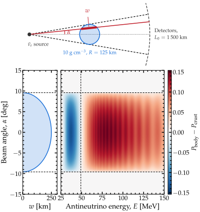

   **A beam swept across a buried body.** *Top*: the geometry. The beam leaves the source at an angle :math:`\alpha` and reaches a detector on the dashed arc, :math:`1\,500` km away. The two dashed straight lines are the beams tangent to the body, at :math:`\alpha = \pm 9.59^\circ`. A neutrino beam crosses the cavity width, :math:`w`. *Bottom left*: width against angle, i.e., the cavity’s silhouette. *Bottom right*: change in probability over energy and angle. The dashed vertical line marks the :math:`49` MeV of Figure :ref:`A cavity in the Earth’s crust <ex-fig-cavity>`. Listing :ref:`A beam swept across a buried body <ex-lst-cavity-sweep>` computes the map. See notebook `#28 <https://github.com/mbustama/Magnus/blob/main/notebooks/28_magnus_paper_figures.ipynb>`__ and :ref:`ex-sec-cavity` for details.

.. _ex-lst-cavity-sweep:

**A beam swept across a buried body.** The map of Figure :ref:`A beam swept across a buried body <ex-fig-cavity-sweep>`, which reuses ``n_e``, ``NE_CRUST``, ``L0``, and ``kw`` from Listing :ref:`A cavity in the Earth's crust <ex-lst-cavity>`. For each beam angle, ``crossing`` finds where the chord enters and leaves the body. Each call uses these two points twice: as the edges of the body in the density profile, and as ``t_breakpoints``. Angles at which the beam misses the body are skipped, since there the probability equals the crust-only ``P0``. See :ref:`ex-sec-cavity` for details.

.. code-block:: python

   import numpy as np

   BODY_R, BODY_D0 = 125.0, 750.0   # km: size, position
   NE_BODY = n_e(10.0, 0.5)         # a mineral deposit
   E = np.linspace(25.0, 150.0, 400)*gd.UNIT_MEV
   ALPHA = np.linspace(-15.0, 15.0, 220)

   def crossing(alpha_deg):
       """Entry and exit points in the body [km]."""
       a = np.radians(alpha_deg)
       miss = abs(BODY_D0*np.sin(a))
       if miss >= BODY_R:
           return None              # the beam misses it
       half = np.sqrt(BODY_R**2 - miss**2)
       mid = BODY_D0*np.cos(a)
       return mid - half, mid + half

   P0 = oscprob.osc_prob_matter_std_potential(
       3, NE_CRUST, E, L0*gd.UNIT_KM, **kw)

   dP = np.zeros((len(E), len(ALPHA)))
   for j, alpha in enumerate(ALPHA):
       seg = crossing(alpha)
       if seg is None:
           continue                 # no body, no change
       lo, hi = seg

       def body(l, lo=lo, hi=hi):
           x = np.asarray(l, dtype=float)/gd.UNIT_KM
           return NE_CRUST + (NE_BODY - NE_CRUST) \
               *((x >= lo) & (x <= hi))

       # The walls move with the angle, so every call
       # declares its own pair
       dP[:, j] = oscprob.osc_prob_matter_std_potential(
           3, body, E, L0*gd.UNIT_KM,
           t_breakpoints=np.array(seg)*gd.UNIT_KM,
           **kw) - P0

.. _ex-sec-geoneutrinos:

Geoneutrinos
~~~~~~~~~~~~

.. _ex-fig-geoneutrinos:

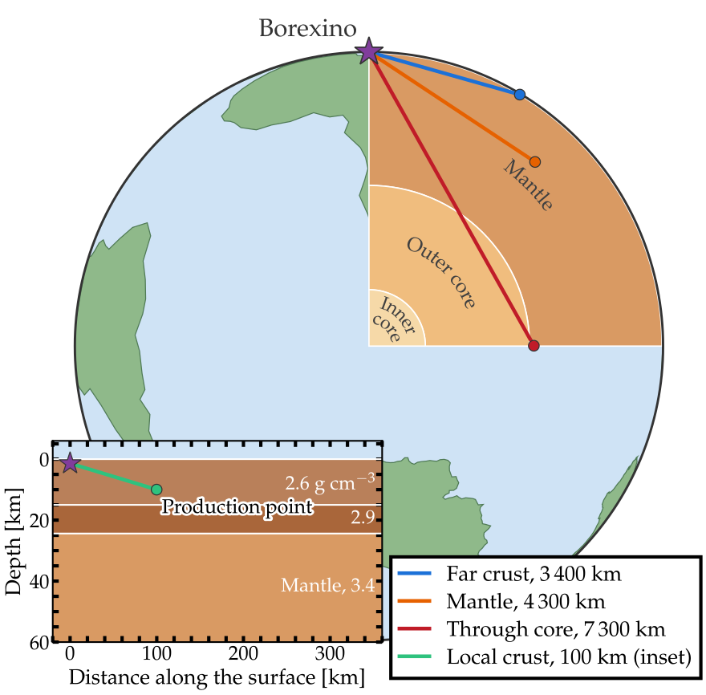

   **Geoneutrino geometry at Borexino.** The geometry of a geoneutrino measurement at Borexino, at Gran Sasso, 1.4 km underground. A quarter of the Earth is cut away to expose the PREM layers of Figure :ref:`The Earth’s density profile <ex-fig-prem>`. Three chords reach production points beyond the local crust: in the far crust, 20 km deep and 3 400 km away; in the mantle, 1 000 km deep and 4 300 km away; and at the base of the mantle, 2 800 km deep and 7 300 km away, on a path through the outer core. The inset shows the local crust, to scale in distance and stretched in depth, with the crust layers of PREM and a production point 10 km deep and 100 km away. See notebook `#28 <https://github.com/mbustama/Magnus/blob/main/notebooks/28_magnus_paper_figures.ipynb>`__ and :ref:`ex-sec-geoneutrinos` for details.

Geoneutrinos are the :math:`\bar{\nu}_e` emitted in the decay chains of uranium-238 and thorium-232 inside the Earth  :cite:p:`Bellini:2013wsa`. Inverse beta decay detects them above 1.8 MeV; the uranium chain ends at 3.3 MeV, so that window holds the whole detectable spectrum. The sources are the crust and the mantle. Uranium and thorium are lithophile elements: they concentrate in silicate rock in the crust and the mantle; the metallic core contains neither. Potassium-40, the one radioactive nuclide sometimes assigned to the core, emits below the energy detection threshold. The core still enters the calculation, though, as the medium that neutrinos from the far side of the mantle cross. For a detector at or near the surface, the production points lie from a few km to a full Earth diameter away. As example, we take Borexino as the detector, located at Gran Sasso, 1.4 km underground.

Figure :ref:`Geoneutrino geometry at Borexino <ex-fig-geoneutrinos>` shows the setup. Four production points illustrate the four kinds of path a geoneutrino takes to Borexino. One lies in the local crust, 10 km deep and 100 km away, drawn in the inset. One lies in the far crust, 20 km deep and 3 400 km away, on a path that dips into the upper mantle. One lies in the mantle, 1 000 km deep and 4 300 km away. The last lies at the base of the mantle, 2 800 km deep and 7 300 km away, on a path through the outer core.

.. _ex-fig-geoneutrino-energy:

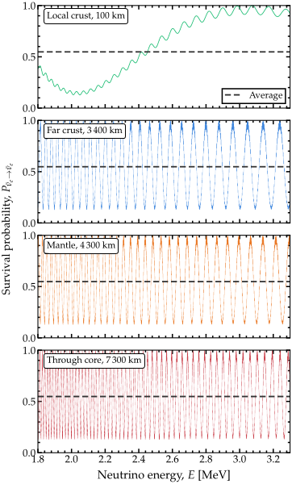

   **Geoneutrino survival against energy.** Survival probability of geoneutrinos reaching Borexino, against energy, from the four production points of Figure :ref:`Geoneutrino geometry at Borexino <ex-fig-geoneutrinos>`. Every curve resolves the pair split by :math:`\Delta m^2_{31}`; it rides on the pair split by :math:`\Delta m^2_{21}` as a fine ripple. The average marked across every panel is the phase average in vacuum, 0.548; matter raises it along these chords by 0.3–0.8%, less than the width of the line. Listing :ref:`Geoneutrino survival against energy <ex-lst-geoneutrinos>` computes the four panels. See notebook `#28 <https://github.com/mbustama/Magnus/blob/main/notebooks/28_magnus_paper_figures.ipynb>`__ and :ref:`ex-sec-geoneutrinos` for details.

Figure :ref:`Geoneutrino survival against energy <ex-fig-geoneutrino-energy>` shows the survival probability against energy for these four production points. From the local crust, the pair split by :math:`\Delta m^2_{21}`—the slow pair—completes three quarters of a cycle across the window; the pair split by :math:`\Delta m^2_{31}`—the fast pair—rides on it, 26 cycles across the window. From the far crust, the mantle and the base of the mantle, the slow pair alone cycles 26 to 56 times across the window; the fast pair, 900 to 1 900 times; the figure resolves both. A detector bins energy far more coarsely than that—which we do not show here—so a measurement of a distant reservoir sees instead the average probability.

In Figure :ref:`Geoneutrino survival against energy <ex-fig-geoneutrino-energy>`, the average value shown is the phase-average in vacuum, 0.548. Matter raises the average along these chords by 0.3–0.8%, less than the width of the line, so the vacuum value serves our calculation. The size of that shift follows from :doc:`averaged_probability`. The passage through Earth is adiabatic: the largest jump in the electron density, at the core-mantle boundary, changes the mixing in matter by less than a percent at these energies, so the neutrino stays in the eigenstate it was produced in. The average is then the equation in :doc:`averaged_probability` with :math:`P^{\rm cross}` the identity, fixed by the eigenbases at the two ends of the path alone. At both ends, the matter potential is a 1–2% of the vacuum splitting of the slow pair, so each of those eigenbases is the nearly the vacuum one. The route of :ref:`ex-sec-average-keyword` for a profile without declared discontinuities computes the average in matter. Along the mantle chord, with the density of PREM and the electron fraction of the mantle, next to the vacuum value, this is

.. code-block:: python

   from magnus.earth import (
    distance_traveled_inside_earth as chord,
    earth_radial_distance_from_depth as radius,
    density_matter_func_prem as prem,
    Y_E_MANTLE_PREM)

   osc = gd.load_nufit_params('NuFIT 6.1')
   c, depth = -0.552, 1000.0   # mantle chord
   geo = dict(source_depth=depth,
              detector_depth=1.4)          # km
   L = chord(c, **geo)                     # km
   def rho(l):   # PREM along the chord, g/cm^3
       r = radius(c, l/gd.UNIT_KM, **geo)
       return prem(r,
                   density_matter_ocean=2.65)
   E = 2.5*gd.UNIT_MEV
   P_m = oscprob.osc_prob_matter_std_potential(
    3, rho, E, L*gd.UNIT_KM, osc, average=True,
    nubar=True, nu_i=gd.NUE, nu_f=gd.NUE,
    electron_fraction=Y_E_MANTLE_PREM,
    density_matter_is_in_g_per_cm3=True)
   # 0.551
   P_v = oscprob.osc_prob_3nu_vacuum(E,
    L*gd.UNIT_KM, average=True, nubar=True,
    nu_i=gd.NUE, nu_f=gd.NUE)
   # 0.548

Listing :ref:`Geoneutrino survival against energy <ex-lst-geoneutrinos>` computes the panels of Figure :ref:`Geoneutrino survival against energy <ex-fig-geoneutrino-energy>`. The Earth wrapper ``osc_prob_3nu_earth`` is called without ``average=True``: it returns the resolved probability of the panels. With ``average=True`` it would instead take the energy-window route of :ref:`ex-sec-average-keyword`, because it declares the PREM boundaries itself; the result would be a window mean with a standard error of 0.05. A production point enters through its depth and the cosine of its zenith angle at the detector, with ``nubar=True``. Every chord crosses PREM boundaries, six from the far crust, nine through the core; the call to ``osc_prob_3nu_earth`` declares them to the refinement ladder internally. The ocean layer of PREM is replaced by rock via ``density_matter_ocean``, since Gran Sasso is a continental site. The last call in Listing :ref:`Geoneutrino survival against energy <ex-lst-geoneutrinos>` is the computation for the local crust. The production point sits at the end of its chord nearest to the detector, 100 km from it. The survival probability of a flavor is the same along a path and along its reverse, so the listing runs the segment from the detector to the production point, with the two depths in swapped roles and the zenith angle taken at the production point.

.. _ex-lst-geoneutrinos:

**Geoneutrino survival against energy.** The four panels of Figure :ref:`Geoneutrino survival against energy <ex-fig-geoneutrino-energy>`: the survival probability of a geoneutrino reaching Borexino from the far crust, the mantle, the base of the mantle, and the local crust, across the detectable window, on one energy grid fine enough to resolve the pair split by :math:`\Delta m^2_{31}` on the longest chord. The call declares the PREM boundaries on each chord by itself. The ocean layer of PREM is replaced by rock. The local production point is run in reverse, from the detector. See notebook `#28 <https://github.com/mbustama/Magnus/blob/main/notebooks/28_magnus_paper_figures.ipynb>`__ and :ref:`ex-sec-geoneutrinos` for details.

.. code-block:: python

   import numpy as np
   import magnus.oscprob as oscprob
   import magnus.globaldefs as gd

   # Twelve energies per cycle of the pair split by
   # Dm31^2 on the longest chord, 7,300 km
   E = 1/np.linspace(1/1.8, 1/3.3, 22500)*gd.UNIT_MEV

   # Borexino, 1.4 km underground.  A production point
   # enters as its depth and the cosine of its zenith
   # angle at the detector; the call declares the PREM
   # boundaries on the chord by itself.  The oscillation
   # parameters are the defaults, NuFIT 6.1.
   points = {'far crust': (20.0, -0.272),    # 3,400 km
             'mantle': (1000.0, -0.552),     # 4,300 km
             'core': (2800.0, -0.872)}       # 7,300 km
   P = {}
   for name, (depth, costhz) in points.items():
       P[name] = oscprob.osc_prob_3nu_earth(E,
        costhz=costhz, source_depth=depth*gd.UNIT_KM,
        detector_depth=1.4*gd.UNIT_KM, nubar=True,
        nu_i=gd.NUE, nu_f=gd.NUE,
        density_matter_ocean=2.65)

   # The local point, 10 km deep and 100 km away, sits
   # at the near end of its chord; the call runs every
   # chord from the far end.  The survival probability
   # is the same along a path and along its reverse, so
   # run the segment from the detector, with the depths
   # swapped and the zenith angle taken at the
   # production point.
   P['local'] = oscprob.osc_prob_3nu_earth(E,
    costhz=0.078, source_depth=1.4*gd.UNIT_KM,
    detector_depth=10.0*gd.UNIT_KM, nubar=True,
    nu_i=gd.NUE, nu_f=gd.NUE,
    density_matter_ocean=2.65)

.. _ex-fig-geoneutrino-flux:

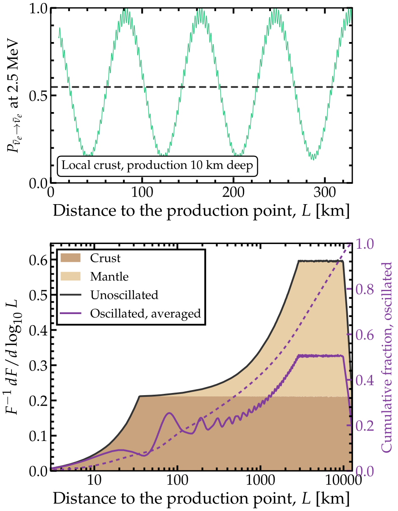

   **Where the geoneutrino flux comes from.** Where the detectable geoneutrino flux at Borexino comes from and what oscillations leave of it. *Top*: the survival probability at 2.5 MeV against the distance to a production point 10 km deep, across the local crust, with the pair split by :math:`\Delta m^2_{31}` resolved; the horizontal line is the phase average. *Bottom*: the distribution of the flux of Eq. :eq:`ex-equ-geoflux` in the distance to the production point, per unit :math:`\log_{10} L` and as a fraction of the total, for a spherically symmetric Earth with a 35-km crust holding 7 TW of radiogenic power, a mantle with the abundances of the geochemical model of Ref. :cite:p:`Bellini:2013wsa`, and no uranium or thorium in the core. The unoscillated curve has :math:`\langle P_{\bar\nu_e \to \bar\nu_e} \rangle = 1`; the shading splits it between the two reservoirs. The oscillated curve folds in the survival probability averaged over the detectable window with equal weight in energy; its cumulative fraction is on the right axis. See notebook `#28 <https://github.com/mbustama/Magnus/blob/main/notebooks/28_magnus_paper_figures.ipynb>`__ and :ref:`ex-sec-geoneutrinos` for details.

Figure :ref:`Where the geoneutrino flux comes from <ex-fig-geoneutrino-flux>` shows how the detectable flux is distributed over the distance to the production point and how much of it survives the oscillations. A flux measurement weighs the curves of Figure :ref:`Geoneutrino survival against energy <ex-fig-geoneutrino-energy>` by that distribution. The Earth model chosen for the figure is the simplest one that carries both reservoirs: a spherically symmetric crust 35-km thick holding 7 TW of radiogenic power at a thorium-to-uranium ratio of 4.5, a mantle with the abundances of the geochemical model of Ref. :cite:p:`Bellini:2013wsa`, no uranium or thorium in the core, and the density of PREM throughout. The flux at the detector is

.. math::
   :label: ex-equ-geoflux

   F = \int_\oplus d^3r \, \frac{\varepsilon(\mathbf{r})}{4 \pi L^2} \, \langle P_{\bar\nu_e \to \bar\nu_e} \rangle (L) \,, \qquad L = \lvert \mathbf{r} - \mathbf{r}_{\rm det} \rvert \,,

where :math:`\varepsilon(\mathbf{r})` is the number of detectable :math:`\bar{\nu}_e` emitted per unit volume and time at position :math:`\mathbf{r}`, fixed by the density of PREM and the abundances above. The survival probability from that point, :math:`\langle P_{\bar\nu_e \to \bar\nu_e}(L) \rangle`, is the mean over the detectable window, 1.8–3.3 MeV. In spherical coordinates centered on the detector, :math:`d^3r = L^2 \, dL \, d\Omega` and the :math:`L^2` cancels: the production points between :math:`L` and :math:`L + dL` contribute :math:`dL / 4\pi` times the emissivity integrated over the directions in which that shell lies inside the Earth. The lower panel of Figure :ref:`Where the geoneutrino flux comes from <ex-fig-geoneutrino-flux>` shows this distribution per unit :math:`\log_{10} L`, normalized to the total flux without oscillations, so that the area under a curve between two distances is the share of the flux from between them. In the unoscillated curve (normalized so :math:`\langle P_{\bar\nu_e \to \bar\nu_e} \rangle = 1`), 61% of the detectable flux comes from the crust, 17% from within 100 km, 30% from within 350 km, and 43% from within 1 000 km.

The oscillated curve is the same distribution multiplied by :math:`\langle P_{\bar\nu_e \to \bar\nu_e}(L) \rangle`, computed in two pieces. Up to 331 km, the probability is propagated through the crust with the last call of Listing :ref:`Geoneutrino survival against energy <ex-lst-geoneutrinos>`, once per distance on the grid, then averaged over the energy window. Beyond 331 km, the vacuum probability averaged over the same window is used instead: matter changes the average by 0.01 at that distance and by less farther out (Figure :ref:`Geoneutrino survival against energy <ex-fig-geoneutrino-energy>`). The upper panel shows the probability through the crust at 2.5 MeV, before the average: the slow pair oscillates every 84 km at and the fast pair every 2.5 km, as a ripple. In the lower panel, the oscillated curve still ripples out to a few hundred km, where the window holds too few cycles of the slow pair to average them out; farther out it is smooth. Over the whole Earth, oscillations leave 54% of the detectable flux.

.. _ex-sec-solar-tomography:

Neutrino tomography of the Sun
~~~~~~~~~~~~~~~~~~~~~~~~~~~~~~

.. _ex-fig-solar-adiabaticity:

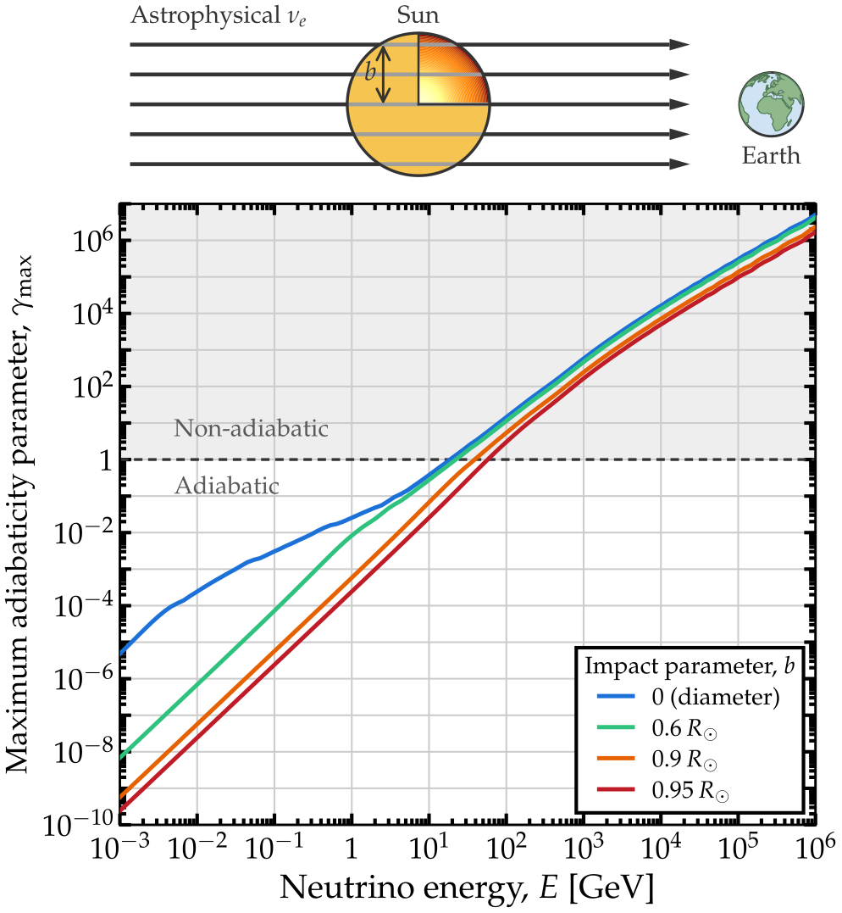

   **Adiabaticity along a solar chord.** *Top*: the setup. An isotropic flux of :math:`\nu_e` crosses the Sun and continues to Earth, where it may oscillate. The impact parameter :math:`b` is marked on one ray. *Bottom:* Adiabaticity of a neutrino trajectory through the Sun against neutrino energy, computed with Magνs on the B16-GS98 solar density profile  :cite:p:`Vinyoles:2016djt`, tabulated up to the surface, for four impact parameters, each defining a chord through the Sun. The parameter :math:`\gamma_{\rm max}` is the adiabaticity parameter of the equation in :doc:`averaged_probability`, evaluated at its maximum value along the chord and over the three pairs of eigenvalue levels. See notebook `#28 <https://github.com/mbustama/Magnus/blob/main/notebooks/28_magnus_paper_figures.ipynb>`__ and :ref:`ex-sec-solar-tomography` for details.

Neutrinos made outside the Solar System cross the Sun on their way to Earth. At around 10 MeV, they are mainly from the diffuse supernova neutrino background. From TeV to PeV, they are part of the high-energy astrophysical flux. Both fluxes are isotropic, so a share of each passes through the Sun before reaching a detector. Below, we compute what that does to their oscillations, using the B16-GS98 profile  :cite:p:`Vinyoles:2016djt` of Table :ref:`ex-tab-solar-models`. Unlike BS2005-AGS,OP, it is tabulated up to the solar surface, so every chord crosses the whole Sun.

A neutrino from such a source has traveled far enough that the wave packets of its mass eigenstates have separated. What arrives is an incoherent mixture, so what is measured is the phase-averaged probability of :doc:`averaged_probability` instead of the instantaneous one. Inside the Sun, the Hamiltonian changes along the path, so the phase average is carried along it (:doc:`averaged_probability`). The neutrino starts decohered in the eigenbasis at the point of entry and follows the instantaneous eigenstates. It crosses each non-adiabatic region through a Magnus patch and is read out in flavor at exit. Where no crossing is non-adiabatic, the result is the equation in :doc:`averaged_probability`, with the level-crossing matrix :math:`P^{\rm cross}` between the eigenbases at entry and exit.

Both ends of the path lie in vacuum, where the eigenvectors are the vacuum mixing matrix, so :math:`\mathbb{V}(l_0) = \mathbb{V}(l_1) = \mathbb{U}` in the equation in :doc:`averaged_probability`. An adiabatic passage would make :math:`P^{\rm cross}` the identity. Equation (:doc:`averaged_probability`) would then collapse to the equation in :doc:`averaged_probability` evaluated in vacuum, leaving no trace of the Sun. Whether or not the passage is adiabatic depends on the energy, via the equation in :doc:`averaged_probability`.

A solar neutrino behaves differently: because it is born deep inside the Sun, at high density, it begins as a matter eigenstate. The adiabatic passage outward then maps it onto a single mass eigenstate. That is the MSW effect of :ref:`ex-sec-sun`. A neutrino crossing from outside meets the same density profile, but enters it as a vacuum mass eigenstate. Because the density vanishes at both ends of that path, adiabatic passage keeps the neutrino in one eigenstate of the instantaneous :math:`\mathbb{H}` and returns it to the mass eigenstate it entered with. What separates the two cases is where each path begins and ends.

Figure :ref:`Adiabaticity along a solar chord <ex-fig-solar-adiabaticity>` shows how adiabatic the passage is, from MeV to PeV, for four choices of the impact parameter at which the neutrinos hit the Sun, and assuming three flavors. Equation (:doc:`averaged_probability`) attaches an adiabaticity parameter :math:`\gamma_{jk}(l)` to every pair of eigenvalues (1-2, 1-3, 2-3) of :math:`\mathbb{H}` at every point :math:`l` of the trajectory. It is large where two of those eigenvalues approach each other and small where they stay apart. The figure plots :math:`\gamma_{\rm max}`, the largest value found anywhere along the chord and over all three pairs, so a curve above one means the neutrino moves between eigenstates of :math:`\mathbb{H}` somewhere on its way through. The parameter can be computed using the ``adiabatic`` module of Magνs:

.. code-block:: python

   import numpy as np
   import magnus.adiabatic as adiabatic
   import magnus.hamiltonians as ham
   import magnus.matter as matter
   import magnus.globaldefs as gd
   import magnus.solarmodels as solarmodels

   R = gd.SUN_RADIUS*gd.UNIT_KM
   ne_sun = solarmodels.electron_density_profile(
       'B16-GS98')
   b = 0.3*R                # impact parameter
   half = np.sqrt(R**2 - b**2)
   E = 100.0*gd.UNIT_GEV
   hv = ham.hamiltonian_3nu_vacuum(E, **osc)

   def ne(l):
       """Electron density on the chord."""
       r = np.sqrt((l - half)**2 + b**2)
       return ne_sun(r)

   def H(l):
       """Hamiltonian at l along the chord."""
       h = np.array(hv, dtype=complex)
       h[0, 0] += matter.VCC_func(l, ne)
       return h

   info = {}
   adiabatic.find_nonadiabatic_windows(
       H, 0.0, 2*half, n_probe=20000,
       info=info)
   info['gamma_max']        # 13.7460

Here, ``ne_sun`` is the B16-GS98 table, interpolated in its logarithm, ``ne`` evaluates it along the chord, and ``hv`` is the vacuum Hamiltonian at this energy. The value shown is for a :math:`100`-GeV neutrino crossing at an impact parameter of :math:`b = 0.3\,R_\odot`.

The parameter :math:`\gamma_{\rm max}` grows with energy because the vacuum splitting :math:`\Delta m^2/2E` shrinks while the matter potential in the Sun stays fixed. It is attained just inside the 1-2 resonance, where the matter potential equals :math:`\Delta m^2_{21}\cos 2\theta_{12}/2E`, independently of the impact parameter. As the energy grows, that density is reached further out: :math:`\gamma_{\rm max}` sits at :math:`0.97\,R_\odot` at :math:`100` GeV, at :math:`0.990\,R_\odot` at 1 TeV, and at :math:`0.998\,R_\odot` at 100 TeV. By 1 PeV, it reaches :math:`5\times10^6` on the diameter. [Figure :ref:`Adiabaticity along a solar chord <ex-fig-solar-adiabaticity>` shows only the effect of oscillations; absorption, which matters above the GeV scale, is outside what Magνs models (:doc:`diagnostics`).]

.. _ex-fig-solar-tomography:

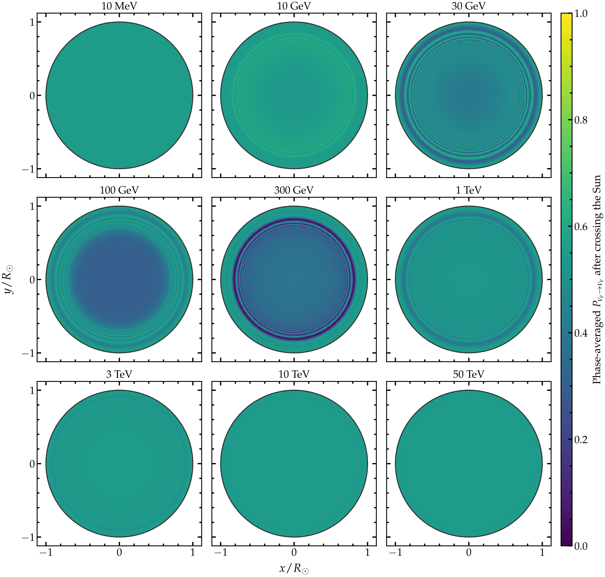

   **The Sun in the electron-neutrino channel.** The Sun seen face-on in the :math:`\nu_e` survival channel, computed with Magνs on the B16-GS98 solar density profile  :cite:p:`Vinyoles:2016djt`. The line of sight runs into the page, so each point of the disk is an impact parameter and the neutrino crosses the whole Sun along it. The color is the phase-averaged :math:`P_{\nu_e \to \nu_e}` at exit, for a relative energy spread of :math:`10\%`, averaged over the area of each pixel. See notebook `#28 <https://github.com/mbustama/Magnus/blob/main/notebooks/28_magnus_paper_figures.ipynb>`__ and :ref:`ex-sec-solar-tomography` for details.

Figure :ref:`The Sun in the electron-neutrino channel <ex-fig-solar-tomography>` shows the averaged survival probability across the face of the Sun, at selected energies. The line of sight runs into the page, so each point in the disk fixes the impact parameter of one trajectory, along which the neutrino crosses the whole Sun. For one impact parameter, the probability is computed via

.. code-block:: python

   import magnus.oscprob as oscprob

   # The chord above: b = 0.3 R_sun
   P = oscprob.osc_prob_matter_std_potential(
       3, ne, E, 2*half, average=True,
       average_initial_state='decohered',
       osc_params=osc, L0=0.0, nu_i=gd.NUE,
       nu_f=gd.NUE,
       density_is_of_number_of_electrons=True)
   P                        # 0.304987

Here, ``average=True`` returns the phase average along the chord, without sampling energies, for a neutrino that reaches the Sun decohered (i.e., as :math:`\nu_1`, :math:`\nu_2`, or :math:`\nu_3`). The choice of initial state (:ref:`ex-sec-average-keyword`) matters on this chord:

.. code-block:: python

   kw = dict(
       osc_params=osc, L0=0.0, nu_i=gd.NUE,
       nu_f=gd.NUE, average=True,
       density_is_of_number_of_electrons=True)
   f = oscprob.osc_prob_matter_std_potential
   for start in ('flavor', 'decohered'):
       P = f(3, ne, E, 2*half, **kw,
             average_initial_state=start)
       print(start, P)  # 0.541694, 0.304987

A :math:`\nu_e` produced at the edge of the Sun would keep the interference between :math:`\nu_1` and :math:`\nu_2`, whose phase across the Sun is only about 1 rad at 100 GeV. A neutrino from a distant source arrives without it, which is why Figure :ref:`The Sun in the electron-neutrino channel <ex-fig-solar-tomography>` uses ``'decohered'``. :ref:`ex-sec-averaging-is-not-estimating` shows why averaging a scan of probabilities does not necessarily reproduce this. (The phase average keeps the matter phase :math:`\int V_{\rm CC}\,dl`, :math:`8676` rad across the diameter. That phase does not depend on the energy, so no energy spread averages it. It draws rings in the core of the disk, :math:`1.8\times10^{-4}\,R_\odot` apart at :math:`b = 0.11\,R_\odot` and :math:`5.1\times10^{-4}\,R_\odot` apart at :math:`b = 0.3\,R_\odot`. At 1 TeV, they move :math:`P` by up to about :math:`\pm 0.03`. The value printed above sits on one of them: within one ring spacing of :math:`b = 0.3\,R_\odot`, :math:`P` ranges from 0.282 to 0.308. Each pixel of Figure :ref:`The Sun in the electron-neutrino channel <ex-fig-solar-tomography>` is therefore averaged over its area. The panels from 30 GeV to 3 TeV sample :math:`7\,773` impact parameters each, :math:`6\,772` of them inside :math:`b = 0.5\,R_\odot`.)

At :math:`10` MeV, the disk is uniform at about :math:`\sum_i |\mathbb{U}_{ei}|^4 \approx 0.55`: the Sun is transparent, exactly as :math:`P^{\rm cross} = \mathbb{1}` requires. At intermediate energies, rings appear, within the non-adiabatic region of Figure :ref:`Adiabaticity along a solar chord <ex-fig-solar-adiabaticity>`. They are drawn by the crossings: where the passage is not adiabatic, the level-crossing probabilities depart from the identity. The phase average also keeps part of the interference that the equation in :doc:`averaged_probability` discards. That interference changes the depth of the rings: at 300 GeV, the deepest one reaches :math:`P = 0.03` at :math:`b = 0.81\,R_\odot`, against :math:`0.20` in the equation in :doc:`averaged_probability`. From 300 GeV up, the deepest ring moves outward, to :math:`b = 0.89\,R_\odot` at 1 TeV and :math:`0.91\,R_\odot` at 10 and 50 TeV. At 50 TeV, the disk is uniform again, but for a different reason than at 10 MeV: a :math:`\nu_e` that enters the Sun leaves it as a :math:`\nu_e`, at every impact parameter. The Sun only adds a phase to it; the survival probability does not depend on that phase.

To be clear, no neutrino telescope resolves any of this structure. While the Sun has been imaged in MeV neutrinos, most famously by Super-Kamiokande, the width of that image is set by the angular resolution of the detector: the recoil electron of neutrino-electron elastic scattering carries the neutrino direction only to within tens of degrees, against a disk of half a degree. At tens of TeV, the angular resolution is better, but still comparable to the size of the disk itself. The rings of Figure :ref:`The Sun in the electron-neutrino channel <ex-fig-solar-tomography>` are a few arcseconds to a few arcminutes wide. The rings of the matter phase, over which each pixel is averaged, are :math:`0.2` to :math:`4` arcseconds apart. In addition, the panels of Figure :ref:`The Sun in the electron-neutrino channel <ex-fig-solar-tomography>` at GeV energies—where the rings first appear—lie in a band where no astrophysical neutrino flux has been identified above the atmospheric background.

.. _ex-sec-jet:

Astrophysical relativistic jet
~~~~~~~~~~~~~~~~~~~~~~~~~~~~~~

Gamma-ray bursts are the relativistic jets that some massive stars launch as they collapse. Shells of plasma ejected by the central engine collide with one another along the jet; protons accelerated at those collisions make neutrinos of TeV to PeV energies  :cite:p:`Bustamante:2014oka`. The jet itself does change their flavor composition: at the radii where the collisions happen, :math:`10^{13}`–:math:`10^{15}` cm, its density is around :math:`10^{-11}` g cm\ :math:`^{-3}`, nine orders of magnitude below the density at which a TeV neutrino resonates; the phase that the jet matter adds to the evolution is only :math:`10^{-4}`. Matter effects arise only while the jet is still inside the star, in the choked jets that never break out and in the precursor phase of the jets that do  :cite:p:`Mena:2006eq,Razzaque:2009kq,Sahu:2010ap,Varela:2014mma,Xiao:2015gea`. The neutrinos then cross the stellar envelope. Its density falls from about 1 g cm\ :math:`^{-3}` at the head of the jet to zero at the surface; somewhere along, neutrinos between :math:`100` GeV and :math:`100` TeV meet their 1-3 resonance. At the low energy end, the crossing is adiabatic and the neutrino leaves the star in a mass eigenstate; at the high end, it is not: the flavor content then survives. Therefore, the flavor ratios at Earth depend on the neutrino energy, in a way that reflects the density profile of the star  :cite:p:`Razzaque:2009kq,Xiao:2015gea`.

As example, we take a jet at :math:`r_0 = 6.3 \cdot 10^{10}` cm inside a blue supergiant of radius :math:`R_\star = 3 \cdot 10^{12}` cm, with the hydrogen envelope of Refs. :cite:p:`Mena:2006eq,Razzaque:2009kq`, :math:`\rho(r) = 3.3 \cdot 10^{-6}\,(R_\star/r - 1)^3` g cm\ :math:`^{-3}`, and an electron fraction of :math:`Y_e = 1`:

.. code-block:: python

   import numpy as np
   import magnus.globaldefs as gd
   import magnus.hamiltonians as ham
   import magnus.oscprob as oscprob

   OSC = gd.load_nufit_params('NuFIT 6.1')
   CM = 1.0e-5*gd.UNIT_KM   # One cm in eV^-1
   RSTAR = 3.0e12           # Star's radius, cm
   R0 = 6.3e10              # Jet head, cm

   def rho(l):
       """Density, g/cm3, at l in eV^-1."""
       return 3.3e-6*(RSTAR/(l/CM) - 1.0)**3

The density at the head is :math:`0.33` g cm\ :math:`^{-3}`. The oscillation length there is set by the potential, :math:`2\pi/V_{\rm CC} = 5 \cdot 10^{9}` cm, a tenth of :math:`r_0`, so the phase accumulated across the whole envelope is modest. The observable, the phase-averaged probability of the equation in :doc:`averaged_probability`, is built here from the evolution operator rather than from probabilities. The scenario functions return the operator alongside the probabilities when asked (``return_evolution_operator=True``), with the refinement ladder choosing the slabs internally:

.. code-block:: python

   E = 1.0*gd.UNIT_TEV
   out = oscprob.osc_prob_matter_std_potential(
       3, rho, E, RSTAR*CM, OSC, L0=R0*CM,
       electron_fraction=1.0,
       rtol=1.0e-6, atol=1.0e-6,
       density_matter_is_in_g_per_cm3=True,
       return_evolution_operator=True)
   P, U = out

Here, ``P`` is the probability matrix at the surface of the star and ``U`` is the evolution operator from the jet head to the surface, in the flavor basis.

.. _ex-fig-jet:

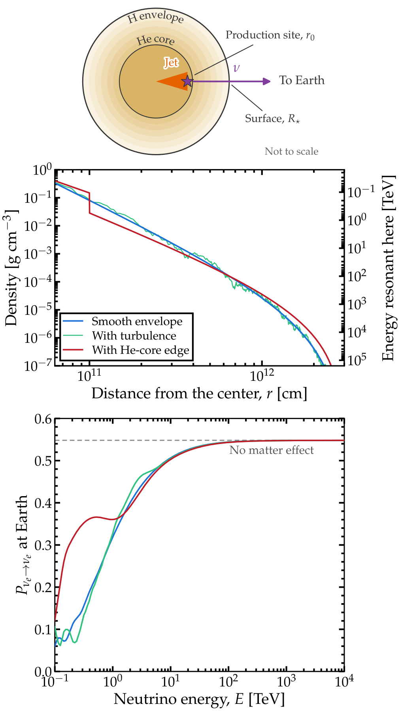

   **Jet neutrinos in a stellar envelope.** Neutrinos from a relativistic jet inside a collapsing star. *Top:* the setup. Neutrinos are made at the head of the jet, at :math:`r_0 = 6.3 \cdot 10^{10}` cm from the center, and leave the star at :math:`R_\star = 3 \cdot 10^{12}` cm. *Middle:* matter density along their path, for a smooth envelope, the same envelope with turbulence overlaid, and the same envelope with a drop in density at the edge of the helium core. The right axis gives the energy whose 1-3 resonance lies at each density. *Bottom:* probability that a :math:`\nu_e` produced at the jet head is detected as :math:`\nu_e` at Earth, against its energy, for the three envelopes. See notebook `#28 <https://github.com/mbustama/Magnus/blob/main/notebooks/28_magnus_paper_figures.ipynb>`__ and :ref:`ex-sec-jet` for details.

What a telescope detects is not the flavor content at the surface of the star: the neutrino travels a cosmological distance afterwards, over which the phases between its mass components average out, so it arrives as an incoherent mixture of mass eigenstates  :cite:p:`Razzaque:2009kq`. Its probability is the phase-averaged form of the equation in :doc:`averaged_probability`, with the eigenbasis at detection being the mixing matrix in vacuum, :math:`\mathbb{R}`. The factor in it that carries the star, the probability that a neutrino produced as :math:`\nu_\alpha` leaves it as the mass eigenstate :math:`\nu_i`, is read off the evolution operator as :math:`\lvert [\mathbb{R}^\dagger \mathbb{U}]_{i\alpha} \rvert^2`:

.. code-block:: python

   # Vacuum mass states; the content of each in
   # the state that leaves the star, by flavor
   hv = np.array(ham.hamiltonian_3nu_vacuum(
       E, **OSC), dtype=complex)
   w, R = np.linalg.eigh(hv)
   content = abs(R.conj().T @ U)**2

   # Phases average on the way to Earth
   P_earth = abs(R)**2 @ content
   P_earth[gd.NUE, gd.NUE]    # 0.315

Thus, the probability computed is :math:`P_{\nu_\alpha \to \nu_\beta} = \sum_i \left\lvert \left[ \mathbb{R}^\dagger\, \mathbb{U} \right]_{i\alpha} \right\rvert^2 \left\lvert \mathbb{R}_{\beta i} \right\rvert^2`. Without matter effects the same construction gives :math:`0.55`.

Figure :ref:`Jet neutrinos in a stellar envelope <ex-fig-jet>` shows this probability between 0.1 TeV and 10 PeV for three density envelopes. The neutrinos are not all made at the same point: the production region at the jet head is about one oscillation length across, so each curve averages over production points spread over that length. Without this average, the lowest energies would show an interference pattern, since their resonance lies only a few oscillation lengths from the head; a region of that size washes it out. The first envelope is the smooth profile above. The second overlays turbulence on it: a single realization of forty modes with a Kolmogorov spectrum, with wavelengths from :math:`10^{10}` to :math:`10^{12}` cm at a root-mean-square amplitude of twenty percent. The third is model C of Refs. :cite:p:`Mena:2006eq`, the same star with the density dropping by a factor of five at the edge of the helium core, :math:`r = 10^{11}` cm; in the code, that edge is declared to the ladder as a breakpoint. Listing :ref:`Jet neutrinos in a stellar envelope <ex-lst-jet>` is the calculation behind the figure.

.. _ex-lst-jet:

**Jet neutrinos in a stellar envelope.** Computing the data in Figure :ref:`Jet neutrinos in a stellar envelope <ex-fig-jet>`: the averaged :math:`\nu_e` survival probability at Earth for neutrinos from a jet head at :math:`r_0`, through the three envelopes. Each call returns the evolution operator from the refinement ladder alongside the probabilities; the projection onto the vacuum mass states and the sum over them are the equation in :doc:`averaged_probability`, with the eigenbasis at detection the vacuum one. The eight production points span one oscillation length at the jet head, :math:`4.9 \cdot 10^{9}` cm. The turbulent envelope is one realization of forty Kolmogorov modes between :math:`10^{10}` and :math:`10^{12}` cm at 20% rms; the stepped one is model C of Refs.  :cite:p:`Mena:2006eq`, with the drop at the helium-core edge declared through ``t_breakpoints``. See notebook `#28 <https://github.com/mbustama/Magnus/blob/main/notebooks/28_magnus_paper_figures.ipynb>`__ and :ref:`ex-sec-jet` for details.

.. code-block:: python

   import numpy as np
   import magnus.globaldefs as gd
   import magnus.hamiltonians as ham
   import magnus.oscprob as oscprob

   OSC = gd.load_nufit_params('NuFIT 6.1')
   CM = 1.0e-5*gd.UNIT_KM               # One cm in eV^-1
   RSTAR, R0, RHE = 3.0e12, 6.3e10, 1.0e11      # cm
   E = np.geomspace(0.1, 1.0e4, 161)*gd.UNIT_TEV

   # The three envelopes, g/cm3, r in cm
   def smooth(r):
       return 3.3e-6*(RSTAR/r - 1.0)**3

   rng = np.random.default_rng(7)        
   lam = np.geomspace(1.0e12, 1.0e10, 40)  # Modes, cm
   k = 2*np.pi/lam
   amp = k**(-1/3)                         # Kolmogorov
   amp *= 0.20/np.sqrt(0.5*np.sum(amp**2)) # 20% rms
   phi = rng.uniform(0.0, 2*np.pi, 40)
   def turbulent(r):
       d = np.sum(amp*np.cos(k*r + phi))
       return smooth(r)*(1.0 + d)

   def stepped(r):            # Mena et al., model C
       x = RSTAR/r - 1.0
       return 6.3e-6*(20.0*x**2.1 if r < RHE else x**2.5)

   # Production points spread over one oscillation
   # length at the jet head
   r0s = R0 + 4.9e9*np.arange(8)/8.0

   def p_earth(rho, **extra):
       """P at Earth, Eq. (26), averaged over the
       production points."""
       P_out = np.zeros((len(E), 3, 3))
       for r0 in r0s:
           P, U = oscprob.osc_prob_matter_std_potential(
               3, lambda l: rho(l/CM), E, RSTAR*CM, OSC,
               L0=r0*CM, electron_fraction=1.0,
               density_matter_is_in_g_per_cm3=True,
               rtol=1.0e-6, atol=1.0e-6,
               return_evolution_operator=True, **extra)
           for i, e in enumerate(E):
               hv = np.array(ham.hamiltonian_3nu_vacuum(
                   e, **OSC), dtype=complex)
               w, R = np.linalg.eigh(hv)
               content = abs(R.conj().T @ U[i])**2
               P_out[i] += abs(R)**2 @ content/len(r0s)
       return P_out

   P_smooth = p_earth(smooth)
   P_turb = p_earth(turbulent)
   P_step = p_earth(stepped, t_breakpoints=[RHE*CM])
   # Drawn: P_smooth[:, gd.NUE, gd.NUE], and the others

The smooth envelope sets the trend. At 0.1 TeV, a :math:`\nu_e` leaves the star mostly as :math:`\nu_3`—which has the least electron content among the three mass eigenstates—and so is rarely detected as :math:`\nu_e`. With rising energy, the survival probability climbs to its vacuum value, reached at 100 TeV. The reason is where the resonance sits. A neutrino of higher energy resonates farther out, where the density falls more gently, but its oscillation length grows faster than that gain, so the crossing becomes abrupt and the flavor content survives it. The PeV neutrinos that IceCube detects come out of the star as if it were not there.

Turbulence shifts the smooth curve by up to 0.05 below a few TeV. Those are the energies whose resonance lies where the modes of the realization match the local oscillation length; the mechanism is that of :ref:`ex-sec-turbulence`. The drop at the helium-core edge has a larger effect. The energies whose resonance density lies inside the drop, 0.15–0.7 TeV, do not cross the resonance gradually: they meet it in one jump, at the edge, so the crossing is non-adiabatic regardless of the energy and the flavor content survives. The result is the low-energy plateau in the probability seen in Figure :ref:`Jet neutrinos in a stellar envelope <ex-fig-jet>`. Above the band, the two envelopes agree again.

Each envelope costs a few minutes for the energies drawn and the eight production points averaged. The ladder settles on a few thousand slabs per energy at the tolerance requested (:math:`10^{-6}`), with the helium-core edge declared to it as a breakpoint.

.. _ex-sec-lri-sun:

Long-range interactions in the Sun
~~~~~~~~~~~~~~~~~~~~~~~~~~~~~~~~~~

.. _ex-fig-solar-lri:

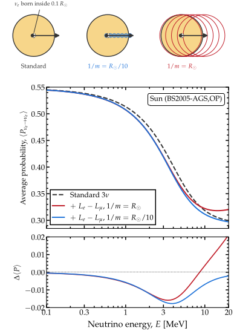

   **A long-range force in the Sun.** Phase-averaged survival probability of a solar neutrino under a long-range :math:`L_e - L_\mu` interaction sourced by the electrons of the Sun. *Top:* what each mediator range lets the neutrino feel. A :math:`\nu_e` born inside :math:`0.1\,R_\odot` leaves along the ray drawn; the discs are the electrons within :math:`1/m` of it as it goes. The charged-current potential is local and carries no disc; at :math:`1/m = R_\odot/10` the neutrino feels a narrow tube; at :math:`1/m = R_\odot` it feels most of the Sun at once, and past the surface. *Middle:* :math:`\langle P_{\nu_e \to \nu_e}\rangle` along a radial ray of the BS2005-AGS,OP model of Figure :ref:`The averaged solar survival probability <ex-fig-solar>`, without the new potential and with it at the two ranges. The coupling is fixed separately for each range so that :math:`V_{e\mu}` is a tenth of :math:`V_{\rm CC}` at the center; the two curves then differ only through the shape of the potential along the ray. *Bottom:* the difference from the standard case. See notebooks `#19 <https://github.com/mbustama/Magnus/blob/main/notebooks/19_magnus_custom_hamiltonian.ipynb>`__ and `#28 <https://github.com/mbustama/Magnus/blob/main/notebooks/28_magnus_paper_figures.ipynb>`__ and :ref:`ex-sec-lri-sun` for details.

This example adds to the Hamiltonian a term that Magνs does not ship, written as :ref:`ex-sec-building-new-hamiltonian` describes, then carries it through the same averaging machinery as the standard solar case of :ref:`ex-sec-sun`. The term comes from gauging :math:`L_e - L_\mu`, the difference of the electron and muon lepton numbers, an anomaly-free combination that admits a new light gauge boson :math:`Z'` that acts as a new mediator  :cite:p:`He:1990pn,Foot:1994vd`. The charge :math:`Q \equiv L_e - L_\mu` is :math:`+1` for the electron and :math:`\nu_e`, :math:`-1` for the muon and :math:`\nu_\mu`, zero for every other field of the Standard Model, so the electrons of a body source a potential that the three neutrino flavors feel differently, via the Hamiltonian

.. math::
   :label: ex-equ-h3-lri

   \mathbb{H}^{\rm LRI}(E, l)
   =
   \frac{\mathbb{A}}{E} + V_{\rm CC}(l)\,\mathbb{P}
   + V_{e\mu}(l)\,{\rm diag}\left(1, -1, 0\right) \;,

where the first two terms are the vacuum and charged-current matter terms of :doc:`conventions`; the third is the modification.

The new potential is non-local. An electron sources a Yukawa potential centered on its own position, so a neutrino at :math:`\mathbf{r}` feels an integral over the electrons around it,

.. math::
   :label: ex-equ-yukawa

   V_{e\mu}(\mathbf{r})
   =
   \frac{g^{\prime 2}}{4\pi}
   \int d^3r^\prime \, n_e(\mathbf{r}^\prime) \,
   \frac{e^{-m \lvert \mathbf{r} - \mathbf{r}^\prime \rvert}}
   {\lvert \mathbf{r} - \mathbf{r}^\prime \rvert} \;,

with :math:`g^\prime` the new gauge coupling and :math:`m` the mediator mass. Where :math:`V_{\rm CC}` reads the density at the neutrino’s own position, Eq. :eq:`ex-equ-yukawa` reaches every electron within about :math:`1/m` of it. At mediator masses light enough for that range to span the body, the potential depends on how many electrons the body holds and only weakly on where they sit  :cite:p:`Wise:2018rnb`. For a spherical body, like the Sun, the angular integral is elementary; Eq. :eq:`ex-equ-yukawa` then splits into an interior and an exterior piece,

.. math::
   :label: ex-equ-yukawa-1d

   \begin{split}
   V_{e\mu}(r)
   = {} &
   \frac{g^{\prime 2}}{r}\, e^{-m r}
   \int_0^{r} dr^\prime\, r^{\prime 2}\, n_e(r^\prime)\, {\rm shc}(m r^\prime) \\
   & + g^{\prime 2}\, {\rm shc}(m r)
   \int_r^{R_\odot} dr^\prime\, r^\prime\, n_e(r^\prime)\, e^{-m r^\prime} \;,
   \end{split}

with :math:`{\rm shc}(x) \equiv \sinh(x)/x` and :math:`m \equiv m_{Z'}`. Both integrals run over the density profile, so one pass over the table of densities of a solar model serves every position along the ray. The form also holds for a massless mediator: as :math:`m \to 0`, both :math:`{\rm shc}` and the exponential tend to 1, leaving the Coulomb-like potential of the electrons enclosed within :math:`r` and of those outside it. Notebook #19 derives Eq. :eq:`ex-equ-yukawa-1d` and checks its evaluation against the closed form that a uniform ball has at any mediator mass.

Listing :ref:`A long-range force in the Sun <ex-lst-arbitrary>` is the calculation behind Figure :ref:`A long-range force in the Sun <ex-fig-solar-lri>`. The electron density is the BS2005-AGS,OP table of Figure :ref:`The averaged solar survival probability <ex-fig-solar>`. The potential is Eq. :eq:`ex-equ-yukawa-1d` on that table at two mediator ranges, :math:`1/m = R_\odot` and :math:`R_\odot/10`, i.e., :math:`m  = 2.8 \cdot 10^{-16}` and :math:`2.8 \cdot 10^{-15}` eV, respectively. The coupling is fixed separately for each so that :math:`V_{e\mu}` is a tenth of :math:`V_{\rm CC}` at the center. What then differs between the two is only the shape of the potential along the ray. The Sun makes that difference large: its electron density falls by five orders of magnitude from the center to the surface, so :math:`V_{\rm CC}` falls with it, while :math:`V_{e\mu}`, an integral over the whole body, does not. With the objects of the listing, at half a solar radius,

.. code-block:: python

   half = np.searchsorted(r, 0.5*R_SUN)
   v_emu[1.0][half]/vcc[half]     # 2.49
   v_emu[0.1][half]/vcc[half]     # 0.38

The longer-ranged potential is about :math:`2.5\,V_{\rm CC}` and the shorter-ranged one, :math:`0.4\,V_{\rm CC}`. Both started at :math:`0.1\,V_{\rm CC}` at the center, so both have fallen less steeply than :math:`V_{\rm CC}` itself. At the surface, where :math:`V_{\rm CC}` has all but vanished, the shorter-ranged potential is :math:`6\,V_{\rm CC}` and the longer-ranged one, :math:`10^3\,V_{\rm CC}`. The sketch atop Figure :ref:`A long-range force in the Sun <ex-fig-solar-lri>` shows why: at :math:`1/m = R_\odot` the neutrino feels most of the Sun at once, wherever it is.

The Hamiltonian is one function returning the sum of the three terms, written to take an array of positions so that the engine evaluates it once per slab rather than once per quadrature node (:doc:`performance`). The averaged probability comes from the same call that serves the standard case, since nothing in it asks what the Hamiltonian contains. At :math:`10` MeV,

.. code-block:: python

   i = np.argmin(abs(Es - 10.0*gd.UNIT_MEV))
   P_std[i]                      # 0.318
   P_lri[1.0][i], P_lri[0.1][i]  # 0.322, 0.311

.. _ex-lst-arbitrary:

**A long-range force in the Sun.** Computing the data in Figure :ref:`A long-range force in the Sun <ex-fig-solar-lri>`: the :math:`L_e - L_\mu` interaction of Eq. :eq:`ex-equ-h3-lri` in the Sun. The electron density is read from the BS2005-AGS,OP table  :cite:p:`Bahcall:2004pz`; :math:`V_{e\mu}` is Eq. :eq:`ex-equ-yukawa-1d` on that table, with the coupling fixed so that it is a tenth of :math:`V_{\rm CC}` at the center. The vacuum and matter terms come from the shipped builders; the new term is the one line written here. The averaged probability of the equation in :doc:`averaged_probability` is the same ``average=True`` the wrappers take, on the direct route. See notebooks `#19 <https://github.com/mbustama/Magnus/blob/main/notebooks/19_magnus_custom_hamiltonian.ipynb>`__ and `#28 <https://github.com/mbustama/Magnus/blob/main/notebooks/28_magnus_paper_figures.ipynb>`__, and :ref:`ex-sec-lri-sun` for details.

.. code-block:: python

   import numpy as np
   import magnus.globaldefs as gd
   import magnus.hamiltonians as hamiltonians
   import magnus.matter as matter
   import magnus.oscprob as oscprob

   osc = gd.load_nufit_params('NuFIT 6.1')

   # The BS2005-AGS,OP model: radius, density in g/cm3
   # and hydrogen mass fraction are columns 1, 3 and 6
   rows = [l.split() for l in open('bs05_agsop.dat')]
   tab = np.array([[float(x) for x in f] for f in rows
                   if len(f) == 12 and f[0][0].isdigit()])
   r = tab[:, 1]*gd.SUN_RADIUS*gd.UNIT_KM
   R_SUN = r[-1]                       # Table's last row
   m_N = 0.5*(gd.MASS_PROTON + gd.MASS_NEUTRON)
   n_e = tab[:, 3]*gd.UNIT_G_PER_CM3/m_N
   n_e = n_e*(1.0 + tab[:, 6])/2.0     # Electrons/nucleon
   vcc = matter.VCC_func(0.0, lambda l: 1.0)*n_e

   def vcc_sun(l):
       """V_CC at l, log-linear between table rows."""
       return np.exp(np.interp(l, r, np.log(vcc)))

   def cumulative(y, x):
       """Running trapezoidal integral, zero at x[0]."""
       steps = 0.5*(y[1:] + y[:-1])*np.diff(x)
       return np.concatenate([[0.0], np.cumsum(steps)])

   def shc(x):
       """sinh(x)/x, equal to 1 at the origin."""
       x = np.asarray(x, dtype=float)
       return np.divide(np.sinh(x), x, out=np.ones_like(x),
                        where=(x != 0.0))

   def long_range_potential(r, n_e, m):
       """Eq. (35): V_emu(r)/g'^2, spherical n_e."""
       I_in = cumulative(r**2*n_e*shc(m*r), r)
       I_out = cumulative(r*n_e*np.exp(-m*r), r)
       I_out = I_out[-1] - I_out      # From r outward
       r_safe = np.where(r > 0.0, r, 1.0e-30)
       return np.exp(-m*r)*I_in/r_safe + shc(m*r)*I_out

   # Two mediator ranges.  g'^2 is fixed so that V_emu is
   # a tenth of V_CC at the center in both cases.
   v_emu = {}
   for frac in (1.0, 0.1):            # 1/m in R_sun
       v = long_range_potential(r, n_e, 1.0/(frac*R_SUN))
       v_emu[frac] = 0.1*vcc[0]/v[0]*v

   # The standard part from the shipped builders; the
   # new term is the only line written here
   h_vac = hamiltonians.\
       hamiltonian_3nu_vacuum_energy_independent(**osc)
   q = np.diag([1.0, -1.0, 0.0])     # L_e-L_mu charges

   def H_lri(v):
       """Eq. (33) with V_emu = v on r, as H(E, l)."""
       def H(E, l):
           h_matt = hamiltonians.hamiltonian_3nu_matter_td(
               l, vcc_sun)
           return (h_vac/E + h_matt
                   + np.interp(l, r, v)[..., None, None]*q)
       return H
   Es = np.logspace(-1.0, np.log10(20.0), 70)*gd.UNIT_MEV

   def averaged(v):
       """<P_ee> from the center to the surface, per E."""
       return oscprob.osc_prob_energy_baseline(
           H_lri(v), Es, R_SUN, 0.0, nu_i=gd.NUE,
           nu_f=gd.NUE, average=True)

   P_std = averaged(0.0*vcc)
   P_lri = {frac: averaged(v_emu[frac]) for frac in v_emu}

Figure :ref:`A long-range force in the Sun <ex-fig-solar-lri>` shows the average survival probability in an energy sweep from 0.1 to 20 MeV. Both potentials shift the averaged probability by up to 2%, but they are not mere rescalings of one another. The shorter-ranged one samples the profile where it falls fastest and lowers the probability across the whole range. The longer-ranged one lowers it below about 9 MeV and raises it above, so at the top of the energy range the two curves sit on opposite sides of the standard one.

.. _ex-sec-turbulence:

Turbulent matter profile
~~~~~~~~~~~~~~~~~~~~~~~~

.. _ex-fig-turbulence-rabi:

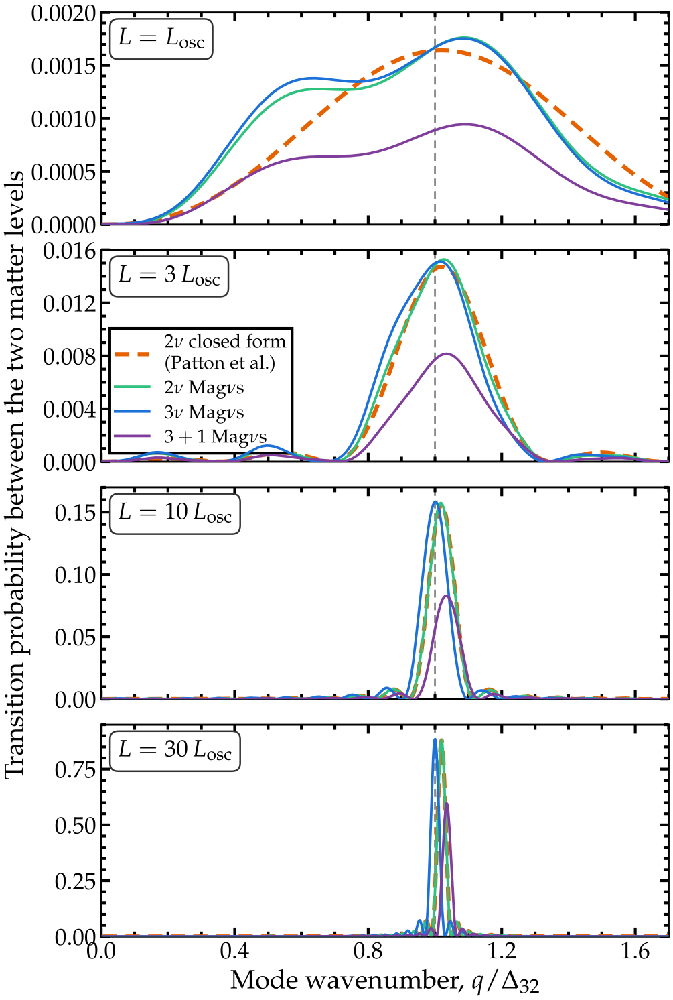

   **A density mode against its closed form.** Probability of transition between two matter levels coupled by a single density mode, against the wavenumber of the Fourier mode of the matter density in the medium, for a 5-GeV neutrino in a region of mean density :math:`\rho_0 = 4` g cm\ :math:`^{-3}` carrying one mode of amplitude :math:`C = 0.03`. The panels are region lengths of :math:`1`, :math:`3`, :math:`10`, and :math:`30\,L_{\rm osc}`, with :math:`L_{\rm osc} = 2\pi/\Delta_{32} = 10\,938` km the oscillation length driven by the 2-3 sector. The closed form of Refs.  :cite:p:`Patton:2013dba,Patton:2014lza`, Eq. :eq:`ex-equ-turb-rabi`, is evaluated for the two-flavor reduction of the 1-3 sector; Magνs is run at two, three, and four flavors, the last with :math:`\sin^2\theta_{14} = \sin^2\theta_{24} = 0.10` and :math:`\Delta m^2_{41} = 1` eV\ :math:`^2`. The levels are those of the mean density, between which no transition occurs without the mode. See notebook `#28 <https://github.com/mbustama/Magnus/blob/main/notebooks/28_magnus_paper_figures.ipynb>`__ and :ref:`ex-sec-turbulence` for details.

.. _ex-fig-turbulence:

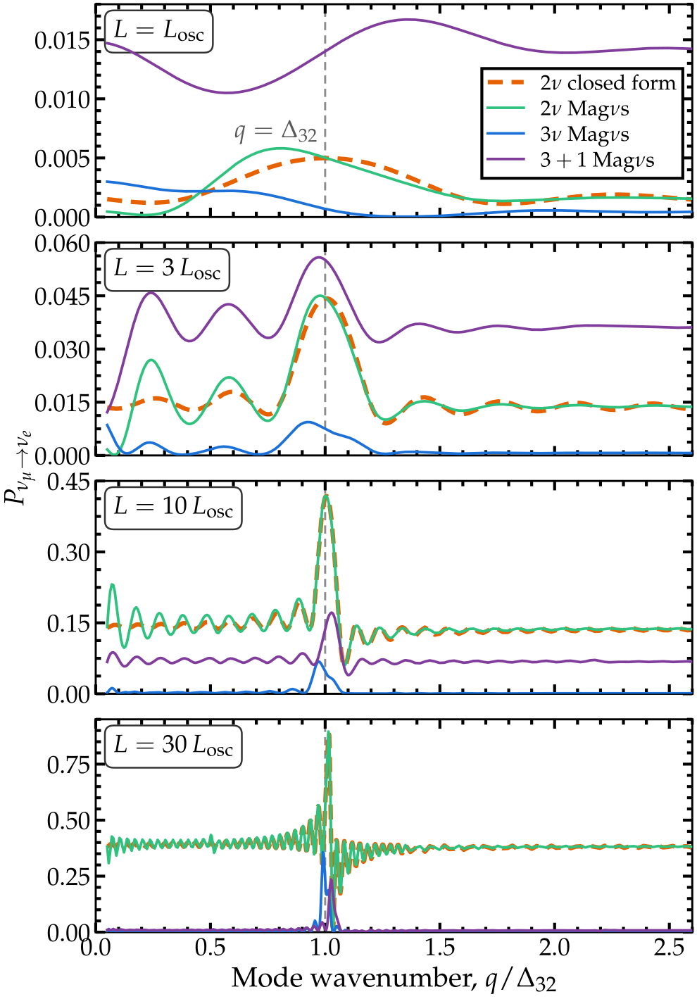

   **The same mode in the flavor channel.** Flavor transition probability :math:`P_{\nu_\mu \to \nu_e}` for the same neutrino, medium, mode, and region lengths as Figure :ref:`A density mode against its closed form <ex-fig-turbulence-rabi>`, at two, three, and four flavors. The line labeled :math:`q = \Delta_{32}` marks the mode that matches the three-flavor gap; the two- and four-flavor gaps lie a few percent away from it. The curves sit at different heights because the three flavor counts give different probabilities over the same region even without the mode. The closed-form curve is Eq. :eq:`ex-equ-turb-rw-flavor`, the flavor probability built from the propagator behind Eq. :eq:`ex-equ-turb-rabi`, for the same two-flavor system as in Figure :ref:`A density mode against its closed form <ex-fig-turbulence-rabi>`. See notebook `#28 <https://github.com/mbustama/Magnus/blob/main/notebooks/28_magnus_paper_figures.ipynb>`__ and :ref:`ex-sec-turbulence` for details.

Matter behind a supernova shock does not settle: convection keeps stirring it. Its density fluctuates around its mean value by tens of percent, over a range of length scales spanning from the size of the star to far below it  :cite:p:`Loreti:1995ae,Schirato:2002tg,Fogli:2006xy,Patton:2013dba,Patton:2014lza`. Therefore, an escaping neutrino meets a profile with a density that has a regular component—decreasing with distance from the center—and a random component overlaid on it. In the Fourier decomposition of that random component, a mode of wavenumber :math:`q` moves neutrinos between a pair of eigenstates of :math:`\mathbb{H}` when :math:`q` coincides with the eigenvalue gap :math:`\Delta_{jk} = \lambda_j - \lambda_k`, the random density mode playing the role that an oscillating field plays in parametric resonance (:doc:`methodology`).

References  :cite:p:`Patton:2013dba,Patton:2014lza` solved that problem in closed form. Treating the random component as a perturbation on the regular one and keeping the resonant term, they obtained a Rabi formula for the transition between the two levels,

.. math::
   :label: ex-equ-turb-rabi

   P_{jk}
   =
   \frac{\kappa^2}{p^2 + \kappa^2}\,
   \sin^2\!\left(\sqrt{p^2 + \kappa^2}\; L\right) ,
   \qquad
   p = \tfrac{1}{2}\left(\Delta_{jk} - q\right) ,

where :math:`L` is the length of the turbulent region and :math:`\kappa \equiv \tfrac{1}{2} C V_{\rm CC} \lvert U^m_{ej} U^m_{ek}\rvert` is the coupling induced between the two levels by a density mode :math:`\rho(l) = \rho_0 \left[1 + C \cos(q l)\right]`, with :math:`\rho_0` the mean density and :math:`U^m` the mixing matrix in matter. On resonance, where :math:`q = \Delta_{jk}`, the probability is :math:`\sin^2(\kappa L)`: the amplitude :math:`C` sets how long the region must be for complete conversion to occur.

As example, we consider a region of mean density :math:`\rho_0 = 4` g cm\ :math:`^{-3}` carrying one mode of amplitude :math:`C = 0.03`, crossed by a 5-GeV neutrino:

.. code-block:: python

   import numpy as np
   import magnus.globaldefs as gd
   import magnus.matter as matter
   import magnus.hamiltonians as ham

   OSC = gd.load_nufit_params('NuFIT 6.1')
   E = 5.0*gd.UNIT_GEV    # Neutrino energy
   RHO0 = 4.0             # Mean density, g/cm3
   C = 0.03               # Mode amplitude

   def one_mode(q):
       """Density along the ray: the mean, plus
       one mode of wavenumber q."""
       def rho(l):
           x = np.asarray(l, dtype=float)
           return RHO0*(1.0 + C*np.cos(q*x))
       return rho

The gaps of the Hamiltonian at :math:`\rho_0` fix the range of :math:`q` to scan:

.. code-block:: python

   # n_e and V_CC of the smooth medium
   ne0 = matter.num_density_e_func(
       0.0, lambda l: RHO0,
       density_matter_is_in_g_per_cm3=True)
   V0 = matter.VCC_func(0.0, lambda l: ne0)

   # H at the mean density: vacuum plus matter
   H0 = np.array(ham.hamiltonian_3nu_vacuum(
       E, **OSC), dtype=complex)
   H0 += ham.hamiltonian_3nu_matter(V0)

   # Eigenvalues w, matter eigenvectors Vm, and
   # the gap the mode has to match
   w, Vm = np.linalg.eigh(H0)
   d32 = abs(w[2] - w[1])
   LOSC = 2*np.pi/d32     # 10 938 km

Here, :math:`\Delta_{32}` is matched by a mode of wavelength :math:`L_{\rm osc} \equiv 2\pi/\Delta_{32} = 10\,938` km, the oscillation length of that pair of levels.

Equation (:eq:`ex-equ-turb-rabi`) gives the transition probability between two eigenstates of :math:`\mathbb{H}`\ :cite:p:`Patton:2013dba,Patton:2014lza`. The same quantity is contained in the evolution operator :math:`\mathbb{U}` of the equation in :doc:`conventions`, once :math:`\mathbb{U}` is written in the basis of those eigenstates: :math:`\lvert [\mathbb{U}]_{jk} \rvert^2` is the transition probability between levels :math:`k` and :math:`j`. If the density were constant, :math:`\mathbb{H}` would be the same at every point of the region; its eigenstates would then evolve independently of one another, so :math:`\lvert [\mathbb{U}]_{jk} \rvert^2` would vanish for :math:`j \neq k`. The Fourier mode makes the density vary along the region, so :math:`\mathbb{H}` varies with it. In the basis of the eigenstates at :math:`\rho_0`, that variation appears as the off-diagonal elements :math:`C V_{\rm CC} \cos(ql)\, U^{m*}_{ej} U^m_{ek}` of :math:`\mathbb{H}`. Those elements mix the levels as the neutrino advances, so :math:`\mathbb{U}` acquires off-diagonal elements too; :math:`\lvert [\mathbb{U}]_{jk} \rvert^2` is what that mixing amounts to over the whole region. Magνs returns :math:`\mathbb{U}`; rotating it into that basis is one line:

.. code-block:: python

   from magnus.oscprob import (
     compute_evolution_operator_multiple_slabs
     as chain)

   L = LOSC             # The region, one L_osc
   rho = one_mode(d32)  # Mode tuned to the gap

   def H(l):
       """H at position l, with the mode on."""
       h = np.array(ham.hamiltonian_3nu_vacuum(
           E, **OSC), dtype=complex)
       # V_CC follows the density
       return h + ham.hamiltonian_3nu_matter(
           V0*rho(l)/RHO0)

   # One operator per slab, then the ordered
   # product over the chain
   edges = np.linspace(0.0, L, 501)
   slabs = np.stack([edges[:-1], edges[1:]], 1)
   Us = chain(H, slabs, 9, 6)
   U = Us[0]
   for u in Us[1:]:     # Earliest slab first
       U = u @ U

   # Rotate to the matter basis, then read the
   # transition between levels 2 and 3
   P32 = abs((Vm.conj().T @ U @ Vm)[2, 1])**2
   P32                    # 0.001674

Figure :ref:`A density mode against its closed form <ex-fig-turbulence-rabi>` compares Eq. :eq:`ex-equ-turb-rabi` with Magνs at four lengths of the turbulent region; the closed form is evaluated for the two-flavor system it was derived for, the 1–3 sector, with :math:`\kappa` from the two-flavor :math:`\mathbb{U}^m` at :math:`\rho_0`. The closed form of Refs. :cite:p:`Patton:2013dba,Patton:2014lza` keeps only the part of the coupling that varies slowly along the trajectory; the part it discards averages out only over many of its own cycles. One :math:`L_{\rm osc}` (Figure :ref:`A density mode against its closed form <ex-fig-turbulence-rabi>`, top panel) contains too few of them, so the closed form and the two-flavor Magνs curve differ appreciably; the difference shrinks as the region lengthens (Figure :ref:`A density mode against its closed form <ex-fig-turbulence-rabi>`, bottom three panels). A third or fourth flavor changes the eigenvalue gap and moves the resonance to a different wavenumber, while the length of the region sets its width: the longer the region, the more closely the mode has to match the gap.

Figure :ref:`The same mode in the flavor channel <ex-fig-turbulence>` shows the associated oscillation probabilities :math:`P_{\nu_\mu \to \nu_e}`, computed via

.. code-block:: python

   import magnus.oscprob as oscprob

   kw = dict(
       nu_i=gd.NUMU, nu_f=gd.NUE,
       density_matter_is_in_g_per_cm3=True)

   # Two flavors: the 1-3 sector
   OSC2 = dict(sth=OSC['s13'], Dm2=OSC['D31'])
   P2 = oscprob.osc_prob_matter_std_potential(
       2, one_mode(d32), E, L, OSC2, **kw)

   # Three flavors
   P3 = oscprob.osc_prob_matter_std_potential(
       3, one_mode(d32), E, L, OSC, **kw)

   # The same call with a sterile state added
   OSC4 = dict(OSC, s14=np.sqrt(0.10), D41=1.0,
               s24=np.sqrt(0.10), s34=0.0,
               d14=0.0, d24=0.0)
   P4 = oscprob.osc_prob_matter_std_potential(
       4, one_mode(d32), E, L, OSC4, **kw)

In Figure :ref:`The same mode in the flavor channel <ex-fig-turbulence>`, the largest change of the probability sits around wavenumber, :math:`q = \Delta_{32}`. This is the resonance of Figure :ref:`A density mode against its closed form <ex-fig-turbulence-rabi>`, seen in the flavor channel; as there, it narrows as the region lengthens. Above :math:`\Delta_{32}` the curves are flat: a mode faster than every gap cancels its effect along the trajectory.

Figure :ref:`The same mode in the flavor channel <ex-fig-turbulence>` also shows the flavor probability that follows from the closed form. Near the resonance it follows the two-flavor Magνs curve, more closely the longer the region. At low wavenumber it does not: there it stays at the value of the smooth medium, while Magνs swings above it. That curve is built as follows. Equation (:eq:`ex-equ-turb-rabi`) is the modulus squared of one element of the propagator of the two-level system in the rotating-wave approximation, the solution behind the closed form  :cite:p:`Patton:2013dba,Patton:2014lza`. In the matter basis of the mean density, that propagator is

.. math::
   :label: ex-equ-turb-rw-u

   \tilde{\mathbb{U}}(L)
   =
   {\rm diag}\!\left(e^{iqL/2}, e^{-iqL/2}\right)
   \exp\!\left[
   -i L
   \begin{pmatrix}
   \bar\lambda - p & \kappa_c \\
   \kappa_c^* & \bar\lambda + p
   \end{pmatrix}
   \right] ,

where :math:`\bar\lambda = \tfrac{1}{2}(\lambda_1 + \lambda_2)` and :math:`p = \tfrac{1}{2}(\lambda_2 - \lambda_1 - q)` are the mean of the two levels and the detuning, while :math:`\kappa_c = \tfrac{1}{2} C V_{\rm CC}\, U^{m*}_{e1} U^m_{e2}` is the coupling, with :math:`\lvert \kappa_c \rvert = \kappa`. The matrix in the exponent is the Hamiltonian in the frame that rotates with the mode, in which it is constant; the first factor undoes that rotation. The flavor probability reads the same propagator with flavor indices,

.. math::
   :label: ex-equ-turb-rw-flavor

   P_{\nu_\mu \to \nu_e}
   =
   \left\lvert \left[ U^m\, \tilde{\mathbb{U}}(L)\, U^{m\dagger} \right]_{e\mu} \right\rvert^2 .

The matrix in Eq. :eq:`ex-equ-turb-rw-u` couples the two levels but does not move them: the rotating-wave approximation drops the part of the mode that raises and lowers the levels along with the density. At low wavenumber that part is all there is. Such a mode changes the density slowly; the levels follow it, with no transition driven between them. Equation (:eq:`ex-equ-turb-rw-u`) misses that effect, so its curve stays at the value of the smooth medium at low wavenumber.

.. _ex-sec-njobs:

Running a scan in parallel
--------------------------

A scan of many probabilities can be shared among processes. Every wrapper accepts the argument ``n_jobs`` for that, the number of processes to use, with ``n_jobs = 1`` as default:

.. code-block:: python

   import numpy as np
   import magnus.oscprob as oscprob
   import magnus.globaldefs as gd

   N = 5000
   E = np.logspace(-0.3, 1.3, N)*gd.UNIT_GEV
   L = np.linspace(2e3, 11467.8, N)*gd.UNIT_KM
   kw = dict(costhz=-0.9, rtol=1e-6, atol=1e-8,
             nu_i=gd.NUMU, nu_f=gd.NUMU)

   # Every point has its own baseline, so no
   # batched engine takes this scan
   P = oscprob.osc_prob_3nu_earth(
       E, L=L, n_jobs=4, **kw)

The first point in the scan runs by itself, in the main process. That run fixes the parameters. Its refinement ladder settles on two numbers: how many slabs the trajectory needs (:math:`N_{\rm slabs}`), and how many collocation points each slab needs to evaluate the Magnus expansion. Those two numbers become the starting floor for every later point, set two rungs below where the first point landed. Each worker then begins its ladder close to the answer. The rest of the scan goes to the workers. Each worker takes a chunk of consecutive points and computes them one after another. ``joblib`` picks the batch size, aiming for chunks that run between :math:`0.2` and :math:`2` s, so cheap points are gathered in bulk and an expensive point is handed over on its own.

Two conditions decide whether using ``n_jobs`` larger than 1 helps. The first is the shape of the scan. A batched engine answers only at ``n_jobs`` :math:`= 1`, so asking for more processes sends the request down the per-point path instead, which for a batchable scan is the slower of the two (:doc:`engines`). A scan whose points share one baseline should keep the default of ``n_jobs`` :math:`= 1` and let the batching of :ref:`ex-sec-batched-calls` do the work:

.. code-block:: python

   # One baseline for all energies: the batched
   # engine takes it, at the default n_jobs = 1
   P = oscprob.osc_prob_3nu_earth(
       E, L=11467.8*gd.UNIT_KM, **kw)

Parallelism is for scans that no batched engine accepts, such as the one above, where every energy carries a different baseline.

The second condition is length. Starting the workers costs time, paid once per call, so the scan has to be long enough to absorb this overhead. Measured on the scan above, four workers return :math:`2.4` times the speed of one process at :math:`5\,000` points, :math:`2.3` at :math:`2\,000` and :math:`1.8` at :math:`500`. A scan of a few hundred points called once can finish slower than it would have in a single process. :doc:`performance` and :doc:`performance` measure how that gain grows with the size of the scan and where it stops paying.

Parallelism changes more than the speed. A serial scan warm-starts each point from its neighbor. A parallel scan warm-starts every point from the first one. A ladder that starts on a different rung can stop on a different rung, so two runs that differ only in ``n_jobs`` agree to the tolerance asked for, but no better. The gap between them grows with the length of the scan. Measured on the chord above at ``rtol`` :math:`= 10^{-6}`, two points agree exactly, three differ by :math:`8 \cdot 10^{-10}`, and forty by :math:`10^{-8}`. Hold ``n_jobs`` fixed when two runs have to match to the last digit.

All of the above concerns a scan of several probabilities, which is the only thing ``n_jobs`` affects. A call for a single probability accepts it and ignores it. The slabs of one calculation go to the batched kernel in a single call, and no worker is started:

.. code-block:: python

   # Many points: each worker receives points
   P = oscprob.osc_prob_3nu_earth(
       E, L=L, n_jobs=4, **kw)

   # One point: n_jobs is accepted and does
   # nothing; the call runs in one process
   P = oscprob.osc_prob_3nu_earth(
       10.0*gd.UNIT_GEV, L=11467.8*gd.UNIT_KM,
       n_jobs=4, **kw)

(Distributing slabs was tried and retired. A slab is far smaller than a probability, and evaluating all of them in one batched call beats handing them out one at a time.)

.. _ex-sec-cli:

Using Magνs from the command line
---------------------------------

Magνs installs a console script, ``magnus``, that computes one probability, or one probability matrix, without writing Python. It chooses one of the wrappers of :doc:`functions` through three options, ``--flavors``, ``--environment``, and ``--scenario``. The physical inputs are options named after the arguments of the wrapper, e.g., ``--energy``, ``--baseline``, and ``--rho``, and the oscillation parameters default to the NuFIT 6.1 values. Listing :ref:`The command-line interface <ex-lst-cli>` shows two calls: the probability matrix of Listing :ref:`Vacuum and constant density, three ways <ex-lst-constant>`, in matter of constant density, and the :math:`\nu_\mu \to \nu_e` probability along the chord from Fermilab to Homestake. ``magnus --help`` and the documentation site  :cite:p:`MagnusDocs` list every option.

.. _ex-lst-cli:

**The command-line interface.** Two probabilities computed from the command line. The first call returns the probability matrix of Listing :ref:`Vacuum and constant density, three ways <ex-lst-constant>`, with a row for each initial flavor and a column for each final flavor. The second returns one channel along the chord from Fermilab to Homestake, whose length is computed from the two named locations. The oscillation parameters take their NuFIT 6.1 defaults. See :ref:`ex-sec-cli` for details.

.. code-block:: bash

   $ magnus --flavors 3 --environment matter \
       --density-profile constant --rho 3.0 \
       --energy 1 --baseline 1000
   Magνs 1.1.1 -- osc_prob_3nu_matter_constant_density
   E = 1 GeV, L = 1000 km

               nu_e   nu_mu  nu_tau
   nu_e      0.9855  0.0134  0.0012
   nu_mu     0.0135  0.9864  0.0001
   nu_tau    0.0011  0.0002  0.9987

   $ magnus --flavors 3 --environment earth \
       --loc-ini fermilab --loc-fin homestake \
       --energy 2.5 --nu-i mu --nu-f e
   Magνs 1.1.1 -- osc_prob_3nu_earth
   E = 2.5 GeV

   P = 0.0722

Every environment except the Earth needs ``--baseline``. Through the Earth, the pair ``--loc-ini`` and ``--loc-fin`` fixes both the chord and its length, as in the second call of Listing :ref:`The command-line interface <ex-lst-cli>`. The option ``--costhz`` fixes only the direction of the chord, so it needs ``--baseline`` beside it, or ``--detector-depth`` or ``--source-depth``, from which the length is computed.

The numerical settings are options too: ``--rtol`` and ``--atol`` set the tolerances of :doc:`methodology`, ``--magnus-exp-order`` and ``--integration-method`` the order and the quadrature rule of :doc:`methodology`, and ``--strategy`` the ``strategy`` keyword of :doc:`engines`. The tolerances default to :math:`10^{-3}`, as in the Python functions, whereas the figures on this page use :math:`{\tt rtol} = 10^{-8}` and :math:`{\tt atol} = 10^{-10}`. For the second call of Listing :ref:`The command-line interface <ex-lst-cli>`, tightening them to those values changes the probability by :math:`2 \cdot 10^{-10}`.

Adding ``--json`` prints the result as a JSON object instead, for use in a pipeline (Listing :ref:`Command-line output as JSON <ex-lst-cli-json>`). The object names the function that computed the result and the options that selected it, and gives the energy and the baseline in natural units.

.. _ex-lst-cli-json:

**Command-line output as JSON.** The :math:`\nu_\mu \to \nu_e` entry of the matrix of Listing :ref:`The command-line interface <ex-lst-cli>`, printed as JSON: the function that computed it, the options that selected that function, the energy and the baseline in natural units, and the probability. See :ref:`ex-sec-cli` for details.

.. code-block:: bash

   $ magnus --flavors 3 --environment matter \
       --density-profile constant --rho 3.0 \
       --energy 1 --baseline 1000 \
       --nu-i mu --nu-f e --json
   {
     "function": "osc_prob_3nu_matter_constant_density",
     "flavors": 3,
     "environment": "matter",
     "scenario": "std",
     "nubar": false,
     "energy_eV": 1000000000.0,
     "baseline_eV-1": 5067730000000.0,
     "probability": 0.013475467612077624
   }

The script computes one probability at a time, at one energy and one baseline. It offers no scans, no averaged probability, no density profile read from a file, and no Hamiltonian of one’s own; those are done in Python, with the calls of the preceding sections. The script is meant for a quick number, a check against another code, or a probability inside a shell pipeline. (Where the console script is not on the path, ``python -m magnus`` runs the same program.)
