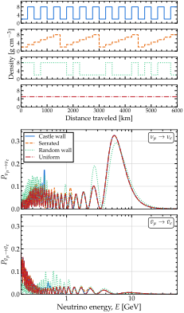

.. _ex-sec-arrangement:

Layered matter
--------------

.. _ex-fig-arrangement:

   **Same mean density, different probabilities.** Appearance probability along four piecewise-constant density profiles, for neutrinos (*middle*) and for antineutrinos (*bottom*), computed with Magνs at three flavors. *Top*: the four profiles, each made of twenty-four slabs of 250 km with a mean density of 5 g cm\ :math:`^{-3}`. The castle wall alternates slabs of 2 and 8 g cm\ :math:`^{-3}`; the random wall holds the same slabs in a random order; the serrated profile repeats four times a ramp from 2 to 8 g cm\ :math:`^{-3}` in six steps; the uniform profile is 5 g cm\ :math:`^{-3}` throughout. The slab edges are declared, so each curve is exact: it is the product of the twenty-four slab exponentials. Listing :ref:`Neutrinos and antineutrinos through a castle wall <ex-lst-arrangement>` computes the castle-wall curves. See notebook `#28 <https://github.com/mbustama/Magnus/blob/main/notebooks/28_magnus_paper_figures.ipynb>`__ and :ref:`ex-sec-arrangement` for details.

Figure :ref:`Same mean density, different probabilities <ex-fig-arrangement>` shows the appearance probability along four piecewise-constant density profiles, for neutrinos and for antineutrinos. All four are made of twenty-four slabs of 250 km and have the same mean density, 5 g cm\ :math:`^{-3}`; they differ only in how the density is distributed along the path. Yet the probabilities differ: against the uniform profile, the random wall departs by up to 0.10 in :math:`P_{\nu_\mu \to \nu_e}` and 0.12 in :math:`P_{\bar{\nu}_\mu \to \bar{\nu}_e}`.

The largest feature of the neutrino panel is a broad peak near 5.4 GeV, enhanced by the matter resonance. At these energies, the oscillation length in matter is thousands of kilometers, many slabs long, so the neutrino responds mainly to the mean density: the castle wall, the serrated profile, and the uniform profile peak at the same energy and height, and the random wall only slightly later and lower. Antineutrinos have no such peak: for them the matter potential has the opposite sign, and, in the normal mass ordering used here, there is no resonance.

The castle wall adds a narrow peak at 0.46 GeV, where its :math:`P_{\nu_\mu \to \nu_e} = 0.17`, more than twice that of the uniform profile. Its densities alternate every 250 km, so the profile repeats every 500 km, close to the oscillation lengths in matter at 0.46 GeV, which are 460 to 510 km in slabs of either density. With the period of the profile matched to the oscillation length, the effect of each pair of slabs adds to that of the previous pair instead of averaging away. This is the parametric resonance of :doc:`/methodology`  :cite:p:`Akhmedov:1988kd,Krastev:1989ix`, on the castle-wall profile that Ref. :cite:p:`Akhmedov:1998ui` solved in closed form. Antineutrinos show the same peak at 0.52 GeV, a third as tall: the sign of the matter potential changes the oscillation length in matter, and with it the energy at which that length matches the period of the profile.

Listing :ref:`Neutrinos and antineutrinos through a castle wall <ex-lst-arrangement>` computes the castle-wall curves. The two calls differ only in ``nubar``, used here for the first time in a listing: it conjugates the mixing matrix and reverses the sign of the matter potential in one step (:doc:`/conventions`). The slab edges are passed through ``t_breakpoints``, so no slab straddles a density jump. The Hamiltonian is constant inside every slab, the Magnus expansion terminates at its first term, and the result is exact: it equals the product of the twenty-four slab exponentials, to round-off. The eight curves of the figure (four profiles, for neutrinos and antineutrinos) take 0.1 s in all, since each call goes to the energy-batched engine of :doc:`/engines`, which samples the profile once for all energies.

.. _ex-lst-arrangement:

**Neutrinos and antineutrinos through a castle wall.** The castle-wall curves of Figure :ref:`Same mean density, different probabilities <ex-fig-arrangement>`. The slab edges are passed through ``t_breakpoints``, so that no slab of the expansion straddles a jump; within each slab the Hamiltonian is constant, and the result is the exact product of the slab exponentials. The two calls differ only in ``nubar``. The other three profiles of the figure differ from this one only in the array ``rho``. See :ref:`ex-sec-arrangement` for details.

.. code-block:: python

   import numpy as np
   import magnus.oscprob as oscprob
   import magnus.globaldefs as gd

   osc = gd.load_nufit_params('NuFIT 6.1')
   # 24 slabs of 250 km, alternating 2 and 8 g/cm^3
   n, width = 24, 250.0*gd.UNIT_KM
   rho = np.where(np.arange(n) % 2 == 0, 2.0, 8.0)
   edges = np.arange(n + 1)*width

   def castle_wall(l):
       """The density at position l, in g/cm^3."""
       k = np.searchsorted(edges, l, side='right') - 1
       return rho[np.clip(k, 0, n - 1)]

   E = np.logspace(-0.7, 1.7, 400)*gd.UNIT_GEV
   # The slab edges are declared, so no slab straddles a
   # jump; within each, one term of the expansion is exact
   P, Pbar = [oscprob.osc_prob_matter_std_potential(
       3, castle_wall, E, n*width, osc,
       t_breakpoints=edges[1:-1], nubar=nubar,
       nu_i=gd.NUMU, nu_f=gd.NUE,
       density_matter_is_in_g_per_cm3=True,
       rtol=1.0e-8, atol=1.0e-10)
       for nubar in (False, True)]
