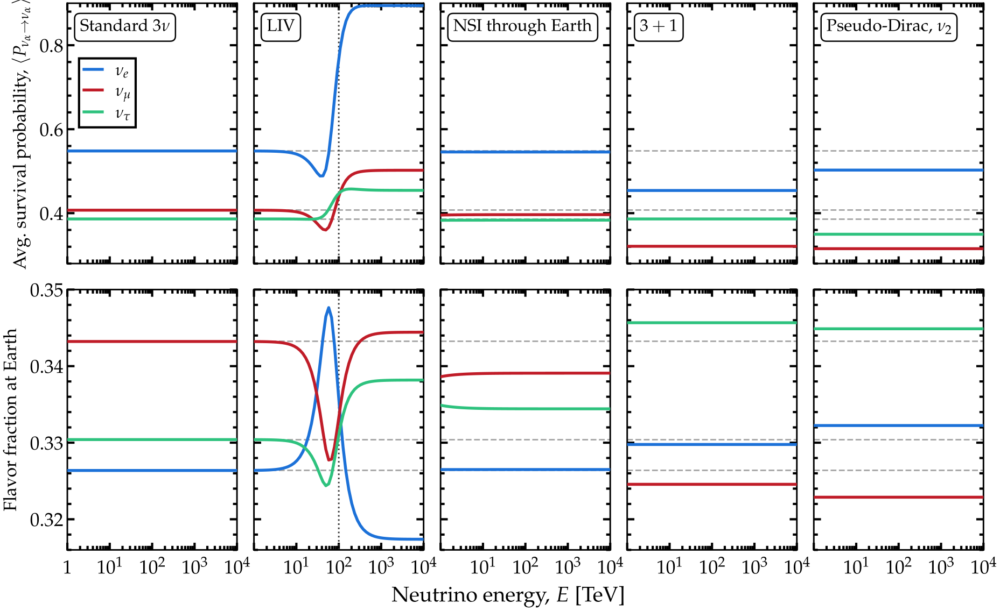
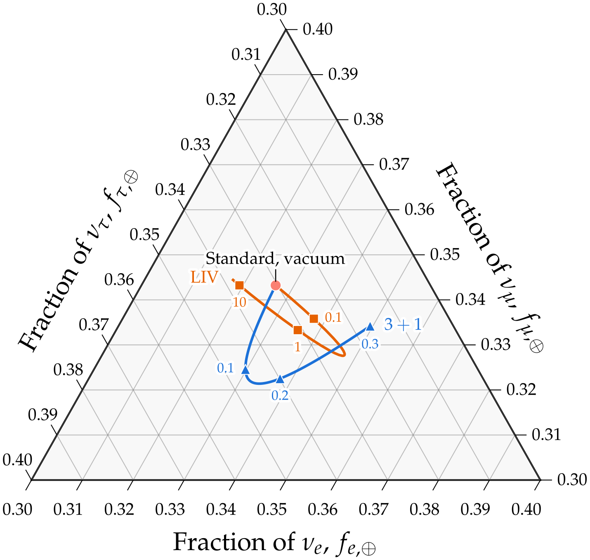

.. _ex-sec-astro:

High-energy astrophysical neutrinos
-----------------------------------

.. _ex-fig-astro:

   **Flavor composition of an astrophysical flux.** Flavor composition of an astrophysical neutrino flux at Earth and the survival probabilities behind it, for five Hamiltonians. Such a flux arrives decohered, so these panels carry the :ref:`phase-averaged limit <avg-limit>`, not a propagated probability. *Top*: :math:`\langle P_{\nu_\alpha \to \nu_\alpha}\rangle` against energy. *Bottom*: the flavor fractions reaching Earth from a pion-decay source, :math:`1:2:0`, with the standard case repeated beneath each panel so that a departure from it is legible. The parameters of the four departures are as follows. Lorentz-invariance violation: the operator of Eq. :eq:`ex-equ-h-liv-3nu` with :math:`n_{\rm LIV} = 1`, :math:`\Lambda = 1` eV, eigenvalues :math:`b_1 = b_2 = 0` and :math:`b_3 = 1.26 \cdot 10^{-31}` eV, and :math:`\mathbb{V}_\xi` the PMNS matrix with :math:`\delta_\xi = 0`; the eigenvalue is fixed by asking the new term to equal the vacuum one at 100 TeV; the vertical line marks that energy. Non-standard interactions: :math:`\varepsilon_{ee} = 0.10`, :math:`\varepsilon_{e\mu} = 0.05` and :math:`\varepsilon_{\mu\tau} = 0.03`, on a chord through the core, :math:`\cos\theta_z = -1`. Sterile state: :math:`\sin^2\theta_{14} = \sin^2\theta_{24} = 0.1`, :math:`\theta_{34} = 0` and :math:`\Delta m^2_{41} = 1` eV\ :math:`^2`. Pseudo-Dirac: the mass eigenstate state :math:`\nu_2` alone carries a partner, split from it by :math:`\delta m^2 = 10^{-13}` eV\ :math:`^2`, at a distance of 100 Mpc. We renormalize the :math:`3+1` and pseudo-Dirac fractions to the three active flavors, past the 13.3% and 19.3% of the flux their sterile states remove, since that share is not observed. Pairing all three mass states would halve every active-active probability by the same factor and leave the fractions untouched, so it is the uneven suppression that moves them. Listing :ref:`Flavor composition of astrophysical neutrinos <ex-lst-astro>` computes the five cases. See notebooks `#10 <https://github.com/mbustama/Magnus/blob/main/notebooks/10_magnus_averaged_probability.ipynb>`__, `#13 <https://github.com/mbustama/Magnus/blob/main/notebooks/13_magnus_tabulated_solar_model.ipynb>`__, and `#28 <https://github.com/mbustama/Magnus/blob/main/notebooks/28_magnus_paper_figures.ipynb>`__ for details, and :ref:`ex-sec-astro` for details.

Figure :ref:`Flavor composition of an astrophysical flux <ex-fig-astro>` shows the flavor composition of a TeV–PeV astrophysical flux at Earth and the average flavor-transition probabilities behind it, for five Hamiltonians: standard three-flavor, Lorentz-invariance violation (LIV), non-standard interactions (NSI) through the Earth, :math:`3+1` flavors, and pseudo-Dirac neutrinos with the :math:`\nu_2` mass eigenstate split. The top row carries the survival probabilities :math:`\langle P_{\nu_\alpha \to \nu_\alpha}\rangle`; the bottom row, the flavor fractions reaching Earth from a source that produces neutrinos through the full pion decay chain, described next.

*Producing them.*—In cosmic accelerators—active galaxies, gamma-ray bursts, superluminous supernovae—protons may interact with ambient matter and radiation to produce pions  :cite:p:`Margolis:1977wt,Stecker:1978ah,Kelner:2006tc`. The pions decay via :math:`\pi^+ \to \mu^+ + \nu_\mu`, followed by :math:`\mu^+ \to \bar{\nu}_\mu + \nu_e + e^+`, and their charge conjugates, so that the flux leaving the source carries flavor ratios :math:`(f_e, f_\mu, f_\tau)_{\rm S} = \left(\frac{1}{3}, \frac{2}{3}, 0\right)`, with :math:`f_{\alpha, {\rm S}}` the fraction of :math:`\nu_\alpha + \bar{\nu}_\alpha` in the total. Neutrino telescopes cannot ordinarily tell :math:`\nu` from :math:`\bar\nu`, so :math:`\nu_\alpha` below means :math:`\nu_\alpha + \bar{\nu}_\alpha`. For illustration, we adopt that full pion-decay composition—the nominal expectation—though there are other possibilities (see, e.g., Ref. :cite:p:`Bustamante:2015waa`).

*What is observable.*—Over Mpc–Gpc baselines, the oscillation length is minute against the distance; neither the distance, the size of the production region, nor the energy resolution of a detector is known to anything approaching the precision the phase would demand for the oscillations to be resolved. Therefore, a neutrino telescope is sensitive only to the average flavor-transition probabilities :math:`\langle P_{\nu_\alpha \to \nu_\beta}\rangle` of the :ref:`averaged limit <avg-limit>`.

Magνs returns the probability in closed form from the eigenvectors of :math:`\mathbb{H}`, with no phase propagated. In vacuum and under standard oscillations, :math:`\mathbb{V}` in the :ref:`averaged limit <avg-limit>` is the PMNS matrix, :math:`\mathbb{U}`, and the probability becomes the familiar :math:`\sum_i \lvert U_{\alpha i}\rvert^2 \lvert U_{\beta i}\rvert^2`. In either case, the flavor ratio at Earth is :math:`f_{\alpha, \oplus} = \sum_\beta \langle P_{\nu_\beta \to \nu_\alpha}\rangle f_{\beta, {\rm S}}`. The flavor composition is a rich probe of astrophysics and fundamental physics; see, e.g., Refs. :cite:p:`Esmaili:2009dz,Barenboim:2003jm,Beacom:2003nh,Kachelriess:2006ksy,Lipari:2007su,Hummer:2010ai,Bustamante:2015waa,Arguelles:2015dca,Rasmussen:2017ert,Bustamante:2019sdb,Ackermann:2019cxh,Ackermann:2019ows,Arguelles:2019rbn,Bustamante:2020bxp,Song:2020nfh,Liu:2023flr`.

Evaluating :math:`\mathbb{U}` at the NuFIT 6.1 best-fit values of the mixing parameters yields about equal proportion of each flavor at Earth, i.e., :math:`(0.33, 0.34, 0.33)_\oplus`. Oscillation over astrophysical distances populates a :math:`\nu_\tau` component that the sources do not make. Run backward, the measured flavor composition can be turned into a constraint on the sources  :cite:p:`Bustamante:2019sdb,Song:2020nfh,Liu:2023flr,IceCube:2025ole`.

In the presence of mixing with sterile states of or new, non-matter terms added to the *vacuum* Hamiltonian (like Lorentz-invariance violation, which holds in vacuum and in matter), the probability is the same expression as above, but evaluated in the eigenbasis of the total Hamiltonian, i.e., :math:`\sum_i \lvert V_{\alpha i}\rvert^2 \lvert V_{\beta i}\rvert^2`.

Matter is different: the flux decoheres in the vacuum mass basis long before it arrives, then crosses the Earth *coherently*. Thus, the two legs compose as probability matrices rather than as amplitudes, yielding a flavor ratio at Earth of :math:`f_{\beta,\oplus} = \sum_{\alpha,\gamma} f_{\alpha, {\rm S}} \langle P_{\nu_\alpha \to \nu_\gamma}\rangle P^{\oplus}_{\nu_\gamma \to \nu_\beta}`, with the second factor an ordinary propagation through the Earth’s density profile.

Listing :ref:`Flavor composition of astrophysical neutrinos <ex-lst-astro>` computes the five cases of Figure :ref:`Flavor composition of an astrophysical flux <ex-fig-astro>`. Three of them are one wrapper call each with ``average=True``, over all energies at once: the standard case, the Lorentz-violating case, and the :math:`3+1` case. The wrappers decide from the baseline and the eigenvalue gaps which pairs have decohered, so the baseline passed must be astrophysical in fact. At 100 Mpc every pair has decohered at every energy of the figure; over :math:`10^8` km, less than an astronomical unit, the pair split by :math:`\Delta m^2_{21}` has not completed a cycle above a few TeV, so the wrapper warns and returns the coherent expression instead. The pseudo-Dirac case has no wrapper: its Hamiltonian is built and handed to the direct route with the baseline, from which the average decides which pairs of eigenvalues have decohered.

Only the Earth leg with non-standard interactions propagates a probability; the other four cases are closed-form averages. That call passes ``n_slabs=32``: on the default first grid a slab spans thousands of km, across which the matter term alone accumulates a phase above :math:`\pi`, the bound below which the expansion is guaranteed to converge. Magνs warns about that and refines anyway; starting at 32 slabs removes the warning, with a change in the answer below the tolerance.

.. _ex-lst-astro:

**Flavor composition of astrophysical neutrinos.** The five cases of Figure :ref:`Flavor composition of an astrophysical flux <ex-fig-astro>`: the phase-averaged matrix :math:`\langle P_{\nu_\alpha \to \nu_\beta}\rangle` of the :ref:`averaged limit <avg-limit>` for each Hamiltonian, over the sixty energies of the figure, contracted with the pion-decay source fractions. The standard, Lorentz-violating and :math:`3+1` cases are one wrapper call each with ``average=True``; the Earth case composes the decohered matrix with one propagation through the core; the pseudo-Dirac case builds its Hamiltonian and takes the direct route with the baseline, from which the average groups the spectrum into coherent blocks. ``f_earth`` holds the five compositions. See :ref:`ex-sec-astro` for details.

.. code-block:: python

   import numpy as np
   import magnus.oscprob as oscprob
   import magnus.hamiltonians as ham
   import magnus.earth as earth
   import magnus.globaldefs as gd

   osc = gd.load_nufit_params('NuFIT 6.1')
   E = np.logspace(3, 7, 60)*gd.UNIT_GEV   # 1 TeV-10 PeV
   f_src = np.array([1/3, 2/3, 0.0])       # pion decay
   # A source 100 Mpc away: far enough for every pair
   # of eigenvalues to have decohered at every energy,
   # which the wrappers decide from the baseline
   L_src = 100.0*3.0857e19*gd.UNIT_KM

   def at_earth(P):
       # The source fractions, zero for a sterile state,
       # contracted with the averaged matrix; the active
       # fractions renormalized to one
       f = np.zeros(len(P)); f[:3] = f_src
       f = (f @ P)[:3]
       return f/f.sum()

   # Standard: the averaged matrix at each energy
   P_std = oscprob.osc_prob_3nu_vacuum(E, L_src,
    average=True, **osc)                   # (60, 3, 3)

   # LIV: the n = 1 operator, aligned with the PMNS
   # angles, sized to equal the vacuum term at 100 TeV
   b3 = osc['D31']/(2*(100.0*gd.UNIT_TEV)**2)
   P_liv = oscprob.osc_prob_3nu_vacuum_liv(E, L_src,
    average=True, sxi12=osc['s12'], sxi23=osc['s23'],
    sxi13=osc['s13'], dxiCP=0.0, b1=0.0, b2=0.0,
    b3=b3, Lambda=1.0, n_liv=1, **osc)

   # NSI through the Earth: the flux arrives decohered,
   # then crosses the Earth coherently, so the two legs
   # compose as probability matrices.  The ladder starts
   # at 32 slabs: the matter term alone winds more than
   # pi across a coarser one
   eps = dict(eps_ee=0.10, eps_em=0.05, eps_mt=0.03)
   L_in = earth.distance_traveled_inside_earth(-1.0)
   P_in = oscprob.osc_prob_3nu_earth_nsi(E, costhz=-1.0,
    L=L_in*gd.UNIT_KM, n_slabs=32, rtol=1e-6, atol=1e-8,
    **osc, **eps)
   P_nsi = np.asarray(P_std) @ np.asarray(P_in)

   # 3+1: one sterile state, sin^2 of both active-
   # sterile angles 0.1, Dm41^2 = 1 eV^2
   P_4 = oscprob.osc_prob_4nu_vacuum(E, L_src,
    average=True, s14=np.sqrt(0.1), s24=np.sqrt(0.1),
    D41=1.0, **osc)

   # Pseudo-Dirac: no wrapper, so the Hamiltonian is
   # built and handed to the direct route.  The second
   # mass state is paired with a partner split by
   # 1e-13 eV^2; the baseline decides which pairs have
   # decohered
   U = ham.pmns_mixing_matrix(osc['s12'], osc['s23'],
    osc['s13'], osc['dCP'])
   m2 = np.array([0.0, osc['D21'], osc['D31']])
   def H_pd(e):
       return ham.hamiltonian_pseudo_dirac_vacuum(
        e, U, m2, {1: 1.0e-13})
   P_pd = np.array([oscprob.osc_prob_energy_baseline(
    H_pd(e), e, L_src, average=True) for e in E])

   cases = dict(std=P_std, liv=P_liv, nsi=P_nsi,
                four=P_4, pd=P_pd)
   f_earth = {k: np.array([at_earth(P) for P in v])
              for k, v in cases.items()}

*What varies with energy, and what does not.*—For standard oscillations the composition does not depend on the energy at all. Equation (:doc:`/averaged_probability`) is built from :math:`\lvert \mathbb{V}_{\alpha i}\rvert^2` alone; in vacuum no energy enters them. Three of the four departures from standard oscillations are flat in energy:

- In the :math:`3+1` case, a sterile state moves the composition at Earth from :math:`(0.326, 0.343, 0.330)_\oplus` to :math:`(0.330, 0.325, 0.346)_\oplus`. (Sterile states take away 13.3% of the originally purely active flux; these triplets are the three active fractions rescaled to add to one.)

- In NSI through the Earth, the fractions move by less than 0.005 and also do not vary, because above a TeV the matter term dominates the Hamiltonian inside the Earth and carries no energy dependence. (Towards the low energy end, the energy dependence starts becoming visible.)

- In the pseudo-Dirac case, expanded below, the composition is flat in energy for the same reason as for sterile neutrinos: it is a vacuum Hamiltonian, just with more states.

The three cases induce different shifts in :math:`f_{\alpha, \oplus}`, independent of energy within the range shown. Above about 100 TeV, a neutrino crossing the core is likely to interact on the way and never reach the detector, an effect Magνs does not account for.

What separates the Lorentz-violating case from the others is that its term keeps growing with energy (:math:`\propto E`) relative to the vacuum one (:math:`\propto 1/E`), so the eigenvectors never settle; the other three cases reach a regime in which one term dominates and the composition stops moving. The Lorentz-violating case moves :math:`f_{e, \oplus}` from about 0.33 up to 0.35 and down again to 0.32 across the crossover, with :math:`f_{\mu, \oplus}` dipping to 0.33 and recovering; the survival probability driving it reaches 0.89. That is what a flavor measurement could distinguish; Magνs evaluates the :ref:`block form <avg-coherence>` for it in the same call as for the standard case.

.. _ex-fig-astro-ternary:

   **The flavor triangle of high-energy astrophysical neutrinos.** Flavor composition at Earth of a pion-decay flux of TeV–PeV astrophysical neutrinos. The flavor composition at the source is :math:`\left(\frac{1}{3}:\frac{2}{3}:0\right)_{\rm S}`. Results are for standard, three-flavor oscillations in vacuum, for Lorentz-invariance violation (LIV), and for active-sterile mixing under 3+1 flavors. The standard expectation is :math:`(0.326, 0.343, 0.330)_\oplus`. Along the LIV curve, the eigenvalue :math:`b_3` of the :math:`n = 1` LIV operator of Figure :ref:`Flavor composition of an astrophysical flux <ex-fig-astro>` grows from zero at :math:`E = 100` TeV; the marks are where the new term is 0.1, 1, and 10 times the vacuum one, the energies 32, 100, and 316 TeV. Along the 3+1 curve, the two active-sterile mixing angles grow together from zero; the marks are :math:`\sin^2\theta_{14} = \sin^2\theta_{24} = 0.1`, 0.2 and 0.3, with flavor fractions renormalized to the active flavors. See notebooks `#10 <https://github.com/mbustama/Magnus/blob/main/notebooks/10_magnus_averaged_probability.ipynb>`__, `#13 <https://github.com/mbustama/Magnus/blob/main/notebooks/13_magnus_tabulated_solar_model.ipynb>`__, and `#28 <https://github.com/mbustama/Magnus/blob/main/notebooks/28_magnus_paper_figures.ipynb>`__ for details, and :ref:`ex-sec-astro` for details.

Figure :ref:`The flavor triangle of high-energy astrophysical neutrinos <ex-fig-astro-ternary>` shows two of these flavor compositions on the flavor triangle, as their new-physics parameter is varied. Along the LIV curve, the eigenvalue of the Lorentz-violating operator grows from zero at 100 TeV: the composition leaves the standard point, swings out through the crossover and settles where the new term alone puts it, close to where it started. Along the 3+1 curve, the two active-sterile mixing angles grow together from zero; the composition moves the other way. Given the ranges over the model parameters are varied in Figure :ref:`Flavor composition of an astrophysical flux <ex-fig-astro>`, every point lies within a few hundredths of the standard one, so the triangle is drawn over 0.30 to 0.40 on each axis.

*Pseudo-Dirac neutrinos.*—The fifth panel in Figure :ref:`Flavor composition of an astrophysical flux <ex-fig-astro>` splits the mass eigenstate :math:`\nu_2` into a pair separated by :math:`\delta m^2 = 10^{-13}` eV\ :math:`^2`, its partner sterile  :cite:p:`Wolfenstein:1981kw,Petcov:1982ya` (see :ref:`ex-sec-shipped-hamiltonians`). Only one of the mass eigenstates is split: splitting all three sends half the flux to the sterile partners and divides every probability between active flavors by 2, so the three flavor fractions a detector sees come out standard. Splitting :math:`\nu_2` only sends 19.3% of the flux to its partner and moves the fractions.

Which averaged expression applies to the probability depends on the phase the pair itself accumulates, :math:`\delta m^2 L / 2E`. At 100 Mpc and 100 TeV, below about :math:`10^{-19}` eV\ :math:`^2`, that phase is a small fraction of a radian: the pair stays coherent and the :ref:`block form <avg-coherence>` returns exactly what an unsplit spectrum gives. Above about :math:`10^{-16}` eV\ :math:`^2` the phase turns through more than a cycle: the pair has averaged away and the :ref:`block form <avg-coherence>` counts the two members separately, halving the channels they carry. The figure sits above that band, at :math:`10^{-13}` eV\ :math:`^2`. Magνs decides which regime a spectrum is in from the eigenvalues and the baseline:

.. code-block:: python

   import magnus.avgprob as avgprob

   E1 = 100.0*gd.UNIT_TEV
   for dm2 in (1.0e-13, 1.0e-19):
       H = ham.hamiltonian_pseudo_dirac_vacuum(
        E1, U, m2, {1: dm2})
       lam = np.linalg.eigvalsh(H)
       b = avgprob.coherence_blocks(lam, L_src)
       print(b)
   # [[0], [1], [2], [3]]   The pair decohered
   # [[0], [1, 2], [3]]     The pair coherent

Between the two regimes neither expression describes the situation accurately; passing ``average=True`` says so instead of returning a number. The signature such a spectrum leaves at a neutrino telescope is the one identified in Ref. :cite:p:`Beacom:2003eu`.
