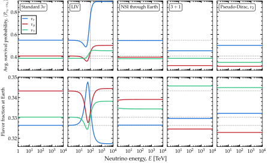
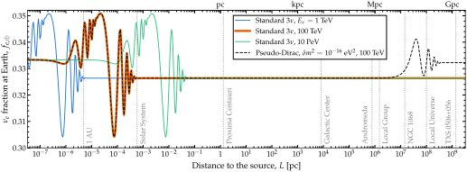
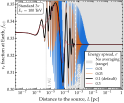
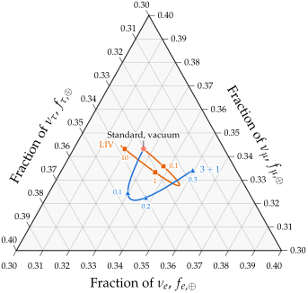

.. _ex-sec-astro:

High-energy astrophysical neutrinos
-----------------------------------

.. _ex-fig-astro:

   **Flavor composition of an astrophysical flux.** Averaged probabilities, :ref:`averaged limit <avg-limit>`, for five Hamiltonians, from a source at 100 Mpc. *Top*: survival probabilities, :math:`\langle P_{\nu_\alpha \to \nu_\alpha}\rangle`. *Bottom*: flavor fractions at Earth from a pion-decay source, :math:`1:2:0`; the standard case is repeated in each panel for comparison. Lorentz-invariance violation: the operator of Eq. :eq:`ex-equ-h-liv-3nu` with :math:`n_{\rm LIV} = 1`, :math:`\Lambda = 1` eV, :math:`b_1 = b_2 = 0`, :math:`b_3 = 1.26 \cdot 10^{-31}` eV, and :math:`\mathbb{V}_\xi` the PMNS matrix with :math:`\delta_\xi = 0`, so that the new term equals :math:`\Delta m^2_{31}/2E` at 100 TeV (vertical line). Non-standard interactions: :math:`\varepsilon_{ee} = 0.10`, :math:`\varepsilon_{e\mu} = 0.05`, and :math:`\varepsilon_{\mu\tau} = 0.03`, across the core of the Earth, :math:`\cos\theta_z = -1`. Sterile state: :math:`\sin^2\theta_{14} = \sin^2\theta_{24} = 0.1`, :math:`\theta_{34} = 0`, and :math:`\Delta m^2_{41} = 1` eV\ :math:`^2`. Pseudo-Dirac: :math:`\nu_2` split by :math:`\delta m^2 = 10^{-13}` eV\ :math:`^2`. For the last two, the fractions are renormalized to the three active flavors. See Listing :ref:`Flavor composition of astrophysical neutrinos <ex-lst-astro>`, notebooks `#10 <https://github.com/mbustama/Magnus/blob/main/notebooks/10_magnus_averaged_probability.ipynb>`__, `#13 <https://github.com/mbustama/Magnus/blob/main/notebooks/13_magnus_tabulated_solar_model.ipynb>`__, and `#28 <https://github.com/mbustama/Magnus/blob/main/notebooks/28_magnus_paper_figures.ipynb>`__, and :ref:`ex-sec-astro` for details.

Figure :ref:`Flavor composition of an astrophysical flux <ex-fig-astro>` shows the flavor composition of a TeV–PeV astrophysical flux at Earth and the average flavor-transition probabilities behind it, for five Hamiltonians: standard three-flavor, Lorentz-invariance violation (LIV), non-standard interactions (NSI) through the Earth, :math:`3+1` flavors, and pseudo-Dirac neutrinos with the :math:`\nu_2` mass eigenstate split. The top row shows the survival probabilities :math:`\langle P_{\nu_\alpha \to \nu_\alpha}\rangle`; the bottom row, the flavor fractions reaching Earth from a source that produces neutrinos through the full pion decay chain, described next.

*How the neutrinos are produced.*—In cosmic accelerators—active galaxies, gamma-ray bursts, superluminous supernovae—protons may interact with ambient matter and radiation to produce pions  :cite:p:`Margolis:1977wt,Stecker:1978ah,Kelner:2006tc`. The pions decay via :math:`\pi^+ \to \mu^+ + \nu_\mu`, followed by :math:`\mu^+ \to \bar{\nu}_\mu + \nu_e + e^+`, and their charge conjugates, so that the flux leaving the source carries flavor ratios :math:`(f_e, f_\mu, f_\tau)_{\rm S} = \left(\frac{1}{3}, \frac{2}{3}, 0\right)`, with :math:`f_{\alpha, {\rm S}}` the fraction of :math:`\nu_\alpha + \bar{\nu}_\alpha` in the total. Neutrino telescopes cannot ordinarily tell :math:`\nu` from :math:`\bar\nu`, so :math:`\nu_\alpha` below means :math:`\nu_\alpha + \bar{\nu}_\alpha`. For illustration, we adopt that full pion-decay composition—the nominal expectation—though there are other possibilities (see, e.g., Ref. :cite:p:`Bustamante:2015waa`).

*What is observable.*—Over Mpc–Gpc baselines, the oscillation length is minute against the distance; neither the distance, the size of the production region, nor the energy resolution of a detector is known to anything approaching the precision the phase would demand for the oscillations to be resolved. Therefore, a neutrino telescope is sensitive only to the average flavor-transition probabilities :math:`\langle P_{\nu_\alpha \to \nu_\beta}\rangle` of :ref:`averaged limit <avg-limit>`.

With ``average=True``, Magνs computes this probability in closed form from the eigenvectors of :math:`\mathbb{H}`, without propagating a phase. (It returns the :ref:`phase average <avg-phase-average>`, which over these distances equals :ref:`averaged limit <avg-limit>`, since every phase runs through many cycles.) Under standard oscillations in vacuum, :math:`\mathbb{V}` in :ref:`averaged limit <avg-limit>` is the PMNS matrix, :math:`\mathbb{U}`, and the probability is the familiar :math:`\sum_i \lvert U_{\alpha i}\rvert^2 \lvert U_{\beta i}\rvert^2`. The flavor ratios at Earth are then

.. math::
   :label: ex-equ-flavor-ratio-earth

   f_{\alpha, \oplus}
   =
   \sum_\beta \langle P_{\nu_\beta \to \nu_\alpha}\rangle\, f_{\beta, {\rm S}} \;.

The flavor composition is a rich probe of astrophysics and fundamental physics; see, e.g., Refs. :cite:p:`Esmaili:2009dz,Barenboim:2003jm,Beacom:2003nh,Kachelriess:2006ksy,Lipari:2007su,Hummer:2010ai,Bustamante:2015waa,Arguelles:2015dca,Rasmussen:2017ert,Bustamante:2019sdb,Ackermann:2019cxh,Ackermann:2019ows,Arguelles:2019rbn,Bustamante:2020bxp,Song:2020nfh,Liu:2023flr`. With NuFIT 6.1 best-fit values of the mixing parameters, the flavor fractions at Earth are nearly equal, :math:`(0.33, 0.34, 0.33)_\oplus`: oscillations over astrophysical distances create a :math:`\nu_\tau` component even when the source produces none. Run backward, the measured flavor composition can constrain the sources  :cite:p:`Bustamante:2019sdb,Song:2020nfh,Liu:2023flr,IceCube:2025ole`.

If the vacuum Hamiltonian is extended, e.g., by mixing with sterile states or by a new-physics term such as Lorentz-invariance violation, the averaged probability keeps the same form, :math:`\sum_i \lvert \mathbb{V}_{\alpha i}\rvert^2 \lvert \mathbb{V}_{\beta i}\rvert^2`, with :math:`\mathbb{V}` the eigenvectors of the full Hamiltonian. Matter, which the neutrinos meet only when they cross the Earth, is treated differently; we return to it below.

Listing :ref:`Flavor composition of astrophysical neutrinos <ex-lst-astro>` computes the five cases of Figure :ref:`Flavor composition of an astrophysical flux <ex-fig-astro>`. The standard, Lorentz-violating, and :math:`3+1` cases take one wrapper call each, with ``average=True``, over all sixty energies at once. Each call takes the distance to the source, which may be surprising: the averaged probability is usually written without a baseline, because it is the :ref:`averaged limit <avg-limit>`, :math:`L/E \to \infty`, in which every interference term has averaged away. However, Magνs does not assume that limit. With ``average=True``, it returns the :ref:`phase average <avg-phase-average>`, which damps each interference term according to the size of its phase, :math:`\Delta m^2_{ij} L/2E`, and so needs :math:`L`. Where every phase is large, the two coincide: at the default energy spread of 10%, a phase of 40 rad keeps :math:`3 \cdot 10^{-4}` of its interference (:doc:`/averaged_probability`), and Magνs then returns :ref:`averaged limit <avg-limit>` itself. For the mass splittings of standard oscillations, this holds at the distance of any real source: the smallest phase, from :math:`\Delta m^2_{21}` at 10 PeV, the highest energy of Figure :ref:`Flavor composition of an astrophysical flux <ex-fig-astro>`, exceeds 40 rad beyond about 0.07 pc. Hence, every astrophysical baseline gives the same result, to the last digit; for instance, continuing Listing :ref:`Flavor composition of astrophysical neutrinos <ex-lst-astro>`,

.. code-block:: python

   # One megaparsec, in natural units
   Mpc = 3.0857e19*gd.UNIT_KM
   # The standard case at 1 Mpc and at 1 Gpc
   P1 = oscprob.osc_prob_3nu_vacuum(E,
    1.0*Mpc, average=True, **osc)
   P2 = oscprob.osc_prob_3nu_vacuum(E,
    1.0e3*Mpc, average=True, **osc)
   # Largest difference over all energies
   # and channels: none
   np.abs(P1 - P2).max()        # 0.0

The same holds for the Lorentz-violating and :math:`3+1` cases of Figure :ref:`Flavor composition of an astrophysical flux <ex-fig-astro>`. The baseline matters only when some phase is not large: over a short baseline, or for a splitting far smaller than :math:`\Delta m^2_{21}`, as in the pseudo-Dirac case below. Over :math:`10^8` km, less than an astronomical unit, the :math:`\Delta m^2_{21}` phase is too small to average away at most energies of the figure. The wrapper warns, and returns the phase average over the 10% energy spread, which depends on that spread:

.. code-block:: python

   P = oscprob.osc_prob_3nu_vacuum(E,
    1.0e8*gd.UNIT_KM, average=True, **osc)
   # PhaseAveragingWarning: depends on
   # the energy spread at 46 of 60 points
   at_earth(P[-1]).round(3)
   # [0.333 0.666 0.001]

At 10 PeV, the composition is still that of the source: over this distance, the oscillation has barely begun.

.. _ex-fig-astro-baseline:

   **The averaged flavor composition settles once the source is far enough.** Fraction of :math:`\nu_e` at Earth, :math:`f_{e,\oplus}`, of a flux produced by pion decay, :math:`\left(\frac{1}{3}:\frac{2}{3}:0\right)_{\rm S}`, against the distance to the source, computed with ``average=True``, i.e., the :ref:`phase average <avg-phase-average>` at the default 10% energy spread. Curves are for standard three-flavor oscillations in vacuum at 1 TeV, 100 TeV, and 10 PeV, and for a pseudo-Dirac spectrum, with :math:`\nu_2` split by :math:`\delta m^2 = 10^{-16}` eV\ :math:`^2`, at 100 TeV; the latter lies on the 100-TeV standard curve out to about 8 Mpc. Close to the source, the oscillations are only partly averaged, and the curves depend on the energy spread. Farther out, every phase has averaged away and the composition settles, at :math:`f_{e,\oplus} = 0.326` under standard oscillations, at a distance that grows with the energy. The pseudo-Dirac pair, with its much smaller splitting, settles a second time, at :math:`f_{e,\oplus} = 0.332`, beyond about 250 Mpc. See :ref:`ex-sec-astro` and notebook `#28 <https://github.com/mbustama/Magnus/blob/main/notebooks/28_magnus_paper_figures.ipynb>`__ for details.

Figure :ref:`The averaged flavor composition settles once the source is far enough. <ex-fig-astro-baseline>` follows the composition from :math:`10^6` km out to Gpc distances. Under standard oscillations, :math:`f_{e,\oplus}` settles, to within :math:`10^{-3}`, beyond about 1 AU at 1 TeV, :math:`4 \cdot 10^{-4}` pc at 100 TeV, and 0.04 pc at 10 PeV: the phases grow as :math:`L/E`, so the higher the energy, the farther out the composition settles. Every known or suspected source of high-energy astrophysical neutrinos lies far beyond that. A pseudo-Dirac pair adds a phase of its own, :math:`\delta m^2 L/2E`, set by a much smaller splitting. With :math:`\delta m^2 = 10^{-16}` eV\ :math:`^2`, at 100 TeV, the composition leaves the standard value at about 8 Mpc and settles on a new one, :math:`f_{e,\oplus} = 0.332`, beyond about 250 Mpc, which are the distances of real sources. For such a spectrum, the baseline passed must be the actual one; we return to it at the end of this section.

.. _ex-fig-astro-spread:

   **The energy spread sets where the averaged composition settles, not its value.** Fraction of :math:`\nu_e` at Earth, :math:`f_{e,\oplus}`, from a pion-decay source, against the distance to the source, for standard three-flavor oscillations in vacuum at 100 TeV. The curves are the :ref:`phase average <avg-phase-average>` for relative energy spreads :math:`\sigma = 0.01`, 0.03, 0.1 (the default of ``average_spread``), and 0.3. The distance beyond which each curve settles scales as :math:`1/\sigma`; all of them settle at the same value, :math:`f_{e,\oplus} = 0.326`. The gray band is the range swept by the unaveraged :math:`f_{e,\oplus}`, which never settles. Dotted lines mark 1 AU and the heliopause, at 120 AU. See :ref:`ex-sec-astro` and notebook `#28 <https://github.com/mbustama/Magnus/blob/main/notebooks/28_magnus_paper_figures.ipynb>`__ for details.

Figure :ref:`The energy spread sets where the averaged composition settles, not its value. <ex-fig-astro-spread>` shows the :math:`\nu_e` fraction at Earth, :math:`f_{e,\oplus}`, from a pion-decay source, against the distance to the source, for standard three-flavor oscillations in vacuum at 100 TeV. The curves are computed with ``average=True`` for four relative energy spreads, :math:`\sigma = 0.01`, 0.03, 0.1 (the default of ``average_spread``), and 0.3. The gray band is the range swept by :math:`f_{e,\oplus}` computed without averaging. The spread sets how strongly each interference term is damped [:ref:`phase-averaged probability <avg-phase-average>`], and so the distance at which the composition stops changing: as the spread grows from 1% to 30%, the distance beyond which :math:`f_{e,\oplus}` settles, to within :math:`10^{-3}`, shrinks as :math:`1/\sigma`, from :math:`4 \cdot 10^{-3}` pc to :math:`1.4 \cdot 10^{-4}` pc. The value it settles to, 0.326, is the same for every spread. Without averaging, the composition never settles: it keeps oscillating at every distance. Hence, the exact value of the spread passed with ``average_spread`` matters only for a source close enough that the phases have not yet averaged away; for any realistic astrophysical source of high-energy neutrinos, the result does not depend on it.

In Figure :ref:`Flavor composition of an astrophysical flux <ex-fig-astro>`, only the matter case propagates a probability, and only across the Earth; the other four cases, and the vacuum leg of the matter case, are closed-form averages. The flux decoheres in the vacuum mass basis long before it reaches the Earth, and then crosses the Earth *coherently*. Therefore, the two legs combine as probability matrices, not as amplitudes, and the flavor ratios at Earth are

.. math::
   :label: ex-equ-astro-earth-leg

   f_{\beta,\oplus}
   =
   \sum_{\alpha,\gamma} f_{\alpha, {\rm S}}\,
   \langle P_{\nu_\alpha \to \nu_\gamma}\rangle\,
   P^{\oplus}_{\nu_\gamma \to \nu_\beta} \;,

where the first factor is the averaged probability in vacuum and the second is an ordinary propagation through the density profile of the Earth. In Listing :ref:`Flavor composition of astrophysical neutrinos <ex-lst-astro>`, this is the product ``P_std @ P_in``. (The Earth call starts refinement at 32 slabs only to avoid a harmless convergence warning on the coarser default grid.)

.. _ex-lst-astro:

**Flavor composition of astrophysical neutrinos.** The five cases of Figure :ref:`Flavor composition of an astrophysical flux <ex-fig-astro>`: the phase-averaged matrix :math:`\langle P_{\nu_\alpha \to \nu_\beta}\rangle` of :ref:`averaged limit <avg-limit>` for each Hamiltonian, over the sixty energies of the figure, contracted with the pion-decay source fractions. The standard, Lorentz-violating, and :math:`3+1` cases are one wrapper call each with ``average=True``; the NSI case composes the averaged vacuum matrix with one propagation through the core; the pseudo-Dirac case is one call to ``osc_prob_pseudo_dirac_vacuum``, which forms each pair's phase from its splitting. ``f_earth`` holds the five compositions. See :ref:`ex-sec-astro` for details.

.. code-block:: python

   import numpy as np
   import magnus.oscprob as oscprob
   import magnus.earth as earth
   import magnus.globaldefs as gd

   osc = gd.load_nufit_params('NuFIT 6.1')
   E = np.logspace(3, 7, 60)*gd.UNIT_GEV   # 1 TeV-10 PeV
   f_src = np.array([1/3, 2/3, 0.0])       # pion decay
   # A source 100 Mpc away: far enough for every phase
   # to average away at every energy.  The average
   # depends on the baseline through the phases
   L_src = 100.0*3.0857e19*gd.UNIT_KM

   def at_earth(P):
       # The source fractions, zero for a sterile state,
       # contracted with the averaged matrix; the active
       # fractions renormalized to one
       f = np.zeros(len(P)); f[:3] = f_src
       f = (f @ P)[:3]
       return f/f.sum()

   # Standard: the averaged matrix at each energy
   P_std = oscprob.osc_prob_3nu_vacuum(E, L_src,
    average=True, **osc)                   # (60, 3, 3)

   # LIV: the n = 1 operator, aligned with the PMNS
   # angles, sized to equal the vacuum term at 100 TeV
   b3 = osc['D31']/(2*(100.0*gd.UNIT_TEV)**2)
   P_liv = oscprob.osc_prob_3nu_vacuum_liv(E, L_src,
    average=True, sxi12=osc['s12'], sxi23=osc['s23'],
    sxi13=osc['s13'], dxiCP=0.0, b1=0.0, b2=0.0,
    b3=b3, Lambda=1.0, n_liv=1, **osc)

   # NSI through the Earth: the flux arrives decohered,
   # then crosses the Earth coherently, so the two legs
   # compose as probability matrices.  The ladder starts
   # at 32 slabs: the matter term alone winds more than
   # pi across a coarser one
   eps = dict(eps_ee=0.10, eps_em=0.05, eps_mt=0.03)
   L_in = earth.distance_traveled_inside_earth(-1.0)
   P_in = oscprob.osc_prob_3nu_earth_nsi(E, costhz=-1.0,
    L=L_in*gd.UNIT_KM, n_slabs=32, rtol=1e-6, atol=1e-8,
    **osc, **eps)
   P_nsi = np.asarray(P_std) @ np.asarray(P_in)

   # 3+1: one sterile state, sin^2 of both active-
   # sterile angles 0.1, Dm41^2 = 1 eV^2
   P_4 = oscprob.osc_prob_4nu_vacuum(E, L_src,
    average=True, s14=np.sqrt(0.1), s24=np.sqrt(0.1),
    D41=1.0, **osc)

   # Pseudo-Dirac: the second mass state is paired
   # with a partner split by 1e-13 eV^2
   P_pd = oscprob.osc_prob_pseudo_dirac_vacuum(E,
    L_src, {1: 1.0e-13}, average=True, **osc)

   cases = dict(std=P_std, liv=P_liv, nsi=P_nsi,
                four=P_4, pd=P_pd)
   f_earth = {k: np.array([at_earth(P) for P in v])
              for k, v in cases.items()}

*What varies with energy, and what does not.*—Under standard oscillations, the composition does not depend on the energy at all: :ref:`averaged limit <avg-limit>` depends only on the eigenvectors, and in vacuum they do not depend on the energy (:doc:`/averaged_probability`). Three of the four departures from standard oscillations are also flat in energy, or nearly so:

-  In the :math:`3+1` case, the composition at Earth moves from :math:`(0.326, 0.343, 0.330)_\oplus` to :math:`(0.330, 0.325, 0.346)_\oplus`. The sterile state takes away 13.3% of the flux, which was purely active at the source; these triplets are the three active fractions, rescaled to add to one. The Hamiltonian is a vacuum one, so the composition does not depend on the energy.
-  In the pseudo-Dirac case, the composition moves to :math:`(0.332, 0.323, 0.345)_\oplus`, and does not depend on the energy either, for the same reason. At :math:`\delta m^2 = 10^{-13}` eV\ :math:`^2`, the pair has decohered at every energy shown (see below).
-  With NSI through the Earth, the fractions move by less than 0.005, and vary by less than 0.001 across the energies shown: above a TeV, the matter term dominates the Hamiltonian inside the Earth, and it does not depend on the energy. Above about 100 TeV, a neutrino crossing the core is likely to interact on the way and never reach the detector, an effect Magνs does not account for.

The Lorentz-violating case is different: its term grows with the energy, as :math:`E`, while the vacuum term falls, as :math:`1/E`, so the eigenvectors change with the energy. The vacuum term sets them well below 100 TeV, and the new term well above. Across the crossover between the two, :math:`f_{e, \oplus}` rises from 0.33 to 0.35 and falls to 0.32, and :math:`f_{\mu, \oplus}` dips to 0.33 and recovers; the :math:`\nu_e` survival probability reaches 0.89. Above the crossover, the composition settles close to the standard one, because :math:`\mathbb{V}_\xi` is the PMNS matrix with :math:`\delta_\xi = 0`. A measurement of the flavor composition at several energies could detect such an energy dependence.

.. _ex-fig-astro-ternary:

   **The flavor triangle of high-energy astrophysical neutrinos.** Flavor composition at Earth of a pion-decay flux of astrophysical neutrinos at 100 TeV. The flavor composition at the source is :math:`\left(\frac{1}{3}:\frac{2}{3}:0\right)_{\rm S}`. Results are for standard, three-flavor oscillations in vacuum, for Lorentz-invariance violation (LIV), and for active-sterile mixing under 3+1 flavors. The standard expectation is :math:`(0.326, 0.343, 0.330)_\oplus`. Along the LIV curve, the eigenvalue :math:`b_3` of the :math:`n = 1` LIV operator of Figure :ref:`Flavor composition of an astrophysical flux <ex-fig-astro>` grows from zero; the marks are where the new term is 0.1, 1, and 10 times the vacuum one. At the value of :math:`b_3` used in Figure :ref:`Flavor composition of an astrophysical flux <ex-fig-astro>`, these ratios occur at 32, 100, and 316 TeV. Along the 3+1 curve, the two active-sterile mixing angles grow together from zero; the marks are :math:`\sin^2\theta_{14} = \sin^2\theta_{24} = 0.1`, 0.2, and 0.3, with flavor fractions renormalized to the active flavors. See :ref:`ex-sec-astro` and notebooks `#10 <https://github.com/mbustama/Magnus/blob/main/notebooks/10_magnus_averaged_probability.ipynb>`__, `#13 <https://github.com/mbustama/Magnus/blob/main/notebooks/13_magnus_tabulated_solar_model.ipynb>`__, and `#28 <https://github.com/mbustama/Magnus/blob/main/notebooks/28_magnus_paper_figures.ipynb>`__ for details.

*The flavor triangle.*—Figure :ref:`The flavor triangle of high-energy astrophysical neutrinos <ex-fig-astro-ternary>` shows how the flavor composition at Earth depends on the new-physics parameters themselves, at a fixed energy of 100 TeV, for two of the departures of Figure :ref:`Flavor composition of an astrophysical flux <ex-fig-astro>`, plotted on the flavor triangle. Along the LIV curve, the eigenvalue :math:`b_3` grows from zero: the composition leaves the standard point, swings out where the new term is comparable to the vacuum one, and settles where the new term alone puts it, close to the standard point. Along the :math:`3+1` curve, the two active-sterile mixing angles grow together from zero, and the composition moves steadily away from the standard point. Over these ranges, every fraction stays within 0.03 of its standard value, so the triangle is drawn over 0.30 to 0.40 on each axis.

*Pseudo-Dirac neutrinos.*—In a pseudo-Dirac spectrum, a mass eigenstate is split into two nearly degenerate states, one active and one sterile  :cite:p:`Wolfenstein:1981kw,Petcov:1982ya` (see :ref:`ex-sec-shipped-hamiltonians`). In the fifth panel of Figure :ref:`Flavor composition of an astrophysical flux <ex-fig-astro>`, only :math:`\nu_2` is split, by :math:`\delta m^2 = 10^{-13}` eV\ :math:`^2`. Once the two members of the pair have decohered, half of the :math:`\nu_2` component of the flux is in the sterile member, which a detector does not see: about 19% of the flux. Because only :math:`\nu_2` loses flux, the flavor fractions change. If all three mass eigenstates were split, every probability between active flavors would be halved, since in the pseudo-Dirac limit each active state mixes maximally with its partner [Eq. :eq:`ex-equ-mixing-pseudo-dirac`]; the active fractions, which are ratios, would stay standard. Reference :cite:p:`Beacom:2003eu` proposed using the flavor composition to detect pseudo-Dirac splittings.

In vacuum, Magνs computes the averaged probability of a pseudo-Dirac spectrum with a dedicated function, ``osc_prob_pseudo_dirac_vacuum``. It takes the same mapping of split states as the Hamiltonian builders of :ref:`ex-sec-shipped-hamiltonians`, from the index of each split mass state to its splitting, together with the standard oscillation parameters, which default to NuFIT 6.1. Listing :ref:`Flavor composition of astrophysical neutrinos <ex-lst-astro>` computes the fifth panel of Figure :ref:`Flavor composition of an astrophysical flux <ex-fig-astro>` with it. At a single energy, continuing the listing,

.. code-block:: python

   # nu_2 split by 1e-13 eV^2, at 100 TeV
   # from 100 Mpc, as in the fifth panel
   E1 = 100.0*gd.UNIT_TEV
   pdv = oscprob.osc_prob_pseudo_dirac_vacuum
   P = pdv(E1, L_src, {1: 1.0e-13},
    average=True)
   P.shape            # (4, 4): e, mu, tau, s_2
   at_earth(P).round(3)  # [0.332 0.323 0.345]

Whether the two members of the pair count as one state or as two depends on the phase that the pair accumulates over the baseline, :math:`\delta m^2 L/2E`. At 100 Mpc and 100 TeV, for :math:`\delta m^2` below about :math:`10^{-18}` eV\ :math:`^2`, this phase is under 0.1 rad: the pair stays coherent and acts as a single state, as in the :ref:`block form <avg-coherence>`, so the fractions are those of an unsplit spectrum. For :math:`\delta m^2` above about :math:`5 \cdot 10^{-16}` eV\ :math:`^2`, the phase exceeds 40 rad: the interference between the two members has averaged away, and :ref:`averaged limit <avg-limit>` counts them as separate states. The fifth panel of Figure :ref:`Flavor composition of an astrophysical flux <ex-fig-astro>`, at :math:`10^{-13}` eV\ :math:`^2`, is well inside this regime. Between the two regimes, part of the interference survives, so the result depends on the energy spread, and Magνs warns so. No switch between the regimes is needed: the :ref:`phase average <avg-phase-average>` damps the interference of the pair according to the spread of its phase, so it moves smoothly from one regime to the other:

.. code-block:: python

   # The composition at Earth for three
   # splittings of nu_2, at 100 TeV and
   # 100 Mpc, from coherent to decohered
   for dm2 in (1.0e-19, 1.0e-17, 1.0e-13):
       P = pdv(E1, L_src, {1: dm2},
        average=True)
       print(at_earth(P).round(3))
   # [0.326 0.343 0.33 ]   Coherent: standard
   # [0.328 0.338 0.334]   Between: warns
   # [0.332 0.323 0.345]   Decohered

The function builds the eigensystem of the pseudo-Dirac spectrum directly, using each given :math:`\delta m^2`, so the pair phase is exact however small the splitting. A diagonalization of the Hamiltonian (which the general route below relies on) resolves eigenvalues only to about :math:`10^{-16}` of the largest one, so it would obtain a small splitting with a large relative error. This matters exactly where pseudo-Dirac neutrinos are observable:  splittings between the two regimes, :math:`10^{-18}`–:math:`10^{-15}` eV\ :math:`^2` over astrophysical distances, are only :math:`10^{-16}`–:math:`10^{-12}` of :math:`\Delta m^2_{31}`. For a phase of a few radians, the error in the probabilities is below :math:`10^{-7}` for :math:`\delta m^2 \gtrsim 10^{-10}\,\Delta m^2_{31}`, but reaches :math:`10^{-2}` at :math:`4 \cdot 10^{-16}\,\Delta m^2_{31}`, as large as the shift in flavor fractions that the splitting itself produces.

In matter, there is no dedicated function, and the general route applies: build the Hamiltonian from its vacuum and matter parts, ``hamiltonian_pseudo_dirac_vacuum`` and ``hamiltonian_pseudo_dirac_matter`` (:ref:`ex-sec-shipped-hamiltonians`), and pass it to ``osc_prob_energy_baseline``. The precision problem does not arise here: the matter potential is not the same for the active member of a pair and for its sterile partner, so it separates the two by far more than :math:`\delta m^2/2E`, and no eigenvalue difference comes near the resolution of the diagonalization. For an astrophysical flux, matter enters only when the neutrinos cross the Earth on their way to the detector. The probability for that crossing is multiplied by the averaged probability in vacuum, as matrices, as in Eq. :eq:`ex-equ-astro-earth-leg`. Below, the pseudo-Dirac flux of the fifth panel of Figure :ref:`Flavor composition of an astrophysical flux <ex-fig-astro>` crosses the Earth along a chord through the core. The matter part takes, at each position, the charged-current potential and the neutron-to-proton ratio of the local layer, which sets the entry of the sterile partner:

.. code-block:: python

   import magnus.hamiltonians as ham
   import magnus.matter as matter

   # Inputs of the vacuum part: the PMNS
   # matrix and the three m^2 [eV^2]
   U = ham.pmns_mixing_matrix(osc['s12'],
    osc['s23'], osc['s13'], osc['dCP'])
   m2 = np.array([0.0, osc['D21'],
    osc['D31']])
   pairs = {1: 1.0e-13}

   # PREM along the chord through the core:
   # at position l, V_CC and the neutron-
   # to-proton ratio of the local layer
   rad = earth.earth_radial_distance_from_depth
   rho = earth.density_matter_func_prem
   yef = earth.electron_fraction_func_prem
   def prem(l):
       r = rad(-1.0, l/gd.UNIT_KM)
       ye = yef(r)
       ne = matter.num_density_e_func(r, rho,
        electron_fraction=ye,
        density_matter_is_in_g_per_cm3=True)
       return np.sqrt(2.0)*gd.GF*ne, (1-ye)/ye

   # The Hamiltonian, of energy and position:
   # vacuum part plus matter part
   hpd = ham.hamiltonian_pseudo_dirac_vacuum
   hpdm = ham.hamiltonian_pseudo_dirac_matter
   def H(E, l):
       V, r_np = prem(l)
       return (hpd(E, U, m2, pairs)
        + hpdm(V, 3, pairs, r_np))

   # Through the core, with the PREM layer
   # boundaries declared as breakpoints
   edges = earth.prem_layer_edges_along_chord(
    -1.0)*gd.UNIT_KM
   P_core = oscprob.osc_prob_energy_baseline(
    H, E, L_in*gd.UNIT_KM, t_breakpoints=edges,
    rtol=1e-6, atol=1e-8)

   # The averaged vacuum leg, then the Earth
   P_both = (np.asarray(P_pd)
    @ np.asarray(P_core))
   at_earth(P_both[-1]).round(3)
   # [0.332 0.323 0.345]

Crossing the core changes the composition by at most :math:`3 \cdot 10^{-5}`, at 1 TeV, and by less than :math:`10^{-6}` above 10 TeV: at these energies, the matter potential exceeds the vacuum term by orders of magnitude, and it is diagonal in flavor, so crossing the Earth changes no flavor. It is the off-diagonal couplings of NSI that make the Earth leg matter in the NSI panel of Figure :ref:`Flavor composition of an astrophysical flux <ex-fig-astro>`.

