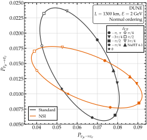

.. _ex-sec-biprobability:

Bi-probability plot
-------------------

.. _ex-fig-biprobability:

   **Bi-probability plot at the DUNE baseline.** Antineutrino against neutrino appearance probability, as :math:`\delta_{\rm CP}` varies, at 2 GeV, over the 1300-km baseline of DUNE, through matter of constant density 3 g cm\ :math:`^{-3}`. The two curves are for standard oscillations and for oscillations with non-standard interactions (NSI), with the couplings of Figure :ref:`New physics along an Earth chord <ex-fig-bsm>`: :math:`\varepsilon_{ee} = 0.10`, :math:`\varepsilon_{e\mu} = 0.05`, and :math:`\varepsilon_{\mu\tau} = 0.03`. Markers show selected values of :math:`\delta_{\rm CP}` and the NuFIT 6.1 best fit. Listing :ref:`Bi-probability curves at the DUNE baseline <ex-lst-biprobability>` computes the curves. See notebooks `#05 <https://github.com/mbustama/Magnus/blob/main/notebooks/05_magnus_biprobability.ipynb>`__ and `#28 <https://github.com/mbustama/Magnus/blob/main/notebooks/28_magnus_paper_figures.ipynb>`__.

Figure :ref:`Bi-probability plot at the DUNE baseline <ex-fig-biprobability>` shows a bi-probability plot  :cite:p:`Minakata:2001qm`: the antineutrino appearance probability against the neutrino one, at one energy and baseline. Each value of :math:`\delta_{\rm CP}` gives one point, so taking the phase through its range traces a closed curve. The figure draws two curves, for standard oscillations and for oscillations with non-standard interactions, and they cross at four points. At each crossing, one measurement of the two probabilities fits both cases; e.g., at :math:`P_{\nu_\mu \to \nu_e} = 0.080` and :math:`P_{\bar{\nu}_\mu \to \bar{\nu}_e} = 0.008`, it fits the standard case with :math:`\delta_{\rm CP} = -0.58\pi` and the non-standard one with :math:`\delta_{\rm CP} = -0.31\pi`. A new interaction can then pass for a shift in the phase. Separating the two takes a second measurement, at another energy or baseline.

Listing :ref:`Bi-probability curves at the DUNE baseline <ex-lst-biprobability>` computes the two curves. Both come from the same loop over :math:`\delta_{\rm CP}`: one calls the standard wrapper, the other the wrapper with non-standard interactions. Any two hypotheses that a measurement might confuse can be compared in the same way, by changing the wrapper or its parameters; notebook `#05 <https://github.com/mbustama/Magnus/blob/main/notebooks/05_magnus_biprobability.ipynb>`__, e.g., compares the two mass orderings.

.. _ex-lst-biprobability:

**Bi-probability curves at the DUNE baseline.** The two curves of Figure :ref:`Bi-probability plot at the DUNE baseline <ex-fig-biprobability>`. The function ``locus`` takes a wrapper once around :math:`\delta_{\rm CP}`, computing the neutrino and the antineutrino probability at each of 181 values. The oscillation parameters are the default set, NuFIT 6.1. No tolerance is passed: the Hamiltonian is constant, so the Magnus expansion ends at its first term, and the result is exact. The curves are drawn twice: first with ``plotting.plot_biprobability``, in the preset style of :ref:`ex-sec-plotting`, then with ``matplotlib`` directly. See notebooks `#05 <https://github.com/mbustama/Magnus/blob/main/notebooks/05_magnus_biprobability.ipynb>`__ and `#28 <https://github.com/mbustama/Magnus/blob/main/notebooks/28_magnus_paper_figures.ipynb>`__.

.. code-block:: python

   import numpy as np
   import matplotlib.pyplot as plt
   import magnus.oscprob as oscprob
   import magnus.globaldefs as gd
   import magnus.plotting as plotting

   # DUNE: 2 GeV, 1300 km; a crust-like 3 g/cm^3
   E, L, rho = 2.0*gd.UNIT_GEV, 1300.0*gd.UNIT_KM, 3.0
   kw = dict(nu_i=gd.NUMU, nu_f=gd.NUE,
             density_matter_is_in_g_per_cm3=True)
   eps = dict(eps_ee=0.10, eps_em=0.05, eps_mt=0.03)
   std = oscprob.osc_prob_3nu_matter_constant_density
   nsi = oscprob.osc_prob_3nu_matter_nsi_constant_density

   def locus(wrapper, **couplings):
       """(P_mu e, P_mubar ebar) once around delta_CP."""
       out = []
       for dcp in np.linspace(-np.pi, np.pi, 181):
           P = [wrapper(E, L, rho, nubar=nubar, dCP=dcp,
                        **couplings, **kw)
                for nubar in (False, True)]
           out.append(P)
       return np.array(out)

   P_std = locus(std)
   P_nsi = locus(nsi, **eps)

   # With the shipped plotter
   fig, ax = plotting.plot_biprobability(
       [P_std[:, 0], P_nsi[:, 0]],
       [P_std[:, 1], P_nsi[:, 1]],
       labels=['Standard', 'NSI'])

   # With matplotlib directly
   fig, ax = plt.subplots()
   for P, label in ((P_std, 'Standard'), (P_nsi, 'NSI')):
       ax.plot(P[:, 0], P[:, 1], label=label)
   ax.set_xlabel(r'$P_{\nu_\mu \to \nu_e}$')
   ax.set_ylabel(r'$P_{\bar\nu_\mu \to \bar\nu_e}$')
   ax.legend()
