Assorted long examples
----------------------

.. contents:: On this page
   :local:
   :depth: 1

.. _ex-sec-cavity:

A cavity in the Earth’s crust
~~~~~~~~~~~~~~~~~~~~~~~~~~~~~

.. _ex-fig-cavity:

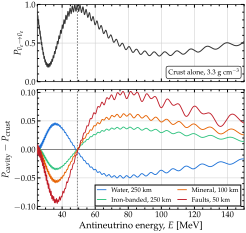

   **A cavity in the Earth’s crust.** Effect of a cavity in the Earth’s crust on the :math:`\bar{\nu}_e` survival probability over a baseline of :math:`1\,500` km, computed with Magνs, after Ref.  :cite:p:`Arguelles:2012nw`. *Top*: the crust alone. *Bottom*: the change that four cavities make to it, each centered on the baseline, with the density and width its label gives. The dashed line marks 49 MeV, where the crust curve peaks. The beam of Ref.  :cite:p:`Arguelles:2012nw` spans 5–150 MeV; below 25 MeV, the oscillation is too rapid to draw. Listing :ref:`A cavity in the Earth's crust <ex-lst-cavity>` computes every curve. See notebook `#28 <https://github.com/mbustama/Magnus/blob/main/notebooks/28_magnus_paper_figures.ipynb>`__.

.. _ex-lst-cavity:

**A cavity in the Earth’s crust.** The curves of Figure :ref:`A cavity in the Earth’s crust <ex-fig-cavity>`. Each cavity is a density profile with two walls, declared as breakpoints. See notebook `#28 <https://github.com/mbustama/Magnus/blob/main/notebooks/28_magnus_paper_figures.ipynb>`__.

.. code-block:: python

   import numpy as np
   import magnus.oscprob as oscprob
   import magnus.matter as matter
   import magnus.globaldefs as gd

   L0 = 1500.0                     # km, source to detector
   RHO_CRUST, YE_CRUST = 3.3, 0.5  # round crust values
   E = np.linspace(25.0, 150.0, 2500)*gd.UNIT_MEV
   osc = gd.load_nufit_params('NuFIT 6.1')
   kw = dict(osc_params=osc, L0=0.0, nu_i=gd.NUE,
             nu_f=gd.NUE, nubar=True, rtol=1.0e-8,
             atol=1.0e-10,
             density_is_of_number_of_electrons=True)

   def n_e(rho, ye):
       """Electron density [eV^3] of uniform matter."""
       return matter.num_density_e_func(
           0.0, lambda _: rho, electron_fraction=ye,
           ratio_number_neutrons_to_protons=(1.0-ye)/ye,
           density_matter_is_in_g_per_cm3=True)

   NE_CRUST = n_e(RHO_CRUST, YE_CRUST)

   def cavity(rho, ye, w):
       """Crust holding a cavity of width w, centered."""
       d = (L0 - w)/2.0
       ne_in = n_e(rho, ye)

       def profile(l):
           x = np.asarray(l, dtype=float)/gd.UNIT_KM
           return NE_CRUST + (ne_in - NE_CRUST) \
               *((x >= d) & (x <= d + w))

       return profile, np.array([d, d + w])*gd.UNIT_KM

   # An empty crust needs no profile, only a number
   P0 = oscprob.osc_prob_matter_std_potential(
       3, NE_CRUST, E, L0*gd.UNIT_KM, **kw)

   # Water, iron, a mineral deposit, a zone of faults:
   # (rho, Y_e, w) for each
   CASES = [(1.0, 0.555, 250.0), (5.0, 0.5, 250.0),
            (10.0, 0.5, 100.0), (25.0, 0.5, 50.0)]
   dP = []
   for rho, ye, w in CASES:
       profile, walls = cavity(rho, ye, w)
       # The two walls are density jumps: declare them
       P = oscprob.osc_prob_matter_std_potential(
           3, profile, E, L0*gd.UNIT_KM,
           t_breakpoints=walls, **kw)
       dP.append(P - P0)

A region of anomalous density along the trajectory of a neutrino moving in an otherwise uniform medium changes the oscillation probability measured at the far end. This observation has motivated proposals for using neutrinos to search for underground cavities in the Earth’s crust. We use Magνs to implement the prescription of Ref. :cite:p:`Arguelles:2012nw`: a low-energy :math:`\bar{\nu}_e` beam crossing :math:`1\,500` km of crust, with the survival probability measured from 5 to 150 MeV. Our goal is primarily illustrative; we point out the doubtful feasibility of such an experimental setup.

Listing :ref:`A cavity in the Earth's crust <ex-lst-cavity>` sets this up in Magνs. The crust is uniform at 3.3 g cm\ :math:`^{-3}` with :math:`Y_e = 0.5`, a round value close to the 0.4952 of the PREM crust. The cavity is a slab of different density centered on the baseline. We show cavities of four densities :cite:p:`Arguelles:2012nw`: water at 1 g cm\ :math:`^{-3}` and :math:`Y_e = 0.555`, an iron-banded formation at 5 g cm\ :math:`^{-3}`, a mineral deposit at 10 g cm\ :math:`^{-3}`, a zone of seismic faults at 25 g cm\ :math:`^{-3}`. Their widths along the neutrino trajectory fall from 250 to 50 km as the contrast with the crust grows. Each cavity has two walls. Every wall is a density jump: we pass their positions via ``t_breakpoints`` to the scenario function, allowing the refinement ladder to act inside the cavity.

Figure :ref:`A cavity in the Earth’s crust <ex-fig-cavity>` shows the resulting probabilities. Every cavity curve crosses zero near the :math:`49` MeV at which the crust curve peaks at 0.9997 (it would be exactly 1 if :math:`\theta_{13}` were zero). The presence of a cavity moves the peak energy. Adding column density pushes the peak up in energy; removing column density pulls it down. What a cavity does to the curve is to displace it bodily along the energy axis, leaving its shape almost untouched. For a denser cavity, at energies below the peak the peak has moved further away, so the probability there falls; at energies above the peak it has moved closer, so the probability rises. A lighter cavity moves the peak the other way, swapping both signs. Either way the shift crosses zero between the crust’s peak and the cavity’s, which puts the four crossings between 48.1 and 49.5 MeV.

Figure :ref:`A beam swept across a buried body <ex-fig-cavity-sweep>` turns the neutrino beam across the cavity. The source stays put and the baseline keeps its length; only the direction changes, by an angle :math:`\alpha`. Each direction cuts a different slice through the same cavity, a sphere of radius 125 km centered 750 km along the baseline. (Reference :cite:p:`Arguelles:2012nw` works with elliptical cavities, but a sphere carries the point just as well.) The spread of the angle is :math:`\alpha = \pm 9.59^\circ`; within those angles, the cavity width it crosses traces a semicircle.

The probability contrast map reflects that semicircle. Structure fills the :math:`\alpha` band and fades at its edges as the width falls. Outside the band, the beam misses the body, so the profile is the uniform crust and the difference is exactly zero. The sweep is what separates a large, light body from a small heavy one: a single direction measures only the excess column, in which density and width are degenerate, while the angular width of the band fixes the size by itself. Listing :ref:`A beam swept across a buried body <ex-lst-cavity-sweep>` computes the map.

.. _ex-fig-cavity-sweep:

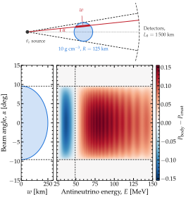

   **A beam swept across a buried body.** *Top*: the geometry. The beam leaves the source at an angle :math:`\alpha` and reaches a detector on the dashed arc, :math:`1\,500` km away. The two dashed straight lines are the beams tangent to the body, at :math:`\alpha = \pm 9.59^\circ`. A neutrino beam crosses the cavity width, :math:`w`. *Bottom left*: width against angle, i.e., the cavity’s silhouette. *Bottom right*: change in probability over energy and angle. The dashed vertical line marks the :math:`49` MeV of Figure :ref:`A cavity in the Earth’s crust <ex-fig-cavity>`. Listing :ref:`A beam swept across a buried body <ex-lst-cavity-sweep>` computes the map. See notebook `#28 <https://github.com/mbustama/Magnus/blob/main/notebooks/28_magnus_paper_figures.ipynb>`__.

.. _ex-lst-cavity-sweep:

**A beam swept across a buried body.** The map of Figure :ref:`A beam swept across a buried body <ex-fig-cavity-sweep>`, which reuses ``n_e``, ``NE_CRUST``, ``L0``, and ``kw`` from Listing :ref:`A cavity in the Earth's crust <ex-lst-cavity>`. For each beam angle, ``crossing`` finds where the chord enters and leaves the body. Each call uses these two points twice: as the edges of the body in the density profile, and as ``t_breakpoints``. Angles at which the beam misses the body are skipped, since there the probability equals the crust-only ``P0``.

.. code-block:: python

   import numpy as np

   BODY_R, BODY_D0 = 125.0, 750.0   # km: size, position
   NE_BODY = n_e(10.0, 0.5)         # a mineral deposit
   E = np.linspace(25.0, 150.0, 400)*gd.UNIT_MEV
   ALPHA = np.linspace(-15.0, 15.0, 220)

   def crossing(alpha_deg):
       """Entry and exit points in the body [km]."""
       a = np.radians(alpha_deg)
       miss = abs(BODY_D0*np.sin(a))
       if miss >= BODY_R:
           return None              # the beam misses it
       half = np.sqrt(BODY_R**2 - miss**2)
       mid = BODY_D0*np.cos(a)
       return mid - half, mid + half

   P0 = oscprob.osc_prob_matter_std_potential(
       3, NE_CRUST, E, L0*gd.UNIT_KM, **kw)

   dP = np.zeros((len(E), len(ALPHA)))
   for j, alpha in enumerate(ALPHA):
       seg = crossing(alpha)
       if seg is None:
           continue                 # no body, no change
       lo, hi = seg

       def body(l, lo=lo, hi=hi):
           x = np.asarray(l, dtype=float)/gd.UNIT_KM
           return NE_CRUST + (NE_BODY - NE_CRUST) \
               *((x >= lo) & (x <= hi))

       # The walls move with the angle, so every call
       # declares its own pair
       dP[:, j] = oscprob.osc_prob_matter_std_potential(
           3, body, E, L0*gd.UNIT_KM,
           t_breakpoints=np.array(seg)*gd.UNIT_KM,
           **kw) - P0

.. _ex-sec-geoneutrinos:

Geoneutrinos
~~~~~~~~~~~~

.. _ex-fig-geoneutrinos:

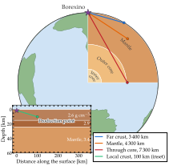

   **Geoneutrino geometry at Borexino.** The geometry of a geoneutrino measurement at Borexino, at Gran Sasso, 1.4 km underground. A quarter of the Earth is cut away to expose the PREM layers of Figure :ref:`The Earth’s density profile <ex-fig-prem>`. Three chords reach production points beyond the local crust: in the far crust, 20 km deep and 3 400 km away, on a path that dips into the upper mantle; in the mantle, 1 000 km deep and 4 300 km away; and at the base of the mantle, 2 800 km deep and 7 300 km away, on a path through the outer core. The inset shows the local crust, to scale in distance and stretched in depth, with the crust layers of PREM and a production point 10 km deep and 100 km away. See notebook `#28 <https://github.com/mbustama/Magnus/blob/main/notebooks/28_magnus_paper_figures.ipynb>`__.

Geoneutrinos are the :math:`\bar{\nu}_e` emitted in the decay chains of uranium-238 and thorium-232 inside the Earth  :cite:p:`Bellini:2013wsa`. Inverse beta decay detects them above 1.8 MeV; the uranium chain ends at 3.3 MeV, so that window holds the whole detectable spectrum. The sources are the crust and the mantle. Uranium and thorium are lithophile elements: they concentrate in silicate rock in the crust and the mantle; the metallic core contains neither. Potassium-40, the one radioactive nuclide sometimes assigned to the core, emits below the energy detection threshold. The core still enters the calculation, though, as the medium that neutrinos from the far side of the mantle cross. For a detector at or near the surface, the production points lie from a few km to a full Earth diameter away. As example, we take Borexino as the detector, located at Gran Sasso, 1.4 km underground.

Figure :ref:`Geoneutrino geometry at Borexino <ex-fig-geoneutrinos>` shows the setup: four production points, in the local crust, the far crust, the mantle, and at the base of the mantle, illustrate the four kinds of path a geoneutrino takes to Borexino.

.. _ex-fig-geoneutrino-energy:

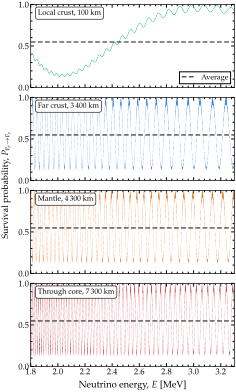

   **Geoneutrino survival against energy.** Survival probability of geoneutrinos reaching Borexino, against energy, from the four production points of Figure :ref:`Geoneutrino geometry at Borexino <ex-fig-geoneutrinos>`. Every curve resolves the pair split by :math:`\Delta m^2_{31}`; it rides on the pair split by :math:`\Delta m^2_{21}` as a fine ripple. The line across every panel marks the phase average in vacuum. Listing :ref:`Geoneutrino survival against energy <ex-lst-geoneutrinos>` computes the four panels. See notebook `#28 <https://github.com/mbustama/Magnus/blob/main/notebooks/28_magnus_paper_figures.ipynb>`__.

Figure :ref:`Geoneutrino survival against energy <ex-fig-geoneutrino-energy>` shows the survival probability against energy for these four production points. From the local crust, the pair split by :math:`\Delta m^2_{21}`—the slow pair—completes three quarters of a cycle across the window; the pair split by :math:`\Delta m^2_{31}`—the fast pair—rides on it, 26 cycles across the window. From the far crust, the mantle and the base of the mantle, the slow pair alone cycles 26 to 56 times across the window; the fast pair, 900 to 1 900 times; the figure resolves both. A detector bins energy far more coarsely than that—which we do not show here—so a measurement of a distant reservoir sees instead the average probability.

In Figure :ref:`Geoneutrino survival against energy <ex-fig-geoneutrino-energy>`, the average value shown is the phase-average in vacuum, 0.548. Matter raises the average along these chords by 0.3–0.8%, less than the width of the line, so the vacuum value serves our calculation. The size of that shift follows from :doc:`/averaged_probability`. The passage through Earth is adiabatic: the largest jump in the electron density, at the core-mantle boundary, changes the mixing in matter by less than a percent at these energies, so the neutrino stays in the eigenstate it was produced in. The average is then the :ref:`averaged limit on a varying profile <avg-varying>` with :math:`P^{\rm cross}` the identity, fixed by the eigenbases at the two ends of the path alone. At both ends, the matter potential is 1–2% of the vacuum splitting of the slow pair, so each of those eigenbases is nearly the vacuum one. The route of :ref:`ex-sec-average-keyword` for a profile without declared discontinuities computes the average in matter. Along the mantle chord, with the density of PREM and the electron fraction of the mantle, next to the vacuum value, this is

.. code-block:: python

   from magnus.earth import (
    distance_traveled_inside_earth as chord,
    earth_radial_distance_from_depth as radius,
    density_matter_func_prem as prem,
    Y_E_MANTLE_PREM)

   osc = gd.load_nufit_params('NuFIT 6.1')
   c, depth = -0.552, 1000.0   # mantle chord
   geo = dict(source_depth=depth,
              detector_depth=1.4)          # km
   L = chord(c, **geo)                     # km
   def rho(l):   # PREM along the chord, g/cm^3
       r = radius(c, l/gd.UNIT_KM, **geo)
       return prem(r,
                   density_matter_ocean=2.65)
   E = 2.5*gd.UNIT_MEV
   P_m = oscprob.osc_prob_matter_std_potential(
    3, rho, E, L*gd.UNIT_KM, osc, average=True,
    nubar=True, nu_i=gd.NUE, nu_f=gd.NUE,
    electron_fraction=Y_E_MANTLE_PREM,
    density_matter_is_in_g_per_cm3=True)
   # 0.551
   P_v = oscprob.osc_prob_3nu_vacuum(E,
    L*gd.UNIT_KM, average=True, nubar=True,
    nu_i=gd.NUE, nu_f=gd.NUE)
   # 0.548

Listing :ref:`Geoneutrino survival against energy <ex-lst-geoneutrinos>` computes the panels of Figure :ref:`Geoneutrino survival against energy <ex-fig-geoneutrino-energy>`. The Earth wrapper ``osc_prob_3nu_earth`` is called without ``average=True``: it returns the resolved probability of the panels. With ``average=True`` it would instead take the energy-window route of :ref:`ex-sec-average-keyword`, because it declares the PREM boundaries itself; the result would be a window mean with a standard error of 0.05. A production point enters through its depth and the cosine of its zenith angle at the detector, with ``nubar=True``. Every chord crosses PREM boundaries, six from the far crust, nine through the core; the call to ``osc_prob_3nu_earth`` declares them to the refinement ladder internally. The ocean layer of PREM is replaced by rock via ``density_matter_ocean``, since Gran Sasso is a continental site. The last call in Listing :ref:`Geoneutrino survival against energy <ex-lst-geoneutrinos>` is the computation for the local crust. The production point sits at the end of its chord nearest to the detector, 100 km from it. The survival probability of a flavor is the same along a path and along its reverse, so the listing runs the segment from the detector to the production point, with the two depths in swapped roles and the zenith angle taken at the production point.

.. _ex-lst-geoneutrinos:

**Geoneutrino survival against energy.** The four panels of Figure :ref:`Geoneutrino survival against energy <ex-fig-geoneutrino-energy>`: the survival probability of a geoneutrino reaching Borexino from the far crust, the mantle, the base of the mantle, and the local crust, across the detectable window, on one energy grid fine enough to resolve the pair split by :math:`\Delta m^2_{31}` on the longest chord. See notebook `#28 <https://github.com/mbustama/Magnus/blob/main/notebooks/28_magnus_paper_figures.ipynb>`__.

.. code-block:: python

   import numpy as np
   import magnus.oscprob as oscprob
   import magnus.globaldefs as gd

   # Twelve energies per cycle of the pair split by
   # Dm31^2 on the longest chord, 7,300 km
   E = 1/np.linspace(1/1.8, 1/3.3, 22500)*gd.UNIT_MEV

   # Borexino, 1.4 km underground.  A production point
   # enters as its depth and the cosine of its zenith
   # angle at the detector; the call declares the PREM
   # boundaries on the chord by itself.  The oscillation
   # parameters are the defaults, NuFIT 6.1.
   points = {'far crust': (20.0, -0.272),    # 3,400 km
             'mantle': (1000.0, -0.552),     # 4,300 km
             'core': (2800.0, -0.872)}       # 7,300 km
   P = {}
   for name, (depth, costhz) in points.items():
       P[name] = oscprob.osc_prob_3nu_earth(E,
        costhz=costhz, source_depth=depth*gd.UNIT_KM,
        detector_depth=1.4*gd.UNIT_KM, nubar=True,
        nu_i=gd.NUE, nu_f=gd.NUE,
        density_matter_ocean=2.65)

   # The local point, 10 km deep and 100 km away, sits
   # at the near end of its chord; the call runs every
   # chord from the far end.  The survival probability
   # is the same along a path and along its reverse, so
   # run the segment from the detector, with the depths
   # swapped and the zenith angle taken at the
   # production point.
   P['local'] = oscprob.osc_prob_3nu_earth(E,
    costhz=0.078, source_depth=1.4*gd.UNIT_KM,
    detector_depth=10.0*gd.UNIT_KM, nubar=True,
    nu_i=gd.NUE, nu_f=gd.NUE,
    density_matter_ocean=2.65)

.. _ex-fig-geoneutrino-flux:

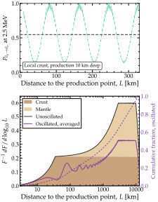

   **Where the geoneutrino flux comes from.** Where the detectable geoneutrino flux at Borexino comes from and what oscillations leave of it. *Top*: the survival probability at 2.5 MeV against the distance to a production point 10 km deep, across the local crust, with the pair split by :math:`\Delta m^2_{31}` resolved; the horizontal line is the phase average. *Bottom*: the distribution of the flux of Eq. :eq:`ex-equ-geoflux` in the distance to the production point, per unit :math:`\log_{10} L` and as a fraction of the total, for a spherically symmetric Earth with a 35-km crust holding 7 TW of radiogenic power, a mantle with the abundances of the geochemical model of Ref. :cite:p:`Bellini:2013wsa`, and no uranium or thorium in the core. The unoscillated curve has :math:`\langle P_{\bar\nu_e \to \bar\nu_e} \rangle = 1`; the shading splits it between the two reservoirs. The oscillated curve folds in the survival probability averaged over the detectable window with equal weight in energy; its cumulative fraction is on the right axis. See notebook `#28 <https://github.com/mbustama/Magnus/blob/main/notebooks/28_magnus_paper_figures.ipynb>`__.

Figure :ref:`Where the geoneutrino flux comes from <ex-fig-geoneutrino-flux>` shows how the detectable flux is distributed over the distance to the production point and how much of it survives the oscillations. A flux measurement weighs the curves of Figure :ref:`Geoneutrino survival against energy <ex-fig-geoneutrino-energy>` by that distribution. The Earth model chosen for the figure is the simplest one that carries both reservoirs: a spherically symmetric crust 35-km thick holding 7 TW of radiogenic power at a thorium-to-uranium ratio of 4.5, a mantle with the abundances of the geochemical model of Ref. :cite:p:`Bellini:2013wsa`, no uranium or thorium in the core, and the density of PREM throughout. The flux at the detector is

.. math::
   :label: ex-equ-geoflux

   F = \int_\oplus d^3r \, \frac{\varepsilon(\mathbf{r})}{4 \pi L^2} \, \langle P_{\bar\nu_e \to \bar\nu_e} \rangle (L) \,, \qquad L = \lvert \mathbf{r} - \mathbf{r}_{\rm det} \rvert \,,

where :math:`\varepsilon(\mathbf{r})` is the number of detectable :math:`\bar{\nu}_e` emitted per unit volume and time at position :math:`\mathbf{r}`, fixed by the density of PREM and the abundances above. The survival probability from that point, :math:`\langle P_{\bar\nu_e \to \bar\nu_e}(L) \rangle`, is the mean over the detectable window, 1.8–3.3 MeV. In spherical coordinates centered on the detector, :math:`d^3r = L^2 \, dL \, d\Omega` and the :math:`L^2` cancels: the production points between :math:`L` and :math:`L + dL` contribute :math:`dL / 4\pi` times the emissivity integrated over the directions in which that shell lies inside the Earth. The lower panel of Figure :ref:`Where the geoneutrino flux comes from <ex-fig-geoneutrino-flux>` shows this distribution per unit :math:`\log_{10} L`, normalized to the total flux without oscillations, so that the area under a curve between two distances is the share of the flux from between them. In the unoscillated curve (normalized so :math:`\langle P_{\bar\nu_e \to \bar\nu_e} \rangle = 1`), 61% of the detectable flux comes from the crust, 17% from within 100 km, 30% from within 350 km, and 43% from within 1 000 km.

The oscillated curve is the same distribution multiplied by :math:`\langle P_{\bar\nu_e \to \bar\nu_e}(L) \rangle`, computed in two pieces. Up to 331 km, the probability is propagated through the crust with the last call of Listing :ref:`Geoneutrino survival against energy <ex-lst-geoneutrinos>`, once per distance on the grid, then averaged over the energy window. Beyond 331 km, the vacuum probability averaged over the same window is used instead: matter changes the average by 0.01 at that distance and by less farther out (Figure :ref:`Geoneutrino survival against energy <ex-fig-geoneutrino-energy>`). The upper panel shows the probability through the crust at 2.5 MeV, before the average: the slow pair oscillates every 84 km and the fast pair every 2.5 km, as a ripple. In the lower panel, the oscillated curve still ripples out to a few hundred km, where the window holds too few cycles of the slow pair to average them out; farther out it is smooth. Over the whole Earth, oscillations leave 54% of the detectable flux.

.. _ex-sec-solar-tomography:

Neutrino tomography of the Sun
~~~~~~~~~~~~~~~~~~~~~~~~~~~~~~

.. _ex-fig-solar-adiabaticity:

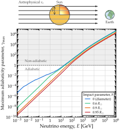

   **Adiabaticity along a solar chord.** *Top*: the setup. An isotropic flux of :math:`\nu_e` crosses the Sun and continues to Earth, where it may oscillate. The impact parameter :math:`b` is marked on one ray. *Bottom:* Adiabaticity of a neutrino trajectory through the Sun against neutrino energy, computed with Magνs on the B16-GS98 solar density profile  :cite:p:`Vinyoles:2016djt`, tabulated up to the surface, for four impact parameters, each defining a chord through the Sun. The parameter :math:`\gamma_{\rm max}` is the adiabaticity parameter of the :ref:`averaged limit on a varying profile <avg-varying>`, evaluated at its maximum value along the chord and over the three pairs of eigenvalue levels. See notebook `#28 <https://github.com/mbustama/Magnus/blob/main/notebooks/28_magnus_paper_figures.ipynb>`__.

Neutrinos made outside the Solar System cross the Sun on their way to Earth. At around 10 MeV, they are mainly from the diffuse supernova neutrino background. From TeV to PeV, they are part of the high-energy astrophysical flux. Both fluxes are isotropic, so a share of each passes through the Sun before reaching a detector. Below, we compute what that does to their oscillations, using the B16-GS98 profile  :cite:p:`Vinyoles:2016djt` of Table :ref:`ex-tab-solar-models`. Unlike BS2005-AGS,OP, it is tabulated up to the solar surface, so every chord crosses the whole Sun.

A neutrino from such a source has traveled far enough that the wave packets of its mass eigenstates have separated. What arrives is an incoherent mixture, so what is measured is the phase-averaged probability of :doc:`/averaged_probability` instead of the instantaneous one. Inside the Sun, the Hamiltonian changes along the path, so the phase average is carried along it (:doc:`/averaged_probability`). The neutrino starts decohered in the eigenbasis at the point of entry and follows the instantaneous eigenstates. It crosses each non-adiabatic region through a Magnus patch and is read out in flavor at exit. Where no crossing is non-adiabatic, the result is the :ref:`averaged limit on a varying profile <avg-varying>`, with the level-crossing matrix :math:`P^{\rm cross}` between the eigenbases at entry and exit.

Both ends of the path lie in vacuum, where the eigenvectors are the vacuum mixing matrix, so :math:`\mathbb{V}(l_0) = \mathbb{V}(l_1) = \mathbb{R}` in the :ref:`averaged limit on a varying profile <avg-varying>`. An adiabatic passage would make :math:`P^{\rm cross}` the identity. The varying-profile average would then collapse to the :ref:`averaged limit <avg-limit>` evaluated in vacuum, leaving no trace of the Sun. Whether or not the passage is adiabatic depends on the energy, via the adiabaticity parameter (:ref:`avg-varying`).

A solar neutrino behaves differently: because it is born deep inside the Sun, at high density, it begins as a matter eigenstate. The adiabatic passage outward then maps it onto a single mass eigenstate. That is the MSW effect of :ref:`ex-sec-sun`. A neutrino crossing from outside meets the same density profile, but enters it as a vacuum mass eigenstate. Because the density vanishes at both ends of that path, adiabatic passage keeps the neutrino in one eigenstate of the instantaneous :math:`\mathbb{H}` and returns it to the mass eigenstate it entered with. What separates the two cases is where each path begins and ends.

Figure :ref:`Adiabaticity along a solar chord <ex-fig-solar-adiabaticity>` shows how adiabatic the passage is, from MeV to PeV, for four choices of the impact parameter at which the neutrinos hit the Sun, and assuming three flavors. The :ref:`averaged limit on a varying profile <avg-varying>` attaches an adiabaticity parameter :math:`\gamma_{jk}(l)` to every pair of eigenvalues (1-2, 1-3, 2-3) of :math:`\mathbb{H}` at every point :math:`l` of the trajectory. It is large where two of those eigenvalues approach each other and small where they stay apart. The figure plots :math:`\gamma_{\rm max}`, the largest value found anywhere along the chord and over all three pairs, so a curve above one means the neutrino moves between eigenstates of :math:`\mathbb{H}` somewhere on its way through. The parameter can be computed using the ``adiabatic`` module of Magνs:

.. code-block:: python

   import numpy as np
   import magnus.adiabatic as adiabatic
   import magnus.hamiltonians as ham
   import magnus.matter as matter
   import magnus.globaldefs as gd
   import magnus.solarmodels as solarmodels

   R = gd.SUN_RADIUS*gd.UNIT_KM
   ne_sun = solarmodels.electron_density_profile(
       'B16-GS98')
   b = 0.3*R                # impact parameter
   half = np.sqrt(R**2 - b**2)
   E = 100.0*gd.UNIT_GEV
   hv = ham.hamiltonian_3nu_vacuum(E, **osc)

   def ne(l):
       """Electron density on the chord."""
       r = np.sqrt((l - half)**2 + b**2)
       return ne_sun(r)

   def H(l):
       """Hamiltonian at l along the chord."""
       h = np.array(hv, dtype=complex)
       h[0, 0] += matter.VCC_func(l, ne)
       return h

   info = {}
   adiabatic.find_nonadiabatic_windows(
       H, 0.0, 2*half, n_probe=20000,
       info=info)
   info['gamma_max']        # 13.7580

Here, ``ne_sun`` is the B16-GS98 table, interpolated in its logarithm, ``ne`` evaluates it along the chord, and ``hv`` is the vacuum Hamiltonian at this energy. The value shown is for a :math:`100`-GeV neutrino crossing at an impact parameter of :math:`b = 0.3\,R_\odot`.

The parameter :math:`\gamma_{\rm max}` grows with energy because the vacuum splitting :math:`\Delta m^2/2E` shrinks while the matter potential in the Sun stays fixed. It is attained just inside the 1-2 resonance, where the matter potential equals :math:`\Delta m^2_{21}\cos 2\theta_{12}/2E`, independently of the impact parameter. As the energy grows, that density is reached further out: :math:`\gamma_{\rm max}` sits at :math:`0.97\,R_\odot` at :math:`100` GeV, at :math:`0.990\,R_\odot` at 1 TeV, and at :math:`0.998\,R_\odot` at 100 TeV. By 1 PeV, it reaches :math:`5\times10^6` on the diameter. [Figure :ref:`Adiabaticity along a solar chord <ex-fig-solar-adiabaticity>` shows only the effect of oscillations; absorption, which matters above the GeV scale, is outside what Magνs models (:doc:`/diagnostics`).]

.. _ex-fig-solar-tomography:

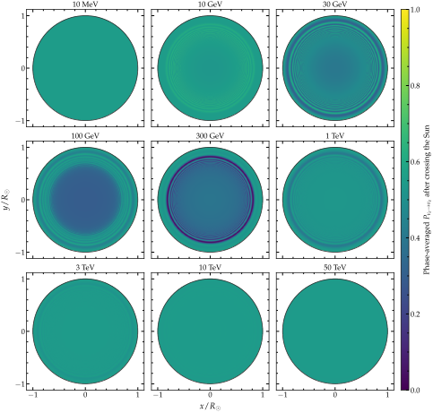

   **The Sun in the electron-neutrino channel.** The Sun seen face-on in the :math:`\nu_e` survival channel, computed with Magνs on the B16-GS98 solar density profile  :cite:p:`Vinyoles:2016djt`. The line of sight runs into the page, so each point of the disk is an impact parameter and the neutrino crosses the whole Sun along it. The color is the phase-averaged :math:`P_{\nu_e \to \nu_e}` at exit, for a relative energy spread of :math:`10\%`, averaged over the area of each pixel. See notebook `#28 <https://github.com/mbustama/Magnus/blob/main/notebooks/28_magnus_paper_figures.ipynb>`__.

Figure :ref:`The Sun in the electron-neutrino channel <ex-fig-solar-tomography>` shows the averaged survival probability across the face of the Sun, at selected energies. The line of sight runs into the page, so each point in the disk fixes the impact parameter of one trajectory, along which the neutrino crosses the whole Sun. For one impact parameter, the probability is computed via

.. code-block:: python

   import magnus.oscprob as oscprob

   # The chord above: b = 0.3 R_sun
   P = oscprob.osc_prob_matter_std_potential(
       3, ne, E, 2*half, average=True,
       average_initial_state='decohered',
       osc_params=osc, L0=0.0, nu_i=gd.NUE,
       nu_f=gd.NUE,
       density_is_of_number_of_electrons=True)
   # PhaseAveragingWarning: the phase-averaged
   # probability depends on the energy spread at
   # 1 of 1 (energy, L) point(s): some interference
   # has partly survived the spread
   # average_spread=0.1, so the result changes by
   # more than 0.001 per e-fold of it (largest
   # 1.1e-02). ...
   P                        # 0.283618

Here, ``average=True`` returns the phase average along the chord, without sampling energies, for a neutrino that reaches the Sun decohered (i.e., as :math:`\nu_1`, :math:`\nu_2`, or :math:`\nu_3`). The warning reports that part of the interference survives the default spread of 10%, the one Figure :ref:`The Sun in the electron-neutrino channel <ex-fig-solar-tomography>` uses; ``average_spread`` sets another. The choice of initial state (:ref:`ex-sec-average-keyword`) matters on this chord:

.. code-block:: python

   kw = dict(
       osc_params=osc, L0=0.0, nu_i=gd.NUE,
       nu_f=gd.NUE, average=True,
       density_is_of_number_of_electrons=True)
   f = oscprob.osc_prob_matter_std_potential
   for start in ('flavor', 'decohered'):
       P = f(3, ne, E, 2*half, **kw,
             average_initial_state=start)
       print(start, P)  # 0.535944, 0.283618
   # Each call raises the same warning

A :math:`\nu_e` produced at the edge of the Sun would keep the interference between :math:`\nu_1` and :math:`\nu_2`, whose phase across the Sun is only about 1 rad at 100 GeV. A neutrino from a distant source arrives without it, which is why Figure :ref:`The Sun in the electron-neutrino channel <ex-fig-solar-tomography>` uses ``'decohered'``. :ref:`ex-sec-averaging-is-not-estimating` shows why averaging a scan of probabilities does not necessarily reproduce this. (The phase average keeps the matter phase :math:`\int V_{\rm CC}\,dl`, :math:`8676` rad across the diameter. That phase does not depend on the energy, so no energy spread averages it. It draws rings in the core of the disk, :math:`1.8\times10^{-4}\,R_\odot` apart at :math:`b = 0.11\,R_\odot` and :math:`5.1\times10^{-4}\,R_\odot` apart at :math:`b = 0.3\,R_\odot`. At 1 TeV, they move :math:`P` by up to about :math:`\pm 0.03`. The value printed above sits on one of them: within one ring spacing of :math:`b = 0.3\,R_\odot`, :math:`P` ranges from 0.282 to 0.308. Each pixel of Figure :ref:`The Sun in the electron-neutrino channel <ex-fig-solar-tomography>` is therefore averaged over its area. The panels from 30 GeV to 3 TeV sample :math:`7\,791` impact parameters each, :math:`6\,790` of them inside :math:`b = 0.5\,R_\odot`.)

At :math:`10` MeV, the disk is uniform at about :math:`\sum_i |\mathbb{U}_{ei}|^4 \approx 0.55`: the Sun is transparent, exactly as :math:`P^{\rm cross} = \mathbb{1}` requires. At intermediate energies, rings appear, within the non-adiabatic region of Figure :ref:`Adiabaticity along a solar chord <ex-fig-solar-adiabaticity>`. They are drawn by the crossings: where the passage is not adiabatic, the level-crossing probabilities depart from the identity. The phase average also keeps part of the interference that the :ref:`averaged limit <avg-limit>` discards. That interference changes the depth of the rings: at 300 GeV, the deepest one reaches :math:`P = 0.03` at :math:`b = 0.81\,R_\odot`, against :math:`0.20` in the :ref:`averaged limit <avg-limit>`. From 300 GeV up, the deepest ring moves outward, to :math:`b = 0.89\,R_\odot` at 1 TeV and :math:`0.91\,R_\odot` at 10 and 50 TeV. At 50 TeV, the disk is uniform again, but for a different reason than at 10 MeV: a :math:`\nu_e` that enters the Sun leaves it as a :math:`\nu_e`, at every impact parameter. The Sun only adds a phase to it; the survival probability does not depend on that phase.

To be clear, no neutrino telescope resolves any of this structure. While the Sun has been imaged in MeV neutrinos, most famously by Super-Kamiokande, the width of that image is set by the angular resolution of the detector: the recoil electron of neutrino-electron elastic scattering carries the neutrino direction only to within tens of degrees, against a disk of half a degree. At tens of TeV, the angular resolution is better, but still comparable to the size of the disk itself. The rings of Figure :ref:`The Sun in the electron-neutrino channel <ex-fig-solar-tomography>` are a few arcseconds to a few arcminutes wide. The rings of the matter phase, over which each pixel is averaged, are :math:`0.2` to :math:`4` arcseconds apart. In addition, the panels of Figure :ref:`The Sun in the electron-neutrino channel <ex-fig-solar-tomography>` at GeV energies—where the rings first appear—lie in a band where no astrophysical neutrino flux has been identified above the atmospheric background.

.. _ex-sec-jet:

Astrophysical relativistic jet
~~~~~~~~~~~~~~~~~~~~~~~~~~~~~~

Gamma-ray bursts are the relativistic jets that some massive stars launch as they collapse. Shells of plasma ejected by the central engine collide with one another along the jet; protons accelerated at those collisions make neutrinos of TeV to PeV energies  :cite:p:`Bustamante:2014oka`. The jet itself does not change their flavor composition: at the radii where the collisions happen, :math:`10^{13}`–:math:`10^{15}` cm, its density is around :math:`10^{-11}` g cm\ :math:`^{-3}`, nine orders of magnitude below the density at which a TeV neutrino resonates; the phase that the jet matter adds to the evolution is only :math:`10^{-4}`. Matter effects arise only while the jet is still inside the star, in the choked jets that never break out and in the precursor phase of the jets that do  :cite:p:`Mena:2006eq,Razzaque:2009kq,Sahu:2010ap,Varela:2014mma,Xiao:2015gea`. The neutrinos then cross the stellar envelope. Its density falls from about 0.3 g cm\ :math:`^{-3}` at the head of the jet to zero at the surface; somewhere along, neutrinos between :math:`100` GeV and :math:`100` TeV meet their 1-3 resonance. At the low energy end, the crossing is adiabatic and the neutrino leaves the star in a mass eigenstate; at the high end, it is not: the flavor content then survives. Therefore, the flavor ratios at Earth depend on the neutrino energy, in a way that reflects the density profile of the star  :cite:p:`Razzaque:2009kq,Xiao:2015gea`.

As example, we take a jet at :math:`r_0 = 6.3 \cdot 10^{10}` cm inside a blue supergiant of radius :math:`R_\star = 3 \cdot 10^{12}` cm, with the hydrogen envelope of Refs. :cite:p:`Mena:2006eq,Razzaque:2009kq`, :math:`\rho(r) = 3.3 \cdot 10^{-6}\,(R_\star/r - 1)^3` g cm\ :math:`^{-3}`, and an electron fraction of :math:`Y_e = 1`:

.. code-block:: python

   import numpy as np
   import magnus.globaldefs as gd
   import magnus.hamiltonians as ham
   import magnus.oscprob as oscprob

   OSC = gd.load_nufit_params('NuFIT 6.1')
   CM = 1.0e-5*gd.UNIT_KM   # One cm in eV^-1
   RSTAR = 3.0e12           # Star's radius, cm
   R0 = 6.3e10              # Jet head, cm

   def rho(l):
       """Density, g/cm3, at l in eV^-1."""
       return 3.3e-6*(RSTAR/(l/CM) - 1.0)**3

The density at the head is :math:`0.33` g cm\ :math:`^{-3}`. The oscillation length there is set by the potential, :math:`2\pi/V_{\rm CC} = 5 \cdot 10^{9}` cm, a tenth of :math:`r_0`, so the phase accumulated across the whole envelope is modest. The observable, the :ref:`phase-averaged probability <avg-phase-average>`, is built here from the evolution operator rather than from probabilities. The scenario functions return the operator alongside the probabilities when asked (``return_evolution_operator=True``), with the refinement ladder choosing the slabs internally:

.. code-block:: python

   E = 1.0*gd.UNIT_TEV
   out = oscprob.osc_prob_matter_std_potential(
       3, rho, E, RSTAR*CM, OSC, L0=R0*CM,
       electron_fraction=1.0,
       rtol=1.0e-6, atol=1.0e-6,
       density_matter_is_in_g_per_cm3=True,
       return_evolution_operator=True)
   P, U = out

Here, ``P`` is the probability matrix at the surface of the star and ``U`` is the evolution operator from the jet head to the surface, in the flavor basis.

.. _ex-fig-jet:

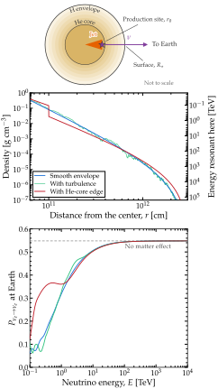

   **Jet neutrinos in a stellar envelope.** Neutrinos from a relativistic jet inside a collapsing star. *Top:* the setup. Neutrinos are made at the head of the jet, at :math:`r_0 = 6.3 \cdot 10^{10}` cm from the center, and leave the star at :math:`R_\star = 3 \cdot 10^{12}` cm. *Middle:* matter density along their path, for a smooth envelope, the same envelope with turbulence overlaid, and the same envelope with a drop in density at the edge of the helium core. The right axis gives the energy whose 1-3 resonance lies at each density. *Bottom:* probability that a :math:`\nu_e` produced at the jet head is detected as :math:`\nu_e` at Earth, against its energy, for the three envelopes. See notebook `#28 <https://github.com/mbustama/Magnus/blob/main/notebooks/28_magnus_paper_figures.ipynb>`__.

What a telescope detects is not the flavor content at the surface of the star: the neutrino travels a cosmological distance afterwards, over which the phases between its mass components average out, so it arrives as an incoherent mixture of mass eigenstates  :cite:p:`Razzaque:2009kq`. Its probability is the :ref:`phase-averaged form <avg-varying>`, with the eigenbasis at detection being the mixing matrix in vacuum, :math:`\mathbb{R}`. The factor in it that carries the star, the probability that a neutrino produced as :math:`\nu_\alpha` leaves it as the mass eigenstate :math:`\nu_i`, is read off the evolution operator as :math:`\lvert [\mathbb{R}^\dagger \mathbb{U}]_{i\alpha} \rvert^2`:

.. code-block:: python

   # Vacuum mass states; the content of each in
   # the state that leaves the star, by flavor
   hv = np.array(ham.hamiltonian_3nu_vacuum(
       E, **OSC), dtype=complex)
   w, R = np.linalg.eigh(hv)
   content = abs(R.conj().T @ U)**2

   # Phases average on the way to Earth
   P_earth = abs(R)**2 @ content
   P_earth[gd.NUE, gd.NUE]    # 0.315

Thus, the probability computed is :math:`P_{\nu_\alpha \to \nu_\beta} = \sum_i \left\lvert \left[ \mathbb{R}^\dagger\, \mathbb{U} \right]_{i\alpha} \right\rvert^2 \left\lvert \mathbb{R}_{\beta i} \right\rvert^2`. Without matter effects the same construction gives :math:`0.55`.

Figure :ref:`Jet neutrinos in a stellar envelope <ex-fig-jet>` shows this probability between 0.1 TeV and 10 PeV for three density envelopes. The neutrinos are not all made at the same point: the production region at the jet head is about one oscillation length across, so each curve averages over production points spread over that length. Without this average, the lowest energies would show an interference pattern, since their resonance lies only a few oscillation lengths from the head; a region of that size washes it out. The first envelope is the smooth profile above. The second overlays turbulence on it: a single realization of forty modes with a Kolmogorov spectrum, with wavelengths from :math:`10^{10}` to :math:`10^{12}` cm at a root-mean-square amplitude of twenty percent. The third is model C of Ref. :cite:p:`Mena:2006eq`, the same star with the density dropping by a factor of five at the edge of the helium core, :math:`r = 10^{11}` cm; in the code, that edge is declared to the ladder as a breakpoint. Listing :ref:`Jet neutrinos in a stellar envelope <ex-lst-jet>` is the calculation behind the figure.

.. _ex-lst-jet:

**Jet neutrinos in a stellar envelope.** Computing the data in Figure :ref:`Jet neutrinos in a stellar envelope <ex-fig-jet>`: the averaged :math:`\nu_e` survival probability at Earth for neutrinos from a jet head at :math:`r_0`, through the three envelopes. Each call returns the evolution operator from the refinement ladder alongside the probabilities; the projection onto the vacuum mass states and the sum over them are the :ref:`averaged limit on a varying profile <avg-varying>`, with the eigenbasis at detection the vacuum one. See notebook `#28 <https://github.com/mbustama/Magnus/blob/main/notebooks/28_magnus_paper_figures.ipynb>`__.

.. code-block:: python

   import numpy as np
   import magnus.globaldefs as gd
   import magnus.hamiltonians as ham
   import magnus.oscprob as oscprob

   OSC = gd.load_nufit_params('NuFIT 6.1')
   CM = 1.0e-5*gd.UNIT_KM               # One cm in eV^-1
   RSTAR, R0, RHE = 3.0e12, 6.3e10, 1.0e11      # cm
   E = np.geomspace(0.1, 1.0e4, 161)*gd.UNIT_TEV

   # The three envelopes, g/cm3, r in cm
   def smooth(r):
       return 3.3e-6*(RSTAR/r - 1.0)**3

   rng = np.random.default_rng(7)        
   lam = np.geomspace(1.0e12, 1.0e10, 40)  # Modes, cm
   k = 2*np.pi/lam
   amp = k**(-1/3)                         # Kolmogorov
   amp *= 0.20/np.sqrt(0.5*np.sum(amp**2)) # 20% rms
   phi = rng.uniform(0.0, 2*np.pi, 40)
   def turbulent(r):
       d = np.sum(amp*np.cos(k*r + phi))
       return smooth(r)*(1.0 + d)

   def stepped(r):            # Mena et al., model C
       x = RSTAR/r - 1.0
       return 6.3e-6*(20.0*x**2.1 if r < RHE else x**2.5)

   # Production points spread over one oscillation
   # length at the jet head
   r0s = R0 + 4.9e9*np.arange(8)/8.0

   def p_earth(rho, **extra):
       """P at Earth, averaged over the production
       points."""
       P_out = np.zeros((len(E), 3, 3))
       for r0 in r0s:
           P, U = oscprob.osc_prob_matter_std_potential(
               3, lambda l: rho(l/CM), E, RSTAR*CM, OSC,
               L0=r0*CM, electron_fraction=1.0,
               density_matter_is_in_g_per_cm3=True,
               rtol=1.0e-6, atol=1.0e-6,
               return_evolution_operator=True, **extra)
           for i, e in enumerate(E):
               hv = np.array(ham.hamiltonian_3nu_vacuum(
                   e, **OSC), dtype=complex)
               w, R = np.linalg.eigh(hv)
               content = abs(R.conj().T @ U[i])**2
               P_out[i] += abs(R)**2 @ content/len(r0s)
       return P_out

   P_smooth = p_earth(smooth)
   P_turb = p_earth(turbulent)
   P_step = p_earth(stepped, t_breakpoints=[RHE*CM])
   # Drawn: P_smooth[:, gd.NUE, gd.NUE], and the others

The smooth envelope sets the trend. At 0.1 TeV, a :math:`\nu_e` leaves the star mostly as :math:`\nu_3`—which has the least electron content among the three mass eigenstates—and so is rarely detected as :math:`\nu_e`. With rising energy, the survival probability climbs to its vacuum value, reached at 100 TeV. The reason is where the resonance sits. A neutrino of higher energy resonates farther out, where the density falls more gently, but its oscillation length grows faster than that gain, so the crossing becomes abrupt and the flavor content survives it. The PeV neutrinos that IceCube detects come out of the star as if it were not there.

Turbulence shifts the smooth curve by up to 0.05 below a few TeV. Those are the energies whose resonance lies where the modes of the realization match the local oscillation length; the mechanism is that of :ref:`ex-sec-turbulence`. The drop at the helium-core edge has a larger effect. The energies whose resonance density lies inside the drop, 0.15–0.7 TeV, do not cross the resonance gradually: they meet it in one jump, at the edge, so the crossing is non-adiabatic regardless of the energy and the flavor content survives. The result is the low-energy plateau in the probability seen in Figure :ref:`Jet neutrinos in a stellar envelope <ex-fig-jet>`. Above the band, the two envelopes agree again.

Each envelope takes well under a minute for the energies drawn and the eight production points averaged. The ladder settles on a few thousand slabs per energy at the tolerance requested (:math:`10^{-6}`), with the helium-core edge declared to it as a breakpoint.

.. _ex-sec-lri-sun:

Long-range interactions in the Sun
~~~~~~~~~~~~~~~~~~~~~~~~~~~~~~~~~~

.. _ex-fig-solar-lri:

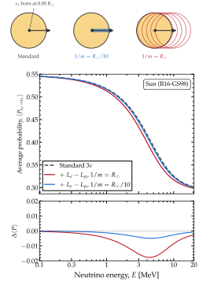

   **A long-range force in the Sun.** Averaged survival probability of solar neutrinos under a long-range :math:`L_e - L_\mu` interaction sourced by the electrons of the Sun. *Top:* the electrons that the neutrino feels at each mediator range. A :math:`\nu_e` born at :math:`0.05\,R_\odot` leaves along the ray drawn; the discs enclose the electrons within :math:`1/m` of it along the way. The charged-current potential is local, so it has no disc. At :math:`1/m = R_\odot/10`, the neutrino feels a narrow tube of electrons. At :math:`1/m = R_\odot`, it feels most of the Sun at once, even beyond the surface. *Middle:* :math:`\langle P_{\nu_e \to \nu_e}\rangle` against energy, in the B16-GS98 solar model :cite:p:`Vinyoles:2016djt`, without the new potential and with it at the two ranges. Both ranges share one coupling, fixed so that :math:`V_{e\mu}` is a tenth of :math:`V_{\rm CC}` where the neutrino is born, for :math:`1/m = R_\odot`. The probability is read out at :math:`20\,R_\odot`, where the new potential has faded. *Bottom:* the difference from the standard case. See notebooks `#19 <https://github.com/mbustama/Magnus/blob/main/notebooks/19_magnus_custom_hamiltonian.ipynb>`__ and `#28 <https://github.com/mbustama/Magnus/blob/main/notebooks/28_magnus_paper_figures.ipynb>`__.

This example adds a new term to the Hamiltonian, one that Magνs does not ship. We write it as described in :ref:`ex-sec-building-new-hamiltonian`, and average the probability as in the standard solar case of :ref:`ex-sec-sun`. The new term comes from gauging :math:`L_e - L_\mu`, the difference between the electron and muon lepton numbers, which is anomaly-free. Its gauge boson, :math:`Z'`, is a new light mediator :cite:p:`He:1990pn,Foot:1994vd`. The charge :math:`L_e - L_\mu` is :math:`+1` for the electron and :math:`\nu_e`, :math:`-1` for the muon and :math:`\nu_\mu`, and zero for every other field of the Standard Model. Therefore, the electrons of the Sun source a potential that :math:`\nu_e` and :math:`\nu_\mu` feel with opposite signs, and that :math:`\nu_\tau` does not feel. The Hamiltonian is

.. math::
   :label: ex-equ-h3-lri

   \mathbb{H}^{\rm LRI}(E, l)
   =
   \frac{\mathbb{A}}{E} + V_{\rm CC}(l)\,\mathbb{P}
   + V_{e\mu}(l)\,{\rm diag}\left(1, -1, 0\right) \;,

where the first two terms are the standard vacuum and charged-current terms of :doc:`/conventions`, and the third is the new one.

Unlike :math:`V_{\rm CC}`, the new potential is non-local. Each electron sources a Yukawa potential around it, with a range set by the mass :math:`m` of the :math:`Z'`. A neutrino at :math:`\mathbf{r}` feels the electrons within about :math:`1/m` of it:

.. math::
   :label: ex-equ-yukawa

   V_{e\mu}(\mathbf{r})
   =
   \frac{g^{\prime 2}}{4\pi}
   \int d^3r^\prime \, n_e(\mathbf{r}^\prime) \,
   \frac{e^{-m \lvert \mathbf{r} - \mathbf{r}^\prime \rvert}}
   {\lvert \mathbf{r} - \mathbf{r}^\prime \rvert} \;,

where :math:`g^\prime` is the new gauge coupling.

When the interaction range, :math:`1/m`, is larger than the body, the potential depends mainly on how many electrons the body holds, and only weakly on where they are :cite:p:`Wise:2018rnb`. When :math:`1/m` is much shorter than the distance over which the density changes, only nearby electrons contribute, and :math:`V_{e\mu} \to g^{\prime 2} n_e(\mathbf{r})/m^2`. In this limit, the potential is local and proportional to :math:`V_{\rm CC}`, like a non-standard interaction with constant couplings :cite:p:`Coloma:2020gfv`. Between the two limits, the potential depends on the shape of the density profile. For a spherical body, like the Sun, the angular integral can be done analytically. The potential then splits into the contributions of the electrons inside and outside radius :math:`r`:

.. math::
   :label: ex-equ-yukawa-1d

   \begin{split}
   V_{e\mu}(r)
   = {} &
   \frac{g^{\prime 2}}{r}\, e^{-m r}
   \int_0^{r} dr^\prime\, r^{\prime 2}\, n_e(r^\prime)\, {\rm shc}(m r^\prime) \\
   & + g^{\prime 2}\, {\rm shc}(m r)
   \int_r^{R_\odot} dr^\prime\, r^\prime\, n_e(r^\prime)\, e^{-m r^\prime} \;,
   \end{split}

where :math:`{\rm shc}(x) \equiv \sinh(x)/x`. Both are running integrals over the density profile, so one pass over the table of a solar model gives the potential at every radius. For a massless mediator, :math:`{\rm shc}` and the exponentials tend to 1, and Eq. :eq:`ex-equ-yukawa-1d` becomes the Coulomb potential of the electrons. Notebook `#19 <https://github.com/mbustama/Magnus/blob/main/notebooks/19_magnus_custom_hamiltonian.ipynb>`__ derives Eq. :eq:`ex-equ-yukawa-1d` and checks it against the closed form for a uniform ball.

Figure :ref:`A long-range force in the Sun <ex-fig-solar-lri>` shows the averaged :math:`\nu_e` survival probability from 0.1 to 20 MeV. The Sun is the B16-GS98 model :cite:p:`Vinyoles:2016djt`, whose density table reaches the surface. The neutrino is born at :math:`0.05\,R_\odot`, near where :math:`^8`\ B production peaks in that model. The figure compares the standard case with two mediator ranges, :math:`1/m = R_\odot` and :math:`R_\odot/10`, corresponding to :math:`m \approx 3 \cdot 10^{-16}` and :math:`3 \cdot 10^{-15}` eV, respectively. Both ranges share one coupling. We fix it so that :math:`V_{e\mu}` is a tenth of :math:`V_{\rm CC}` where the neutrino is born, for :math:`1/m = R_\odot`. The longer-ranged potential lowers the probability by up to 0.018, near 4 MeV. The shorter-ranged one lowers it by at most 0.005. Listing :ref:`A long-range force in the Sun <ex-lst-arbitrary>` contains the calculation behind the figure.

At the same coupling, a longer range lets the neutrino feel more of the Sun's electrons. Where the neutrino is born, the longer-ranged potential is :math:`0.10\,V_{\rm CC}`, about four times the shorter-ranged one, :math:`0.027\,V_{\rm CC}`. This difference at birth sets the difference between the two curves. The neutrino leaves the Sun adiabatically, so its averaged probability depends only on the Hamiltonian where it is born and where it is detected.

Along the path, both new potentials fall more slowly than :math:`V_{\rm CC}`. The electron density of the Sun falls by about five orders of magnitude from the center to :math:`0.98\,R_\odot`, and :math:`V_{\rm CC}` falls with it. In contrast, :math:`V_{e\mu}` is an integral over the electrons within about :math:`1/m`, which for the longer range include those of the dense core. Using the variables defined in Listing :ref:`A long-range force in the Sun <ex-lst-arbitrary>`, the ratio :math:`V_{e\mu}/V_{\rm CC}` at half a solar radius is

.. code-block:: python

   half = np.searchsorted(r, 0.5*R_SUN)
   v_emu[1.0][half]/vcc[half]     # 2.39
   v_emu[0.1][half]/vcc[half]     # 0.098

At :math:`0.98\,R_\odot`, the two ratios are about 700 and 1.2. The sketch at the top of Figure :ref:`A long-range force in the Sun <ex-fig-solar-lri>` illustrates this. With :math:`1/m = R_\odot`, the neutrino feels most of the Sun wherever it is, and the potential extends beyond the surface. We read out the probability at :math:`20\,R_\odot`, where the new potential has faded, as it has by the time the neutrino reaches Earth.

The Hamiltonian is a single function that returns the sum of the three terms. It accepts an array of positions, so the engine can evaluate it at many positions in one call (:doc:`/performance`). The averaged probability comes from ``osc_prob_energy_baseline`` with ``average=True``, as for any Hamiltonian. The standard case uses the same call, with :math:`V_{e\mu} = 0`. At 10 MeV,

.. code-block:: python

   i = np.argmin(abs(Es - 10.0*gd.UNIT_MEV))
   P_std[i]                      # 0.325
   P_lri[1.0][i], P_lri[0.1][i]  # 0.317, 0.323

.. _ex-fig-solar-8b-flux:

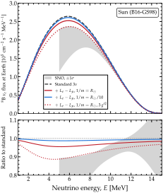

   **The** :math:`^8`\ **B neutrino flux at Earth under a long-range force.** *Top:* flux of :math:`\nu_e` from :math:`^8`\ B decay at Earth, against energy, for the standard case and for the two mediator ranges of Figure :ref:`A long-range force in the Sun <ex-fig-solar-lri>`, with the same coupling. The dotted curve has :math:`1/m = R_\odot` and a coupling :math:`g^{\prime 2}` three times larger. The fluxes are the :math:`^8`\ B spectrum of Ref. :cite:p:`Winter:2004kf` times the total flux of the B16-GS98 model, :math:`5.46 \cdot 10^6` cm\ :sup:`-2` s\ :sup:`-1` :cite:p:`Vinyoles:2016djt`, times the survival probability averaged over where :math:`^8`\ B neutrinos are made in the model. *Bottom:* each case divided by the standard one. See notebook `#28 <https://github.com/mbustama/Magnus/blob/main/notebooks/28_magnus_paper_figures.ipynb>`__.

Figure :ref:`The 8B neutrino flux at Earth under a long-range force <ex-fig-solar-8b-flux>` shows what a detector on Earth would see: the flux of :math:`\nu_e` from :math:`^8`\ B decay, from 1 to 15 MeV. Real :math:`^8`\ B neutrinos are not all born at one radius. In the B16-GS98 model, 80% of them are born between :math:`0.025\,R_\odot` and :math:`0.081\,R_\odot`. Therefore, we average the probability over 28 birth radii, weighted by where :math:`^8`\ B neutrinos are made. We then multiply it by the :math:`^8`\ B spectrum :cite:p:`Winter:2004kf` and by the total flux of the model, :math:`5.46 \cdot 10^6` cm\ :sup:`-2` s\ :sup:`-1` :cite:p:`Vinyoles:2016djt`. The distribution of :math:`^8`\ B production in B16-GS98 was published online, but is no longer available. We rebuild it from the temperature, density, and composition of the model, as described in notebook `#28 <https://github.com/mbustama/Magnus/blob/main/notebooks/28_magnus_paper_figures.ipynb>`__. On the BS2005-AGS,OP model, whose distribution is published :cite:p:`Bahcall:2004pz`, the same calculation agrees with it to 1% of its peak. Using the variables defined in Listing :ref:`A long-range force in the Sun <ex-lst-arbitrary>`, the flux for :math:`1/m = R_\odot` is

.. code-block:: python

   # Birth radii, weighted by where 8B is made
   r_b = np.linspace(0.005, 0.14, 28)*R_SUN
   w = f(r_b)*np.gradient(r_b)
   w = w/w.sum()
   # Average over them, then scale by the 8B
   # spectrum and total flux, cm^-2 s^-1 MeV^-1
   P = sum(wk*averaged(v_emu[1.0], rk)
           for rk, wk in zip(r_b, w))
   flux = 5.46e6*spectrum(Es)*P

where ``f`` and ``spectrum`` interpolate the production distribution and the spectrum. The longer-ranged potential lowers the flux by up to 4.5%, near 5 MeV, and by 3.6% in total above 1 MeV. The shorter-ranged one lowers it by at most 1.3%. Tripling :math:`g^{\prime 2}` for :math:`1/m = R_\odot` lowers it by up to 11%, near 4.5 MeV.

.. _ex-lst-arbitrary:

**A long-range force in the Sun.** Computing the data in Figure :ref:`A long-range force in the Sun <ex-fig-solar-lri>`. The electron density comes from the B16-GS98 table :cite:p:`Vinyoles:2016djt`, continued past the surface by the profile that ships with Magνs. The potential :math:`V_{e\mu}` is Eq. :eq:`ex-equ-yukawa-1d` on that profile. One coupling serves both ranges, fixed so that :math:`V_{e\mu}` is a tenth of :math:`V_{\rm CC}` at birth for :math:`1/m = R_\odot`. The vacuum and matter terms come from the shipped builders; only the new term is written here. The neutrino is born at :math:`0.05\,R_\odot`, and the :ref:`averaged probability <avg-varying>` is read out at :math:`20\,R_\odot`. See notebooks `#19 <https://github.com/mbustama/Magnus/blob/main/notebooks/19_magnus_custom_hamiltonian.ipynb>`__ and `#28 <https://github.com/mbustama/Magnus/blob/main/notebooks/28_magnus_paper_figures.ipynb>`__.

.. code-block:: python

   import numpy as np
   import magnus.globaldefs as gd
   import magnus.hamiltonians as ham
   import magnus.matter as matter
   import magnus.oscprob as oscprob
   import magnus.solarmodels as solarmodels

   osc = gd.load_nufit_params('NuFIT 6.1')

   # The B16-GS98 model that ships with Magnus,
   # on its tabulated radii and on to 20 R_sun
   model = 'B16-GS98'
   tab = solarmodels.load_solar_model(model)
   r_tab = tab['r_over_r_sun']*gd.SUN_RADIUS*gd.UNIT_KM
   R_SUN = r_tab[-1]                   # The surface
   R0, R_END = 0.05*R_SUN, 20.0*R_SUN  # Birth, readout
   r = np.concatenate([r_tab, np.geomspace(
       1.002*R_SUN, R_END, 800)])
   ne_func = solarmodels.electron_density_profile(model)
   n_e = ne_func(r)                    # Fades past R_SUN
   per_ne = matter.VCC_func(0.0, lambda l: 1.0)
   vcc = per_ne*n_e

   def vcc_sun(l):
       """V_CC at l."""
       return per_ne*ne_func(l)

   def cumulative(y, x):
       """Running trapezoidal integral, zero at x[0]."""
       steps = 0.5*(y[1:] + y[:-1])*np.diff(x)
       return np.concatenate([[0.0], np.cumsum(steps)])

   def shc(x):
       """sinh(x)/x, equal to 1 at the origin."""
       x = np.asarray(x, dtype=float)
       return np.divide(np.sinh(x), x, out=np.ones_like(x),
                        where=(x != 0.0))

   def long_range_potential(r, n_e, m):
       """V_emu(r)/g'^2 for a spherical n_e."""
       I_in = cumulative(r**2*n_e*shc(m*r), r)
       I_out = cumulative(r*n_e*np.exp(-m*r), r)
       I_out = I_out[-1] - I_out      # From r outward
       r_safe = np.where(r > 0.0, r, 1.0e-30)
       return np.exp(-m*r)*I_in/r_safe + shc(m*r)*I_out

   # Two mediator ranges, one coupling: g'^2 makes V_emu
   # a tenth of V_CC at R0 when 1/m = R_sun
   v_emu = {}
   for frac in (1.0, 0.1):            # 1/m in R_sun
       v_emu[frac] = long_range_potential(
           r, n_e, 1.0/(frac*R_SUN))
   g2 = 0.1*vcc_sun(R0)/np.interp(R0, r, v_emu[1.0])
   v_emu = {frac: g2*v for frac, v in v_emu.items()}

   # The standard part from the shipped builders; the
   # new term is the only line written here
   h_vac = ham.\
       hamiltonian_3nu_vacuum_energy_independent(**osc)
   q = np.diag([1.0, -1.0, 0.0])     # L_e-L_mu charges

   def H_lri(v):
       """H(E, l) of the text, with V_emu = v."""
       def H(E, l):
           h_matt = ham.hamiltonian_3nu_matter_td(
               l, vcc_sun)
           return (h_vac/E + h_matt
                   + np.interp(l, r, v)[..., None, None]*q)
       return H

   Es = np.logspace(-1.0, np.log10(20.0), 70)*gd.UNIT_MEV

   def averaged(v, r0=R0):
       """<P_ee> from r0 to R_END, per E."""
       return oscprob.osc_prob_energy_baseline(
           H_lri(v), Es, R_END, r0, nu_i=gd.NUE,
           nu_f=gd.NUE, average=True)

   P_std = averaged(0.0*vcc)
   P_lri = {frac: averaged(v_emu[frac]) for frac in v_emu}

.. _ex-sec-turbulence:

Turbulent matter profile
~~~~~~~~~~~~~~~~~~~~~~~~

.. _ex-fig-turbulence-rabi:

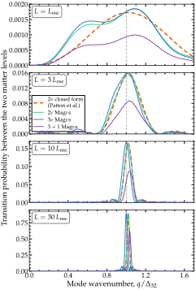

   **A density mode against its closed form.** Probability of transition between two matter levels coupled by a single density mode, against the wavenumber of the Fourier mode of the matter density in the medium, for a 5-GeV neutrino in a region of mean density :math:`\rho_0 = 4` g cm\ :math:`^{-3}` carrying one mode of amplitude :math:`C = 0.03`. The panels are region lengths of :math:`1`, :math:`3`, :math:`10`, and :math:`30\,L_{\rm osc}`, with :math:`L_{\rm osc} = 2\pi/\Delta_{32} = 11\,030` km the oscillation length driven by the 2-3 sector. The closed form of Refs.  :cite:p:`Patton:2013dba,Patton:2014lza`, Eq. :eq:`ex-equ-turb-rabi`, is evaluated for the two-flavor reduction of the 1-3 sector; Magνs is run at two, three, and four flavors, the last with :math:`\sin^2\theta_{14} = \sin^2\theta_{24} = 0.10` and :math:`\Delta m^2_{41} = 1` eV\ :math:`^2`. The levels are those of the mean density, between which no transition occurs without the mode. See notebook `#28 <https://github.com/mbustama/Magnus/blob/main/notebooks/28_magnus_paper_figures.ipynb>`__.

.. _ex-fig-turbulence:

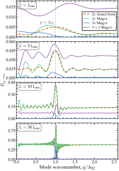

   **The same mode in the flavor channel.** Flavor transition probability :math:`P_{\nu_\mu \to \nu_e}` for the same neutrino, medium, mode, and region lengths as Figure :ref:`A density mode against its closed form <ex-fig-turbulence-rabi>`, at two, three, and four flavors. The line labeled :math:`q = \Delta_{32}` marks the mode that matches the three-flavor gap; the two- and four-flavor gaps lie a few percent away from it. The curves sit at different heights because the three flavor counts give different probabilities over the same region even without the mode. The closed-form curve is Eq. :eq:`ex-equ-turb-rw-flavor`, the flavor probability built from the propagator behind Eq. :eq:`ex-equ-turb-rabi`, for the same two-flavor system as in Figure :ref:`A density mode against its closed form <ex-fig-turbulence-rabi>`. See notebook `#28 <https://github.com/mbustama/Magnus/blob/main/notebooks/28_magnus_paper_figures.ipynb>`__.

Matter behind a supernova shock does not settle: convection keeps stirring it. Its density fluctuates around its mean value by tens of percent, over a range of length scales spanning from the size of the star to far below it  :cite:p:`Loreti:1995ae,Schirato:2002tg,Fogli:2006xy,Patton:2013dba,Patton:2014lza`. Therefore, an escaping neutrino meets a profile with a density that has a regular component—decreasing with distance from the center—and a random component overlaid on it. In the Fourier decomposition of that random component, a mode of wavenumber :math:`q` moves neutrinos between a pair of eigenstates of :math:`\mathbb{H}` when :math:`q` coincides with the eigenvalue gap :math:`\Delta_{jk} = \lambda_j - \lambda_k`, the random density mode playing the role that an oscillating field plays in parametric resonance (:doc:`/methodology`).

References  :cite:p:`Patton:2013dba,Patton:2014lza` solved that problem in closed form. Treating the random component as a perturbation on the regular one and keeping the resonant term, they obtained a Rabi formula for the transition between the two levels,

.. math::
   :label: ex-equ-turb-rabi

   P_{jk}
   =
   \frac{\kappa^2}{p^2 + \kappa^2}\,
   \sin^2\!\left(\sqrt{p^2 + \kappa^2}\; L\right) ,
   \qquad
   p = \tfrac{1}{2}\left(\Delta_{jk} - q\right) ,

where :math:`L` is the length of the turbulent region and :math:`\kappa \equiv \tfrac{1}{2} C V_{\rm CC} \lvert U^m_{ej} U^m_{ek}\rvert` is the coupling induced between the two levels by a density mode :math:`\rho(l) = \rho_0 \left[1 + C \cos(q l)\right]`, with :math:`\rho_0` the mean density and :math:`U^m` the mixing matrix in matter. On resonance, where :math:`q = \Delta_{jk}`, the probability is :math:`\sin^2(\kappa L)`: the amplitude :math:`C` sets how long the region must be for complete conversion to occur.

As example, we consider a region of mean density :math:`\rho_0 = 4` g cm\ :math:`^{-3}` carrying one mode of amplitude :math:`C = 0.03`, crossed by a 5-GeV neutrino:

.. code-block:: python

   import numpy as np
   import magnus.globaldefs as gd
   import magnus.matter as matter
   import magnus.hamiltonians as ham

   OSC = gd.load_nufit_params('NuFIT 6.1')
   E = 5.0*gd.UNIT_GEV    # Neutrino energy
   RHO0 = 4.0             # Mean density, g/cm3
   C = 0.03               # Mode amplitude

   def one_mode(q):
       """Density along the ray: the mean, plus
       one mode of wavenumber q."""
       def rho(l):
           x = np.asarray(l, dtype=float)
           return RHO0*(1.0 + C*np.cos(q*x))
       return rho

The gaps of the Hamiltonian at :math:`\rho_0` fix the range of :math:`q` to scan:

.. code-block:: python

   # n_e and V_CC of the smooth medium
   ne0 = matter.num_density_e_func(
       0.0, lambda l: RHO0,
       density_matter_is_in_g_per_cm3=True)
   V0 = matter.VCC_func(0.0, lambda l: ne0)

   # H at the mean density: vacuum plus matter
   H0 = np.array(ham.hamiltonian_3nu_vacuum(
       E, **OSC), dtype=complex)
   H0 += ham.hamiltonian_3nu_matter(V0)

   # Eigenvalues w, matter eigenvectors Vm, and
   # the gap the mode has to match
   w, Vm = np.linalg.eigh(H0)
   d32 = abs(w[2] - w[1])
   LOSC = 2*np.pi/d32     # 11 030 km

Here, :math:`\Delta_{32}` is matched by a mode of wavelength :math:`L_{\rm osc} \equiv 2\pi/\Delta_{32} = 11\,030` km, the oscillation length of that pair of levels.

Eq. :eq:`ex-equ-turb-rabi` gives the transition probability between two eigenstates of :math:`\mathbb{H}`\ :cite:p:`Patton:2013dba,Patton:2014lza`. The same quantity is contained in the evolution operator :math:`\mathbb{U}` (:ref:`conv-hamiltonian`), once :math:`\mathbb{U}` is written in the basis of those eigenstates: :math:`\lvert [\mathbb{U}]_{jk} \rvert^2` is the transition probability between levels :math:`k` and :math:`j`. If the density were constant, :math:`\mathbb{H}` would be the same at every point of the region; its eigenstates would then evolve independently of one another, so :math:`\lvert [\mathbb{U}]_{jk} \rvert^2` would vanish for :math:`j \neq k`. The Fourier mode makes the density vary along the region, so :math:`\mathbb{H}` varies with it. In the basis of the eigenstates at :math:`\rho_0`, that variation appears as the off-diagonal elements :math:`C V_{\rm CC} \cos(ql)\, U^{m*}_{ej} U^m_{ek}` of :math:`\mathbb{H}`. Those elements mix the levels as the neutrino advances, so :math:`\mathbb{U}` acquires off-diagonal elements too; :math:`\lvert [\mathbb{U}]_{jk} \rvert^2` is what that mixing amounts to over the whole region. Magνs returns :math:`\mathbb{U}`; rotating it into that basis is one line:

.. code-block:: python

   from magnus.oscprob import (
     compute_evolution_operator_multiple_slabs
     as chain)

   L = LOSC             # The region, one L_osc
   rho = one_mode(d32)  # Mode tuned to the gap

   def H(l):
       """H at position l, with the mode on."""
       h = np.array(ham.hamiltonian_3nu_vacuum(
           E, **OSC), dtype=complex)
       # V_CC follows the density
       return h + ham.hamiltonian_3nu_matter(
           V0*rho(l)/RHO0)

   # One operator per slab, then the ordered
   # product over the chain
   edges = np.linspace(0.0, L, 501)
   slabs = np.stack([edges[:-1], edges[1:]], 1)
   Us = chain(H, slabs, 9, 6)
   U = Us[0]
   for u in Us[1:]:     # Earliest slab first
       U = u @ U

   # Rotate to the matter basis, then read the
   # transition between levels 2 and 3
   P32 = abs((Vm.conj().T @ U @ Vm)[2, 1])**2
   P32                    # 0.001758

Figure :ref:`A density mode against its closed form <ex-fig-turbulence-rabi>` compares Eq. :eq:`ex-equ-turb-rabi` with Magνs at four lengths of the turbulent region; the closed form is evaluated for the two-flavor system it was derived for, the 1–3 sector, with :math:`\kappa` from the two-flavor :math:`\mathbb{U}^m` at :math:`\rho_0`. The closed form of Refs. :cite:p:`Patton:2013dba,Patton:2014lza` keeps only the part of the coupling that varies slowly along the trajectory; the part it discards averages out only over many of its own cycles. One :math:`L_{\rm osc}` (Figure :ref:`A density mode against its closed form <ex-fig-turbulence-rabi>`, top panel) contains too few of them, so the closed form and the two-flavor Magνs curve differ appreciably; the difference shrinks as the region lengthens (Figure :ref:`A density mode against its closed form <ex-fig-turbulence-rabi>`, bottom three panels). A third or fourth flavor changes the eigenvalue gap and moves the resonance to a different wavenumber, while the length of the region sets its width: the longer the region, the more closely the mode has to match the gap.

Figure :ref:`The same mode in the flavor channel <ex-fig-turbulence>` shows the associated oscillation probabilities :math:`P_{\nu_\mu \to \nu_e}`, computed via

.. code-block:: python

   import magnus.oscprob as oscprob

   kw = dict(
       nu_i=gd.NUMU, nu_f=gd.NUE,
       density_matter_is_in_g_per_cm3=True)

   # Two flavors: the 1-3 sector
   OSC2 = dict(sth=OSC['s13'], Dm2=OSC['D31'])
   P2 = oscprob.osc_prob_matter_std_potential(
       2, one_mode(d32), E, L, OSC2, **kw)

   # Three flavors
   P3 = oscprob.osc_prob_matter_std_potential(
       3, one_mode(d32), E, L, OSC, **kw)

   # The same call with a sterile state added
   OSC4 = dict(OSC, s14=np.sqrt(0.10), D41=1.0,
               s24=np.sqrt(0.10), s34=0.0,
               d14=0.0, d24=0.0)
   P4 = oscprob.osc_prob_matter_std_potential(
       4, one_mode(d32), E, L, OSC4, **kw)

In Figure :ref:`The same mode in the flavor channel <ex-fig-turbulence>`, the largest change of the probability sits around the wavenumber :math:`q = \Delta_{32}`. This is the resonance of Figure :ref:`A density mode against its closed form <ex-fig-turbulence-rabi>`, seen in the flavor channel; as there, it narrows as the region lengthens. Above :math:`\Delta_{32}` the curves are flat: a mode faster than every gap cancels its effect along the trajectory.

Figure :ref:`The same mode in the flavor channel <ex-fig-turbulence>` also shows the flavor probability that follows from the closed form. Near the resonance it follows the two-flavor Magνs curve, more closely the longer the region. At low wavenumber it does not: there it stays at the value of the smooth medium, while Magνs swings above it. That curve is built as follows. Eq. :eq:`ex-equ-turb-rabi` is the modulus squared of one element of the propagator of the two-level system in the rotating-wave approximation, the solution behind the closed form  :cite:p:`Patton:2013dba,Patton:2014lza`. In the matter basis of the mean density, that propagator is

.. math::
   :label: ex-equ-turb-rw-u

   \tilde{\mathbb{U}}(L)
   =
   {\rm diag}\!\left(e^{iqL/2}, e^{-iqL/2}\right)
   \exp\!\left[
   -i L
   \begin{pmatrix}
   \bar\lambda - p & \kappa_c \\
   \kappa_c^* & \bar\lambda + p
   \end{pmatrix}
   \right] ,

where :math:`\bar\lambda = \tfrac{1}{2}(\lambda_1 + \lambda_2)` and :math:`p = \tfrac{1}{2}(\lambda_2 - \lambda_1 - q)` are the mean of the two levels and the detuning, while :math:`\kappa_c = \tfrac{1}{2} C V_{\rm CC}\, U^{m*}_{e1} U^m_{e2}` is the coupling, with :math:`\lvert \kappa_c \rvert = \kappa`. The matrix in the exponent is the Hamiltonian in the frame that rotates with the mode, in which it is constant; the first factor undoes that rotation. The flavor probability reads the same propagator with flavor indices,

.. math::
   :label: ex-equ-turb-rw-flavor

   P_{\nu_\mu \to \nu_e}
   =
   \left\lvert \left[ U^m\, \tilde{\mathbb{U}}(L)\, U^{m\dagger} \right]_{e\mu} \right\rvert^2 .

The matrix in Eq. :eq:`ex-equ-turb-rw-u` couples the two levels but does not move them: the rotating-wave approximation drops the part of the mode that raises and lowers the levels along with the density. At low wavenumber that part is all there is. Such a mode changes the density slowly; the levels follow it, with no transition driven between them. Eq. :eq:`ex-equ-turb-rw-u` misses that effect, so its curve stays at the value of the smooth medium at low wavenumber.
