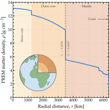
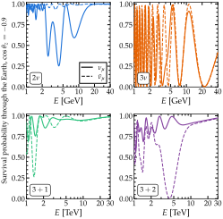
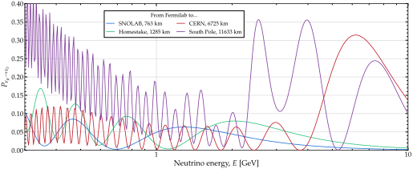
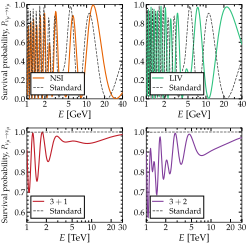
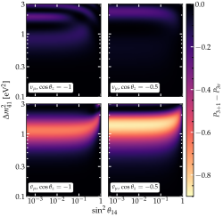
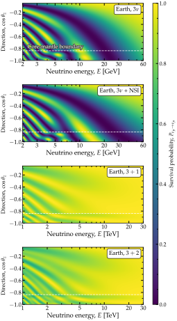

.. _ex-sec-prem:

The Earth
---------

.. contents:: On this page
   :local:
   :depth: 1

.. _ex-fig-prem:

   **The Earth’s density profile.** The PREM density profile  :cite:p:`Dziewonski:1981xy` against radial distance, with a cut-away globe showing the same layers in the same colors. The electron fraction changes at three radii, marked by the dashed lines: from 0.4656 to 0.4957 at the core-mantle boundary, at 3 480 km; to 0.4952 at 6 346.6 km; and to 0.5551 in the ocean, at 6 368 km. The last two are too close together to separate here. Magνs places a slab edge wherever a chord crosses one of the nine boundaries between PREM’s ten shells, so that no slab straddles a density jump.

Figure :ref:`The Earth’s density profile <ex-fig-prem>` shows the density profile Magνs uses for the Earth, the Preliminary Reference Earth Model (PREM)  :cite:p:`Dziewonski:1981xy`, built from seismic data. It treats the Earth as a spherically symmetric body of radius :math:`R_\oplus = 6\,371` km, made of ten concentric shells. The density falls from 13.1 g cm\ :math:`^{-3}` at the center to 1.02 g cm\ :math:`^{-3}` in the ocean at the surface, smoothly inside each shell and in jumps between shells. The largest jump is at the core-mantle boundary, 3 480 km from the center, where the density drops from 9.90 to 5.57 g cm\ :math:`^{-3}`. The electron fraction, :math:`Y_e`, reflects the chemical composition, so it changes with radius too, but only at three of the nine boundaries: Magνs uses 0.4656 in the core, 0.4957 in the mantle, 0.4952 in the crust, and 0.5551 in the ocean. The ``earth`` module stores these as ``Y_E_CORE_PREM``, ``Y_E_MANTLE_PREM``, ``Y_E_CRUST_PREM``, and ``Y_E_OCEAN_PREM``. Every Earth wrapper takes ``electron_fraction_core``, ``electron_fraction_mantle``, ``electron_fraction_crust``, and ``electron_fraction_ocean`` to change them.

The trajectory of a neutrino through the Earth is set by its zenith angle at the detector, :math:`\theta_z`. By default, the detector sits on the surface; :ref:`ex-sec-underground` shows how to place sources and detectors underground. A neutrino arriving from straight below has :math:`\cos\theta_z = -1` and crosses an Earth diameter. One arriving along the horizon has :math:`\cos\theta_z = 0` and does not travel inside the Earth at all. In between, the chord comes closest to the center at a radius of :math:`R_\oplus \sqrt{1 - \cos^2\theta_z}`, so a trajectory closer to horizontal samples only the outer shells.

For a given zenith angle, ``earth`` returns the chord length, i.e., the baseline:

.. code-block:: python

   import magnus.earth as earth

   costhz = -0.9
   L = earth.distance_traveled_inside_earth(
       costhz)                    # 11467.8 km

A chord meets every PREM boundary it reaches twice, once going in and once coming out. For instance, at :math:`\cos\theta_z = -0.9`, the chord comes within 2 777 km of the center, so eight of the nine boundaries lie above that point, and the chord crosses them sixteen times:

.. code-block:: python

   edges = earth.prem_layer_edges_along_chord(
       costhz)
   len(edges)                     # 16

Every ``osc_prob_*_earth`` wrapper computes these positions and passes them on as ``t_breakpoints``, so a slab edge falls on every crossing, at every level of refinement and at any tolerance.

An Earth wrapper takes the trajectory as a zenith angle, ``costhz``, and a baseline, ``L``. From ``costhz``, the wrapper finds the density and the electron fraction at each point of the chord, and the slab edges. ``L`` is in the natural units of Magνs, so the chord length from ``earth``, in kilometers, is converted. At three flavors, for a 10-GeV neutrino, :math:`P_{\nu_\mu \to \nu_e}` is

.. code-block:: python

   import magnus.oscprob as oscprob
   import magnus.globaldefs as gd

   P = oscprob.osc_prob_3nu_earth(
       10.0*gd.UNIT_GEV, costhz=costhz,
       L=L*gd.UNIT_KM)
   P[gd.NUMU][gd.NUE]             # 0.124242

By default, the electron fraction changes from layer to layer, as above. Passing ``electron_fraction`` replaces the four values with a single one for the whole Earth. At 5 GeV along this chord, the two choices differ by 0.07 in :math:`P_{\nu_\mu \to \nu_e}`:

.. code-block:: python

   kw = dict(costhz=costhz, L=L*gd.UNIT_KM,
             nu_i=gd.NUMU, nu_f=gd.NUE)
   E = 5.0*gd.UNIT_GEV

   oscprob.osc_prob_3nu_earth(E, **kw) # 0.0849
   oscprob.osc_prob_3nu_earth(E, **kw, 
       electron_fraction=0.5)          # 0.0129

.. _ex-sec-nu-nubar:

Neutrinos & antineutrinos, 2–5 flavors
~~~~~~~~~~~~~~~~~~~~~~~~~~~~~~~~~~~~~~

.. _ex-fig-nu-nubar:

   **Neutrinos and antineutrinos through the Earth.** Survival probability of :math:`\nu_\mu` and :math:`\bar{\nu}_\mu` along a PREM chord at :math:`\cos\theta_z = -0.9`, computed with Magνs. *Top*: two flavors, the :math:`(\nu_e, \nu_\mu)` reduction of the 1–3 sector, and three flavors, both from 1 to 40 GeV. *Bottom*: :math:`3+1` and :math:`3+2` from 1 to 30 TeV, where an eV-scale splitting places its resonance, with :math:`\sin^2\theta_{14} = \sin^2\theta_{24} = 0.10` and :math:`\Delta m^2_{41} = 1` eV\ :math:`^2`, joined in the :math:`3+2` panel by :math:`\sin^2\theta_{15} = \sin^2\theta_{25} = 0.06` and :math:`\Delta m^2_{51} = 1.7` eV\ :math:`^2`. Listing :ref:`Neutrinos and antineutrinos through the Earth <ex-lst-nu-nubar>` computes all four pairs. See notebooks `#15 <https://github.com/mbustama/Magnus/blob/main/notebooks/15_magnus_antineutrinos.ipynb>`__ and `#28 <https://github.com/mbustama/Magnus/blob/main/notebooks/28_magnus_paper_figures.ipynb>`__.

Figure :ref:`Neutrinos and antineutrinos through the Earth <ex-fig-nu-nubar>` shows :math:`\nu_\mu` and :math:`\bar{\nu}_\mu` survival probabilities along the same chord as before, at :math:`\cos \theta_z = -0.9`, at two to five flavors. Listing :ref:`Neutrinos and antineutrinos through the Earth <ex-lst-nu-nubar>` computes all eight curves. One dictionary carries the chord, the channel, and the tolerances through every call, so the four flavor counts differ only in the wrapper, the energy range, and the sterile mixing that 3+1 and 3+2 add.

.. _ex-lst-nu-nubar:

**Neutrinos and antineutrinos through the Earth.** The :math:`\nu_\mu` and :math:`\bar{\nu}_\mu` curves of Figure :ref:`Neutrinos and antineutrinos through the Earth <ex-fig-nu-nubar>`. ``both_signs`` calls a wrapper twice, with ``nubar=False`` for the neutrino and ``nubar=True`` for the antineutrino. See notebooks `#15 <https://github.com/mbustama/Magnus/blob/main/notebooks/15_magnus_antineutrinos.ipynb>`__ and `#28 <https://github.com/mbustama/Magnus/blob/main/notebooks/28_magnus_paper_figures.ipynb>`__.

.. code-block:: python

   import numpy as np
   import magnus.oscprob as oscprob
   import magnus.earth as earth
   import magnus.globaldefs as gd

   costhz = -0.9
   L = earth.distance_traveled_inside_earth(costhz) \
    *gd.UNIT_KM
   kw = dict(costhz=costhz, L=L, nu_i=gd.NUMU,
             nu_f=gd.NUMU, rtol=1.0e-8, atol=1.0e-10)

   def both_signs(wrapper, E, **params):
       """Survival probability, for a nu then a nubar."""
       return [wrapper(E, nubar=nubar, **params, **kw)
               for nubar in (False, True)]

   # Two flavors is the (nu_e, nu_mu) reduction of the 1-3
   # sector, so it takes that one angle and splitting by
   # name.  Every wrapper above two flavors defaults to
   # the same NuFIT 6.1 set, so it needs none passed.
   osc = gd.load_nufit_params('NuFIT 6.1')
   E = np.logspace(0, np.log10(40), 260)*gd.UNIT_GEV
   P2, P2bar = both_signs(oscprob.osc_prob_2nu_earth, E,
                          sth=osc['s13'], Dm2=osc['D31'])
   P3, P3bar = both_signs(oscprob.osc_prob_3nu_earth, E)

   # The sterile pairs run three decades higher, where an
   # eV-scale splitting places its resonance
   E_TEV = np.logspace(0, np.log10(30), 200)*gd.UNIT_TEV
   s4 = dict(s14=np.sqrt(0.10), s24=np.sqrt(0.10), s34=0.0,
             D41=1.0)
   s5 = dict(**s4, s15=np.sqrt(0.06), s25=np.sqrt(0.06),
             s35=0.0, D51=1.7)
   P4, P4bar = both_signs(oscprob.osc_prob_4nu_earth,
                          E_TEV, **s4)
   P5, P5bar = both_signs(oscprob.osc_prob_5nu_earth,
                          E_TEV, **s5)

In the top row, the ordinary matter resonance depletes the :math:`\nu_\mu` and leaves the :math:`\bar{\nu}_\mu` almost unaffected, because the matter potential enters their Hamiltonians with opposite signs. The two-flavor panel shows this cleanly. A :math:`(\nu_e, \nu_\mu)` system has no :math:`\theta_{23}` oscillation, so the only structure left is the resonance: the :math:`\nu_\mu` survival probability dips to 0.25 at 4 GeV, while the :math:`\bar{\nu}_\mu` one stays above 0.9. The three-flavor panel restores the :math:`\theta_{23}` oscillation, which is near-maximal. Both curves then swing between zero and one several times, and the resonance is no longer easy to see. It still shows as a difference between the :math:`\nu_\mu` and :math:`\bar{\nu}_\mu` curves, which oscillate out of step: below 5 GeV they differ by up to 0.86, and the difference shrinks as the energy rises, until the two curves coincide above 20 GeV.

In the bottom row, for 3+1 and 3+2, it is the other way around: the resonance depletes the :math:`\bar{\nu}_\mu` and leaves the :math:`\nu_\mu` almost unaffected. A sterile state feels no matter potential at all. The active states all feel the same neutral-current potential, :math:`V_{\rm NC}`, which is common to them and cancels out of their oscillations; the :math:`\nu_e` also feels the charged-current potential, :math:`V_{\rm CC}`, since only it scatters off electrons that way. Measured from the active states, each sterile state therefore carries :math:`-V_{\rm NC}`. A resonance needs a positive potential on the flavor that is mostly the lighter of the two mixing mass states, or a negative one on the flavor that is mostly the heavier. At two and three flavors, :math:`V_{\rm CC}` is positive for neutrinos and acts on the :math:`\nu_e`, which in the normal mass ordering is mostly the lighter state, so the :math:`\nu_\mu` resonates and is depleted. At 3+1 and 3+2, the potential that matters is the one on the sterile state, :math:`-V_{\rm NC}`. For neutrinos, it is positive, but it acts on the heavier state, since :math:`\Delta m^2_{41} > 0` makes the sterile state mostly the heavier one, so there is no resonance. For antineutrinos, the potential changes sign, so the :math:`\bar{\nu}_\mu` resonates instead.

At 3+1, the resonance shows as a dip of the :math:`\bar{\nu}_\mu` survival probability to 0.26 near 1.4 TeV, while the :math:`\nu_\mu` one falls no lower than 0.70. Searches for a sterile state in atmospheric neutrinos look for exactly this dip  :cite:p:`IceCube:2016rnb,IceCube:2020phf`. At 3+2, the second sterile state adds a second dip, at three times the energy, deeper than the first (nearly to zero) and about three times as wide. Above 10 TeV, both curves come back together.

.. _ex-sec-named-baselines:

Probabilities between two locations
~~~~~~~~~~~~~~~~~~~~~~~~~~~~~~~~~~~

.. _ex-fig-named-baselines:

   **Four chords from Fermilab.** Appearance probability :math:`P_{\nu_\mu \to \nu_e}` against energy for a beam sent from Fermilab to four named sites, computed with Magνs along the PREM chord joining each pair of locations, at the layered composition of :ref:`ex-sec-prem`. The legend gives the chord length of each. The two shortest show the pattern of a beam experiment: a first oscillation maximum at 1 to 2 GeV, with faster oscillations below it. The two longest reach the matter resonance, which is why the probability along them is several times larger. Listing :ref:`Baselines between named sites <ex-lst-named>` computes the curves. See notebooks `#04 <https://github.com/mbustama/Magnus/blob/main/notebooks/04_magnus_long_baseline.ipynb>`__ and `#28 <https://github.com/mbustama/Magnus/blob/main/notebooks/28_magnus_paper_figures.ipynb>`__.

.. _ex-tab-sites:

.. table:: Named locations on the Earth’s surface

   +-----------------+--------------------------------+---------------------------------+
   | Site name       | Latitude                       | Longitude                       |
   +=================+================================+=================================+
   | ``baikal``      | :math:`51^\circ\,45'\,54''`    | :math:`104^\circ\,24'\,54''`    |
   +-----------------+--------------------------------+---------------------------------+
   | ``cern``        | :math:`46^\circ\,14'\,1.8''`   | :math:`6^\circ\,3'\,11.4''`     |
   +-----------------+--------------------------------+---------------------------------+
   | ``desy``        | :math:`53^\circ\,34'\,19.79''` | :math:`9^\circ\,52'\,27.59''`   |
   +-----------------+--------------------------------+---------------------------------+
   | ``ess``         | :math:`55^\circ\,44'\,6''`     | :math:`13^\circ\,15'\,5.04''`   |
   +-----------------+--------------------------------+---------------------------------+
   | ``fermilab``    | :math:`41^\circ\,49'\,55''`    | :math:`-88^\circ\,15'\,26''`    |
   +-----------------+--------------------------------+---------------------------------+
   | ``gran_sasso``  | :math:`42^\circ\,25'\,15.8''`  | :math:`13^\circ\,30'\,58.43''`  |
   +-----------------+--------------------------------+---------------------------------+
   | ``homestake``   | :math:`44^\circ\,21'\,5.76''`  | :math:`-103^\circ\,45'\,4.68''` |
   +-----------------+--------------------------------+---------------------------------+
   | ``kamioka``     | :math:`36^\circ\,25'\,50.05''` | :math:`137^\circ\,18'\,41.15''` |
   +-----------------+--------------------------------+---------------------------------+
   | ``km3net_arca`` | :math:`36^\circ\,16'\,0''`     | :math:`16^\circ\,6'\,0''`       |
   +-----------------+--------------------------------+---------------------------------+
   | ``km3net_orca`` | :math:`42^\circ\,48'\,0''`     | :math:`6^\circ\,2'\,0''`        |
   +-----------------+--------------------------------+---------------------------------+
   | ``north_pole``  | :math:`90^\circ\,0'\,0''`      | :math:`0^\circ\,0'\,0''`        |
   +-----------------+--------------------------------+---------------------------------+
   | ``pyhaasalmi``  | :math:`63^\circ\,39'\,31''`    | :math:`26^\circ\,2'\,28''`      |
   +-----------------+--------------------------------+---------------------------------+
   | ``snolab``      | :math:`46^\circ\,28'\,18''`    | :math:`-81^\circ\,11'\,12''`    |
   +-----------------+--------------------------------+---------------------------------+
   | ``south_pole``  | :math:`-90^\circ\,0'\,0''`     | :math:`0^\circ\,0'\,0''`        |
   +-----------------+--------------------------------+---------------------------------+
   | ``tokai``       | :math:`36^\circ\,27'\,59''`    | :math:`140^\circ\,36'\,24''`    |
   +-----------------+--------------------------------+---------------------------------+

The fifteen locations ``magnus.earth`` carries by name, with the coordinates it stores for each. A name passed as ``loc_ini`` or ``loc_fin`` stands for the pair beside it. Coordinates are in degrees, minutes and seconds, which is the form the module stores and the one ``loc_ini`` and ``loc_fin`` accept; ``earth.dms_to_decimal`` returns the same coordinate in decimal degrees.

*Locations given as coordinates.—*\ The examples so far set the trajectory by its zenith angle. A long-baseline experiment is described instead by where the beam is made and where it is detected, and the Earth wrappers accept that form too. Passing ``loc_ini`` and ``loc_fin`` replaces ``costhz`` and ``L``: the chord joining the two sites is the baseline, and its direction fixes which PREM shells it crosses. Each location is a (latitude, longitude) pair, each stated in degrees, minutes, and seconds. North and east are positive; south and west are negative, with the sign read from the first non-zero part:

.. code-block:: python

   # (degree, minute, second), north and east
   # positive, south and west negative
   fnal = ((41, 49, 55), (-88, 15, 26))
   hs = ((44, 21, 5.76), (-103, 45, 4.68))
   P = oscprob.osc_prob_3nu_earth(
       2.0*gd.UNIT_GEV, loc_ini=fnal,
       loc_fin=hs, nu_i=gd.NUMU, nu_f=gd.NUE)
   P                              # 0.0797091

Naming two locations fixes the baseline at the chord between them; ``costhz`` or ``L`` passed alongside is ignored. Like any full chord, it reads the same from both ends, since it meets every radius twice, so Magνs evaluates the Hamiltonian over the first half and mirrors the rest. :doc:`/performance` quantifies the saving.

*Named sites.—*\ Figure :ref:`Four chords from Fermilab <ex-fig-named-baselines>` shows the appearance probability :math:`P_{\nu_\mu \to \nu_e}` along four chords, each running from Fermilab to a named site, and Listing :ref:`Baselines between named sites <ex-lst-named>` computes them. Table :ref:`ex-tab-sites` lists the fifteen locations the ``earth`` module carries by name. Passing a name is the same as passing the coordinates beside it:

.. code-block:: python

   P = oscprob.osc_prob_3nu_earth(
       2.0*gd.UNIT_GEV,
       loc_ini='fermilab', loc_fin='homestake',
       nu_i=gd.NUMU, nu_f=gd.NUE)
   P                              # 0.0797091

This call and the one with coordinates above return the same probability, 0.0797091; Listing :ref:`Baselines between named sites <ex-lst-named>` uses names. The four chords reach very different depths. The one to SNOLAB stays inside the crust, 11 km down at its deepest. The one to Homestake, the DUNE baseline, reaches 32 km. The one to CERN reaches 960 km, into the lower mantle, and the one to the South Pole reaches 3 770 km, into the outer core.

.. _ex-lst-named:

**Baselines between named sites.** The four curves of Figure :ref:`Four chords from Fermilab <ex-fig-named-baselines>`. Two site names replace ``costhz`` and ``L``: the wrapper takes the chord between them as the baseline and its direction as the trajectory. ``chord_length_inside_earth`` returns the chord length. Site names are in Table :ref:`ex-tab-sites`. See notebooks `#04 <https://github.com/mbustama/Magnus/blob/main/notebooks/04_magnus_long_baseline.ipynb>`__ and `#28 <https://github.com/mbustama/Magnus/blob/main/notebooks/28_magnus_paper_figures.ipynb>`__.

.. code-block:: python

   import numpy as np
   import magnus.oscprob as oscprob
   import magnus.earth as earth
   import magnus.globaldefs as gd

   E = np.logspace(np.log10(0.3), 1.0, 400)*gd.UNIT_GEV
   sites = ('snolab', 'homestake', 'cern', 'south_pole')

   # Two site names replace costhz and L: the chord
   # between them is the baseline
   P = {site: oscprob.osc_prob_3nu_earth(
            E, loc_ini='fermilab', loc_fin=site,
            nu_i=gd.NUMU, nu_f=gd.NUE,
            rtol=1.0e-8, atol=1.0e-10)
        for site in sites}

   # The chord itself, in km, for a legend
   a = earth.loc_coords_dms['fermilab']
   b = earth.loc_coords_dms['homestake']
   L_km = earth.chord_length_inside_earth(
       a['lat'], a['lon'], b['lat'], b['lon'])
   print('%.0f km' % L_km)   # 1285

.. _ex-sec-bsm:

New physics
~~~~~~~~~~~

.. _ex-fig-bsm:

   **New physics along an Earth chord.** Muon-neutrino survival probability :math:`P_{\nu_\mu \to \nu_\mu}` along a PREM chord at :math:`\cos\theta_z = -0.9`, computed with Magνs for four departures from the standard three-flavor case. *Top left*: non-standard interactions with :math:`\varepsilon_{ee} = 0.10`, :math:`\varepsilon_{e\mu} = 0.05` and :math:`\varepsilon_{\mu\tau} = 0.03`. *Top right*: an isotropic, energy-independent Lorentz-violating term, with eigenvalues :math:`b_1 = b_2 = 0` and :math:`b_3 = 5.4 \cdot 10^{-14}` eV, the value that advances the phase by :math:`\pi` over this chord. *Bottom*: the 3+1 and 3+2 systems of Figure :ref:`Neutrinos and antineutrinos through the Earth <ex-fig-nu-nubar>`, where the eV-scale splittings, :math:`\Delta m_{41}^2` and :math:`\Delta m_{51}^2`, place the matter resonance at the TeV scale. Listing :ref:`New physics along an Earth chord <ex-lst-bsm>` computes the curves. See notebooks `#07 <https://github.com/mbustama/Magnus/blob/main/notebooks/07_magnus_bsm_sterile_nu.ipynb>`__, `#08 <https://github.com/mbustama/Magnus/blob/main/notebooks/08_magnus_bsm_nsi.ipynb>`__, `#09 <https://github.com/mbustama/Magnus/blob/main/notebooks/09_magnus_bsm_liv.ipynb>`__, and `#28 <https://github.com/mbustama/Magnus/blob/main/notebooks/28_magnus_paper_figures.ipynb>`__.

.. _ex-lst-bsm:

**New physics along an Earth chord.** The five scenarios of Figure :ref:`New physics along an Earth chord <ex-fig-bsm>`, in six calls: the standard case is computed twice, once for each energy range. Every call shares the chord, the channel and the tolerances, differing only in the wrapper and in the parameters of the extra term. See notebooks `#07 <https://github.com/mbustama/Magnus/blob/main/notebooks/07_magnus_bsm_sterile_nu.ipynb>`__, `#08 <https://github.com/mbustama/Magnus/blob/main/notebooks/08_magnus_bsm_nsi.ipynb>`__, `#09 <https://github.com/mbustama/Magnus/blob/main/notebooks/09_magnus_bsm_liv.ipynb>`__, and `#28 <https://github.com/mbustama/Magnus/blob/main/notebooks/28_magnus_paper_figures.ipynb>`__.

.. code-block:: python

   import numpy as np
   import magnus.oscprob as oscprob
   import magnus.earth as earth
   import magnus.globaldefs as gd

   costhz = -0.9
   L = earth.distance_traveled_inside_earth(costhz) \
    *gd.UNIT_KM
   kw = dict(costhz=costhz, L=L, nu_i=gd.NUMU,
             nu_f=gd.NUMU, rtol=1.0e-8, atol=1.0e-10)
   E = np.logspace(0, np.log10(40), 260)*gd.UNIT_GEV
   # Three decades up is where an eV-scale splitting
   # places its matter resonance
   E_TEV = np.logspace(0, np.log10(30), 200)*gd.UNIT_TEV

   eps = dict(eps_ee=0.10, eps_em=0.05, eps_mt=0.03)
   liv = dict(b1=0.0, b2=0.0, b3=np.pi/L, Lambda=1.0,
              sxi12=0.0, sxi23=1.0/np.sqrt(2.0),
              sxi13=0.0, dxiCP=0.0, n_liv=0)
   s4 = dict(s14=np.sqrt(0.10), s24=np.sqrt(0.10),
             s34=0.0, D41=1.0)
   s5 = dict(**s4, s15=np.sqrt(0.06),
             s25=np.sqrt(0.06), s35=0.0, D51=1.7)

   # The same call each time, a different extra term
   P_std = oscprob.osc_prob_3nu_earth(E, **kw)
   P_nsi = oscprob.osc_prob_3nu_earth_nsi(E, **eps, **kw)
   P_liv = oscprob.osc_prob_3nu_earth_liv(E, **liv, **kw)
   P_std_tev = oscprob.osc_prob_3nu_earth(E_TEV, **kw)
   P_3p1 = oscprob.osc_prob_4nu_earth(E_TEV, **s4, **kw)
   P_3p2 = oscprob.osc_prob_5nu_earth(E_TEV, **s5, **kw)

Figure :ref:`New physics along an Earth chord <ex-fig-bsm>` shows four departures from the standard three-flavor case along one deep Earth chord: non-standard interactions  :cite:p:`Farzan:2017xzy`, Lorentz-invariance violation  :cite:p:`Kostelecky:2003xn,Kostelecky:2011gq`, one sterile state  :cite:p:`Gariazzo:2015rra,Dentler:2018sju`, and two sterile states  :cite:p:`Sorel:2003hf`. Each adds a different term to the Hamiltonian. As Listing :ref:`New physics along an Earth chord <ex-lst-bsm>` shows, the calls differ only in the wrapper and in the parameters of the new term.

Figure :ref:`A scan of the sterile-state parameters <ex-fig-sterile-scan>` scans the sterile parameters themselves. The wrapper takes :math:`\Delta m^2_{41}` and :math:`\theta_{14}` like any other argument, so the map is a double loop over the two, and Listing :ref:`A scan of the sterile-state parameters <ex-lst-sterile-scan>` computes all of it. The map shows the reversal of :ref:`ex-sec-nu-nubar` across parameter space. The :math:`\nu_\mu` survival probability changes by at most 0.27. The :math:`\bar{\nu}_\mu` panels carry a resonance band near :math:`\Delta m^2_{41} = 1` eV\ :math:`^2` that removes up to 0.87 of the flux. The band is strongest at small :math:`\theta_{14}` and fades as :math:`\sin^2\theta_{14}` approaches 1, because the :math:`\nu_\mu` reaches the sterile state through :math:`|U_{\mu 4}|^2 = \cos^2\theta_{14} \sin^2\theta_{24}`, with :math:`\theta_{24}` fixed.

.. _ex-fig-sterile-scan:

   **A scan of the sterile-state parameters.** Change in the muon-neutrino survival probability when one sterile state is added, :math:`P_{3+1} - P_{3\nu}`, as a function of :math:`\Delta m_{41}^2` and :math:`\sin^2 \theta_{14}`, at a fixed energy of 5 TeV. *Top row*: :math:`\nu_\mu`. *Bottom row*: :math:`\bar{\nu}_\mu`. *Left column*: a core-crossing chord, :math:`\cos\theta_z = -1`. *Right column*: a shallower one, :math:`\cos\theta_z = -0.5`. The other sterile parameters are held at :math:`\sin^2\theta_{24} = 0.10` and :math:`\theta_{34} = 0`. Each panel holds :math:`80 \times 80` probabilities. See notebooks `#07 <https://github.com/mbustama/Magnus/blob/main/notebooks/07_magnus_bsm_sterile_nu.ipynb>`__ and `#28 <https://github.com/mbustama/Magnus/blob/main/notebooks/28_magnus_paper_figures.ipynb>`__.

.. _ex-lst-sterile-scan:

**A scan of the sterile-state parameters.** The four panels of Figure :ref:`A scan of the sterile-state parameters <ex-fig-sterile-scan>`, one call of ``panel`` each, for one chord (``costhz``) and one sign (``nubar``). In each, the three-flavor probability is computed once and subtracted from the 3+1 one at every point of the grid. ``S14`` holds :math:`\sin\theta_{14}`; the figure plots its square. See notebooks `#07 <https://github.com/mbustama/Magnus/blob/main/notebooks/07_magnus_bsm_sterile_nu.ipynb>`__ and `#28 <https://github.com/mbustama/Magnus/blob/main/notebooks/28_magnus_paper_figures.ipynb>`__.

.. code-block:: python

   import numpy as np
   import magnus.oscprob as oscprob
   import magnus.earth as earth
   import magnus.globaldefs as gd

   E = 5.0*gd.UNIT_TEV
   D41 = np.logspace(np.log10(0.1), np.log10(3.0), 80)
   S14 = np.logspace(np.log10(0.02), 0.0, 80)
   s24 = np.sqrt(0.10)

   def panel(costhz, nubar):
       """One chord and one sign, over the whole plane."""
       L = earth.distance_traveled_inside_earth(costhz) \
        *gd.UNIT_KM
       kw = dict(costhz=costhz, L=L, nu_i=gd.NUMU,
                 nu_f=gd.NUMU, nubar=nubar,
                 rtol=1.0e-8, atol=1.0e-10)
       # Standard 3nu oscillations
       std = oscprob.osc_prob_3nu_earth(E, **kw)
       return np.array([[oscprob.osc_prob_4nu_earth(
           E, s14=s, s24=s24, s34=0.0, D41=d, **kw)
           - std for s in S14] for d in D41])

   # Change between 3nu and 3+1 survival probability
   dP = {(cz, nb): panel(cz, nb)
         for cz in (-1.0, -0.5) for nb in (False, True)}

.. _ex-sec-earth-oscillograms:

Earth oscillograms
~~~~~~~~~~~~~~~~~~

.. _ex-fig-oscillogram:

   **Oscillograms through the Earth.** Oscillogram: the :math:`\nu_\mu` survival probability, :math:`P_{\nu_\mu \to \nu_\mu}`, over neutrino energy and arrival direction, computed with Magνs along the PREM profile  :cite:p:`Dziewonski:1981xy`. *Top to bottom*: standard three flavors; three flavors with the non-standard couplings of Figure :ref:`New physics along an Earth chord <ex-fig-bsm>`; 3+1 and 3+2 with the sterile parameters of Figure :ref:`Neutrinos and antineutrinos through the Earth <ex-fig-nu-nubar>`. The dashed line in each panel marks :math:`\cos\theta_z = -0.838`, the direction whose chord just grazes the outer core; steeper trajectories enter the core, where the density nearly doubles. Listing :ref:`Oscillograms through the Earth <ex-lst-oscillogram>` computes the oscillograms. See notebooks `#06 <https://github.com/mbustama/Magnus/blob/main/notebooks/06_magnus_oscillograms.ipynb>`__ and `#28 <https://github.com/mbustama/Magnus/blob/main/notebooks/28_magnus_paper_figures.ipynb>`__.

Figure :ref:`Oscillograms through the Earth <ex-fig-oscillogram>` shows oscillograms of :math:`\nu_\mu` survival through the Earth, i.e., :math:`P_{\nu_\mu \to \nu_\mu}` across energy and arrival direction, for the standard case, with non-standard interactions, and with one and two sterile states. Listing :ref:`Oscillograms through the Earth <ex-lst-oscillogram>` computes them.

.. _ex-lst-oscillogram:

**Oscillograms through the Earth.** The four panels of Figure :ref:`Oscillograms through the Earth <ex-fig-oscillogram>`. One wrapper call per arrival direction returns a whole energy sweep, with the chord length taken from the direction alone. Only the wrapper and its extra parameters change between panels. Each panel is then drawn twice: first by ``plotting.plot_oscillogram``, then by ``matplotlib`` directly. Both put :math:`\cos\theta_z` on the horizontal axis; Figure :ref:`Oscillograms through the Earth <ex-fig-oscillogram>` puts it on the vertical one.

.. code-block:: python

   import numpy as np
   import matplotlib.pyplot as plt
   import magnus.oscprob as oscprob
   import magnus.earth as earth
   import magnus.globaldefs as gd
   import magnus.plotting as plotting

   chord = earth.distance_traveled_inside_earth
   CZ = np.linspace(-1.0, -0.05, 170)
   E_GEV = np.logspace(np.log10(2.0),
                       np.log10(60.0), 200)*gd.UNIT_GEV
   E_TEV = np.logspace(0.0,
                       np.log10(30.0), 200)*gd.UNIT_TEV
   kw = dict(nu_i=gd.NUMU, nu_f=gd.NUMU,
             rtol=1.0e-8, atol=1.0e-10)

   eps = dict(eps_ee=0.10, eps_em=0.05, eps_mt=0.03)
   s4 = dict(s14=np.sqrt(0.10), s24=np.sqrt(0.10),
             s34=0.0, D41=1.0)
   s5 = dict(**s4, s15=np.sqrt(0.06),
             s25=np.sqrt(0.06), s35=0.0, D51=1.7)

   def oscillogram(wrapper, E, **params):
       """One panel: an energy sweep per direction."""
       return np.array([wrapper(E, costhz=c,
           L=chord(c)*gd.UNIT_KM, **params, **kw)
           for c in CZ]).T

   PANELS = [(oscprob.osc_prob_3nu_earth, E_GEV, {}),
             (oscprob.osc_prob_3nu_earth_nsi, E_GEV, eps),
             (oscprob.osc_prob_4nu_earth, E_TEV, s4),
             (oscprob.osc_prob_5nu_earth, E_TEV, s5)]
   P = [oscillogram(w, E, **p) for w, E, p in PANELS]

   # With the shipped plotter, one call per panel
   for (_, E, _), grid in zip(PANELS, P):
       fig, ax = plotting.plot_oscillogram(
           CZ, np.log10(E/gd.UNIT_GEV), grid,
           nu_i=gd.NUMU, nu_f=gd.NUMU)

   # Or with matplotlib directly, one axes per panel
   for (_, E, _), grid in zip(PANELS, P):
       fig, ax = plt.subplots()
       im = ax.pcolormesh(CZ, np.log10(E/gd.UNIT_GEV),
                          grid, shading='gouraud')
       ax.set_xlabel(r'$\cos\theta_z$')
       ax.set_ylabel(r'$\log_{10}(E/{\rm GeV})$')
       fig.colorbar(im, ax=ax,
                    label=r'$P_{\nu_\mu \to \nu_\mu}$')

Figure :ref:`Neutrinos and antineutrinos through the Earth <ex-fig-nu-nubar>` and :ref:`New physics along an Earth chord <ex-fig-bsm>` hold the arrival direction fixed; an oscillogram varies it. The direction sets two things: the length of the chord and the densities along it. From :math:`\cos\theta_z = -0.05` to :math:`-1`, the chord grows twentyfold, from 640 to 12 742 km. The densities along it grow far less, until the chord reaches the core-mantle boundary, at :math:`\cos\theta_z = -0.838`.

The bands in each panel come from two effects, which differ in their tilt. Oscillation bands follow a fixed value of :math:`L/E`: lower in a panel, the chord is longer, so the same band lies at a higher energy, and the band runs diagonally. Resonance bands follow the density instead, which changes little across the mantle, so they run nearly vertically. Below the core-mantle boundary, the chord crosses mantle, core, and mantle again, and the density nearly doubles in the core: a short version of the castle-wall profile of :ref:`ex-sec-arrangement`. Where the length of each crossing matches the oscillation length in matter, the effects of the crossings add up, which gives this strip a pattern of its own.

The two sterile panels in Figure :ref:`Oscillograms through the Earth <ex-fig-oscillogram>` show the :math:`\nu_\mu`, which has no sterile resonance: that resonance is in the :math:`\bar{\nu}_\mu` channel (:ref:`ex-sec-nu-nubar`). Therefore, all the bands in these panels are oscillation bands. For the :math:`\nu_\mu`, matter suppresses the mixing with the sterile state, more so at higher energy, since the vacuum term, :math:`\Delta m^2_{41}/2E`, falls with energy while the potential does not.

.. _ex-sec-underground:

Underground sources and detectors
~~~~~~~~~~~~~~~~~~~~~~~~~~~~~~~~~

By default, both ends of an Earth trajectory sit on the surface. Detectors, and some sources, sit underground, at depths from 100 m to 2–3 km. Passing ``source_depth`` or ``detector_depth`` to a wrapper puts either end underground. The zenith angle keeps its meaning, since it is measured at the detector. The depth then fixes the baseline: with a nonzero depth, passing ``L``, ``loc_ini``, or ``loc_fin`` raises an error. A buried end also breaks the symmetry of the chord, which no longer reads the same from both ends, so Magνs does not mirror it (:doc:`/performance`).

How much burying the detector changes the probability depends on the zenith angle. Along a long chord, at :math:`\cos \theta_z = -0.8`, the last 2 km are a small part of the path, and the probability barely changes:

.. code-block:: python

   E, costhz = 10.0*gd.UNIT_GEV, -0.8
   kw = dict(nu_i=gd.NUMU, nu_f=gd.NUMU)

   # On the surface, the baseline is given
   L = earth.distance_traveled_inside_earth(
       costhz)*gd.UNIT_KM
   oscprob.osc_prob_3nu_earth(E, costhz=costhz,
       L=L, **kw)
                                  # 0.911587

   # 2 km down, the depth fixes the baseline
   oscprob.osc_prob_3nu_earth(
       E, costhz=costhz,
       detector_depth=2.0*gd.UNIT_KM, **kw)
                                  # 0.911600

The two differ by :math:`1 \cdot 10^{-5}`. In contrast, a neutrino arriving horizontally, at :math:`\cos \theta_z = 0`, does not cross the Earth to reach a detector on the surface, but it does to reach one 2 km down:

.. code-block:: python

   E, costhz = 10.0*gd.UNIT_GEV, 0.0
   kw = dict(nu_i=gd.NUMU, nu_f=gd.NUMU)

   # Horizontal: no path at all at the surface
   L = earth.distance_traveled_inside_earth(
       costhz)*gd.UNIT_KM
   oscprob.osc_prob_3nu_earth(
       E, costhz=costhz, L=L, **kw)
                                  # 1.000000

   # 2 km down it crosses 160 km of rock
   oscprob.osc_prob_3nu_earth(
       E, costhz=costhz,
       detector_depth=2.0*gd.UNIT_KM, **kw)
                                  # 0.997560

Here the probabilities differ by :math:`2 \cdot 10^{-3}`. A nonzero ``source_depth`` acts in the same way.

PREM puts 3 km of ocean at the top of the Earth. That describes KM3NeT in the Mediterranean and Baikal-GVD in a lake, but not IceCube, under ice, or SNOLAB and Super-Kamiokande, under rock. Two keywords replace that medium: ``density_matter_ocean`` sets the density of the ocean shell, and ``electron_fraction_ocean`` its electron fraction. How much the replacement matters depends on how much of the path lies within 3 km of the surface. A steep trajectory crosses the shell and leaves it behind. A near-horizontal one can stay inside it for its whole length. There, ice instead of water lowers the probability by 0.1%, and rock raises it by 2%. Ice keeps the electron fraction of water, so only its density changes; rock also takes the electron fraction of the crust, 0.4952:

.. code-block:: python

   # PREM puts an ocean in the outer 3 km
   L = earth.distance_traveled_inside_earth(
       -0.02)*gd.UNIT_KM
   kw = dict(costhz=-0.02, L=L, nu_i=gd.NUMU,
             nu_f=gd.NUE)
   E = 1.0*gd.UNIT_GEV
   oscprob.osc_prob_3nu_earth(E, **kw)
                                  # 0.020930
   # Under ice, as at IceCube
   oscprob.osc_prob_3nu_earth(E, **kw,
       density_matter_ocean=0.92) # 0.020900
   # Under rock, as at SNOLAB
   oscprob.osc_prob_3nu_earth(E, **kw,
       density_matter_ocean=2.65,
       electron_fraction_ocean=0.4952)
                                  # 0.021325

.. _ex-sec-custom-earth:

Using a custom Earth density profile
~~~~~~~~~~~~~~~~~~~~~~~~~~~~~~~~~~~~

The Earth wrappers take their density from PREM, and only the density of the outermost shell can be changed by keyword (:ref:`ex-sec-underground`). A profile of one’s own takes a call one layer down, to the scenario function ``osc_prob_matter_std_potential``, which the wrappers themselves call. The profile is passed as a function of position, and the positions where its density jumps as slab edges.

Listing :ref:`A custom Earth profile <ex-lst-coarse-earth>` replaces PREM’s ten shells with four wider ones: the inner core, the outer core, the mantle, and the crust with the ocean. Each holds a constant density, the mass-weighted mean of the PREM region it replaces, and PREM’s electron fraction for that region (for the outermost shell, the crust’s). Along the chord at :math:`\cos \theta_z = -0.9`, at 10 GeV, the four-shell Earth gives :math:`P_{\nu_\mu \to \nu_\mu} = 0.784`, against 0.806 for PREM. The electron fraction matters as much: with :math:`Y_e = 0.5` in every shell, the four-shell Earth gives 0.818.

The four-shell Earth has three boundaries, at radii of 1 221.5, 3 480, and 6 346.6 km. The chord at :math:`\cos \theta_z = -0.9` crosses only the outer two, each twice, which makes four slab edges, against sixteen for PREM. The listing passes those four positions as ``t_breakpoints``, as the Earth wrappers do for PREM.

.. _ex-lst-coarse-earth:

**A custom Earth profile.** A four-shell Earth in place of PREM. The profile is a function of position that returns an electron density; naming the radii where it jumps keeps every slab inside one shell.

.. code-block:: python

   import numpy as np
   import magnus.oscprob as oscprob
   import magnus.earth as earth
   import magnus.matter as matter
   import magnus.globaldefs as gd

   # Four shells for PREM's ten, each at the mass-weighted
   # mean density of the region it replaces
   EDGES = [1221.5, 3480.0, 6346.6]       # km
   RHO = [12.894, 10.901, 4.476, 2.520]   # g/cm^3
   YE = [0.4656, 0.4656, 0.4957, 0.4952]  # PREM's own

   costhz = -0.9
   r_of = earth.earth_radial_distance_from_depth
   L = earth.distance_traveled_inside_earth(costhz) \
    *gd.UNIT_KM
   osc = gd.load_nufit_params('NuFIT 6.1')

   def ne_coarse(l):
       """Electron density [eV^3] at position l."""
       r = r_of(costhz, l/gd.UNIT_KM)
       i = int(np.searchsorted(EDGES, r))
       return matter.num_density_e_func(
           r, lambda _: RHO[i], electron_fraction=YE[i],
           ratio_number_neutrons_to_protons=
               (1.0 - YE[i])/YE[i],
           density_matter_is_in_g_per_cm3=True)

   # Those four edges are PREM boundaries, so their
   # crossings come straight out of the helper
   cross = earth.prem_layer_edges_along_chord(costhz)
   keep = cross[np.isclose(
       r_of(costhz, cross)[:, None], EDGES).any(axis=1)]

   E = 10.0*gd.UNIT_GEV
   kw = dict(nu_i=gd.NUMU, nu_f=gd.NUMU,
             rtol=1.0e-8, atol=1.0e-10)
   P = oscprob.osc_prob_matter_std_potential(
       3, ne_coarse, E, L, osc_params=osc, L0=0.0,
       t_breakpoints=keep*gd.UNIT_KM,
       density_is_of_number_of_electrons=True, **kw)
   P                               # 0.784445
