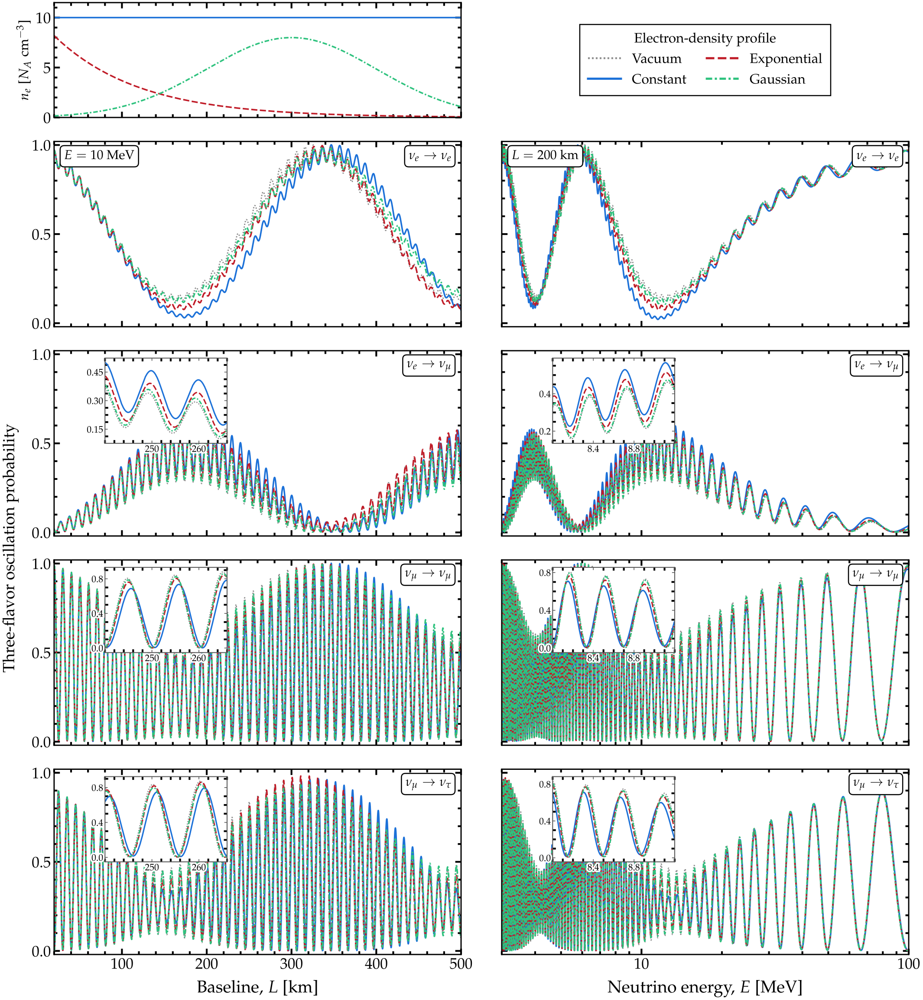

.. _ex-sec-prob-vs:

Probability vs. energy and distance
-----------------------------------

Two plots appear in almost every study of neutrino oscillations: the probability against the distance traveled, at a fixed energy, and against the neutrino energy, at a fixed distance. Magνs computes each with a single call: given a list of distances and one energy, or a list of energies and one distance, it returns the probabilities at every entry of the list.

.. _ex-fig-prob-vs:

   **Probability against distance and against energy.** Oscillation probabilities of a neutrino that travels through matter, against the distance traveled (*left*) and against the neutrino energy (*right*). Three matter profiles are drawn, plus the vacuum as a reference. *Top left*: the profiles, as the electron number density at each point along the path. The constant profile holds 10 :math:`N_A` electrons per cm\ :math:`^3`, with :math:`N_A` Avogadro’s number. The exponential profile starts at that value and halves every 69 km. The Gaussian profile peaks at 8 :math:`N_A` electrons per cm\ :math:`^3`, 300 km from the start; its width is 100 km. *Rows*: the survival of a :math:`\nu_e`, its conversion into a :math:`\nu_\mu`, the survival of a :math:`\nu_\mu`, and its conversion into a :math:`\nu_\tau`. In the left column the energy is 10 MeV; in the right column the distance is 200 km. In the lower three rows, an inset enlarges a window where the four curves separate. Listing :ref:`Probability against distance and against energy <ex-lst-prob-vs>` computes the curves. See notebook `#28 <https://github.com/mbustama/Magnus/blob/main/notebooks/28_magnus_paper_figures.ipynb>`__ and :ref:`ex-sec-prob-vs` for details.

Figure :ref:`Probability against distance and against energy <ex-fig-prob-vs>` shows both plots at three flavors, in vacuum and for three illustrative electron-density profiles: constant, exponentially falling, and a Gaussian bump near the middle of the path. Of the three, the constant profile moves the probabilities furthest from the vacuum ones. Along the path (left column), the exponential profile stays close to the constant one near the start, where its density is still high, then moves back toward the vacuum curves as its density falls. The Gaussian profile does the reverse: it stays close to the vacuum curves until the bump, then moves away from them.

Listing :ref:`Probability against distance and against energy <ex-lst-prob-vs>` computes the probabilities. A constant profile is passed as a single number, and a varying one as a function of the distance traveled. Each column takes four calls, one per profile and one in vacuum, and each call receives the whole list of distances, or of energies. For constant and exponential profiles, Magνs also has dedicated wrappers—not used in Listing :ref:`Probability against distance and against energy <ex-lst-prob-vs>`—which take the density and, for the exponential, its scale length, instead of a profile function. They return the same probabilities as the listing; e.g., for :math:`\nu_e \to \nu_e` at 500 km, the last distance of the left column:

.. code-block:: python

   P = oscprob.osc_prob_3nu_matter_exp_density(
    10.0*MEV, 500.0*KM, L0=0.0,
    rho_central=10.0*NA_CM3,
    l_scale=100.0*KM, **osc,
    nu_i=gd.NUE, nu_f=gd.NUE, **KW)
   # 0.082635, as in the listing

   P = oscprob.\
    osc_prob_3nu_matter_constant_density(
    10.0*MEV, 500.0*KM, 10.0*NA_CM3, **osc,
    nu_i=gd.NUE, nu_f=gd.NUE, **KW)
   # 0.071325, as in the listing

.. _ex-lst-prob-vs:

**Probability against distance and against energy.** The curves of Figure :ref:`Probability against distance and against energy <ex-fig-prob-vs>`: the probability at 5 000 distances for one energy, then at 3 000 energies for one distance, for three matter profiles and for vacuum. Each scan is a single call. The constant profile is a number; the two varying ones are functions of the distance traveled. See :ref:`ex-sec-prob-vs` for details.

.. code-block:: python

   import numpy as np
   import magnus.oscprob as oscprob
   import magnus.globaldefs as gd

   osc = gd.load_nufit_params('NuFIT 6.1')
   KM, MEV = gd.UNIT_KM, gd.UNIT_MEV
   # One mole of electrons per cubic centimeter, in the
   # natural units that magnus works in
   NA_CM3 = gd.N_AV/gd.CONV_CM_TO_INV_EV**3

   # Give a constant profile as a single number, and
   # a varying one as a function of the distance
   # traveled, returning the electron number density
   # there.  The distance arrives in eV^-1, like
   # every length in magnus
   ne_constant = 10.0*NA_CM3

   def ne_exponential(l):
       return 10.0*NA_CM3*np.exp(-l/(100.0*KM))

   def ne_gaussian(l):
       return 8.0*NA_CM3*np.exp(
        -(l - 300.0*KM)**2/(2*(100.0*KM)**2))

   # The first keyword says that the functions return
   # an electron number density, not a mass density
   KW = dict(density_is_of_number_of_electrons=True,
             rtol=1e-6, atol=1e-6)
   PROFILES = (('constant', ne_constant),
               ('exponential', ne_exponential),
               ('gaussian', ne_gaussian))

   # Left column: 5,000 distances at one energy.  The
   # list of distances goes where a single one would
   L = np.linspace(20.0, 500.0, 5000)*KM
   P_vs_L = {name: oscprob.osc_prob_matter_std_potential(
    3, ne, 10.0*MEV, L, osc, L0=0.0, **KW)
    for name, ne in PROFILES}

   # Right column: 3,000 energies at one distance
   E = np.logspace(np.log10(3.0), 2.0, 3000)*MEV
   P_vs_E = {name: oscprob.osc_prob_matter_std_potential(
    3, ne, E, 200.0*KM, osc, L0=0.0, **KW)
    for name, ne in PROFILES}

   # The vacuum curves, for reference
   P_vac_L = oscprob.osc_prob_3nu_vacuum(
    10.0*MEV, L, **osc)
   P_vac_E = oscprob.osc_prob_3nu_vacuum(
    E, 200.0*KM, **osc)

In Listing :ref:`Probability against distance and against energy <ex-lst-prob-vs>`, Magνs computes the two columns of Figure :ref:`Probability against distance and against energy <ex-fig-prob-vs>` with different engines. The left column is a scan over distance at one energy. Through a varying profile, Magνs walks the profile once and reads off the probability at each distance along the way; this is the cumulative engine of :doc:`/engines`, and it computes the whole left column in under half a second. The right column is a scan over energy at one distance, which cannot reuse a single walk, since the Hamiltonian changes with the energy. Instead, the energy-batched engine of :doc:`/engines` samples the potential once and evolves all the energies together. It applies to any Hamiltonian made of an energy-dependent part plus the potential times a fixed matrix, such as the standard, non-standard-interaction, and Lorentz-violating Hamiltonians, and it computes the whole right column in under a second. Magνs picks each engine by itself (:doc:`/engines`); ``strategy_info`` reports which one answered:

.. code-block:: python

   info = {}
   P = oscprob.osc_prob_matter_std_potential(
    3, ne_exponential, E, 200.0*KM, osc,
    L0=0.0, strategy_info=info, **KW)
   info['engine']   # 'separable'

Both columns agree to within :math:`2 \cdot 10^{-8}` with the same calculation at the tighter tolerances ``rtol=1e-8`` and ``atol=1e-10``.
