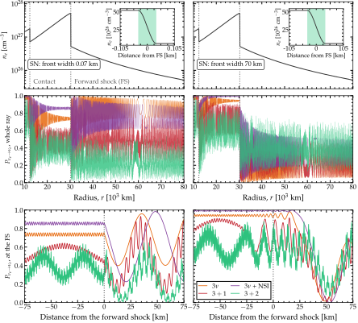
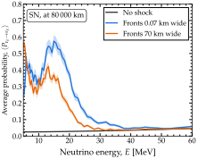

.. _ex-sec-shock:

A supernova shock front
-----------------------

.. _ex-fig-shock:

   **A supernova shock front.** Electron number density along a supernova ray, and the survival probability of a 15-MeV :math:`\nu_e` along it. *Top*: the density from :math:`10^{4}` to :math:`8 \cdot 10^{4}` km. Two fronts sit on the ray: the forward shock at 30 323 km, where the density jumps by a factor of ten, and the contact discontinuity at 12 348 km, where it jumps by a factor of 2.5. The two columns differ in one thing only, the width of both fronts: 0.07 km on the left, 70 km on the right. Neither width is visible on the scale of the ray, so the insets show the forward shock, with its extent shaded. *Center*: the probability along the whole ray, computed with Magνs at :math:`{\tt rtol} = 10^{-8}` for four Hamiltonians. The ray holds thousands of oscillation lengths of the pair of eigenstates split by :math:`\Delta m^2_{31}`, so the panel resolves the envelope of the oscillation and not the oscillation itself. The two columns agree bitwise up to the contact discontinuity and part there. *Bottom*: the same probability in a window of :math:`\pm`\ 75 km around the forward shock, where the oscillation is resolved. Two flavors are not drawn: with :math:`\Delta m^2_{21}` alone, the probability stays above 0.95 along the whole ray at this energy. The profile follows  :cite:p:`Schirato:2002tg,Fogli:2003dw`, with the radii of a simulation snapshot  :cite:p:`Kneller:2014oea`. Listing :ref:`Through a supernova shock front <ex-lst-shock>` generates the curves of the left column. See notebooks `#14 <https://github.com/mbustama/Magnus/blob/main/notebooks/14_magnus_supernova_shock.ipynb>`__ and `#28 <https://github.com/mbustama/Magnus/blob/main/notebooks/28_magnus_paper_figures.ipynb>`__.

Figure :ref:`A supernova shock front <ex-fig-shock>` shows the survival probability of a 15-MeV :math:`\nu_e` along a supernova ray crossed by a shock, for two widths of the shock fronts, 0.07 and 70 km. The forward shock is the blast wave of the explosion. It propagates outward through an envelope whose density falls as :math:`r^{-2.4}`, and compresses the matter behind it tenfold. Behind it lies the contact discontinuity, which separates the shocked envelope from the ejecta; across it, the density drops by a factor of 2.5, while the pressure is continuous. Therefore, an outgoing neutrino crosses two density jumps: first the contact discontinuity, then the forward shock. Between them lies the shocked shell, thinned by a rarefaction. Because a shock alters the adiabaticity of the level crossings, it leaves a signature in the neutrino signal  :cite:p:`Schirato:2002tg,Fogli:2003dw`.

At three flavors, only the pair of eigenstates split by :math:`\Delta m^2_{31}` is affected. The resonance density of the pair split by :math:`\Delta m^2_{21}` is 7 times lower than the lowest density on the ray, so that pair never reaches resonance; accordingly, the two-flavor survival probability stays above 0.95. At 15 MeV, the resonance density of the pair split by :math:`\Delta m^2_{31}` lies between the densities on either side of the forward shock, so the resonance is crossed at the front, where the oscillation length is about 50 km.

The 0.07-km front is crossed suddenly, before the state can follow the eigenstates. Across the 70-km front, which is comparable to the oscillation length, the state partly follows them. Therefore, beyond the forward shock, the mean survival probability at three flavors is 0.84 for the sharp fronts and 0.20 for the wide ones. The other Hamiltonians shift by different amounts; for 3+2, the shift is reversed, from 0.22 to 0.38.

Listing :ref:`Through a supernova shock front <ex-lst-shock>` computes the curves of the left column. It declares both fronts through ``t_breakpoints``, as the positions where each begins and ends, so that every level of the refinement places slab edges there. Without the breakpoints, a 0.07-km front falls inside a slab at every level, and a slab that contains a jump degrades the quadrature regardless of the number of slabs. The three-flavor scan is then wrong beyond the forward shock by up to 0.25, and Magνs warns:

.. code-block:: python

   P = oscprob.osc_prob_matter_std_potential(
    3, ne_shock, 15.0*gd.UNIT_MEV, Ls, osc,
    L0=10000.0*gd.UNIT_KM, rtol=1.0e-8,
    atol=1.0e-10, nu_i=gd.NUE, nu_f=gd.NUE,
    density_is_of_number_of_electrons=True)
   # UnmarkedDiscontinuityWarning: the
   # Hamiltonian is discontinuous at the scale
   # of the grid this scan builds, and no
   # t_breakpoints were given.  A slab
   # straddling a density jump degrades the
   # quadrature no matter how many slabs are
   # used; pass t_breakpoints at the
   # discontinuities.

With or without breakpoints, the scan also raises two tolerance warnings, because at :math:`{\tt rtol} = 10^{-8}` the refinement reaches its cap of 20 000 slabs before certifying the result. With the fronts declared, the cap is immaterial: raising it tenfold changes the curve by less than :math:`10^{-5}`, well below the resolution of Figure :ref:`A supernova shock front <ex-fig-shock>`. The scans go to the cumulative engine, as the last line of the three-flavor call confirms; declared breakpoints would keep the hybrid engine of :doc:`/adiabatic_strategy` out in any case. Notebook #14 checks the result against an independent integration, and :doc:`/comparison` measures the cost of the front width.

.. _ex-lst-shock:

**Through a supernova shock front.** The four curves of the left column of Figure :ref:`A supernova shock front <ex-fig-shock>`: for each Hamiltonian, a scan of 4 000 baselines along the ray at one energy, with both fronts declared. ``t_breakpoints`` names the positions where each front begins and ends, and the refinement puts slab edges there at every level. ``ne_shock`` is the electron density of Figure :ref:`A supernova shock front <ex-fig-shock>`, the profile of notebook #14, with :math:`Y_e = 1/2` and the normalization the model was defined with: the mean free-nucleon mass and the gram as converted before 1.2.0. See notebook `#14 <https://github.com/mbustama/Magnus/blob/main/notebooks/14_magnus_supernova_shock.ipynb>`__.

.. code-block:: python

   import numpy as np
   import magnus.oscprob as oscprob
   import magnus.globaldefs as gd

   osc = gd.load_nufit_params('NuFIT 6.1')

   # The model's normalization: the mean free-nucleon
   # mass, and the gram as converted before 1.2.0
   MEAN_NUCLEON = (0.5*(gd.MASS_PROTON + gd.MASS_NEUTRON)
                   *1.783e-33/gd.CONV_EV_TO_G)

   # The ray: an r^-2.4 envelope, compressed tenfold
   # behind the forward shock (thinned by a
   # rarefaction) and 2.5 times more inside the contact
   # discontinuity.  Each front is a smooth step of
   # width w_km
   R_CD, R_FS, w_km = 12348.0, 30323.0, 0.07   # km

   def step(r, r0):
       u = np.clip((r0 + w_km/2 - r)/w_km, 0.0, 1.0)
       return u*u*(3.0 - 2.0*u)

   def ne_shock(l):
       r = np.asarray(l)/gd.UNIT_KM
       u = np.clip(1.0 - r/R_FS, 0.0, 1.0)
       rare = np.exp((0.28 - 0.69*np.log(R_FS))
                     *np.arcsin(u)**1.1)
       rho = (1.0e14*r**-2.4                  # g/cm^3
              *(1.0 + step(r, R_FS)*(10.0*rare - 1.0))
              *(1.0 + 1.5*step(r, R_CD)))
       # Y_e = 1/2, with the model's own normalization
       return (rho*gd.UNIT_G_PER_CM3
               /MEAN_NUCLEON*0.5)

   # Declare where each front begins and ends
   w = w_km*gd.UNIT_KM
   edges = [r*gd.UNIT_KM + s*w/2 for r in (R_CD, R_FS)
            for s in (-1.0, 1.0)]

   # 4000 baselines from 10,200 to 80,000 km, at one
   # energy: the cumulative engine answers
   Ls = np.linspace(10200.0, 80000.0, 4000)*gd.UNIT_KM
   run = dict(L0=10000.0*gd.UNIT_KM, t_breakpoints=edges,
    rtol=1.0e-8, atol=1.0e-10, nu_i=gd.NUE, nu_f=gd.NUE,
    density_is_of_number_of_electrons=True)
   E = 15.0*gd.UNIT_MEV

   # Standard three-flavor oscillations
   info = {}
   P3 = oscprob.osc_prob_matter_std_potential(
    3, ne_shock, E, Ls, osc, strategy_info=info, **run)
   info['engine']   # 'cumulative'

   # The same, with non-standard interactions
   eps = dict(eps_ee=0.10, eps_em=0.05, eps_et=0.0,
    eps_mm=0.0, eps_mt=0.03, eps_tt=0.0)
   P3_nsi = oscprob.osc_prob_matter_nsi(
    3, ne_shock, E, Ls, osc, eps, **run)

   # One and two sterile states
   osc4 = dict(osc, s14=0.10**0.5, s24=0.10**0.5,
    s34=0.0, D41=1.0, d14=0.0, d24=0.0)
   P4 = oscprob.osc_prob_matter_std_potential(
    4, ne_shock, E, Ls, osc4, **run)
   osc5 = dict(osc4, s15=0.06**0.5, s25=0.06**0.5,
    s35=0.0, D51=1.7, d15=0.0, d35=0.0)
   P5 = oscprob.osc_prob_matter_std_potential(
    5, ne_shock, E, Ls, osc5, **run)

A detector measures the survival probability averaged over its energy resolution. The average washes out two phases: the one accumulated after the forward shock, thousands of cycles by the end of the ray at 15 MeV and far more on the way to Earth, and the one accumulated between the two fronts. The latter arises because the neutrino can change eigenstate at either front, so the paths through the shocked shell interfere; the interference completes a cycle every 15 keV. On the Sun, the :ref:`averaged limit on a varying profile <avg-varying>` required only the eigenbases at the ends of the ray, because the passage was adiabatic and :math:`P^{\rm cross}` was the identity. Here, the fronts are crossed suddenly, :math:`P^{\rm cross}` depends on their width, and the amplitudes of the two paths add before the modulus is taken.

Without declared fronts, ``average=True`` resolves the 70-km fronts: it returns 0.37, against :math:`0.35 \pm 0.04` with the fronts declared. It cannot resolve the 0.07-km fronts: it treats them as smooth, returns 0.04, close to the few percent obtained without a shock (Figure :ref:`The shock signature against energy <ex-fig-shock-energy>`), instead of 0.56, and raises ``UnmarkedDiscontinuityWarning``. With the fronts declared, the call returns the correct average:

.. code-block:: python

   P = oscprob.osc_prob_matter_std_potential(
    3, ne_shock, 15.0*gd.UNIT_MEV, Ls[-1], osc,
    L0=10000.0*gd.UNIT_KM, t_breakpoints=edges,
    average=True, nu_i=gd.NUE, nu_f=gd.NUE,
    density_is_of_number_of_electrons=True)
   # PhaseAveragingWarning: average=True on a
   # profile with discontinuities has no closed
   # form, so the probability was propagated
   # across an energy window of +/-10.0\% and
   # averaged over 41 samples.  This is the
   # average over that window, not the L/E ->
   # infinity limit, and it depends on the
   # window: the largest standard error of the
   # mean here is 4.47e-02.
   # Pass average_spread to set the half-width
   # of the window to the resolution of the
   # measurement, and average_n_samples to
   # reduce the error, which falls as the
   # inverse square root of the number of
   # samples.
   # P = 0.56

The warning reports the two defaults of this route, named constants of ``magnus.avgprob``: a window of :math:`\pm`\ 10% around the energy, typical of the energy resolution of a detector, and 41 samples, spaced evenly in :math:`1/E`, and hence in phase.

The keywords ``average_spread`` and ``average_n_samples`` change these values:

.. code-block:: python

   P = oscprob.osc_prob_matter_std_potential(
    3, ne_shock, 15.0*gd.UNIT_MEV, Ls[-1], osc,
    L0=10000.0*gd.UNIT_KM, t_breakpoints=edges,
    average=True, average_spread=0.05,
    average_n_samples=161, nu_i=gd.NUE,
    nu_f=gd.NUE,
    density_is_of_number_of_electrons=True)
   # P = 0.584

Unlike the limit returned on a smooth profile, this average depends on the width of the window, because the averaged probability itself varies with energy across it (Figure :ref:`The shock signature against energy <ex-fig-shock-energy>`). Therefore, the width is best set to the energy resolution of the detector being modeled. The number of samples sets the statistical error of the average, which falls as the inverse square root of that number, while each sample costs a full propagation. The warning reports that error, so the number of samples needed for a target error :math:`\delta` follows directly: :math:`N\,(\sigma/\delta)^2`, with :math:`N` the samples used and :math:`\sigma` the reported error. Here, 161 samples halve the error of the default, from 0.04 to 0.02, and take four times as long; an error of 0.01 needs about 800 samples. As in Listing :ref:`Through a supernova shock front <ex-lst-shock>`, each propagation reaches the slab cap and raises the tolerance warnings.

.. _ex-fig-shock-energy:

   **The shock signature against energy.** Averaged survival probability of a :math:`\nu_e` at the end of the supernova ray of Figure :ref:`A supernova shock front <ex-fig-shock>`, at 80 000 km, against energy, with no shock and with the two front widths of that figure. Each point with a shock is the mean over an energy window of :math:`\pm`\ 10%, the average that ``average=True`` returns on a profile with declared fronts; the bands are the standard errors of those means. Without a shock, the passage is adiabatic and the survival probability stays at a few percent. With the fronts, it is tens of percent from 5 MeV, the lowest energy shown, to about 25 MeV, where the neutrino crosses the resonance of the pair of eigenstates split by :math:`\Delta m^2_{31}` at the forward shock or close to it, and it falls back toward the no-shock value above 30 MeV, where the resonance lies farther out, in undisturbed matter. See notebooks `#14 <https://github.com/mbustama/Magnus/blob/main/notebooks/14_magnus_supernova_shock.ipynb>`__ and `#28 <https://github.com/mbustama/Magnus/blob/main/notebooks/28_magnus_paper_figures.ipynb>`__.

Figure :ref:`The shock signature against energy <ex-fig-shock-energy>` shows the effect of the shock on the energy spectrum. Without a shock, the profile is smooth, the passage is adiabatic, a :math:`\nu_e` leaves as :math:`\nu_3`, and the survival probability is a few percent at all energies. With a shock, it is tens of percent from 5 MeV, the lowest energy shown, to about 25 MeV, and falls back toward the no-shock value above 30 MeV. This window follows from the position of the resonance density, which scales as :math:`1/E`, on the profile. Between 1.8 and 18 MeV, the resonance density lies between the densities on either side of the forward shock, and the resonance is crossed at the front. Above 18 MeV, it lies in the undisturbed matter beyond the front and is crossed adiabatically; the jump still changes the mixing angle abruptly, but less so at higher energies, and the effect fades. Within the window, the sharp fronts yield the larger survival probability, because the oscillation length at the resonance, 20 to 60 km between 6 and 18 MeV, is comparable to the 70-km ramp, which the state partly follows. Between 5.3 and 13 MeV, the resonance density also lies between the densities on either side of the contact discontinuity; the resonance is then crossed at both fronts, and the result depends on the phase accumulated between them. Near 5 MeV, the wide fronts yield the larger survival probability.
