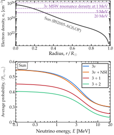
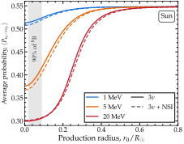
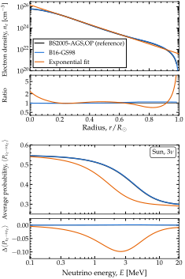
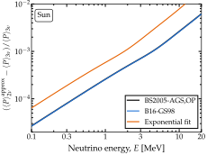

.. _ex-sec-sun:

The Sun
-------

.. contents:: On this page
   :local:
   :depth: 1

.. _ex-fig-solar:

   **The averaged solar survival probability.** *Top*: the electron number density along a radial ray of the BS2005-AGS,OP solar model  :cite:p:`Bahcall:2004pz`. The marked densities are those of the MSW resonance, :math:`\sqrt{2} G_F n_e = \Delta m^2_{21}\cos 2\theta_{12}/2E`, at three energies: a 20-MeV neutrino meets it a third of the way out; a 1-MeV neutrino never does. *Bottom*: the phase-averaged survival probability, the :ref:`averaged limit on a varying profile <avg-varying>`, computed with ``average=True`` for four Hamiltonians on the same profile. The two sterile cases lie lowest, :math:`3+2` below :math:`3+1`, because each extra state takes a share of the flux that does not return. Listing :ref:`Averaged solar probabilities <ex-lst-sun>` generates the data. See notebooks `#10 <https://github.com/mbustama/Magnus/blob/main/notebooks/10_magnus_averaged_probability.ipynb>`__, `#13 <https://github.com/mbustama/Magnus/blob/main/notebooks/13_magnus_tabulated_solar_model.ipynb>`__, and `#28 <https://github.com/mbustama/Magnus/blob/main/notebooks/28_magnus_paper_figures.ipynb>`__, and :ref:`ex-sec-sun` for details.

Figure :ref:`The averaged solar survival probability <ex-fig-solar>` shows the electron density of the BS2005-AGS,OP solar model  :cite:p:`Bahcall:2004pz`, and the averaged survival probability it produces for four Hamiltonians. Along a radial ray, the density falls smoothly by five orders of magnitude, with no discontinuity. On the way out, a 5-MeV neutrino accumulates a phase of :math:`3 \cdot 10^4` radians between the first two eigenstates, and of :math:`9 \cdot 10^5` radians between the first and the third. So the survival probability at the surface runs through a full oscillation each time the production point moves by about 160 km, or the energy by a few parts in :math:`10^4`. Yet, neutrinos are produced over tens of thousands of kilometers, and no detector resolves energy that finely. Therefore, what a solar experiment measures is the phase-averaged probability of :doc:`/averaged_probability`.

The energy dependence of the probability in Figure :ref:`The averaged solar survival probability <ex-fig-solar>` is set by where the resonance density sits relative to the density at production. The resonance density falls with energy as :math:`1/E`. At 20 MeV, the profile falls to the resonance density a third of the way out. A neutrino born at the center, at ten times that density, is mostly the matter eigenstate that turns into :math:`\nu_2` on the way out, so it leaves the Sun as :math:`\nu_2`, and its average is :math:`\lvert \mathbb{U}_{e2} \rvert^2 \approx 0.30`. At 1 MeV, the resonance density lies above the central density, so the neutrino is born below it and never crosses it. Matter then only lowers the average a little, to 0.51, from the vacuum value, 0.55, which the curve reaches at 0.1 MeV.

The probability in Figure :ref:`The averaged solar survival probability <ex-fig-solar>` shows the passage between the two regimes, over an energy range that spans the spectrum of neutrinos from :math:`^8`\ B decay. Along the ray, the density changes slowly compared with the local oscillation length, so a neutrino stays in the eigenstate it was born in: :math:`P^{\rm cross}` in the :ref:`averaged limit on a varying profile <avg-varying>` is the identity, at every energy. What remains are the two eigenbases at the ends of the ray. The one at the surface is the vacuum mixing matrix, the same for any profile. The one at the other end is set by the density where the neutrino is born.

Listing :ref:`Averaged solar probabilities <ex-lst-sun>` computes the four curves of Figure :ref:`The averaged solar survival probability <ex-fig-solar>`. The BS2005-AGS,OP table is one of the twelve standard solar models that ship with Magνs (:ref:`ex-sec-solar-model-comparison`); every Sun wrapper takes it by name through ``density_profile``. Without that keyword, a wrapper uses its default, ``'exp'``, an exponential fit to the solar density (:ref:`ex-sec-solar-model-comparison`). The wrapper interpolates the electron number density log-linearly between the tabulated radii. For the sterile states, it also reads the neutron-to-proton ratio from the table, :math:`n_n/n_p = (1 - X)/(1 + X)` at each radius, with :math:`X` the hydrogen mass fraction.

The only difference from an ordinary probability call is ``average=True`` (:ref:`ex-sec-average-keyword`). With it, Magνs does not propagate the phase along the ray. It searches the ray for crossings that are not adiabatic, which it would bridge with the Magnus patch of :doc:`/adiabatic_strategy`, and combines the eigenbases at the two ends. On the Sun, it finds no such crossing for any of the four Hamiltonians, so the result depends only on those two eigenbases.The neutrino starts in a flavor state, the default of ``average_initial_state``, so the result is the :ref:`averaged limit on a varying profile <avg-varying>`. Its interference terms carry the phases above, which damp them to nothing, so the result equals the :ref:`averaged limit on a varying profile <avg-varying>` to within :math:`5 \cdot 10^{-15}`.

In Listing :ref:`Averaged solar probabilities <ex-lst-sun>`, only the wrapper changes between the four probability calls, and with it the Hamiltonian. The cost of a call follows the number of pairs of levels that the engine tests for adiabaticity along the ray, not the content of the Hamiltonian: three pairs at three flavors, six at :math:`3+1`, and ten at :math:`3+2`. The non-standard interactions change the matter term but add no levels, so they cost the same as the standard case. Sterile states add levels, and so do pseudo-Dirac partners, one per split pair (:ref:`ex-sec-shipped-hamiltonians`). The four curves take about 0.5 s, 0.5 s, 0.8 s, and 1.2 s, respectively, over ninety energies.

.. _ex-lst-sun:

**Averaged solar probabilities.** The four averaged solar probabilities of Figure :ref:`The averaged solar survival probability <ex-fig-solar>`, complete and runnable as it stands: the BS2005-AGS,OP table  :cite:p:`Bahcall:2004pz` ships with Magνs, and every Sun wrapper takes it by name through ``density_profile``. The same keywords serve the four wrappers. The keyword ``average=True`` is the only difference from an instantaneous call: it returns the :ref:`averaged limit on a varying profile <avg-varying>` from the eigenbases at the two ends of the ray, without propagating the phase. The four curves take about three seconds. Naming ``'B16-GS98'`` instead gives the B16-GS98 curve of Figure :ref:`Three solar models compared <ex-fig-solar-models>`. See notebooks `#10 <https://github.com/mbustama/Magnus/blob/main/notebooks/10_magnus_averaged_probability.ipynb>`__, `#13 <https://github.com/mbustama/Magnus/blob/main/notebooks/13_magnus_tabulated_solar_model.ipynb>`__, and `#28 <https://github.com/mbustama/Magnus/blob/main/notebooks/28_magnus_paper_figures.ipynb>`__, and :ref:`ex-sec-sun` for details.

.. code-block:: python

   import numpy as np
   import magnus.oscprob as oscprob
   import magnus.globaldefs as gd
   import magnus.solarmodels as solarmodels

   # The table ships with Magnus. Its columns are read
   # only to plot the density (top panel of the figure)
   model = 'BS05-AGS-OP'
   r = solarmodels.load_solar_model(model)['r_over_r_sun']
   ne_sun = solarmodels.electron_density_profile(model)
   ne = ne_sun(r*gd.SUN_RADIUS*gd.UNIT_KM)

   # The solar spectrum, 0.1 to 20 MeV
   E = np.logspace(-1.0, np.log10(20.0), 90)*gd.UNIT_MEV
   osc = gd.load_nufit_params('NuFIT 6.1')

   # Shared by the four calls: the model by name, from
   # the center to its last row, nu_e to nu_e, the average
   R = solarmodels.table_edge(model)
   run = dict(nu_i=gd.NUE, nu_f=gd.NUE, average=True,
    density_profile=model)

   # Standard three-flavor oscillations
   P3 = oscprob.osc_prob_3nu_sun(E, R, 0.0, **osc, **run)

   # The same, with non-standard interactions
   eps = dict(eps_ee=0.10, eps_em=0.05, eps_mt=0.03)
   P3_nsi = oscprob.osc_prob_3nu_sun_nsi(
    E, R, 0.0, **osc, **eps, **run)

   # One and two sterile states.  n_n/n_p is read from
   # the table; passing ratio_number_neutrons_to_protons
   # overrides it
   ster = dict(s14=0.10**0.5, s24=0.10**0.5, D41=1.0)
   P4 = oscprob.osc_prob_4nu_sun(
    E, R, 0.0, **osc, **ster, **run)
   P5 = oscprob.osc_prob_5nu_sun(
    E, R, 0.0, **osc, **ster, s15=0.06**0.5,
    s25=0.06**0.5, D51=1.7, **run)

   # P3 = 0.5449 at 0.1 MeV, 0.2993 at 20 MeV

Without the ``average`` keyword, the same call returns the instantaneous probability at the surface. That answer is correct, even if it is not what Figure :ref:`The averaged solar survival probability <ex-fig-solar>` shows. With an oscillation length of about 160 km, the probability swings across most of the interval [0,1] within a hundred kilometers of the surface:

.. code-block:: python

   dL = np.array([0, 50, 100])*gd.UNIT_KM
   P = oscprob.osc_prob_3nu_sun(
    5.0*gd.UNIT_MEV, R - dL, 0.0, **osc,
    nu_i=gd.NUE, nu_f=gd.NUE,
    density_profile=model)
   # P = 0.208, 0.773, 0.349 in about 7 s

These values are not numerical noise. The hybrid engine of :doc:`/adiabatic_strategy` computes and certifies them: two successive passes, on finer grids, agree to the requested tolerance, :math:`10^{-3}` by default.

.. _ex-sec-sun-production-point:

Varying the production point
~~~~~~~~~~~~~~~~~~~~~~~~~~~~

.. _ex-fig-solar-production:

   **Dependence on the production point in the Sun.** Phase-averaged survival probability of a solar neutrino as a function of where it is produced, along the radial ray of Figure :ref:`The averaged solar survival probability <ex-fig-solar>`, at three energies, with and without the non-standard interactions (NSI) of Figure :ref:`The averaged solar survival probability <ex-fig-solar>`. The density is from the BS2005-AGS,OP solar model :cite:p:`Bahcall:2004pz`. At 5 and 20 MeV, each curve rises from its value at the center to the vacuum value, 0.55, as the production point moves out past the radius where the resonance density of Figure :ref:`The averaged solar survival probability <ex-fig-solar>` meets the profile: a sixth of the way out at 5 MeV, a third at 20 MeV. At 1 MeV, the resonance density lies above the central density, and the curve rises only from 0.51. The band marks where :math:`90\%` of the :math:`^8`\ B neutrinos are made, in the same model. See notebooks `#10 <https://github.com/mbustama/Magnus/blob/main/notebooks/10_magnus_averaged_probability.ipynb>`__, `#13 <https://github.com/mbustama/Magnus/blob/main/notebooks/13_magnus_tabulated_solar_model.ipynb>`__, and `#28 <https://github.com/mbustama/Magnus/blob/main/notebooks/28_magnus_paper_figures.ipynb>`__, and :ref:`ex-sec-sun-production-point` for details.

:ref:`ex-sec-sun` placed the neutrino at the center of the Sun. Figure :ref:`Dependence on the production point in the Sun <ex-fig-solar-production>` moves its production point instead, :math:`r_0`, at fixed energy. At 20 MeV, a neutrino born at the center leaves as :math:`\nu_2`, with an average of 0.30. The farther out it is born, the lower the density at production, and the closer the average comes to the vacuum value, 0.55, which it nearly reaches by :math:`R_\odot/2`. The rise passes through the radius where the resonance density of Figure :ref:`The averaged solar survival probability <ex-fig-solar>` meets the profile, about :math:`R_\odot/3`; a neutrino born there has an average of :math:`\cos^4\theta_{13}/2 \approx 0.48`. As the energy drops, the rise moves inward, to about :math:`R_\odot/6` at 5 MeV. At 1 MeV, the resonance density lies above the central density, and the curve rises only mildly, from 0.51 to 0.55. Each point of the figure is one call with ``average=True``, as in Listing :ref:`Averaged solar probabilities <ex-lst-sun>`, with a different ``L0``:

.. code-block:: python

   P = oscprob.osc_prob_3nu_sun(
    5.0*gd.UNIT_MEV, R,
    0.05*gd.SUN_RADIUS*gd.UNIT_KM,
    **osc, **run)
   # P = 0.390, against 0.375 from the center

At 5 MeV, moving the production point from the center to :math:`0.05\,R_\odot`, in the middle of where the :math:`^8`\ B neutrinos are made, raises the average by 0.014.

The :math:`^8`\ B neutrinos are made between :math:`0.02\,R_\odot` and :math:`0.09\,R_\odot` (the band in Figure :ref:`Dependence on the production point in the Sun <ex-fig-solar-production>`). The density is lowest at the outer edge of the band, and even there it exceeds the resonance density of a neutrino with more than 2.6 MeV. So a :math:`^8`\ B neutrino with more than 2.6 MeV is born at a density above its resonance density, wherever in the band it is made, just like one born at the center. That is why Figure :ref:`The averaged solar survival probability <ex-fig-solar>`, computed for a neutrino born at the center, holds for the :math:`^8`\ B neutrinos at high energy: at 20 MeV, the average is 0.301 from :math:`0.05\,R_\odot`, against 0.299 from the center. The non-standard interactions shift the curves by up to 0.012.

.. _ex-sec-averaging-is-not-estimating:

Probability averaging
~~~~~~~~~~~~~~~~~~~~~

In principle, the averaged probability could be estimated from the instantaneous one, as its mean over a window of baselines at the end of the ray. On the Sun, that estimate is close, but biased. The window must span many oscillation lengths for the mean to wash out the oscillation, yet across such a window the density changes, and so does the averaged probability, which depends on the density at the end of the ray. In notebook `#13 <https://github.com/mbustama/Magnus/blob/main/notebooks/13_magnus_tabulated_solar_model.ipynb>`__, for a 5-MeV neutrino at two flavors, on a ray from the center through the inner tenth of the solar radius, the mean over the last 6, 12, 24, and 48 oscillation lengths lies between 0.599 and 0.601, while the true averaged probability at the end of the ray is 0.595. The bias is small, 0.004 to 0.006, but it does not shrink as the window widens.

A scan of the instantaneous probability along the ray has a second problem: aliasing. A scan needs at least two points per cycle of the oscillation it samples. With fewer, each value is still correct, but a curve drawn through them is not the probability. On the Sun, the fastest oscillation of a 5-MeV neutrino has a length of 4.9 km, so a scan of the last 100 km in steps of 50 km is aliased. Passing ``strategy_info`` reports it:

.. code-block:: python

   dL = np.array([0, 50, 100])*gd.UNIT_KM
   info = {}
   P = oscprob.osc_prob_3nu_sun(
    5.0*gd.UNIT_MEV, R - dL, 0.0, **osc,
    nu_i=gd.NUE, nu_f=gd.NUE,
    density_profile=model,
    strategy_info=info)
   s = info['sampling']
   s['cycles_per_step']          # 10.1
   s['aliased']                  # True
   s['nyquist_points']           # 277028

Ten cycles fit between neighboring points. To resolve every cycle from the center to the surface, a scan would need :math:`2.8 \cdot 10^5` points. Magνs reports aliasing, but does not warn about it, since nearly every realistic scan of a solar ray is aliased.

The keyword ``average=True`` avoids both problems: it takes no window and runs no scan. It evaluates the limit directly from the eigenbases at the two ends of the ray (:doc:`/averaged_probability`). At two flavors, on an adiabatic passage, the averaged survival probability of a neutrino started decohered has the textbook form

.. math::
   :label: ex-equ-two-flavor-adiabatic

   \langle P^{2\nu}_{\nu_e \to \nu_e} \rangle_{\rm approx}
   =
   \tfrac12 + \tfrac12\cos2\theta_m(l_0)\cos2\theta_m(l_1) \;,

with :math:`\theta_m` the mixing angle in matter at the two ends of the ray. Notebook #13, with ``average_initial_state='decohered'``, reproduces this expression to within :math:`3 \cdot 10^{-16}` across 1–20 MeV.

.. _ex-sec-solar-model-comparison:

Comparing solar models
~~~~~~~~~~~~~~~~~~~~~~

.. _ex-tab-solar-models:

.. table:: Solar density profiles

   .. list-table::
      :header-rows: 1
      :widths: 25 75

      * - ``density_profile``
        - Solar density profile
      * - ``'exp'``
        - Exponential fit :cite:p:`Giunti:2007ry`; the default
      * - ``'BP2000'``
        - BP2000 :cite:p:`Bahcall:2000nu`; to :math:`0.95\,R_\odot`
      * - ``'BP04'``
        - BP04 :cite:p:`Bahcall:2004fg`; to :math:`0.95\,R_\odot`
      * - ``'BS05-OP'``
        - BS2005, GS98 composition :cite:p:`Bahcall:2004pz`; to :math:`0.98\,R_\odot`
      * - ``'BS05-AGS-OP'``
        - BS2005, AGS05 composition :cite:p:`Bahcall:2004pz`; to :math:`0.98\,R_\odot`
      * - ``'B16-GS98'``
        - B16, GS98 composition :cite:p:`Vinyoles:2016djt`
      * - ``'B16-AGSS09met'``
        - B16, AGSS09met composition :cite:p:`Vinyoles:2016djt`
      * - ``'B23-GS98'``
        - B23, GS98 composition :cite:p:`Herrera:2023b23`
      * - ``'B23-AGSS09'``
        - B23, AGSS09 composition :cite:p:`Herrera:2023b23`
      * - ``'B23-C11'``
        - B23, C11 composition :cite:p:`Herrera:2023b23`
      * - ``'B23-AAG21'``
        - B23, AAG21 composition :cite:p:`Herrera:2023b23`
      * - ``'B23-MB22m'``
        - B23, MB22 meteoritic composition :cite:p:`Herrera:2023b23`
      * - ``'B23-MB22p'``
        - B23, MB22 photospheric composition :cite:p:`Herrera:2023b23`

The solar density profiles that every Sun wrapper takes through ``density_profile``. The tabulated standard solar models ship with Magνs. The B16 and B23 tables reach the surface. Past the last row of the older models, the density continues along the slope of the last tabulated interval, unless ``stop_at_table_edge=True``, which returns ``NaN`` there, with a warning. With sterile states, :math:`n_n/n_p` is read from the same table, unless overridden with ``ratio_number_neutrons_to_protons``. The solar compositions are GS98 :cite:p:`Grevesse:1998bj`, AGS05 :cite:p:`Asplund:2004eu`, AGSS09 :cite:p:`Asplund:2009fu`, C11 :cite:p:`Caffau:2010qc`, AAG21 :cite:p:`Asplund:2021aag`, and MB22 :cite:p:`Magg:2022rxb`. See notebook `#13 <https://github.com/mbustama/Magnus/blob/main/notebooks/13_magnus_tabulated_solar_model.ipynb>`__ and :ref:`ex-sec-solar-model-comparison` for details.

.. _ex-fig-solar-models:

   **Three solar models compared.** *Top*: the tabulated BS2005-AGS,OP  :cite:p:`Bahcall:2004pz` and B16-GS98  :cite:p:`Vinyoles:2016djt` standard solar models, and the exponential fit :math:`n_e = 245\,N_A\,e^{-10.54\,r/R_\odot}` cm\ :math:`^{-3}`  :cite:p:`Giunti:2007ry`, with :math:`N_A` the Avogadro number, that the Sun wrappers use by default; underneath, the ratio of each to BS2005-AGS,OP. The two tables agree to within 2% over the inner half of the Sun and 9% over the outer half. The fit is 2.4 times too dense at the center and several times too dense in the outermost layers. *Bottom*: :math:`\langle P_{\nu_e \to \nu_e}\rangle` at three flavors on each profile; underneath, the difference from the BS2005-AGS,OP result. The two tables give the same probability to within :math:`1.3 \cdot 10^{-3}`; the fit is low by up to 0.1, at 2.5 MeV. See notebooks `#10 <https://github.com/mbustama/Magnus/blob/main/notebooks/10_magnus_averaged_probability.ipynb>`__, `#13 <https://github.com/mbustama/Magnus/blob/main/notebooks/13_magnus_tabulated_solar_model.ipynb>`__, and `#28 <https://github.com/mbustama/Magnus/blob/main/notebooks/28_magnus_paper_figures.ipynb>`__, and :ref:`ex-sec-solar-model-comparison` for details.

Table :ref:`ex-tab-solar-models` lists the solar density profiles that every Sun wrapper accepts through ``density_profile``. Besides the an exponential profile, which is the default, Magνs ships twelve tabulated standard solar models from five series published between 2001 and 2023, several of them in more than one solar composition. Each is selected by name, which is not case-sensitive, e.g., ``density_profile='B16-GS98'``.

From the tabulated mass density, :math:`\rho`, and hydrogen mass fraction, :math:`X`, the wrapper builds the electron number density, :math:`n_e = \rho\,(1 + X)/(2 m_N)`, with :math:`m_N` the mean nucleon mass, and interpolates it log-linearly in radius. Below the first tabulated radius, it holds the density at its first value, since the core is flat. Past the last one, which lies at :math:`0.95\,R_\odot` for BP2000 and BP04 and at :math:`0.98\,R_\odot` for BS2005, it continues the density along the logarithmic slope of the last tabulated interval. Passing ``stop_at_table_edge=True`` returns ``NaN`` there instead, with a warning. With sterile states, the wrapper reads :math:`n_n/n_p = (1 - X)/(1 + X)`, which is read automatically from the same table. In notebook `#13 <https://github.com/mbustama/Magnus/blob/main/notebooks/13_magnus_tabulated_solar_model.ipynb>`__, we compare all twelve models: they give the same averaged :math:`\nu_e` survival probability to within :math:`2.4 \cdot 10^{-3}`. Most of that spread is between series of models; the six compositions of the B23 series differ by at most :math:`2 \cdot 10^{-4}`.

Figure :ref:`Three solar models compared <ex-fig-solar-models>` compares the probabilities computed with three choices of solar density profile. Two are tabulated standard solar models: BS2005-AGS,OP  :cite:p:`Bahcall:2004pz`, used throughout this section, and the newer B16-GS98  :cite:p:`Vinyoles:2016djt`, with updated nuclear rates, equation of state, and opacities. The third is the exponential fit that textbooks quote  :cite:p:`Giunti:2007ry` and that the Sun wrappers use by default. The densities of the two solar models are within 2% of each other over the inner half of the Sun and 9% over the outer half. The exponential fit is 2.4 times too dense at the center, where the real profile flattens, and several times too dense again near the surface, where the real profile plunges.

The two tabulated models give the same averaged probability to within :math:`1.3 \cdot 10^{-3}` at every energy, far below the precision of any solar measurement. The exponential fit gives a probability lower by up to 0.1, at 2.5 MeV. The reason is in :ref:`ex-sec-sun`: on an adiabatic passage, the averaged probability depends only on the eigenbases at the two ends of the ray. At the surface, the eigenbasis is that of vacuum, whatever the profile. At the center, it is set by the central density, where the fit is 2.4 times too dense. The probability falls from 0.55 at low energy to 0.30 at high energy, and the fall happens near the resonance energy, which is inversely proportional to the density. With the fit, the fall therefore happens at energies about 2.4 times lower. The values at low and high energy are nearly the same for every profile, so the difference is largest in between, at a few MeV.

.. _ex-sec-sun-compare-approx:

Comparing against approximations
~~~~~~~~~~~~~~~~~~~~~~~~~~~~~~~~

.. _ex-fig-solar-approx:

   **Error of the two-flavor solar approximation.** Relative error of the two-flavor approximation, :math:`\langle P^{3\nu}_{\nu_e \to \nu_e} \rangle_{\rm approx}` of Eq. :eq:`ex-equ-two-flavor-reduction`, to the averaged solar survival probability :math:`\langle P^{3\nu}_{\nu_e \to \nu_e} \rangle` computed with Magνs, on the three solar density profiles of Figure :ref:`Three solar models compared <ex-fig-solar-models>`. The approximation overestimates the probability at every energy, by an amount that grows in proportion to the energy. On the two tabulated models, it reaches 0.6% at 20 MeV. On the exponential fit, whose central density is 2.4 times higher, it is 2.3 to 3.4 times larger, and its curve leaves the panel above 12 MeV. See notebook `#28 <https://github.com/mbustama/Magnus/blob/main/notebooks/28_magnus_paper_figures.ipynb>`__ and :ref:`ex-sec-sun-compare-approx` for details.

Solar analyses rarely solve the three-flavor problem. The standard approximation  :cite:p:`Kuo:1989qe` reduces it to two flavors in two steps. First, the 1–2 sector is solved on its own, as a two-flavor problem with :math:`\theta_{12}` and :math:`\Delta m^2_{21}`, on the electron density multiplied by :math:`\cos^2\theta_{13}`. Second, :math:`\theta_{13}` is folded back in through

.. math::
   :label: ex-equ-two-flavor-reduction

   \langle P^{3\nu}_{\nu_e \to \nu_e} \rangle_{\rm approx}
   =
   \sin^4\theta_{13} + \cos^4\theta_{13}\,\langle P^{2\nu}_{\nu_e \to \nu_e} \rangle_{\rm approx} \;.

Here, :math:`\langle P^{2\nu}_{\nu_e \to \nu_e} \rangle_{\rm approx}` is Eq. :eq:`ex-equ-two-flavor-adiabatic`, with :math:`\theta_m` computed from :math:`\theta_{12}`, :math:`\Delta m^2_{21}`, and the electron density multiplied by :math:`\cos^2\theta_{13}`. The approximation rests on :math:`\Delta m^2_{31}` being large compared with :math:`\Delta m^2_{21}` and with the matter potential, so that the third mass state decouples. In vacuum, the approximation is exact. In matter, it drops terms of relative size :math:`2 E V_{\rm CC}/\Delta m^2_{31}`, about 0.1 at the center of the Sun for a 20-MeV neutrino, multiplied by the admixture of the decoupled state, :math:`\sin^2\theta_{13} \approx 0.02`. Analyses that use the approximation state that these terms are negligible; few evaluate them.

Figure :ref:`Error of the two-flavor solar approximation <ex-fig-solar-approx>` evaluates them on the three density profiles of Figure :ref:`Three solar models compared <ex-fig-solar-models>`. The three-flavor result, :math:`\langle P^{3\nu}_{\nu_e \to \nu_e} \rangle`, is computed with Magνs: ``P3`` of Listing :ref:`Averaged solar probabilities <ex-lst-sun>` for the BS2005-AGS,OP table, and the same call on the other two profiles. The two-flavor result needs the density multiplied by :math:`\cos^2\theta_{13}`, which a wrapper cannot provide, since it takes the solar model by name. So it goes through the scenario function, which accepts any profile, here ``ne_sun`` of Listing :ref:`Averaged solar probabilities <ex-lst-sun>` multiplied by :math:`\cos^2\theta_{13}`:

.. code-block:: python

   # The 1-2 sector on cos^2 th13 * n_e
   c13sq = 1.0 - osc['s13']**2   # cos^2 th13
   P2 = oscprob.osc_prob_matter_std_potential(
    2, lambda l: c13sq*ne_sun(l), E, R,
    dict(sth=osc['s12'], Dm2=osc['D21']),
    L0=0.0, nu_i=gd.NUE, nu_f=gd.NUE, average=True,
    density_is_of_number_of_electrons=True)
   # Fold theta_13 back in
   P_approx = osc['s13']**4 + c13sq**2*P2
   (P_approx - P3)/P3   # 6e-3 at 20 MeV

The ``P2`` returned equals Eq. :eq:`ex-equ-two-flavor-adiabatic` to within :math:`10^{-16}` at every energy.

The approximation overestimates the probability at every energy, on every profile, and its relative error grows in proportion to the energy, as the size of the dropped terms does. On the two tabulated models, which give nearly the same probability (:ref:`ex-sec-solar-model-comparison`), the error is about :math:`10^{-5}` at 0.1 MeV, :math:`10^{-4}` at 1 MeV, and 0.6% at 20 MeV. On the exponential fit, it is 2.3 to 3.4 times larger, 2% at 20 MeV, because the fit’s central density is 2.4 times higher and the dropped terms grow with it.
