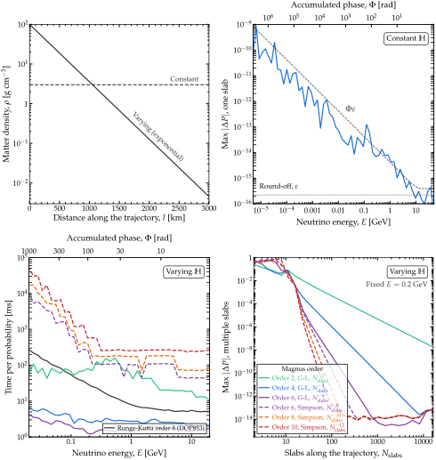

Methodology
============

.. contents::
   :local:
   :depth: 2

This page documents the numerical machinery behind Magνs: the Magnus
expansion itself, the two families of integrators, the guarantees they
carry, the adaptive-refinement and performance engineering built around
them, and the evidence used to validate all of it.  See
:ref:`when-is-magnus-a-win` on the front page for the short version.

The Magnus expansion
-----------------------

Neutrino flavor evolution is governed by the Schrödinger-like equation

.. math::

   i \frac{d}{dl}\, |\psi(l)\rangle = H(l)\, |\psi(l)\rangle ,

with :math:`H(l)` the (possibly position-dependent) flavor Hamiltonian.
The evolution operator :math:`U(l_1, l_0)` satisfies the same equation with
:math:`U(l_0, l_0) = \mathbb{1}`.  When :math:`H` does not commute with
itself at different positions, :math:`U` is *not* simply
:math:`\exp\!\left[-i\int_{l_0}^{l_1} H(l)\, dl\right]`.

The Magnus expansion instead writes :math:`U(l_1, l_0) = \exp[\Omega(l_1)]`
exactly, where :math:`\Omega = \sum_k \Omega_k` is built order by order from
nested commutators of :math:`A(l) \equiv -i H(l)` :cite:p:`Blanes2009`:

.. math::

   \Omega_1(l) &= \int_{l_0}^{l} A(s)\, ds \\
   \Omega_n(l) &= \sum_{j=1}^{n-1} \frac{B_j}{j!} \int_{l_0}^{l} S_n^{(j)}(s)\, ds ,

with :math:`B_j` the Bernoulli numbers (:math:`B_1 = -1/2` convention) and
:math:`S_n^{(j)}` sums of :math:`j`-fold nested commutators of the
lower-order terms with :math:`A`.  Magνs implements this recursion through
:math:`n = 10` (odd Bernoulli numbers :math:`B_3 = B_5 = 0` vanish
identically, so only even-index commutator groups appear beyond
:math:`\Omega_3`); the coefficients and every term were verified
independently, term by term, against this recursion (see
:ref:`validation`).  Orders 1 to 6 are written out inline; beyond that the
terms are generated from the recursion, since their number roughly doubles
per order.  :doc:`expansion_terms` derives them symbolically at any order,
which is what the verification checks against.

**Truncating the series is exact for the group, not just approximate for
the answer.**  Whatever order the sum stops at, :math:`\Omega` remains
anti-Hermitian (since each :math:`\Omega_k` is a real combination of nested
commutators of anti-Hermitian matrices), so :math:`\exp(\Omega)` is
*exactly* unitary, regardless of the truncation order or the quadrature
accuracy.  In floating point it comes close: one exponential deviates by
:math:`\lVert U^\dagger U - \mathbb{1}\rVert = 4\times10^{-16}` in the median (the worst
of a stack of 4096 reaches :math:`4\times10^{-15}`), and a whole probability, built from
many such factors, by :math:`3\times10^{-12}` to :math:`1.6\times10^{-11}` at worst across
four decades in the number of points, at two to five flavors.  This is the central practical advantage over direct
ODE integration, whose iterates only approximately preserve unitarity (see
:ref:`accumulated-phase`).

The series converges absolutely whenever
:math:`\int_{l_0}^{l_1} \lVert A(l)\rVert_2\, dl < \pi` over the interval
in question.  Magνs partitions the trajectory into a chain of slabs and
evaluates the expansion independently in each one; a large accumulated
phase (a long baseline, a strong potential, or both) is handled by adding
more, narrower slabs rather than by raising the expansion order.  Magνs
checks :math:`\lVert\Omega\rVert_2` on every slab, from the spectrum
already computed for the matrix exponential (see below), and emits
``MagnusConvergenceWarning`` when it reaches :math:`\pi` on some slab: the
sufficient condition for convergence is then not met, which says nothing
yet about the error.

Two integration methods
--------------------------

Evaluating the nested integrals above requires sampling :math:`A(l)` inside
each slab.  Magνs offers two families, selected via
``integration_method``, which defaults to ``'gl'``:

**Gauss-Legendre collocation integrators (** ``'gl'`` **, the default).**
Following :cite:t:`Blanes2000` and :cite:t:`Blanes2002`, orders 2, 4, 6, and 8
can be reached from only 1, 2, 3, or 4 evaluations of :math:`A` per slab, at the
Gauss-Legendre nodes,
with no cumulative quadrature and no separate commutator bookkeeping:

.. math::

   \Omega^{(2)} &= h\, A_1 \\
   \Omega^{(4)} &= \frac{h}{2}(A_1 + A_2) + \frac{\sqrt{3}}{12} h^2\, [A_2, A_1] \\
   \Omega^{(6)} &= \ldots \quad \text{(three-node scheme; see the reference)} \\
   \Omega^{(8)} &= \ldots \quad \text{(four-node scheme; see the reference)}

with :math:`h` the slab width and :math:`A_i` the Hamiltonian sampled at
the corresponding node.  Because the quadrature order is matched exactly
to the truncation order, this method needs far fewer Hamiltonian
evaluations for the same accuracy -- it is simultaneously the fastest and
the most accurate choice whenever the Hamiltonian is smooth within a slab,
which is why it is the default.  Layer-aligned slabs (below) make that the
common case even across the Earth.

Orders 4, 6 and 8 need 1, 3 and 6 commutators, the fewest possible at each order
:cite:p:`Blanes2002`; the paper's Table 4 lists the coefficients of the order-6 and
order-8 schemes.  No collocation scheme of this form is known at order 10 or above.

Because ``'gl'`` uses a fixed 1, 2, 3, or 4 nodes per slab, ``n_tpts_per_slab``
plays no role for it: accuracy is controlled by the slab count alone, and the
adaptive refinement below grows only ``n_slabs``.  The physics-informed
starting slab count is applied for ``'gl'`` everywhere.  For the quadrature
methods, whose accuracy is governed jointly by ``n_slabs`` and
``n_tpts_per_slab``, the per-point ladder does not seed, and the
energy-batched engine seeds only when the seed is at least
:data:`magnus.oscprob.QUADRATURE_SEED_MIN_SLABS` (4): measured, a smaller
seed could send the ladder through an extra level, and a larger one never did.

**Cumulative quadrature (** ``'trapezoid'`` **,** ``'simpson'`` **).**
Sample :math:`A` on a uniform grid of ``n_tpts_per_slab`` points and
integrate with cumulative trapezoid or Simpson's rule.  Slower for the same
accuracy on a smooth profile, but fully general, and they reach order 10.  A
kink or a discontinuity belongs on a slab edge, declared with
``t_breakpoints``: there each slab takes its endpoint sample just inside
itself, so both sides of a jump are integrated with their own values and the
rule keeps its order.  One left *inside* a slab degrades every method.  The quadrature error
(:math:`O(h^2)` or :math:`O(h^4)` in the grid spacing :math:`h`) can dominate
the Magnus truncation error at high orders unless ``n_tpts_per_slab`` grows
accordingly.  The grid starts at 100 points per slab, and the refinement grows it together
with the number of slabs.

**What ``magnus_exp_order`` means on each path.**  On ``'gl'`` it is the order the method
delivers: the error over the trajectory falls as :math:`h^p`, or :math:`N_{\rm
slabs}^{-p}`.  On ``'simpson'`` and ``'trapezoid'`` it is the index of the last
:math:`\Omega_k` kept, and the order delivered runs ahead of it,
:math:`2\lfloor k/2 \rfloor + 2`: order 6 on Simpson keeps :math:`\Omega_5` and
:math:`\Omega_6` and is an eighth-order method.  Every order is even, because about the
slab midpoint each :math:`\Omega_k` carries only odd powers of :math:`h`, which pairs the
terms (:math:`\Omega_3` and :math:`\Omega_4` both at :math:`h^5`, and so on).  An odd
request runs the next even scheme on ``'gl'``, and delivers the even order just below on
the cumulative rules, at the cost of one more term:

.. list-table::
   :header-rows: 1
   :widths: 25 25 25 25

   * - ``magnus_exp_order``
     - ``'gl'``
     - ``'simpson'``
     - ``'trapezoid'``
   * - 1
     - 2
     - 2
     - (2)
   * - 2
     - 2
     - 4
     - (4)
   * - 3
     - 4
     - 4
     - (4)
   * - 4 (default)
     - **4**
     - 6
     - (6)
   * - 5
     - 6
     - 6
     - (6)
   * - 6
     - 6
     - 8
     - (8)
   * - 7
     - (8)
     - (8)
     - (8)
   * - 8
     - 8
     - 10
     - (10)
   * - 9
     - --
     - (10)
     - (10)
   * - 10
     - --
     - 12
     - (12)

Entries without parentheses are measured, by fitting the error against the slab count on a
smooth, non-commuting problem against DOP853; entries in parentheses follow from the two
rules above.

Unitarity from the spectral decomposition
------------------------------------------------

Since :math:`\Omega` is anti-Hermitian, Magνs computes
:math:`\exp(\Omega)` from the eigendecomposition of the Hermitian matrix
:math:`K = i\Omega`:

.. math::

   \exp(\Omega) = V\, \mathrm{diag}\!\left(e^{-i\lambda}\right)\, V^\dagger ,
   \qquad K = V\, \mathrm{diag}(\lambda)\, V^\dagger .

This is faster than a general (Padé-based) matrix exponential for stacks of
small matrices, and unitary to round-off (:math:`U^\dagger U - I` of order
1e-15; see :doc:`performance`).  By default (``EXPM_BACKEND = 'auto'``) the
spectrum comes from compiled kernels -- Cayley-Hamilton for 2×2 and 3×3,
batched Jacobi for 4×4 and 5×5 -- and from ``numpy.linalg.eigh`` otherwise.  A general (non-anti-Hermitian) fallback based on
``scipy.linalg.expm`` remains available for exotic, non-physical uses of
the underlying :func:`magnus.magnus.magnus_expansion` engine.

Time-ordering
----------------

A neutrino traversing a chain of slabs accumulates the evolution operator
as a time-ordered product, with the *last* slab as the leftmost factor:

.. math::

   U_\mathrm{tot} = U_N \cdots U_2\, U_1 .

This matters physically whenever the Hamiltonians of different slabs do
not commute — e.g., an asymmetric density profile together with a nonzero
CP-violating phase — and is exercised directly in the test suite with an
exact two-constant-slab check (:math:`\exp(-iH_B L_2)\exp(-iH_A L_1)` from
matrix arithmetic alone, no quadrature).

.. _accumulated-phase:

Adaptive refinement and slab placement
-----------------------------------------

By default, ``osc_prob`` and its wrappers refine the number of slabs (and,
for the quadrature methods, the number of points per slab) until the
probability matrix stops changing within a requested tolerance
(``rtol``, ``atol``): it multiplies the slab count by 1.5
(``growth_factor_n_slabs``), recomputes, and stops when two successive levels agree in
every entry, :math:`|P^{(n)}_{\alpha\beta} - P^{(n-1)}_{\alpha\beta}| \le
{\tt atol} + {\tt rtol}\,|P^{(n-1)}_{\alpha\beta}|`.  ``strict_convergence=True`` asks
for two consecutive agreements instead of one.  Declared edges are present at every
level, so they can shrink the step between two grids; an agreement counts only when the
finer grid has at least 25% more edges than the coarser one.  Every level below the one
that converges is computed and discarded: on an Earth chord this makes a call about four
times slower than one given the right slab count, which ``convergence_info`` reports and
``n_slabs`` with ``rtol=atol=None`` reuses.  Four devices keep the ladder short:

* **Physics-informed starting slab count.**  Rather than always starting
  from one slab, the refinement is seeded from an estimate of the
  accumulated (traceless) phase :math:`\lVert\Omega_1\rVert_2` over the
  whole trajectory, aiming for roughly :math:`2\pi` radians of phase per
  slab — enough for the Gauss-Legendre method to already be close to
  converged at the first attempt.
* **Warm starts across scan points.**  When computing many points (an
  energy scan, an oscillogram), each point's refinement is seeded from the
  previous point's converged slab count and point count, rather than
  reclimbing the same geometric ladder from scratch.
* **Slab edges aligned with density discontinuities.**  The PREM profile
  used for the Earth is piecewise-smooth, with density discontinuities at
  the boundaries between its ten shells :cite:p:`Dziewonski1981`.  A
  slab that straddles one of these boundaries locally degrades the
  quadrature to low order no matter how high ``magnus_exp_order`` is set.
  The Earth wrappers compute the exact chord positions where the
  trajectory crosses a PREM layer boundary (a closed-form quadratic in the
  zenith angle) and insert them as mandatory slab edges at every
  refinement level.
* **A caller-supplied floor.**  Passing ``n_slabs`` together with a
  tolerance sets a lower bound on the ladder: refinement starts at
  ``max(min_n_slabs, n_slabs)`` and only ever climbs from there (clipped at
  ``max_n_slabs``).  With the default ``n_slabs = 1`` the floor is inactive.

.. _refinement-blind-spot:

.. warning::

   The phase estimate that seeds the ladder is an *integral* of the
   Hamiltonian along the trajectory, and an integral is blind to structure
   that averages out.  A profile that oscillates rapidly about its mean --
   a castle wall, a periodically layered medium -- can accumulate very
   little net phase while still demanding many slabs to resolve, and will
   then be seeded with far too few.  The successive-iterate test is no
   protection here: refinements that all fail to see the profile can agree
   with each other while disagreeing with the truth, and a tighter ``rtol``
   only compares two answers that are both wrong.  Tightening the tolerance
   is the wrong lever; resolving the profile is the right one.

   If you know your profile's feature scale, say so, in either of two ways.
   Pass ``n_slabs`` (a floor, per the bullet above) so the ladder cannot
   start below it.  Better, where the features are discontinuities at known
   positions, pass those positions as ``t_breakpoints``: they become
   mandatory slab edges, which both resolves the profile and restores the
   quadrature's nominal order, and so costs less than the equivalent number
   of uniform slabs.  On a 50-wall castle-wall profile the two together
   reduce the worst-case error over a baseline scan from 0.855 to 1.9e-3,
   while running faster than the under-resolved version did.

The slab cap itself is method-aware.  ``max_n_slabs`` defaults to None,
meaning "use the cap appropriate to ``integration_method``": 20000 for
``'gl'`` and 2000 for the cumulative-quadrature methods (see
``magnus.oscprob.MAX_N_SLABS_DEFAULT``; an explicit value is always used as
given).  A single cap cannot serve both families, because their cost per
slab differs by more than an order of magnitude -- ``'gl'`` evaluates the
Hamiltonian 1 to 4 times per slab, the quadrature methods
``n_tpts_per_slab`` times.  With a shared cap of 2000, ``'gl'`` hit the
ceiling on problems it could resolve comfortably (eV-scale sterile
splittings over an Earth-crossing baseline need about 8,600 slabs) and
reported that it could not verify convergence, on answers that were in fact
far more accurate than the quadrature methods reached within the same cap.
Even at 20000 slabs, ``'gl'`` is the cheaper worst case: 40,000 Hamiltonian
evaluations at the default order and 80,000 at order 8, against the ~200,000
that 2000 quadrature slabs at
100 points per slab already permit.

If a refinement cap (``max_n_slabs``, ``max_n_tpts_per_slab``,
``max_num_loops``) is reached before the tolerance is met, ``osc_prob``
returns its best available estimate but raises
``ToleranceNotAchievedWarning`` unconditionally (regardless of the
``verbose`` setting) — the returned probabilities remain exactly unitary,
so they can look entirely plausible while still being inaccurate.  This is
the practical manifestation of the convergence criterion above: it is the
expected behavior for extreme accumulated phases, such as low-energy solar
neutrinos traversing most of the Sun, where an adiabatic treatment is the
more natural tool — see :doc:`adiabatic_strategy` for the
``strategy='hybrid'``/``'auto'`` alternative that automates exactly this,
built directly on top of the machinery described on this page (its local
patches call the same :func:`magnus.magnus.magnus_expansion_multislab`
kernel).

Choosing the expansion order
-------------------------------

``magnus_exp_order`` defaults to 4, and for the tolerances most calculations
ask for that is the right choice.  The adaptive refinement already turns a
higher order into fewer slabs on its own, so the order and the requested
tolerance interact: raising the order pays only once the tolerance is tight
enough to make the extra work per slab worthwhile.

   Cost and accuracy of a Magnus slab, at three flavors.  Top right: one slab against
   an exact exponential of the same constant Hamiltonian; the deviation bottoms out
   near machine epsilon and rises along :math:`\Phi\varepsilon`.  Bottom left: time per
   probability for six Magnus configurations and for DOP853, all at a tolerance of
   :math:`10^{-8}`.  Bottom right: deviation from an extended-precision reference
   against the number of slabs.  From the Magνs paper.

Across Earth, solar and exponential density profiles, order 6 runs 0.96 to 1.12 times as
fast as order 4 at a requested tolerance of :math:`10^{-4}`, and 1.08 to 1.93 times as fast
at :math:`10^{-8}`, under the timing protocol of :doc:`performance`.

So: leave the order alone for everyday work, and raise it to 6 if you are asking for a
tight tolerance, where it runs up to about twice as fast.  Dropping to order 2 is almost
never worthwhile: at :math:`10^{-8}` on an Earth chord it needs thousands of slabs where
order 6 needs about a hundred.

Beyond order 6 the terms are generated rather than written out and their count
roughly doubles per order (see :doc:`expansion_terms`).  ``'gl'`` reaches order
8 on its four-node scheme; orders 9 and 10 exist only on ``'trapezoid'`` and
``'simpson'``, which warn about their cost above order 6.  The high orders are
there for accuracy studies rather than production runs.

.. note::
   How these numbers were obtained, since they are the basis for leaving the
   defaults alone.  Three measurements, all against a tight-tolerance
   reference computed at order 6 with the slab cap raised:

   #. **Cheapest configuration sweep.**  For each of seven cases -- Earth
      PREM 3ν at 0.5, 1 and 10 GeV; Earth PREM 5ν; an exponential density
      profile; the Sun at 100 MeV; and Earth 3ν with NSI -- and each of the
      targets :math:`10^{-4}`, :math:`10^{-6}`, :math:`10^{-8}`, the smallest
      slab count reaching that accuracy was found by explicit sweep at orders
      2, 4 and 6, with the adaptive loop switched off.  Counted in
      *Hamiltonian evaluations*, the optimal order rose monotonically with
      tolerance in every case.
   #. **Wall-time confirmation.**  Evaluation count turned out to be a poor
      proxy: the fixed per-slab overhead (array setup, the eigendecomposition
      for the matrix exponential, the slab product) outweighs the node count,
      so fewer slabs matters more than fewer evaluations.  Re-timing the same
      optima is what produced the ranges above, and it moved the crossover --
      order 2 wins on evaluations at :math:`10^{-4}` but loses on wall time.
   #. **Seed prototype, rejected.**  Because the starting slab count comes
      from a phase target that is order-independent (:math:`2\pi` radians per
      slab), an order-aware target was prototyped and A/B tested over 45
      configurations (five cases × three orders × three tolerances).  It gave
      no speed-up, and cost up to 20% on the energy scan: the final slab
      count is set by the refinement loop, not the seed, so starting coarser
      only adds an iteration.  The seed was left as it is.

Silent vectorization and the energy-batched scan engine
-------------------------------------------------------------

Two further layers of performance engineering do not change any physics
and require no change to user code *for correctness* -- though the first
of them rewards one:

* **Silent Hamiltonian vectorization.**  A user-supplied Hamiltonian or
  density-profile function is probed once: if it accepts an array of
  positions and returns a matching stack of matrices (verified against a
  scalar spot-check), that vectorized form is used for every subsequent
  evaluation; otherwise Magνs falls back transparently to evaluating it
  one point at a time.  Repeated evaluations of a density profile on
  identical position grids (common across an energy scan, where only the
  vacuum term of the Hamiltonian depends on energy) are additionally
  cached.

  **The fallback is correct but slow, and how slow is worth knowing.**
  The engine samples the Hamiltonian at every quadrature node of every
  slab -- a few hundred positions for a single probability, repeated at
  each level of the adaptive refinement -- so a scalar-only function
  turns that into a Python loop.  Measured on a three-flavor
  exponential-density profile, making the same ``H_func`` array-capable
  cut the time per :func:`~magnus.oscprob.osc_prob` call from 7.8 ms to
  1.7 ms, a factor of 4.6, with bit-identical output.  See
  :ref:`array-capable-hamiltonians` for how to write one.
* **Energy-batched scans.**  The standard, NSI, and LIV Hamiltonians all
  have the separable form :math:`H(E, l) = H_E(E) + V_\mathrm{CC}(l)\, M`,
  with :math:`H_E` collecting the energy-dependent (vacuum and LIV) terms
  and :math:`M` a fixed matrix.  When many energies share a single
  baseline, Magνs detects this and runs the *entire* scan as one batched
  pipeline: the potential is sampled once per refinement level and shared
  across all energies, and the quadrature, commutator algebra, matrix
  exponentials, and slab products all carry the energy axis as an
  additional batch dimension, with per-energy convergence masking so that
  energies that have already converged stop being recomputed.

.. _array-capable-hamiltonians:

Writing an array-capable Hamiltonian
--------------------------------------

If you pass your own ``H_func`` to :func:`~magnus.oscprob.osc_prob`, whether
it can be evaluated for many positions at once is the single largest factor
under your control.  The change is usually small: write the position
dependence with NumPy and let the matrix part broadcast.

.. code-block:: python

    # Slow: one position at a time
    def H_func(l):
        VCC = matter.VCC_func(l, num_density_e_func)
        return (1.0/energy)*h_vac + hamiltonians.hamiltonian_3nu_matter(VCC)

    # Fast: the same physics, all positions at once
    e00 = np.diag([1.0, 0.0, 0.0])
    def H_func(l):
        l = np.asarray(l, dtype=float)
        VCC = VCC_central*np.exp(-(l/gd.UNIT_KM)/l_scale)   # an array
        return (1.0/energy)*h_vac + VCC[..., None, None]*e00

The ``[..., None, None]`` is what does the work: it turns one potential per
position into a stack of matrices, so NumPy broadcasts where Python would
otherwise loop.  The function must still return a single ``(d, d)`` matrix
when handed a scalar -- the probe checks exactly that consistency before
trusting the vectorized form.

Note that this is a property of *your* function rather than of
:func:`~magnus.oscprob.osc_prob`, whose own inner loops are already
vectorized: the quadrature, the commutator algebra, the matrix exponentials
and the slab products all carry a batch dimension.

Two cases need no attention.  A Hamiltonian that **ignores** its argument --
constant density -- is detected separately and broadcast, so it is already on
a fast path.  And the ``osc_prob_{2,3,4,5}nu_*`` wrappers build their own
Hamiltonians, already array-capable, so this applies only when you supply one.

The fallback raises :class:`~magnus.magnus.ScalarHamiltonianWarning` once per session,
naming the fix.

.. _validation:

Validation strategy
-----------------------

The `test suite <https://github.com/mbustama/Magnus/tree/main/tests>`_,
which runs in CI on every push (see the badge on :doc:`index`), validates
the methodology above directly:

* **The expansion terms** :math:`\Omega_1, \ldots, \Omega_{10}` are compared,
  term by term, to terms generated independently from the Bernoulli-number recursion
  (:doc:`expansion_terms`), agreeing to a relative :math:`10^{-11}` at every order, using a Hamiltonian with three independent,
  non-commuting generators — chosen specifically because a
  two-generator Hamiltonian causes one nested-commutator term of
  :math:`\Omega_4` to vanish identically, which would otherwise mask a
  coefficient error.
* **Convergence order** is checked against a high-accuracy
  ``scipy.integrate.solve_ivp`` (``DOP853``, ``rtol=1e-12``) solution of
  the same Schrödinger equation, confirming that each additional Magnus
  order improves the error, and that the Gauss-Legendre integrators
  achieve their nominal orders 2/4/6 (measured error reduction ratios of
  4.0/16.0/63.8 under slab halving, matching :math:`2^{\text{order}}`).
* **Physical probabilities** are cross-checked against closed-form
  expressions for 2ν and 3ν vacuum oscillations and 2ν constant-density
  matter oscillations (for both neutrinos and antineutrinos), to :math:`10^{-12}`, and against
  ``solve_ivp`` for asymmetric, complex-valued profiles and for full
  PREM Earth crossings.
* **Time-ordering, unitarity, channel conventions, the silent
  vectorization path, and the energy-batched scan** each have dedicated
  regression tests, including a pure matrix-arithmetic check (no
  quadrature) that isolates the slab time-ordering from every other
  source of numerical error.

In practice the default setting (``rtol = atol = 1e-3``, a stopping rule rather than a
bound) is usually far more accurate than it promises; in the rare cases where it is not, the
error stays within about twice the tolerance.  Over eight Earth chords from grazing to
core-crossing at six energies between 0.5 and 20 GeV, the same call at :math:`10^{-7}`
differs from it by about :math:`10^{-6}` in the median, by less than :math:`10^{-4}` in nine
cases in ten, and by roughly :math:`10^{-3}` at most, on the core-crossing chord at
0.5 GeV.  :doc:`diagnostics` gives the distribution over much larger populations, scored
against an independent reference.

See :doc:`references` for full citations of the works referred to above.

The conventions -- flavor order, signs, the mass ordering, the parameters and the
units -- are on their own page, :doc:`conventions`.
