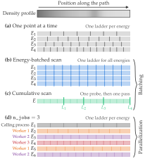
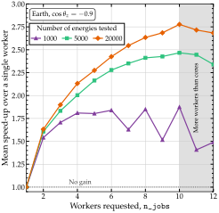

Performance
=============

.. contents::
   :local:
   :depth: 2

What a probability costs, what sets that cost, and the population every tuned constant was
measured on.  The first sections follow the batching, timing and cost sections of the Magνs
paper.

Speed
-------

A single three-flavor probability through the Earth takes about 2 ms at the default tolerance
of ``rtol = atol = 1e-3``.  Across 164 Earth and solar configurations -- two to five flavors,
standard and non-standard Hamiltonians, neutrinos and antineutrinos -- the median call takes
2 ms and the slowest under a second.

**How these times are measured.**  Every timing in the paper comes from one machine and one
software stack; absolute times mean little on their own, so ratios are quoted where possible.
A comparison of two code paths runs on a harness that interleaves them round-robin and carries
a control workload the change cannot touch (``docs/dev/adversarial_batteries/timing.py``).  A
factor of two or more survives a change of machine; a few percent belongs to the machine.  The
first call of a session compiles or loads the Numba kernels (see
:ref:`the backend section <expm-backend>`), so it is discarded, and each setting is timed in
blocks of at least 50 ms, the fastest of three.

Batching and parallelization
~~~~~~~~~~~~~~~~~~~~~~~~~~~~

   Four ways a scan is computed, along one density profile.  Each bar is the final
   slab grid of one refinement ladder; its color marks the process that runs it.
   (a) One point at a time.  (b) The energy-batched scan: one grid shared by every
   energy.  (c) The cumulative scan: one energy, every requested baseline in one pass.
   (d) ``n_jobs=3``: the first point in the calling process, the rest shared among
   three workers.  From the Magνs paper.

A request for many probabilities can be made faster in two ways, which act differently and
mostly do not combine.

**Batching** means passing an array in one call.  Computed one point at a time, a scan of
:math:`N` energies runs :math:`N` refinement ladders; the energy-batched scan runs one ladder
for all of them, sampling the profile once per slab, and the cumulative scan covers every
baseline at one energy in a single pass.  Where the potential does not vary, the
constant-Hamiltonian engine computes the whole scan as one batch of exponentials.  Against the
same points computed one at a time, this is worth one to two orders of magnitude, at every
number of flavors from two to five.  Arrays of energies and baselines of equal length are
paired element by element.  If ``H`` does not vary along the path, such pairs are still batched;
if it varies, each pair is computed on its own.  For every energy at each of several baselines,
make one call per baseline, with the full array of energies.

**Parallelization** means computing points in several processes, with ``n_jobs``.  The first
point runs in the calling process and the rest are shared among the workers, each on the
per-point path, so all :math:`N` ladders still run, several at a time.  A parallel scan agrees
with a serial one to the tolerance, not bit for bit.

   Speed-up against ``n_jobs``, for scans of 1 000, 5 000 and 20 000 energies along an
   Earth chord at :math:`\cos\theta_z = -0.9`, each energy with its own baseline so
   that every run takes the per-point path.  From the Magνs paper.

On ten cores, ten processes finish scans of 1 000, 5 000 and 20 000 energies 1.9, 2.5 and 2.8
times as fast as one: the gain grows with the scan and stays far from ten.  The two do not
combine: the energy-batched scan and the constant-Hamiltonian engine answer only at
``n_jobs=1``, and any other value sends the scan to the per-point path.  On 5 000 energies
along the chord at :math:`\cos\theta_z = -0.9`, the batched path takes 0.11 s in one process,
and ten processes take 1.1 s.  So pass arrays and leave ``n_jobs=1``; raise it only for a scan
no batched engine accepts, such as one where every energy has its own baseline.

The batched and per-point paths agree to within the tolerance, not bit for bit: the batched
scan runs one refinement ladder for all the energies, the per-point path one ladder per point.
Along an Earth chord at :math:`\cos\theta_z = -0.7`, 40 energies from 0.5 to 20 GeV differ by up
to 3.8e-5 at the default tolerance of 1e-3.  A scan whose serial work would take under a second runs in the
calling process even when ``n_jobs > 1``, since starting the workers costs more.

**Threads.**  ``n_jobs`` uses processes.  Calls made from several threads of one process are
safe as well: each call keeps its own per-call state, so concurrent calls return the serial
answer bit for bit, and a ``strategy`` or ``strategy_info`` in one thread does not reach
another.  They do not run faster for it, since most of a call holds Python's global
interpreter lock.

**The refinement ladder works against these savings.**  It computes every slab count below the
one that converges and discards them: on an Earth chord, about three to four times the cost of a call
given the right slab count in advance (:doc:`methodology`).

The palindrome, and what it is worth
~~~~~~~~~~~~~~~~~~~~~~~~~~~~~~~~~~~~~~

A chord through a spherically symmetric Earth meets every radius twice, so its density
profile reads the same from either end.  :func:`magnus.magnus.magnus_expansion_multislab`
evaluates :math:`A` on the first half of such a slab chain and derives the rest by
reversal.  This halves the evaluations of the user's Hamiltonian **and nothing else**:
the matrix exponentials and the commutators are unchanged.  The saving is therefore worth
exactly what those evaluations cost.  Measured through
:func:`magnus.oscprob.osc_prob_earth`, ``costhz = -0.9``, 2 GeV, against a vectorized
``H_func`` whose cost scales per position:

.. list-table::
   :header-rows: 1
   :widths: 50 25 25

   * - Workload
     - Speed-up
     - Note
   * - single point, plain PREM
     - 0.905×
     - a density lookup is too cheap to be worth halving
   * - single point, expensive ``H_func``
     - **1.41×-1.67×**
     -
   * - 12- and 40-energy scan, expensive ``H_func``
     - **1.56×-1.64×**
     - falls to the general ladder, so the mirror applies
   * - energy scan, standard PREM
     - 1.00×
     - answered by the separable engine; see below

The ceiling is 1.67× rather than 2× because the refinement ladder and the unpaired middle
slab of an odd chain cut Hamiltonian evaluations from 159 positions to 93, not quite in
half.

**A standard PREM energy scan gains nothing.**  It is answered by the separable engine,
which already evaluates the profile once for all the energies, a larger saving of the same
kind.  Measured,
that engine spends a fraction :math:`f` = 0.001-0.026 of its time in the profile, which
caps any possible mirror gain at 1.001×-1.013×.

**Symmetry is declared, not detected.**  Detecting it would need the very evaluations that
the mirroring skips.  The slab *widths* are no guide: a monotonic, solar-like profile on a
uniform grid has symmetric widths, and mirroring it would be wrong by 3.3e-01.  The Earth
entry points therefore declare the symmetry, since a chord meets every radius twice by
geometry.  The declaration covers the interval over which the profile is symmetric, the
full chord, so a request for a shorter baseline takes the ordinary path.

Set :data:`magnus.magnus.USE_PALINDROME` to ``False`` to evaluate every slab in full.  The
two routes agree to a few times 1e-15 rather than bitwise, because the mirrored slab's
nodes are reached as ``(L - b) + h*s`` on one route and ``a + h*s`` on the other -- two
floating-point expressions for the same real number.  On Earth single points that is worth
up to 8.6e-15 relative.

.. _expm-backend:

The matrix exponential, and which backend computes it
~~~~~~~~~~~~~~~~~~~~~~~~~~~~~~~~~~~~~~~~~~~~~~~~~~~~~~

Every slab ends in a matrix exponential, and ``np.linalg.eigh`` costs **about 1.27 µs per
3×3 whatever the stack size** -- measured 1.268 µs at N = 108 and 1.279 µs at N = 4096,
flat, because it loops over LAPACK internally instead of vectorizing over the stack.
:data:`magnus.magnus.EXPM_BACKEND` selects between that and the compiled kernels in
:mod:`magnus.expmkernels` -- ``'numba'`` means the Cayley-Hamilton kernel at dimensions 2
and 3 and the Jacobi eigensolver at 4 and 5.  The Cayley-Hamilton kernel applies to
:math:`K` the polynomial interpolating :math:`\exp(-i\lambda)` on its spectrum -- no
eigenvectors, and the eigenvalues in closed form.

Interleaved round-robin, minima of many repetitions, with a control the change cannot
touch:

.. list-table:: The exponential alone, :math:`\exp(-iK)` for a stack of N matrices
   :header-rows: 1
   :widths: 10 12 20 20 20

   * - d
     - N
     - ``eigh``
     - ``numba``
     - Speed-up
   * - 3
     - 1
     - 14.2 µs
     - 7.4 µs
     - 1.9×
   * - 3
     - 108
     - 162.6 µs
     - 23.8 µs
     - **6.8×**
   * - 3
     - 4096
     - 6467 µs
     - 934 µs
     - **6.9×**
   * - 2
     - 108
     - 94.0 µs
     - 12.9 µs
     - **7.3×**
   * - 2
     - 1024
     - 716.9 µs
     - 54.5 µs
     - **13.2×**

.. list-table:: End to end, through ``osc_prob`` (interleaved; control 1.00×)
   :header-rows: 1
   :widths: 46 27 27

   * - Workload
     - Speed-up
     - Note
   * - 3ν PREM, 60-energy scan
     - **2.11×**
     - 9291 µs → 4409 µs (73.5 µs per energy)
   * - 3ν PREM chord, single point
     - 1.22×
     - dominated by the refinement ladder
   * - 3ν vacuum, single point
     - 1.11×
     - and see the constant-Hamiltonian engine below, which is the larger win here
   * - 3ν constant density, single point
     - 1.09×
     -

**A 6.8× faster exponential makes a call 2.1× faster.**  If the exponential takes a
fraction :math:`f` of the time, making it 6.8× faster speeds up the call by
:math:`1/((1-f) + f/6.8)` (Amdahl's law).  The scan's 2.11× corresponds to
:math:`f \approx 0.6`, and the single point's 1.22× to :math:`f \approx 0.2`, close to the
quarter of a single 108-slab pass that ``eigh`` takes when profiled.  Across the
workloads above, the end-to-end speed-up is 1.1× to 2.1×, not 6.8×.

**At N = 1 the exponential is no longer the thing to optimize.** ``eigh`` on one 3×3 costs
3.5 µs, and reaching it through ``_expm_stack`` costs 14.2 µs -- the
difference is the anti-Hermiticity test and the temporaries around it, which do not shrink
with the stack.  That fixed cost, not the exponential, is what caps the single-point rows
above.

**Dimensions 4 and 5 use a compiled Jacobi eigensolver, not ``eigh``.**  A 4×4 or 5×5
Hermitian eigenproblem has no practical closed form, but the speed-up does not come from a
closed form.  It comes from removing ``eigh``'s fixed LAPACK overhead per matrix, about 2.3 µs
on a 4×4, two thirds of the cost.  A batched Jacobi eigensolver, started for each matrix from
the eigenvectors of the previous one, avoids that overhead: on a 13 000-slab chain, the
exponential stage is 2.6× faster at 4ν and 1.7× at 5ν than with ``eigh``.  Unlike the kernels
for d ≤ 3, it is iterative, so its results are not bit-identical to ``eigh``'s.  Its error is
within 6.4× of ``eigh``'s at every norm, clustering and degeneracy measured, inside the
factor of 10 required of the closed forms.  :func:`magnus.expmkernels.supports_dim` decides
which dimensions use a compiled kernel.

Neither backend is unitary to the last bit: :math:`U^\dagger U - I` measures 4e-16 for a
single 3×3 and 4e-15 for a stack of 4096, growing with stack size and never reaching zero.
Against a 40-digit reference the kernel is the same order or slightly better at every norm
from :math:`\lVert K \rVert` = 1 to 1e5 **on unclustered spectra**, and both degrade linearly
in that norm, which is the conditioning of the problem rather than a property of either route.
A whole probability, built from many such factors, deviates by :math:`3\times10^{-12}` to
:math:`1.6\times10^{-11}` at worst.

The qualifier "on unclustered spectra" matters.  Where nearly degenerate eigenvalues meet a
large norm, the closed form loses accuracy, because :math:`\arccos` has an infinite derivative
at :math:`u = \pm 1`: it reached 2.7e-07 there, against 3.0e-11 for ``eigh``.
:data:`magnus.expmkernels.SEV_TOL` sends such matrices to ``eigh``, which brings the worst
absolute error over the whole grid of separations and norms to 8.7e-14.  On real work (PREM
chords, solar slab chains, constant density, NSI), the fraction of matrices sent to ``eigh``
this way rounds to 0.00%.

Switching backend moves probabilities by at most 4.6e-15 across PREM chords, energy scans,
NSI resonances, constant density and vacuum -- except on a solar profile at
``strategy='magnus'``, which chains 33,575 slab exponentials and drifts 3.0e-12, within the
:math:`N\epsilon` = 7.4e-12 that an ordered product of that length allows.

numba is a required dependency, so ``'auto'`` reaches the compiled kernel on any
ordinary install.  It costs about 90 ms of ``import magnus``; the first call on a machine
compiles the kernels, about 2 s, and later sessions load them from the disk cache in about
0.1 s.  Because it is required, a Python release that numba has no wheel for yet cannot
install the package.

The ``'eigh'`` fallback is still there and still correct -- ``'auto'`` degrades to it if
the import fails for any reason, and nothing but speed changes, every result agreeing to
~1e-15.

Two more steps are compiled.  First, the separable energy scan multiplies its slab
operators in a Numba kernel.  Its results can differ from the NumPy route, used when Numba
is unavailable, at the 1e-14 level: at most 1.28e-14 across 16 scan configurations, with
every refinement decision unchanged.  Second, the commutators of the Magnus schemes run in
a Numba kernel that computes ``X @ Y - Y @ X`` in one pass over the stack, instead of two
batched matrix products whose cost, at these sizes, is mostly call overhead.  On the two
benchmark profiles, this makes each slab of the order-4 scheme 2.0-2.2x cheaper at three
flavors and 3.1-3.4x at two; orders 6 and 8, with three and six commutators per slab, gain
2.5-3.0x and 1.9-2.8x.  At four and five flavors the gain is about 1.1x, and on the
cumulative-quadrature methods, whose time goes to the integrals, it is negligible.
Probabilities move by at most 6.7e-14 across 36 configurations, with every refinement
decision and warning unchanged.

A constant Hamiltonian needs no ladder at all
~~~~~~~~~~~~~~~~~~~~~~~~~~~~~~~~~~~~~~~~~~~~~~

When :math:`V_\text{CC}` does not vary with position, neither does :math:`H`, and the Magnus
series **terminates at its first term**: :math:`\Omega_1 = -iH\Delta`, and every higher
:math:`\Omega_k` is a nested commutator of :math:`H` with itself, hence zero.  So
:math:`U = \exp(-iH\Delta)` is not an approximation to be refined but the exact answer, and an
entire energy scan is one stacked exponential over an ``(nE, d, d)`` array.

.. list-table:: Against the per-point route (interleaved; control 1.00×)
   :header-rows: 1
   :widths: 16 22 22 20

   * - Flavors
     - Matter scan
     - Vacuum scan
     - Single point
   * - 2ν
     - **17.3×**
     - **24.7×**
     - 2.0×
   * - 3ν
     - **15.5×**
     - **18.9×**
     - 2.1×
   * - 4ν
     - 7.2×
     - 7.4×
     - 1.4×
   * - 5ν
     - 6.0×
     - 6.2×
     - 1.4×

The 4ν and 5ν rows were measured with ``eigh`` as their exponential; the Jacobi eigensolver
they use is worth a further 1.8-1.9× at 4ν and 1.5-1.6× at 5ν end to end.  In absolute terms a 3ν constant-density probability costs 3.9 µs under the
paper's protocol (:doc:`comparison`), and what remains is wrapper parameter resolution rather
than arithmetic: a code built for the constant case alone, such as NuFast-LBL, is cheaper.

Results are bit-identical to the per-point route on every flavor count and both neutrino signs.
``n_slabs``, ``n_tpts_per_slab``, ``t_breakpoints`` and ``rtol``/``atol`` are accepted and
ignored, because they can only ask for a refinement of something already exact.

**PREM and exponential profiles are untouched** -- their potential varies with position, so they
keep ``separable``, ``ip_exp`` or ``hybrid``.  A constant-H engine that captured one would
propagate a whole chord with a single exponential of a single Hamiltonian: wrong by O(1) and
still perfectly unitary, which is why ``tests/test_engines.py`` asserts the engine *identity*
for PREM and the Sun rather than only comparing numbers.

.. _how-constants-were-set:

How the constants were set
----------------------------

Every calibration constant is listed here with the measurement that set it, or with an
explicit statement that it has none.

Measured
~~~~~~~~~~

.. list-table::
   :header-rows: 1
   :widths: 26 12 62

   * - Constant
     - Value
     - Population it was measured on
   * - :data:`magnus.adiabatic.GAMMA_TO_ERROR`
     - 0.85
     - 149 configurations: resonance width over a decade, d = 2…5, 5–80 MeV, 0.5–2 density
       scale heights, pure adiabatic operator scored against ``solve_ivp``.  **Restricted to
       the small-γ rows the rule governs**; the maximum over all rows overestimates it.
   * - :data:`magnus.adiabatic.RESOLUTION_RATIO`
     - 0.70
     - 192 smooth configurations (ceiling 0.602) against 15 random piecewise-constant ones
       (1.000), plus a deliberately weak jump 4.7× smaller than the steepest smooth step
       (0.773).
   * - :data:`magnus.oscprob.BATCH_WORKING_ENTRIES`
     - 65 536
     - Fifteen workloads on three batched engines, d = 2…5, scans of 60 to 20 000 points,
       swept over 1 / 4.2 / 12.6 / 67 / 268 MB.  1 MB won eight of the eleven memory-bound
       rows and was never worse than the previous 67 MB: **1.19×-1.38×** on Earth energy
       scans, growing with both flavor count and scan length, 1.06×-1.16× on cumulative
       baseline scans, flat within 2 % on short scans.  The interaction-picture engine is
       flat at 1.00× -- it is compute-bound, so the constant does not reach it.  Every row
       was **bit-identical at every budget**, tiles being independent and only
       concatenated, so this is a pure performance knob.  Measured on one machine (13 MB
       L3, 6.5 MB L2), and note the optimum sits *below* the last-level cache, so sizing
       to a detected cache would land on a worse value than this fixed constant does.
   * - ``_local_evolution_operator`` ``max_n_slabs``
     - 32 768
     - Legitimate patches converge at 800–12 800 slabs; a patch covering 88 % of a solar
       trajectory needs 102 400 and should decline. 32 768 sits in the factor-of-eight gap.
   * - :data:`magnus.oscprob.HYBRID_YIELDS_TO_CUMULATIVE_MIN_POINTS`
     - 8
     - Cost/accuracy crossover, measured over scan sizes and 42 workloads: the cumulative
       scan is cheaper at the median at every size, and three to six orders of magnitude more
       accurate on the scans it answers.
   * - :data:`magnus.oscprob.HYBRID_YIELDS_TO_CUMULATIVE_MIN_POINTS_TIGHT`
     - 2
     - The same threshold below a tolerance of 1e-6: there the cumulative scan took 0.06 to
       0.18 of the hybrid's time at the median over 110 scans, with no silent miss the hybrid
       did not also make (``docs/dev/measurements/issue125_baseline_scans/``).
   * - :data:`magnus.oscprob.QUADRATURE_SEED_MIN_SLABS`
     - 4
     - 212 energy-batched scans, 2 to 40 energies, smooth and breakpoint profiles,
       ``'trapezoid'`` and ``'simpson'``, ``rtol = atol`` = 1e-3 and 1e-4, work with the
       phase-based starting slab count against without it: a seed of 2 cost up to 2.14× the
       work and of 3 up to 1.24×; from 4 up it never cost any (worst 0.87× at 4, 0.36× at 5).
   * - :data:`magnus.oscprob.BATCHED_PHASE_GROUPING`
     - 0.17 / 0.44 / 1.8 / 3.2 us per slab-energy at d = 2…5; 0.15 us per shared slab;
       250 us per level; resolution law 22 S^0.71 (1e-8/tol)^0.18; margin 1.2; floor
       ``atol + 0.01 rtol`` >= 1e-4; four flavors or more
     - The cost model that splits an energy-batched scan into groups of energies with
       similar phase, each on its own grid.  The costs per slab and per level come from
       timings at 1 to 4096 slabs and 1 to 4 energies on an Earth chord.  The slab count
       at which an energy converges is fitted over 183 ladders of 4ν and 5ν scans at
       rtol = 1e-4 to 1e-8 (rms factor 1.32).  On a 4ν scan with
       :math:`\Delta m^2_{41}` = 1 eV², 40 energies at 0.5-5 GeV, the grouping cuts the time
       from **650 ms to 215 ms** (370 ms point by point).  The tolerance floor comes from
       174 scans scored against 1e-9 references: split at rtol = atol = 1e-6, five returned
       an energy outside the tolerance without a warning, against none on one grid.
       Two- and three-flavor scans are never split: at three flavors, splitting saved
       17-30% but raised the largest error across the core from 5.5e-5 to 1.0e-3.
   * - :data:`magnus.oscprob.CUMULATIVE_N_ACC_SAFETY`
     - 4
     - The longest baseline sets the grid; shorter ones in the same scan would have chosen a
       denser one for themselves.
   * - :data:`magnus.adiabatic.LOCAL_JUMP_RATIO`
     - 0.5
     - 79 flagged intervals over 1440 smooth configurations (ceiling **0.087**) against 348 over
       432 piecewise ones (floor **1.000**). Swept over *sub-intervals*, the axis the original
       ``RESOLUTION_RATIO`` measurement did not have.
   * - ``find_resonance_candidates`` ``fd_step_frac``
     - 1e-6
     - Scored against the **analytic** :math:`dH/dl`. The optimum moves with the profile's
       shortest length scale (1e-5 solar, 1e-6 sinusoid, 1e-7 for a narrow bump), but anywhere
       in 1e-8…1e-5 the relative error stays below 3e-09 -- six orders below anything that
       could move a probability here. **The band, not the value, is what to preserve.**
   * - ``hybrid_propagator`` ``threshold0``
     - 0.1
     - See :data:`magnus.adiabatic.THRESHOLD0_PROVENANCE`. Accuracy identical at every value in
       16 of 18 rows at a fixed baseline, and a lower start up to **6.5×** cheaper -- but a
       tolerance-derived start made an **energy scan 20× worse** (2.5e-05 → 4.95e-04), a
       workload that population did not contain, so the default stays at 0.1.
   * - :data:`magnus.adiabatic.HIDDEN_FEATURE_CONCENTRATION`
     - 0.3
     - 67 smooth and resolvable profiles (ceiling **0.060**) against features in the
       unresolvable band (0.91–1.00). **0 false positives at every threshold from 0.2 to 0.6**;
       0.3 maximizes detection (68–90 %) at five times the measured ceiling.
   * - :data:`magnus.adiabatic.N_HIDDEN_FEATURE_SUBDIVISION`
     - 8
     - Calls of one to three points; scans of 4 to 15 points use 16 and longer ones 32.  Chosen
       on cost, not on the statistic (which is flat in it): 0.37 ms against 2.85 ms at 32,
       where the arrays stop fitting in cache.
   * - ``n_probe0``, ``n_points0``, ``patch_atol``, ``n_slabs0``, ``growth_factor_n_slabs``,
       ``min_n_tpts_per_slab``
     - 200, 201, 1e-7, 400, 1.5, 2
     - Swept across **18 workloads spanning single points, baseline scans and energy scans** ×
       3 profile families × d = 2, 3. The worst error is **4.49e-04 at essentially every value
       of every one of them**: these set where a doubling ladder starts, and the ladder reaches
       the same place regardless. ``patch_atol`` at 1e-9 is the one exception and is not really
       about this constant -- see :func:`magnus.adiabatic.hybrid_propagator`.
   * - ``min_threshold``
     - 1e-6
     - Identical at every value over 18 ordinary workloads, because the ladder stops long
       before the floor. **The regime it governs was then constructed rather than assumed**:
       the floor is reached only when :math:`\gamma_\max` is below it *and* the tolerance is
       tighter than ``GAMMA_TO_ERROR`` :math:`\times \gamma_\max`. There it does change
       behavior (a window opens below :math:`\gamma_\max`) but not usefully --
       ``certified=False`` at every value, error three orders inside tolerance either way, and
       the window costs 2.4× the time.

Not measured
~~~~~~~~~~~~~~

The following constants were not set by a measurement.  They are listed so that they are
not mistaken for measured ones.

``max_n_probe`` (6400), ``max_n_points`` (12864) and ``max_iters`` (12) in
:mod:`magnus.adiabatic`; ``max_num_loops`` (50) in :mod:`magnus.oscprob`.

All four are **cost ceilings rather than calibrations**: they bound work, and reaching one is
reported by :class:`magnus.oscprob.ToleranceNotAchievedWarning`.  Leaving them unmeasured is
therefore less of a risk than for a threshold that decides an outcome without a warning.  The
constants that *do* decide an outcome appear in the table above, or,
for the refinement and routing gates (:data:`magnus.oscprob.MIN_EFFECTIVE_REFINEMENT`,
:data:`magnus.oscprob.AUTO_LADDER_MAX_PHASE`, :data:`magnus.oscprob.AUTO_LADDER_MIN_TOLERANCE`,
:data:`magnus.oscprob.AUTO_LADDER_TIGHT_MAX_PHASE`), with their measurements in their own
documentation.

Reproducing any of this
-------------------------

The measurements on this page come from scripts under ``docs/dev/adversarial_batteries/`` and
``docs/dev/measurements/``.  The latter has one directory per measurement, with a README and,
for most, the outputs.  The main scripts of the former:

.. list-table::
   :header-rows: 1
   :widths: 34 66

   * - Script
     - What it measures
   * - ``crosscheck_acceptance.py``
     - Whether a cross-check between engines would have caught the known silent misses.
       Runs against either tree via ``PYTHONPATH``.
   * - ``invariants.py``
     - The oracle-free invariants, swept over a profile matrix.
   * - ``warn_fp.py``
     - Every warning's true- and false-positive rate.
   * - ``constants_audit.py``, ``constants_audit2.py``
     - Provenance for the calibration constants above; the second sweeps 18 workloads spanning
       points, baseline scans and energy scans.
   * - ``resolution_fp.py``
     - The resolution test's false-positive rate, swept over sub-intervals.
   * - ``weak_band.py``, ``crosscheck_benefit.py``
     - Where the hybrid path's self-certification is weak, and whether a default-path
       cross-check would earn its cost.  It does not; see :ref:`safeguard-limits`.
   * - ``battery2.py`` … ``battery10_coverage.py``
     - The original adversarial batteries; see
       ``docs/dev/FINDINGS_ADVERSARIAL_VALIDATION.md``.

See also :doc:`adiabatic_strategy` for the hybrid strategy's derivation and validation, and
``docs/dev/FINDINGS_ADVERSARIAL_VALIDATION.md`` for the adversarial validation these
safeguards came out of.
