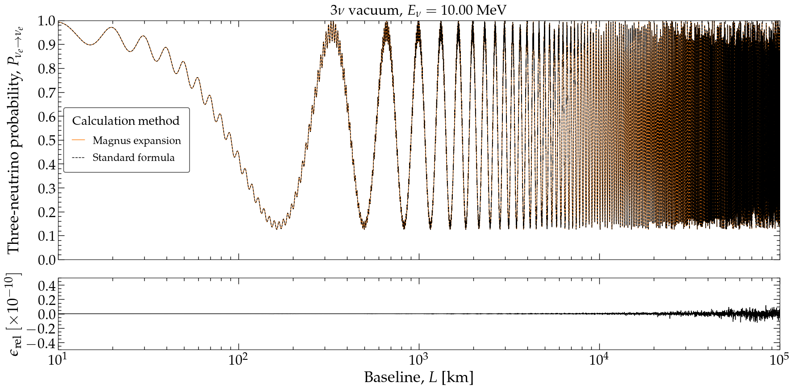
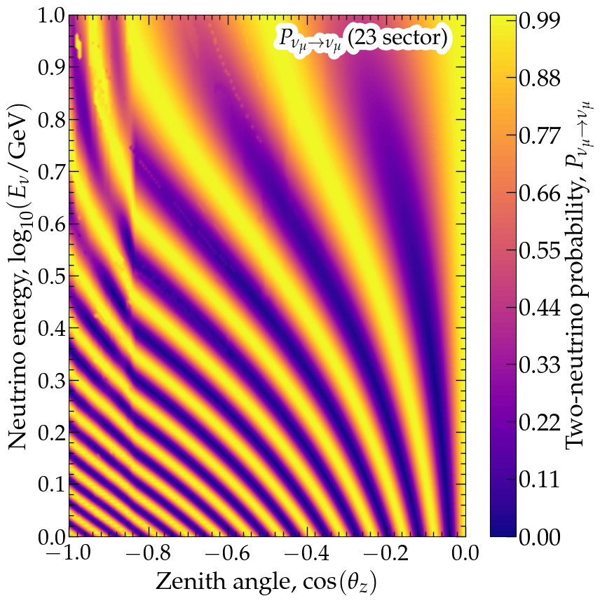
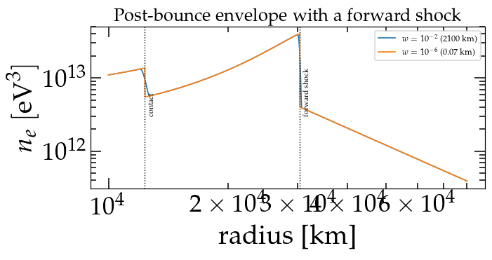
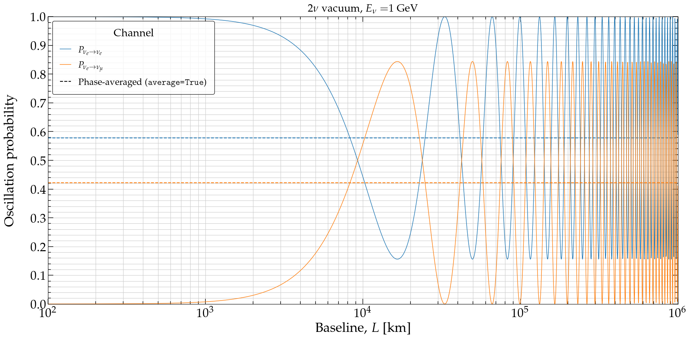
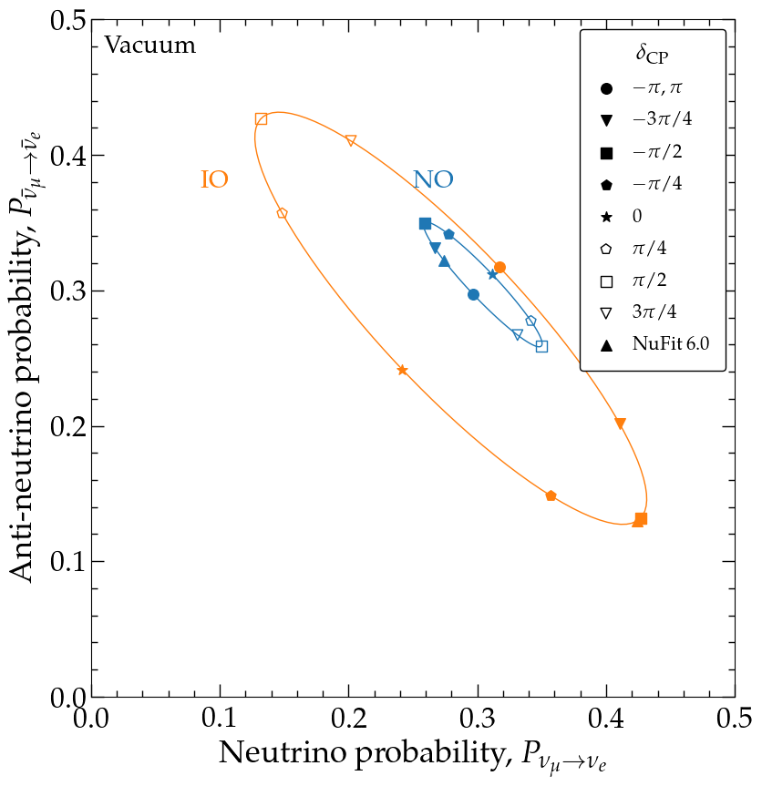

Numerical recipes
=================

What **Magνs** can compute, with the code that computes it.

Each recipe below is a few lines. Where one is short enough to be worth running
on the spot, it is executed when this page is built, so the output shown is what
the code actually produced rather than what it produced once. The longer form of
every recipe is a notebook, linked beside it; both call the same functions, so
there is no third version to drift out of step.

If you are looking for *which function* rather than *how to call it*, see
:doc:`functions`, which lays out the whole ``osc_prob_*`` family by environment
and flavour count.

.. contents::
   :local:
   :depth: 1

One probability
---------------

The shortest useful thing the library does: an energy, a baseline, and the
oscillation parameters it defaults to.

.. jupyter-execute::

    import numpy as np

    import magnus.globaldefs as gd
    import magnus.oscprob as oscprob

    P = oscprob.osc_prob_3nu_vacuum(1.0*gd.UNIT_GEV, 1300.0*gd.UNIT_KM)

    print('P_ee   = %.6f' % np.asarray(P)[0][0])
    print('P_mue  = %.6f' % np.asarray(P)[1][0])

The return is the probability matrix, indexed ``P[nu_i][nu_f]``: the *initial*
flavour first. Pass ``nu_i`` and ``nu_f`` to get a single channel instead of the
matrix. Full walk-through:
`notebook 01 <https://github.com/mbustama/Magnus/blob/main/notebooks/01_magnus_introduction.ipynb>`_.

A scan, without a loop
----------------------

Pass arrays and the whole scan is one call. This is the single most useful thing
to know about using Magνs well: the engines batch over the energy axis, and for a
position-dependent Hamiltonian the matter profile is then built once for the whole
scan rather than once per point.

.. jupyter-execute::

    energies = np.logspace(-1.0, 1.5, 500)*gd.UNIT_GEV
    baselines = np.full(500, 1300.0*gd.UNIT_KM)

    P = np.asarray(oscprob.osc_prob_3nu_vacuum(energies, baselines))

    print('shape returned:', P.shape)
    print('P_mue at the first three energies:', np.round(P[:3, 1, 0], 6))

A batched call returns ``(n_points, d, d)``, with the point index **first**, so
``P[:, 1, 0]`` is :math:`P_{\mu e}` along the scan.

   Three-flavour vacuum oscillations.

Writing your own ``H_func`` so that it accepts an *array* of positions is the
other half of this, and is worth a factor of several: see
:ref:`write-h-func-vectorised` below.

Through the Earth
-----------------

Give a zenith angle and the chord, its PREM density profile, and the slab edges
aligned with the layer boundaries all follow.

.. jupyter-execute::

    import magnus.earth as earth

    costhz = -0.5
    L = earth.distance_traveled_inside_earth(costhz)*gd.UNIT_KM

    P = np.asarray(oscprob.osc_prob_3nu_earth(10.0*gd.UNIT_GEV, costhz=costhz, L=L))

    print('chord   = %.0f km' % (L/gd.UNIT_KM))
    print('P_mue   = %.6f' % P[1][0])

The PREM layer boundaries are inserted as mandatory slab edges automatically, so
the quadrature never integrates across a density discontinuity. Notebooks
`02 <https://github.com/mbustama/Magnus/blob/main/notebooks/02_magnus_2nu_vacuum_matter.ipynb>`_
and
`03 <https://github.com/mbustama/Magnus/blob/main/notebooks/03_magnus_3nu_vacuum_matter.ipynb>`_
cover the Earth alongside the other profiles;
`06 <https://github.com/mbustama/Magnus/blob/main/notebooks/06_magnus_oscillograms.ipynb>`_
turns it into an oscillogram.

   Probability across zenith angle and energy in one call.

A profile of your own
---------------------

Any callable returning a density as a function of position works. The Sun's
exponential profile ships as a helper, and carries a tag that lets the
interaction-picture fast path recognise it.

.. jupyter-execute::

    import magnus.matter as matter

    profile = matter.exp_density_profile(gd.NUM_DENSITY_E_SUN_CENTRAL,
                                         gd.L_SCALE_SUN)
    osc = gd.OSC_PARAMS_PREDEFINED['OSC_PARAMS_DEFAULT']

    P = np.asarray(oscprob.osc_prob_matter_std_potential(
        2, profile, 10.0e6, 0.3*gd.SUN_RADIUS*gd.UNIT_KM,
        {'sth': osc['s12'], 'Dm2': osc['D21']},
        L0=0.0, density_is_of_number_of_electrons=True))

    print('P_ee = %.6f' % P[0][0])

Notebooks
`13 <https://github.com/mbustama/Magnus/blob/main/notebooks/13_magnus_tabulated_solar_model.ipynb>`_
and
`14 <https://github.com/mbustama/Magnus/blob/main/notebooks/14_magnus_supernova_shock.ipynb>`_
do this with a real tabulated solar model and with a supernova shock front, and
are the two places the package's limits are shown rather than asserted.

   A sharp shock front, where the error is an envelope rather than a phase and
   averaging does not rescue it.

Phase-averaged probabilities
----------------------------

When the oscillation phase is unresolvable — a source far enough away, or an
energy resolution wide enough — the observable is the average, not the
instantaneous value. Ask for it directly rather than averaging a scan by hand.

.. jupyter-execute::

    kw = dict(L0=0.0, density_is_of_number_of_electrons=True)
    params = {'sth': osc['s12'], 'Dm2': osc['D21']}
    L_sun = 0.3*gd.SUN_RADIUS*gd.UNIT_KM

    inst = np.asarray(oscprob.osc_prob_matter_std_potential(
        2, profile, 10.0e6, L_sun, params, **kw))
    avg = np.asarray(oscprob.osc_prob_matter_std_potential(
        2, profile, 10.0e6, L_sun, params, average=True, **kw))

    print('instantaneous P_ee = %.6f' % inst[0][0])
    print('phase-averaged     = %.6f' % avg[0][0])

This matters for accuracy as well as for physics: an error that is a *phase*
disappears under averaging, and one that is an *envelope* does not. See
:doc:`averaged_probability`, and
`notebook 10 <https://github.com/mbustama/Magnus/blob/main/notebooks/10_magnus_averaged_probability.ipynb>`_.

   What survives when the phase is unresolvable.

Asking for an accuracy instead of a slab count
----------------------------------------------

``n_slabs`` fixes the discretisation, not the error. Pass ``rtol``/``atol``
instead — they are on by default at ``1e-3`` — and the slab grid is refined until
two successive levels agree.

.. jupyter-execute::

    info = {}
    oscprob.osc_prob_3nu_earth(10.0*gd.UNIT_GEV, costhz=costhz, L=L,
                               rtol=1e-6, atol=1e-6, convergence_info=info)

    print('slabs used      : %d' % info['n_slabs'])
    print('slab edges used : %d   (PREM boundaries included)' % info['n_slab_edges'])
    print('tolerance met   : %s' % info['tolerance_achieved'])

**Read the tolerance for what it is.** It is a stopping criterion, not a
guarantee: the ladder halts when two levels agree, and never estimates the error
of the answer it returns. Usually that is conservative; it is not always. The
``rtol`` entry of :func:`magnus.oscprob.osc_prob` says what it does and does not
promise, and :ref:`what-rtol-atol-control` gives the measured detail.

``convergence_info`` reports what the ladder did — including
``tolerance_achieved``, which is the programmatic form of
:class:`~magnus.oscprob.ToleranceNotAchievedWarning`. There is deliberately no
error estimate in it; the same section explains why.

Choosing a strategy, and seeing which engine answered
-----------------------------------------------------

``strategy='auto'`` (the default) tries an adiabatic-transport-plus-Magnus-patch
propagator first and falls back silently. ``'magnus'`` is the pre-1.0.0 route.
The difference is not only speed: on solar configurations the fallback can be
*fast and wrong*.

.. jupyter-execute::

    report = {}
    oscprob.osc_prob_matter_std_potential(
        2, profile, 10.0e6, L_sun, params, strategy_info=report, **kw)

    print('engine that answered:', report['engine'])

Pass ``strategy_info`` whenever you want to know which of the engines produced a
number. See :doc:`adiabatic_strategy`, and
`notebook 12 <https://github.com/mbustama/Magnus/blob/main/notebooks/12_magnus_adiabatic_hybrid_strategy.ipynb>`_,
which times all three against ``solve_ivp``.

Telling it where the profile is not smooth
------------------------------------------

High-order quadrature converges at its nominal order only inside a smooth slab.
If your profile has a jump or a kink, pass its position as a mandatory slab edge;
no number of slabs fixes one that straddles it.

.. code-block:: python

    breakpoints = earth.prem_layer_edges_along_chord(costhz)*gd.UNIT_KM

    P = oscprob.osc_prob_matter_std_potential(
        3, rho_func, energy, L, osc_params, L0=0.0,
        t_breakpoints=breakpoints)

The Earth entry points do this for you. It is worth doing by hand for a shock
front, a castle-wall profile, or a tabulated model with a discontinuous
derivative — and on a *scan* it is an established cure, while on a single point
it is not: measured across 18 shock configurations it improved 7 and worsened 11.
`Notebook 14 <https://github.com/mbustama/Magnus/blob/main/notebooks/14_magnus_supernova_shock.ipynb>`_
is that measurement.

New physics
-----------

Non-standard interactions, Lorentz-invariance violation and sterile states are
each a different Hermitian matrix in the same slot, so they are the same
calculation with a different Hamiltonian.

.. code-block:: python

    # NSI: an extra matter potential with off-diagonal couplings
    P = oscprob.osc_prob_3nu_earth_nsi(energy, costhz=costhz, L=L,
                                       eps_ee=0.1, eps_em=0.05, eps_et=0.0,
                                       eps_mm=0.0, eps_mt=0.0, eps_tt=0.0)

    # LIV: an energy dependence the vacuum term does not have
    P = oscprob.osc_prob_3nu_earth_liv(energy, costhz=costhz, L=L,
                                       b1=1.0e-23, b2=0.0, b3=0.0)

    # 3+1 sterile: the same machinery at one dimension higher
    P = oscprob.osc_prob_4nu_earth(energy, costhz=costhz, L=L,
                                   s12=s12, s23=s23, s13=s13, d13=d13,
                                   s14=0.1, s24=0.1, s34=0.0,
                                   D21=D21, D31=D31, D41=1.0)

   Neutrino against antineutrino as the CP phase runs, for both mass orderings.

Notebooks
`07 <https://github.com/mbustama/Magnus/blob/main/notebooks/07_magnus_bsm_sterile_nu.ipynb>`_,
`08 <https://github.com/mbustama/Magnus/blob/main/notebooks/08_magnus_bsm_nsi.ipynb>`_
and
`09 <https://github.com/mbustama/Magnus/blob/main/notebooks/09_magnus_bsm_liv.ipynb>`_
work through each.

.. _write-h-func-vectorised:

Writing an ``H_func`` that does not cost you a factor of five
-------------------------------------------------------------

If you supply your own Hamiltonian, the single largest factor under your control
is whether it can be evaluated for many positions at once. The engine samples it
at every quadrature node of every slab — often a few hundred positions for one
probability, repeated at each refinement level.

.. code-block:: python

    # Slow: one position at a time
    def H_func(l):
        VCC = matter.VCC_func(l, num_density_e_func)
        return (1.0/energy)*h_vac + hamiltonians.hamiltonian_3nu_matter(VCC)

    # Fast: the same physics, all positions at once
    e00 = np.diag([1.0, 0.0, 0.0])
    def H_func(l):
        l = np.asarray(l, dtype=float)
        VCC = vcc_of(l)                       # returns an array
        return (1.0/energy)*h_vac + VCC[..., None, None]*e00

The trailing ``[..., None, None]`` is the whole trick: it turns one potential per
position into a stack of matrices, so NumPy broadcasts instead of Python looping.
Measured at **4.6x** on a 3ν exponential-density profile, with bit-identical
output. A scalar-only ``H_func`` raises
:class:`~magnus.magnus.ScalarHamiltonianWarning` once per session, naming the fix.

Where to go next
----------------

* :doc:`tutorials` — the same calculations with the reasoning around them.
* :doc:`functions` — every ``osc_prob_*`` function, by environment and flavour.
* :doc:`methodology` — what the Magnus expansion is and why it is unitary at any
  order.
* :doc:`engines` — which engine answers a call, and how the choice is made.
* :doc:`performance` — the constants and the populations they were measured on.
* :doc:`diagnostics` — what each safeguard cannot do, and what every warning means.
* :doc:`cli` — the same calculations from a shell.
