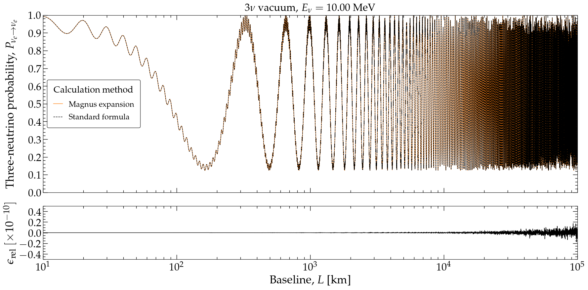
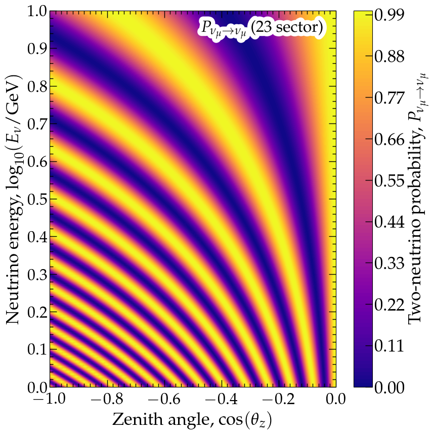
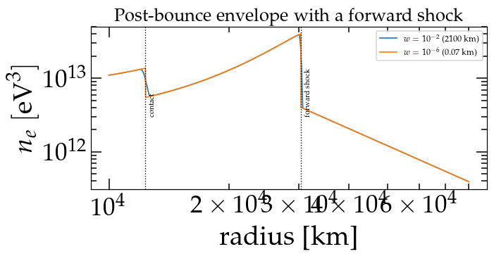
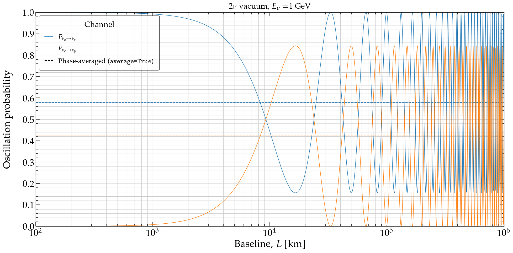
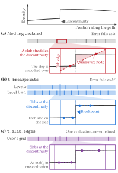
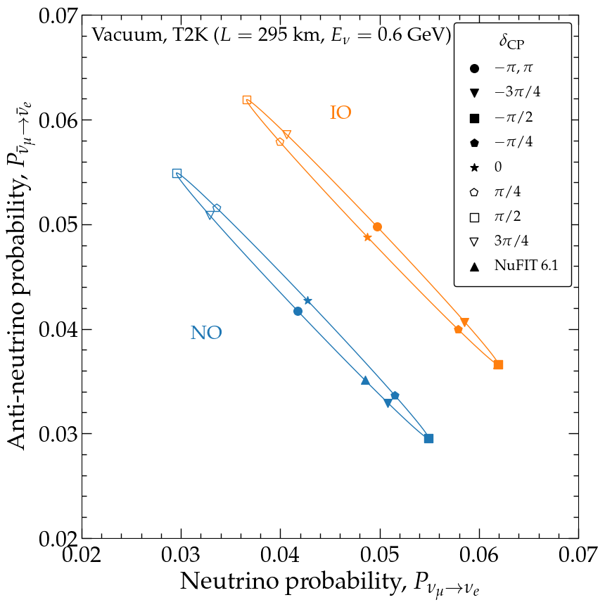

Numerical recipes
=================

What **Magνs** can compute, with the code that computes it.

Each recipe below is a few lines. Where one is short enough to be worth running
on the spot, it is executed when this page is built, so the output shown is what
the code actually produced rather than what it produced once. The longer form of
most recipes is a notebook, linked beside it; both call the same functions, so
there is no third version to drift out of step.

If you are looking for *which function* rather than *how to call it*, see
:doc:`functions`, which lays out the whole ``osc_prob_*`` family by environment
and flavor count.

.. contents::
   :local:
   :depth: 1

One probability
---------------

The shortest useful thing the library does: an energy, a baseline, and the
oscillation parameters it defaults to.

.. jupyter-execute::

    import numpy as np

    import magnus.globaldefs as gd
    import magnus.oscprob as oscprob

    P = oscprob.osc_prob_3nu_vacuum(1.0*gd.UNIT_GEV, 1300.0*gd.UNIT_KM)

    print('P_ee   = %.6f' % np.asarray(P)[0][0])     # 0.928948
    print('P_mue  = %.6f' % np.asarray(P)[1][0])     # 0.031266

The return is the probability matrix, indexed ``P[nu_i][nu_f]``: the *initial*
flavor first. Pass ``nu_i`` and ``nu_f`` to get a single channel instead of the
matrix. Full walk-through:
`notebook 01 <https://github.com/mbustama/Magnus/blob/main/notebooks/01_magnus_introduction.ipynb>`_.

The evolution operator, for observables built from amplitudes
----------------------------------------------------------------

A probability is a modulus squared. When the observable needs the amplitudes
themselves -- the content of each mass eigenstate in the state that leaves a
dense source, and from it the flavor composition at a detector so far away
that the phases have averaged -- ask any entry point for the evolution
operator alongside the probabilities. The refinement ladder then converges the
operator itself, phases included.

.. jupyter-execute::

    import magnus.hamiltonians as hams

    OSC = gd.load_nufit_params('NuFIT 6.1')
    P, U = oscprob.osc_prob_3nu_matter_exp_density(
        1.0*gd.UNIT_GEV, 5000.0*gd.UNIT_KM, 0.0, 10.0, 1000.0*gd.UNIT_KM,
        density_matter_is_in_g_per_cm3=True, return_evolution_operator=True,
        n_slabs=32, **OSC)

    # The mixing matrix in vacuum, the medium past the source; then the
    # mass-state content of what leaves, and the flavor content far away
    R = hams.pmns_mixing_matrix(OSC['s12'], OSC['s23'], OSC['s13'], OSC['dCP'])
    content = abs(R.conj().T @ U)**2
    P_far = abs(R)**2 @ content

    print('at the edge of the source, P_ee = %.4f' % np.asarray(P)[0][0])   # 0.7818
    print('far away, phases averaged, P_ee = %.4f' % P_far[0, 0])           # 0.4929

``P`` is what the same call returns without the keyword; ``U`` is complex and
unitary, indexed ``U[final, initial]``, so ``(abs(U)**2).T`` is ``P``. See
:doc:`functions` for what the keyword does to the engine dispatch and the two
combinations it refuses.

A scan, without a loop
----------------------

Pass arrays and the whole scan is one call. This is the single most useful thing
to know about using Magνs well: the engines batch over the energy axis, and for a
position-dependent Hamiltonian the matter profile is then built once for the whole
scan rather than once per point.

.. jupyter-execute::

    energies = np.logspace(-1.0, 1.5, 500)*gd.UNIT_GEV
    baselines = np.full(500, 1300.0*gd.UNIT_KM)

    P = np.asarray(oscprob.osc_prob_3nu_vacuum(energies, baselines))

    print('shape returned:', P.shape)
    print('P_mue at the first three energies:', np.round(P[:3, 1, 0], 6))

A batched call returns ``(n_points, d, d)``, with the point index **first**, so
``P[:, 1, 0]`` is :math:`P_{\mu e}` along the scan.

   Three-flavor vacuum oscillations.

Writing your own ``H_func`` so that it accepts an *array* of positions is the
other half of this, and is worth a factor of several: see
:ref:`write-h-func-vectorized` below.

Through the Earth
-----------------

Give a zenith angle and the chord, its PREM density profile, and the slab edges
aligned with the layer boundaries all follow.

.. jupyter-execute::

    import magnus.earth as earth

    costhz = -0.5
    L = earth.distance_traveled_inside_earth(costhz)*gd.UNIT_KM

    P = np.asarray(oscprob.osc_prob_3nu_earth(10.0*gd.UNIT_GEV, costhz=costhz, L=L))

    print('chord   = %.0f km' % (L/gd.UNIT_KM))
    print('P_mue   = %.6f' % P[1][0])                 # 0.132224

A detector underground is the same call with its depth named. The zenith angle
is measured at the detector, so the baseline follows from the geometry and is
computed rather than given. A buried detector also sees downward-going
neutrinos through its overburden, which a detector on the surface has no path
for at all.

.. jupyter-execute::

    depth = 2.0*gd.UNIT_KM

    for costhz_det in (-0.5, 1.0):
        L_km = earth.distance_traveled_inside_earth(
            costhz_det, detector_depth=depth/gd.UNIT_KM)
        P_buried = np.asarray(oscprob.osc_prob_3nu_earth(
            10.0*gd.UNIT_GEV, costhz=costhz_det, detector_depth=depth))
        print('costhz = %5.2f: %10.3f km, P_mumu = %.6f'
              % (costhz_det, L_km, P_buried[1][1]))

PREM's outermost shell is 3 km of global-average ocean, which a detector under
rock or ice is not sitting under. Replace its density with
``density_matter_ocean``, and its composition with ``electron_fraction_ocean``.
Both matter for a trajectory close to horizontal, which can spend its whole
length inside that shell.

The PREM layer boundaries are inserted as mandatory slab edges automatically, so
the quadrature never integrates across a density discontinuity. Notebooks
`02 <https://github.com/mbustama/Magnus/blob/main/notebooks/02_magnus_2nu_vacuum_matter.ipynb>`_
and
`03 <https://github.com/mbustama/Magnus/blob/main/notebooks/03_magnus_3nu_vacuum_matter.ipynb>`_
cover the Earth alongside the other profiles;
`06 <https://github.com/mbustama/Magnus/blob/main/notebooks/06_magnus_oscillograms.ipynb>`_
turns it into an oscillogram.

   Probability across zenith angle and energy: one batched energy scan per zenith
   angle.

Between two named sites
-----------------------

Two site names replace ``costhz`` and ``L``: the chord between them is the
baseline, and ``magnus.earth.loc_coords_dms`` lists the sites.

.. jupyter-execute::

    import warnings
    from magnus.magnus import MagnusConvergenceWarning

    E_beam = np.logspace(np.log10(0.3), 1.0, 5)*gd.UNIT_GEV

    for site in ('homestake', 'snolab', 'cern'):
        a, b = earth.loc_coords_dms['fermilab'], earth.loc_coords_dms[site]
        L_km = earth.chord_length_inside_earth(a['lat'], a['lon'], b['lat'], b['lon'])
        with warnings.catch_warnings():      # expected on these chords; see diagnostics
            warnings.simplefilter('ignore', MagnusConvergenceWarning)
            P_site = np.asarray(oscprob.osc_prob_3nu_earth(
                E_beam, loc_ini='fermilab', loc_fin=site, nu_i=gd.NUMU, nu_f=gd.NUE))
        print('fermilab -> %-9s %6.0f km   P_mue:' % (site, L_km), np.round(P_site, 4))

`Notebook 04 <https://github.com/mbustama/Magnus/blob/main/notebooks/04_magnus_long_baseline.ipynb>`_
draws these, with T2K, Hyper-K and ESS.

DUNE: neutrinos and antineutrinos through PREM
----------------------------------------------

The full appearance and disappearance spectra at DUNE, Fermilab to the Homestake
mine, over 200 energies: one call for neutrinos and one for antineutrinos.

.. jupyter-execute::

    import time
    import warnings
    from magnus.magnus import MagnusConvergenceWarning

    E_dune = np.logspace(np.log10(0.5), 1.0, 200)*gd.UNIT_GEV     # 0.5 to 10 GeV

    def dune(nubar):
        with warnings.catch_warnings():      # expected on this chord; see diagnostics
            warnings.simplefilter('ignore', MagnusConvergenceWarning)
            return np.asarray(oscprob.osc_prob_3nu_earth(
                E_dune, loc_ini='fermilab', loc_fin='homestake', nubar=nubar))

    dune(False)                              # the first call pays the set-up

    t0 = time.perf_counter()
    P_nu = dune(False)
    P_nubar = dune(True)
    t1 = time.perf_counter()

    i = np.argmax(np.where(E_dune > 1.5*gd.UNIT_GEV, P_nu[:, 1, 0], 0.0))
    print('shape:', P_nu.shape)                                          # (200, 3, 3)
    print('first maximum at %.2f GeV' % (E_dune[i]/gd.UNIT_GEV))         # 2.06 GeV
    print('P_mue = %.4f, P_mue-bar = %.4f' % (P_nu[i, 1, 0], P_nubar[i, 1, 0]))   # 0.0799, 0.0143
    print('both spectra: %.1f ms' % (1e3*(t1 - t0)))

The two spectra take a few milliseconds together once warm (under 10 ms on a CI runner); the
first call of a session costs a few hundred milliseconds more, spent on set-up.
The gap between ``P_mue`` and ``P_mue-bar`` is the matter effect together with
:math:`\delta_{\rm CP}`: the chord is 1285 km, and the default ordering is normal.

An oscillogram
--------------

An energy scan is one batched call; an oscillogram is one such call per zenith
angle.  The result has one row per zenith angle.

.. jupyter-execute::

    import warnings
    from magnus.magnus import MagnusConvergenceWarning

    cos_grid = np.linspace(-1.0, -0.1, 40)
    E_grid = np.logspace(0.0, 1.5, 60)*gd.UNIT_GEV

    with warnings.catch_warnings():      # expected on a few chords; see diagnostics
        warnings.simplefilter('ignore', MagnusConvergenceWarning)
        P_mumu = np.array([
            oscprob.osc_prob_3nu_earth(
                E_grid, costhz=c, L=earth.distance_traveled_inside_earth(c)*gd.UNIT_KM,
                nu_i=gd.NUMU, nu_f=gd.NUMU)
            for c in cos_grid])

    print('shape:', P_mumu.shape, '  smallest P_mumu = %.3f' % P_mumu.min())

:func:`magnus.plotting.plot_oscillogram` computes and draws the same map in one
call (see :doc:`plotting`).  To draw this array with it instead, pass ``P_mumu.T``:
it takes one row per energy.

A profile of your own
---------------------

Any callable returning a density as a function of position works. The Sun's
exponential profile ships as a helper, and carries a tag that lets the
interaction-picture fast path recognize it.  For the Sun itself, twelve published
standard solar models ship as well, and the Sun wrappers take them by name
(see :doc:`solar_models`).

.. jupyter-execute::

    import magnus.matter as matter

    profile = matter.exp_density_profile(gd.NUM_DENSITY_E_SUN_CENTRAL,
                                         gd.L_SCALE_SUN)
    osc = gd.load_nufit_params('NuFIT 6.1')

    # arguments: flavors, density, energy, baseline, oscillation parameters
    P = np.asarray(oscprob.osc_prob_matter_std_potential(
        2, profile, 10.0*gd.UNIT_MEV, 0.3*gd.SUN_RADIUS*gd.UNIT_KM,
        {'sth': osc['s12'], 'Dm2': osc['D21']},
        L0=0.0, density_is_of_number_of_electrons=True))

    print('P_ee = %.6f' % P[0][0])                    # 0.483533

Notebooks
`13 <https://github.com/mbustama/Magnus/blob/main/notebooks/13_magnus_tabulated_solar_model.ipynb>`_
and
`14 <https://github.com/mbustama/Magnus/blob/main/notebooks/14_magnus_supernova_shock.ipynb>`_
do this with a real tabulated solar model and with a supernova shock front, and
are the two places the package's limits are shown rather than asserted.

   A sharp shock front, where the error is an envelope rather than a phase and
   averaging does not rescue it.

Phase-averaged probabilities
----------------------------

When the oscillation phase is unresolvable — a source far enough away, or an
energy resolution wide enough — the observable is the average, not the
instantaneous value. Ask for it directly rather than averaging a scan by hand.

.. jupyter-execute::

    kw = dict(L0=0.0, density_is_of_number_of_electrons=True)
    params = {'sth': osc['s12'], 'Dm2': osc['D21']}
    L_sun = 0.3*gd.SUN_RADIUS*gd.UNIT_KM

    inst = np.asarray(oscprob.osc_prob_matter_std_potential(
        2, profile, 10.0*gd.UNIT_MEV, L_sun, params, **kw))
    avg = np.asarray(oscprob.osc_prob_matter_std_potential(
        2, profile, 10.0*gd.UNIT_MEV, L_sun, params, average=True, **kw))

    print('instantaneous P_ee = %.6f' % inst[0][0])
    print('phase-averaged     = %.6f' % avg[0][0])    # 0.410154

This matters for accuracy as well as for physics: an error that is a *phase*
disappears under averaging, and one that is an *envelope* does not. See
:doc:`averaged_probability`, and
`notebook 10 <https://github.com/mbustama/Magnus/blob/main/notebooks/10_magnus_averaged_probability.ipynb>`_.

   What survives when the phase is unresolvable.

Flavor composition of astrophysical neutrinos
---------------------------------------------

From a source 100 Mpc away every oscillation has averaged out, so the flavor
composition at Earth is the source composition times the averaged probability
matrix.

.. jupyter-execute::

    E_astro = np.array([1e3, 1e5])*gd.UNIT_GEV                 # 1 TeV and 100 TeV
    L_src = 100.0*3.0857e19*gd.UNIT_KM                          # 100 Mpc
    f_source = np.array([1/3, 2/3, 0.0])                        # pion decay

    P_avg = np.asarray(oscprob.osc_prob_3nu_vacuum(E_astro, L_src, average=True))
    for E_i, P_i in zip(E_astro, P_avg):
        f_earth = f_source @ P_i
        print('%6.0f TeV   (f_e, f_mu, f_tau) at Earth =' % (E_i/gd.UNIT_TEV),
              np.round(f_earth, 3))

New physics changes the matrix, and with it the composition;
`notebook 29 <https://github.com/mbustama/Magnus/blob/main/notebooks/29_magnus_pseudo_dirac.ipynb>`_
does this for pseudo-Dirac pairs.

Asking for an accuracy instead of a slab count
----------------------------------------------

``n_slabs`` fixes the discretization, not the error. Pass ``rtol``/``atol``
instead — they are on by default at ``1e-3`` — and the slab grid is refined until
two successive levels agree.

.. jupyter-execute::

    info = {}
    oscprob.osc_prob_3nu_earth(10.0*gd.UNIT_GEV, costhz=costhz, L=L,
                               rtol=1e-6, atol=1e-6, convergence_info=info)

    print('slabs used      : %d' % info['n_slabs'])
    print('slab edges used : %d   (PREM boundaries included)' % info['n_slab_edges'])
    print('tolerance met   : %s' % info['tolerance_achieved'])

**Read the tolerance for what it is.** It is a stopping criterion, not a
guarantee: the ladder halts when two levels agree, and never estimates the error
of the answer it returns. Usually that is conservative; it is not always. The
``rtol`` entry of :func:`magnus.oscprob.osc_prob` says what it does and does not
promise, and :ref:`what-rtol-atol-control` gives the measured detail.

``convergence_info`` reports what the ladder did — including
``tolerance_achieved``, which is the programmatic form of
:class:`~magnus.oscprob.ToleranceNotAchievedWarning`. There is deliberately no
error estimate in it; the same section explains why.

Choosing a strategy, and seeing which engine answered
-----------------------------------------------------

``strategy='auto'`` (the default) picks the engine from the phase of the request, its
shape and the tolerance: at the default tolerance a single point goes to the general
Magnus ladder unless its phase exceeds 1e4 or it needs too many slabs, when it goes to an
adiabatic-transport-plus-Magnus-patch propagator, and an energy scan goes to the
energy-batched scan.  :ref:`dispatch-order` has the full table.  ``'hybrid'`` forces the
adiabatic propagator, and ``'magnus'`` keeps to the Magnus engines.  The difference is not
only speed: on the NSI configurations notebook 12 measures, ``'magnus'`` is the faster
route and the less accurate one, raising ``ToleranceNotAchievedWarning`` rather than
answering quietly.

.. jupyter-execute::

    report = {}
    oscprob.osc_prob_matter_std_potential(
        2, profile, 10.0*gd.UNIT_MEV, L_sun, params, strategy_info=report, **kw)

    print('engine that answered:', report['engine'])

Pass ``strategy_info`` whenever you want to know which of the engines produced a
number. See :doc:`adiabatic_strategy`, and
`notebook 12 <https://github.com/mbustama/Magnus/blob/main/notebooks/12_magnus_adiabatic_hybrid_strategy.ipynb>`_,
which times ``'auto'``, ``'hybrid'`` and ``'magnus'`` against ``solve_ivp``.

Checking an answer two ways
---------------------------

:func:`~magnus.oscprob.cross_check_strategies` runs the same call through every
engine that applies and reports how far their answers spread.  Engines of different
families fail in different ways, so agreement between them is stronger evidence
than any one engine's own convergence check.

.. jupyter-execute::

    check = oscprob.cross_check_strategies(
        oscprob.osc_prob_3nu_sun, np.array([5.0, 8.0, 10.0])*gd.UNIT_MEV,
        0.5*gd.SUN_RADIUS*gd.UNIT_KM, 0.0)

    print('engines that ran              :', check['ran'])
    print('largest spread                : %.1e' % check['max_spread'])
    print('largest spread across families: %.1e' % check['max_spread_independent'])

The spread across engine families is the one that counts: two engines of the same
family share their failure modes, and when only one family applies the function
says so with :class:`~magnus.oscprob.CrossCheckInconclusiveWarning`.  A large spread
is reported, never raised; read it before trusting a number that matters.

When a spread is large, look first at ``check['unverified']``: the engines that said
they did not reach the tolerance.  A spread involving one of them points at that
engine.  ``check['max_spread_verified']`` is the spread across families among the
others.  On the Sun at 1 MeV, a certified hybrid 3.8e-5 from a fine reference and a
slab ladder capped at 20 000 slabs 1.9e-3 from it gave a 1.9e-3 spread; the ladder is
the one listed as unverified.

Telling it where the profile is not smooth
------------------------------------------

High-order quadrature converges at its nominal order only inside a smooth slab.
If your profile has a jump or a kink, pass its position as a mandatory slab edge;
no number of slabs fixes one that straddles it.

   What a density jump does to a slab, and the two ways of declaring it.  Nothing
   declared, one slab straddles the jump and the quadrature sees a straight line across
   it (shaded).  ``t_breakpoints`` adds the jump to the refinement grid;
   ``t_slab_edges`` replaces the grid.  From the Magνs paper.

.. code-block:: python

    osc = gd.load_nufit_params('NuFIT 6.1')

    def rho_func(l):                              # [g/cm^3]: a jump at 1000 km
        return np.where(np.asarray(l) < 1000.0*gd.UNIT_KM, 3.0, 8.0)

    P = oscprob.osc_prob_matter_std_potential(
        3, rho_func, 10.0*gd.UNIT_GEV, 3000.0*gd.UNIT_KM, osc, L0=0.0,
        t_breakpoints=[1000.0*gd.UNIT_KM], density_matter_is_in_g_per_cm3=True)

The Earth entry points do this for you. It is worth doing by hand for a shock
front, a castle-wall profile, or a tabulated model with a discontinuous
derivative.  On a *scan* it is an established cure.  On a single point the per-point
path already finds and declares the jumps itself (:ref:`warning-catalogue`), so
passing them only skips that search.  The exception is a single phase-averaged point
(``average=True``): there declaring a shock front changes the engine, and across 18
shock configurations it improved 7 and worsened 11, so check such a point a second way.
`Notebook 14 <https://github.com/mbustama/Magnus/blob/main/notebooks/14_magnus_supernova_shock.ipynb>`_
is that measurement.

A layered profile, exactly
--------------------------

A piecewise-constant profile -- a castle wall -- is exact once its slab edges are
declared: inside each layer the Hamiltonian is constant, and one exponential per
layer is the whole answer.

.. jupyter-execute::

    # 24 layers of 250 km, alternating 2 and 8 g/cm^3
    n_layers, width = 24, 250.0*gd.UNIT_KM
    rho_layers = np.where(np.arange(n_layers) % 2 == 0, 2.0, 8.0)
    edges = np.arange(n_layers + 1)*width

    def castle_wall(l):
        k = np.searchsorted(edges, l, side='right') - 1
        return rho_layers[np.clip(k, 0, n_layers - 1)]

    E_cw = np.array([1.0, 2.0, 4.0])*gd.UNIT_GEV
    for nubar in (False, True):
        P_cw = oscprob.osc_prob_matter_std_potential(
            3, castle_wall, E_cw, n_layers*width, gd.load_nufit_params('NuFIT 6.1'),
            t_breakpoints=edges[1:-1], nubar=nubar, nu_i=gd.NUMU, nu_f=gd.NUE,
            density_matter_is_in_g_per_cm3=True)
        print('nubar=%-5s P_mue at 1, 2, 4 GeV:' % nubar, np.round(P_cw, 4))

The same mean density arranged differently gives different probabilities;
`notebook 18 <https://github.com/mbustama/Magnus/blob/main/notebooks/18_magnus_unusual_density_profiles.ipynb>`_
compares four arrangements.

New physics
-----------

Non-standard interactions, Lorentz-invariance violation and sterile states are
each a different Hermitian matrix in the same slot, so they are the same
calculation with a different Hamiltonian.

.. code-block:: python

    energy = 10.0*gd.UNIT_GEV
    costhz = -0.5
    L = earth.distance_traveled_inside_earth(costhz)*gd.UNIT_KM
    osc = gd.load_nufit_params('NuFIT 6.1')

    # NSI: couplings relative to the standard potential; unset ones are zero,
    # diagonal ones are real, off-diagonal ones may be complex
    P = oscprob.osc_prob_3nu_earth_nsi(energy, costhz=costhz, L=L, **osc,
                                       eps_ee=0.1, eps_em=0.05j)

    # LIV: an energy dependence the vacuum term does not have (b's and Lambda in eV)
    P = oscprob.osc_prob_3nu_earth_liv(energy, costhz=costhz, L=L, **osc,
                                       b1=1.0e-23, b2=0.0, b3=0.0,
                                       Lambda=1.0e9, n_liv=1)

    # 3+1 sterile: the same machinery at one dimension higher
    P = oscprob.osc_prob_4nu_earth(energy, costhz=costhz, L=L, **osc,
                                   s14=0.1, s24=0.1, s34=0.0, D41=1.0)

   Neutrino against antineutrino as the CP phase runs, for both mass orderings.

Notebooks
`07 <https://github.com/mbustama/Magnus/blob/main/notebooks/07_magnus_bsm_sterile_nu.ipynb>`_,
`08 <https://github.com/mbustama/Magnus/blob/main/notebooks/08_magnus_bsm_nsi.ipynb>`_
and
`09 <https://github.com/mbustama/Magnus/blob/main/notebooks/09_magnus_bsm_liv.ipynb>`_
work through each.

.. _write-h-func-vectorized:

Writing an ``H_func`` that takes many positions at once
-------------------------------------------------------

If you supply your own Hamiltonian, the single largest factor under your control
is whether it can be evaluated for many positions at once. The engine samples it
at every quadrature node of every slab — often a few hundred positions for one
probability, repeated at each refinement level.

.. code-block:: python

    energy = 1.0*gd.UNIT_GEV
    h_vac = hams.hamiltonian_3nu_vacuum_energy_independent(**OSC)
    e00 = np.diag([1.0, 0.0, 0.0])

    def vcc(l):                                   # [eV], falls exponentially
        return 1.0e-13*np.exp(-np.asarray(l, dtype=float)/(500.0*gd.UNIT_KM))

    # Slow: one position at a time
    def H_slow(l):
        return h_vac/energy + float(vcc(l))*e00

    # Fast: the same physics, all positions at once
    def H_fast(l):
        return h_vac/energy + vcc(l)[..., None, None]*e00

    P = oscprob.osc_prob(H_fast, t_ini=0.0, t_fin=10000.0*gd.UNIT_KM,
                         rtol=1e-8, atol=1e-8)

The trailing ``[..., None, None]`` is the whole trick: it turns one potential per
position into a stack of matrices, so NumPy broadcasts instead of Python looping.
The output is bit-identical, and the gain grows with the number of positions the
ladder evaluates.  For the call above, which ends at 378 slabs, ``H_fast`` is about
5× faster than ``H_slow``; at the default tolerance (22 slabs) about 2×; over 1000 km
at the default tolerance (2 slabs) the gain is small and not reliable (best of 15 runs,
on one machine).  A scalar-only ``H_func`` raises
:class:`~magnus.magnus.ScalarHamiltonianWarning` once per session, naming the fix.

The builders in :mod:`magnus.hamiltonians` do this for you: each takes its energy, ``VCC``
or position as a number or an array, and an array returns a stack of matrices, one per
entry.  ``hams.hamiltonian_3nu_nsi`` builds only the NSI term, so a full NSI matter
Hamiltonian is ``h_vac/energy + vcc(l)[..., None, None]*e00 + hams.hamiltonian_3nu_nsi(vcc(l),
0.1, 0.05, 0.0, 0.0, 0.0, 0.0)``, already vectorized.

Where to go next
----------------

* :doc:`tutorials` — the same calculations with the reasoning around them.
* :doc:`functions` — every ``osc_prob_*`` function, by environment and flavor.
* :doc:`methodology` — what the Magnus expansion is and why it is unitary at any
  order.
* :doc:`engines` — which engine answers a call, and how the choice is made.
* :doc:`performance` — the constants and the populations they were measured on.
* :doc:`diagnostics` — what each safeguard cannot do, and what every warning means.
* :doc:`cli` — the same calculations from a shell.
